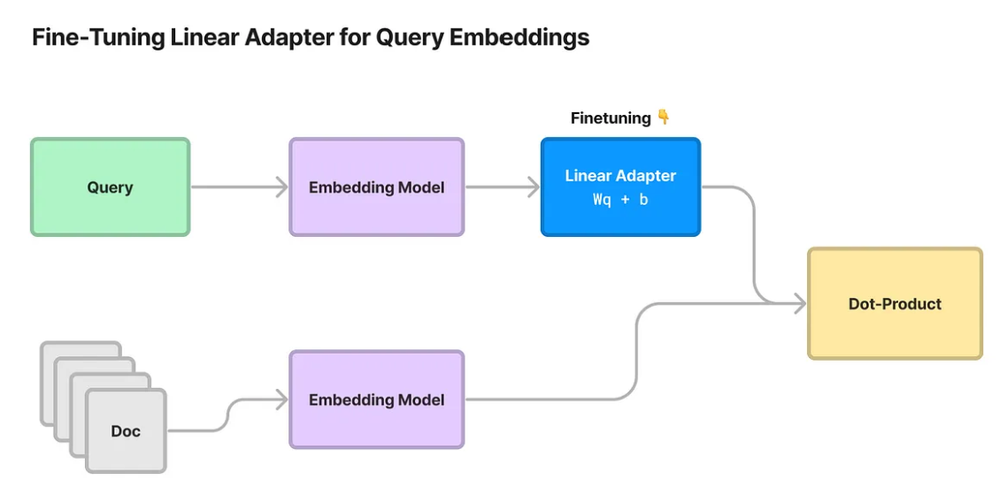
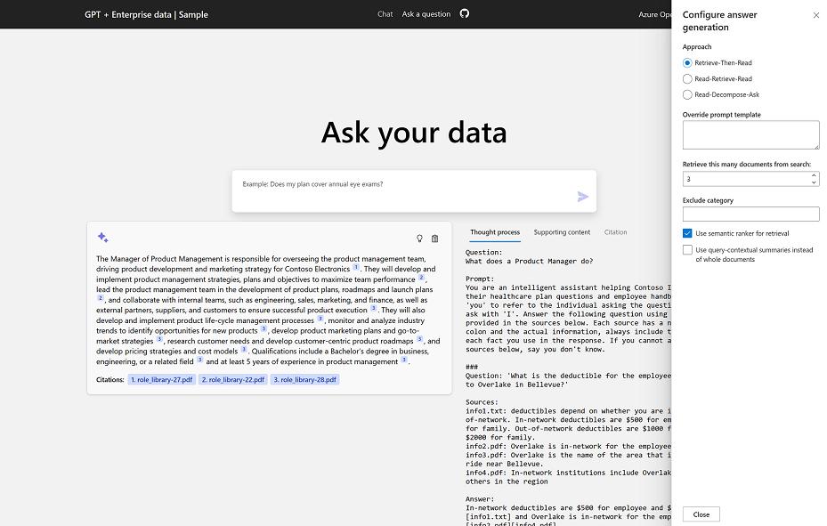
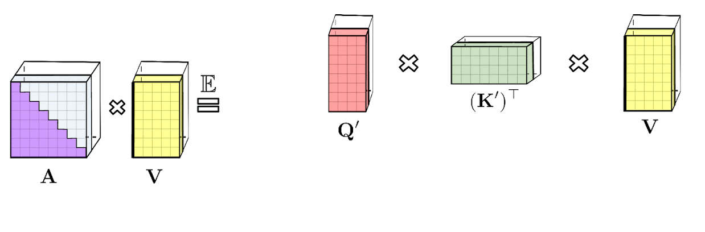

# Azure OpenAI + LLMs (Large Language Models)

This repository contains references to Azure OpenAI, LLM, related services, and libraries.

> Disclaimer: Not being able to keep up with and test every recent update, sometimes I simply copied them into this repository for later review. Please be aware that `some content may be outdated.`

> `Writing Rule`: 1. Brief each item on one or a few lines as much as possible.
> 2. The release dates are determined by the date of the initial commit of the README, the History of Activity, the Article published date, or the Paper v1 issued date.

## What's the difference between Azure OpenAI and OpenAI?

1. OpenAI is a better option if you want to use the latest features like plug-ins, and access to the latest models.
1. Azure OpenAI is recommended if you require a reliable, secure, and compliant environment.
1. Azure OpenAI provides seamless integration with other Azure services..
1. Azure OpenAI offers `private networking` and `role-based authentication`, and responsible `AI content filtering`.
1. Azure OpenAI does not use user input as training data for other customers. [Data, privacy, and security for Azure OpenAI](https://learn.microsoft.com/en-us/legal/cognitive-services/openai/data-privacy)

- [What is Azure OpenAI Service?](https://learn.microsoft.com/en-us/azure/cognitive-services/openai/overview)
- [Open AI Models](https://platform.openai.com/docs/models)

## Table of contents

- **Section 1** : [RAG, LlamaIndex, and Vector Storage](#section-1-rag-llamaindex-and-vector-storage)
  - [RAG (Retrieval-Augmented Generation) & LlamaIndex](#what-is-the-rag-retrieval-augmented-generation)
  - [Vector Database Comparison](#vector-database-comparison)
  - [Vector Database Options for Azure](#vector-database-options-for-azure)
  - [Lucene based search engine with text-embedding-ada-002](#lucene-based-search-engine-with-text-embedding-ada-002)
- **Section 2** : [Azure OpenAI and Reference Architecture](#section-2--azure-openai-and-reference-architecture)
  - [Microsoft LLM Framework](#microsoft-azure-openai-relevant-llm-framework)
  - [Microsoft Copilot Product lineup](#microsoft-copilot-product-lineup)
  - [ChatGPT + Enterprise data Demo and Azure OpenAI samples](#chatgpt--enterprise-data-demo-and-azure-openai-samples)
  - [Azure Reference Architectures](#azure-reference-architectures)
  - [Azure AI Search](#azure-ai-search)
  - [Azure Enterprise Services](#azure-enterprise-services)
- **Section 3** : [Microsoft Semantic Kernel](#section-3--microsoft-semantic-kernel)
  - [Semantic Kernel Overview](#semantic-kernel-overview)
- **Section 4** : [Langchain - Features, Usage, and Comparisons](#section-4--langchain---features-usage-and-comparisons)
  - [Langchain Feature Matrix & Cheetsheet](#langchain-feature-matrix--cheetsheet)
  - [Langchain Summarizer](#langchain-chain-type-summarizer)
  - [Langchain Agent](#langchain-agent)
  - [Criticism to Langchain](#criticism-to-langchain)
  - Comparison: [Langchain vs Its Competitors](#comparison-langchain-vs-its-competitors)
  - [Lanchain vs LlamaIndex](#langchain-vs-llamaindex)
  - [Langchain vs Semantic Kernel vs Azure ML (Prompt flow)](#langchain-vs-semantic-kernel-vs-azure-machine-learning-prompt-flow)
  - [Prompt template language](#prompt-template-language)
- **Section 5** : [Prompt Engineering, Finetuning, and Visual Prompts](#section-5-prompt-engineering-finetuning-and-visual-prompts)
  - 1.Prompt Engineering
  - [Prompt Engineering](#1-prompt-engineering)
  - [Prompt Guide & Leaked prompts](#prompt-guide--leaked-prompts)
  - 2.Finetuning & Model Compression
  - [Advanced Finetuning](#2-finetuning--model-compression): PEFT incl. LoRA
  - [Leveraging Llama2 for Fine-Tuning](#llama-2-finetuning): Llama 2
  - [Reinforcement Learning from Human Feedback (RLHF) and SFT](#rlhf-reinforcement-learning-from-human-feedback--sft-supervised-fine-tuning)
  - [Quantization Techniques](#quantization-techniques)<!-- : [[contd.](.\files\backup\README_SBCs.md)] -->
  - [Pruning and Sparsification](#pruning-and-sparsification)
  - [Knowledge Distillations](#knowledge-distillation-reducing-model-size-with-textbooks): Reducing Model Size with Textbooks
  - [Other optimization technique](#large-transformer-model-inference-optimization)
  - 3.Visual Prompting
  - [What is the Visual Prompting?](#3-visual-prompting)
- **Section 6** : [Challenges and Solutions in Large Language Models](#section-6--large-language-model-challenges-and-solutions)
  - [Context Constraints](#context-constraints): incl. RoPE
  - [OpenAI's Roadmap and Products](#openais-roadmap-and-future-plans)
  - Numbers LLM, Token Limits, Trustworthy APIs, and Memory Optimization
  - [Numbers LLM and LLM Token Limits](#numbers-llm-and-llm-token-limits)
  - [Building Trustworthy, Safe and Secure LLM](#building-trustworthy-safe-and-secure-llm)
  - [LLM to Master APIs](#llm-to-master-apis)
  - [Memory Optimization](#memory-optimization)
  - [Large Language Model Is ...](#large-language-model-is-abilities): Emergent Abilities
- **Section 7** : [Landscape of Large Language Models](#section-7--large-language-model-landscape)
  - [Large Language Models (in 2023)](#large-language-models-in-2023)
  - [Evolutionary Tree of Large Language Models](#evolutionary-tree-of-large-language-models)
  - [Navigating the Generative AI Landscape](#navigating-the-generative-ai-landscape)
  - [A Taxonomy of Natural Language Processing](#a-taxonomy-of-natural-language-processing)
  - [Open-Source Large Language Models](#open-source-large-language-models)
  - [LLMs for Coding and Software Development](#llms-for-coding-and-software-development)
- **Section 8** : [Survey and Reference](#section-8-survey-and-reference)
  - [Survey on Large Language Models](#survey-on-large-language-models)
  - [Build an LLMs from scratch](#build-an-llms-from-scratch-picogpt-and-lit-gpt)
  - [MLLM (Multimodal large language model)](#mllm-multimodal-large-language-model)and Robotics
  - [Japanese Language Materials for LLMs 日本語](#japanese-language-materials-for-llms-日本語)
  - [Supplementary Materials](#supplementary-materials)
- **Section 9** : [Relevant Solutions and Frameworks](#section-9-relevant-solutions-and-frameworks)
  - [Solutions and Frameworks](#section-9-relevant-solutions-and-frameworks): incl. Microsoft Fabric
  - [Agents](#agents-autogpt-and-communicative-agents): AutoGPT and Communicative Agents
  - [Application and User Interface (UI/UX)](#application-and-user-interface-uiux)
  - [ChatGPT for Robotics](#chatgpt-for-robotics-bridging-ai-and-robotics): Bridging AI
  - [GPT for Domain specific](#gpt-for-domain-specific)
- **Section 10** : [General AI Tools and Extensions](#section-10-general-ai-tools-and-extensions)
  - [General AI Tools and Extensions](#section-10-general-ai-tools-and-extensions)
- **Section 11** : [Datasets for Large Language Model Training](#section-11-datasets-for-llm-training)
  - [Datasets for LLM Training](#section-11-datasets-for-llm-training)
- **Section 12** : [Evaluating Large Language Models](#section-12-evaluating-large-language-models--llmops)
  - [Evaluation of Large Language Models & LLMOps](#section-12-evaluating-large-language-models--llmops)
- **Contributors**
  - [Contributors](#contributors): 👀
- **Symbols**
  - `ref`: external URL
  - `doc`: archived doc
  - `cite`: the source of comments
  - `cnt`: number of citations
  - `git`: GitHub link

## **Section 1: RAG, LlamaIndex, and Vector Storage**

### **What is the RAG (Retrieval-Augmented Generation)?**

- RAG (Retrieval-Augmented Generation) : Integrates the retrieval (searching) into LLM text generation. RAG helps the model to “look up” external information to improve its responses. [cite](https://towardsdatascience.com/rag-vs-finetuning-which-is-the-best-tool-to-boost-your-llm-application-94654b1eaba7) [25 Aug 2023]

  

- In a 2020 paper, Meta (Facebook) came up with a framework called retrieval-augmented generation to give LLMs access to information beyond their training data. [Retrieval-Augmented Generation for Knowledge-Intensive NLP Tasks](https://arxiv.org/abs/2005.11401): [[cnt](https://scholar.google.com/scholar?hl=en&as_sdt=0%2C5&q=arxiv%3A+2005.11401)] [22 May 2020]

  1. RAG-sequence — We retrieve k documents, and use them to generate all the output tokens that answer a user query.
  1. RAG-token— We retrieve k documents, use them to generate the next token, then retrieve k more documents, use them to generate the next token, and so on. This means that we could end up retrieving several different sets of documents in the generation of a single answer to a user’s query.
  1. Of the two approaches proposed in the paper, the RAG-sequence implementation is pretty much always used in the industry. It’s cheaper and simpler to run than the alternative, and it produces great results. [cite](https://towardsdatascience.com/add-your-own-data-to-an-llm-using-retrieval-augmented-generation-rag-b1958bf56a5a) [30 Sep 2023]

- Retrieval-Augmented Generation: Research Papers

  - [Active Retrieval Augmented Generation](https://arxiv.org/abs/2305.06983) : [[cnt](https://scholar.google.com/scholar?hl=en&as_sdt=0%2C5&q=arxiv%3A+2305.06983)]: Forward-Looking Active REtrieval augmented generation (FLARE): FLARE iteratively generates a temporary next sentence and check whether it contains low-probability tokens. If so, the system retrieves relevant documents and regenerates the sentence. Determine low-probability tokens by `token_logprobs in OpenAI API response`. [git](https://github.com/jzbjyb/FLARE/blob/main/src/templates.py) [11 May 2023]

  - [Benchmarking Large Language Models in Retrieval-Augmented Generation](https://arxiv.org/abs/2309.01431): [[cnt](https://scholar.google.com/scholar?hl=en&as_sdt=0%2C5&q=arxiv%3A+2309.01431)]: Retrieval-Augmented Generation Benchmark (RGB) is proposed to assess LLMs on 4 key abilities [4 Sep 2023]:

    1. Noise robustness (External documents contain noises, struggled with noise above 80%)
    1. Negative rejection (External documents are all noises, Highest rejection rate was only 45%)
    1. Information integration (Difficulty in summarizing across multiple documents, Highest accuracy was 60-67%)
    1. Counterfactual robustness (Failed to detect factual errors in counterfactual external documents.)

  - <details>

    <summary>Extras</summary>

    - [Self-RAG](https://arxiv.org/pdf/2310.11511.pdf): [[cnt](https://scholar.google.com/scholar?hl=en&as_sdt=0%2C5&q=arxiv%3A+2310.11511)] 1. `Critic model C`: Generates reflection tokens (IsREL (relevant,irrelevant), IsSUP (fullysupported,partially supported,nosupport), IsUse (is useful: 5,4,3,2,1)). It is pretrained on data labeled by GPT-4. 2. `Generator model M`: The main language model that generates task outputs and reflection tokens. It leverages the data labeled by the critic model during training. 3. `Retriever model R`: Retrieves relevant passages. The LM decides if external passages (retriever) are needed for text generation. [git](https://github.com/AkariAsai/self-rag) [17 Oct 2023]

    - [A Survey on Retrieval-Augmented Text Generation](https://arxiv.org/abs/2202.01110): [[cnt](https://scholar.google.com/scholar?hl=en&as_sdt=0%2C5&q=arxiv%3A+2202.01110)]: This paper conducts a survey on retrieval-augmented text generation, highlighting its advantages and state-of-the-art performance in many NLP tasks. These tasks include Dialogue response generation, Machine translation, Summarization, Paraphrase generation, Text style transfer, and Data-to-text generation. [2 Feb 2022]

    - [Retrieval meets Long Context LLMs](https://arxiv.org/abs/2310.03025): [[cnt](https://scholar.google.com/scholar?hl=en&as_sdt=0%2C5&q=arxiv%3A+2310.03025)]: We demonstrate that retrieval-augmentation significantly improves the performance of 4K context LLMs. Perhaps surprisingly, we find this simple retrieval-augmented baseline can perform comparable to 16K long context LLMs. [4 Oct 2023]

    - [FreshLLMs](https://arxiv.org/abs/2310.03214): [[cnt](https://scholar.google.com/scholar?hl=en&as_sdt=0%2C5&q=arxiv%3A+2310.03214)]: Fresh Prompt, Google search first, then use results in prompt. Our experiments show that FreshPrompt outperforms both competing search engine-augmented prompting methods such as Self-Ask (Press et al., 2022) as well as commercial systems such as Perplexity.AI. [git](https://www.github.com/freshllms/freshqa) [5 Oct 2023]

    - [RECOMP: Improving Retrieval-Augmented LMs with Compressors](https://arxiv.org/abs/2310.04408): [[cnt](https://scholar.google.com/scholar?hl=en&as_sdt=0%2C5&q=arxiv%3A+2310.04408)]: 1. We propose RECOMP (Retrieve, Compress, Prepend), an intermediate step which compresses retrieved documents into a textual summary prior to prepending them to improve retrieval-augmented language models (RALMs). 2. We present two compressors – an `extractive compressor` which selects useful sentences from retrieved documents and an `abstractive compressor` which generates summaries by synthesizing information from multiple documents. 3. Both compressors are trained. [6 Oct 2023]

    - [Retrieval-Augmentation for Long-form Question Answering](https://arxiv.org/abs/2310.12150): [[cnt](https://scholar.google.com/scholar?hl=en&as_sdt=0%2C5&q=arxiv%3A+2310.12150)]: 1. The order of evidence documents affects the order of generated answers 2. the last sentence of the answer is more likely to be unsupported by evidence. 3. Automatic methods for detecting attribution can achieve reasonable performance, but still lag behind human agreement. `Attribution in the paper assesses how well answers are based on provided evidence and avoid creating non-existent information.` [18 Oct 2023]

    </details>

- RAG Pipeline

  1. Indexing Stage: Preparing a knowledge base.
  1. Querying Stage: Querying the indexed data to retrieve relevant information.
  1. Responding Stage: Generating responses based on the retrieved information. [ref](https://learn.microsoft.com/en-us/azure/machine-learning/concept-retrieval-augmented-generation)

  How to optimize RAG pipeline: [Indexing optimization](https://newsletter.theaiedge.io/p/how-to-optimize-your-rag-pipelines) [24 Oct 2023]

- Advanced RAG Patterns: How to improve RAG peformance [ref](https://cloudatlas.me/why-do-rag-pipelines-fail-advanced-rag-patterns-part1-841faad8b3c2) / [ref](https://cloudatlas.me/how-to-improve-rag-peformance-advanced-rag-patterns-part2-0c84e2df66e6) [17 Oct 2023]

  1. Data quality: Clean, standardize, deduplicate, segment, annotate, augment, and update data to make it clear, consistent, and context-rich.
  2. Embeddings fine-tuning: Fine-tune embeddings to domain specifics, adjust them according to context, and refresh them periodically to capture evolving semantics.
  3. Retrieval optimization: Refine chunking, embed metadata, use query routing, multi-vector retrieval, re-ranking, hybrid search, recursive retrieval, query engine, [HyDE](https://arxiv.org/abs/2212.10496) [20 Dec 2022], and vector search algorithms to improve retrieval efficiency and relevance.
  4. Synthesis techniques: Query transformations, prompt templating, prompt conditioning, function calling, and fine-tuning the generator to refine the generation step.
  - HyDE: Implemented in [Langchain: HypotheticalDocumentEmbedder](https://github.com/langchain-ai/langchain/blob/master/cookbook/hypothetical_document_embeddings.ipynb). A query generates hypothetical documents, which are then embedded and retrieved to provide the most relevant results. `query -> generate n hypothetical documents -> documents embedding - (avg of embeddings) -> retrieve -> final result.` [ref](https://www.jiang.jp/posts/20230510_hyde_detailed/index.html)

- Demystifying Advanced RAG Pipelines: An LLM-powered advanced RAG pipeline built from scratch [git](https://github.com/pchunduri6/rag-demystified) [19 Oct 2023]

- 4 RAG techniques implemented in [llama_index](https://github.com/jerryjliu/llama_index) / [cite](https://x.com/ecardenas300/status/1704188276565795079) [20 Sep 2023] / [git](https://github.com/weaviate/recipes/tree/main/integrations/llamaindex)
  1. SQL Router Query Engine: Query router that can reference your vector database or SQL database
  1. Sub Question Query Engine: Break down the complex question into sub-questions
  1. Recursive Retriever + Query Engine: Reference node relationships, rather than only finding a node (chunk) that is most relevant.
  1. Self Correcting Query Engines: Use an LLM to evaluate its own output.

- [cite](https://twitter.com/yi_ding/status/1721728060876300461) [7 Nov 2023] `OpenAI has put together a pretty good roadmap for building a production RAG system.` Naive RAG -> Tune Chunks -> Rerank & Classify -> Prompt Engineering. In `llama_index`... [Youtube](https://www.youtube.com/watch?v=ahnGLM-RC1Y)

  

- The Problem with RAG
  1. A question is not semantically similar to its answers. Cosine similarity may favor semantically similar texts that do not contain the answer.
  1. Semantic similarity gets diluted if the document is too long. Cosine similarity may favor short documents with only the relevant information.
  1. The information needs to be contained in one or a few documents. Information that requires aggregations by scanning the whole data.

### **LlamaIndex**

- LlamaIndex (formerly GPT Index) is a data framework for LLM applications to ingest, structure, and access private or domain-specific data. The high-level API allows users to ingest and query their data in a few lines of code. [ref][llama-index-doc]

  > Fun fact this core idea was the initial inspiration for GPT Index (the former name of LlamaIndex) 11/8/2022 - almost a year ago!. [cite](https://twitter.com/jerryjliu0/status/1711817419592008037) / [Walking Down the Memory Maze: Beyond Context Limit through Interactive Reading](https://arxiv.org/abs/2310.05029)
  >
  > 1.  Build a data structure (memory tree)
  > 1.  Transverse it via LLM prompting

  <!-- <details>

  <summary>LlamaIndex Trials</summary>

  - This section has been created for testing and feasibility checks using elastic search as a vector database and integration with LlamaIndex. LlamaIndex is specialized in integration layers to external data sources.

    - index.json : Vector data local backup created by llama-index
    - index_vector_in_opensearch.json : Vector data stored in Open search (Source: `files\all_h1.pdf`)
    - llama-index-azure-elk-create.py: llama-index ElasticsearchVectorClient (Unofficial file to manipulate vector search, Created by me, Not Fully Tested)
    - llama-index-lang-chain.py : Lang chain memory and agent usage with llama-index
    - llama-index-opensearch-create.py : Vector index creation to Open search
    - llama-index-opensearch-query-chatgpt.py : Test module to access Azure Open AI Embedding API.
    - llama-index-opensearch-query.py : Vector index query with questions to Open search
    - llama-index-opensearch-read.py : llama-index ElasticsearchVectorClient (Unofficial file to manipulate vector search, Created by me, Not Fully Tested)
    - env.template : The properties. Change its name to `.env` once your values settings is done.
    - Opensearch & Elasticsearch setup
      - docker : Opensearch Docker-compose
      - docker-elasticsearch : Not working for ES v8, requiring security plug-in with mandatory
      - docker-elk : Elasticsearch Docker-compose, Optimized Docker configurations with solving security plug-in issues.
      - es-open-search-set-analyzer.py : Put Language analyzer into Open search
      - es-open-search.py : Open search sample index creation
      - es-search-set-analyzer.py : Put Language analyzer into Elastic search
      - es-search.py : Usage of Elastic search python client
      - files : The Sample file for consuming

  ### **LlamaIndex example**

  - llama-index-es-handson\callback-debug-handler.py: callback debug handler
  - llama-index-es-handson\chat-engine-flare-query.py: FLARE
  - llama-index-es-handson\chat-engine-react.py: ReAct
  - llama-index-es-handson\milvus-create-query.py: Milvus Vector storage

  </details> -->

- Hign-Level Concepts

  

- Query engine vs Chat engine

  1. The query engine wraps a `retriever` and a `response synthesizer` into a pipeline, that will use the query string to fetch nodes (sentences or paragraphs) from the index and then send them to the LLM (Language and Logic Model) to generate a response
  1. The chat engine is a quick and simple way to chat with the data in your index. It uses a `context manager` to keep track of the conversation history and generate relevant queries for the retriever. Conceptually, it is a `stateful` analogy of a Query Engine.

- Storage Context vs Service Context

  - Both the Storage Context and Service Context are data classes.

  ```python
  index = load_index_from_storage(storage_context, service_context=service_context)
  ```

  1. Storage Context is responsible for the storage and retrieval of data in Llama Index, while the Service Context helps in incorporating external context to enhance the search experience.
  1. The Service Context is not directly involved in the storage or retrieval of data, but it helps in providing a more context-aware and accurate search experience.

     <details>

     <summary>Llamindex Context definition</summary>

     ```python
     # The storage context container is a utility container for storing nodes, indices, and vectors.
     class StorageContext:
       docstore: BaseDocumentStore
       index_store: BaseIndexStore
       vector_store: VectorStore
       graph_store: GraphStore
     ```

     ```python
     # The service context container is a utility container for LlamaIndex index and query classes.
     class ServiceContext:
       llm_predictor: BaseLLMPredictor
       prompt_helper: PromptHelper
       embed_model: BaseEmbedding
       node_parser: NodeParser
       llama_logger: LlamaLogger
       callback_manager: CallbackManager
     ```

     </details>

- [LlamaIndex Overview (Japanese)](https://dev.classmethod.jp/articles/llamaindex-tutorial-001-overview-v0-7-9/) [17 Jul 2023]
- [LlamaIndex Tutorial](https://nanonets.com/blog/llamaindex/): A Complete LlamaIndex Guide [18 Oct 2023]
- [CallbackManager (Japanese)](https://dev.classmethod.jp/articles/llamaindex-tutorial-003-callback-manager/) [27 May 2023] / [Customize TokenTextSplitter (Japanese)](https://dev.classmethod.jp/articles/llamaindex-tutorial-002-text-splitter/) [27 May 2023] / [Chat engine ReAct mode](https://gpt-index.readthedocs.io/en/stable/examples/chat_engine/chat_engine_react.html), [FLARE Query engine](https://docs.llamaindex.ai/en/stable/examples/query_engine/flare_query_engine.html)
- Multimodal RAG Pipeline [ref](https://blog.llamaindex.ai/multi-modal-rag-621de7525fea) [Nov 2023]
- LlamaHub: A library of data loaders for LLMs [git](https://github.com/run-llama/llama-hub) [Feb 2023] / create-llama: a command line tool to generate LlamaIndex apps [ref](https://llama-2.ai/llamaindex-cli/) [Nov 2023]
- From Simple to Advanced RAG [ref](https://twitter.com/jerryjliu0/status/1711419232314065288) [10 Oct 2023]
  
  

  - [Building and Productionizing RAG](https://docs.google.com/presentation/d/1rFQ0hPyYja3HKRdGEgjeDxr0MSE8wiQ2iu4mDtwR6fc/edit#slide=id.p): [doc](files/archive/LlamaIndexTalk_PyDataGlobal.pdf): Optimizing RAG Systems 1. Table Stakes 2. Advanced Retrieval: Small-to-Big 3. Agents 4. Fine-Tuning 5. Evaluation [Nov 2023]

  - [Fine-Tuning a Linear Adapter for Any Embedding Model](https://medium.com/llamaindex-blog/fine-tuning-a-linear-adapter-for-any-embedding-model-8dd0a142d383): Fine-tuning the embeddings model requires you to reindex your documents. With this approach, you do not need to re-embed your documents. Simply transform the query instead. [7 Sep 2023]

    <!-- <details>
      <summary>Additional Layer for Embedding model fine-tuning</summary>
      
      

    [Training code](https://github.com/jerryjliu/llama_index/blob/main/llama_index/finetuning/embeddings/adapter_utils.py)
    </details> -->

### **Vector Database Comparison**

- [Not All Vector Databases Are Made Equal](https://towardsdatascience.com/milvus-pinecone-vespa-weaviate-vald-gsi-what-unites-these-buzz-words-and-what-makes-each-9c65a3bd0696): Printed version for "Medium" limits. [doc](files/vector-dbs.pdf) [2 Oct 2021]
- [Faiss](https://faiss.ai/): Facebook AI Similarity Search (Faiss) is a library for efficient similarity search and clustering of dense vectors. It is used as an alternative to a vector database in the development and library of algorithms for a vector database. It is developed by Facebook AI Research. [git](https://github.com/facebookresearch/faiss) [Feb 2017]
- Milvus (A cloud-native vector database) Embedded [git](https://github.com/milvus-io/milvus) [Sep 2019]: `[JMO]`: Alternative option to replace PineCone and Redis Search in OSS. It offers support for multiple languages, addresses the limitations of RedisSearch, and provides cloud scalability and high reliability with Kubernetes. However, for local and small-scale applications, [Chroma](https://github.com/chroma-core/chroma) [Oct 2022] and [Qdrant](https://github.com/qdrant/qdrant) [May 2020] have positioned themselves as the SQLite in vector databases.

  <details>

  <summary>Milvus install</summary>

  - `pip install milvus`
  - Docker compose: <https://milvus.io/docs/install_offline-docker.md>
  - Milvus Embedded through python console only works in Linux and Mac OS.
  - In Windows, Use this link, <https://github.com/matrixji/milvus/releases>.

    ```commandline
    # Step 1. Start Milvus

    1. Unzip the package
    Unzip the package, and you will find a milvus directory, which contains all the files required.

    2. Start a MinIO service
    Double-click the run_minio.bat file to start a MinIO service with default configurations. Data will be stored in the subdirectory s3data.

    3. Start an etcd service
    Double-click the run_etcd.bat file to start an etcd service with default configurations.

    4. Start Milvus service
    Double-click the run_milvus.bat file to start the Milvus service.

    # Step 2. Run hello_milvus.py

    After starting the Milvus service, you can test by running hello_milvus.py. See Hello Milvus for more information.
    ```

  </details>

### **Vector Database Options for Azure**

- [Pgvector extension on Azure Cosmos DB for PostgreSQL](https://azure.microsoft.com/en-us/updates/generally-available-pgvector-extension-on-azure-cosmos-db-for-postgresql/): [ref](https://python.langchain.com/docs/modules/data_connection/vectorstores/integrations/pgvector) [13 Jun 2023]
- [Vector Search in Azure Cosmos DB for MongoDB vCore](https://devblogs.microsoft.com/cosmosdb/introducing-vector-search-in-azure-cosmos-db-for-mongodb-vcore/) [23 May 2023]
- [Vector search - Azure AI Search](https://github.com/Azure/azure-search-vector-samples): [ref](https://python.langchain.com/docs/modules/data_connection/vectorstores/integrations/azuresearch)
- [Azure Cache for Redis Enterprise](https://techcommunity.microsoft.com/t5/azure-developer-community-blog/introducing-vector-search-similarity-capabilities-in-azure-cache/ba-p/3827512): Enterprise [Redis Vector Search Demo](https://ecommerce.redisventures.com/) [22 May 2023 ]
- azure-vector-db-python\vector-db-in-azure-native.ipynb: sample code for vector databases in azure

**Note**: Azure Cache for Redis Enterprise: Enterprise Sku series are not able to deploy by a template such as Bicep and ARM.

[](https://portal.azure.com/#create/Microsoft.Template/uri/https%3A%2F%2Fraw.githubusercontent.com%2Fkimtth%2Fazure-openai-elastic-vector-langchain%2Fmain%2Finfra%2Fdeployment.json)

### **Lucene based search engine with text-embedding-ada-002**

- Azure Open AI Embedding API, `text-embedding-ada-002`, supports 1536 dimensions. Elastic search, Lucene based engine, supports 1024 dimensions as a max. Open search can insert 16,000 dimensions as a vector storage. Open search is available to use as a vector database with Azure Open AI Embedding API.
- [text-embedding-ada-002](https://openai.com/blog/new-and-improved-embedding-model):
  Smaller embedding size. The new embeddings have only 1536 dimensions, one-eighth the size of davinci-001 embeddings,
  making the new embeddings more cost effective in working with vector databases. [15 Dec 2022]
- However, one exception to this is that the maximum dimension count for the Lucene engine is 1,024, compared with
  16,000 for the other engines. [ref](https://opensearch.org/docs/latest/search-plugins/knn/approximate-knn/)
- LlamaIndex `ElasticsearchReader` class:
  The name of the class in LlamaIndex is `ElasticsearchReader`. However, actually, it can only work with open search.
- [Vector Search with OpenAI Embeddings: Lucene Is All You Need](https://arxiv.org/abs/2308.14963): Our experiments were based on Lucene 9.5.0, but indexing was a bit tricky
  because the HNSW implementation in Lucene restricts vectors to 1024 dimensions, which was not sufficient for OpenAI’s 1536-dimensional embeddings. Although the resolution of this issue, which is to make vector dimensions configurable on a per codec basis, has been merged to the Lucene source trunk [git](https://github.com/apache/lucene/pull/12436), this feature has not been folded into a Lucene release (yet) as of early August 2023. [29 Aug 2023]

## **Section 2** : Azure OpenAI and Reference Architecture

### **Microsoft Azure OpenAI relevant LLM Framework**

1. [Semantic Kernel][semantic-kernel]: Semantic Kernel is an open-source SDK that lets you easily combine AI services like OpenAI, Azure OpenAI, and Hugging Face with conventional programming languages like C# and Python. An LLM Ochestrator, similar to Langchain. / [git][semantic-kernel-git] [Feb 2023]
1. [Kernel Memory](https://github.com/microsoft/kernel-memory): Kernel Memory (FKA. Semantic Memory (SM)) is an open-source service and plugin specialized in the efficient indexing of datasets through custom continuous data hybrid pipelines. [Jul 2023]
1. [guidance][guidance]: A guidance language for controlling large language models. Simple, intuitive syntax, based on Handlebars templating. Domain Specific Language (DSL) for handling model interaction. Langchain libaries but different approach rather than ochestration, particularly effective for implementing `Chain of Thought`. / [git][guidance] [Nov 2022]
1. [Azure Machine Learning Promt flow][promptflow]: Visual Designer for Prompt crafting. Use [Jinja](https://github.com/pallets/jinja) as a prompt template language. / [ref][promptflow-doc] / [git][prompt-flow-git] [Jun 2023]
1. [Prompt Engine][prompt-engine]: Craft prompts for Large Language Models: `npm install prompt-engine` / [git][prompt-engine] / [python][prompt-engine-py] [Jun 2022]
1. [TypeChat][typechat]: TypeChat replaces prompt engineering with schema engineering. To build natural language interfaces using types. / [git][typechat-git] [Apr 2023]
1. [DeepSpeed][deepspeed]: DeepSpeed is a deep learning optimization library that makes distributed training and inference easy, efficient, and effective. [May 2020]
1. [LMOps][LMOps]: a collection of tools for improving text prompts used as input to generative AI models. The toolkit includes [Promptist][Promptist], which optimizes a user's text input for text-to-image generation, and [Structured Prompting][Structured Prompting]. [Dec 2022]
1. [LLMLingua](https://github.com/microsoft/LLMLingua): Compress the prompt and KV-Cache, which achieves up to 20x compression with minimal performance loss. [Jul 2023]
1. [FLAML](https://github.com/microsoft/FLAML): A lightweight Python library for efficient automation of machine learning and AI operations. FLAML provides an seamless interface for AutoGen, AutoML, and generic hyperparameter tuning. [Dec 2020]

- A Memory in Semantic Kernel vs Kernel Memory (FKA. Semantic Memory (SM)): Kernel Memory is designed to efficiently handle large datasets and extended conversations. Deploying the memory pipeline as a separate service can be beneficial when dealing with large documents or long bot conversations. [ref](https://github.com/microsoft/chat-copilot/tree/main/memorypipeline)

### **Microsoft Copilot Product Lineup**

1. Copilot Products
    - [Microsoft Copilot](https://copilot.microsoft.com/): FKA. Bing Chat Enterprise
    - [Microsoft Copilot for Azure](https://learn.microsoft.com/en-us/azure/copilot) / [blog](https://techcommunity.microsoft.com/t5/azure-infrastructure-blog/simplify-it-management-with-microsoft-copilot-for-azure-save/ba-p/3981106)
    - [Microsoft 365 Copilot](https://learn.microsoft.com/en-us/microsoft-365-copilot/microsoft-365-copilot-overview) / [blog](https://blogs.microsoft.com/blog/2023/03/16/introducing-microsoft-365-copilot-your-copilot-for-work/)
    - Copilot in Power Platform: [Power App AI Copilot](https://learn.microsoft.com/en-us/power-apps/maker/canvas-apps/ai-overview) / [Power Automate](https://powerautomate.microsoft.com/en-us/blog/copilot-in-power-automate-new-time-saving-experiences-announced-at-microsoft-ignite-2023/): [Copilot in cloud flows](https://learn.microsoft.com/en-us/power-automate/get-started-with-copilot), [Copilot in Process Mining ingestion](https://learn.microsoft.com/en-us/power-automate/process-mining-copilot-in-ingestion), [Copilot in Power Automate for desktop](https://learn.microsoft.com/en-us/power-automate/desktop-flows/copilot-in-power-automate-for-desktop) ...
    - [Copilot in Windows](https://www.microsoft.com/en-us/windows/copilot-ai-features)
    - [Security Copilot](https://learn.microsoft.com/en-us/security-copilot/microsoft-security-copilot) / [blog](https://blogs.microsoft.com/blog/2023/03/28/introducing-microsoft-security-copilot-empowering-defenders-at-the-speed-of-ai/)
    - [Dynamics 365 Copilot](https://learn.microsoft.com/en-us/microsoft-cloud/dev/copilot/copilot-for-dynamics365) / [blog](https://blogs.microsoft.com/blog/2023/03/06/introducing-microsoft-dynamics-365-copilot/)
      - [Sales Copilot](https://learn.microsoft.com/en-us/microsoft-sales-copilot)
      - [Service Copilot](https://cloudblogs.microsoft.com/dynamics365/it/2023/11/15/announcing-microsoft-copilot-for-service/)
    - Microsoft Viva Copilot [blog](https://www.microsoft.com/en-us/microsoft-365/blog/2023/04/20/introducing-copilot-in-microsoft-viva-a-new-way-to-boost-employee-engagement-and-performance/)
    - Microsoft Fabric and Power BI: [blog](https://powerbi.microsoft.com/en-us/blog/empower-power-bi-users-with-microsoft-fabric-and-copilot/) / [Fabric Copilot](https://learn.microsoft.com/en-us/fabric/get-started/copilot-fabric-overview) / [PowerBI Copilot](https://learn.microsoft.com/en-us/power-bi/create-reports/copilot-introduction)
    - [Microsoft Clarity Copilot](https://learn.microsoft.com/en-us/clarity/copilot/clarity-copilot): [blog](https://clarity.microsoft.com/blog/clarity-copilot/)
    - [Github Copilot](https://docs.github.com/en/copilot/getting-started-with-github-copilot)
1. Relevant Link
    - [Microsoft AI](http://microsoft.com/ai)
    - The age of copilots: [blog](https://www.linkedin.com/pulse/age-copilots-satya-nadella-2hllc)
    - [Azure AI Studio](https://learn.microsoft.com/en-us/azure/ai-studio/what-is-ai-studio): [Generative AI Developmet Hub](https://azure.microsoft.com/en-us/products/ai-studio) + Promptflow + Azure AI Content safety / [youtube](https://www.youtube.com/watch?v=Qes7p5w8Tz8)
    - The Copilot System: Explained by Microsoft [youtube](https://www.youtube.com/watch?v=E5g20qmeKpg)
    - [Microsoft Copilot Studio](https://learn.microsoft.com/en-us/microsoft-copilot-studio/): Customize Copilot for Microsoft 365. FKA. Power Virtual Agents: [ref](https://www.microsoft.com/en-us/copilot/microsoft-copilot-studio)
    - [Microsoft Copilot Dashboard](https://insights.cloud.microsoft/#/CopilotDashboard) / [blog](https://techcommunity.microsoft.com/t5/microsoft-viva-blog/new-ways-microsoft-copilot-and-viva-are-transforming-the/ba-p/3982293)
    - [Microsoft Office Copilot: Natural Language Commanding via Program Synthesis](https://arxiv.org/abs/2306.03460): [[cnt](https://scholar.google.com/scholar?hl=en&as_sdt=0%2C5&q=arxiv%3A+2306.03460)]: Semantic Interpreter, a natural language-friendly AI system for productivity software such as Microsoft Office that leverages large language models (LLMs) to execute user intent across application features. [6 Jun 2023]

### **ChatGPT + Enterprise data Demo and Azure OpenAI samples**

- ChatGPT + Enterprise data RAG (Retrieval-Augmented Generation) Demo
- A sample app for the Retrieval-Augmented Generation pattern running in Azure, using Azure Cognitive Search for retrieval and Azure OpenAI [git](https://github.com/Azure-Samples/azure-search-openai-demo)
- Demo Screenshot

  

  <!-- <details>

  <summary>ChatGPT + Enterprise data RAG Deployment Steps</summary>

  The files in this directory, `extra_steps`, have been created for managing extra configurations and steps for launching the demo repository.

  1. (optional) Check Azure module installation in Powershell by running `ms_internal_az_init.ps1` script
  2. (optional) Set your Azure subscription Id to default

     > Start the following commands in `./azure-search-openai-demo` directory

  3. (deploy azure resources) Simply Run `azd up`

     The azd stores relevant values in the .env file which is stored at `${project_folder}\.azure\az-search-openai-tg\.env`.

  4. Move to `app` by `cd app` command
  5. (sample data loading) Move to `scripts` then Change into Powershell by `Powershell` command, Run `prepdocs.ps1`

     - console output (excerpt)

       ```commandline
               Uploading blob for page 29 -> role_library-29.pdf
               Uploading blob for page 30 -> role_library-30.pdf
       Indexing sections from 'role_library.pdf' into search index 'gptkbindex'
       Splitting './data\role_library.pdf' into sections
               Indexed 60 sections, 60 succeeded
       ```

  6. Move to `app` by `cd ..` and `cd app` command
  7. (locally running) Run `start.cmd`

  - console output (excerpt)

    ```commandline
    Building frontend


    > frontend@0.0.0 build \azure-search-openai-demo\app\frontend
    > tsc && vite build

    vite v4.1.1 building for production...
    ✓ 1250 modules transformed.
    ../backend/static/index.html                    0.49 kB
    ../backend/static/assets/github-fab00c2d.svg    0.96 kB
    ../backend/static/assets/index-184dcdbd.css     7.33 kB │ gzip:   2.17 kB
    ../backend/static/assets/index-41d57639.js    625.76 kB │ gzip: 204.86 kB │ map: 5,057.29 kB

    Starting backend

    * Serving Flask app 'app'
    * Debug mode: off
    WARNING: This is a development server. Do not use it in a production deployment. Use a production WSGI server instead.
    * Running on http://127.0.0.1:5000
    Press CTRL+C to quit
    ...
    ```

  Running from second times

  1. Move to `app` by `cd ..` and `cd app` command
  2. (locally running) Run `start.cmd`

  (optional)

  - fix_from_origin : The modified files, setup related
  - ms_internal_az_init.ps1 : Powershell script for Azure module installation
  - ms_internal_troubleshootingt.ps1 : Set Specific Subscription Id as default

  </details> -->

- Azure OpenAI samples: [ref](https://github.com/Azure/azure-openai-samples)
- The repository for all Azure OpenAI Samples complementing the OpenAI cookbook.: [ref](https://github.com/Azure/openai-samples)
- Azure-Samples [ref](https://github.com/Azure-Samples)
  - Azure OpenAI with AKS By Terraform: [git](https://github.com/Azure-Samples/aks-openai-terraform)
  - Azure OpenAI with AKS By Bicep: [git](https://github.com/Azure-Samples/aks-openai)
  - Enterprise Logging: [git](https://github.com/Azure-Samples/openai-python-enterprise-logging)
  - Azure OpenAI with AKS by Terraform (simple version): [git](https://github.com/Azure-Samples/azure-openai-terraform-deployment-sample)
  - ChatGPT Plugin Quickstart using Python and FastAPI: [git](https://github.com/Azure-Samples/openai-plugin-fastapi)
  - Azure-Cognitive-Search-Azure-OpenAI-Accelerator: [git](https://github.com/MSUSAzureAccelerators/Azure-Cognitive-Search-Azure-OpenAI-Accelerator)
- Azure OpenAI Network Latency Test Script
  : [git](https://github.com/wloryo/networkchatgpt/blob/dc76f2264ff8c2a83392e6ae9ee2aaa55ca86f0e/openai_network_latencytest_nocsv_pub_v1.1.py)
- [Azure OpenAI Design Patterns](https://github.com/microsoft/azure-openai-design-patterns): A set of design patterns using the Azure OpenAI service
- [Azure AI Services Landing Zone](https://github.com/FreddyAyala/AzureAIServicesLandingZone) / [ref](https://techcommunity.microsoft.com/t5/azure-architecture-blog/azure-openai-landing-zone-reference-architecture/ba-p/3882102) [24 Jul 2023]

### **Azure Reference Architectures**

|                                                                                                                                                        |                                                                                                                           |
| :----------------------------------------------------------------------------------------------------------------------------------------------------: | :-----------------------------------------------------------------------------------------------------------------------: |
|                              [Azure OpenAI Embeddings QnA](https://github.com/Azure-Samples/azure-open-ai-embeddings-qna)                              | [Azure Cosmos DB + OpenAI ChatGPT](https://github.com/Azure-Samples/cosmosdb-chatgpt) C# blazor and Azure Custom Template |
|                                                                        |                                                             |
| [C# Implementation](https://github.com/Azure-Samples/azure-search-openai-demo-csharp) ChatGPT + Enterprise data with Azure OpenAI and Cognitive Search |          [Simple ChatGPT UI application](https://github.com/Azure/openai-at-scale) Typescript, ReactJs and Flask          |
|                                                                |                                                             |
|                                  [Azure Video Indexer demo](https://aka.ms/viopenaidemo) Azure Video Indexer + OpenAI                                  |        [Miyagi](https://github.com/Azure-Samples/miyagi) Integration demonstrate for multiple langchain libraries         |
|                                                                            |                                                                  |

- Azure Open AI work with Cognitive Search act as a Long-term memory

  1. [ChatGPT + Enterprise data with Azure OpenAI and Cognitive Search](https://github.com/Azure-Samples/azure-search-openai-demo)
  1. [Can ChatGPT work with your enterprise data?](https://www.youtube.com/watch?v=tW2EA4aZ_YQ) [06 Apr 2023]
  1. [Azure OpenAI と Azure Cognitive Search の組み合わせを考える](https://qiita.com/nohanaga/items/59e07f5e00a4ced1e840) [24 May 2023]

- Tech community
  1. [Grounding LLMs](https://techcommunity.microsoft.com/t5/fasttrack-for-azure/grounding-llms/ba-p/3843857): Retrieval-Augmented Generation (RAG) [09 Jun 2023]
  1. [Revolutionize your Enterprise Data with ChatGPT](https://techcommunity.microsoft.com/t5/ai-applied-ai-blog/revolutionize-your-enterprise-data-with-chatgpt-next-gen-apps-w/ba-p/3762087) [09 Mar 2023]
  1. [Check Your Facts and Try Again: Improving Large Language Models with External Knowledge and Automated Feedback](https://www.microsoft.com/en-us/research/group/deep-learning-group/articles/check-your-facts-and-try-again-improving-large-language-models-with-external-knowledge-and-automated-feedback/) [07 Mar 2023]

### **Azure AI Search**

- Azure Cognitive Search rebranding Azure AI Search, it supports Vector search and semantic ranker. [16 Nov 2023]
- In the vector databases category within Azure, several alternative solutions are available. However, the only option that provides a range of choices, including a conventional Lucene-based search engine and a hybrid search incorporating vector search capabilities.
- Vector Search Sample Code: [git](https://github.com/Azure/cognitive-search-vector-pr)
- Azure AI Search (FKA. Azure Cognitive Search) supports
  1. Text Search
  1. Pure Vector Search
  1. Hybrid Search (Text search + Vector search)
  1. Semantic Hybrid Search (Text search + Semantic search + Vector search)
- azure-search-vector-sample\azure-search-vector-python-sample.ipynb: Vector and Hybrid Search
- A set of capabilities designed to improve relevance in these scenarios. We use a combination of hybrid retrieval (vector search + keyword search) + semantic ranking as the most effective approach for improved relevance out-of–the-box. `TL;DR: Retrieval Performance; Hybrid search + Semantic rank > Hybrid search > Vector only search > Keyword only` [ref](https://techcommunity.microsoft.com/t5/azure-ai-services-blog/azure-cognitive-search-outperforming-vector-search-with-hybrid/ba-p/3929167) [18 Sep 2023]

  

- Hybrid search using Reciprocal Rank Fusion (RRF): Reciprocal Rank Fusion (RRF) is an algorithm that evaluates the search scores from multiple, previously ranked results to produce a unified result set. In Azure Cognitive Search, RRF is used whenever there are two or more queries that execute in parallel. [ref](https://learn.microsoft.com/en-us/azure/search/hybrid-search-ranking)

### **Azure Enterprise Services**

- Copilot (FKA. Bing Chat Enterprise) [18 Jul 2023] [Privacy and Protection](https://learn.microsoft.com/en-us/bing-chat-enterprise/privacy-and-protections#protected-by-default)
  1. Doesn't have plugin support
  1. Only content provided in the chat by users is accessible to Bing Chat Enterprise.
- Azure OpenAI Service On Your Data in Public Preview [ref](https://techcommunity.microsoft.com/t5/ai-cognitive-services-blog/introducing-azure-openai-service-on-your-data-in-public-preview/ba-p/3847000) [19 Jun 2023]
- Azure OpenAI Finetuning: Babbage-002 is $34/hour, Davinci-002 is $68/hour, and Turbo is $102/hour. [ref](https://techcommunity.microsoft.com/t5/azure-ai-services-blog/fine-tuning-now-available-with-azure-openai-service/ba-p/3954693) [16 Oct 2023]
- Customer Copyright Commitment: protects customers from certain IP claims related to AI-generated content. [ref](https://learn.microsoft.com/en-us/legal/cognitive-services/openai/customer-copyright-commitment) [16 Nov 2023]

## **Section 3** : Microsoft Semantic Kernel

### **Semantic Kernel Overview**

- Microsoft Langchain Library supports C# and Python and offers several features, some of which are still in development and may be unclear on how to implement. However, it is simple, stable, and faster than Python-based open-source software. The features listed on the link include: [Semantic Kernel Feature Matrix](https://learn.microsoft.com/en-us/semantic-kernel/get-started/supported-languages) / [git](https://aka.ms/sk/repo) [Feb 2023]

<!--  -->
<!--  -->

- .NET Semantic Kernel SDK: 1. Renamed packages and classes that used the term “Skill” to now use “Plugin”. 2. OpenAI specific in Semantic Kernel core to be AI service agnostic 3. Consolidated our planner implementations into a single package [ref](https://devblogs.microsoft.com/semantic-kernel/introducing-the-v1-0-0-beta1-for-the-net-semantic-kernel-sdk/) [10 Oct 2023]
- Chat Copilot: A reference application for building a chat experience using Semantic Kernel. Leveraging plugins, planners, and AI memories. [git](https://github.com/microsoft/chat-copilot) [Apr 2023]
- Semantic Kernel Recipes: A collection of C# notebooks [git](https://github.com/johnmaeda/SK-Recipes) [Mar 2023]
<!-- - Bing search sample and Azure Cosmos DB for vector storage by leveraging the SemanticKernel.

  <details>

  <summary>Semantic Kernel Trials</summary>

  1. **Semantic Kernel sample**

  - appsettings.template.json : Environment value configuration file.
  - ComoseDBVectorSearch.cs : Vector Search using Azure Cosmos DB
  - CosmosDBKernelBuild.cs : Kernel Build code (test)
  - CosmosDBVectorStore.cs : Embedding Text and store it to Azure Cosmos DB
  - LoadDocumentPage.cs : PDF splitter class. Split the text to unit of section. (C# version of `azure-search-openai-demo/scripts/prepdocs.py`)
  - LoadDocumentPageOutput : LoadDocumentPage class generated output
  - MemoryContextAndPlanner.cs : Test code of context and planner
  - MemoryConversationHistory.cs : Test code of conversation history
  - Program.cs : Run a demo. Program Entry point
  - SemanticFunction.cs : Test code of conversation history
  - semanticKernelCosmos.csproj : C# Project file
  - Settings.cs : Environment value class
  - SkillBingSearch.cs : Bing Search Skill
  - SkillDALLEImgGen.cs : DALLE Skill

  2. **Bing search Web UI and Semantic Kernel sample**

  - Semantic Kernel sample code to integrate with Bing Search
    - `\ms-semactic-bing-notebook`
    - gs_chatgpt.ipynb: Azure Open AI ChatGPT sample to use Bing Search
    - gs_davinci.ipynb: Azure Open AI Davinci sample to use Bing Search
  - Bing Search UI for demo

    - `\bing-search-webui`: (Utility, to see the search results from Bing Search API)

      

  </details> 
 -->

- Semantic Kernel Planner [ref](https://devblogs.microsoft.com/semantic-kernel/semantic-kernel-planners-actionplanner/) [24 Jul 2023]

  

- Is Semantic Kernel Planner the same as LangChain agents?

  > Planner in SK is not the same as Agents in LangChain. [cite](https://github.com/microsoft/semantic-kernel/discussions/1326) [11 May 2023]

  > Agents in LangChain use recursive calls to the LLM to decide the next step to take based on the current state.
  > The two planner implementations in SK are not self-correcting.
  > Sequential planner tries to produce all the steps at the very beginning, so it is unable to handle unexpected errors.
  > Action planner only chooses one tool to satisfy the goal

- Stepwise Planner released. The Stepwise Planner features the "CreateScratchPad" function, acting as a 'Scratch Pad' to aggregate goal-oriented steps. [16 Aug 2023]

- Gen-4 and Gen-5 planners: 1. Gen-4: Generate multi-step plans with the [Handlebars](https://handlebarsjs.com/) 2. Gen-5: Stepwise Planner supports Function Calling. [ref](https://devblogs.microsoft.com/semantic-kernel/semantic-kernels-ignite-release-beta8-for-the-net-sdk/) [16 Nov 2023]
  <!-- > ScratchPad: Using "program execution" strategy boosts performance of large language model tasks by enforcing the use of a "scratch pad." For instance, instead of requesting the LLM's output for a Python function with a specific input, users can ask for the execution trace. This prompts the model to generate predictions for each intermediate step of the function, thereby increasing the probability of the LLM producing the correct final line. [cite](https://snorkel.ai/large-language-models-llms/) -->

<!-- - Semantic Kernel supports Azure Cognitive Search Vector Search. `July 19th, 2023` [ref](https://devblogs.microsoft.com/semantic-kernel) -->
- SemanticKernel Implementation sample to overcome Token limits of Open AI model.
  Semantic Kernel でトークンの限界を超えるような長い文章を分割してスキルに渡して結果を結合したい (zenn.dev)
  [ref](https://zenn.dev/microsoft/articles/semantic-kernel-10) [06 May 2023]

### **Semantic Function**

Semantic Function - expressed in natural language in a text file "_skprompt.txt_" using SK's
[Prompt Template language](https://github.com/microsoft/semantic-kernel/blob/main/docs/PROMPT_TEMPLATE_LANGUAGE.md).
Each semantic function is defined by a unique prompt template file, developed using modern prompt engineering techniques. [cite](https://github.com/microsoft/semantic-kernel/blob/main/docs/GLOSSARY.md)

### **Prompt Template language Key takeaways**

```bash
1. Variables : use the {{$variableName}} syntax : Hello {{$name}}, welcome to Semantic Kernel!
2. Function calls: use the {{namespace.functionName}} syntax : The weather today is {{weather.getForecast}}.
3. Function parameters: {{namespace.functionName $varName}} and {{namespace.functionName "value"}} syntax
   : The weather today in {{$city}} is {{weather.getForecast $city}}.
4. Prompts needing double curly braces :
   {{ "{{" }} and {{ "}}" }} are special SK sequences.
5. Values that include quotes, and escaping :

    For instance:
    ... {{ 'no need to \\"escape" ' }} ...
    is equivalent to:
    ... {{ 'no need to "escape" ' }} ...
```

### **Semantic Kernel Glossary**

- [Glossary in Git](https://github.com/microsoft/semantic-kernel/blob/main/docs/GLOSSARY.md) / [Glossary in MS Doc](https://learn.microsoft.com/en-us/semantic-kernel/whatissk#sk-is-a-kit-of-parts-that-interlock)

  

  | Term      | Short Description                                                                                                                                                                                                                                                                                     |
  | --------- | ----------------------------------------------------------------------------------------------------------------------------------------------------------------------------------------------------------------------------------------------------------------------------------------------------- |
  | ASK       | A user's goal is sent to SK as an ASK                                                                                                                                                                                                                                                                 |
  | Kernel    | [The kernel](https://learn.microsoft.com/en-us/semantic-kernel/concepts-sk/kernel) orchestrates a user's ASK                                                                                                                                                                                          |
  | Planner   | [The planner](https://learn.microsoft.com/en-us/semantic-kernel/concepts-sk/planner) breaks it down into steps based upon resources that are available                                                                                                                                                |
  | Resources | Planning involves leveraging available [skills,](https://learn.microsoft.com/en-us/semantic-kernel/concepts-sk/skills) [memories,](https://learn.microsoft.com/en-us/semantic-kernel/concepts-sk/memories) and [connectors](https://learn.microsoft.com/en-us/semantic-kernel/concepts-sk/connectors) |
  | Steps     | A plan is a series of steps for the kernel to execute                                                                                                                                                                                                                                                 |
  | Pipeline  | Executing the steps results in fulfilling the user's ASK                                                                                                                                                                                                                                              |

## **Section 4** : Langchain - Features, Usage, and Comparisons

- LangChain is a framework for developing applications powered by language models. (1) Be data-aware: connect a language model to other sources of data.
  (2) Be agentic: Allow a language model to interact with its environment.
- It highlights two main value props of the framework:

  1. Components: modular abstractions and implementations for working with language models, with easy-to-use features.
  2. Use-Case Specific Chains: chains of components that assemble in different ways to achieve specific use cases, with customizable interfaces.cite: [ref][langchain-doc]

      

  <!--  -->

    Langchain eco system [ref](https://blog.langchain.dev/the-new-langchain-architecture-langchain-core-v0-1-langchain-community-and-a-path-to-langchain-v0-1/) [Dec 2023] / Basic LangChain building blocks [ref](https://www.packtpub.com/article-hub/using-langchain-for-large-language-model-powered-applications) [2023]

  ```python
  '''
  LLMChain: A LLMChain is the most common type of chain. It consists of a PromptTemplate, a model (either an LLM or a ChatModel), and an optional output parser.
  '''
  chain = prompt | model | parser
  ```

### **Langchain Feature Matrix & Cheetsheet**

- [Feature Matrix][langchain-features]: LangChain Features
  - [Feature Matrix: Snapshot in 2023 July][langchain-features-202307]
- [Awesome Langchain][awesome-langchain]: Curated list of tools and projects using LangChain.
- [Cheetsheet][langchain-cookbook]: LangChain CheatSheet
- [LangChain Cheetsheet KD-nuggets](https://www.kdnuggets.com/wp-content/uploads/LangChain_Cheat_Sheet_KDnuggets.pdf): LangChain Cheetsheet KD-nuggets [doc](./files/LangChain_kdnuggets.pdf) [ⓒ 2023]
- [LangChain AI Handbook][langchain-handbook]: published by Pinecone
- [LangChain Tutorial](https://nanonets.com/blog/langchain/): A Complete Langchain Guide

### **Langchain Impressive Features**

- [Langchain/cache](https://python.langchain.com/docs/modules/model_io/models/llms/how_to/llm_caching): Reducing the number of API calls
- [Langchain/context-aware-splitting](https://python.langchain.com/docs/use_cases/question_answering/document-context-aware-QA): Splits a file into chunks while keeping metadata
- [LangChain Expression Language](https://python.langchain.com/docs/guides/expression_language/): A declarative way to easily compose chains together [Aug 2023]
- [LangSmith](https://blog.langchain.dev/announcing-langsmith/) Platform for debugging, testing, evaluating. [Jul 2023]
  <!--  -->
- [langflow](https://github.com/logspace-ai/langflow): LangFlow is a UI for LangChain, designed with react-flow. [Feb 2023]
- [Flowise](https://github.com/FlowiseAI/Flowise) Drag & drop UI to build your customized LLM flow [Apr 2023]
- [Langchain Template](https://github.com/langchain-ai/langchain/tree/master/templates): Langchain Reference architectures and samples. e.g., `RAG Conversation Template` [Oct 2023]
- [OpenGPTs](https://github.com/langchain-ai/opengpts): An open source effort to create a similar experience to OpenAI's GPTs [Nov 2023]

### **Langchain Quick Start: How to Use**

- `deeplearning.ai\langchain-chat-with-your-data`: DeepLearning.ai LangChain: Chat with Your Data
- `deeplearning.ai\langchain-llm-app-dev`: LangChain for LLM Application Development
<!-- - @practical-ai sample code

  <details>

  <summary>Langchain Trials</summary>

  - `langchain-@practical-ai\Langchain_1_(믹스의_인공지능).ipynb` : Langchain Get started
  - `langchain-@practical-ai\Langchain_2_(믹스의_인공지능).ipynb` : Langchain Utilities

    ```python
    from langchain.chains.summarize import load_summarize_chain
    chain = load_summarize_chain(chat, chain_type="map_reduce", verbose=True)
    chain.run(docs[:3])
    ```

    cite: [@practical-ai](https://www.youtube.com/@practical-ai)

  </details> -->

### **Langchain chain type: Summarizer**

- stuff: Sends everything at once in LLM. If it's too long, an error will occur.
- map_reduce: Summarizes by dividing and then summarizing the entire summary.
- refine: (Summary + Next document) => Summary
- map_rerank: Ranks by score and summarizes to important points.

### **Langchain Agent**

1. If you're using a text LLM, first try `zero-shot-react-description`.
1. If you're using a Chat Model, try `chat-zero-shot-react-description`.
1. If you're using a Chat Model and want to use memory, try `conversational-react-description`.
1. `self-ask-with-search`: [self ask with search paper](https://arxiv.org/abs/2210.03350) [7 Oct 2022]
1. `react-docstore`: [ReAct paper](https://arxiv.org/abs/2210.03629) [6 Oct 2022]
1. Agent Type

```python
class AgentType(str, Enum):
    """Enumerator with the Agent types."""

    ZERO_SHOT_REACT_DESCRIPTION = "zero-shot-react-description"
    REACT_DOCSTORE = "react-docstore"
    SELF_ASK_WITH_SEARCH = "self-ask-with-search"
    CONVERSATIONAL_REACT_DESCRIPTION = "conversational-react-description"
    CHAT_ZERO_SHOT_REACT_DESCRIPTION = "chat-zero-shot-react-description"
    CHAT_CONVERSATIONAL_REACT_DESCRIPTION = "chat-conversational-react-description"
    STRUCTURED_CHAT_ZERO_SHOT_REACT_DESCRIPTION = (
        "structured-chat-zero-shot-react-description"
    )
    OPENAI_FUNCTIONS = "openai-functions"
    OPENAI_MULTI_FUNCTIONS = "openai-multi-functions"
```

- [ReAct](https://arxiv.org/abs/2210.03629) vs [MRKL](https://arxiv.org/abs/2205.00445) (miracle)

  ReAct is inspired by the synergies between "acting" and "reasoning" which allow humans to learn new tasks and make decisions or reasoning.

  MRKL stands for Modular Reasoning, Knowledge and Language and is a neuro-symbolic architecture that combines large language models, external knowledge sources, and discrete reasoning

  cite: [ref](https://github.com/langchain-ai/langchain/issues/2284#issuecomment-1526879904) [28 Apr 2023]

  `zero-shot-react-description`
  This agent uses the ReAct framework to determine which tool to use based solely on the _tool’s description_. Any number of tools can be provided. This agent requires that a description is provided for each tool.

  `react-docstore`
  This agent uses the ReAct framework to interact with a docstore. Two tools must be provided: a _Search_ tool and a _Lookup_ tool (they must be named exactly as so). The Search tool should search for a document, while the Lookup tool should lookup a term in the most recently found document. This agent is equivalent to the original ReAct paper, specifically the Wikipedia example.

  According to my understanding, MRKL is implemented by using ReAct framework in langchain ,which is called `zero-shot-react-description`. The original ReAct is been implemented in `react-docstore` agent type.

  ps. MRKL is published at 1 May 2022, earlier than ReAct, which is published at 6 Oct 2022.

### **Criticism to Langchain**

- The Problem With LangChain: [ref](https://minimaxir.com/2023/07/langchain-problem/) / [git](https://github.com/minimaxir/langchain-problems) [14 Jul 2023]
- What’s your biggest complaint about langchain?: [ref](https://www.reddit.com/r/LangChain/comments/139bu99/whats_your_biggest_complaint_about_langchain/) [May 2023]
- Langchain Is Pointless: [ref](https://news.ycombinator.com/item?id=36645575) [Jul 2023]

  > LangChain has been criticized for making simple things relatively complex, which creates unnecessary complexity and tribalism that hurts the up-and-coming AI ecosystem as a whole. The documentation is also criticized for being bad and unhelpful.

### **Comparison: Langchain vs Its Competitors**

### **Langchain and Prompt engineering libraries**

- [Microsoft Semantic Kernel](https://github.com/microsoft/semantic-kernel) [Feb 2023]
- [LangChain](https://python.langchain.com/en/latest/index.html): [git](https://github.com/langchain-ai/langchain) [Oct 2022]
- [LlamaIndex](https://github.com/jerryjliu/llama_index) [Nov 2022]
- [Microsoft guidance](https://github.com/microsoft/guidance) [Nov 2022]
- [Azure Machine Learning Promt flow][promptflow]: [git](https://github.com/microsoft/promptflow) [Jun 2023]

> **Note: Release dates are determined by the date of the initial commit.**

### **Langchain vs LlamaIndex**

- Basically LlamaIndex is a smart storage mechanism, while Langchain is a tool to bring multiple tools together. [cite](https://community.openai.com/t/llamaindex-vs-langchain-which-one-should-be-used/163139) [14 Apr 2023]

- LangChain offers many features and focuses on using chains and agents to connect with external APIs. In contrast, LlamaIndex is more specialized and excels at indexing data and retrieving documents.

### **Langchain vs Semantic Kernel**

| Langchain | Semantic Kernel                                                                |
| --------- | ------------------------------------------------------------------------------ |
| Memory    | Memory                                                                         |
| Tookit    | Plugin (pre. Skill)                                                            |
| Tool      | LLM prompts (semantic functions) or native C# or Python code (native function) |
| Agent     | Planner                                                                        |
| Chain     | Steps, Pipeline                                                                |
| Tool      | Connector                                                                      |

### **Langchain vs Semantic Kernel vs Azure Machine Learning Prompt flow**

- What's the difference between LangChain and Semantic Kernel?

  LangChain has many agents, tools, plugins etc. out of the box. More over, LangChain has 10x more popularity, so has about 10x more developer activity to improve it. On other hand, **Semantic Kernel architecture and quality is better**, that's quite promising for Semantic Kernel. [ref](https://github.com/microsoft/semantic-kernel/discussions/1326) [11 May 2023]

- What's the difference between Azure Machine Learing PromptFlow and Semantic Kernel?

  1. Low/No Code vs C#, Python, Java
  1. Focused on Prompt orchestrating vs Integrate LLM into their existing app.

- Promptflow is not intended to replace chat conversation flow. Instead, it’s an optimized solution for integrating Search and Open Source Language Models. By default, it supports Python, LLM, and the Prompt tool as its fundamental building blocks.

- Using Prompt flow with Semantic Kernel: [ref](https://learn.microsoft.com/en-us/semantic-kernel/ai-orchestration/planners/evaluate-and-deploy-planners/) [07 Sep 2023]

### **Prompt Template Language**

|                   | Handlebars.js                                                                 | Jinja2                                                                                 | Prompt Template                                                                                    |
| ----------------- | ----------------------------------------------------------------------------- | -------------------------------------------------------------------------------------- | -------------------------------------------------------------------------------------------------- |
| Conditions        | {{#if user}}<br>  Hello {{user}}!<br>{{else}}<br>  Hello Stranger!<br>{{/if}} | <br>  Hello {{ user }}!<br><br>  Hello Stranger!<br> | Branching features such as "if", "for", and code blocks are not part of SK's template language.    |
| Loop              | {{#each items}}<br>  Hello {{this}}<br>{{/each}}                              | <br>  Hello {{ item }}<br>                          | By using a simple language, the kernel can also avoid complex parsing and external dependencies.   |
| Langchain Library | guidance                                                                      | Langchain & Prompt flow                                                                | Semactic Kernel                                                                                    |
| URL               | [ref](https://handlebarsjs.com/guide/)                                        | [ref](https://jinja.palletsprojects.com/en/2.10.x/templates/)                          | [ref](https://learn.microsoft.com/en-us/semantic-kernel/prompt-engineering/prompt-template-syntax) |

## **Section 5: Prompt Engineering, Finetuning, and Visual Prompts**

### **1. Prompt Engineering**

1. Zero-shot
   - [Large Language Models are Zero-Shot Reasoners](https://arxiv.org/abs/2205.11916): [[cnt](https://scholar.google.com/scholar?hl=en&as_sdt=0%2C5&q=arxiv%3A+2205.11916)]: Let’s think step by step. [24 May 2022]
1. Few-shot Learning
   - [Open AI: Language Models are Few-Shot Learners](https://arxiv.org/abs/2005.14165): [[cnt](https://scholar.google.com/scholar?hl=en&as_sdt=0%2C5&q=arxiv%3A+2005.14165)] [28 May 2020]
1. [Chain of Thought (CoT)](https://arxiv.org/abs/2201.11903): [[cnt](https://scholar.google.com/scholar?hl=en&as_sdt=0%2C5&q=arxiv%3A+2201.11903)]: ReAct and Self Consistency also inherit the CoT concept. [28 Jan 2022]
1. [Recursively Criticizes and Improves (RCI)](https://arxiv.org/abs/2303.17491): [[cnt](https://scholar.google.com/scholar?hl=en&as_sdt=0%2C5&q=arxiv%3A+2303.17491)] [30 Mar 2023]
   - Critique: Review your previous answer and find problems with your answer.
   - Improve: Based on the problems you found, improve your answer.
1. [ReAct](https://arxiv.org/abs/2210.03629): [[cnt](https://scholar.google.com/scholar?hl=en&as_sdt=0%2C5&q=arxiv%3A+2210.03629)]: Grounding with external sources. (Reasoning and Act): Combines reasoning and acting [ref](https://react-lm.github.io/) [6 Oct 2022]
1. Chain-of-Thought Prompting
   - [Chain-of-Thought Prompting Elicits Reasoning in Large Language Models](https://arxiv.org/abs/2201.11903): [[cnt](https://scholar.google.com/scholar?hl=en&as_sdt=0%2C5&q=arxiv%3A+2201.11903)] [28 Jan 2022]
1. [Tree of Thought](https://arxiv.org/abs/2305.10601): [[cnt](https://scholar.google.com/scholar?hl=en&as_sdt=0%2C5&q=arxiv%3A+2305.10601)]: Self-evaluate the progress intermediate thoughts make towards solving a problem [17 May 2023] [git](https://github.com/ysymyth/tree-of-thought-llm) / Agora: Tree of Thoughts (ToT) [git](https://github.com/kyegomez/tree-of-thoughts)

   - `tree-of-thought\forest_of_thought.py`: Forest of thought Decorator sample
   - `tree-of-thought\tree_of_thought.py`: Tree of thought Decorator sample
   - `tree-of-thought\react-prompt.py`: ReAct sample without Langchain

1. [Graph of Thoughts (GoT)](https://arxiv.org/abs/2308.09687): [[cnt](https://scholar.google.com/scholar?hl=en&as_sdt=0%2C5&q=arxiv%3A+2308.09687)] Solving Elaborate Problems with Large Language Models [git](https://github.com/spcl/graph-of-thoughts) [18 Aug 2023]

   

1. [Retrieval Augmented Generation (RAG)](https://arxiv.org/abs/2005.11401): [[cnt](https://scholar.google.com/scholar?hl=en&as_sdt=0%2C5&q=arxiv%3A+2005.11401)]: To address such knowledge-intensive tasks. RAG combines an information retrieval component with a text generator model. [22 May 2020]
1. Zero-shot, one-shot and few-shot [cite](https://arxiv.org/abs/2005.14165) [28 May 2020]

   

1. Prompt Engneering overview [cite](https://newsletter.theaiedge.io/) [10 Jul 2023]

   

1. Prompt Concept

   1. Question-Answering
   1. Roll-play: `Act as a [ROLE] perform [TASK] in [FORMAT]`
   1. Reasoning
   1. Prompt-Chain
      <!-- 1. Program Aided Language Model -->
      <!-- 1. Recursive Summarization: Long Text -> Chunks -> Summarize pieces -> Concatenate -> Summarize -->

1. [Chain-of-Verification reduces Hallucination in LLMs](https://arxiv.org/abs/2309.11495): [[cnt](https://scholar.google.com/scholar?hl=en&as_sdt=0%2C5&q=arxiv%3A+2309.11495)]: A four-step process that consists of generating a baseline response, planning verification questions, executing verification questions, and generating a final verified response based on the verification results. [20 Sep 2023]

1. [Reflexion](https://arxiv.org/abs/2303.11366): [[cnt](https://scholar.google.com/scholar?hl=en&as_sdt=0%2C5&q=arxiv%3A+2303.11366)]: Language Agents with Verbal Reinforcement Learning. 1. Reflexion that uses `verbal reinforcement`
   to help agents learn from prior failings. 2. Reflexion converts binary or scalar feedback from the environment into verbal feedback in the form of a textual summary, which is then added as additional context for the LLM agent in the next episode. 3. It is lightweight and doesn’t require finetuning the LLM. [20 Mar 2023] / [git](https://github.com/noahshinn024/reflexion)

1. [Large Language Models as Optimizers](https://arxiv.org/abs/2309.03409): [[cnt](https://scholar.google.com/scholar?hl=en&as_sdt=0%2C5&q=arxiv%3A+2309.03409)]: 'Take a deep breath and work on this problem step-by-step.' to improve its accuracy. Optimization by PROmpting (OPRO) [7 Sep 2023]

1. Prompt Engineering Guide

   - [Prompt Engineering](https://lilianweng.github.io/posts/2023-03-15-prompt-engineering/): Prompt Engineering, , also known as In-Context Prompting ...
   - [Prompt Engineering Guide](https://www.promptingguide.ai/): Copyright © 2023 DAIR.AI

1. Promptist

   - [Promptist][Promptist]: Microsoft's researchers trained an additional language model (LM) that optimizes text prompts for text-to-image generation.
     - For example, instead of simply passing "Cats dancing in a space club" as a prompt, an engineered prompt might be "Cats dancing in a space club, digital painting, artstation, concept art, soft light, hdri, smooth, sharp focus, illustration, fantasy."

1. Power of Prompting

    - [GPT-4 with Medprompt](https://www.microsoft.com/en-us/research/blog/the-power-of-prompting/): GPT-4, using a method called Medprompt that combines several prompting strategies, has surpassed MedPaLM 2 on the MedQA dataset without the need for fine-tuning. [28 Nov 2023]
    - [promptbase](https://github.com/microsoft/promptbase): Scripts demonstrating the Medprompt methodology [Dec 2023]

1. Adversarial Prompting
    - Prompt Injection: `Ignore the above directions and ...`
    - Prompt Leaking: `Ignore the above instructions ... followed by a copy of the full prompt with exemplars:`
    - Jailbreaking: Bypassing a safety policy, instruct Unethical instructions if the request is contextualized in a clever way. [ref](https://www.promptingguide.ai/risks/adversarial)

  - <details>

    <summary>Extras</summary>

    1. [FireAct](https://arxiv.org/abs/2310.05915): [[cnt](https://scholar.google.com/scholar?hl=en&as_sdt=0%2C5&q=arxiv%3A+2310.05915)]: Toward Language Agent Fine-tuning. 1. This work takes an initial step to show multiple advantages of fine-tuning LMs for agentic uses. 2. Duringfine-tuning, The successful trajectories are then converted into the ReAct format to fine-tune a smaller LM. 3. This work is an initial step toward language agent fine-tuning,
   and is constrained to a single type of task (QA) and a single tool (Google search). / [git](https://fireact-agent.github.io/) [9 Oct 20239]

  </details>

### **Prompt Guide & Leaked prompts**

- [Azure OpenAI Prompt engineering techniques](https://learn.microsoft.com/en-us/azure/cognitive-services/openai/concepts/advanced-prompt-engineering)
- [OpenAI Prompt example](https://platform.openai.com/examples)
- [OpenAI Best practices for prompt engineering](https://help.openai.com/en/articles/6654000-best-practices-for-prompt-engineering-with-openai-api)
- [Awesome ChatGPT Prompts](https://github.com/f/awesome-chatgpt-prompts)
- [Prompts for Education](https://github.com/microsoft/prompts-for-edu): Microsoft Prompts for Education [Jul 2023]
- [DeepLearning.ai ChatGPT Prompt Engineering for Developers](https://www.deeplearning.ai/short-courses/chatgpt-prompt-engineering-for-developers/)
- Leaked prompts of [GPTs](https://github.com/linexjlin/GPTs) and [Agents](https://github.com/LouisShark/chatgpt_system_prompt)

### **2. Finetuning & Model Compression**

PEFT: Parameter-Efficient Fine-Tuning ([Youtube](https://youtu.be/Us5ZFp16PaU)) [24 Apr 2023]

- [PEFT](https://huggingface.co/blog/peft): Parameter-Efficient Fine-Tuning. PEFT is an approach to fine tuning only a few parameters. [10 Feb 2023]
- [Scaling Down to Scale Up: A Guide to Parameter-Efficient Fine-Tuning](https://arxiv.org/abs/2303.15647): [[cnt](https://scholar.google.com/scholar?hl=en&as_sdt=0%2C5&q=arxiv%3A+2303.15647)] [28 Mar 2023]

- Category: Represent approach - Description - Pseudo Code [ref](https://speakerdeck.com/schulta) [22 Sep 2023]

  1. Adapters: Adapters - Additional Layers. Inference can be slower.

     ```python
     def transformer_with_adapter(x):
       residual = x
       x = SelfAttention(x)
       x = FFN(x) # adapter
       x = LN(x + residual)
       residual = x
       x = FFN(x) # transformer FFN
       x = FFN(x) # adapter
       x = LN(x + residual)
       return x
     ```

  1. Soft Prompts: Prompt-Tuning - Learnable text prompts. Not always desired results.

     ```python
     def soft_prompted_model(input_ids):
       x = Embed(input_ids)
       soft_prompt_embedding = SoftPromptEmbed(task_based_soft_prompt)
       x = concat([soft_prompt_embedding, x], dim=seq)
       return model(x)
     ```

  1. Selective: BitFit - Update only the bias parameters. fast but limited.

     ```python
     params = (p for n,p in model.named_parameters() if "bias" in n)
     optimizer = Optimizer(params)
     ```

  1. Reparametrization: LoRa - Low-rank decomposition. Efficient, Complex to implement.

     ```python
     def lora_linear(x):
       h = x @ W # regular linear
       h += x @ W_A @ W_B # low_rank update
       return scale * h
     ```

- [LoRA: Low-Rank Adaptation of Large Language Models](https://arxiv.org/abs/2106.09685): [[cnt](https://scholar.google.com/scholar?hl=en&as_sdt=0%2C5&q=arxiv%3A+2106.09685)]: LoRA is one of PEFT technique. To represent the weight updates with two smaller matrices (called update matrices) through low-rank decomposition. [git](https://github.com/microsoft/LoRA) [17 Jun 2021]

   

- [Practical Tips for Finetuning LLMs Using LoRA (Low-Rank Adaptation)](https://magazine.sebastianraschka.com/p/practical-tips-for-finetuning-llms) [19 Nov 2023]: Best practical guide of LoRA.

  1. QLoRA saves 33% memory but increases runtime by 39%, useful if GPU memory is a constraint.
  1. Optimizer choice for LLM finetuning isn’t crucial. Adam optimizer’s memory-intensity doesn’t significantly impact LLM’s peak memory.
  1. Apply LoRA across all layers for maximum performance.
  1. Adjusting the LoRA rank is essential.
  1. Multi-epoch training on static datasets may lead to overfitting and deteriorate results.

- [QLoRA: Efficient Finetuning of Quantized LLMs](https://arxiv.org/abs/2305.14314): [[cnt](https://scholar.google.com/scholar?hl=en&as_sdt=0%2C5&q=arxiv%3A+2305.14314)]: 4-bit quantized pre-trained language model into Low Rank Adapters (LoRA). [git](https://github.com/artidoro/qlora) [23 May 2023]
- [Training language models to follow instructions with human feedback](https://arxiv.org/abs/2203.02155): [[cnt](https://scholar.google.com/scholar?hl=en&as_sdt=0%2C5&q=arxiv%3A+2203.02155)] [4 Mar 2022]
- [Fine-tuning a GPT - LoRA](https://dataman-ai.medium.com/fine-tune-a-gpt-lora-e9b72ad4ad3): Comprehensive guide for LoRA. Printed version for backup. [doc](files/Fine-tuning_a_GPT_LoRA.pdf) [20 Jun 2023]
- [LIMA: Less Is More for Alignment](https://arxiv.org/abs/2305.11206): [[cnt](https://scholar.google.com/scholar?hl=en&as_sdt=0%2C5&q=arxiv%3A+2305.11206)]: fine-tuned with the standard supervised loss on <b>only 1,000 carefully curated prompts and responses, without any reinforcement learning or human preference modeling.</b> LIMA demonstrates remarkably strong performance, either equivalent or strictly preferred to GPT-4 in 43% of cases. [18 May 2023]
- [Efficient Streaming Language Models with Attention Sinks](http://arxiv.org/abs/2309.17453): [[cnt](https://scholar.google.com/scholar?hl=en&as_sdt=0%2C5&q=arxiv%3A+2309.17453)] 1. StreamingLLM, an efficient framework that enables LLMs trained with a finite length attention window to generalize to infinite sequence length without any fine-tuning. 2. We neither expand the LLMs' context window nor enhance their long-term memory. [git](https://github.com/mit-han-lab/streaming-llm) [29 Sep 2023]

  <details>

  <summary>Key Takeaways from StreamingLLM</summary>

  

  - Key-Value (KV) cache is an important component in the StreamingLLM framework.

  1. Window Attention: Only the most recent Key and Value states (KVs) are cached. This approach fails when the text length surpasses the cache size.
  1. Sliding Attention /w Re-computation: Rebuilds the Key-Value (KV) states from the recent tokens for each new token. Evicts the oldest part of the cache.
  1. StreamingLLM: One of the techniques used is to add a placeholder token (yellow-colored) as a dedicated attention sink during pre-training. This attention sink attracts the model’s attention and helps it generalize to longer sequences. Outperforms the sliding window with re-computation baseline by up to a remarkable 22.2× speedup.

  </details>

- <details>

  <summary>Extras</summary>

  1. [LongLoRA: Efficient Fine-tuning of Long-Context Large Language Models](https://arxiv.org/abs/2309.12307): [[cnt](https://scholar.google.com/scholar?hl=en&as_sdt=0%2C5&q=arxiv%3A+2309.12307)]: A combination of sparse local attention and LoRA [git](https://github.com/dvlab-research/LongLoRA) [21 Sep 2023]

    - Key Takeaways from LongLora

      

      1. The document states that LoRA alone is not sufficient for long context extension.
      1. Although dense global attention is needed during inference, fine-tuning the model can be done by sparse local attention, shift short attention (S2-Attn).
      1. S2-Attn can be implemented with only two lines of code in training.

  2. [QA-LoRA](https://arxiv.org/abs/2309.14717): [[cnt](https://scholar.google.com/scholar?hl=en&as_sdt=0%2C5&q=arxiv%3A+2309.14717)]: Quantization-Aware Low-Rank Adaptation of Large Language Models. A method that integrates quantization and low-rank adaptation for large language models. [git](https://github.com/yuhuixu1993/qa-lora) [26 Sep 2023]

</details>

### **Llama 2 Finetuning**

- A key difference between [Llama 1](https://arxiv.org/abs/2302.13971): [[cnt](https://scholar.google.com/scholar?hl=en&as_sdt=0%2C5&q=arxiv%3A+2302.13971)] [27 Feb 2023] and [Llama 2](https://arxiv.org/abs/2307.09288): [[cnt](https://scholar.google.com/scholar?hl=en&as_sdt=0%2C5&q=arxiv%3A+2307.09288)] [18 Jul 2023] is the architectural change of attention layer, in which Llama 2 takes advantage of Grouped Query Attention (GQA) mechanism to improve efficiency.

  

- [Multi-query attention (MQA)](https://arxiv.org/abs/2305.13245): [[cnt](https://scholar.google.com/scholar?hl=en&as_sdt=0%2C5&q=arxiv%3A+2305.13245)] [22 May 2023]
- Coding LLaMA 2 from scratch in PyTorch - KV Cache, Grouped Query Attention, Rotary PE, RMSNorm [Youtube](https://www.youtube.com/watch?v=oM4VmoabDAI) / [git](https://github.com/hkproj/pytorch-llama) [03 Sep 2023]

  <details>

  <summary>Coding LLaMA 2: KV Cache, Grouped Query Attention, Rotary PE</summary>

  

  Rotary PE

  ```python
  def apply_rotary_embeddings(x: torch.Tensor, freqs_complex: torch.Tensor, device: str):
      # Separate the last dimension pairs of two values, representing the real and imaginary parts of the complex number
      # Two consecutive values will become a single complex number
      # (B, Seq_Len, H, Head_Dim) -> (B, Seq_Len, H, Head_Dim/2)
      x_complex = torch.view_as_complex(x.float().reshape(*x.shape[:-1], -1, 2))
      # Reshape the freqs_complex tensor to match the shape of the x_complex tensor. So we need to add the batch dimension and the head dimension
      # (Seq_Len, Head_Dim/2) --> (1, Seq_Len, 1, Head_Dim/2)
      freqs_complex = freqs_complex.unsqueeze(0).unsqueeze(2)
      # Multiply each complex number in the x_complex tensor by the corresponding complex number in the freqs_complex tensor
      # Which results in the rotation of the complex number as shown in the Figure 1 of the paper
      # (B, Seq_Len, H, Head_Dim/2) * (1, Seq_Len, 1, Head_Dim/2) = (B, Seq_Len, H, Head_Dim/2)
      x_rotated = x_complex * freqs_complex
      # Convert the complex number back to the real number
      # (B, Seq_Len, H, Head_Dim/2) -> (B, Seq_Len, H, Head_Dim/2, 2)
      x_out = torch.view_as_real(x_rotated)
      # (B, Seq_Len, H, Head_Dim/2, 2) -> (B, Seq_Len, H, Head_Dim)
      x_out = x_out.reshape(*x.shape)
      return x_out.type_as(x).to(device)
  ```

  KV Cache, Grouped Query Attention

  ```python
    # Replace the entry in the cache
    self.cache_k[:batch_size, start_pos : start_pos + seq_len] = xk
    self.cache_v[:batch_size, start_pos : start_pos + seq_len] = xv

    # (B, Seq_Len_KV, H_KV, Head_Dim)
    keys = self.cache_k[:batch_size, : start_pos + seq_len]
    # (B, Seq_Len_KV, H_KV, Head_Dim)
    values = self.cache_v[:batch_size, : start_pos + seq_len]

    # Since every group of Q shares the same K and V heads, just repeat the K and V heads for every Q in the same group.

    # (B, Seq_Len_KV, H_KV, Head_Dim) --> (B, Seq_Len_KV, H_Q, Head_Dim)
    keys = repeat_kv(keys, self.n_rep)
    # (B, Seq_Len_KV, H_KV, Head_Dim) --> (B, Seq_Len_KV, H_Q, Head_Dim)
    values = repeat_kv(values, self.n_rep)
  ```

  </details>

- [Comprehensive Guide for LLaMA with RLHF](https://huggingface.co/blog/stackllama): StackLLaMA: A hands-on guide to train LLaMA with RLHF [5 Apr 2023]
- Official LLama Recipes incl. Finetuning: [git](https://github.com/facebookresearch/llama-recipes)

- Llama 2 ONNX [git](https://github.com/microsoft/Llama-2-Onnx) [Jul 2023]

  - ONNX, or Open Neural Network Exchange, is an open standard for machine learning interoperability. It allows AI developers to use models across various frameworks, tools, runtimes, and compilers.

  <!-- <details>

  <summary>Llama 2 Finetuning Trials</summary>
  - The sources of Inference code and finetuning code are commented on the files. [git](https://github.com/facebookresearch/llama)
    - llama2-trial.ipynb: LLama 2 inference code in local
    - llama2-finetune.ipynb: LLama 2 Finetuning
    - llama_2_finetuning_inference.ipynb: LLama 2 Finetuning with Inference
    - Llama_2_Fine_Tuning_using_QLora.ipynb: [ref](https://youtu.be/eeM6V5aPjhk) [21 Jul 2023]
  - LLM-Engine: The open source engine for fine-tuning LLM [git](https://github.com/scaleapi/llm-engine)
    - finetune_llama_2_on_science_qa.ipynb: [git](https://github.com/scaleapi/llm-engine)

  </details> -->

### **RLHF (Reinforcement Learning from Human Feedback) & SFT (Supervised Fine-Tuning)**

- Machine learning technique that trains a "reward model" directly from human feedback and uses the model as a reward function to optimize an agent's policy using reinforcement learning.
- [InstructGPT: Training language models to follow instructions with human feedback](https://arxiv.org/abs/2203.02155): [[cnt](https://scholar.google.com/scholar?hl=en&as_sdt=0%2C5&q=arxiv%3A+2203.02155)] is a model trained by OpenAI to follow instructions using human feedback. [4 Mar 2022]

  

  

  [cite](https://docs.argilla.io/)

- Libraries: [TRL](https://huggingface.co/docs/trl/index), [trlX](https://github.com/CarperAI/trlx), [Argilla](https://docs.argilla.io/en/latest/tutorials/libraries/colab.html)

  

  <!-- [SFTTrainer](https://huggingface.co/docs/trl/main/en/trainer#trl.SFTTrainer) from TRL -->

  TRL: from the Supervised Fine-tuning step (SFT), Reward Modeling step (RM) to the Proximal Policy Optimization (PPO) step

  

  The three steps in the process: 1. pre-training on large web-scale data, 2. supervised fine-tuning on instruction data (instruction tuning), and 3. RLHF. [ref](https://aman.ai/primers/ai/RLHF/) [ⓒ 2023]

- `Reinforcement Learning from Human Feedback (RLHF)` is a process of pretraining and retraining a language model using human feedback to develop a scoring algorithm that can be reapplied at scale for future training and refinement. As the algorithm is refined to match the human-provided grading, direct human feedback is no longer needed, and the language model continues learning and improving using algorithmic grading alone. [ref](https://huggingface.co/blog/rlhf) [9 Dec 2022]
- `Supervised Fine-Tuning (SFT)` fine-tuning a pre-trained model on a specific task or domain using labeled data. This can cause more significant shifts in the model’s behavior compared to RLHF.

  

- `Proximal Policy Optimization (PPO)` is a reinforcement learning method using first-order optimization. It modifies the objective function to penalize large policy changes, specifically those that move the probability ratio away from 1. Aiming for TRPO (Trust Region Policy Optimization)-level performance without its complexity which requires second-order optimization.
- [Direct Preference Optimization (DPO)](https://arxiv.org/abs/2305.18290): [[cnt](https://scholar.google.com/scholar?hl=en&as_sdt=0%2C5&q=arxiv%3A+2305.18290)]: RLHF can be complex because it requires fitting a reward model and performing significant hyperparameter tuning. On the other hand, DPO directly solves a classification problem on human preference data in just one stage of policy training. DPO more stable, efficient, and computationally lighter than RLHF. [29 May 2023]
- `First-order optimization` methods use the first derivative to find the minimum or maximum of a function. e.g., gradient descent, stochastic gradient descent, and their variants.
- Second-order methods: `Second derivative (Hessian)` of the objective function
- [Reinforcement Learning from AI Feedback (RLAF)](https://arxiv.org/abs/2309.00267): [[cnt](https://scholar.google.com/scholar?hl=en&as_sdt=0%2C5&q=arxiv%3A+2309.00267)]: Uses AI feedback to generate instructions for the model. TLDR: CoT (Chain-of-Thought, Improved), Few-shot (Not improved). Only explores the task of summarization. After training on a few thousand examples, performance is close to training on the full dataset. RLAIF vs RLHF: In many cases, the two policies produced similar summaries. [1 Sep 2023]
- OpenAI Spinning Up in Deep RL!: An educational resource to help anyone learn deep reinforcement learning. [git](https://github.com/openai/spinningup) [Nov 2018]

## **Model Compression for Large Language Models**

- A Survey on Model Compression for Large Language Models [ref](https://arxiv.org/abs/2308.07633) [15 Aug 2023]

### **Quantization Techniques**

- Quantization-aware training (QAT): The model is further trained with quantization in mind after being initially trained in floating-point precision.
- Post-training quantization (PTQ): The model is quantized after it has been trained without further optimization during the quantization process.

  | Method                      | Pros                                                        | Cons                                                                                 |
  | --------------------------- | ----------------------------------------------------------- | ------------------------------------------------------------------------------------ |
  | Post-training quantization  | Easy to use, no need to retrain the model                   | May result in accuracy loss                                                          |
  | Quantization-aware training | Can achieve higher accuracy than post-training quantization | Requires retraining the model, can be more complex to implement                      |

- bitsandbytes: 8-bit optimizers [git](https://github.com/TimDettmers/bitsandbytes) [Oct 2021]

### **Pruning and Sparsification**

- Pruning: The process of removing some of the neurons or layers from a neural network. This can be done by identifying and removing neurons or layers that have little or no impact on the output of the network.

- Sparsification is indeed a technique used to reduce the size of large language models by removing redundant parameters.

- Both sparsification and pruning involve removing neurons or connections from the network. The main difference between network sparsification and model pruning is that there is no operational difference between them, and a pruned network usually leads to a sparser network.

- [Wanda Pruning](https://arxiv.org/abs/2306.11695): [[cnt](https://scholar.google.com/scholar?hl=en&as_sdt=0%2C5&q=arxiv%3A+2306.11695)]: A Simple and Effective Pruning Approach for Large Language Models [20 Jun 2023] [ref](https://www.linkedin.com/pulse/efficient-model-pruning-large-language-models-wandas-ayoub-kirouane)

### **Knowledge Distillation: Reducing Model Size with Textbooks**

- ph-2: open source, and 50% better at mathematical reasoning. [git](https://huggingface.co/microsoft/phi-2) [Dec 2023]
- [ph-1.5](https://arxiv.org/abs/2309.05463): [[cnt](https://scholar.google.com/scholar?hl=en&as_sdt=0%2C5&q=arxiv%3A+2309.05463)]: Textbooks Are All You Need II. Phi 1.5 is trained solely on synthetic data. Despite having a mere 1 billion parameters compared to Llama 7B's much larger model size, Phi 1.5 often performs better in benchmark tests. [11 Sep 2023]
- [ph-1](https://arxiv.org/abs/2306.11644): [[cnt](https://scholar.google.com/scholar?hl=en&as_sdt=0%2C5&q=arxiv%3A+2306.11644)]: Despite being small in size, phi-1 attained 50.6% on HumanEval and 55.5% on MBPP. Textbooks Are All You Need. [ref](https://analyticsindiamag.com/microsoft-releases-1-3-bn-parameter-language-model-outperforms-llama/) [20 Jun 2023]
- [Orca 2](https://arxiv.org/abs/2311.11045): [[cnt](https://scholar.google.com/scholar?hl=en&as_sdt=0%2C5&q=arxiv%3A+2311.11045)]: Orca learns from rich signals from GPT 4 including explanation traces; step-by-step thought processes; and other complex instructions, guided by teacher assistance from ChatGPT. [ref](https://www.microsoft.com/en-us/research/blog/orca-2-teaching-small-language-models-how-to-reason/) [18 Nov 2023]
- Distilled Supervised Fine-Tuning (dSFT)
  1. [Zephyr 7B](https://arxiv.org/abs/2310.16944): [[cnt](https://scholar.google.com/scholar?hl=en&as_sdt=0%2C5&q=arxiv%3A+2310.16944)] Zephyr-7B-β is the second model in the series, and is a fine-tuned version of mistralai/Mistral-7B-v0.1 that was trained on on a mix of publicly available, synthetic datasets using Direct Preference Optimization (DPO). [ref](https://huggingface.co/HuggingFaceH4/zephyr-7b-beta) [25 Oct 2023]
  2. [Mistral 7B](https://arxiv.org/abs/2310.06825): [[cnt](https://scholar.google.com/scholar?hl=en&as_sdt=0%2C5&q=arxiv%3A+2310.06825)]: Outperforms Llama 2 13B on all benchmarks. Uses Grouped-query attention (GQA) for faster inference. Uses Sliding Window Attention (SWA) to handle longer sequences at smaller cost. [ref](https://mistral.ai/news/announcing-mistral-7b/) [10 Oct 2023]

### **Large Transformer Model Inference Optimization**

- [Large Transformer Model Inference Optimization](https://lilianweng.github.io/posts/2023-01-10-inference-optimization/): Besides the increasing size of SoTA models, there are two main factors contributing to the inference challenge ... [10 Jan 2023]
- [Mixture of experts models](https://mistral.ai/news/mixtral-of-experts/): Mixtral 8x7B: Sparse mixture of experts models (SMoE) [magnet](https://x.com/MistralAI/status/1706877320844509405?s=20) [Dec 2023]
- [Huggingface Mixture of Experts Explained](https://huggingface.co/blog/moe): Mixture of Experts, or MoEs for short [Dec 2023]
- [Simplifying Transformer Blocks](https://arxiv.org/abs/2311.01906): Simplifie Transformer. Removed several block components, including skip connections, projection/value matrices, sequential sub-blocks and normalisation layers without loss of training speed. [3 Nov 2023]

### **3. Visual Prompting**

- [What is visual prompting](https://landing.ai/what-is-visual-prompting/): Similarly to what has happened in NLP, large pre-trained vision transformers have made it possible for us to implement Visual Prompting. Printed version for backup [doc](.files/vPrompt.pdf) [26 Apr 2023]
- [Visual Prompting](https://arxiv.org/abs/2211.11635) [21 Nov 2022]
- [Andrew Ng’s Visual Prompting Livestream](https://www.youtube.com/watch?v=FE88OOUBonQ) [24 Apr 2023]

## **Section 6** : Large Language Model: Challenges and Solutions

### **Context constraints**

- [Introducing 100K Context Windows](https://www.anthropic.com/index/100k-context-windows): hundreds of pages, Around 75,000 words; [11 May 2023] [demo](https://youtu.be/2kFhloXz5_E) Anthropic Claude
- [“Needle in a Haystack” Analysis](https://bito.ai/blog/claude-2-1-200k-context-window-benchmarks/) [21 Nov 2023]: Context Window Benchmarks; Claude 2.1 (200K Context Window) vs [GPT-4](https://github.com/gkamradt/LLMTest_NeedleInAHaystack); [Long context prompting for Claude 2.1](https://www.anthropic.com/index/claude-2-1-prompting) `adding just one sentence, “Here is the most relevant sentence in the context:”, to the prompt resulted in near complete fidelity throughout Claude 2.1’s 200K context window.` [6 Dec 2023]
- [Rotary Positional Embedding (RoPE)](https://arxiv.org/abs/2104.09864): [[cnt](https://scholar.google.com/scholar?hl=en&as_sdt=0%2C5&q=arxiv%3A+2104.09864)] / Printed version for backup [ref](https://blog.eleuther.ai/rotary-embeddings/) / [doc](./files/RoPE.pdf) [20 Apr 2021]
  - How is this different from the sinusoidal embeddings used in "Attention is All You Need"?
    1. Sinusoidal embeddings apply to each coordinate individually, while rotary embeddings mix pairs of coordinates
    1. Sinusoidal embeddings add a `cos` or `sin` term, while rotary embeddings use a multiplicative factor.
- [Lost in the Middle: How Language Models Use Long Contexts](https://arxiv.org/abs/2307.03172): [[cnt](https://scholar.google.com/scholar?hl=en&as_sdt=0%2C5&q=arxiv%3A+2307.03172)] [6 Jul 2023]
  1. Best Performace when relevant information is at beginning
  1. Too many retrieved documents will harm performance
  1. Performacnce decreases with an increase in context
- [Structured Prompting: Scaling In-Context Learning to 1,000 Examples](https://arxiv.org/abs/2212.06713): [[cnt](https://scholar.google.com/scholar?hl=en&as_sdt=0%2C5&q=arxiv%3A+2212.06713)] [13 Dec 2022]
  1. Microsoft's Structured Prompting allows thousands of examples, by first concatenating examples into groups, then inputting each group into the LM. The hidden key and value vectors of the LM's attention modules are cached. Finally, when the user's unaltered input prompt is passed to the LM, the cached attention vectors are injected into the hidden layers of the LM.
  1. This approach wouldn't work with OpenAI's closed models. because this needs to access [keys] and [values] in the transformer internals, which they do not expose. You could implement yourself on OSS ones. [cite](https://www.infoq.com/news/2023/02/microsoft-lmops-tools/) [07 Feb 2023]
- [Ring Attention](https://arxiv.org/abs/2310.01889): [[cnt](https://scholar.google.com/scholar?hl=en&as_sdt=0%2C5&q=arxiv%3A+2310.01889)]: 1. Ring Attention, which leverages blockwise computation of self-attention to distribute long sequences across multiple devices while overlapping the communication of key-value blocks with the computation of blockwise attention. 2. Ring Attention can reduce the memory requirements of Transformers, enabling us to train more than 500 times longer sequence than prior memory efficient state-of-the-arts and enables the training of sequences that exceed 100 million in length without making approximations to attention. 3. we propose an enhancement to the blockwise parallel transformers (BPT) framework. [git](https://github.com/lhao499/llm_large_context) [3 Oct 2023]

### **OpenAI's Roadmap and Future Plans**

#### **OpenAI's plans according to Sam Altman**

- [Archived Link](https://web.archive.org/web/20230531203946/https://humanloop.com/blog/openai-plans) : Printed version for backup [doc](files/openai-plans.pdf) [29 May 2023]
- OpenAI’s CEO Says the Age of Giant AI Models Is Already Over [ref](https://www.wired.com/story/openai-ceo-sam-altman-the-age-of-giant-ai-models-is-already-over/) [17 Apr 2023]
- Q* (pronounced as Q-Star): The model, called Q* was able to solve basic maths problems it had not seen before, according to the tech news site the Information. [ref](https://www.theguardian.com/business/2023/nov/23/openai-was-working-on-advanced-model-so-powerful-it-alarmed-staff) [23 Nov 2023]

#### **OpenAI Plugin and function calling**

- [ChatGPT Plugin](https://openai.com/blog/chatgpt-plugins) [23 Mar 2023]
- [ChatGPT Function calling](https://platform.openai.com/docs/guides/gpt/function-calling) [Jun 2023]
  - syntax the model has been trained on.
    This means functions count against the model's context limit and are billed as input tokens.
    If running into context limits, we suggest limiting the number of functions or the length of documentation you provide for function parameters.
  - Azure OpenAI start to support function calling. [ref][aoai_func]

#### **OSS Alternatives for OpenAI Code Interpreter (aka. Advanced Data Analytics)**

- [OpenAI Code Interpreter](https://openai.com/blog/chatgpt-plugins) Integration with Sandboxed python execution environment [23 Mar 2023]
  - We provide our models with a working Python interpreter in a sandboxed, firewalled execution environment, along with some ephemeral disk space.
- [OSS Code Interpreter](https://github.com/shroominic/codeinterpreter-api) A LangChain implementation of the ChatGPT Code Interpreter. [Jul 2023]
- [gpt-code-ui](https://github.com/ricklamers/gpt-code-ui) An open source implementation of OpenAI's ChatGPT Code interpreter. [May 2023]
- [Open Interpreter](https://github.com/KillianLucas/open-interpreter): Let language models run code on your computer. [Jul 2023]
- [SlashGPT](https://github.com/snakajima/SlashGPT) The tool integrated with "jupyter" agent [Apr 2023]

#### **GPT-4 details leaked**

- GPT-4V(ision) system card: [ref](https://openai.com/research/gpt-4v-system-card) [25 Sep 2023] / [ref](https://cdn.openai.com/papers/GPTV_System_Card.pdf)
- [The Dawn of LMMs](https://arxiv.org/abs/2309.17421): [[cnt](https://scholar.google.com/scholar?hl=en&as_sdt=0%2C5&q=arxiv%3A+2309.17421)]: Preliminary Explorations with GPT-4V(ision) [29 Sep 2023]
- GPT-4 details leaked
  - GPT-4 is a language model with approximately 1.8 trillion parameters across 120 layers, 10x larger than GPT-3. It uses a Mixture of Experts (MoE) model with 16 experts, each having about 111 billion parameters. Utilizing MoE allows for more efficient use of resources during inference, needing only about 280 billion parameters and 560 TFLOPs, compared to the 1.8 trillion parameters and 3,700 TFLOPs required for a purely dense model.
  - The model is trained on approximately 13 trillion tokens from various sources, including internet data, books, and research papers. To reduce training costs, OpenAI employs tensor and pipeline parallelism, and a large batch size of 60 million. The estimated training cost for GPT-4 is around $63 million. [ref](https://www.reddit.com/r/LocalLLaMA/comments/14wbmio/gpt4_details_leaked) [Jul 2023]

#### **OpenAI Products**

- [OpenAI DevDay 2023](https://openai.com/blog/new-models-and-developer-products-announced-at-devday): GPT-4 Turbo with 128K context, Assistants API (Code interpreter, Retrieval, and function calling), GPTs (Custom versions of ChatGPT: [ref](https://openai.com/blog/introducing-gpts)), Copyright Shield, Parallel Function Calling, JSON Mode, Reproducible outputs [6 Nov 2023]
- [ChatGPT can now see, hear, and speak](https://openai.com/blog/chatgpt-can-now-see-hear-and-speak): It has recently been updated to support multimodal capabilities, including voice and image. [25 Sep 2023] [Whisper](https://github.com/openai/whisper) / [CLIP](https://github.com/openai/Clip)
- [GPT-3.5 Turbo Fine-tuning](https://openai.com/blog/gpt-3-5-turbo-fine-tuning-and-api-updates) Fine-tuning for GPT-3.5 Turbo is now available, with fine-tuning for GPT-4 coming this fall. [22 Aug 2023]
- [DALL·E 3](https://openai.com/dall-e-3) : In September 2023, OpenAI announced their latest image model, DALL-E 3 [git](https://github.com/openai/dall-e) [Sep 2023]
- Open AI Enterprise: Removes GPT-4 usage caps, and performs up to two times faster [ref](https://openai.com/blog/introducing-chatgpt-enterprise) [28 Aug 2023]
- [Custom instructions](https://openai.com/blog/custom-instructions-for-chatgpt): In a nutshell, the Custom Instructions feature is a cross-session memory that allows ChatGPT to retain key instructions across chat sessions. [20 Jul 2023]

#### **ChatGPT : “user”, “assistant”, and “system” messages.**

To be specific, the ChatGPT API allows for differentiation between “user”, “assistant”, and “system” messages.

1. always obey "system" messages.
1. all end user input in the “user” messages.
1. "assistant" messages as previous chat responses from the assistant.

Presumably, the model is trained to treat the user messages as human messages, system messages as some system level configuration, and assistant messages as previous chat responses from the assistant. [ref](https://blog.langchain.dev/using-chatgpt-api-to-evaluate-chatgpt/) [2 Mar 2023]

### **Numbers LLM and LLM Token Limits**

- [Open AI Tokenizer](https://platform.openai.com/tokenizer): GPT-3, Codex Token counting
- [tiktoken](https://github.com/openai/tiktoken): BPE tokeniser for use with OpenAI's models. Token counting. [Dec 2022]
- [What are tokens and how to count them?](https://help.openai.com/en/articles/4936856-what-are-tokens-and-how-to-count-them): OpenAI Articles
- [5 Approaches To Solve LLM Token Limits](https://dholmes.co.uk/blog/5-approaches-to-solve-llm-token-limits/) : Printed version for backup [doc](files/token-limits-5-approaches.pdf) [2023]
- [Byte-Pair Encoding (BPE)](https://arxiv.org/abs/1508.07909): P.2015. The most widely used tokenization algorithm for text today. BPE adds an end token to words, splits them into characters, and merges frequent byte pairs iteratively until a stop criterion. The final tokens form the vocabulary for new data encoding and decoding. [31 Aug 2015] / [ref](https://towardsdatascience.com/byte-pair-encoding-subword-based-tokenization-algorithm-77828a70bee0) [13 Aug 2021]
- [Numbers every LLM Developer should know](https://github.com/ray-project/llm-numbers) [18 May 2023]

  

### **Building Trustworthy, Safe and Secure LLM**

- [NeMo Guardrails](https://github.com/NVIDIA/NeMo-Guardrails): Building Trustworthy, Safe and Secure LLM Conversational Systems [Apr 2023]
- [Trustworthy LLMs](https://arxiv.org/abs/2308.05374): [[cnt](https://scholar.google.com/scholar?hl=en&as_sdt=0%2C5&q=arxiv%3A+2308.05374)]: Comprehensive overview for assessing LLM trustworthiness; Reliability, safety, fairness, resistance to misuse, explainability and reasoning, adherence to social norms, and robustness. [10 Aug 2023]

  

- [Political biases of LLMs](https://arxiv.org/abs/2305.08283): [[cnt](https://scholar.google.com/scholar?hl=en&as_sdt=0%2C5&q=arxiv%3A+2305.08283)]: From Pretraining Data to Language Models to Downstream Tasks: Tracking the Trails of Political Biases Leading to Unfair NLP Models. [15 May 2023]

  

- Red Teaming: The term red teaming has historically described systematic adversarial attacks for testing security vulnerabilities. LLM red teamers should be a mix of people with diverse social and professional backgrounds, demographic groups, and interdisciplinary expertise that fits the deployment context of your AI system. [ref](https://learn.microsoft.com/en-us/azure/ai-services/openai/concepts/red-teaming)

- [The Foundation Model Transparency Index](https://arxiv.org/abs/2310.12941): [[cnt](https://scholar.google.com/scholar?hl=en&as_sdt=0%2C5&q=arxiv%3A+2310.12941)]: A comprehensive assessment of the transparency of foundation model developers [ref](https://crfm.stanford.edu/fmti/) [19 Oct 2023]

- [Hallucinations](https://arxiv.org/abs/2311.05232): [[cnt](https://scholar.google.com/scholar?hl=en&as_sdt=0%2C5&q=arxiv%3A+2311.05232)]: A Survey on Hallucination in Large Language Models: Principles, Taxonomy, Challenges, and Open Questions [9 Nov 2023]

- [Hallucination Leaderboard](https://github.com/vectara/hallucination-leaderboard/): Evaluate how often an LLM introduces hallucinations when summarizing a document. [Nov 2023]

- [OpenAI Weak-to-strong generalization](https://cdn.openai.com/papers/weak-to-strong-generalization.pdf): In the superalignment problem, humans must supervise models that are much smarter than them. The paper discusses supervising a GPT-4 or 3.5-level model using a GPT-2-level model. It finds that while strong models supervised by weak models can outperform the weak models, they still don’t perform as well as when supervised by ground truth. [git](https://github.com/openai/weak-to-strong)

### **LLM to Master APIs**

- [Gorilla: An API store for LLMs](https://arxiv.org/abs/2305.15334): [[cnt](https://scholar.google.com/scholar?hl=en&as_sdt=0%2C5&q=arxiv%3A+2305.15334)]: Gorilla: Large Language Model Connected with Massive APIs [git](https://github.com/ShishirPatil/gorilla) [24 May 2023]

  1. Used GPT-4 to generate a dataset of instruction-api pairs for fine-tuning Gorilla.
  1. Used the abstract syntax tree (AST) of the generated code to match with APIs in the database and test set for evaluation purposes.

  > Another user asked how Gorilla compared to LangChain; Patil replied: Langchain is a terrific project that tries to teach agents how to use tools using prompting. Our take on this is that prompting is not scalable if you want to pick between 1000s of APIs. So Gorilla is a LLM that can pick and write the semantically and syntactically correct API for you to call! A drop in replacement into Langchain! [cite](https://www.infoq.com/news/2023/07/microsoft-gorilla/) [04 Jul 2023]

- [Meta: Toolformer](https://arxiv.org/abs/2302.04761): [[cnt](https://scholar.google.com/scholar?hl=en&as_sdt=0%2C5&q=arxiv%3A+2302.04761)]: Language Models That Can Use Tools, by MetaAI [git](https://github.com/lucidrains/toolformer-pytorch) [9 Feb 2023]
- [ToolLLM](https://arxiv.org/abs/2307.16789): [[cnt](https://scholar.google.com/scholar?hl=en&as_sdt=0%2C5&q=arxiv%3A+2307.16789)]: : Facilitating Large Language Models to Master 16000+ Real-world APIs [git](https://github.com/OpenBMB/ToolBench) [31 Jul 2023]

### **Memory Optimization**

- Transformer cache key-value tensors of context tokens into GPU memory to facilitate fast generation of the next token. However, these caches occupy significant GPU memory. The unpredictable nature of cache size, due to the variability in the length of each request, exacerbates the issue, resulting in significant memory fragmentation in the absence of a suitable memory management mechanism.
- To alleviate this issue, PagedAttention was proposed to store the KV cache in non-contiguous memory spaces. It partitions the KV cache of each sequence into multiple blocks, with each block containing the keys and values for a fixed number of tokens.
- [PagedAttention](https://vllm.ai/) : vLLM: Easy, Fast, and Cheap LLM Serving with PagedAttention, 24x Faster LLM Inference [doc](files/vLLM_pagedattention.pdf). paper: [ref](https://arxiv.org/abs/2309.06180) [12 Sep 2023]

  

  - PagedAttention for a prompt “the cat is sleeping in the kitchen and the dog is”. Key-Value pairs of tensors for attention computation are stored in virtual contiguous blocks mapped to non-contiguous blocks in the GPU memory.

- [TokenAttention](https://github.com/ModelTC/lightllm) an attention mechanism that manages key and value caching at the token level. [git](https://github.com/ModelTC/lightllm/blob/main/docs/TokenAttention.md) [Jul 2023]
- [Flash Attention](https://arxiv.org/abs/2205.14135): [[cnt](https://scholar.google.com/scholar?hl=en&as_sdt=0%2C5&q=arxiv%3A+2205.14135)] [27 May 2022] & [FlashAttention-2](https://arxiv.org/abs/2307.08691): [[cnt](https://scholar.google.com/scholar?hl=en&as_sdt=0%2C5&q=arxiv%3A+2307.08691)] [17 Jul 2023]: An method that reorders the attention computation and leverages classical techniques (tiling, recomputation). Instead of storing each intermediate result, use kernel fusion and run every operation in a single kernel in order to avoid memory read/write overhead. [git](https://github.com/Dao-AILab/flash-attention) -> Compared to a standard attention implementation in PyTorch, FlashAttention-2 can be up to 9x faster

### **Large Language Model Is: Abilities**

- [Emergent Abilities of Large Language Models](https://arxiv.org/abs/2206.07682): [[cnt](https://scholar.google.com/scholar?hl=en&as_sdt=0%2C5&q=arxiv%3A+2206.07682)]: Large language models can develop emergent abilities, which are not explicitly trained but appear at scale and are not present in smaller models. . These abilities can be enhanced using few-shot and augmented prompting techniques. [ref](https://www.jasonwei.net/blog/emergence) [15 Jun 2022]
- [Multitask Prompted Training Enables Zero-Shot Task Generalization](https://arxiv.org/abs/2110.08207): [[cnt](https://scholar.google.com/scholar?hl=en&as_sdt=0%2C5&q=arxiv%3A+2110.08207)]: A language model trained on various tasks using prompts can learn and generalize to new tasks in a zero-shot manner. [15 Oct 2021]
- [Language Modeling Is Compression](https://arxiv.org/abs/2309.10668): [[cnt](https://scholar.google.com/scholar?hl=en&as_sdt=0%2C5&q=arxiv%3A+2309.10668)]: Lossless data compression, while trained primarily on text, compresses ImageNet patches to 43.4% and LibriSpeech samples to 16.4% of their raw size, beating domain-specific compressors like PNG (58.5%) or FLAC (30.3%). [19 Sep 2023]
- [LLMs Represent Space and Time](https://arxiv.org/abs/2310.02207): [[cnt](https://scholar.google.com/scholar?hl=en&as_sdt=0%2C5&q=arxiv%3A+2310.02207)]: Large language models learn world models of space and time from text-only training. [3 Oct 2023]
- [Improving mathematical reasoning with process supervision](https://openai.com/research/improving-mathematical-reasoning-with-process-supervision) [31 May 2023]
- Math soving optimized LLM [WizardMath](https://arxiv.org/abs/2308.09583): [[cnt](https://scholar.google.com/scholar?hl=en&as_sdt=0%2C5&q=arxiv%3A+2308.09583)]: Developed by adapting Evol-Instruct and Reinforcement Learning techniques, these models excel in math-related instructions like GSM8k and MATH. [git](https://github.com/nlpxucan/WizardLM) [18 Aug 2023] / Math solving Plugin: [Wolfram alpha](https://www.wolfram.com/wolfram-plugin-chatgpt/)
- [Large Language Models for Software Engineering](https://arxiv.org/abs/2310.03533): [[cnt](https://scholar.google.com/scholar?hl=en&as_sdt=0%2C5&q=arxiv%3A+2310.03533)]: Survey and Open Problems, Large Language Models (LLMs) for Software Engineering (SE) applications, such as code generation, testing, repair, and documentation. [5 Oct 2023]
- [LLMs for Chip Design](https://arxiv.org/abs/2311.00176): Domain-Adapted LLMs for Chip Design [31 Oct 2023]

## **Section 7** : Large Language Model: Landscape

### **Large Language Models (in 2023)**

1. Change in perspective is necessary because some abilities only emerge at a certain scale. Some conclusions from the past are invalidated and we need to constantly unlearn intuitions built on top of such ideas.
1. From first-principles, scaling up the Transformer amounts to efficiently doing matrix multiplications with many, many machines.
1. Further scaling (think 10000x GPT-4 scale). It entails finding the inductive bias that is the bottleneck in further scaling.

- [Twitter](https://twitter.com/hwchung27/status/1710003293223821658) / [Video](https://t.co/vumzAtUvBl) / [Slides](https://t.co/IidLe4JfrC) [6 Oct 2023]

### **Evolutionary Tree of Large Language Models**

- Evolutionary Graph of LLaMA Family

  

- LLM evolutionary tree

  

- [A Survey of Large Language Models](https://arxiv.org/abs/2303.18223): [[cnt](https://scholar.google.com/scholar?hl=en&as_sdt=0%2C5&q=arxiv%3A+2303.18223)] /[git](https://github.com/RUCAIBox/LLMSurvey) [31 Mar 2023] contd.

- [LLM evolutionary tree](https://arxiv.org/abs/2304.13712): [[cnt](https://scholar.google.com/scholar?hl=en&as_sdt=0%2C5&q=arxiv%3A+2304.13712)]: A curated list of practical guide resources of LLMs (LLMs Tree, Examples, Papers) [git](https://github.com/Mooler0410/LLMsPracticalGuide) [26 Apr 2023]

### **Navigating the Generative AI Landscape**

- [The Generative AI Revolution: Exploring the Current Landscape](https://pub.towardsai.net/the-generative-ai-revolution-exploring-the-current-landscape-4b89998fcc5f) : Printed version for backup [doc](files/gen-ai-landscape.pdf) [28 Jun 2023]

### **A Taxonomy of Natural Language Processing**

- An overview of different fields of study and recent developments in NLP. Printed version for backup [doc](files/taxonomy-nlp.pdf) [ref](https://towardsdatascience.com/a-taxonomy-of-natural-language-processing-dfc790cb4c01) [24 Sep 2023]

  “Exploring the Landscape of Natural Language Processing Research” [ref](https://arxiv.org/abs/2307.10652) [20 Jul 2023]

  

  NLP taxonomy

  

  Distribution of the number of papers by most popular fields of study from 2002 to 2022

### **Open-Source Large Language Models**

- [The LLM Index](https://sapling.ai/llm/index): A list of large language models (LLMs)
- [LLM Collection][llm-collection]: promptingguide.ai
- Upstage's 70B Language Model Outperforms GPT-3.5: [ref][upstage] [1 Aug 2023]
- The LLMs mentioned here are just small parts of the current advancements in the field. Most OSS LLM models have been built on the [facebookresearch/llama](https://github.com/facebookresearch/llama). For a comprehensive list and the latest updates, please refer to the "LLM Index".
- [Llama 2](https://huggingface.co/blog/llama2) [18 Jul 2023]: Available for commercial use [ref][llama2] / [demo](https://huggingface.co/blog/llama2#demo)
- [Falcon LLM](https://falconllm.tii.ae/) Apache 2.0 license [Mar 2023]
- OSS LLM
  - [StableVicuna](https://stability.ai/blog/stablevicuna-open-source-rlhf-chatbot) First Open Source RLHF LLM Chatbot [Apr 2032]
  - [Alpaca](https://crfm.stanford.edu/2023/03/13/alpaca.html): Fine-tuned from the LLaMA 7B model [Mar 2023]
  - [vicuna](https://vicuna.lmsys.org/): 90% ChatGPT Quality [Mar 2023]
  - [Koala](https://bair.berkeley.edu/blog/2023/04/03/koala/): Focus on dialogue data gathered from the web.  [Apr 2023]
  - [dolly](https://www.databricks.com/blog/2023/03/24/hello-dolly-democratizing-magic-chatgpt-open-models.html): Databricks [Mar 2023]
  - [Cerebras-GPT](https://www.cerebras.net/blog/cerebras-gpt-a-family-of-open-compute-efficient-large-language-models/): 7 GPT models ranging from 111m to 13b parameters. [Mar 2023]
  <!-- - [GPT4All Download URL](https://huggingface.co/Sosaka/GPT4All-7B-4bit-ggml/tree/main) -->
  - [KoAlpaca](https://github.com/Beomi/KoAlpaca): Alpaca for korean [Mar 2023]

### **Huggingface Open LLM Learboard**

- [Huggingface Open LLM Learboard](https://huggingface.co/spaces/HuggingFaceH4/open_llm_leaderboard)
- [huggingface/transformers: 🤗 Transformers: State-of-the-art Machine Learning for Pytorch, TensorFlow, and JAX. (github.com)](https://github.com/huggingface/transformers)

### **LLMs for Coding and Software Development**

- [Huggingface StarCoder: A State-of-the-Art LLM for Code](https://huggingface.co/blog/starcoder): [git](https://huggingface.co/bigcode/starcoder) [May 2023]
- [Code Llama](https://arxiv.org/abs/2308.12950): Built on top of Llama 2, free for research and commercial use. [ref](https://ai.meta.com/blog/code-llama-large-language-model-coding/) / [git](https://github.com/facebookresearch/codellama) [24 Aug 2023]

## **Section 8: Survey and Reference**

### **Survey on Large Language Models**

- Picked out the list by [cited by count] and used [survey] as a search keyword. The papers on a specific topic are included even if few [cited by count].
- A Survey of LLMs
  - [A Survey of Transformers](https://arxiv.org/abs/2106.04554):[[cnt](https://scholar.google.com/scholar?hl=en&as_sdt=0%2C5&q=arxiv%3A+2106.04554)] [8 Jun 2021]
  - [A Survey of Large Language Models](https://arxiv.org/abs/2303.18223):[[cnt](https://scholar.google.com/scholar?hl=en&as_sdt=0%2C5&q=arxiv%3A+2303.18223)] [v1: 31 Mar 2023 - v13: 24 Nov 2023]
  - [A Comprehensive Survey of AI-Generated Content (AIGC)](https://arxiv.org/abs/2303.04226): A History of Generative AI from GAN to ChatGPT:[[cnt](https://scholar.google.com/scholar?hl=en&as_sdt=0%2C5&q=arxiv%3A+2303.04226)] [7 Mar 2023]
  - [Summary of ChatGPT/GPT-4 Research and Perspective Towards the Future of Large Language Models](https://arxiv.org/abs/2304.01852):[[cnt](https://scholar.google.com/scholar?hl=en&as_sdt=0%2C5&q=arxiv%3A+2304.01852)] [4 Apr 2023]
  - [A Survey on Language Models for Code](https://arxiv.org/abs/2311.07989):[[cnt](https://scholar.google.com/scholar?hl=en&as_sdt=0%2C5&q=arxiv%3A+2311.07989)] [14 Nov 2023]
  - [ChatGPT’s One-year Anniversary: Are Open-Source Large Language Models Catching up?](#section-12-evaluating-large-language-models--llmops) > Evaluation benchmark: Benchmarks and Performance of LLMs [28 Nov 2023]
- State of AI
  - [Retool](https://retool.com/reports/state-of-ai-2023): A Report on AI In Production 2023 [ⓒ2023]
- Tuning & Application of LLMs
  - [Data Management For Large Language Models: A Survey](https://arxiv.org/abs/2312.01700) [4 Dec 2023]
  - [Harnessing the Power of LLMs in Practice: A Survey on ChatGPT and Beyond](https://arxiv.org/abs/2304.13712):[[cnt](https://scholar.google.com/scholar?hl=en&as_sdt=0%2C5&q=arxiv%3A+2304.13712)] [26 Apr 2023]
  - [A Cookbook of Self-Supervised Learning](https://arxiv.org/abs/2304.12210):[[cnt](https://scholar.google.com/scholar?hl=en&as_sdt=0%2C5&q=arxiv%3A+2304.12210)] [24 Apr 2023]
  - [A Survey on In-context Learning](https://arxiv.org/abs/2301.00234):[[cnt](https://scholar.google.com/scholar?hl=en&as_sdt=0%2C5&q=arxiv%3A+2301.00234)] [31 Dec 2022]
  - [A Survey on Evaluation of Large Language Models](https://arxiv.org/abs/2307.03109):[[cnt](https://scholar.google.com/scholar?hl=en&as_sdt=0%2C5&q=arxiv%3A+2307.03109)] [6 Jul 2023]
- Vision, Trustworthy & Evaluation
  - [A Survey on Multimodal Large Language Models](https://arxiv.org/abs/2306.13549):[[cnt](https://scholar.google.com/scholar?hl=en&as_sdt=0%2C5&q=arxiv%3A+2306.13549)] [23 Jun 2023]
  - [SEED-Bench: Benchmarking Multimodal LLMs with Generative Comprehension](https://arxiv.org/abs/2307.16125): [[cnt](https://scholar.google.com/scholar?hl=en&as_sdt=0%2C5&q=arxiv%3A+2307.16125)] [30 Jul 2023]
  - [Survey of Hallucination in Natural Language Generation](https://arxiv.org/abs/2202.03629):[[cnt](https://scholar.google.com/scholar?hl=en&as_sdt=0%2C5&q=arxiv%3A+2202.03629)] [8 Feb 2022]
  - [Hallucination in LLMs](https://arxiv.org/abs/2311.05232):[[cnt](https://scholar.google.com/scholar?hl=en&as_sdt=0%2C5&q=arxiv%3A+2311.05232)] [9 Nov 2023]
  - [Evaluating Large Language Models: A Comprehensive Survey](https://arxiv.org/abs/2310.19736):[[cnt](https://scholar.google.com/scholar?hl=en&as_sdt=0%2C5&q=arxiv%3A+2310.19736)] [30 Oct 2023]

- Google AI Research Recap
  - [Gemini](https://blog.google/technology/ai/google-gemini-ai) [06 Dec 2023] Three different sizes: Ultra, Pro, Nano. With a score of 90.0%, Gemini Ultra is the first model to outperform human experts on MMLU [rep](https://storage.googleapis.com/deepmind-media/gemini/gemini_1_report.pdf)
  - [Google AI Research Recap (2022 Edition)](https://ai.googleblog.com/2023/01/google-research-2022-beyond-language.html)
  - [Themes from 2021 and Beyond](https://ai.googleblog.com/2022/01/google-research-themes-from-2021-and.html)
  - [Looking Back at 2020, and Forward to 2021](https://ai.googleblog.com/2021/01/google-research-looking-back-at-2020.html)

  <details>

  <summary>Survey Papers on Large Language Models: Extras</summary>

  - [A Survey of Techniques for Optimizing Transformer Inference](https://arxiv.org/abs/2307.07982):[[cnt](https://scholar.google.com/scholar?hl=en&as_sdt=0%2C5&q=arxiv%3A+2307.07982)] [16 Jul 2023]
  - [An Overview on Language Models: Recent Developments and Outlook](https://arxiv.org/abs/2303.05759):[[cnt](https://scholar.google.com/scholar?hl=en&as_sdt=0%2C5&q=arxiv%3A+2303.05759)] [10 Mar 2023]
  - [Efficient Guided Generation for Large Language Models](https://arxiv.org/abs/2307.09702):[[cnt](https://scholar.google.com/scholar?hl=en&as_sdt=0%2C5&q=arxiv%3A+2307.09702)] [19 Jul 2023]
  - [Challenges & Application of LLMs](https://arxiv.org/abs/2306.07303):[[cnt](https://scholar.google.com/scholar?hl=en&as_sdt=0%2C5&q=arxiv%3A+2306.07303)] [11 Jun 2023]
  - [A Survey on LLM-based Autonomous Agents](https://arxiv.org/abs/2308.11432v1):[[cnt](https://scholar.google.com/scholar?hl=en&as_sdt=0%2C5&q=arxiv%3A+2308.11432v1)] [22 Aug 2023]
  - [A Survey on Efficient Training of Transformers](https://arxiv.org/abs/2302.01107):[[cnt](https://scholar.google.com/scholar?hl=en&as_sdt=0%2C5&q=arxiv%3A+2302.01107)] [2 Feb 2023]
  - [Open Problems and Fundamental Limitations of Reinforcement Learning from Human Feedback](https://arxiv.org/abs/2307.15217):[[cnt](https://scholar.google.com/scholar?hl=en&as_sdt=0%2C5&q=arxiv%3A+2307.15217)] [27 Jul 2023]
  - [Scaling Down to Scale Up: A Guide to Parameter-Efficient Fine-Tuning](https://arxiv.org/abs/2303.15647):[[cnt](https://scholar.google.com/scholar?hl=en&as_sdt=0%2C5&q=arxiv%3A+2303.15647)] [28 Mar 2023]
  - [Survey of Aligned LLMs](https://arxiv.org/abs/2307.12966):[[cnt](https://scholar.google.com/scholar?hl=en&as_sdt=0%2C5&q=arxiv%3A+2307.12966)] [24 Jul 2023]
  - [Survey on Instruction Tuning for LLMs](https://arxiv.org/abs/2308.10792):[[cnt](https://scholar.google.com/scholar?hl=en&as_sdt=0%2C5&q=arxiv%3A+2308.10792)] [21 Aug 2023]
  - [A Survey on Transformers in Reinforcement Learning](https://arxiv.org/abs/2301.03044):[[cnt](https://scholar.google.com/scholar?hl=en&as_sdt=0%2C5&q=arxiv%3A+2301.03044)] [8 Jan 2023]
  - [Model Compression for LLMs](https://arxiv.org/abs/2308.07633):[[cnt](https://scholar.google.com/scholar?hl=en&as_sdt=0%2C5&q=arxiv%3A+2308.07633)] [15 Aug 2023]
  - [Foundation Models in Vision](https://arxiv.org/abs/2307.13721):[[cnt](https://scholar.google.com/scholar?hl=en&as_sdt=0%2C5&q=arxiv%3A+2307.13721)] [25 Jul 2023]
  - [Multimodal Deep Learning](https://arxiv.org/abs/2301.04856):[[cnt](https://scholar.google.com/scholar?hl=en&as_sdt=0%2C5&q=arxiv%3A+2301.04856)] [12 Jan 2023]
  - [Trustworthy LLMs](https://arxiv.org/abs/2308.05374):[[cnt](https://scholar.google.com/scholar?hl=en&as_sdt=0%2C5&q=arxiv%3A+2308.05374)] [10 Aug 2023]
  - [Universal and Transferable Adversarial Attacks on Aligned Language Models](https://arxiv.org/abs/2307.15043):[[cnt](https://scholar.google.com/scholar?hl=en&as_sdt=0%2C5&q=arxiv%3A+2307.15043)] [27 Jul 2023]
  - [A Survey of LLMs for Healthcare](https://arxiv.org/abs/2310.05694):[[cnt](https://scholar.google.com/scholar?hl=en&as_sdt=0%2C5&q=arxiv%3A+2310.05694)] [9 Oct 2023]
  - [Overview of Factuality in LLMs](https://arxiv.org/abs/2310.07521):[[cnt](https://scholar.google.com/scholar?hl=en&as_sdt=0%2C5&q=arxiv%3A+2310.07521)] [11 Oct 2023]

  </details>

  <!-- <details>

  <summary>Papers on Large Language Models</summary>

  </details> -->

### **Build an LLMs from scratch: picoGPT and lit-gpt**

- An unnecessarily tiny implementation of GPT-2 in NumPy. [picoGPT](https://github.com/jaymody/picoGPT): Transformer Decoder [Jan 2023]

  ```python
  q = x @ w_k # [n_seq, n_embd] @ [n_embd, n_embd] -> [n_seq, n_embd]
  k = x @ w_q # [n_seq, n_embd] @ [n_embd, n_embd] -> [n_seq, n_embd]
  v = x @ w_v # [n_seq, n_embd] @ [n_embd, n_embd] -> [n_seq, n_embd]

  # In picoGPT, combine w_q, w_k and w_v into a single matrix w_fc
  x = x @ w_fc # [n_seq, n_embd] @ [n_embd, 3*n_embd] -> [n_seq, 3*n_embd]
  ```

- lit-gpt: Hackable implementation of state-of-the-art open-source LLMs based on nanoGPT. Supports flash attention, 4-bit and 8-bit quantization, LoRA and LLaMA-Adapter fine-tuning, pre-training. Apache 2.0-licensed. [git](https://github.com/Lightning-AI/lit-gpt) [Mar 2023]

- [pix2code](https://github.com/tonybeltramelli/pix2code): Generating Code from a Graphical User Interface Screenshot. Trained dataset as a pair of screenshots and simplified intermediate script for HTML, utilizing image embedding for CNN and text embedding for LSTM, encoder and decoder model. Early adoption of image-to-code. [May 2017] -> [Screenshot to code](https://github.com/emilwallner/Screenshot-to-code): Turning Design Mockups Into Code With Deep Learning [Oct 2017] [ref](https://blog.floydhub.com/turning-design-mockups-into-code-with-deep-learning/)

#### Terminology

- Beam Search [1977] in Transformers is an inference algorithm that maintains the `beam_size` most probable sequences until the end token appears or maximum sequence length is reached. If `beam_size` (k) is 1, it's a `Greedy Search`. If k equals the total vocabularies, it's an `Exhaustive Search`. [ref](https://huggingface.co/blog/constrained-beam-search) [Mar 2022]

- Classification of Attention
  <details>

  <summary>Classification of Attention</summary>

  - [ref](https://arize.com/blog-course/attention-mechanisms-in-machine-learning/): Must-Read Starter Guide to Mastering Attention Mechanisms in Machine Learning [12 Jun 2023]

  1. Encoder-Decoder Attention:

     1. Soft Attention: assigns continuous weights to input elements, allowing the model to attend to multiple elements simultaneously. Used in neural machine translation.
     1. Hard Attention: selects a subset of input elements to focus on while ignoring the rest. Used in image captioning.
     1. Global Attention: focuses on all elements of the input sequence when computing attention weights. Captures long-range dependencies and global context.
     1. Local Attention: focuses on a smaller, localized region of the input sequence when computing attention weights. Reduces computational complexity. Used in time series analysis.

  1. Extended Forms of Attention: Only one Decoder component (only Input Sequence, no Target Sequence)

     1. Self Attention: attends to different parts of the input sequence itself, rather than another sequence or modality. Captures long-range dependencies and contextual information. Used in transformer models.
     1. Multi-head Self-Attention: performs self-attention multiple times in parallel, allowing the model to jointly attend to information from different representation subspaces.
     <!-- 1. Hierarchical Attention: attends to different levels of granularity in the input sequence, allowing the model to capture both local and global context. -->

  1. Other Types of Attention:

     1. Sparse Attention: reduces computation by focusing on a limited selection of similarity scores in a sequence, resulting in a sparse matrix. It includes implementations of “strided” and “fixed” attention. [ref](https://blog.research.google/2020/10/rethinking-attention-with-performers.html) [23 Oct 2020]

     <!--  -->

     1. Cross-Attention: mixes two different embedding sequences, allowing the model to attend to information from both sequences. In a Transformer, when the information is passed from encoder to decoder that part is known as Cross Attention. [ref](https://vaclavkosar.com/ml/cross-attention-in-transformer-architecture) / [ref](https://sebastianraschka.com/blog/2023/self-attention-from-scratch.html) [9 Feb 2023]

     1. Sliding Window Attention (SWA): A technique used Longformer. It uses a fixed-size window of attention around each token, which allows the model to scale efficiently to long inputs. Each token attends to half the window size tokens on each side. [ref](https://github.com/mistralai/mistral-src#sliding-window-to-speed-up-inference-and-reduce-memory-pressure)

  </details>

### **MLLM (multimodal large language model)**

- [Multimodal Foundation Models: From Specialists to General-Purpose Assistants](https://arxiv.org/abs/2309.10020): [[cnt](https://scholar.google.com/scholar?hl=en&as_sdt=0%2C5&q=arxiv%3A+2309.10020)]: A comprehensive survey of the taxonomy and evolution of multimodal foundation models that demonstrate vision and vision-language capabilities. Specific-Purpose 1. Visual understanding tasks 2. Visual generation tasks General-Purpose 3. General-purpose interface. [18 Sep 2023]
- [Awesome Multimodal Large Language Models](https://github.com/BradyFU/Awesome-Multimodal-Large-Language-Models): Latest Papers and Datasets on Multimodal Large Language Models, and Their Evaluation. [Jun 2023]
- [CLIP](https://arxiv.org/abs/2103.00020): [[cnt](https://scholar.google.com/scholar?hl=en&as_sdt=0%2C5&q=arxiv%3A+2103.00020)]: CLIP (Contrastive Language-Image Pretraining), Trained on a large number of internet text-image pairs and can be applied to a wide range of tasks with zero-shot learning. [git](https://github.com/openai/CLIP) [26 Feb 2021]
- [LLaVa](https://arxiv.org/abs/2304.08485): [[cnt](https://scholar.google.com/scholar?hl=en&as_sdt=0%2C5&q=arxiv%3A+2304.08485)]: Large Language-and-Vision Assistant [git](https://llava-vl.github.io/) [17 Apr 2023]
  - Simple linear layer to connect image features into the word embedding space. A trainable projection matrix W is applied to the visual features Zv, transforming them into visual embedding tokens Hv. These tokens are then concatenated with the language embedding sequence Hq to form a single sequence. Note that Hv and Hq are not multiplied or added, but concatenated, both are same dimensionality.
  - [LLaVA-1.5](https://arxiv.org/abs/2310.03744): [[cnt](https://scholar.google.com/scholar?hl=en&as_sdt=0%2C5&q=arxiv%3A+2310.03744)]: is out! [git](https://github.com/haotian-liu/LLaVA): Changing from a linear projection to an MLP cross-modal. [5 Oct 2023]
- [Video-ChatGPT](https://arxiv.org/abs/2306.05424): [[cnt](https://scholar.google.com/scholar?hl=en&as_sdt=0%2C5&q=arxiv%3A+2306.05424)]: a video conversation model capable of generating meaningful conversation about videos. / [git](https://github.com/mbzuai-oryx/Video-ChatGPT) [8 Jun 2023]
- [MiniGPT-4 & MiniGPT-v2](https://arxiv.org/abs/2304.10592): [[cnt](https://scholar.google.com/scholar?hl=en&as_sdt=0%2C5&q=arxiv%3A+2304.10592)]: Enhancing Vision-language Understanding with Advanced Large Language Models [git](https://minigpt-4.github.io/) [20 Apr 2023]
- [TaskMatrix, aka VisualChatGPT](https://arxiv.org/abs/2303.04671): [[cnt](https://scholar.google.com/scholar?hl=en&as_sdt=0%2C5&q=arxiv%3A+2303.04671)]: Microsoft TaskMatrix [git](https://github.com/microsoft/TaskMatrix); GroundingDINO + [SAM](https://arxiv.org/abs/2304.02643) [git](https://github.com/facebookresearch/segment-anything.git) [8 Mar 2023]
- [GroundingDINO](https://arxiv.org/abs/2303.05499): [[cnt](https://scholar.google.com/scholar?hl=en&as_sdt=0%2C5&q=arxiv%3A+2303.05499)]: DINO with Grounded Pre-Training for Open-Set Object Detection [git](https://github.com/IDEA-Research/GroundingDINO) [9 Mar 2023]
- [BLIP-2](https://arxiv.org/abs/2301.12597) [30 Jan 2023]: [[cnt](https://scholar.google.com/scholar?hl=en&as_sdt=0%2C5&q=arxiv%3A+2301.12597)]: Salesforce Research, Querying Transformer (Q-Former) / [git](https://github.com/salesforce/LAVIS/blob/main/lavis/models/blip2_models/blip2_qformer.py) / [ref](https://huggingface.co/blog/blip-2) / [Youtube](https://www.youtube.com/watch?v=k0DAtZCCl1w) / [BLIP](https://arxiv.org/abs/2201.12086): [[cnt](https://scholar.google.com/scholar?hl=en&as_sdt=0%2C5&q=arxiv%3A+2201.12086)]: [git](https://github.com/salesforce/BLIP) [28 Jan 2022]
  - `Q-Former (Querying Transformer)`: A transformer model that consists of two submodules that share the same self-attention layers: an image transformer that interacts with a frozen image encoder for visual feature extraction, and a text transformer that can function as both a text encoder and a text decoder.
  - Q-Former is a lightweight transformer which employs a set of learnable query vectors to extract visual features from the frozen image encoder. It acts as an information bottleneck between the frozen image encoder and the frozen LLM.
  <!--
  https://zhuanlan.zhihu.com/p/635603332
  https://zhuanlan.zhihu.com/p/613247637
  https://zhuanlan.zhihu.com/p/604318703
  https://zhuanlan.zhihu.com/p/104393915
  -->
- Vision capability to a LLM [ref](https://cloud.google.com/blog/products/ai-machine-learning/multimodal-generative-ai-search/) [22 Aug 2023]

  - The model has three sub-models:
    1. A model to obtain image embeddings
    1. A text model to obtain text embeddings
    1. A model to learn the relationships between them
  - This is analogous to adding vision capability to a LLM.

    

- Facebook
  1. [facebookresearch/ImageBind](https://arxiv.org/abs/2305.05665): [[cnt](https://scholar.google.com/scholar?hl=en&as_sdt=0%2C5&q=arxiv%3A+2305.05665)]: ImageBind One Embedding Space to Bind Them All [git](https://github.com/facebookresearch/ImageBind) [9 May 2023]
  1. [facebookresearch/segment-anything(SAM)](https://arxiv.org/abs/2304.02643): [[cnt](https://scholar.google.com/scholar?hl=en&as_sdt=0%2C5&q=arxiv%3A+2304.02643)]: The repository provides code for running inference with the SegmentAnything Model (SAM), links for downloading the trained model checkpoints, and example notebooks that show how to use the model. [git](https://github.com/facebookresearch/segment-anything) [5 Apr 2023]
  1. [facebookresearch/SeamlessM4T](https://arxiv.org/abs/2308.11596): [[cnt](https://scholar.google.com/scholar?hl=en&as_sdt=0%2C5&q=arxiv%3A+2308.11596)]: SeamlessM4T is the first all-in-one multilingual multimodal AI translation and transcription model. This single model can perform speech-to-text, speech-to-speech, text-to-speech, and text-to-text translations for up to 100 languages depending on the task. [ref](https://about.fb.com/news/2023/08/seamlessm4t-ai-translation-model/) [22 Aug 2023]
  1. [Models and libraries](https://ai.meta.com/resources/models-and-libraries/)
- Microsoft
  1. Language Is Not All You Need: Aligning Perception with Language Models [Kosmos-1](https://arxiv.org/abs/2302.14045): [[cnt](https://scholar.google.com/scholar?hl=en&as_sdt=0%2C5&q=arxiv%3A+2302.14045)] [27 Feb 2023]
  2. [Kosmos-2](https://arxiv.org/abs/2306.14824): [[cnt](https://scholar.google.com/scholar?hl=en&as_sdt=0%2C5&q=arxiv%3A+2306.14824)]: Grounding Multimodal Large Language Models to the World [26 Jun 2023]
  3. [Kosmos-2.5](https://arxiv.org/abs/2309.11419): [[cnt](https://scholar.google.com/scholar?hl=en&as_sdt=0%2C5&q=arxiv%3A+2309.11419)]: A Multimodal Literate Model [20 Sep 2023]
  4. [BEiT-3](https://arxiv.org/abs/2208.10442): [[cnt](https://scholar.google.com/scholar?hl=en&as_sdt=0%2C5&q=arxiv%3A+2208.10442)]: Image as a Foreign Language: BEiT Pretraining for Vision and Vision-Language Tasks [22 Aug 2022]
  5. [TaskMatrix.AI](https://arxiv.org/abs/2303.16434): [[cnt](https://scholar.google.com/scholar?hl=en&as_sdt=0%2C5&q=arxiv%3A+2303.16434)]: TaskMatrix connects ChatGPT and a series of Visual Foundation Models to enable sending and receiving images during chatting. [29 Mar 2023]
- Benchmarking Multimodal LLMs
  - LLaVA-1.5 achieves SoTA on a broad range of 11 tasks incl. SEED-Bench.
  - [SEED-Bench](https://arxiv.org/abs/2307.16125): [[cnt](https://scholar.google.com/scholar?hl=en&as_sdt=0%2C5&q=arxiv%3A+2307.16125)]: Benchmarking Multimodal LLMs [git](https://github.com/AILab-CVC/SEED-Bench) [30 Jul 2023]

    

- Optimizing Memory Usage for Training LLMs and Vision Transformers: When applying 10 techniques to a vision transformer, we reduced the memory consumption 20x on a single GPU. [ref](https://lightning.ai/pages/community/tutorial/pytorch-memory-vit-llm/) / [git](https://github.com/rasbt/pytorch-memory-optim) [2 Jul 2023]

### **Japanese Language Materials for LLMs 日本語**

- [LLM 研究プロジェクト](https://blog.brainpad.co.jp/entry/2023/07/27/153006): ブログ記事一覧 [27 Jul 2023]
- [ブレインパッド社員が投稿した Qiita 記事まとめ](https://blog.brainpad.co.jp/entry/2023/07/27/153055): ブレインパッド社員が投稿した Qiita 記事まとめ [Jul 2023]
- [rinna](https://huggingface.co/rinna): rinna の 36 億パラメータの日本語 GPT 言語モデル: 3.6 billion parameter Japanese GPT language model [17 May 2023]
- [rinna: bilingual-gpt-neox-4b](https://huggingface.co/rinna/bilingual-gpt-neox-4b): 日英バイリンガル大規模言語モデル [17 May 2023]
- [法律:生成 AI の利用ガイドライン](https://storialaw.jp/blog/9414): Legal: Guidelines for the Use of Generative AI
- [New Era of Computing - ChatGPT がもたらした新時代](https://speakerdeck.com/dahatake/new-era-of-computing-chatgpt-gamotarasitaxin-shi-dai-3836814a-133a-4879-91e4-1c036b194718) [May 2023]
- [大規模言語モデルで変わる ML システム開発](https://speakerdeck.com/hirosatogamo/da-gui-mo-yan-yu-moderudebian-warumlsisutemukai-fa): ML system development that changes with large-scale language models [Mar 2023]
- [GPT-4 登場以降に出てきた ChatGPT/LLM に関する論文や技術の振り返り](https://blog.brainpad.co.jp/entry/2023/06/05/153034): Review of ChatGPT/LLM papers and technologies that have emerged since the advent of GPT-4 [Jun 2023]
- [LLM を制御するには何をするべきか？](https://blog.brainpad.co.jp/entry/2023/06/08/161643): How to control LLM [Jun 2023]
- [1. 生成 AI のマルチモーダルモデルでできること](https://blog.brainpad.co.jp/entry/2023/06/06/160003): What can be done with multimodal models of generative AI [2. 生成 AI のマルチモーダリティに関する技術調査](https://blog.brainpad.co.jp/entry/2023/10/18/153000) [Jun 2023]
- [LLM の推論を効率化する量子化技術調査](https://blog.brainpad.co.jp/entry/2023/09/01/153003): Survey of quantization techniques to improve efficiency of LLM reasoning [Sep 2023]
- [LLM の出力制御や新モデルについて](https://blog.brainpad.co.jp/entry/2023/09/08/155352): About LLM output control and new models [Sep 2023]
- [Azure OpenAI を活用したアプリケーション実装のリファレンス](https://github.com/Azure-Samples/jp-azureopenai-samples): 日本マイクロソフト リファレンスアーキテクチャ [Jun 2023]
- [生成 AI・LLM のツール拡張に関する論文の動向調査](https://blog.brainpad.co.jp/entry/2023/09/22/150341): Survey of trends in papers on tool extensions for generative AI and LLM [Sep 2023]
- [LLM の学習・推論の効率化・高速化に関する技術調査](https://blog.brainpad.co.jp/entry/2023/09/28/170010): Technical survey on improving the efficiency and speed of LLM learning and inference [Sep 2023]

## **Supplementary Materials**

- [Attention Is All You Need](https://arxiv.org/pdf/1706.03762.pdf): [[cnt](https://scholar.google.com/scholar?hl=en&as_sdt=0%2C5&q=arxiv%3A+1706.03762)]: The Transformer,
  based solely on attention mechanisms, dispensing with recurrence and convolutions
  entirely. [12 Jun 2017] [Illustrated transformer](http://jalammar.github.io/illustrated-transformer/)
- [Must read: the 100 most cited AI papers in 2022](https://www.zeta-alpha.com/post/must-read-the-100-most-cited-ai-papers-in-2022) : [doc](files/top-cited-2020-2021-2022-papers.pdf) [8 Mar 2023]
- [The Best Machine Learning Resources](https://medium.com/machine-learning-for-humans/how-to-learn-machine-learning-24d53bb64aa1) : [doc](files/ml_rsc.pdf) [20 Aug 2017]
- [What are the most influential current AI Papers?](https://arxiv.org/abs/2308.04889): NLLG Quarterly arXiv Report 06/23 [git](https://github.com/NL2G/Quaterly-Arxiv) [31 Jul 2023]
- [OpenAI Cookbook](https://github.com/openai/openai-cookbook) Examples and guides for using the OpenAI API
- [gpt4free](https://github.com/xtekky/gpt4free) for educational purposes only [Mar 2023]
- [Comparing Adobe Firefly, Dalle-2, OpenJourney, Stable Diffusion, and Midjourney](https://blog.usmanity.com/comparing-adobe-firefly-dalle-2-and-openjourney/): Generative AI for images [20 Jun 2023]
- [Open Problem and Limitation of RLHF](https://arxiv.org/abs/2307.15217): [[cnt](https://scholar.google.com/scholar?hl=en&as_sdt=0%2C5&q=arxiv%3A+2307.15217)]: Provides an overview of open problems and the limitations of RLHF [27 Jul 2023]
- [Ai Fire](https://www.aifire.co/c/ai-learning-resources): AI Fire Learning resources [doc](./files/aifire.pdf) [2023]
- [IbrahimSobh/llms](https://github.com/IbrahimSobh/llms): Language models introduction with simple code. [Jun 2023]
- [DeepLearning.ai Short courses](https://www.deeplearning.ai/short-courses/): DeepLearning.ai Short courses [2023]
- [DAIR.AI](https://github.com/dair-ai): Machine learning & NLP research ([omarsar github](https://github.com/omarsar))
- [Deep Learning cheatsheets for Stanford's CS 230](https://github.com/afshinea/stanford-cs-230-deep-learning/tree/master/en): Super VIP Cheetsheet: Deep Learning [Nov 2019]
- [LLM Visualization](https://bbycroft.net/llm): A 3D animated visualization of an LLM with a walkthrough
- [Best-of Machine Learning with Python](https://github.com/ml-tooling/best-of-ml-python):🏆A ranked list of awesome machine learning Python libraries. [Nov 2020]

## **Section 9: Relevant Solutions and Frameworks**

### **Solutions and Frameworks**

- [Microsoft Fabric](README_Fabric.md): Fabric integrates technologies like Azure Data Factory, Azure Synapse Analytics, and Power BI into a single unified product [May 2023]
- [Pytorch](https://pytorch.org/): PyTorch is the most favorite library among researchers. [Papers with code Trends](https://paperswithcode.com/trends) [Sep 2016]
- [fairseq](https://github.com/facebookresearch/fairseq): a sequence modeling toolkit that allows researchers and developers to train custom models for translation, summarization, language modeling [Sep 2017]
- [Weights & Biases](https://github.com/wandb/examples): Visualizing and tracking your machine learning experiments [wandb.ai](https://wandb.ai/) doc: `deeplearning.ai/wandb` [Jan 2020]
- [activeloopai/deeplake](https://github.com/activeloopai/deeplake): AI Vector Database for LLMs/LangChain. Doubles as a Data Lake for Deep Learning. Store, query, version, & visualize any data. Stream data in real-time to PyTorch/TensorFlow. [ref](https://activeloop.ai) [Jun 2021]
- [mosaicml/llm-foundry](https://github.com/mosaicml/llm-foundry): LLM training code for MosaicML foundation models [Jun 2022]
- [openai/shap-e](https://arxiv.org/abs/2305.02463) Generate 3D objects conditioned on text or images [3 May 2023] [git](https://github.com/openai/shap-e)
- [Drag Your GAN](https://arxiv.org/abs/2305.10973): [[cnt](https://scholar.google.com/scholar?hl=en&as_sdt=0%2C5&q=arxiv%3A+2305.10973)]: Interactive Point-based Manipulation on the Generative Image Manifold [git](https://github.com/Zeqiang-Lai/DragGAN) [18 May 2023]
- string2string:
  The library is an open-source tool that offers a comprehensive suite of efficient algorithms for a broad range of string-to-string problems. [string2string](https://github.com/stanfordnlp/string2string) [Mar 2023] <!--  -->
- [Sentence Transformers](https://arxiv.org/abs/1908.10084): Python framework for state-of-the-art sentence, text and image embeddings. Useful for semantic textual similar, semantic search, or paraphrase mining. [git](https://github.com/UKPLab/sentence-transformers) [27 Aug 2019]
- Math formula OCR: [MathPix](https://mathpix.com/), OSS [LaTeX-OCR](https://github.com/lukas-blecher/LaTeX-OCR) [Jan 2021]
- [Nougat](https://arxiv.org/abs/2308.13418): Neural Optical Understanding for Academic Documents: The academic document PDF parser that understands LaTeX math and tables. [git](https://github.com/facebookresearch/nougat) [25 Aug 2023]
- Camelot is a Python library that can help you extract tables from PDFs! [git](https://github.com/camelot-dev/camelot) / [ref](https://github.com/camelot-dev/camelot/wiki/Comparison-with-other-PDF-Table-Extraction-libraries-and-tools): Comparison with other PDF Table Extraction libraries [Jul 2016]
- [PostgresML](https://github.com/postgresml/postgresml): The GPU-powered AI application database. [Apr 2022]
- Azure AI Document Intelligence (FKA. Azure Form Recognizer): [ref](https://learn.microsoft.com/en-us/azure/ai-services/document-intelligence): Table and Meta data Extraction in the Document
- Table to Markdown format: [Table to Markdown](https://tabletomarkdown.com/): LLM can recognize Markdown-formatted tables more effectively than raw table formats.
- LM Studio: UI for Discover, download, and run local LLMs [ref](https://lmstudio.ai/) [2023]
- GPT4All: Open-source large language models that run locally on your CPU [git](https://github.com/nomic-ai/gpt4all) [Mar 2023]
- [MemGPT](https://github.com/cpacker/MemGPT): Virtual context management to extend the limited context window of LLM. A tiered memory system and a set of functions that allow it to manage its own memory. [ref](https://memgpt.ai) [12 Oct 2023]

### **Agents: AutoGPT and Communicative Agents**

- [The Rise and Potential of Large Language Model Based Agents: A Survey](https://arxiv.org/abs/2309.07864): The papers list for LLM-based agents [[cnt](https://scholar.google.com/scholar?hl=en&as_sdt=0%2C5&q=arxiv%3A+2309.07864)] / [git](https://github.com/WooooDyy/LLM-Agent-Paper-List) [14 Sep 2023]
- [AgentBench](https://arxiv.org/abs/2308.03688) Evaluating LLMs as Agents: Assess LLM-as Agent’s reasoning and decision-making abilities. [7 Aug 2023]
- [Auto-GPT](https://github.com/Torantulino/Auto-GPT): Most popular [Mar 2023]
- [babyagi](https://github.com/yoheinakajima/babyagi): Most simplest implementation - Coworking of 4 agents [Apr 2023]
- [microsoft/JARVIS](https://github.com/microsoft/JARVIS): an interface for LLMs to connect numerous AI models for solving complicated AI tasks! [Mar 2023]
- [SuperAGI](https://github.com/TransformerOptimus/superagi): GUI for agent settings [May 2023]
- [lightaime/camel](https://github.com/lightaime/camel): 🐫 CAMEL: Communicative Agents for “Mind” Exploration of Large Scale Language Model Society [Mar 2023]
- 1:1 Conversation between two ai agents
  Camel Agents - a Hugging Face Space by camel-ai
  [Hugging Face (camel-agents)](https://huggingface.co/spaces/camel-ai/camel-agents)
- [Microsoft Autogen](https://github.com/microsoft/autogen): Customizable and conversable agents framework [ref](https://www.microsoft.com/en-us/research/blog/autogen-enabling-next-generation-large-language-model-applications/) [Mar 2023]
- [Microsoft TaskWeaver](https://github.com/microsoft/TaskWeaver): A code-first agent framework for seamlessly planning and executing data analytics tasks. [Sep 2023]
- [ChatDev](https://github.com/OpenBMB/ChatDev): Create Customized Software using Natural Language Idea (through LLM-powered Multi-Agent Collaboration) [Sep 2023]
- [GPT Pilot](https://github.com/Pythagora-io/gpt-pilot): Dev tool that writes scalable apps from scratch while the developer oversees the implementation [Jul 2023]
- [OpenAgents](https://github.com/xlang-ai/OpenAgents): three distinct agents: Data Agent for data analysis, Plugins Agent for plugin integration, and Web Agent for autonomous web browsing. [Aug 2023]

### **Application and User Interface (UI/UX)**

- [Gradio](https://github.com/gradio-app/gradio): Build Machine Learning Web Apps - in Python [Mar 2023]
- [Text generation web UI](https://github.com/oobabooga/text-generation-webui): Text generation web UI [Mar 2023]
- Very Simple Langchain example using Open AI: [langchain-ask-pdf](https://github.com/alejandro-ao/langchain-ask-pdf) [Apr 2023]
- An open source implementation of OpenAI's ChatGPT Code interpreter: [gpt-code-ui](https://github.com/ricklamers/gpt-code-ui) [May 2023]
- Open AI Chat Mockup: An open source ChatGPT UI. [mckaywrigley/chatbot-ui](https://github.com/mckaywrigley/chatbot-ui) [Mar 2023]
- Streaming with Azure OpenAI [SSE](https://github.com/thivy/azure-openai-js-stream) [May 2023]
- [BIG-AGI](https://github.com/enricoros/big-agi) FKA nextjs-chatgpt-app [Mar 2023]
- Embedding does not use Open AI. Can be executed locally: [pdfGPT](https://github.com/bhaskatripathi/pdfGPT) [Mar 2023]
- Tiktoken Alternative in C#: [microsoft/Tokenizer](https://github.com/microsoft/Tokenizer): .NET and Typescript implementation of BPE tokenizer for OpenAI LLMs. [Mar 2023]
- [Azure OpenAI Proxy](https://github.com/scalaone/azure-openai-proxy): OpenAI API requests converting into Azure OpenAI API requests [Mar 2023]
- [Opencopilot](https://github.com/opencopilotdev/opencopilot): Build and embed open-source AI Copilots into your product with ease. [Aug 2023]
- [TaxyAI/browser-extension](https://github.com/TaxyAI/browser-extension): Browser Automation by Chrome debugger API and Prompt > `src/helpers/determineNextAction.ts` [Mar 2023]
- [Spring AI](https://github.com/spring-projects-experimental/spring-ai): Developing AI applications for Java. [Jul 2023]
- [RAG capabilities of LlamaIndex to QA about SEC 10-K & 10-Q documents](https://github.com/run-llama/sec-insights): A real world full-stack application using LlamaIndex [Sep 2023]

### **ChatGPT for Robotics: Bridging AI and Robotics**

- PromptCraft-Robotics: Robotics and a robot simulator with ChatGPT integration [git](https://github.com/microsoft/PromptCraft-Robotics) [Feb 2023]
- ChatGPT-Robot-Manipulation-Prompts: A set of prompts for Communication between humans and robots for executing tasks. [git](https://github.com/microsoft/ChatGPT-Robot-Manipulation-Prompts) [Apr 2023]
- Siemens Industrial Copilot [ref](https://news.microsoft.com/2023/10/31/siemens-and-microsoft-partner-to-drive-cross-industry-ai-adoption/)  [31 Oct 2023]

### **Awesome demo**

- [FRVR Official Teaser](https://youtu.be/Yjjpr-eAkqw): Prompt to Game: AI-powered end-to-end game creation [16 Jun 2023]
- [rewind.ai](https://www.rewind.ai/): Rewind captures everything you’ve seen on your Mac and iPhone [Nov? 2023]

### **GPT for Domain Specific**

- [TimeGPT](https://nixtla.github.io/nixtla/): The First Foundation Model for Time Series Forecasting [git](https://github.com/Nixtla/neuralforecast) [Mar 2023]
- [BioGPT](https://arxiv.org/abs/2210.10341): [[cnt](https://scholar.google.com/scholar?hl=en&as_sdt=0%2C5&q=arxiv%3A+2210.10341)]: Generative Pre-trained Transformer for Biomedical Text Generation and Mining [git](https://github.com/microsoft/BioGPT) [19 Oct 2022]
- [MeshGPT](https://nihalsid.github.io/mesh-gpt/): Generating Triangle Meshes with Decoder-Only Transformers [27 Nov 2023]
- [BloombergGPT](https://arxiv.org/abs/2303.17564): A Large Language Model for Finance [30 Mar 2023]
- [Galactica](https://arxiv.org/abs/2211.09085): A Large Language Model for Science [16 Nov 2022]

## **Section 10: General AI Tools and Extensions**

- The leader: <http://openai.com>
- The runner-up: <http://bard.google.com>
- Open source: <http://huggingface.co/chat>
- Searching web: <http://perplexity.ai>
- Content writing: <http://jasper.ai/chat> / [cite](https://twitter.com/slow_developer/status/1671530676045094915)
- Oceans of AI - All AI Tools <https://play.google.com/store/apps/details?id=in.blueplanetapps.oceansofai&hl=en_US>
- Newsletters & Tool Databas: <https://www.therundown.ai/>
- allAIstartups: <https://www.allaistartups.com/ai-tools>
- Future Tools: <https://www.futuretools.io/>
- Edge and Chrome Extension & Plugin
  - [MaxAI.me](https://www.maxai.me/)
  - [BetterChatGPT](https://github.com/ztjhz/BetterChatGPT)
  - [ChatHub](https://github.com/chathub-dev/chathub) All-in-one chatbot client [Webpage](https://chathub.gg/)
  - [ChatGPT Retrieval Plugin](https://github.com/openai/chatgpt-retrieval-plugin)
- [Vercel AI](https://sdk.vercel.ai/) Vercel AI Playground / Vercel AI SDK [git](https://github.com/vercel/ai) [May 2023]
- [Quora Poe](https://poe.com/login) A chatbot service that gives access to GPT-4, gpt-3.5-turbo, Claude from Anthropic, and a variety of other bots. [Feb 2023]

## **Section 11: Datasets for LLM Training**

- LLM-generated datasets:
  1. [Self-Instruct](https://arxiv.org/abs/2212.10560): [[cnt](https://scholar.google.com/scholar?hl=en&as_sdt=0%2C5&q=arxiv%3A+2212.10560)]: Seed task pool with a set of human-written instructions. [20 Dec 2022]
  1. [Self-Alignment with Instruction Backtranslation](https://arxiv.org/abs/2308.06259): [[cnt](https://scholar.google.com/scholar?hl=en&as_sdt=0%2C5&q=arxiv%3A+2308.06259)]: Without human seeding, use LLM to produce instruction-response pairs. The process involves two steps: self-augmentation and self-curation. [11 Aug 2023]
- [LLMDataHub: Awesome Datasets for LLM Training](https://github.com/Zjh-819/LLMDataHub): A quick guide (especially) for trending instruction finetuning datasets
- [Open LLMs and Datasets](https://github.com/eugeneyan/open-llms): A list of open LLMs available for commercial use.
- [SQuAD](https://rajpurkar.github.io/SQuAD-explorer/): The Stanford Question Answering Dataset (SQuAD), a set of Wikipedia articles, 100,000+ question-answer pairs on 500+ articles. [16 Jun 2016]
- [RedPajama](https://together.ai/blog/redpajama): LLaMA training dataset of over 1.2 trillion tokens [git](https://github.com/togethercomputer/RedPajama-Data) [17 Apr 2023]

Pretrain for a base model

```json
{
    "text": ...,
    "meta": {"url": "...", "timestamp": "...", "source": "...", "language": "...", ...},
    "red_pajama_subset": "common_crawl" | "c4" | "github" | "books" | "arxiv" | "wikipedia" | "stackexchange"
}
```

databricks-dolly-15k: Instruction-Tuned [git](https://huggingface.co/datasets/databricks/databricks-dolly-15k): SFT training - QA pairs or Dialog

```json
{
  "prompt": "What is the capital of France?",
  "response": "The capital of France is Paris."
},
{
    "prompt": "Can you give me a recipe for chocolate chip cookies?",
    "response": "Sure! ..."
}
```

[Anthropic human-feedback](https://huggingface.co/datasets/Anthropic/hh-rlhf): RLHF training - Chosen and Rejected pairs

```json
{
  "chosen": "I'm sorry to hear that. Is there anything I can do to help?",
  "rejected": "That's too bad. You should just get over it."
}
```

- [大規模言語モデルのデータセットまとめ](https://note.com/npaka/n/n686d987adfb1): 大規模言語モデルのデータセットまとめ [Apr 2023]
- Dataset example

  <details>

  <summary>docs.argilla.io</summary>

  [cite](https://docs.argilla.io/)

  ### SFT Dataset

  | Category | Instruction | Context | Response |
  | --- | --- | --- | --- |
  | 0 | Open QA | How do I get rid of mosquitos in my house? | You can get rid of mosquitos in your house by ... |
  | 1 | Classification | Classify each country as "African" or "European" | Nigeria: African<br>Rwanda: African<br>Portugal: European |
  | 2 | Information Extraction | Extract the unique names of composers from the text. | To some extent, European and the US traditions... Pierre Boulez, Luigi Nono, Karlheinz Stockhausen |
  | 3 | General QA | Should investors time the market? | Timing the market is based on predictions of t... |

  ### RLHF Dataset

  | Instruction | Chosen Response | Rejected Response |
  | --- | --- | --- |
  | What is Depreciation | Depreciation is the drop in value of an asset ... | What is Depreciation – 10 Important Facts to K... |
  | What do you know about the city of Aberdeen in Scotland? | Aberdeen is a city located in the North East of Scotland. It is known for its granite architecture and its offshore oil industry. | As an AI language model, I don't have personal knowledge or experiences about Aberdeen. |
  | Describe thunderstorm season in the United States and Canada. | Thunderstorm season in the United States and Canada typically occurs during the spring and summer months, when warm, moist air collides with cooler, drier air, creating the conditions for thunderstorms to form. | Describe thunderstorm season in the United States and Canada. |

  </details>

## **Section 12: Evaluating Large Language Models & LLMOps**

### **Evaluation Benchmark**

- Awesome LLMs Evaluation Papers: Evaluating Large Language Models: A Comprehensive Survey [git](https://github.com/tjunlp-lab/Awesome-LLMs-Evaluation-Papers)
- Evaluation of Large Language Models: [A Survey on Evaluation of Large Language Models](https://arxiv.org/abs/2307.03109): [[cnt](https://scholar.google.com/scholar?hl=en&as_sdt=0%2C5&q=arxiv%3A+2307.03109)] [6 Jul 2023]
- [ChatGPT’s One-year Anniversary: Are Open-Source Large Language Models Catching up?](https://arxiv.org/abs/2311.16989): Open-Source LLMs vs. ChatGPT; Benchmarks and Performance of LLMs [28 Nov 2023]
- [BIG-bench](https://github.com/google/BIG-bench): Consists of 204 evaluations, contributed by over 450 authors, that span a range of topics from science to social reasoning. The bottom-up approach; anyone can submit an evaluation task.
- [HELM](https://github.com/stanford-crfm/helm): Evaluation scenarios like reasoning and disinformation using standardized metrics like accuracy, calibration, robustness, and fairness. The top-down approach; experts curate and decide what tasks to evaluate models on.
- [HumanEval](https://github.com/openai/human-eval): Hand-Written Evaluation Set for Code Generation Bechmark. 164 Human written Programming Problems. [ref](https://paperswithcode.com/task/code-generation)
- [Prometheus: Inducing Fine-grained Evaluation Capability in Language Models](https://arxiv.org/abs/2310.08491): [[cnt](https://scholar.google.com/scholar?hl=en&as_sdt=0%2C5&q=arxiv%3A+2310.08491)]: We utilize the FEEDBACK COLLECTION, a novel dataset, to train PROMETHEUS, an open-source large language model with 13 billion parameters, designed specifically for evaluation tasks. [12 Oct 2023]

### **Evaluation metrics**

   1. Automated evaluation of LLMs

      - n-gram based metrics: Evaluates the model using n-gram statistics and F1 score. ROUGE and BLEU are used for summarization and translation tasks.
      - Embedding based metrics: Evaluates the model using semantic similarity of embeddings. Ada Similarity and BERTScore are used.

      <details>
      <summary>Automated evaluation of LLMs</summary>

        - ROUGE (Recall-Oriented Understudy for Gisting Evaluation): The metrics compare an automatically produced summary or translation against a reference or a set of references (human-produced) summary or translation. It includes several measures such as:

          1. ROUGE-N: Overlap of n-grams between the system and reference summaries.
          2. ROUGE-L: Longest Common Subsequence (LCS) based statistics.
          3. ROUGE-W: Weighted LCS-based statistics that favor consecutive LCSes.
          4. ROUGE-S: Skip-bigram based co-occurrence statistics.
          5. ROUGE-SU: Skip-bigram plus unigram-based co-occurrence statistics1.

        - n-gram: An n-gram is a contiguous sequence of n items from a given sample of text or speech. For example, in the sentence “I love AI”, the unigrams (1-gram) are “I”, “love”, “AI”; the bigrams (2-gram) are “I love”, “love AI”; and the trigram (3-gram) is “I love AI”.

        - BLEU: BLEU’s output is always a number between 0 and 1. An algorithm for evaluating the quality of machine-translated text. The closer a machine translation is to a professional human translation, the better it is.

        - BERTScore: A metric that leverages pre-trained contextual embeddings from BERT for text generation tasks. It combines precision and recall values.
      </details>

   2. Human evaluation of LLMs (possibly Automate by LLM-based metrics): Evaluate the model’s performance on NLU and NLG tasks. It includes evaluations of relevance, fluency, coherence, and groundedness.

   3. Built-in evaluation methods in Prompt flow: [ref](https://qiita.com/nohanaga/items/b68bf5a65142c5af7969) [Aug 2023] / [ref](https://learn.microsoft.com/en-us/azure/machine-learning/prompt-flow/how-to-bulk-test-evaluate-flow)

### **LLMOps: Large Language Model Operations**

- OpenAI Evals: [git](https://github.com/openai/evals) [Mar 2023]
- [promptfoo](https://github.com/promptfoo/promptfoo): Test your prompts. Evaluate and compare LLM outputs, catch regressions, and improve prompt quality. [Apr 2023]
- PromptTools: Open-source tools for prompt testing [git](https://github.com/hegelai/prompttools/) [Jun 2023]
- TruLens-Eval: Instrumentation and evaluation tools for large language model (LLM) based applications. [git](https://github.com/truera/trulens) [Nov 2020]
- Pezzo: Open-source, developer-first LLMOps platform [git](https://github.com/pezzolabs/pezzo) [May 2023]
- Giskard: The testing framework for ML models, from tabular to LLMs [git](https://github.com/Giskard-AI/giskard) [Mar 2022]
- Azure Machine Learning studio Model Data Collector: Collect production data, analyze key safety and quality evaluation metrics on a recurring basis, receive timely alerts about critical issues, and visualize the results. [ref](https://learn.microsoft.com/en-us/azure/machine-learning/how-to-collect-production-data?view=azureml-api-2&tabs=azure-cli)

### **Challenges in evaluating AI systems**

1. [Pretraining on the Test Set Is All You Need](https://arxiv.org/abs/2309.08632): [[cnt](https://scholar.google.com/scholar?hl=en&as_sdt=0%2C5&q=arxiv%3A+2309.08632)]
   - On that note, in the satirical Pretraining on the Test Set Is All You Need paper, the author trains a small 1M parameter LLM that outperforms all other models, including the 1.3B phi-1.5 model. This is achieved by training the model on all downstream academic benchmarks. It appears to be a subtle criticism underlining how easily benchmarks can be "cheated" intentionally or unintentionally (due to data contamination). [cite](https://twitter.com/rasbt) [13 Sep 2023]
2. [Challenges in evaluating AI systems](https://www.anthropic.com/index/evaluating-ai-systems): The challenges and limitations of various methods for evaluating AI systems, such as multiple-choice tests, human evaluations, red teaming, model-generated evaluations, and third-party audits. [doc](./files/eval-ai-anthropic.pdf) [4 Oct 2023]

## **Contributors**

<a href="https://github.com/kimtth/azure-openai-llm-vector-langchain/graphs/contributors">
  
</a>

ⓒ `https://github.com/kimtth` all rights reserved.

<!-- ```bibtex
@misc{Kimtth,
    title={GitHub - kimtth:Azure OpenAI + LLM (Large language model)},
    url={https://github.com/kimtth/azure-openai-llm-vector-langchain},
    journal={GitHub},
    author={Kimtth},
    language={en/jp/kr}
}
``` -->

[aoai_func]: https://learn.microsoft.com/en-us/azure/ai-services/openai/how-to/function-calling#using-function-in-the-chat-completions-api
[typechat]: https://microsoft.github.io/TypeChat/blog/introducing-typechat
[typechat-git]: https://github.com/microsoft/Typechat
[semantic-kernel]: https://devblogs.microsoft.com/semantic-kernel/
[semantic-kernel-git]: https://github.com/microsoft/semantic-kernel
[guidance]: https://github.com/microsoft/guidance
[deepspeed]: https://github.com/microsoft/DeepSpeed
[promptflow]: https://learn.microsoft.com/en-us/azure/machine-learning/prompt-flow/overview-what-is-prompt-flow
[promptflow-doc]: https://techcommunity.microsoft.com/t5/ai-machine-learning-blog/harness-the-power-of-large-language-models-with-azure-machine/ba-p/3828459#:~:text=Prompt%20flow%20is%20a%20powerful%20feature%20that%20simplifies,and%20deploy%20high-quality%20flows%20with%20ease%20and%20efficiency.
[prompt-engine]: https://github.com/microsoft/prompt-engine
[prompt-engine-py]: https://github.com/microsoft/prompt-engine-py
[langchain-doc]: https://docs.langchain.com/docs/
[llama-index-doc]: https://gpt-index.readthedocs.io/en/latest/index.html
[langchain-handbook]: https://www.pinecone.io/learn/series/langchain/
[langchain-features-202307]: files/langchain-features-202307.png
[langchain-cookbook]: https://github.com/gkamradt/langchain-tutorials

<!-- [langchain-cheetsheet-old]: https://github.com/Tor101/LangChain-CheatSheet -->

[langchain-features]: https://python.langchain.com/docs/get_started/introduction
[awesome-langchain]: https://github.com/kyrolabs/awesome-langchain
[llama2]: https://ai.meta.com/llama
[LMOps]: https://github.com/microsoft/LMOps
[Promptist]: https://arxiv.org/abs/2212.09611
[Structured Prompting]: https://arxiv.org/abs/2212.06713
[upstage]: https://en.upstage.ai/newsroom/upstage-huggingface-llm-no1
[llm-collection]: https://www.promptingguide.ai/models/collection
[prompt-flow-git]: https://github.com/microsoft/promptflow
