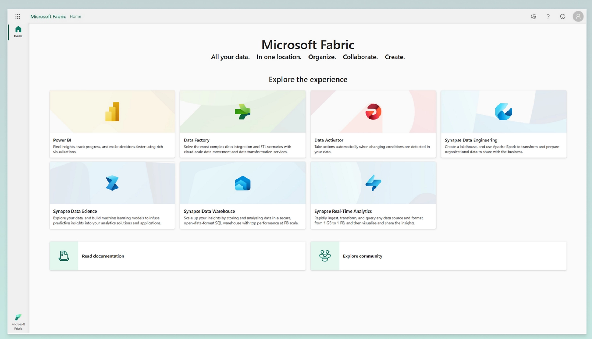

# **Microsoft Fabric**

Fabric integrates technologies like Azure Data Factory, Azure Synapse Analytics, and Power BI into a single unified product.

## Azure vs Microsoft Fabric ##

|                       | Azure                     | Microsoft Fabric                    | OneLake            |
|-----------------------|---------------------------|-------------------------------------|--------------------|
| Data warehousing      | Azure Synapse Analytics   | Dataflow Gen2 (Power Query, T-SQL)  | Data warehouse     |
| Data engineering      | Azure Machine Learning    | Data Engineering (Notebook)         | Lakehouse          |
| Data Integration      | Azure Data Factory        | Data Factory                        | Lakehouse          |
| Data science          | Azure Machine Learning    | Data Science                        | -                  |
| Real-time Analytics   | Azure Synapse Analytics   | Real-time Analytics (KQL)           | -                  |
| Business Intelligence | Power BI                  | Power BI                            | -                  |
| Monitoring            | Azure Monitor             | -                                   | -                  |
| No code experience    | -                         | Data Activator                      | -                  |
| Storage               | -                         | OneLake                             | -                  |

Shortcut

## MS Learn

[Microsoft Learn - Fabric](https://learn.microsoft.com/en-us/training/paths/get-started-fabric/)

## Fabric Excercises

[Microsoft Fabric exercises](https://microsoftlearning.github.io/mslearn-fabric/)

## Microsoft Fabric Document

[Microsoft Fabric](https://learn.microsoft.com/en-us/fabric/get-started/)

## Data warehouse and lakehouse properties
@MS Doc
- [Data warehouse and lakehouse properties](https://learn.microsoft.com/en-us/fabric/get-started/decision-guide-warehouse-lakehouse#data-warehouse-and-lakehouse-properties)

## Copy activity, dataflow, and Spark properties
@MS Doc

- [Copy activity, dataflow, and Spark properties](https://learn.microsoft.com/en-us/fabric/get-started/decision-guide-pipeline-dataflow-spark)

## 日本語（Japanese Document） 

[Microsoft Fabric](https://qiita.com/yangjiayi/items/605d9679e1e35d391a1a)

## Learn about Microsoft Fabric from MVPs

- [Videos and podcasts](https://powerbi.microsoft.com/en-us/blog/learn-about-microsoft-fabric-from-mvps/)