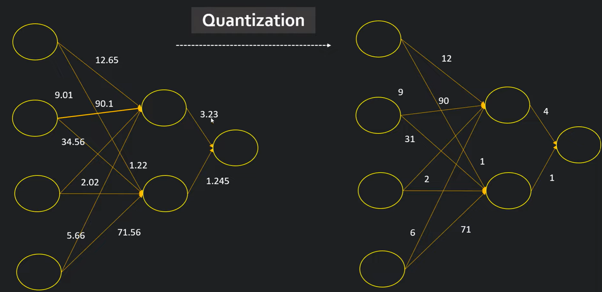

# Run ChatGPT on a Raspberry Pi / Android

## Run ChatGPT on a Raspberry Pi (not really, it's Alpaca)

- https://www.youtube.com/watch?v=vJ1eeGo7HUw

## List of Open Sourced Fine-Tuned Large Language Models (LLM)

- https://medium.com/geekculture/list-of-open-sourced-fine-tuned-large-language-models-llm-8d95a2e0dc76

## llama.cpp

- https://github.com/ggerganov/llama.cpp

## Alpaca-LoRA

- https://github.com/tloen/alpaca-lora

- https://twitter.com/miolini/status/1634982361757790209

- https://github.com/tloen/alpaca-lora/issues/340

## Android

Android
You can easily run llama.cpp on Android device with termux. First, obtain the Android NDK and then build with CMake:

- https://github.com/ggerganov/llama.cpp#android

- Qualcomm [AIMET](https://github.com/quic/aimet) AI Model Efficiency Toolkit (AIMET)

## UI/UX

- https://github.com/nat/openplayground

- https://github.com/oobabooga/text-generation-webui

## Quantization

@Bing chat

Quantization is a promising way to reduce the cost of LLMs (Dettmers et al., 2022; Yao et al., 2022). By quantizing the weights and activations with low-bit integers, we can reduce GPU memory requirements, in size and bandwidth, and accelerate compute-intensive operations GEMM (i.e., in linear layers, BMMin attention). [paper](https://arxiv.org/pdf/2211.10438.pdf)

SmoothQuant is a training-free, accuracy-preserving, and general-purpose post-training quantization (PTQ) solution to enable 8-bit weight, 8-bit activation (W8A8) quantization for LLMs. Based on the fact that weights are smooth functions of activations2. [paper](https://arxiv.org/abs/2211.10438)

https://github.com/Lightning-AI/lit-llama

- Quantization-aware training (QAT): quantization is integrated into the training process.

- Post-training quantization (PTQ): quantization is integrated into the inference process.

- [SmoothQuant](https://pub.towardsai.net/fast-llm-inference-on-cpu-introducing-q8-chat-99e0f30d83db): Reduce the ratio between outlier and non-outlier values specifically for activations.

## Quantization Tutorial

- [49_quantization/quantization.ipynb](https://github.com/codebasics/deep-learning-keras-tf-tutorial/blob/master/49_quantization/quantization.ipynb)

- [quantization.ipynb](quantization/quantization.ipynb)

- [Youtube](https://youtu.be/v1oHf1KV6kM)

## Quantization Library

- [TimDettmers/bitsandbytes](https://github.com/TimDettmers/bitsandbytes)