# Azure OpenAI + LLM (Large Language Model) 

 <a href="https://awesome.re"></a> 

This repository contains references to Azure OpenAI, Large Language Models (LLM), and related services and libraries.

🔹Brief each item on a few lines as possible. <br/>
🔹The dates are based on the first commit, article publication, or paper version 1 issuance. <br/>
🔹Capturing a chronicle and key terms of that rapidly advancing field. <br/>
🔹Disclaimer: Please be aware that some content may be outdated.

## Table of contents

- **Section 1** 🎯: [RAG](#rag-retrieval-augmented-generation)
  - [RAG (Retrieval-Augmented Generation)](#rag-retrieval-augmented-generation)
  - [RAG Design](#advanced-rag) & [Application](#rag-development)
  - [Vector DB](#vector-database-comparison)
- **Section 2** 🌌: [Azure OpenAI](#azure-openai-and-reference-architecture)
  - [Microsoft LLM Framework](#microsoft-azure-openai-llm-framework)
  - [Copilot Products & Azure OpenAI Service](#copilot-products)
  - [Azure Reference Architecture](#azure-reference-architectures)
- **Section 3** 🌐: [LLM Applications](#applications-and-frameworks)
  - [LLM Frameworks & Applications](#applications-frameworks-and-user-interface-uiux): incl. Code editor
  - [Caching, UX, Proposals & Other topics](#caching)
  - [LLMs for Robotics](#llm-for-robotics-bridging-ai-and-robotics)
  - [Awesome demo](#awesome-demo)
- **Section 4** 🤖: [Agent](#agent)
  - [Agent Design Patterns](#agent-design-patterns)
  - [Agent Frameworks & Applications](#agent-framework): incl. Computer use, Deep research
- **Section 5** 🏗️: [Semantic Kernel & DSPy](#microsoft-semantic-kernel-and-stanford-nlp-dspy)
  - [Semantic Kernel](#semantic-kernel): Micro-orchestration
  - [DSPy](#dspy): Optimizer frameworks
- **Section 6** 🛠️: [LangChain](#langchain-features-usage-and-comparisons) | [LlamaIndex](#llamaindex)
  - [LangChain Features](#langchain-feature-matrix--cheetsheet): Macro & Micro-orchestration
  - [LangChain Agent & Criticism](#langchain-chain-type-chains--summarizer)
  - [LangChain vs Competitors](#langchain-vs-competitors)
  - [LlamaIndex](#llamaindex): Micro-orchestration & RAG
- **Section 7** 🧠: [Prompting](#prompt-engineering) | [Finetuning](#finetuning)
  - [Prompt Engineering](#prompt-engineering)
  - [Finetuning](#finetuning): PEFT (e.g., LoRA), RLHF, SFT
  - [Quantization & Optimization](#quantization-techniques)
  - [Other Techniques](#other-techniques-and-llm-patterns): e.g., MoE
  - [Visual Prompting](#visual-prompting--visual-grounding)
- **Section 8** 🏄‍♂️: [Challenges & Abilities](#large-language-model-challenges-and-solutions)
  - [AGI Discussion & Social Impact](#agi-discussion-and-social-impact)
  - [OpenAI Products & Roadmap](#openais-roadmap-and-products)
  - [Context Constraints](#context-constraints): e.g., RoPE
  - [Trust & Safety](#trustworthy-safe-and-secure-llm)
  - [LLM Abilities](#large-language-model-is-abilities)
- **Section 9** 🌍: [LLM Landscape](#large-language-model-landscape)
  - [LLM Taxonomy](#large-language-models-in-2023)
  - [LLM Collection](#large-language-model-collection)
  - [Domain-Specific LLMs](#llm-for-domain-specific): e.g., Software development
  - [Multimodal LLMs](#mllm-multimodal-large-language-model)
- **Section 10** 📚: [Surveys & References](#survey-and-reference)
  - [LLM Surveys](#survey-on-large-language-models) | [Business use cases](#business-use-cases)
  - [Building LLMs](#build-an-llms-from-scratch-picogpt-and-lit-gpt): from scratch
  - [LLMs for Korean & Japanese](#llm-materials-for-east-asian-languages)
  - [Learning and Supplementary Materials](#learning-and-supplementary-materials)
- **Section 11** 🧰: [AI Tools & Extensions](#general-ai-tools-and-extensions)
  - [AI Tools & Extensions](#section-10-general-ai-tools-and-extensions)
- **Section 12** 📊: [Datasets](#section-11-datasets-for-llm-training)
  - [LLM Training Datasets](#datasets-for-llm-training)
- **Section 13** 📝: [Evaluations](#section-12-evaluating-large-language-models--llmops)
  - [LLM Evaluation](#evaluating-large-language-models) & [LLMOps](#llmops-large-language-model-operations)
- **Legend** 🔑:
  - `ref`: external URL
  - `doc`: archived doc
  - `cite`: the source of comments
  - `cnt`: number of citations
  - `git`: GitHub link
  - `x-ref`: Cross reference
  - 📺: youtube or video
  - 💡or 🏆: recommendation

## **Contributor** 👀

<a href="https://github.com/kimtth/awesome-azure-openai-llm/graphs/contributors">
  
</a>

ⓒ `https://github.com/kimtth` all rights reserved.


## **RAG (Retrieval-Augmented Generation)**

### **RAG (Retrieval-Augmented Generation)**

- RAG (Retrieval-Augmented Generation) : Integrates the retrieval (searching) into LLM text generation. RAG helps the model to “look up” external information to improve its responses. [cite](https://towardsdatascience.com/rag-vs-finetuning-which-is-the-best-tool-to-boost-your-llm-application-94654b1eaba7) [25 Aug 2023]

  <!--  -->

- In a 2020 paper, Meta (Facebook) came up with a framework called retrieval-augmented generation to give LLMs access to information beyond their training data. [Retrieval-Augmented Generation for Knowledge-Intensive NLP Tasks](https://arxiv.org/abs/2005.11401): [[cnt](https://scholar.google.com/scholar?hl=en&as_sdt=0%2C5&q=arxiv%3A+2005.11401)] [22 May 2020]

  1. RAG-sequence — We retrieve k documents, and use them to generate all the output tokens that answer a user query.
  1. RAG-token— We retrieve k documents, use them to generate the next token, then retrieve k more documents, use them to generate the next token, and so on. This means that we could end up retrieving several different sets of documents in the generation of a single answer to a user’s query.
  1. Of the two approaches proposed in the paper, the RAG-sequence implementation is pretty much always used in the industry. It’s cheaper and simpler to run than the alternative, and it produces great results. [cite](https://towardsdatascience.com/add-your-own-data-to-an-llm-using-retrieval-augmented-generation-rag-b1958bf56a5a) [30 Sep 2023]

### **Research Papers**

- [A Survey on Retrieval-Augmented Text Generation](https://arxiv.org/abs/2202.01110): [[cnt](https://scholar.google.com/scholar?hl=en&as_sdt=0%2C5&q=arxiv%3A+2202.01110)]: This paper conducts a survey on retrieval-augmented text generation, highlighting its advantages and state-of-the-art performance in many NLP tasks. These tasks include Dialogue response generation, Machine translation, Summarization, Paraphrase generation, Text style transfer, and Data-to-text generation. [2 Feb 2022]
- [Hyde](https://arxiv.org/abs/2212.10496): Hypothetical Document Embeddings. `zero-shot (generate a hypothetical document) -> embedding -> avg vectors -> retrieval` [20 Dec 2022]
- [Active Retrieval Augmented Generation](https://arxiv.org/abs/2305.06983) : [[cnt](https://scholar.google.com/scholar?hl=en&as_sdt=0%2C5&q=arxiv%3A+2305.06983)]: Forward-Looking Active REtrieval augmented generation (FLARE): FLARE iteratively generates a temporary next sentence and check whether it contains low-probability tokens. If so, the system retrieves relevant documents and regenerates the sentence. Determine low-probability tokens by `token_logprobs in OpenAI API response`. [git](https://github.com/jzbjyb/FLARE/blob/main/src/templates.py) [11 May 2023]
- [Benchmarking Large Language Models in Retrieval-Augmented Generation](https://arxiv.org/abs/2309.01431): [[cnt](https://scholar.google.com/scholar?hl=en&as_sdt=0%2C5&q=arxiv%3A+2309.01431)]: Retrieval-Augmented Generation Benchmark (RGB) is proposed to assess LLMs on 4 key abilities [4 Sep 2023]:
  - <details>
    <summary>Expand</summary>

    1. Noise robustness (External documents contain noises, struggled with noise above 80%)

    1. Negative rejection (External documents are all noises, Highest rejection rate was only 45%)

    1. Information integration (Difficulty in summarizing across multiple documents, Highest accuracy was 60-67%)
    
    1. Counterfactual robustness (Failed to detect factual errors in counterfactual external documents.)
    </details>
- [Retrieval meets Long Context LLMs](https://arxiv.org/abs/2310.03025): [[cnt](https://scholar.google.com/scholar?hl=en&as_sdt=0%2C5&q=arxiv%3A+2310.03025)]: We demonstrate that retrieval-augmentation significantly improves the performance of 4K context LLMs. Perhaps surprisingly, we find this simple retrieval-augmented baseline can perform comparable to 16K long context LLMs. [4 Oct 2023]
- [FreshLLMs](https://arxiv.org/abs/2310.03214): [[cnt](https://scholar.google.com/scholar?hl=en&as_sdt=0%2C5&q=arxiv%3A+2310.03214)]: Fresh Prompt, Google search first, then use results in prompt. Our experiments show that FreshPrompt outperforms both competing search engine-augmented prompting methods such as Self-Ask (Press et al., 2022) as well as commercial systems such as Perplexity.AI. [git](https://github.com/freshllms/freshqa) [5 Oct 2023] 
- [Self-RAG](https://arxiv.org/pdf/2310.11511.pdf): [[cnt](https://scholar.google.com/scholar?hl=en&as_sdt=0%2C5&q=arxiv%3A+2310.11511)] 1. `Critic model C`: Generates reflection tokens (IsREL (relevant,irrelevant), IsSUP (fullysupported,partially supported,nosupport), IsUse (is useful: 5,4,3,2,1)). It is pretrained on data labeled by GPT-4. 2. `Generator model M`: The main language model that generates task outputs and reflection tokens. It leverages the data labeled by the critic model during training. 3. `Retriever model R`: Retrieves relevant passages. The LM decides if external passages (retriever) are needed for text generation. [git](https://github.com/AkariAsai/self-rag) [17 Oct 2023]
 
- [RECOMP: Improving Retrieval-Augmented LMs with Compressors](https://arxiv.org/abs/2310.04408): [[cnt](https://scholar.google.com/scholar?hl=en&as_sdt=0%2C5&q=arxiv%3A+2310.04408)]: 1. We propose RECOMP (Retrieve, Compress, Prepend), an intermediate step which compresses retrieved documents into a textual summary prior to prepending them to improve retrieval-augmented language models (RALMs). 2. We present two compressors – an `extractive compressor` which selects useful sentences from retrieved documents and an `abstractive compressor` which generates summaries by synthesizing information from multiple documents. 3. Both compressors are trained. [6 Oct 2023]
- [Retrieval-Augmentation for Long-form Question Answering](https://arxiv.org/abs/2310.12150): [[cnt](https://scholar.google.com/scholar?hl=en&as_sdt=0%2C5&q=arxiv%3A+2310.12150)]: 1. The order of evidence documents affects the order of generated answers 2. the last sentence of the answer is more likely to be unsupported by evidence. 3. Automatic methods for detecting attribution can achieve reasonable performance, but still lag behind human agreement. `Attribution in the paper assesses how well answers are based on provided evidence and avoid creating non-existent information.` [18 Oct 2023]
- [RAG for LLMs](https://arxiv.org/abs/2312.10997): [[cnt](https://scholar.google.com/scholar?hl=en&as_sdt=0%2C5&q=arxiv%3A+2312.10997)] 🏆Retrieval-Augmented Generation for Large Language Models: A Survey: `Three paradigms of RAG Naive RAG > Advanced RAG > Modular RAG` [18 Dec 2023]
- [INTERS: Unlocking the Power of Large Language Models in Search with Instruction Tuning](https://arxiv.org/abs/2401.06532): INTERS covers 21 search tasks across three categories: query understanding, document understanding, and query-document relationship understanding. The dataset is designed for instruction tuning, a method that fine-tunes LLMs on natural language instructions. [git](https://github.com/DaoD/INTERS) [12 Jan 2024]
 
- [RAG vs Fine-tuning](https://arxiv.org/abs/2401.08406): Pipelines, Tradeoffs, and a Case Study on Agriculture. [16 Jan 2024]
- [The Power of Noise: Redefining Retrieval for RAG Systems](https://arxiv.org/abs/2401.14887): No more than 2-5 relevant docs + some amount of random noise to the LLM context maximizes the accuracy of the RAG. [26 Jan 2024]
- [Corrective Retrieval Augmented Generation (CRAG)](https://arxiv.org/abs/2401.15884): Retrieval Evaluator assesses the retrieved documents and categorizes them as Correct, Ambiguous, or Incorrect. For Ambiguous and Incorrect documents, the method uses Web Search to improve the quality of the information. The refined and distilled documents are then used to generate the final output. [29 Jan 2024] CRAG implementation by LangGraph [git](https://github.com/langchain-ai/langgraph/blob/main/examples/rag/langgraph_crag.ipynb)
- [Adaptive-RAG](https://arxiv.org/abs/2403.14403): Learning to Adapt Retrieval-Augmented Large Language Models through Question Complexity [git](https://github.com/starsuzi/Adaptive-RAG) [21 Mar 2024]
 
- [RAPTOR: Recursive Abstractive Processing for Tree-Organized Retrieval](https://arxiv.org/abs/2401.18059): Introduce a novel approach to retrieval-augmented language models by constructing a recursive tree structure from documents. [git](https://github.com/run-llama/llama_index/blob/main/llama-index-packs/llama-index-packs-raptor/README.md) `pip install llama-index-packs-raptor` / [git](https://github.com/profintegra/raptor-rag) [31 Jan 2024]
 
- [CRAG: Comprehensive RAG Benchmark](https://arxiv.org/abs/2406.04744): a factual question answering benchmark of 4,409 question-answer pairs and mock APIs to simulate web and Knowledge Graph (KG) search [ref](https://www.aicrowd.com/challenges/meta-comprehensive-rag-benchmark-kdd-cup-2024) [7 Jun 2024]
- [PlanRAG](https://arxiv.org/abs/2406.12430): Decision Making. Decision QA benchmark, DQA. Plan -> Retrieve -> Make a decision (PlanRAG) [git](https://github.com/myeon9h/PlanRAG) [18 Jun 2024]
 
- [Searching for Best Practices in Retrieval-Augmented Generation](https://arxiv.org/abs/2407.01219): `Best Performance Practice`: Query Classification, Hybrid with HyDE (retrieval), monoT5 (reranking), Reverse (repacking), Recomp (summarization). `Balanced Efficiency Practice`: Query Classification, Hybrid (retrieval), TILDEv2 (reranking), Reverse (repacking), Recomp (summarization). [1 Jul 2024]
- [Retrieval Augmented Generation or Long-Context LLMs?](https://arxiv.org/abs/2407.16833): Long-Context consistently outperforms RAG in terms of average performance. However, RAG's significantly lower cost remains a distinct advantage. [23 Jul 2024]
- [Graph Retrieval-Augmented Generation: A Survey](https://arxiv.org/abs/2408.08921) [15 Aug 2024]
- [OP-RAG: Order-preserve RAG](https://arxiv.org/abs/2409.01666): Unlike traditional RAG, which sorts retrieved chunks by relevance, we keep them in their original order from the text.  [3 Sep 2024]
- [Retrieval Augmented Generation (RAG) and Beyond](https://arxiv.org/abs/2409.14924):🏆The paper classifies user queries into four levels—`explicit, implicit, interpretable rationale, and hidden rationale`—and highlights the need for external data integration and fine-tuning LLMs for specialized tasks. [23 Sep 2024]
- [Astute RAG](https://arxiv.org/abs/2410.07176): adaptively extracts essential information from LLMs, consolidates internal and external knowledge with source awareness, and finalizes answers based on reliability. [9 Oct 2024]
- [CAG: Cache-Augmented Generation](https://arxiv.org/abs/2412.15605): Preloading Information and Pre-computed KV cache for low latency and minimizing retrieval errors [20 Dec 2024]

### **Advanced RAG**

- RAG Pipeline
  1. Indexing Stage: Preparing a knowledge base.
  2. Querying Stage: Querying the indexed data to retrieve relevant information.
  3. Responding Stage: Generating responses based on the retrieved information. [ref](https://learn.microsoft.com/en-us/azure/machine-learning/concept-retrieval-augmented-generation)
- [Evaluation with Ragas](https://towardsdatascience.com/visualize-your-rag-data-evaluate-your-retrieval-augmented-generation-system-with-ragas-fc2486308557): UMAP (often used to reduce the dimensionality of embeddings) with Ragas metrics for visualizing RAG results. [Mar 2024] / `Ragas provides metrics`: Context Precision, Context Relevancy, Context Recall, Faithfulness, Answer Relevance, Answer Semantic Similarity, Answer Correctness, Aspect Critique [git](https://github.com/explodinggradients/ragas) [May 2023]
 
- Advanced RAG Patterns: How to improve RAG peformance [ref](https://cloudatlas.me/why-do-rag-pipelines-fail-advanced-rag-patterns-part1-841faad8b3c2) / [ref](https://cloudatlas.me/how-to-improve-rag-peformance-advanced-rag-patterns-part2-0c84e2df66e6) [17 Oct 2023]
  1. Data quality: Clean, standardize, deduplicate, segment, annotate, augment, and update data to make it clear, consistent, and context-rich.
  2. Embeddings fine-tuning: Fine-tune embeddings to domain specifics, adjust them according to context, and refresh them periodically to capture evolving semantics.
  3. Retrieval optimization: Refine chunking, embed metadata, use query routing, multi-vector retrieval, re-ranking, hybrid search, recursive retrieval, query engine, [HyDE](https://arxiv.org/abs/2212.10496) [20 Dec 2022], and vector search algorithms to improve retrieval efficiency and relevance.
  4. Synthesis techniques: Query transformations, prompt templating, prompt conditioning, function calling, and fine-tuning the generator to refine the generation step.
  - HyDE: Implemented in [LangChain: HypotheticalDocumentEmbedder](https://github.com/langchain-ai/langchain/blob/master/cookbook/hypothetical_document_embeddings.ipynb). A query generates hypothetical documents, which are then embedded and retrieved to provide the most relevant results. `query -> generate n hypothetical documents -> documents embedding - (avg of embeddings) -> retrieve -> final result.` [ref](https://www.jiang.jp/posts/20230510_hyde_detailed/index.html)
- How to optimize RAG pipeline: [Indexing optimization](https://newsletter.theaiedge.io/p/how-to-optimize-your-rag-pipelines) [24 Oct 2023]
- Demystifying Advanced RAG Pipelines: An LLM-powered advanced RAG pipeline built from scratch [git](https://github.com/pchunduri6/rag-demystified) [19 Oct 2023]
 
- [cite](https://twitter.com/yi_ding/status/1721728060876300461) [7 Nov 2023] `OpenAI has put together a pretty good roadmap for building a production RAG system.` Naive RAG -> Tune Chunks -> Rerank & Classify -> Prompt Engineering. In `llama_index`... [📺](https://www.youtube.com/watch?v=ahnGLM-RC1Y)  <br/>
  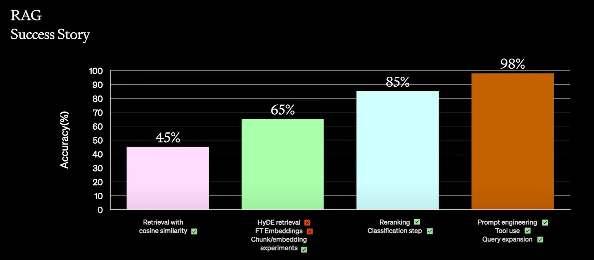
- [9 Effective Techniques To Boost Retrieval Augmented Generation (RAG) Systems](https://towardsdatascience.com/9-effective-techniques-to-boost-retrieval-augmented-generation-rag-systems-210ace375049) [doc](9-effective-rag-techniques.png): ReRank, Prompt Compression, Hypothetical Document Embedding (HyDE), Query Rewrite and Expansion, Enhance Data Quality, Optimize Index Structure, Add Metadata, Align Query with Documents, Mixed Retrieval (Hybrid Search) [2 Jan 2024]
- [Contextual Retrieval](https://www.anthropic.com/news/contextual-retrieval): Contextual Retrieval enhances traditional RAG by using Contextual Embeddings and Contextual BM25 to maintain context during retrieval. [19 Sep 2024]
- [How to improve RAG Piplines](https://www.linkedin.com/posts/damienbenveniste_how-to-improve-rag-pipelines-activity-7241497046631776256-vwOc?utm_source=li_share&utm_content=feedcontent&utm_medium=g_dt_web&utm_campaign=copy): LangGraph implementation with Self-RAG, Adaptive-RAG, Corrective RAG. [Oct 2024]
- [RAG Hallucination Detection Techniques](https://machinelearningmastery.com/rag-hallucination-detection-techniques/): Hallucination metrics using the DeepEval, G-Eval. [10 Jan 2025] 

#### Agentic RAG

- From Simple to Advanced RAG (LlamaIndex) [ref](https://twitter.com/jerryjliu0/status/1711419232314065288) / [doc](./files/archive/LlamaIndexTalk_PyDataGlobal.pdf) /💡[ref](https://aiconference.com/speakers/jerry-liu-2023/) [10 Oct 2023] <br/>
  
- [What is Agentic RAG](https://weaviate.io/blog/what-is-agentic-rag): The article published by Weaviate. [5 Nov 2024]
- [Agentic Retrieval-Augmented Generation: A Survey on Agentic RAG](https://arxiv.org/abs/2501.09136) [15 Jan 2025]

#### Multi-modal RAG (Vision RAG)

- [Azure RAG with Vision Application Framework](https://github.com/Azure-Samples/rag-as-a-service-with-vision) [Mar 2024] 
- [localGPT-Vision](https://github.com/PromtEngineer/localGPT-Vision): an end-to-end vision-based Retrieval-Augmented Generation (RAG) system. [Oct 2024] 
- [Enhancing Ultra High Resolution Remote Sensing Imagery Analysis with ImageRAG](https://arxiv.org/abs/2411.07688): Ultra High Resolution (UHR) remote sensing imagery, such as satellite imagery and medical imaging. [12 Nov 2024]
- [Visual RAG over PDFs with Vespa](https://blog.vespa.ai/visual-rag-in-practice/): a demo showcasing Visual RAG over PDFs using ColPali embeddings in Vespa [git](https://github.com/vespa-engine/sample-apps/tree/master/visual-retrieval-colpali) [19 Nov 2024]
- [Path-RAG: Knowledge-Guided Key Region Retrieval for Open-ended Pathology Visual Question Answering](https://arxiv.org/abs/2411.17073): Using HistoCartography to improve pathology image analysis and boost PathVQA-Open performance. [26 Nov 2024]
- [VideoRAG](https://arxiv.org/abs/2501.05874): Not only does it retrieve relevant videos from a large video corpus, but it also integrates both the visual and textual elements of videos into the answer-generation process using Large Video Language Models (LVLMs). [10 Jan 2025]

#### GraphRAG

- [Graph RAG (by NebulaGraph)](https://medium.com/@nebulagraph/graph-rag-the-new-llm-stack-with-knowledge-graphs-e1e902c504ed): NebulaGraph proposes the concept of Graph RAG, which is a retrieval enhancement technique based on knowledge graphs. [demo](https://www.nebula-graph.io/demo) [8 Sep 2023]
- [HybridRAG](https://arxiv.org/abs/2408.04948): Integrating VectorRAG and GraphRAG with financial earnings call transcripts in Q&A format. [9 Aug 2024]
- [GraphRAG (by Microsoft)](https://arxiv.org/abs/2404.16130): 1. Global search: Original Documents -> Knowledge Graph (Community Summaries generated by LLM) -> Partial Responses -> Final Response. 2. Local Search: Utilizes vector-based search to find the nearest entities and relevant information.
[ref](https://microsoft.github.io/graphrag) / [git](https://github.com/microsoft/graphrag) [24 Apr 2024]

  - [GraphRAG Implementation with LlamaIndex](https://github.com/run-llama/llama_index/blob/main/docs/docs/examples/cookbooks/GraphRAG_v1.ipynb) [15 Jul 2024]
  - ["From Local to Global" GraphRAG with Neo4j and LangChain](https://neo4j.com/developer-blog/global-graphrag-neo4j-langchain/) [09 Jul 2024]
  - [LightRAG](https://github.com/HKUDS/LightRAG): Utilizing graph structures for text indexing and retrieval processes. [8 Oct 2024] 
  - [nano-graphrag](https://github.com/gusye1234/nano-graphrag): A simple, easy-to-hack GraphRAG implementation [Jul 2024]

  - [DRIFT Search](https://www.microsoft.com/en-us/research/blog/introducing-drift-search-combining-global-and-local-search-methods-to-improve-quality-and-efficiency/): DRIFT search (Dynamic Reasoning and Inference with Flexible Traversal) combines global and local search methods to improve query relevance by generating sub-questions and refining the context using HyDE (Hypothetical Document Embeddings). [31 Oct 2024]
  - [Improving global search via dynamic community selection](https://www.microsoft.com/en-us/research/blog/graphrag-improving-global-search-via-dynamic-community-selection/): Dynamic Community Selection narrows the scope by selecting the most relevant communities based on query relevance, utilizing Map-reduce search, reducing costs by 77% without sacrificing output quality [15 Nov 2024]
  - [LazyGraphRAG](https://www.microsoft.com/en-us/research/blog/lazygraphrag-setting-a-new-standard-for-quality-and-cost/): Reduces costs to 0.1% of full GraphRAG through efficient use of best-first (vector-based) and breadth-first (global search) retrieval and deferred LLM calls [25 Nov 2024]
- [How to Build a Graph RAG App](https://towardsdatascience.com/how-to-build-a-graph-rag-app-b323fc33ba06): Using knowledge graphs and AI to retrieve, filter, and summarize medical journal articles [30 Dec 2024]

### **The Problem with RAG**

- The Problem with RAG
  1. A question is not semantically similar to its answers. Cosine similarity may favor semantically similar texts that do not contain the answer.
  1. Semantic similarity gets diluted if the document is too long. Cosine similarity may favor short documents with only the relevant information.
  1. The information needs to be contained in one or a few documents. Information that requires aggregations by scanning the whole data.
- [Seven Failure Points When Engineering a Retrieval Augmented Generation System](https://arxiv.org/abs/2401.05856): 1. Missing Content, 2. Missed the Top Ranked Documents, 3. Not in Context, 4. Not Extracted, 5. Wrong Format, 6. Incorrect Specificity, 7. Lack of Thorough Testing [11 Jan 2024]
- Solving the core challenges of Retrieval-Augmented Generation [ref](https://towardsdatascience.com/12-rag-pain-points-and-proposed-solutions-43709939a28c) [Feb 2024] <br/>
  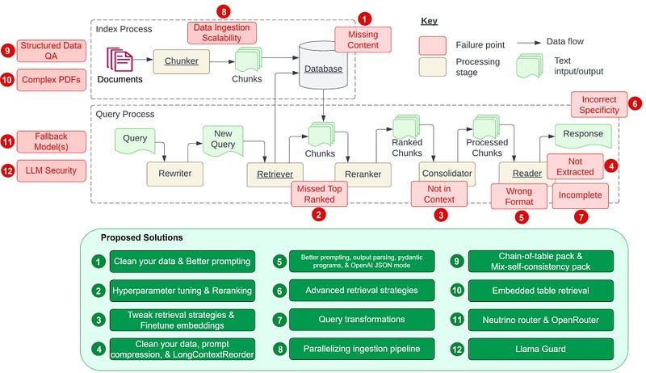

### **RAG Solution Design & Application**

#### **RAG Solution Design**

- [Papers with code](https://paperswithcode.com/method/rag): RAG
- [Azure: Designing and developing a RAG solution](https://learn.microsoft.com/en-us/azure/architecture/ai-ml/guide/rag/rag-solution-design-and-evaluation-guide)
  - [Announcing cost-effective RAG at scale with Azure AI Search](https://aka.ms/AAqfqla)
  - [Advanced RAG with Azure AI Search and LlamaIndex](https://techcommunity.microsoft.com/t5/ai-azure-ai-services-blog/advanced-rag-with-azure-ai-search-and-llamaindex/ba-p/4115007)
  - [GPT-RAG](https://github.com/Azure/GPT-RAG): Enterprise RAG Solution Accelerator [Jun 2023]

  - [Azure OpenAI chat baseline architecture in an Azure landing zone](https://learn.microsoft.com/en-us/azure/architecture/ai-ml/architecture/azure-openai-baseline-landing-zone)
  - Azure Reference Architectures: [x-ref](#azure-reference-architectures)
- [RAG at scale](https://medium.com/@neum_ai/retrieval-augmented-generation-at-scale-building-a-distributed-system-for-synchronizing-and-eaa29162521): Building a distributed system for synchronizing and ingesting billions of text embeddings [28 Sep 2023]
- [A Practical Approach to Retrieval Augmented Generation (RAG) Systems](https://github.com/mallahyari/rag-ebook): Online book [Dec 2023]

- [LangChain RAG from scratch](https://github.com/langchain-ai/rag-from-scratch) [Jan 2024]

- [LlamIndex Building Performant RAG Applications for Production](https://docs.llamaindex.ai/en/stable/optimizing/production_rag/#building-performant-rag-applications-for-production)
- [Advanced RAG on Hugging Face documentation using LangChain](https://huggingface.co/learn/cookbook/advanced_rag)
- [LLM Twin Course: Building Your Production-Ready AI Replica](https://github.com/decodingml/llm-twin-course): Learn to Build a Production-Ready LLM & RAG System with LLMOps [Mar 2024] 
- [RAG-driven Generative AI](https://github.com/Denis2054/RAG-Driven-Generative-AI): Retrieval Augmented Generation (RAG) code for Generative AI with LlamaIndex, Deep Lake, and Pinecone [Apr 2024] 
- [Learn RAG with LangChain](https://www.sakunaharinda.xyz/ragatouille-book): Online book [May 2024]
- RAG context relevancy metric: Ragas, TruLens, DeepEval [ref](https://towardsdatascience.com/the-challenges-of-retrieving-and-evaluating-relevant-context-for-rag-e362f6eaed34) [Jun 2024]
  - `Context Relevancy (in Ragas) = S / Total number of sentences in retrieved context`
  - `Contextual Relevancy (in DeepEval) = Number of Relevant Statements / Total Number of Statements`
- [What AI Engineers Should Know about Search](https://softwaredoug.com/blog/2024/06/25/what-ai-engineers-need-to-know-search) [25 Jun 2024]
- [Advanced RAG Techniques](https://github.com/NirDiamant/RAG_Techniques):🏆Showcases various advanced techniques for Retrieval-Augmented Generation (RAG) [Jul 2024]

- [Galileo eBook](https://www.rungalileo.io/mastering-rag): 200 pages content. Mastering RAG. [doc](./files/archive/Mastering%20RAG-compressed.pdf) [Sep 2024]
- [Introduction to Large-Scale Similarity Search: HNSW, IVF, LSH](https://blog.gopenai.com/introduction-to-large-scale-similarity-search-part-one-hnsw-ivf-lsh-677bf193ab07) [28 Sep 2024]
- [5 Chunking Strategies For RAG](https://blog.dailydoseofds.com/p/5-chunking-strategies-for-rag) [19 Oct 2024]
- [Genie: Uber’s Gen AI On-Call Copilot](https://www.uber.com/blog/genie-ubers-gen-ai-on-call-copilot/) [10 Oct 2024]
- [Evaluating LLMs and RAG Systems](https://dzone.com/articles/evaluating-llms-and-rag-systems) [27 Jan 2025]

#### **RAG Development**

1. [Haystack](https://github.com/deepset-ai/haystack): LLM orchestration framework to build customizable, production-ready LLM applications. [5 May 2020] 
1. [Cognita](https://github.com/truefoundry/cognita): RAG (Retrieval Augmented Generation) Framework for building modular, open-source applications [Jul 2023] 
1. [llmware](https://github.com/llmware-ai/llmware): Building Enterprise RAG Pipelines with Small, Specialized Models. [Oct 2023]
1. [Canopy](https://github.com/pinecone-io/canopy): open-source RAG framework and context engine built on top of the Pinecone vector database. [Aug 2023] 
1. [RAGflow](https://github.com/infiniflow/ragflow):💡Streamlined RAG workflow. Focusing on Deep document understanding [Dec 2023] 

1. [AutoRAG](https://github.com/Marker-Inc-Korea/AutoRAG): RAG AutoML tool for automatically finds an optimal RAG pipeline for your data. [Jan 2024]

1. [RAGApp](https://github.com/ragapp/ragapp): Agentic RAG. Custom GPTs, but deployable in your own cloud infrastructure using Docker. [Apr 2024]

1. [RAG Builder](https://github.com/KruxAI/ragbuilder): Automatically create an optimal production-ready Retrieval-Augmented Generation (RAG) setup for your data. [Jun 2024] 

1. [MindSearch](https://github.com/InternLM/MindSearch): An open-source AI Search Engine Framework [Jul 2024]

1. [RAGFoundry](https://github.com/IntelLabs/RAGFoundry): A library designed to improve LLMs ability to use external information by fine-tuning models on specially created RAG-augmented datasets. [5 Aug 2024]

1. [RAGChecker](https://arxiv.org/abs/2408.08067): A Fine-grained Framework For Diagnosing RAG [git](https://github.com/amazon-science/RAGChecker) [15 Aug 2024]

1. [Chonkie](https://github.com/chonkie-ai/chonkie): RAG chunking library [Nov 2024] 
1. [MiniRAG](https://github.com/HKUDS/MiniRAG): RAG through heterogeneous graph indexing and lightweight topology-enhanced retrieval. [Jan 2025] 
1. Applications, Frameworks, and User Interface (UI/UX): [x-ref](#applications-frameworks-and-user-interface-uiux)

#### **RAG Application**

1. [Khoj](https://github.com/khoj-ai/khoj): Open-source, personal AI agents. Cloud or Self-Host, Multiple Interfaces. Python Django based [Aug 2021] 
1. [SWIRL AI Connect](https://github.com/swirlai/swirl-search): SWIRL AI Connect enables you to perform Unified Search and bring in a secure AI Co-Pilot. [Apr 2022]

1. [PaperQA2](https://github.com/Future-House/paper-qa): High accuracy RAG for answering questions from scientific documents with citations [Feb 2023]

1. [Danswer](https://github.com/danswer-ai/danswer): Ask Questions in natural language and get Answers backed by private sources: Slack, GitHub, Confluence, etc. [Apr 2023]
 
1. [PrivateGPT](https://github.com/imartinez/privateGPT): 100% privately, no data leaks. The API is built using FastAPI and follows OpenAI's API scheme. [May 2023]

1. [quivr](https://github.com/QuivrHQ/quivr): A personal productivity assistant (RAG). Chat with your docs (PDF, CSV, ...) [May 2023]
 
1. [Verba](https://github.com/weaviate/Verba): Retrieval Augmented Generation (RAG) chatbot powered by Weaviate [Jul 2023]

1. [RAG capabilities of LlamaIndex to QA about SEC 10-K & 10-Q documents](https://github.com/run-llama/sec-insights): A real world full-stack application using LlamaIndex [Sep 2023]

1. [RAGxplorer](https://github.com/gabrielchua/RAGxplorer): Visualizing document chunks and the queries in the embedding space. [Jan 2024]

1. [Perplexica](https://github.com/ItzCrazyKns/Perplexica):💡Open source alternative to Perplexity AI [Apr 2024] / [Marqo](https://github.com/marqo-ai/marqo) [Aug 2022] / [txtai](https://github.com/neuml/txtai) [Aug 2020] / [Typesense](https://github.com/typesense/typesense) [Jan 2017] / [Morphic](https://github.com/miurla/morphic) [Apr 2024]
     
1. [llm-answer-engine](https://github.com/developersdigest/llm-answer-engine): Build a Perplexity-Inspired Answer Engine Using Next.js, Groq, Mixtral, LangChain, OpenAI, Brave & Serper [Mar 2024]

1. [turboseek](https://github.com/Nutlope/turboseek): An AI search engine inspired by Perplexity [May 2024]

1. [R2R](https://github.com/SciPhi-AI/R2R): R2R (RAG to Riches), the Elasticsearch for RAG. [Feb 2024]

1. [FlashRAG](https://github.com/RUC-NLPIR/FlashRAG): A Python Toolkit for Efficient RAG Research [Mar 2024]

1. [kotaemon](https://github.com/Cinnamon/kotaemon): Open-source clean & customizable RAG UI for chatting with your documents. [Mar 2024]

1. [Scira (Formerly MiniPerplx)](https://github.com/zaidmukaddam/scira): A minimalistic AI-powered search engine [Aug 2024] 
1. [MedGraphRAG](https://arxiv.org/abs/2408.04187): MedGraphRAG outperforms the previous SOTA model, [Medprompt](https://arxiv.org/abs/2311.16452), by 1.1%. [git](https://github.com/medicinetoken/medical-graph-rag) [8 Aug 2024]

1. [MemFree](https://github.com/memfreeme/memfree): Hybrid AI Search Engine + AI Page Generator. [Jun 2024] 
1. [RAGLite](https://github.com/superlinear-ai/raglite): a Python toolkit for Retrieval-Augmented Generation (RAG) with PostgreSQL or SQLite [Jun 2024] 
1. Applications, Frameworks, and User Interface (UI/UX): [x-ref](#applications-frameworks-and-user-interface-uiux)

### **Vector Database Comparison**

- [Faiss](https://faiss.ai/): Facebook AI Similarity Search (Faiss) is a library for efficient similarity search and clustering of dense vectors. It is used as an alternative to a vector database in the development and library of algorithms for a vector database. It is developed by Facebook AI Research. [git](https://github.com/facebookresearch/faiss) [Feb 2017]
 
- Milvus (A cloud-native vector database) Embedded [git](https://github.com/milvus-io/milvus) [Sep 2019]: Alternative option to replace PineCone and Redis Search in OSS. It offers support for multiple languages, addresses the limitations of RedisSearch, and provides cloud scalability and high reliability with Kubernetes.
 
- [Qdrant](https://github.com/qdrant/qdrant): Written in Rust. Qdrant (read: quadrant) [May 2020]
 
- [Pinecone](https://docs.pinecone.io): A fully managed cloud Vector Database. Commercial Product [Jan 2021]
- [Weaviate](https://github.com/weaviate/weaviate): Store both vectors and data objects. [Jan 2021]
 
- [pgvector](https://github.com/pgvector/pgvector): Open-source vector similarity search for Postgres [Apr 2021] / [pgvectorscale](https://github.com/timescale/pgvectorscale): 75% cheaper than pinecone [Jul 2023]  
- [Not All Vector Databases Are Made Equal](https://towardsdatascience.com/milvus-pinecone-vespa-weaviate-vald-gsi-what-unites-these-buzz-words-and-what-makes-each-9c65a3bd0696): Printed version for "Medium" limits. [doc](./files/vector-dbs.pdf) [2 Oct 2021]
- [Chroma](https://github.com/chroma-core/chroma): Open-source embedding database [Oct 2022]
 
- [Redis extension for vector search, RedisVL](https://github.com/RedisVentures/redisvl): Redis Vector Library (RedisVL) [Nov 2022]
 
- [A SQLite extension for efficient vector search, based on Faiss!](https://github.com/asg017/sqlite-vss) [Jan 2023]
 
- [lancedb](https://github.com/lancedb/lancedb): LanceDB's core is written in Rust and is built using Lance, an open-source columnar format.  [Feb 2023]
 
- [A Comprehensive Survey on Vector Database](https://arxiv.org/abs/2310.11703): Categorizes search algorithms by their approach, such as hash-based, tree-based, graph-based, and quantization-based. [18 Oct 2023]

#### **Vector Database Options for Azure**

- [Vector Search in Azure Cosmos DB for MongoDB vCore](https://devblogs.microsoft.com/cosmosdb/introducing-vector-search-in-azure-cosmos-db-for-mongodb-vcore/) [23 May 2023]
- [Pgvector extension on Azure Cosmos DB for PostgreSQL](https://azure.microsoft.com/en-us/updates/generally-available-pgvector-extension-on-azure-cosmos-db-for-postgresql/): [ref](https://python.langchain.com/docs/modules/data_connection/vectorstores/integrations/pgvector) [13 Jun 2023]
- [Vector search - Azure AI Search](https://github.com/Azure/azure-search-vector-samples): [ref](https://python.langchain.com/docs/modules/data_connection/vectorstores/integrations/azuresearch) Rebranded from Azure Cognitive Search [Oct 2019] to Azure AI Search [Nov 2023]
 
- [Azure Cache for Redis Enterprise](https://techcommunity.microsoft.com/t5/azure-developer-community-blog/introducing-vector-search-similarity-capabilities-in-azure-cache/ba-p/3827512): Enterprise [Redis Vector Search Demo](https://ecommerce.redisventures.com/) [22 May 2023 ]
- [Azure SQL's support for natively storing and querying vectors](https://devblogs.microsoft.com/azure-sql/announcing-eap-native-vector-support-in-azure-sql-database/) [21 May 2024]
- GraphRAG, available in preview in [Azure Database for PostgreSQL](https://aka.ms/Ignite24/PostgreSQLAI) [19 Nov 2024]
- [DiskANN](https://github.com/microsoft/DiskANN), a state-of-the-art suite of algorithms for low-latency, highly scalable vector search, is now generally available in [Azure Cosmos DB](https://aka.ms/ignite24/cosmosdb/blog1) and in preview for Azure Database for PostgreSQL. [19 Nov 2024]

**Note**: Azure Cache for Redis Enterprise: Enterprise Sku series are not able to deploy by a template such as Bicep and ARM.

[](https://portal.azure.com/#create/Microsoft.Template/uri/https%3A%2F%2Fraw.githubusercontent.com%2Fkimtth%2Fazure-openai-elastic-vector-langchain%2Fmain%2Finfra%2Fdeployment.json)

#### **Embedding**

- Azure Open AI Embedding API, `text-embedding-ada-002`, supports 1536 dimensions. Elastic search, Lucene based engine, supports 1024 dimensions as a max. Open search can insert 16,000 dimensions as a vector storage. Open search is available to use as a vector database with Azure Open AI Embedding API.
- OpenAI Embedding models: `text-embedding-3` [x-ref](#openai-products) > `New embedding models`
- [text-embedding-ada-002](https://openai.com/blog/new-and-improved-embedding-model):
  Smaller embedding size. The new embeddings have only 1536 dimensions, one-eighth the size of davinci-001 embeddings,
  making the new embeddings more cost effective in working with vector databases. [15 Dec 2022]
- However, one exception to this is that the maximum dimension count for the Lucene engine is 1,024, compared with
  16,000 for the other engines. [ref](https://opensearch.org/docs/latest/search-plugins/knn/approximate-knn/)
<!-- - LlamaIndex `ElasticsearchReader` class:
  The name of the class in LlamaIndex is `ElasticsearchReader`. However, actually, it can only work with open search. -->
- [Vector Search with OpenAI Embeddings: Lucene Is All You Need](https://arxiv.org/abs/2308.14963): Our experiments were based on Lucene 9.5.0, but indexing was a bit tricky
  because the HNSW implementation in Lucene restricts vectors to 1024 dimensions, which was not sufficient for OpenAI’s 1536-dimensional embeddings. Although the resolution of this issue, which is to make vector dimensions configurable on a per codec basis, has been merged to the Lucene source trunk [git](https://github.com/apache/lucene/pull/12436), this feature has not been folded into a Lucene release (yet) as of early August 2023. [29 Aug 2023]
- [Is Cosine-Similarity of Embeddings Really About Similarity?](https://arxiv.org/abs/2403.05440): In linear matrix factorization, the use of regularization can impact, and in some cases, render cosine similarities meaningless. Regularization involves two objectives. The first objective applies L2-norm regularization to the product of matrices A and B, a process similar to dropout. The second objective applies L2-norm regularization to each individual matrix, similar to the weight decay technique used in deep learning. [8 Mar 2024]
- [Contextual Document Embedding (CDE)](https://arxiv.org/abs/2410.02525): Improve document retrieval by embedding both queries and documents within the context of the broader document corpus. [ref](https://pub.aimind.so/unlocking-the-power-of-contextual-document-embeddings-enhancing-search-relevance-01abfa814c76) [3 Oct 2024]
- [Fine-tuning Embeddings for Specific Domains](https://blog.gopenai.com/fine-tuning-embeddings-for-specific-domains-a-comprehensive-guide-5e4298b42185) [1 Oct 2024]

## **Azure OpenAI and Reference Architecture**

### **Azure OpenAI vs OpenAI**

1. OpenAI offers the latest features and models, while Azure OpenAI provides a reliable, secure, and compliant environment with seamless integration into other Azure services.
2. Azure OpenAI supports `private networking`, `role-based authentication`, and `responsible AI content filtering`.
3. Azure OpenAI does not use user input as training data for other customers. [Data, privacy, and security for Azure OpenAI](https://learn.microsoft.com/en-us/legal/cognitive-services/openai/data-privacy). Azure OpenAI does not share user data, including prompts and responses, with OpenAI.

- [What is Azure OpenAI Service?](https://learn.microsoft.com/en-us/azure/cognitive-services/openai/overview)
- [Open AI Models](https://platform.openai.com/docs/models)
- [Abuse Monitoring](https://learn.microsoft.com/en-us/legal/cognitive-services/openai/data-privacy): To detect and mitigate abuse, Azure OpenAI stores all prompts and generated content securely for up to thirty (30) days. (No prompts or completions are stored if the customer chooses to turn off abuse monitoring.)

### **Microsoft Azure OpenAI LLM Framework**

#### LLM Integration Frameworks

1. [Semantic Kernel](https://devblogs.microsoft.com/semantic-kernel/) (Feb 2023): An open-source SDK for integrating AI services like OpenAI, Azure OpenAI, and Hugging Face with conventional programming languages such as C# and Python. It's an LLM orchestrator, similar to LangChain. / [git](https://github.com/microsoft/semantic-kernel) / [x-ref](#semantic-kernel)
 
1. [Kernel Memory](https://github.com/microsoft/kernel-memory) (Jul 2023): An open-source service and plugin for efficient dataset indexing through custom continuous data hybrid pipelines.
 
1. [Azure ML Prompt Flow](https://learn.microsoft.com/en-us/azure/machine-learning/prompt-flow/overview-what-is-prompt-flow) (Jun 2023): A visual designer for prompt crafting using Jinja as a prompt template language. / [ref](https://techcommunity.microsoft.com/t5/ai-machine-learning-blog/harness-the-power-of-large-language-models-with-azure-machine/ba-p/3828459) / [git](https://github.com/microsoft/promptflow)
 

- A Memory in Semantic Kernel vs Kernel Memory (formerly Semantic Memory) is designed to handle large datasets and extended conversations, with the memory pipeline deployed as a separate service. [ref](https://github.com/microsoft/chat-copilot/tree/main/memorypipeline)

#### Prompt

1. [Prompt Engine](https://github.com/microsoft/prompt-engine) (Jun 2022): A tool for crafting prompts for large language models in Python. / [Python](https://github.com/microsoft/prompt-engine-py)
  
1. [PromptBench](https://github.com/microsoft/promptbench) (Jun 2023): A unified evaluation framework for large language models.
 
1. [SAMMO](https://github.com/microsoft/sammo) (Apr 2024): A general-purpose framework for prompt optimization. / [ref](https://www.microsoft.com/en-us/research/blog/sammo-a-general-purpose-framework-for-prompt-optimization/)
 
1. [Prompty](https://github.com/microsoft/prompty) (Apr 2024): A template language for integrating prompts with LLMs and frameworks, enhancing prompt management and evaluation.
 
1. [guidance](https://github.com/microsoft/guidance) (Nov 2022): A domain-specific language (DSL) for controlling large language models, focusing on model interaction and implementing the "Chain of Thought" technique.
 
1. [LMOps](https://github.com/microsoft/LMOps) (Dec 2022): A toolkit for improving text prompts used in generative AI models, including tools like Promptist for text-to-image generation and Structured Prompting.
 
1. [LLMLingua](https://github.com/microsoft/LLMLingua) (Jul 2023): A tool for compressing prompts and KV-Cache, achieving up to 20x compression with minimal performance loss. LLMLingua-2 was released in Mar 2024.
 
1. [TypeChat](https://microsoft.github.io/TypeChat/blog/introducing-typechat) (Apr 2023): A tool that replaces prompt engineering with schema engineering, designed to build natural language interfaces using types. / [git](https://github.com/microsoft/Typechat)
 
1. [GenAIScript](https://github.com/microsoft/genaiscript) (Aug 2023): Orchestrate LLMs, tools, and data in a single JavaScript. 

#### Agent

1. [JARVIS](https://github.com/microsoft/JARVIS) (Mar 2023): An interface for LLMs to connect numerous AI models for solving complex AI tasks.
 
1. [Autogen](https://github.com/microsoft/autogen) (Mar 2023): A customizable and conversable agent framework. / [ref](https://www.microsoft.com/en-us/research/blog/autogen-enabling-next-generation-large-language-model-applications/) / [Autogen Studio](https://www.microsoft.com/en-us/research/blog/introducing-autogen-studio-a-low-code-interface-for-building-multi-agent-workflows/) (June 2024)
 
1. [TaskWeaver](https://github.com/microsoft/TaskWeaver) (Sep 2023): A code-first agent framework for converting natural language requests into executable code with support for rich data structures and domain-adapted planning.
 
1. [UFO](https://github.com/microsoft/UFO) (Mar 2024): A UI-focused agent for Windows OS interaction.
 
1. [Semantic Workbench](https://github.com/microsoft/semanticworkbench) (Aug 2024): A development tool for creating intelligent agents. / [ref](https://techcommunity.microsoft.com/t5/ai-ai-platform-blog/introducing-semantic-workbench-your-gateway-to-agentic-ai/ba-p/4212695)
 
1. [OmniParser](https://github.com/microsoft/OmniParser) (Sep 2024): A simple screen parsing tool towards pure vision based GUI agent.
 
1. [TinyTroupe](https://github.com/microsoft/TinyTroupe): LLM-powered multiagent persona simulation for imagination enhancement and business insights. [Mar 2024] 
1. [RD-Agent](https://github.com/microsoft/RD-Agent): open source R&D automation tool [ref](https://rdagent.azurewebsites.net/) [Apr 2024]
 
1. [Magentic-One](https://aka.ms/magentic-one): Built on AutoGen. A Generalist Multi-Agent System for Solving Complex Tasks [Nov 2024]
1. [AIOpsLab](https://www.microsoft.com/en-us/research/blog/aiopslab-building-ai-agents-for-autonomous-clouds/): Building AI agents for autonomous clouds. AI agents for incident root cause analysis (RCA) [git](https://github.com/microsoft/AIOpsLab/
) [20 Dec 2024] 

- [Understanding Microsoft's Latest Multi-Agent Systems](https://techcommunity.microsoft.com/blog/machinelearningblog/the-evolution-of-ai-frameworks-understanding-microsofts-latest-multi-agent-syste/4339739): AutoGen 0.4 vs Magentic-One vs and TinyTroupe [27 Nov 2024]

#### Deep learning

1. [DeepSpeed](https://github.com/microsoft/DeepSpeed) (May 2020): A deep learning optimization library for easy, efficient, and effective distributed training and inference, featuring the Zero Redundancy Optimizer.
 
1. [FLAML](https://github.com/microsoft/FLAML) (Dec 2020): A lightweight Python library for efficient automation of machine learning and AI operations, offering interfaces for AutoGen, AutoML, and hyperparameter tuning.
 
1. [Foundation Models (aka large-scale pre-trained models)](https://github.com/microsoft/unilm): Foundation Models & Foundation Architectures [Mar 2020]

#### Risk Identification & LLMOPs

1. [PyRIT](https://github.com/Azure/PyRIT) (Dec 2023): Python Risk Identification Tool for generative AI, focusing on LLM robustness against issues like hallucination, bias, and harassment.
 
1. [AI Central](https://github.com/microsoft/AICentral) (Oct 2023): An AI Control Center for monitoring, authenticating, and providing resilient access to multiple OpenAI services.
 
1. [Azure AI Evaluation SDK](https://learn.microsoft.com/en-us/azure/ai-studio/how-to/develop/evaluate-sdk) (Oct 2024): Evaluate with the prompt flow SDK has been retired and replaced with Azure AI Evaluation SDK.

#### Data processing

- [Presidio](https://github.com/microsoft/presidio): Presidio (Origin from Latin praesidium ‘protection, garrison’). Context aware, pluggable and customizable data protection and de-identification SDK for text and images. [Oct 2019]
- [Microsoft Fabric](https://learn.microsoft.com/en-us/fabric/): Fabric integrates technologies like Azure Data Factory, Azure Synapse Analytics, and Power BI into a single unified product [May 2023]

#### Toolkit

- [Powershell: AIShell](https://github.com/PowerShell/AIShell): An interactive shell to work with AI-powered assistance providers [Apr 2023] 
- [Document: AI Toolkit for Visual Studio Code](https://github.com/microsoft/vscode-ai-toolkit): AI Toolkit for Visual Studio Code extension [Dec 2023]

### **Microsoft Copilot**

#### **Copilot Products**

- `Microsoft Copilot in Windows` vs `Microsoft Copilot` (= Copilot in Windows + Commercial Data Protection) vs `Microsoft 365 Copilot` (= Microsoft Copilot + M365 Integration) [Nov 2023]
- [Copilot Scenario Library](https://adoption.microsoft.com/en-us/copilot-scenario-library/)
- [An AI companion for everyone](https://blogs.microsoft.com/blog/2024/10/01/an-ai-companion-for-everyone/): Copilot’s next phase (Copilot Voice, Copilot Daily, Copilot Vision, CoT, and others.) [1 Oct 2024]
- [Copilot Vision](https://www.microsoft.com/en-us/microsoft-copilot/blog/2024/12/05/copilot-vision-now-in-preview-a-new-way-to-browse/): Available only on Microsoft Edge: See the page, read along, and solve problems together. [05 Dec 2024]
- [Microsoft 365 Copilot Chat](https://aka.ms/copilotchat): Chat experience (Free tier) + Pay-as-you-go agents [15 Jan 2025]
- **Azure**
  - [Microsoft Copilot for Azure](https://learn.microsoft.com/en-us/azure/copilot) / [blog](https://techcommunity.microsoft.com/t5/azure-infrastructure-blog/simplify-it-management-with-microsoft-copilot-for-azure-save/ba-p/3981106) [Nov 2023]
  - [Security Copilot](https://learn.microsoft.com/en-us/security-copilot/microsoft-security-copilot) / [blog](https://blogs.microsoft.com/blog/2023/03/28/introducing-microsoft-security-copilot-empowering-defenders-at-the-speed-of-ai/) [March 2023]
  - [Copilot in Azure Quantum](https://learn.microsoft.com/en-us/azure/quantum/get-started-azure-quantum) [June 2023]
- **Microsoft 365 (Incl. Dynamics 365 and Power Platform)**
  - [Microsoft 365 Copilot](https://learn.microsoft.com/en-us/microsoft-365-copilot/microsoft-365-copilot-overview) / [blog](https://blogs.microsoft.com/blog/2023/03/16/introducing-microsoft-365-copilot-your-copilot-for-work/) [Nov 2023]
  - Copilot in Power Platform: [Power App AI Copilot](https://learn.microsoft.com/en-us/power-apps/maker/canvas-apps/ai-overview) [March 2023] / [Power Automate](https://powerautomate.microsoft.com/en-us/blog/copilot-in-power-automate-new-time-saving-experiences-announced-at-microsoft-ignite-2023/): [Copilot in cloud flows](https://learn.microsoft.com/en-us/power-automate/get-started-with-copilot), [Copilot in Process Mining ingestion](https://learn.microsoft.com/en-us/power-automate/process-mining-copilot-in-ingestion), [Copilot in Power Automate for desktop](https://learn.microsoft.com/en-us/power-automate/desktop-flows/copilot-in-power-automate-for-desktop) ... [Nov 2023]
  - [Dynamics 365 Copilot](https://learn.microsoft.com/en-us/microsoft-cloud/dev/copilot/copilot-for-dynamics365) / [blog](https://blogs.microsoft.com/blog/2023/03/06/introducing-microsoft-dynamics-365-copilot/) [March 2023]
    - [Sales Copilot](https://learn.microsoft.com/en-us/microsoft-sales-copilot)
    - [Service Copilot](https://cloudblogs.microsoft.com/dynamics365/it/2023/11/15/announcing-microsoft-copilot-for-service/)
    - [10 new autonomous agents in Microsoft Dynamics 365](https://www.microsoft.com/en-us/dynamics-365/blog/business-leader/2024/10/21/transform-work-with-autonomous-agents-across-your-business-processes/) [21 Oct 2024]
  - Microsoft Viva Copilot [blog](https://www.microsoft.com/en-us/microsoft-365/blog/2023/04/20/introducing-copilot-in-microsoft-viva-a-new-way-to-boost-employee-engagement-and-performance/) [April 2023]
  - Microsoft Fabric and Power BI: [blog](https://powerbi.microsoft.com/en-us/blog/empower-power-bi-users-with-microsoft-fabric-and-copilot/) / [Fabric Copilot](https://learn.microsoft.com/en-us/fabric/get-started/copilot-fabric-overview) / [PowerBI Copilot](https://learn.microsoft.com/en-us/power-bi/create-reports/copilot-introduction) [March 2024]
  - [Copilot Pro](https://support.microsoft.com/en-us/copilot-pro): Copilot Pro offers all the features of Copilot, plus faster responses, priority access to advanced models, personalized GPTs, integration with Microsoft 365 apps, and enhanced AI image creation. [Jan 2024]
  - [Team Copilot](https://www.microsoft.com/en-us/microsoft-365/blog/2024/05/21/new-agent-capabilities-in-microsoft-copilot-unlock-business-value/): Act as a valuable team member (Meeting facilitator, Group collaborator, Project manager) [May 2024]
  - [Copilot Pages](https://techcommunity.microsoft.com/t5/microsoft-365-copilot/announcing-copilot-pages-for-multiplayer-collaboration/ba-p/4242701): Copilot Pages is a dynamic, persistent canvas in Copilot chat designed for multiplayer AI collaboration [16 Sep 2024]
- **Windows, Bing and so on**
  - [Microsoft Copilot](https://copilot.microsoft.com/): FKA. Bing Chat Enterprise [Nov 2023]
  - [Microsoft Clarity Copilot](https://learn.microsoft.com/en-us/clarity/copilot/clarity-copilot): [blog](https://clarity.microsoft.com/blog/clarity-copilot/) [March 2023]
  - [Microsoft Copilot in Windows](https://learn.microsoft.com/en-us/copilot/copilot) [Sep 2023]
  - [Github Copilot](https://docs.github.com/en/copilot/getting-started-with-github-copilot) [Oct 2021]
  - [Copilot+ PC](https://blogs.microsoft.com/blog/2024/05/20/introducing-copilot-pcs/): AI-powered and NPU-equipped Windows PCs [May 2024]
  - [Windows Copilot Runtime](https://blogs.windows.com/windowsdeveloper/2024/05/21/unlock-a-new-era-of-innovation-with-windows-copilot-runtime-and-copilot-pcs/): The set of APIs powered by the 40+ on-device models, a new layer of Windows. [May 2024]
  - [Nuance DAX Copilot](https://www.nuance.com/healthcare/dragon-ai-clinical-solutions/dax-copilot.html): AI assistant for automated clinical documentation [18 Jan 2024]

#### **Agents**

- [Introducing Copilot Actions, new agents, Copilot Control System](https://www.microsoft.com/en-us/microsoft-365/blog/2024/11/19/introducing-copilot-actions-new-agents-and-tools-to-empower-it-teams/)
  - New agents in Microsoft 365, introduced at Ignite 2024. [ref](https://techcommunity.microsoft.com/blog/microsoft365copilotblog/introducing-new-agents-in-microsoft-365/4296918) [19 Nov 2024]
    - [SharePoint Agent](https://techcommunity.microsoft.com/blog/microsoft365copilotblog/ignite-2024-agents-in-sharepoint-now-in-general-availability/4298746): Turn SharePoint sites and documents into interactive agents.
    - Facilitator Agent: Summarizes meetings and takes notes, helping teams track discussions and action items.
    - Interpreter Agent: Real-time speech-to-speech translation in Microsoft Teams for multilingual meetings. (public preview in early 2025)
    - Employee Self-Service Agent: Automates HR/IT tasks (in private preview).
    - Project Manager agent: Planner app in Teams.
- [Microsoft 365 Agents SDK](https://devblogs.microsoft.com/microsoft365dev/introducing-the-microsoft-365-agents-sdk/): The evolution of the Bot Framework [git](https://github.com/microsoft/agents) [19 Nov 2024]
- [Agents in Power Platform](https://www.microsoft.com/en-us/power-platform/blog/2024/11/19/redefine-development-ai-first-innovation-with-agents-and-microsoft-copilot-in-power-platform/) [19 Nov 2024]
  - [Agent builder & Plan designer in Power Apps](https://www.microsoft.com/en-us/power-platform/blog/power-apps/build-user-focused-intelligent-solutions-in-power-apps-start-with-a-plan/)

#### **Copilot Development**

  1. Microsoft AI and AI Studio
      - [Microsoft AI](http://microsoft.com/ai)
      - The age of copilots: [blog](https://www.linkedin.com/pulse/age-copilots-satya-nadella-2hllc) [Nov 2023]
      - [Azure AI Studio](https://learn.microsoft.com/en-us/azure/ai-studio/what-is-ai-studio): [Generative AI Developmet Hub](https://azure.microsoft.com/en-us/products/ai-studio) + Promptflow + Azure AI Content safety / [📺](https://www.youtube.com/watch?v=Qes7p5w8Tz8) / [SDK and CLI](https://learn.microsoft.com/en-us/azure/ai-studio/how-to/sdk-generative-overview)
  1. Copilot Studio
      - The Copilot System: Explained by Microsoft [📺](https://www.youtube.com/watch?v=E5g20qmeKpg) [Mar 2023]
      - [Microsoft Copilot Studio](https://learn.microsoft.com/en-us/microsoft-copilot-studio/): Customize Copilot for Microsoft 365. FKA. Power Virtual Agents: [ref](https://www.microsoft.com/en-us/copilot/microsoft-copilot-studio) [Nov 2023]
      - [Microsoft Copilot Dashboard](https://insights.cloud.microsoft/#/CopilotDashboard) / [blog](https://techcommunity.microsoft.com/t5/microsoft-viva-blog/new-ways-microsoft-copilot-and-viva-are-transforming-the/ba-p/3982293)
  1. [Community contributed samples for the Microsoft 365 Copilot](https://github.com/pnp/copilot-pro-dev-samples) [Sep 2024]  

### **Azure AI Search**

- doc:[ref](https://learn.microsoft.com/en-us/azure/search/) / blog:[ref](https://azure.microsoft.com/en-us/blog/product/azure-ai-search) / [git](https://github.com/Azure-Samples/azureai-samples?tab=readme-ov-file#azure-ai-search)
- Azure Cognitive Search rebranding Azure AI Search, it supports Vector search and semantic ranker. [16 Nov 2023]
- In the vector databases category within Azure, several alternative solutions are available. However, the only option that provides a range of choices, including a conventional Lucene-based search engine and a hybrid search incorporating vector search capabilities.
- Vector Search Sample Code: [git](https://github.com/Azure/azure-search-vector-samples) [Apr 2023]
 
- Azure AI Search (FKA. Azure Cognitive Search) supports
  1. Text Search
  1. Pure Vector Search
  1. Hybrid Search (Text search + Vector search)
  1. Semantic Hybrid Search (Text search + Semantic search + Vector search)
- A set of capabilities designed to improve relevance in these scenarios. We use a combination of hybrid retrieval (vector search + keyword search) + semantic ranking as the most effective approach for improved relevance out-of–the-box. `TL;DR: Retrieval Performance; Hybrid search + Semantic rank > Hybrid search > Vector only search > Keyword only` [ref](https://techcommunity.microsoft.com/t5/azure-ai-services-blog/azure-cognitive-search-outperforming-vector-search-with-hybrid/ba-p/3929167) [18 Sep 2023] <br/>
  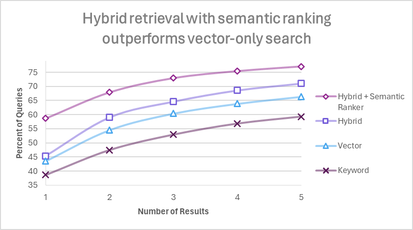
- Hybrid search using Reciprocal Rank Fusion (RRF): Reciprocal Rank Fusion (RRF) is an algorithm that evaluates the search scores from multiple, previously ranked results to produce a unified result set. In Azure Cognitive Search, RRF is used whenever there are two or more queries that execute in parallel. [ref](https://learn.microsoft.com/en-us/azure/search/hybrid-search-ranking)
- [Azure AI Search Python Playground](https://github.com/farzad528/azure-ai-search-python-playground):  a collection of Jupyter notebooks designed to explore the various capabilities of Azure AI Search. [Feb 2024]
- [RAG-Knowledge](https://github.com/microsoft/RAG-Knowledge): Sample code for Data Preprocessing, Chunking, Index Design, Query Optimization [Jun 2024]
- [Integrated vectorization](https://techcommunity.microsoft.com/t5/ai-azure-ai-services-blog/integrated-vectorization-with-azure-openai-for-azure-ai-search/ba-p/4206836): Automatically splits documents into chunks, creates embeddings with Azure OpenAI, maps them to an Azure AI Search index, and automates query vectorization. [24 Aug 2024]

### **Azure AI Services**

- [Artificial intelligence (AI) architecture design](https://learn.microsoft.com/en-us/azure/architecture/ai-ml/):💡Overview Azure AI services, AI development platforms and tools
- Azure OpenAI Service Offerings
  1. Offering: Standard (Default), Batch (Low-cost, Huge workload), Provisioned (High performance)
  1. Offering Region types: Global (World wide), Data_zones (Zone based), Regional (Region based)
- Azure OpenAI Service On Your Data in Public Preview [ref](https://techcommunity.microsoft.com/t5/ai-cognitive-services-blog/introducing-azure-openai-service-on-your-data-in-public-preview/ba-p/3847000) [19 Jun 2023]
- Copilot (FKA. Bing Chat Enterprise) [18 Jul 2023] [Privacy and Protection](https://learn.microsoft.com/en-us/bing-chat-enterprise/privacy-and-protections#protected-by-default)
  1. Doesn't have plugin support
  1. Only content provided in the chat by users is accessible to Bing Chat Enterprise.
- [Models as a Service (MaaS)](https://www.linkedin.com/pulse/model-service-maas-revolutionizing-ai-azure-shibu-kt): A cloud-based AI approach that provides developers and businesses with access to pre-built, pre-trained machine learning models. [Jul 2023]
- Azure OpenAI Finetuning: Babbage-002 is $34/hour, Davinci-002 is $68/hour, and Turbo is $102/hour. [ref](https://techcommunity.microsoft.com/t5/azure-ai-services-blog/fine-tuning-now-available-with-azure-openai-service/ba-p/3954693) [16 Oct 2023]
- Customer Copyright Commitment: protects customers from certain IP claims related to AI-generated content. [ref](https://learn.microsoft.com/en-us/legal/cognitive-services/openai/customer-copyright-commitment) [16 Nov 2023]
- [Assistants API](https://techcommunity.microsoft.com/t5/ai-azure-ai-services-blog/azure-openai-service-announces-assistants-api-new-models-for/ba-p/4049940): Code Interpreter, Function calling, Knowledge retrieval tool, and Threads (Truncated and optimized conversation history for the model's context length) in Azure [06 Feb 2024]
- [Azure AI Foundry](https://ai.azure.com/): Azure AI Foundry portal (formerly Azure AI Studio), and the [Azure AI Foundry SDK](https://aka.ms/aifoundrysdk/reference), our unified SDK with pre-built app templates. `Rebranding for Enhancement: Azure Machine Learning Studio > Azure AI Studio > Azure AI Foundry.` [ref](https://azure.microsoft.com/en-us/blog/the-next-wave-of-azure-innovation-azure-ai-foundry-intelligent-data-and-more/) / [ref](https://learn.microsoft.com/en-us/azure/ai-studio/): Documentation [19 Nov 2024]
  - [Azure AI Agent Service](https://techcommunity.microsoft.com/blog/azure-ai-services-blog/introducing-azure-ai-agent-service/4298357)
  - [Azure AI Content Understanding](https://techcommunity.microsoft.com/blog/azure-ai-services-blog/announcing-azure-ai-content-understanding-transforming-multimodal-data-into-insi/4297196)
  - [Weights & Biases with Azure](https://aka.ms/WBFineTuningPartnership)

### **Research**

1. [Microsoft Office Copilot: Natural Language Commanding via Program Synthesis](https://arxiv.org/abs/2306.03460): [[cnt](https://scholar.google.com/scholar?hl=en&as_sdt=0%2C5&q=arxiv%3A+2306.03460)]: Semantic Interpreter, a natural language-friendly AI system for productivity software such as Microsoft Office that leverages large language models (LLMs) to execute user intent across application features. [6 Jun 2023]
1. [Knowledge-Augmented Large Language Models for Personalized Contextual Query Suggestion](https://arxiv.org/abs/2311.06318): K-LaMP. Contextual memory layer for LLM application [10 Nov 2023]
1. [NL2KQL](https://arxiv.org/abs/2404.02933): From Natural Language to Kusto Query [3 Apr 2024]
1. [GraphRAG (by Microsoft)](https://arxiv.org/abs/2404.16130): RAG with a graph-based approach to efficiently answer both specific and broad questions over large text corpora1. [ref](https://microsoft.github.io/graphrag) / [git](https://github.com/microsoft/graphrag) / [x-ref](#graphrag) [24 Apr 2024]

1. [MatterGen](https://www.microsoft.com/en-us/research/blog/mattergen-a-new-paradigm-of-materials-design-with-generative-ai/): a generative model for inorganic materials design [git](https://github.com/microsoft/mattergen) [13 May 2024] 
1. [SpreadsheetLLM](https://arxiv.org/abs/2407.09025): Introduces an efficient method to encode Excel sheets, outperforming previous approaches with 25 times fewer tokens.[12 Jul 2024]
1. [AutoGen Studio](https://arxiv.org/abs/2408.15247): A No-Code Developer Tool for Building and Debugging Multi-Agent Systems [9 Aug 2024]
1. [Magentic-One](https://aka.ms/magentic-one): A Generalist Multi-Agent System for Solving Complex Tasks [Nov 2024]
1. [PromptWizard](https://www.microsoft.com/en-us/research/blog/promptwizard-the-future-of-prompt-optimization-through-feedback-driven-self-evolving-prompts/): The future of prompt optimization through feedback-driven self-evolving prompts [17 Dec 2024]

### **Azure Reference Architectures**

#### Azure OpenAI Application

- [Miyagi (Integration demo for multiple LangChain libraries)](https://github.com/Azure-Samples/miyagi) [Feb 2023]
 
- [ChatGPT + Enterprise data RAG (Retrieval-Augmented Generation)](https://github.com/Azure-Samples/azure-search-openai-demo) [Feb 2023]
 
- [Azure Cosmos DB + OpenAI ChatGPT](https://github.com/AzureCosmosDB/cosmosdb-nosql-copilot) [Mar 2023]
 
- [Azure OpenAI Embeddings QnA](https://github.com/Azure-Samples/azure-open-ai-embeddings-qna) [Apr 2023]
 
- [C# Implementation (ChatGPT + Enterprise data)](https://github.com/Azure-Samples/azure-search-openai-demo-csharp) [Apr 2023]
 
- [Simple ChatGPT UI application](https://github.com/Azure/openai-at-scale) [Apr 2023]
 
- [Azure Video Indexer demo](https://aka.ms/viopenaidemo) [Apr 2023]
- [Chat with your data - Solution accelerator](https://github.com/Azure-Samples/chat-with-your-data-solution-accelerator) [Jun 2023]
 

|                                                                                                                                                        |                                                                                                                           |
| :----------------------------------------------------------------------------------------------------------------------------------------------------: | :-----------------------------------------------------------------------------------------------------------------------: |
|                              [Azure OpenAI Embeddings QnA](https://github.com/Azure-Samples/azure-open-ai-embeddings-qna) [Apr 2023]                              | [Azure Cosmos DB + OpenAI ChatGPT](https://github.com/AzureCosmosDB/cosmosdb-nosql-copilot) C# blazor [Mar 2023] |
|                                                                        |                              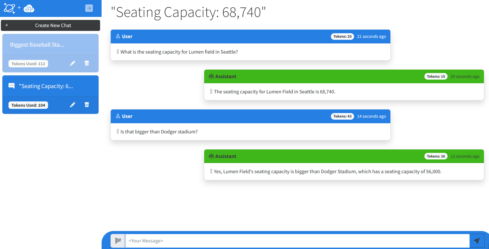                               |
| [C# Implementation](https://github.com/Azure-Samples/azure-search-openai-demo-csharp) ChatGPT + Enterprise data with Azure OpenAI and Cognitive Search [Apr 2023] |          [Simple ChatGPT UI application](https://github.com/Azure/openai-at-scale) TypeScript, ReactJs and Flask  [Apr 2023]        |
|                                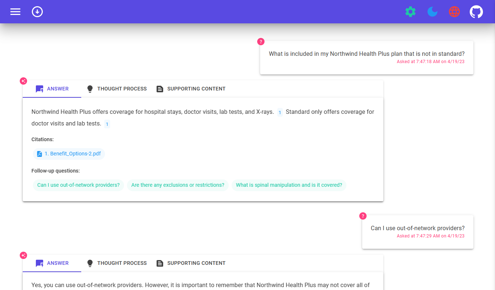                                |                              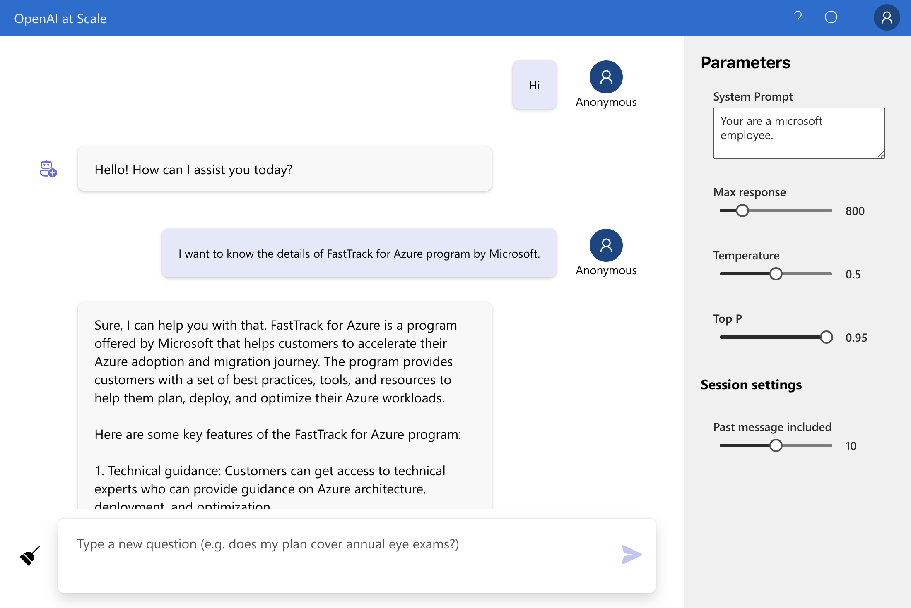                               |
|                                  [Azure Video Indexer demo](https://aka.ms/viopenaidemo) Azure Video Indexer + OpenAI [Apr 2023]                             |        [Miyagi](https://github.com/Azure-Samples/miyagi) Integration demonstrate for multiple langchain libraries [Feb 2023] |
|                                      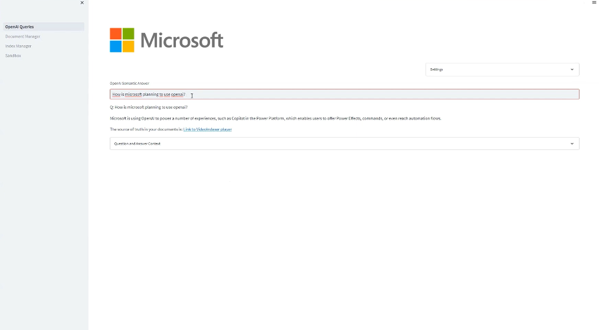                                      |                                                                  |
|                                  [ChatGPT + Enterprise data RAG (Retrieval-Augmented Generation)](https://github.com/Azure-Samples/azure-search-openai-demo)🏆 [Feb 2023]                             |        [Chat with your data - Solution accelerator](https://github.com/Azure-Samples/chat-with-your-data-solution-accelerator) [Jun 2023] |
|                                      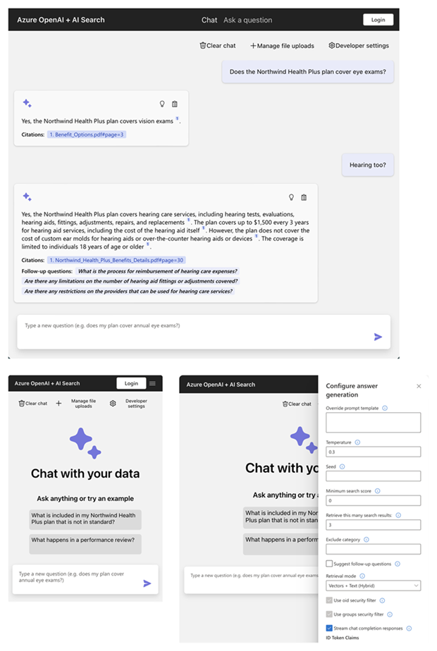                                      |                                 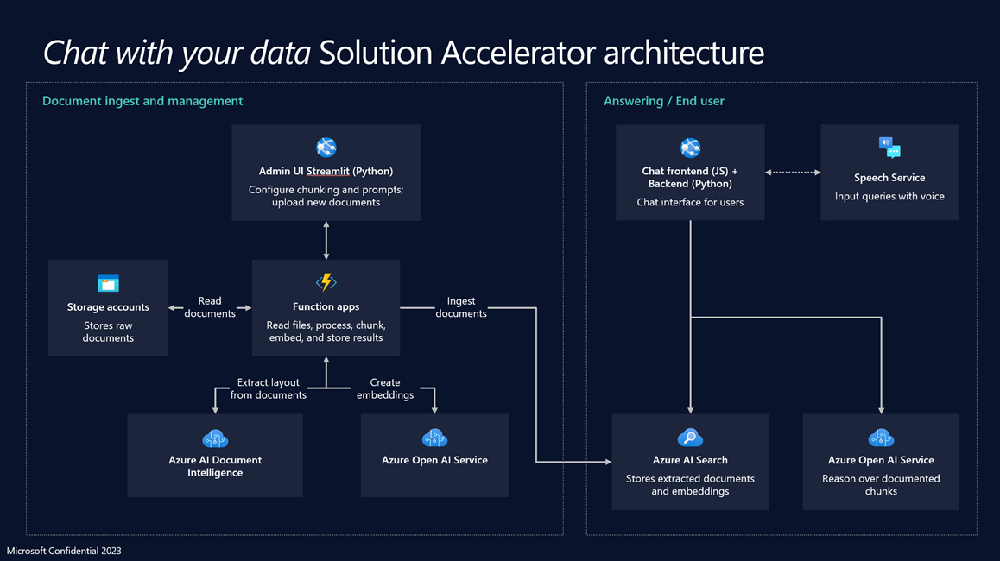                                 |

---

- [An open-source template gallery](https://azure.github.io/awesome-azd/?tags=aicollection): 🏆AI template collection
- ChatGPT + Enterprise data RAG (Retrieval-Augmented Generation) Demo [git](https://github.com/Azure-Samples/azure-search-openai-demo) 🏆/ [📺](https://www.youtube.com/watch?v=tW2EA4aZ_YQ): Can ChatGPT work with your enterprise data? [06 Apr 2023] [8 Feb 2023]

- GPT-Azure-Search-Engine: [git](https://github.com/pablomarin/GPT-Azure-Search-Engine) `Integration of Azure Bot Service with LangChain` [Feb 2023]

- ChatGPT Plugin Quickstart using Python and FastAPI: [git](https://github.com/Azure-Samples/openai-plugin-fastapi) [May 2023]

- [Azure AI CLI](https://github.com/Azure/azure-ai-cli): Interactive command-line tool for ai [Jul 2023]

- [Smart Components](https://github.com/dotnet-smartcomponents/smartcomponents): Experimental, end-to-end AI features for .NET apps [Mar 2024]

- [Prompt Buddy](https://github.com/stuartridout/promptbuddy): 🏆Share and upvote favorite AI prompts. free Microsoft Teams Power App using Dataverse for Teams. [Mar 2024]

- [eShopSupport](https://github.com/dotnet/eshopsupport):💡A reference .NET application using AI for a customer support ticketing system [ref](https://devblogs.microsoft.com/semantic-kernel/eshop-infused-with-ai-a-comprehensive-intelligent-app-sample-with-semantic-kernel/) [Apr 2024]

- [ARGUS](https://github.com/Azure-Samples/ARGUS): Hybrid approach with Azure Document Intelligence combined and GPT4-Vision to get better results without any pre-training. [Jun 2024]

- [VoiceRAG](https://github.com/Azure-Samples/aisearch-openai-rag-audio):💡Voice Using Azure AI Search and the GPT-4o Realtime API for Audio [ref](https://techcommunity.microsoft.com/t5/ai-azure-ai-services-blog/voicerag-an-app-pattern-for-rag-voice-using-azure-ai-search-and/ba-p/4259116) [Sep 2024]

- [AI Dev Gallery](https://github.com/microsoft/ai-dev-gallery):💡Windows application featuring interactive samples powered by local AI models. [Nov 2024] 
- Semantic Kernel sample application [x-ref](#code-recipes)

#### Azure OpenAI Accelerator / samples

- [Microsoft Copilot Studio Samples](https://github.com/microsoft/CopilotStudioSamples): Samples and artifacts for Microsoft Copilot Studio [Oct 2019]

- [Conversational-Azure-OpenAI-Accelerator](https://github.com/MSUSAzureAccelerators/Conversational-Azure-OpenAI-Accelerator) [Feb 2022]

- Enterprise Logging: [git](https://github.com/Azure-Samples/openai-python-enterprise-logging) [Feb 2023]
 
- Azure OpenAI samples: [ref](https://github.com/Azure/azure-openai-samples) [Apr 2023]

- The repository for all Azure OpenAI Samples complementing the OpenAI cookbook.: [ref](https://github.com/Azure-Samples/openai) [Apr 2023]

- Azure-Samples [ref](https://github.com/Azure-Samples)
  - Azure OpenAI with AKS By Terraform: [git](https://github.com/Azure-Samples/aks-openai-terraform) [Jun 2023]

  - Azure OpenAI with AKS By Bicep: [git](https://github.com/Azure-Samples/aks-openai) [May 2023]

- [Azure-Cognitive-Search-Azure-OpenAI-Accelerator](https://github.com/MSUSAzureAccelerators/Azure-Cognitive-Search-Azure-OpenAI-Accelerator) [May 2023]

- Azure OpenAI with AKS by Terraform (simple version): [git](https://github.com/Azure-Samples/azure-openai-terraform-deployment-sample) [May 2023]

- Azure OpenAI Network Latency Test Script
: [git](https://github.com/wloryo/networkchatgpt/blob/dc76f2264ff8c2a83392e6ae9ee2aaa55ca86f0e/openai_network_latencytest_nocsv_pub_v1.1.py) [Jun 2023]
- [GPT-RAG](https://github.com/Azure/GPT-RAG):💡Enterprise RAG Solution Accelerator (GPT-RAG). Retrieval-Augmented Generation pattern running in Azure. [Jun 2023] 
- [RAG for Azure Data](https://github.com/microsoft/AzureDataRetrievalAugmentedGenerationSamples): Retrieval Augmented Generation (RAG) for Azure Data [Jun 2023]

- Create an Azure OpenAI, LangChain, ChromaDB, and Chainlit ChatGPT-like application in Azure Container Apps using Terraform [git](https://github.com/Azure-Samples/container-apps-openai/) [Jul 2023]
- [AI-in-a-Box](https://github.com/Azure/AI-in-a-Box): AI-in-a-Box aims to provide an "Azure AI/ML Easy Button" for common scenarios [Sep 2023]

- [Azure SQL DB + AOAI](https://github.com/Azure-Samples/SQL-AI-samples): AI applications built on data from an Azure SQL Database [Oct 2023]

- [Azure Functions (C#) bindings for OpenAI](https://github.com/Azure/azure-functions-openai-extension) [Nov 2023]

- [Evaluating a RAG Chat App](https://github.com/Azure-Samples/ai-rag-chat-evaluator): Tools for evaluation of RAG Chat Apps using Azure AI Evaluate SDK [Nov 2023]

- [Smart load balancing for AOAI](https://github.com/Azure-Samples/openai-aca-lb): Smart load balancing for OpenAI endpoints [Jan 2024]

- [Setting up Azure OpenAI with Azure API Management](https://github.com/Azure/enterprise-azureai) [Jan 2024]
 
- [AI Samples for .NET](https://github.com/dotnet/ai-samples):  official .NET samples demonstrating how to use AI [Feb 2024]

- [OpenAI Official .NET Library](https://github.com/openai/openai-dotnet/) [Apr 2024]
- [azure-llm-fine-tuning](https://github.com/Azure/azure-llm-fine-tuning): SLM/LLM Fine-tuning on Azure [May 2024]

- [OpenAI Chat Application with Microsoft Entra Authentication](https://github.com/Azure-Samples/openai-chat-app-entra-auth-builtin): Microsoft Entra ID for user authentication [May 2024]

- [AI-Sentry](https://github.com/microsoft/ai-sentry): A lightweight, pluggable facade layer for AOAI [Jun 2024]

- [Generic accelerator for Build your own copilot](https://github.com/microsoft/Generic-Build-your-own-copilot-Solution-Accelerator): Chat with your own data, generate a document template using your own data, and exporting the document in a docx format. [Jun 2024] 
- [Azure Multimodal AI + LLM Processing Accelerator](https://github.com/Azure/multimodal-ai-llm-processing-accelerator): Build multimodal data processing pipelines with Azure AI Services + LLMs [Aug 2024]

- [Fabric notebooks for analyzing chat history stored in CosmosDB](https://github.com/microsoft/fabric-cosmosdb-chat-analytics) [Sep 2024]

- [Microsoft.Extensions.AI](https://devblogs.microsoft.com/dotnet/introducing-microsoft-extensions-ai-preview/): a unified layer of C# abstractions for interacting with AI services, such as small and large language models (SLMs and LLMs), embeddings, and middleware. [8 Oct 2024]
- [Document Processing with Azure AI Samples](https://github.com/Azure-Samples/azure-ai-document-processing-samples): Demonstrates how to use Azure AI Document Intelligence, Azure OpenAIS [Oct 2024] 

#### Referece: Use Case and Architecture

- [Azure OpenAI chat baseline architecture](https://learn.microsoft.com/en-us/azure/architecture/ai-ml/architecture/basic-openai-e2e-chat):💡Designing your production enterprise chat applications. [git](https://github.com/Azure-Samples/openai-end-to-end-basic) 
- [How real-world businesses are transforming with AI](https://blogs.microsoft.com/blog/2024/11/12/how-real-world-businesses-are-transforming-with-ai/):💡Collected over 200 examples of how organizations are leveraging Microsoft’s AI capabilities. [12 Nov 2024]
- [AI Feed](https://techcommunity.microsoft.com/t5/artificial-intelligence-and/ct-p/AI) | [AI Platform Blog](https://techcommunity.microsoft.com/t5/ai-ai-platform-blog/bg-p/AIPlatformBlog)
- [Microsoft AI / Responsible AI](https://aka.ms/RAIResources) 🏆
- [Responsible AI Transparency Report](https://www.microsoft.com/en-us/corporate-responsibility/responsible-ai-transparency-report)
- [Baseline OpenAI end-to-end chat reference architecture](https://learn.microsoft.com/en-us/azure/architecture/ai-ml/architecture/baseline-openai-e2e-chat)
- [Build language model pipelines with memory](https://learn.microsoft.com/en-us/azure/architecture/ai-ml/openai/guide/language-model-pipelines)
- [Designing and developing a RAG solution](https://learn.microsoft.com/en-us/azure/architecture/ai-ml/guide/rag/rag-solution-design-and-evaluation-guide)
- [Azure OpenAI workshop](https://github.com/microsoft/OpenAIWorkshop): Workshop materials to build intelligent solutions on Open AI [Feb 2023]

- [Check Your Facts and Try Again: Improving Large Language Models with External Knowledge and Automated Feedback](https://www.microsoft.com/en-us/research/group/deep-learning-group/articles/check-your-facts-and-try-again-improving-large-language-models-with-external-knowledge-and-automated-feedback/) [07 Mar 2023]
- [Revolutionize your Enterprise Data with ChatGPT](https://techcommunity.microsoft.com/t5/ai-applied-ai-blog/revolutionize-your-enterprise-data-with-chatgpt-next-gen-apps-w/ba-p/3762087) [09 Mar 2023]
- [Azure OpenAI Design Patterns](https://github.com/microsoft/azure-openai-design-patterns): A set of design patterns using the Azure OpenAI service [May 2023] 
- [Grounding LLMs](https://techcommunity.microsoft.com/t5/fasttrack-for-azure/grounding-llms/ba-p/3843857): Retrieval-Augmented Generation (RAG) [09 Jun 2023]
- [Azure AI Services Landing Zone](https://github.com/FreddyAyala/AzureAIServicesLandingZone) / [ref](https://techcommunity.microsoft.com/t5/azure-architecture-blog/azure-openai-landing-zone-reference-architecture/ba-p/3882102) [24 Jul 2023]

- [An Introduction to LLMOps](https://techcommunity.microsoft.com/t5/ai-machine-learning-blog/an-introduction-to-llmops-operationalizing-and-managing-large/ba-p/3910996): Operationalizing and Managing Large Language Models using Azure ML [27 Aug 2023]
- [Azure OpenAI RAG workshop](https://github.com/Azure-Samples/azure-openai-rag-workshop): RAG using LangChain.js and OpenAI. Hosted on Azure Static Web Apps and Azure Container Apps, with Azure AI Search as the vector database. [ref](https://aka.ms/ws/openai-rag) [8 Nov 2023]
- [Azure Command Companion](https://techcommunity.microsoft.com/t5/analytics-on-azure-blog/azure-command-companion/ba-p/4005044): Harnessing the Power of OpenAI GPT-3.5 Turbo for Azure CLI Command Generation [10 Dec 2023]
- [Integrate private access to your Azure Open AI Chatbot](https://techcommunity.microsoft.com/t5/fasttrack-for-azure/integrate-private-access-to-your-azure-open-ai-chatbot/ba-p/3994613) [30 Nov 2023]
- [Authentication and Authorization in Generative AI applications with Entra ID and Azure AI Search](https://techcommunity.microsoft.com/t5/fasttrack-for-azure/authentication-and-authorization-in-generative-ai-applications/ba-p/4022277) [09 Jan 2024]
- [Chat with your Azure DevOps data](https://techcommunity.microsoft.com/t5/fasttrack-for-azure/chat-with-your-azure-devops-data/ba-p/4017784) [10 Jan 2024]
- [Security Best Practices for GenAI Applications (OpenAI) in Azure](https://techcommunity.microsoft.com/t5/azure-architecture-blog/security-best-practices-for-genai-applications-openai-in-azure/ba-p/4027885) [16 Jan 2024]
- [Safeguard and trustworthy generative AI applications](https://azure.microsoft.com/en-us/blog/announcing-new-tools-in-azure-ai-to-help-you-build-more-secure-and-trustworthy-generative-ai-applications/) [28 Mar 2024]
- [Optimize Azure OpenAI Applications with Semantic Caching](https://techcommunity.microsoft.com/t5/azure-architecture-blog/optimize-azure-openai-applications-with-semantic-caching/ba-p/4106867) [09 Apr 2024]
- [Azure OpenAI and Call Center Modernization](https://techcommunity.microsoft.com/t5/azure-architecture-blog/azure-openai-and-call-center-modernization/ba-p/4107070) [11 Apr 2024]
- [Using keyless authentication with Azure OpenAI](https://techcommunity.microsoft.com/t5/microsoft-developer-community/using-keyless-authentication-with-azure-openai/ba-p/4111521) [12 Apr 2024]
- [Azure OpenAI Best Practices Insights from Customer Journeys](https://techcommunity.microsoft.com/t5/ai-azure-ai-services-blog/azure-openai-best-practices-insights-from-customer-journeys/ba-p/4166943): LLMLingua, Skeleton Of Thought [12 Jun 2024]
- [NL to SQL Architecture Alternative](https://techcommunity.microsoft.com/t5/azure-architecture-blog/nl-to-sql-architecture-alternatives/ba-p/4136387) [14 May 2024] / [Natural Language to SQL Console](https://github.com/microsoft/kernel-memory/tree/NL2SQL/examples/200-dotnet-nl2sql)
- [Microsoft AI Tour](https://github.com/microsoft/aitour-repo-principal-list): a session and workshop how to best leverage AI [Aug 2024]
- [Baseline Agentic AI Systems Architecture](https://techcommunity.microsoft.com/t5/ai-machine-learning-blog/baseline-agentic-ai-systems-architecture/ba-p/4207137) [20 Aug 2024]
- [AI Agent-Driven Auto Insurance Claims RAG Pipeline](https://techcommunity.microsoft.com/t5/azure-architecture-blog/exploring-ai-agent-driven-auto-insurance-claims-rag-pipeline/ba-p/4233779) [09 Sep 2024]
- [Retrieval Augmented Fine Tuning](https://techcommunity.microsoft.com/t5/ai-ai-platform-blog/retrieval-augmented-fine-tuning-use-gpt-4o-to-fine-tune-gpt-4o/ba-p/4248861): RAFT: Combining the best parts of RAG and fine-tuning (SFT) [25 Sep 2024]
- [Partner Resources: AI & ML Academy](https://microsoft.github.io/PartnerResources/skilling/ai-ml-academy)💡a comprehensive learning resource provided by Microsoft for partners and developers

## **Applications and Frameworks**

- [900 most popular open source AI tools](https://huyenchip.com/2024/03/14/ai-oss.html):🏆What I learned from looking at 900 most popular open source AI tools [list](https://huyenchip.com/llama-police) [Mar 2024]
- [Open100: Top 100 Open Source achievements.](https://www.benchcouncil.org/evaluation/opencs/annual.html)
- [Generative AI Design Patterns](https://towardsdatascience.com/generative-ai-design-patterns-a-comprehensive-guide-41425a40d7d0): 9 architecture patterns for working with LLMs. [Feb 2024]
- [Awesome LLM Apps](https://github.com/Shubhamsaboo/awesome-llm-apps): A curated collection of awesome LLM apps built with RAG and AI agents. [Apr 2024]
 
- [GenAI Agents](https://github.com/NirDiamant/GenAI_Agents):🏆Tutorials and implementations for various Generative AI Agent techniques, from basic to advanced. [Sep 2024]
 
- [The Last Mile Problem: Why Your AI Models Stumble Before the Finish Line](https://solutionsreview.com/data-management/the-last-mile-problem-why-your-ai-models-stumble-before-the-finish-line/): According to Gartner, by 2025, at least 30 percent of GenAI projects will be abandoned after the POC stage. [25 Oct 2024]

### **Applications, Frameworks, and User Interface (UI/UX)**

#### **LLM Training/Build**

1. [fastText](https://github.com/facebookresearch/fastText): A library for efficient learning of word representations and sentence classification [Aug 2016]

1. [Pytorch](https://pytorch.org/): PyTorch is the most favorite library among researchers. [Papers with code Trends](https://paperswithcode.com/trends) [Sep 2016]
1. [fairseq](https://github.com/facebookresearch/fairseq): a sequence modeling toolkit that allows researchers and developers to train custom models for translation, summarization, language modeling [Sep 2017]

1. [huggingface/transformers: 🤗 Transformers: State-of-the-art Machine Learning for Pytorch, TensorFlow, and JAX. (github.com)](https://github.com/huggingface/transformers) [Oct 2018]

1. [jax](https://github.com/google/jax): JAX is Autograd (automatically differentiate native Python & Numpy) and XLA (compile and run NumPy) [Oct 2018]

1. [Sentence Transformers](https://arxiv.org/abs/1908.10084): Python framework for state-of-the-art sentence, text and image embeddings. Useful for semantic textual similar, semantic search, or paraphrase mining. [git](https://github.com/UKPLab/sentence-transformers) [27 Aug 2019]

1. [Weights & Biases](https://github.com/wandb/examples): Visualizing and tracking your machine learning experiments [wandb.ai](https://wandb.ai/) doc: `deeplearning.ai/wandb` [Jan 2020]

1. [mosaicml/llm-foundry](https://github.com/mosaicml/llm-foundry): LLM training code for MosaicML foundation models [Jun 2022]

1. [vLLM](https://github.com/vllm-project/vllm): Easy-to-use library for LLM inference and serving. [Feb 2023]

1. [string2string](https://github.com/stanfordnlp/string2string): an open-source tool that offers a comprehensive suite of efficient algorithms for a broad range of string-to-string problems. [Mar 2023] <!--  -->

1. [GPT4All](https://github.com/nomic-ai/gpt4all): Open-source large language models that run locally on your CPU [Mar 2023]

1. [Visual Blocks](https://github.com/google/visualblocks): Google visual programming framework that lets you create ML pipelines in a no-code graph editor. [Mar 2023]

1. [LLaMA-Factory](https://github.com/hiyouga/LLaMA-Factory): Unify Efficient Fine-Tuning of 100+ LLMs [May 2023]

1. [ollama](https://github.com/jmorganca/ollama): Running with Large language models locally [Jun 2023]

1. [unsloth](https://github.com/unslothai/unsloth): Finetune Mistral, Gemma, Llama 2-5x faster with less memory! [Nov 2023]

1. [LM Studio](https://lmstudio.ai/): UI for Discover, download, and run local LLMs [May 2024]
1. [YaFSDP](https://github.com/yandex/YaFSDP): Yet another Fully Sharded Data Parallel (FSDP): enhanced for distributed training. YaFSDP vs DeepSpeed. [May 2024]

1. [exo](https://github.com/exo-explore/exo): Run your own AI cluster at home with everyday devices [Jun 2024]

1. [BitNet](https://github.com/microsoft/BitNet): Official inference framework for 1-bit LLMs [Aug 2024]

1. [Meta Lingua](https://github.com/facebookresearch/lingua): a minimal and fast LLM training and inference library designed for research. [Oct 2024]


#### **LLM Application Development**

1. [mindsdb](https://github.com/mindsdb/mindsdb): The open-source virtual database for building AI from enterprise data. It supports SQL syntax for development and deployment, with over 70 technology and data integrations. [Aug 2018] 
1. [Jina-Serve](https://github.com/jina-ai/serve): a framework for building and deploying AI services that communicate via gRPC, HTTP and WebSockets. [Feb 2020] 
1. [superduper](https://github.com/superduper-io/superduper): Build end-to-end AI-data workflows and applications with your favourite tools. [Aug 2022] 
1. [langflow](https://github.com/logspace-ai/langflow): LangFlow is a UI for LangChain, designed with react-flow. [Feb 2023]

1. [MiniChain](https://github.com/srush/MiniChain): A tiny library for coding with llm [Feb 2023]

1. [marvin](https://github.com/PrefectHQ/marvin): a lightweight AI toolkit for building natural language interfaces. [Mar 2023]

1. [microsoft/Tokenizer](https://github.com/microsoft/Tokenizer): Tiktoken in C#: .NET and TypeScript implementation of BPE tokenizer for OpenAI LLMs. [Mar 2023] 
1. [Azure OpenAI Proxy](https://github.com/scalaone/azure-openai-proxy): OpenAI API requests converting into Azure OpenAI API requests [Mar 2023]

1. [ChainForge](https://github.com/ianarawjo/ChainForge): An open-source visual programming environment for battle-testing prompts to LLMs. [Mar 2023] 
1. [E2B](https://github.com/e2b-dev/e2b): an open-source infrastructure that allows you run to AI-generated code in secure isolated sandboxes in the cloud. [Mar 2023] 
1. [Flowise](https://github.com/FlowiseAI/Flowise) Drag & drop UI to build your customized LLM flow [Apr 2023]

1. [Dify](https://github.com/langgenius/dify): an open-source platform for building applications with LLMs, featuring an intuitive interface for AI workflows and model management. [Apr 2023] 
1. [ThinkGPT](https://github.com/jina-ai/thinkgpt): Chain of Thoughts library [Apr 2023]

1. [langfuse](https://github.com/langfuse/langfuse): Traces, evals, prompt management and metrics to debug and improve your LLM application. [May 2023]

1. [Superagent](https://github.com/superagent-ai/superagent): AI Assistant Framework & API [May 2023]

1. [DemoGPT](https://github.com/melih-unsal/DemoGPT): Automatic generation of LangChain code [Jun 2023]

1. [Spring AI](https://github.com/spring-projects-experimental/spring-ai): Developing AI applications for Java. [Jul 2023]

1. [litellm](https://github.com/BerriAI/litellm): Python SDK to call 100+ LLM APIs in OpenAI format [Jul 2023]

1. [Opencopilot](https://github.com/openchatai/copilot): Build and embed open-source AI Copilots. [Aug 2023]

1. [BISHENG](https://github.com/dataelement/bisheng): an open LLM application devops platform, focusing on enterprise scenarios. [Aug 2023]

1. [langfun](https://github.com/google/langfun): leverages PyGlove to integrate LLMs and programming. [Aug 2023]

1. [mirascope](https://github.com/Mirascope/mirascope): a library that simplifies working with LLMs via a unified interface for multiple providers. [Dec 2023] 
1. [Pipecat](https://github.com/pipecat-ai/pipecat): Open Source framework for voice and multimodal conversational AI [Dec 2023] 
1. [Refly](https://github.com/refly-ai/refly): WYSIWYG AI editor to create llm application. [Feb 2024] 
1. [Llama Stack](https://github.com/meta-llama/llama-stack):💡building blocks for Large Language Model (LLM) development [Jun 2024]

1. [aisuite](https://github.com/andrewyng/aisuite): Andrew Ng launches a tool offering a simple, unified interface for multiple generative AI providers. [26 Nov 2024]  vs [litellm](https://github.com/BerriAI/litellm) vs [OpenRouter](https://github.com/OpenRouterTeam/openrouter-runner)
1. [PocketFlow](https://github.com/miniLLMFlow/PocketFlow): Minimalist LLM Framework in 100 Lines. Enable LLMs to Program Themselves. [Dec 2024] 

#### **LLM Memory**

1. [zep](https://github.com/getzep/zep): Long term memory layer. Zep intelligently integrates new information into the user's Knowledge Graph.  [May 2023]
1. [Mem0](https://github.com/mem0ai/mem0):💡A self-improving memory layer for personalized AI experiences. [Jun 2023]

1. [Letta (previously MemGPT)](https://github.com/letta-ai/letta): Virtual context management to extend the limited context of LLM. A tiered memory system and a set of functions that allow it to manage its own memory. [ref](https://memgpt.ai) / [git:old](https://github.com/cpacker/MemGPT) [12 Oct 2023] 
1. [Memary](https://github.com/kingjulio8238/Memary): memary mimics how human memory evolves and learns over time. The memory module comprises the Memory Stream and Entity Knowledge Store. [May 2024] 

#### **LLM Application**

1. [OpenBB](https://github.com/OpenBB-finance/OpenBB): The first financial Platform that is free and fully open source. AI-powered workspace [Dec 2020] 
1. [knowledge](https://github.com/KnowledgeCanvas/knowledge): Tool for saving, searching, accessing, and exploring websites and files. Electron based app, built-in Chromium browser, knowledge graph [Jul 2021] 
1. [Nomic python client](https://github.com/nomic-ai/nomic): Generate, store and retrieve embeddings for your unstructured data. supports from hundreds to tens of millions of points. [Jul 2022] 
1. [guardrails](https://github.com/guardrails-ai/guardrails): Adding guardrails to large language models. [Jan 2023]

1. [aider](https://github.com/paul-gauthier/aider): AI pair programming in your terminal [Jan 2023]

1. [BookGPT](https://github.com/mikavehns/BookGPT): Generate books based on your specification [Jan 2023]

1. [KnowledgeGPT](https://github.com/mmz-001/knowledge_gpt): Upload your documents and get answers to your questions, with citations [Jan 2023]

1. [DocsGPT](https://github.com/arc53/docsgpt): Chatbot for document with your data [Feb 2023]

1. [LibreChat](https://github.com/danny-avila/LibreChat): a free, open source AI chat platform. [8 Mar 2023] 
1. [BIG-AGI](https://github.com/enricoros/big-agi) FKA nextjs-chatgpt-app [Mar 2023]

1. [Next.js AI Chatbot](https://github.com/vercel/ai-chatbot):💡An Open-Source AI Chatbot Template Built With Next.js and the AI SDK by Vercel. [May 2023] 
1. [dataline](https://github.com/RamiAwar/dataline): Chat with your data - AI data analysis and visualization [Apr 2023]

1. [pyspark-ai](https://github.com/pyspark-ai/pyspark-ai): English instructions and compile them into PySpark objects like DataFrames. [Apr 2023]

1. [vanna](https://github.com/vanna-ai/vanna): Chat with your SQL database [May 2023]

1. [Continue](https://github.com/continuedev/continue): open-source AI code assistant inside of VS Code and JetBrains. [May 2023]

1. [localGPT](https://github.com/PromtEngineer/localGPT): Chat with your documents on your local device [May 2023]

1. [anything-llm](https://github.com/Mintplex-Labs/anything-llm): All-in-one Desktop & Docker AI application with built-in RAG, AI agents, and more. [Jun 2023] 
1. [Dialoqbase](https://github.com/n4ze3m/dialoqbase): Create custom chatbots with your own knowledge base using PostgreSQL [Jun 2023]

1. [GPT Researcher](https://github.com/assafelovic/gpt-researcher): Autonomous agent designed for comprehensive online research [Jul 2023] / [GPT Newspaper](https://github.com/assafelovic/gpt-newspaper): Autonomous agent designed to create personalized newspapers [Jan 2024]
 
1. [Postiz](https://github.com/gitroomhq/postiz-app): AI social media scheduling tool. An alternative to: Buffer.com, Hypefury, Twitter Hunter. [Jul 2023] 
1. [SolidGPT](https://github.com/AI-Citizen/SolidGPT): AI searching assistant for developers (VSCode Extension) [Aug 2023]

1. [notesGPT](https://github.com/Nutlope/notesGPT): Record voice notes & transcribe, summarize, and get tasks [Nov 2023]

1. [screenshot-to-code](https://github.com/abi/screenshot-to-code): Drop in a screenshot and convert it to clean code (HTML/Tailwind/React/Vue) [Nov 2023]

1. [Geppeto](https://github.com/Deeptechia/geppetto): Advanced Slack bot using multiple AI models [Jan 2024]

1. [code2prompt](https://github.com/mufeedvh/code2prompt/): a command-line tool (CLI) that converts your codebase into a single LLM prompt with a source tree [Mar 2024]
1. [OpenHands](https://github.com/All-Hands-AI/OpenHands): OpenHands (formerly OpenDevin), a platform for software development agents [Mar 2024]

1. [LlamaFS](https://github.com/iyaja/llama-fs): Automatically renames and organizes your files based on their contents [May 2024]

1. [Cellm](https://github.com/getcellm/cellm): Use LLMs in Excel formulas [Jul 2024] 
1. [Nyro](https://github.com/trynyro/nyro-app): AI-Powered Desktop Productivity Tool [Aug 2024]

1. [Auto_Jobs_Applier_AIHawk](https://github.com/feder-cr/Auto_Jobs_Applier_AIHawk): automates the jobs application [Aug 2024]

1. [PDF2Audio](https://github.com/lamm-mit/PDF2Audio): an open-source alternative to NotebookLM for podcast creation [Sep 2024]

1. [o1-engineer](https://github.com/Doriandarko/o1-engineer): a command-line tool designed to assist developers [Sep 2024]

1. [Zed](https://github.com/zed-industries/zed): AI code editor from the creators of Atom and Tree-sitter [Sep 2024]

1. [Cofounder](https://github.com/raidendotai/cofounder): full stack generative web apps ; backend + db + stateful web apps [Sep 2024]

1. [Podcastfy.ai](https://github.com/souzatharsis/podcastfy): An Open Source API alternative to NotebookLM's podcast feature. [Oct 2024] 

#### **Code editor incl. Proprietary Software**

- AI Code Editor: [Replit Agent](https://replit.com/) [09 Sep 2024] / [Cursor](https://www.cursor.com/) [Mar 2023]
- [Vercel AI](https://sdk.vercel.ai/) Vercel AI Toolkit for TypeScript
- [Cline](https://github.com/cline/cline): CLI aNd Editor. Autonomous coding agent. VSCode Extension. [Jul 2024] 
- [void](https://github.com/voideditor/void) OSS Cursor alternative. a fork of vscode [Oct 2024]

- [Github Spark](https://githubnext.com/projects/github-spark): an AI-powered tool for creating and sharing micro apps (“sparks”) [29 Oct 2024]
- [bolt.new](https://github.com/stackblitz/bolt.new): Dev Sanbox with AI from stackblitz [Sep 2024]

- [Windsurf editor](https://codeium.com/windsurf): Flows = Agents + Copilots. Cascades (a specific implementation of AI Flows. Advanced chat interface). [13 Nov 2024]
- [devin.cursorrules](https://github.com/grapeot/devin.cursorrules): Transform your Cursor or Windsurf IDE into a Devin-like AI Assistant [Dec 2024] 

#### **UI/UX**

1. [Gradio](https://github.com/gradio-app/gradio): Build Machine Learning Web Apps - in Python [Mar 2023]

1. [GPT 学术优化 (GPT Academic)](https://github.com/binary-husky/gpt_academic): UI Platform for Academic & Coding Tasks. Optimized for paper reading, writing, and editing. [Mar 2023] 
1. [Text generation web UI](https://github.com/oobabooga/text-generation-webui): Text generation web UI [Mar 2023]

1. Open AI Chat Mockup: An open source ChatGPT UI. [mckaywrigley/chatbot-ui](https://github.com/mckaywrigley/chatbot-ui) [Mar 2023]

1. [chainlit](https://github.com/Chainlit/chainlit): Build production-ready Conversational AI applications in minutes. [Mar 2023]

1. [CopilotKit](https://github.com/CopilotKit/CopilotKit): Built-in React UI components [Jun 2023]

1. [Open-source GPT Wrappers](https://star-history.com/blog/gpt-wrappers) 1. [ChatGPT-Next-Web](https://github.com/ChatGPTNextWeb/ChatGPT-Next-Web) [Mar 2023] 2. [FastGPT](https://github.com/labring/FastGPT) [Feb 2023] 3. [Lobe Chat](https://github.com/lobehub/lobe-chat) [Jan 2024]
  
1. [anse](https://github.com/anse-app/anse): UI for multiple models such as ChatGPT, DALL-E and Stable Diffusion. [Apr 2023]

1. [Open WebUI](https://github.com/open-webui/open-webui): User-friendly AI Interface (Supports Ollama, OpenAI API, ...) [Oct 2023] 

#### **Data Processing and Management**

1. [Camelot](https://github.com/camelot-dev/camelot) a Python library that can help you extract tables from PDFs! [ref](https://github.com/camelot-dev/camelot/wiki/Comparison-with-other-PDF-Table-Extraction-libraries-and-tools): Comparison with other PDF Table Extraction libraries [Jul 2016]

1. [Trafilatura](https://github.com/adbar/trafilatura): Gather text from the web and convert raw HTML into structured, meaningful data. [Apr 2019]

1. Math formula OCR: [MathPix](https://mathpix.com/), OSS [LaTeX-OCR](https://github.com/lukas-blecher/LaTeX-OCR) [Jan 2021]

1. [activeloopai/deeplake](https://github.com/activeloopai/deeplake): AI Vector Database for LLMs/LangChain. Doubles as a Data Lake for Deep Learning. Store, query, version, & visualize any data. Stream data in real-time to PyTorch/TensorFlow. [ref](https://activeloop.ai) [Jun 2021]

1. [PostgresML](https://github.com/postgresml/postgresml): The GPU-powered AI application database. [Apr 2022]

1. [unstructured](https://github.com/Unstructured-IO/unstructured): Open-Source Pre-Processing Tools for Unstructured Data [Sep 2022]

1. [outlines](https://github.com/dottxt-ai/outlines): Structured Text Generation [Mar 2023]

1. [pandas-ai](https://github.com/Sinaptik-AI/pandas-ai): Chat with your database (SQL, CSV, pandas, polars, mongodb, noSQL, etc). [Apr 2023] 
1. [Instructor](https://github.com/jxnl/instructor): Structured outputs for LLMs, easily map LLM outputs to structured data. [Jun 2023]

1. [Nougat](https://arxiv.org/abs/2308.13418): Neural Optical Understanding for Academic Documents: The academic document PDF parser that understands LaTeX math and tables. [git](https://github.com/facebookresearch/nougat) [25 Aug 2023]

1. [Marker](https://github.com/VikParuchuri/marker): converts PDF to markdown [Oct 2023]

1. [Maxun](https://github.com/getmaxun/maxun): Open-Source No-Code Web Data Extraction Platform [Oct 2023]

1. [firecrawl](https://github.com/mendableai/firecrawl): Scrap entire websites into LLM-ready markdown or structured data. [Apr 2024]

1. [Crawl4AI](https://github.com/unclecode/crawl4ai): Open-source LLM Friendly Web Crawler & Scrapper [May 2024]

1. [MegaParse](https://github.com/quivrhq/megaparse): a powerful and versatile parser that can handle various types of documents. Focus on having no information loss during parsing. [30 May 2024] 
1. [Zerox OCR](https://github.com/getomni-ai/zerox): Zero shot pdf OCR with gpt-4o-mini [Jul 2024]

1. [docling](https://github.com/DS4SD/docling): IBM. Docling parses documents and exports them to the desired format. [13 Nov 2024] 
1. [markitdown](https://github.com/microsoft/markitdown): Python tool for converting files and office documents to Markdown. [14 Nov 2024] 
1. Azure AI Document Intelligence (FKA. Azure Form Recognizer): [ref](https://learn.microsoft.com/en-us/azure/ai-services/document-intelligence): Table and Meta data Extraction in the Document
1. [Table to Markdown](https://tabletomarkdown.com/): LLM can recognize Markdown-formatted tables more effectively than raw table formats.

#### **Sample code**

- Streaming with Azure OpenAI [SSE](https://github.com/thivy/azure-openai-js-stream) [May 2023]

- [TaxyAI/browser-extension](https://github.com/TaxyAI/browser-extension): Browser Automation by Chrome debugger API and Prompt > `src/helpers/determineNextAction.ts` [Mar 2023]

- Embedding does not use Open AI. Can be executed locally: [pdfGPT](https://github.com/bhaskatripathi/pdfGPT) [Mar 2023]

- Langchain Ask PDF (Tutorial): [git](https://github.com/alejandro-ao/langchain-ask-pdf) [Apr 2023]


#### **Cross-reference**

- RAG: [x-ref](#rag-solution-design--application)
- Agent Applications and Libraries: [x-ref](#agent-applications-and-libraries)
- OSS Alternatives for OpenAI Code Interpreter: [x-ref](#oss-alternatives-for-openai-code-interpreter-aka-advanced-data-analytics)
- LLMOps: Large Language Model Operations: [x-ref](#llmops-large-language-model-operations)

### **Caching**

- Caching: A technique to store data that has been previously retrieved or computed, so that future requests for the same data can be served faster.
- To reduce latency, cost, and LLM requests by serving pre-computed or previously served responses.
- Strategies for caching: Caching can be based on item IDs, pairs of item IDs, constrained input, or pre-computation. Caching can also leverage embedding-based retrieval, approximate nearest neighbor search, and LLM-based evaluation. [ref](https://eugeneyan.com/writing/llm-patterns/#caching-to-reduce-latency-and-cost)
- GPTCache: Semantic cache for LLMs. Fully integrated with LangChain and llama_index. [git](https://github.com/zilliztech/GPTCache) [Mar 2023]
 
- [Prompt Cache: Modular Attention Reuse for Low-Latency Inference](https://arxiv.org/abs/2311.04934): LLM inference by reusing precomputed attention states from overlapping prompts. [7 Nov 2023]
- [Prompt caching with Claude](https://www.anthropic.com/news/prompt-caching): Reducing costs by up to 90% and latency by up to 85% for long prompts. [15 Aug 2024]

### **Defensive UX**

- Defensive UX: A design strategy that aims to prevent and handle errors in user interactions with machine learning or LLM-based products.
- Why defensive UX?: Machine learning and LLMs can produce inaccurate or inconsistent output, which can affect user trust and satisfaction. Defensive UX can help by increasing accessibility, trust, and UX quality.
- [Guidelines for Human-AI Interaction](https://www.microsoft.com/en-us/research/publication/guidelines-for-human-ai-interaction/): Microsoft: Based on a survey of 168 potential guidelines from various sources, they narrowed it down to 18 action rules organized by user interaction stages.
- [People + AI Guidebook](https://pair.withgoogle.com/guidebook/): Google: Google’s product teams and academic research, they provide 23 patterns grouped by common questions during the product development process3.
- [Human Interface Guidelines for Machine Learning](https://developer.apple.com/design/human-interface-guidelines/machine-learning): Apple: Based on practitioner knowledge and experience, emphasizing aspects of UI rather than model functionality4.

### **Proposals & Other topics**

- [/llms.txt](https://llmstxt.org/): Proposal for an `/llms.txt` file to guide LLMs in using websites during inference. [git](https://github.com/answerdotai/llms-txt) [3 Sep 2024]
 
- [Model Context Protocol (MCP)](https://www.anthropic.com/news/model-context-protocol): Anthropic proposes an open protocol for seamless LLM integration with external data and tools. [git](https://github.com/modelcontextprotocol/servers) [26 Nov 2024]
 

### **LLM for Robotics: Bridging AI and Robotics**

- PromptCraft-Robotics: Robotics and a robot simulator with ChatGPT integration [git](https://github.com/microsoft/PromptCraft-Robotics) [Feb 2023]
 
- ChatGPT-Robot-Manipulation-Prompts: A set of prompts for Communication between humans and robots for executing tasks. [git](https://github.com/microsoft/ChatGPT-Robot-Manipulation-Prompts) [Apr 2023]
 
- Siemens Industrial Copilot [ref](https://news.microsoft.com/2023/10/31/siemens-and-microsoft-partner-to-drive-cross-industry-ai-adoption/)  [31 Oct 2023]
- [LeRobot](https://huggingface.co/lerobot): Hugging Face. LeRobot aims to provide models, datasets, and tools for real-world robotics in PyTorch. [git](https://github.com/huggingface/lerobot) [Jan 2024]
 
- [Mobile ALOHA](https://mobile-aloha.github.io/): Stanford’s mobile ALOHA robot learns from humans to cook, clean, do laundry. Mobile ALOHA extends the original ALOHA system by mounting it on a wheeled base [ref](https://venturebeat.com/automation/stanfords-mobile-aloha-robot-learns-from-humans-to-cook-clean-do-laundry/) [4 Jan 2024] / [ALOHA](https://www.trossenrobotics.com/aloha.aspx): A Low-cost Open-source Hardware System for Bimanual Teleoperation.
- [Figure 01 + OpenAI](https://www.figure.ai/): Humanoid Robots Powered by OpenAI ChatGPT [📺](https://youtu.be/Sq1QZB5baNw?si=wyufZA1xtTYRfLf3) [Mar 2024]

### **Awesome demo**

- [FRVR Official Teaser](https://youtu.be/Yjjpr-eAkqw): Prompt to Game: AI-powered end-to-end game creation [16 Jun 2023]
- [rewind.ai](https://www.rewind.ai/): Rewind captures everything you’ve seen on your Mac and iPhone [Nov 2023]
- [Vercel announced V0.dev](https://v0.dev/chat/AjJVzgx): Make a snake game with chat [Oct 2023]
- [Mobile ALOHA](https://youtu.be/HaaZ8ss-HP4?si=iMYKzvx8wQhf39yU): A day of Mobile ALOHA [4 Jan 2024]
- [groq](https://github.com/groq): An LPU Inference Engine, the LPU is reported to be 10 times faster than NVIDIA’s GPU performance [ref](https://www.gamingdeputy.com/groq-unveils-worlds-fastest-large-model-500-tokens-per-second-shatters-record-self-developed-lpu-outperforms-nvidia-gpu-by-10-times/) [Jan 2024]
- [Sora](https://youtu.be/HK6y8DAPN_0?si=FPZaGk4fP2d456QP): Introducing Sora — OpenAI’s text-to-video model [Feb 2024]
- [Oasis](https://www.etched.com/blog-posts/oasis): Minecraft clone. Generated by AI in Real-Time. The first playable AI model that generates open-world games. [ref](https://oasis-model.github.io/) [git](https://github.com/etched-ai/open-oasis) [31 Oct 2024] 


## **Agent**

#### **Agentic Design Frameworks**

- Agentic Design Frameworks focus on managing autonomous or semi-autonomous AI agents for complex tasks.
- e.g., [Autogen](https://github.com/microsoft/autogen), and [crewAI](https://github.com/joaomdmoura/CrewAI)
  

#### **Agent Design Patterns**

- [The Rise and Potential of Large Language Model Based Agents: A Survey](https://arxiv.org/abs/2309.07864): The papers list for LLM-based agents [[cnt](https://scholar.google.com/scholar?hl=en&as_sdt=0%2C5&q=arxiv%3A+2309.07864)] / [git](https://github.com/WooooDyy/LLM-Agent-Paper-List) [14 Sep 2023]
 
- [AgentBench](https://arxiv.org/abs/2308.03688) Evaluating LLMs as Agents: Assess LLM-as Agent’s reasoning and decision-making abilities. [7 Aug 2023]
- Agentic Design Patterns [ref](https://www.deeplearning.ai/the-batch/agentic-design-patterns-part-2-reflection/) [Mar 2024]
  - Reflection: LLM self-evaluates to improve.
    - [Self-Refine](https://arxiv.org/abs/2303.17651) [30 Mar 2023]
    - [Reflexion](https://arxiv.org/abs/2303.11366) [20 Mar 2023]
    - [CRITIC](https://arxiv.org/abs/2305.11738) [19 May 2023]
  - Tool use: LLM uses tools for information gathering, action, or data processing.
    - [Gorilla](https://arxiv.org/abs/2305.15334) [24 May 2023]
    - [MM-REACT: Prompting ChatGPT for Multimodal Reasoning and Action](https://arxiv.org/abs/2303.11381) [20 Mar 2023]
    - [Efficient Tool Use with Chain-of-Abstraction Reasoning](https://arxiv.org/abs/2401.17464) [30 Jan 2024]
  - Planning: LLM devises and executes multistep plans to reach goals.
    - [Chain-of-Thought Prompting Elicits Reasoning in Large Language Models](https://arxiv.org/abs/2201.11903) [28 Jan 2022]
    - [HuggingGPT: Solving AI Tasks with ChatGPT and its Friends in Hugging Face](https://arxiv.org/abs/2303.17580) [30 Mar 2023]
    - [Understanding the planning of LLM agents: A survey](https://arxiv.org/abs/2402.02716) [5 Feb 2024]
  - Multi-agent collaboration: Multiple AI agents collaborate for better solutions.
    - [Communicative Agents for Software Development](https://arxiv.org/abs/2307.07924) [16 Jul 2023]
    - [AutoGen: Enabling Next-Gen LLM Applications via Multi-Agent Conversation](https://arxiv.org/abs/2308.08155) [16 Aug 2023]
    - [MetaGPT: Meta Programming for A Multi-Agent Collaborative Framework](https://arxiv.org/abs/2308.00352) [1 Aug 2023]
    - Framework: [Autogen](https://github.com/microsoft/autogen) / [LangGraph](https://github.com/langchain-ai/langgraph) / [crewAI](https://github.com/joaomdmoura/CrewAI)
   
- Generate the code [ref](https://www.deeplearning.ai/the-batch/issue-254/) [Jun 2024]
  - [AgentCoder: Multiagent-Code Generation with Iterative Testing and Optimisation](https://arxiv.org/abs/2312.13010) [20 Dec 2023]
  - [LDB: A Large Language Model Debugger via Verifying Runtime Execution Step by Step](https://arxiv.org/abs/2402.16906) [25 Feb 2024]
  - [SWE-agent: Agent-Computer Interfaces Enable Automated Software Engineering](https://arxiv.org/abs/2405.15793) [6 May 2024]
- [5 Agentic AI Design Patterns](https://blog.dailydoseofds.com/p/5-agentic-ai-design-patterns): Reflection, Tool use, ReAct, Planning, Multi-agent pattern [24 Jan 2025]

---

- [Generative AI Design Patterns for Agentic AI Systems](https://github.com/microsoft/azure-genai-design-patterns): Design Patterns for Agentic solutions in Azure [May 2023]
 
- [Exploring Generative AI (martinfowler.com)](https://martinfowler.com/articles/exploring-gen-ai.html): Memos on how LLMs are being used to enhance software delivery practices, including Toochain, Test-Driven Development (TDD) with GitHub Copilot, pair programming, and multi-file editing. [26 Jul 2023 ~ ]
- [Cognitive Architectures for Language Agents](https://arxiv.org/abs/2309.02427): Cognitive Architectures for Language Agents (CoALA). Procedural (how to perform tasks), Semantic (long-term store of knowledge), Episodic Memory (recall specific past events) [ref](https://blog.langchain.dev/memory-for-agents/) [5 Sep 2023]
- [Language Agent Tree Search Method (LATS)](https://github.com/lapisrocks/LanguageAgentTreeSearch): LATS leverages an external environment and an MCTS (Monte Carlo Tree Search)-based search [6 Oct 2023] 
- [AI Agents That Matter](https://arxiv.org/abs/2407.01502): AI agent evaluations for optimizing both accuracy and cost. Focusing solely on accuracy can lead to overfitting and high costs. `retry, warming, escalation` [1 Jul 2024]
- [Automated Design of Agentic Systems](https://arxiv.org/abs/2408.08435): Automated Design of Agentic Systems (ADAS), which aims to automatically create powerful agentic system designs, including inventing novel building blocks and/or combining them. [15 Aug 2024]
- [The Different Ochestration Frameworks](https://newsletter.theaiedge.io/p/implementing-a-language-agent-tree):💡Orchestration frameworks for LLM applications: Micro-orchestration / Macro-orchestration / Agentic Design Frameworks / Optimizer frameworks [11 Oct 2024]
- [Agent-as-a-Judge](https://arxiv.org/abs/2410.10934): Evaluate Agents with Agents. DevAI, a new benchmark of 55 realistic automated AI development tasks. `Agent-as-a-Judge > LLM-as-a-Judge > Human-as-a-Judge` [14 Oct 2024]
- [Google AI Agents Whitepaper](https://www.kaggle.com/whitepaper-agents) [12 Nov 2024]
- [Generative Agent Simulations of 1,000 People](https://arxiv.org/abs/2411.10109): a generative agent architecture that simulates more than 1,000 real individuals using two-hour qualitative interviews. 85% accuracy in General Social Survey. [15 Nov 2024]
- [Agents Are Not Enough](https://arxiv.org/abs/2412.16241): Proposes an ecosystem comprising agents (task executors), sims (user preferences and behavior), and assistants (human-in-the-loop). [19 Dec 2024]

#### **Tool use: LLM to Master APIs**

- [Berkeley Function-Calling Leaderboard](https://gorilla.cs.berkeley.edu/leaderboard_live.html) V2 [Aug 2024]
- [Gorilla: An API store for LLMs](https://arxiv.org/abs/2305.15334): [[cnt](https://scholar.google.com/scholar?hl=en&as_sdt=0%2C5&q=arxiv%3A+2305.15334)]: Gorilla: Large Language Model Connected with Massive APIs [git](https://github.com/ShishirPatil/gorilla) [24 May 2023]
 

  1. Used GPT-4 to generate a dataset of instruction-api pairs for fine-tuning Gorilla.
  1. Used the abstract syntax tree (AST) of the generated code to match with APIs in the database and test set for evaluation purposes.

  > Another user asked how Gorilla compared to LangChain; Patil replied: LangChain is a terrific project that tries to teach agents how to use tools using prompting. Our take on this is that prompting is not scalable if you want to pick between 1000s of APIs. So Gorilla is a LLM that can pick and write the semantically and syntactically correct API for you to call! A drop in replacement into LangChain! [cite](https://www.infoq.com/news/2023/07/microsoft-gorilla/) [04 Jul 2023]

- [Meta: Toolformer](https://arxiv.org/abs/2302.04761): [[cnt](https://scholar.google.com/scholar?hl=en&as_sdt=0%2C5&q=arxiv%3A+2302.04761)]: Language Models That Can Use Tools, by MetaAI [git](https://github.com/lucidrains/toolformer-pytorch) [9 Feb 2023]
 
- [ToolLLM](https://arxiv.org/abs/2307.16789): [[cnt](https://scholar.google.com/scholar?hl=en&as_sdt=0%2C5&q=arxiv%3A+2307.16789)]: : Facilitating Large Language Models to Master 16000+ Real-world APIs [git](https://github.com/OpenBMB/ToolBench) [31 Jul 2023]
 
- [APIGen](https://arxiv.org/abs/2406.18518): Automated Pipeline for Generating Verifiable and Diverse Function-Calling Datasets [26 Jun 2024]
- [ToolShed](https://arxiv.org/abs/2410.14594): Toolshed Knowledge Bases & Advanced RAG-Tool Fusion, optimized for storing and retrieving tools in a vector database for large-scale agents. To address the limitations of primary methods, two approaches are: 1. tuning-based tool calling via LLM fine-tuning, and 2. retriever-based tool selection and planning. [18 Oct 2024]

#### **Computer use**

- [Anthropic Claude's computer use](https://www.anthropic.com/news/developing-computer-use):
  1. [OpenInterpreter starts to support Computer Use API](https://github.com/OpenInterpreter/open-interpreter/issues/1490)
  1. [Agent.exe](https://github.com/corbt/agent.exe): Electron app to use computer use APIs. [Oct 2024] 
- OSS
  1. [x-ref](#agent) > [UFO](https://github.com/microsoft/UFO): Windows Control
  1. [Self-Operating Computer Framework](https://github.com/OthersideAI/self-operating-computer): A framework to enable multimodal models to operate a computer. [Nov 2023] 
  1. [Open-Interface](https://github.com/AmberSahdev/Open-Interface/): LLM backend (GPT-4V, etc), supporting Linux, Mac, Windows. [Jan 2024] 
  1. [Computer Use OOTB](https://github.com/showlab/computer_use_ootb): Out-of-the-box (OOTB) GUI Agent for Windows and macOS. [Oct 2024] 
- [UI-TARS](https://arxiv.org/abs/2501.12326): An agent model built on Qwen-2-VL for seamless GUI interaction, by ByteDance. [git](https://github.com/bytedance/UI-TARS) / Application [git](https://github.com/bytedance/UI-TARS-desktop)  [21 Jan 2025]
- [OpenAI Operator](https://openai.com/index/introducing-operator/) [x-ref](#openai-products) [23 Jan 2025]
- [Open Operator](https://github.com/browserbase/open-operator): a web agent based on Browserbase [24 Jan 2025]

#### **Memory Layer**

- [x-ref](#llm-memory)

#### **Agent Framework**

1. [Huginn](https://github.com/huginn/huginn): A hackable version of IFTTT or Zapier on your own server for building agents that perform automated tasks. [Mar 2013] 
1. [Botpress Cloud](https://github.com/botpress/botpress): The open-source hub to build & deploy GPT/LLM Agents. [Nov 2016] 
1. [n8n](https://github.com/n8n-io/n8n): A workflow automation tool for integrating various tools. [Jan 2019] 
1. [phidata](https://github.com/phidatahq/phidata): Build AI Assistants with memory, knowledge, and tools [May 2022] 
1. [Cheshire-Cat (Stregatto)](https://github.com/cheshire-cat-ai/core): Framework to build custom AIs with memory and plugins [Feb 2023] 
1. [MetaGPT](https://github.com/geekan/MetaGPT): Multi-Agent Framework. Assign different roles to GPTs to form a collaborative entity for complex tasks. e.g., Data Interpreter [Jun 2023] 
1. [SuperAGI](https://github.com/TransformerOptimus/SuperAGI): Autonomous AI Agents framework [May 2023] 
1. [AgentVerse](https://github.com/OpenBMB/AgentVerse): Primarily providing: task-solving and simulation. [May 2023] 
1. [OpenAgents](https://github.com/xlang-ai/OpenAgents): Three distinct agents: Data Agent for data analysis, Plugins Agent for plugin integration, and Web Agent for autonomous web browsing. [Aug 2023] 
1. [AgentOps](https://github.com/AgentOps-AI/agentops):Python SDK for AI agent monitoring, LLM cost tracking, benchmarking. [Aug 2023] 
1. [Lagent](https://github.com/InternLM/lagent): Inspired by the design philosophy of PyTorch. A lightweight framework for building LLM-based agents. [Aug 2023] 
1. [Autogen](https://github.com/microsoft/autogen):💡Customizable and conversable agents framework [Aug 2023] 
1. [LangGraph](https://github.com/langchain-ai/langgraph): Built on top of LangChain [Aug 2023] 
1. [crewAI](https://github.com/joaomdmoura/CrewAI): Framework for orchestrating role-playing, autonomous AI agents. [Oct 2023] 
1. [XAgent](https://github.com/OpenBMB/XAgent): Autonomous LLM Agent for complex task solving like data analysis, recommendation, and model training [Oct 2023] 
1. [Qwen-Agent](https://github.com/QwenLM/Qwen-Agent): Agent framework built upon Qwen1.5, featuring Function Calling, Code Interpreter, RAG, and Chrome extension. [Sep 2023] 
1. [Open AI Assistant API](https://platform.openai.com/docs/assistants/overview) [6 Nov 2023]
1. [Burr](https://github.com/dagworks-inc/burr): Create an application as a state machine (graph/flowchart) for managing state, decisions, human feedback, and workflows. [Jan 2024] 
1. [TaskingAI](https://github.com/TaskingAI/TaskingAI): A BaaS (Backend as a Service) platform for LLM-based Agent Development and Deployment. [Jan 2024] 
1. [AgentScope](https://github.com/modelscope/agentscope): To build LLM-empowered multi-agent applications. [Jan 2024] 
1. [composio](https://github.com/ComposioHQ/composio): Integration of Agents with 100+ Tools [Feb 2024] 
1. [maestro](https://github.com/Doriandarko/maestro): A Framework for Claude Opus, GPT, and local LLMs to Orchestrate Subagents [Mar 2024] 
1. [UpSonic](https://github.com/Upsonic/UpSonic): (previously GPT Computer Assistant(GCA)) an AI agent framework designed to make computer use. [May 2024]
1. [Atomic Agents](https://github.com/BrainBlend-AI/atomic-agents): an extremely lightweight and modular framework for building Agentic AI pipelines [Jun 2024] 
1. [AWS: Multi-Agent Orchestrator](https://github.com/awslabs/multi-agent-orchestrator): a framework for managing multiple AI agents and handling complex conversations. [Jul 2024] 
1. [SwarmZero](https://github.com/swarmzero/swarmzero): SwarmZero's SDK for building AI agents, swarms of agents. [Aug 2024] 
1. [Dynamiq](https://github.com/dynamiq-ai/dynamiq): An orchestration framework for RAG, agentic AI, and LLM applications [Sep 2024] 
1. [Bee Agent Framework](https://github.com/i-am-bee/bee-agent-framework): IBM. The TypeScript framework for building scalable agentic applications. [Oct 2024] 
1. [Agent-S](https://github.com/simular-ai/Agent-S): To build intelligent GUI agents that autonomously learn and perform complex tasks on your computer. [Oct 2024] 
1. [OpenAI Swarm](https://github.com/openai/swarm): An experimental and educational framework for lightweight multi-agent orchestration. [11 Oct 2024] 
1. [PydanticAI](https://github.com/pydantic/pydantic-ai): Agent Framework / shim to use Pydantic with LLMs. Model-agnostic. Type-safe. [29 Oct 2024] 
1. [smolagents](https://github.com/huggingface/smolagents):🤗a smol library to build great agents! [Dec 2024]
1. Microsoft Agent Frameworks [x-ref](#microsoft-azure-openai-relevant-llm-framework)
1. Agent Framework used in MLE-bench: GPT-4o (AIDE) earned the highest score [x-ref](#evaluating-large-language-models)
    - [AIDE](https://github.com/WecoAI/aideml): The state-of-the-art machine learning engineer agent [Apr 2024]
    
    - [OpenHands](https://github.com/All-Hands-AI/OpenHands): OpenHands (formerly OpenDevin), a platform for software development agents [Mar 2024]
    
    - [MLAB ResearchAgent](https://github.com/snap-stanford/MLAgentBench): Evaluating Language Agents on Machine Learning Experimentation [Aug 2023]
    

#### **Agent Application**

1. [Khoj](https://github.com/khoj-ai/khoj): Open-source, personal AI agents. Cloud or Self-Host, Multiple Interfaces. Python Django based [Aug 2021] 
1. [PR-Agent](https://github.com/Codium-ai/pr-agent): Efficient code review and handle pull requests, by providing AI feedbacks and suggestions [Jan 2023] 
1. [Auto-GPT](https://github.com/Torantulino/Auto-GPT): Most popular [Mar 2023] 
1. [CAMEL](https://github.com/lightaime/camel): CAMEL: Communicative Agents for “Mind” Exploration of Large Scale Language Model Society [Mar 2023] 
1. [babyagi](https://github.com/yoheinakajima/babyagi): Simplest implementation - Coworking of 4 agents [Apr 2023] 
1. [SuperAGI](https://github.com/TransformerOptimus/superagi): GUI for agent settings [May 2023] 
1. [AgentGPT](https://github.com/reworkd/AgentGPT): Assemble, configure, and deploy autonomous AI agents in your browser [Apr 2023] 
1. [GPT Pilot](https://github.com/Pythagora-io/gpt-pilot): The first real AI developer. Dev tool that writes scalable apps from scratch while the developer oversees the implementation [Jul 2023] 
1. [OpenDAN : Your Personal AIOS](https://github.com/fiatrete/OpenDAN-Personal-AI-OS): OpenDAN, an open-source Personal AI OS consolidating various AI modules in one place [May 2023] 
1. [RasaGPT](https://github.com/paulpierre/RasaGPT): Built with Rasa, FastAPI, Langchain, and LlamaIndex [Apr 2023] 
1. [ChatDev](https://github.com/OpenBMB/ChatDev): Virtual software company. Create Customized Software using LLM-powered Multi-Agent Collaboration [Sep 2023] 
1. [skyagi](https://github.com/litanlitudan/skyagi): Simulating believable human behaviors. Role playing [Apr 2023] 
1. [tabby](https://github.com/TabbyML/tabby): a self-hosted AI coding assistant, offering an open-source and on-premises alternative to GitHub Copilot. [Aug 2023] 
1. [AppAgent-TencentQQGYLab](https://github.com/mnotgod96/AppAgent): Multimodal Agents as Smartphone Users. [Dec 2023] 
1. [AIOS](https://github.com/agiresearch/AIOS): LLM Agent Operating System [Jan 2024]
 
1. [SeeAct](https://osu-nlp-group.github.io/SeeAct): GPT-4V(ision) is a Generalist Web Agent, if Grounded [git](https://github.com/OSU-NLP-Group/SeeAct) [Jan 2024] 
1. [WrenAI](https://github.com/Canner/WrenAI): Open-source SQL AI Agent for Text-to-SQL [Mar 2024] 
1. [Devon](https://github.com/entropy-research/Devon): An open-source pair programmer. [Mar 2024] 
1. [Project Astra](https://deepmind.google/technologies/gemini/project-astra/): Google DeepMind, A universal AI agent that is helpful in everyday life [14 May 2024]
1. [SakanaAI AI-Scientist](https://github.com/SakanaAI/AI-Scientist): Towards Fully Automated Open-Ended Scientific Discovery [Aug 2024]
 
1. [Integuru](https://github.com/Integuru-AI/Integuru): An AI agent that generates integration code by reverse-engineering platforms' internal APIs. [Oct 2024] 
1. [skyvern](https://github.com/skyvern-ai/skyvern): Automate browser-based workflows with LLMs and Computer Vision [Feb 2024] 
1. [LaVague](https://github.com/lavague-ai/LaVague): Automate automation with Large Action Model framework. Generate Selenium code. [Feb 2024] 
1. [Mobile-Agent](https://github.com/X-PLUG/MobileAgent): The Powerful Mobile Device Operation Assistant Family. [Jan 2024] 
1. [TEN Agent](https://github.com/TEN-framework/TEN-Agent): The world’s first real-time multimodal agent integrated with the OpenAI Realtime API. [Jun 2024] 
1. [Agent Zero](https://github.com/frdel/agent-zero): An open-source framework for autonomous AI agents with task automation and code generation. [Jun 2024] 
1. [Agentless](https://github.com/OpenAutoCoder/Agentless): an agentless approach to automatically solve software development problems. AGENTLESS, consisting of three phases: localization, repair, and patch validation (self-reflect). [1 Jul 2024] 
1. [browser-use](https://github.com/browser-use/browser-use): Make websites accessible for AI agents. [Nov 2024] 
1. [Magentic-One](https://aka.ms/magentic-one): A Generalist Multi-Agent System for Solving Complex Tasks [Nov 2024] 
1. [Agent Laboratory](https://github.com/SamuelSchmidgall/AgentLaboratory): E2E autonomous research workflow. Using LLM Agents as Research Assistants. [8 Jan 2025] 
1. [Riona-AI-Agent](https://github.com/David-patrick-chuks/Riona-AI-Agent): automation tool designed for Instagram to automate social media interactions such as posting, liking, and commenting. [Jan 2025] 
1. [Realtime API Agents Demo](https://github.com/openai/openai-realtime-agents): a simple demonstration of more advanced, agentic patterns built on top of the Realtime API. OpenAI. [Jan 2025] 
1. [PaSa](https://github.com/bytedance/pasa): an advanced paper search agent. Bytedance. [Jan 2025] 
1. [goose](https://github.com/block/goose): An open-source, extensible AI agent with support for the Model Context Protocol (MCP). Developed by Block, a company founded in 2009 by Jack Dorsey. [Jan 2025] 

#### **OSS Alternatives for OpenAI Code Interpreter (aka. Advanced Data Analytics)**

1. [OpenAI Code Interpreter](https://openai.com/blog/chatgpt-plugins) Integration with Sandboxed python execution environment [23 Mar 2023]
    - We provide our models with a working Python interpreter in a sandboxed, firewalled execution environment, along with some ephemeral disk space.
1. [SlashGPT](https://github.com/snakajima/SlashGPT) The tool integrated with "jupyter" agent [Apr 2023]
 
1. [gpt-code-ui](https://github.com/ricklamers/gpt-code-ui) An open source implementation of OpenAI's ChatGPT Code interpreter. [May 2023]
 
1. [OSS Code Interpreter](https://github.com/shroominic/codeinterpreter-api) A LangChain implementation of the ChatGPT Code Interpreter. [Jul 2023]
 
1. [Open Interpreter](https://github.com/KillianLucas/open-interpreter):💡Let language models run code on your computer. [Jul 2023]
 

#### **Domain-specific**

1. [5 Top AI Agents for Earth Snapshots](https://x.com/MaryamMiradi/status/1866527000963211754) VLMs and LLMs for Geospatial Intelligent Analysis: [GeoChat](https://arxiv.org/abs/2311.15826) | [GEOBench-VLM](https://arxiv.org/abs/2411.19325) | [RS5M](https://github.com/om-ai-lab/RS5M) | [VHM](https://github.com/opendatalab/VHM) | [EarthGPT](https://ieeexplore.ieee.org/document/10547418)
1. [DrugAgent: Automating AI-aided Drug Discovery](https://arxiv.org/abs/2411.15692) [24 Nov 2024]
1. [FinRobot: AI Agent for Equity Research and Valuation](https://arxiv.org/abs/2411.08804) [13 Nov 2024]
1. [An LLM Agent for Automatic Geospatial Data Analysis](https://arxiv.org/abs/2410.18792) [24 Oct 2024]
1. [ChemAgent: Self-updating Library in Large Language Models Improves Chemical Reasoning](https://arxiv.org/abs/2501.06590): ChemAgent leverages an innovative self-improving memory system to significantly enhance performance in complex scientific tasks, with a particular focus on Chemistry. [11 Jan 2025]

#### **Deep research**

1. [STORM](https://github.com/stanford-oval/storm): Simulating Expert Q&A, iterative research, structured outline creation, and grounding in trusted sources to generate Wikipedia-like reports. [Apr 2024]
1. [SakanaAI AI-Scientist](https://github.com/SakanaAI/AI-Scientist): [x-ref](#agent-application) [Aug 2024]
 
1. [OpenAI deep research](https://openai.com/index/introducing-deep-research/): [x-ref](#openai-products)  [2 Feb 2025]
1. [Ollama Deep Researcher](https://github.com/langchain-ai/ollama-deep-researcher): a fully local web research assistant that uses any LLM hosted by Ollama [Feb 2025]
1. [smolagents: Open Deep Research](https://github.com/huggingface/smolagents) > `examples/open_deep_research`. By HuggingFace [Feb 2025]
1. [open source deep research](https://github.com/nickscamara/open-deep-research): Firecrawl Search based backend & UI [Feb 2025]


## **Microsoft Semantic Kernel and Stanford NLP DSPy**

### **Semantic Kernel**

- Microsoft LangChain Library supports C# and Python and offers several features, some of which are still in development and may be unclear on how to implement. However, it is simple, stable, and faster than Python-based open-source software. The features listed on the link include: [Semantic Kernel Feature Matrix](https://learn.microsoft.com/en-us/semantic-kernel/get-started/supported-languages) / doc:[ref](https://learn.microsoft.com/en-us/semantic-kernel) / blog:[ref](https://devblogs.microsoft.com/semantic-kernel/) / [git](https://github.com/microsoft/semantic-kernel) [Feb 2023]
 
- .NET Semantic Kernel SDK: 1. Renamed packages and classes that used the term “Skill” to now use “Plugin”. 2. OpenAI specific in Semantic Kernel core to be AI service agnostic 3. Consolidated our planner implementations into a single package [ref](https://devblogs.microsoft.com/semantic-kernel/introducing-the-v1-0-0-beta1-for-the-net-semantic-kernel-sdk/) [10 Oct 2023]
- Road to v1.0 for the Python Semantic Kernel SDK [ref](https://devblogs.microsoft.com/semantic-kernel/road-to-v1-0-for-the-python-semantic-kernel-sdk/) [23 Jan 2024] [backlog](https://github.com/orgs/microsoft/projects/866/views/3?sliceBy%5Bvalue%5D=python)
- [Agent Framework](https://learn.microsoft.com/en-us/semantic-kernel/frameworks/agent): A module for AI agents, and agentic patterns / [Process Framework](https://learn.microsoft.com/en-us/semantic-kernel/frameworks/process/process-framework): A module for creating a structured sequence of activities or tasks. [Oct 2024]
- [AutoGen will transition seamlessly into Semantic Kernel in early 2025](https://devblogs.microsoft.com/semantic-kernel/microsofts-agentic-ai-frameworks-autogen-and-semantic-kernel/) [15 Nov 2024]
- [Unlocking the Power of Memory: Announcing General Availability of Semantic Kernel’s Memory Packages](https://devblogs.microsoft.com/semantic-kernel/unlocking-the-power-of-memory-announcing-general-availability-of-semantic-kernels-memory-packages/): new Vector Store abstractions, improving on the older Memory Store abstractions. [25 Nov 2024]

<!-- 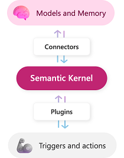 -->
<!-- 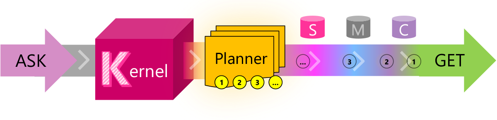 -->

### **Micro-orchestration**

- Micro-orchestration in LLM pipelines is the detailed management of LLM interactions, focusing on data flow within tasks.
- e.g., [Semantic Kernel](https://aka.ms/sk/repo), [LangChain](https://www.langchain.com/), [LlamaIndex](https://www.llamaindex.ai/), [Haystack](https://haystack.deepset.ai/), and [AdalFlow](https://github.com/SylphAI-Inc/AdalFlow).
 

#### **Code Recipes**

- Semantic Kernel sample application:💡[Chat Copilot](https://github.com/microsoft/chat-copilot) [Apr 2023] / [Virtual Customer Success Manager (VCSM)](https://github.com/jvargh/VCSM) [Jul 2024] / [Project Micronaire](https://devblogs.microsoft.com/semantic-kernel/microsoft-hackathon-project-micronaire-using-semantic-kernel/): A Semantic Kernel RAG Evaluation Pipeline [git](https://github.com/microsoft/micronaire) [3 Oct 2024]
   
- Semantic Kernel Recipes: A collection of C# notebooks [git](https://github.com/johnmaeda/SK-Recipes) [Mar 2023]
 
- Deploy Semantic Kernel with Bot Framework [ref](https://techcommunity.microsoft.com/t5/fasttrack-for-azure/deploy-semantic-kernel-with-bot-framework/ba-p/3928101) [git](https://github.com/Azure/semantic-kernel-bot-in-a-box) [26 Oct 2023]
 
- Semantic Kernel-Powered OpenAI Plugin Development Lifecycle [ref](https://techcommunity.microsoft.com/t5/azure-developer-community-blog/semantic-kernel-powered-openai-plugin-development-lifecycle/ba-p/3967751) [30 Oct 2023]
- SemanticKernel Implementation sample to overcome Token limits of Open AI model. [ref](https://zenn.dev/microsoft/articles/semantic-kernel-10) [06 May 2023]
- [Learning Paths for Semantic Kernel](https://devblogs.microsoft.com/semantic-kernel/learning-paths-for-semantic-kernel/) [28 Mar 2024]
- [A Pythonista’s Intro to Semantic Kernel](https://towardsdatascience.com/a-pythonistas-intro-to-semantic-kernel-af5a1a39564d)💡[3 Sep 2023]
- [Step-by-Step Guide to Building a Powerful AI Monitoring Dashboard with Semantic Kernel and Azure Monitor](https://devblogs.microsoft.com/semantic-kernel/step-by-step-guide-to-building-a-powerful-ai-monitoring-dashboard-with-semantic-kernel-and-azure-monitor/): Step-by-step guide to building an AI monitoring dashboard using Semantic Kernel and Azure Monitor to track token usage and custom metrics. [23 Aug 2024]
- [Working with Audio in Semantic Kernel Python](https://devblogs.microsoft.com/semantic-kernel/working-with-audio-in-semantic-kernel-python/) [15 Nov 2024]

#### **Semantic Kernel Planner [deprecated]**

- Semantic Kernel Planner [ref](https://devblogs.microsoft.com/semantic-kernel/semantic-kernel-planners-actionplanner/) [24 Jul 2023]

  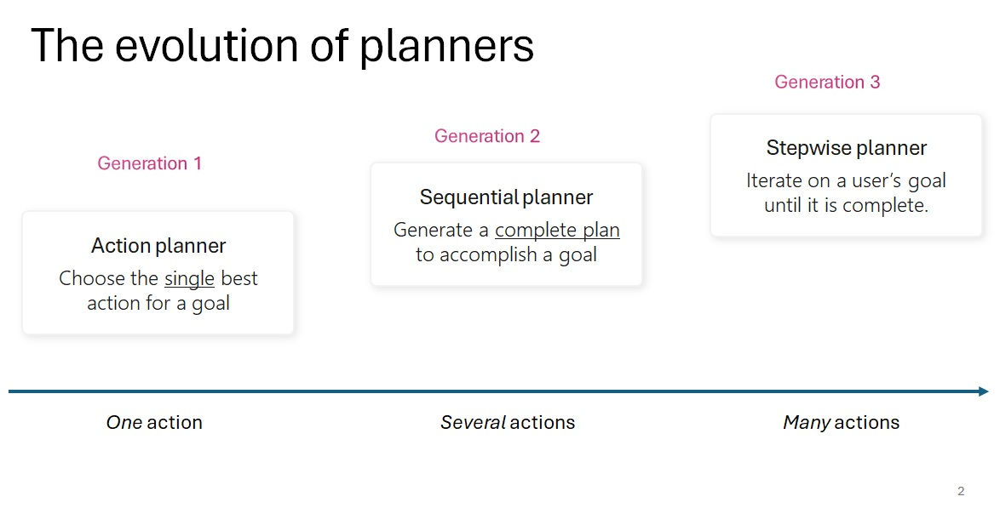

- Is Semantic Kernel Planner the same as LangChain agents?

  > Planner in SK is not the same as Agents in LangChain. [cite](https://github.com/microsoft/semantic-kernel/discussions/1326) [11 May 2023]

  > Agents in LangChain use recursive calls to the LLM to decide the next step to take based on the current state.
  > The two planner implementations in SK are not self-correcting.
  > Sequential planner tries to produce all the steps at the very beginning, so it is unable to handle unexpected errors.
  > Action planner only chooses one tool to satisfy the goal

- Stepwise Planner released. The Stepwise Planner features the "CreateScratchPad" function, acting as a 'Scratch Pad' to aggregate goal-oriented steps. [16 Aug 2023]

- Gen-4 and Gen-5 planners: 1. Gen-4: Generate multi-step plans with the [Handlebars](https://handlebarsjs.com/) 2. Gen-5: Stepwise Planner supports Function Calling. [ref](https://devblogs.microsoft.com/semantic-kernel/semantic-kernels-ignite-release-beta8-for-the-net-sdk/) [16 Nov 2023]

- Use function calling for most tasks; it's more powerful and easier. `Stepwise and Handlebars planners will be deprecated` [ref](https://learn.microsoft.com/en-us/semantic-kernel/concepts/planning) [Jun 2024] 

- [The future of Planners in Semantic Kernel](https://devblogs.microsoft.com/semantic-kernel/the-future-of-planners-in-semantic-kernel/) [23 July 2024]

#### **Semantic Function**

- Semantic Kernel Functions vs. Plugins: 
  1. Function:  Individual units of work that perform specific tasks. Execute actions based on user requests. [ref](https://devblogs.microsoft.com/semantic-kernel/transforming-semantic-kernel-functions/) [12 Nov 2024]
  2. Plugin: Collections of functions. Orchestrate multiple functions for complex tasks.
- Semantic Function - expressed in natural language in a text file "_skprompt.txt_" using SK's
[Prompt Template language](https://github.com/microsoft/semantic-kernel/blob/main/docs/PROMPT_TEMPLATE_LANGUAGE.md).
Each semantic function is defined by a unique prompt template file, developed using modern prompt engineering techniques. [cite](https://github.com/microsoft/semantic-kernel/blob/main/docs/GLOSSARY.md)

- Prompt Template language Key takeaways

```bash
1. Variables : use the {{$variableName}} syntax : Hello {{$name}}, welcome to Semantic Kernel!
2. Function calls: use the {{namespace.functionName}} syntax : The weather today is {{weather.getForecast}}.
3. Function parameters: {{namespace.functionName $varName}} and {{namespace.functionName "value"}} syntax
   : The weather today in {{$city}} is {{weather.getForecast $city}}.
4. Prompts needing double curly braces :
   {{ "{{" }} and {{ "}}" }} are special SK sequences.
5. Values that include quotes, and escaping :

    For instance:
    ... {{ 'no need to \\"escape" ' }} ...
    is equivalent to:
    ... {{ 'no need to "escape" ' }} ...
```

#### **Semantic Kernel Glossary**

- [Glossary in Git](https://github.com/microsoft/semantic-kernel/blob/main/docs/GLOSSARY.md) / [Glossary in MS Doc](https://learn.microsoft.com/en-us/semantic-kernel/whatissk#sk-is-a-kit-of-parts-that-interlock)

  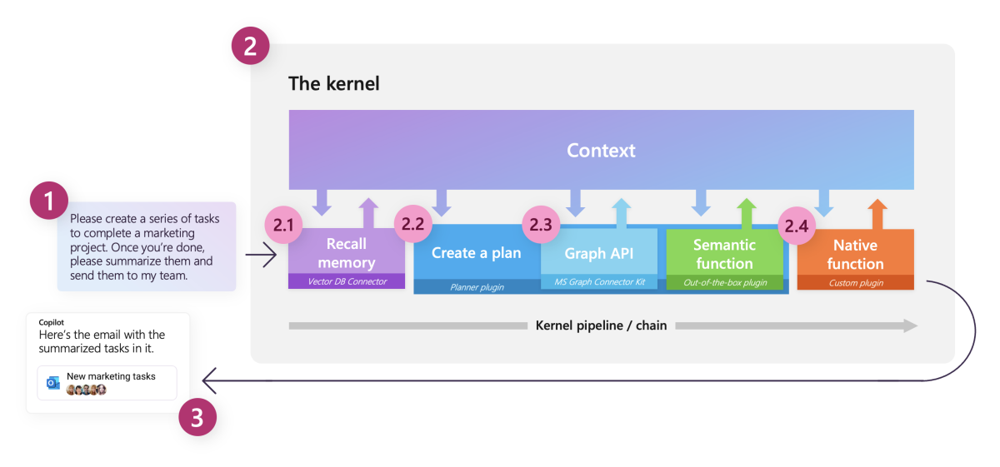

  | Term      | Short Description                                                                                                                                                                                                                                                                                     |
  | --------- | ----------------------------------------------------------------------------------------------------------------------------------------------------------------------------------------------------------------------------------------------------------------------------------------------------- |
  | ASK       | A user's goal is sent to SK as an ASK                                                                                                                                                                                                                                                                 |
  | Kernel    | [The kernel](https://learn.microsoft.com/en-us/semantic-kernel/concepts-sk/kernel) orchestrates a user's ASK                                                                                                                                                                                          |
  | Planner   | [The planner](https://learn.microsoft.com/en-us/semantic-kernel/concepts-sk/planner) breaks it down into steps based upon resources that are available [deprecated] -> replaced by function calling                                                                                                                                  |
  | Resources | Planning involves leveraging available [skills,](https://learn.microsoft.com/en-us/semantic-kernel/concepts-sk/skills) [memories,](https://learn.microsoft.com/en-us/semantic-kernel/concepts-sk/memories) and [connectors](https://learn.microsoft.com/en-us/semantic-kernel/concepts-sk/connectors) |
  | Steps     | A plan is a series of steps for the kernel to execute                                                                                                                                                                                                                                                 |
  | Pipeline  | Executing the steps results in fulfilling the user's ASK                                                                                                                                                                                                                                              |
- [Architecting AI Apps with Semantic Kernel](https://devblogs.microsoft.com/semantic-kernel/architecting-ai-apps-with-semantic-kernel/) How you could recreate Microsoft Word Copilot [6 Mar 2024]
  <details open>
    <summary>Expand</summary>
    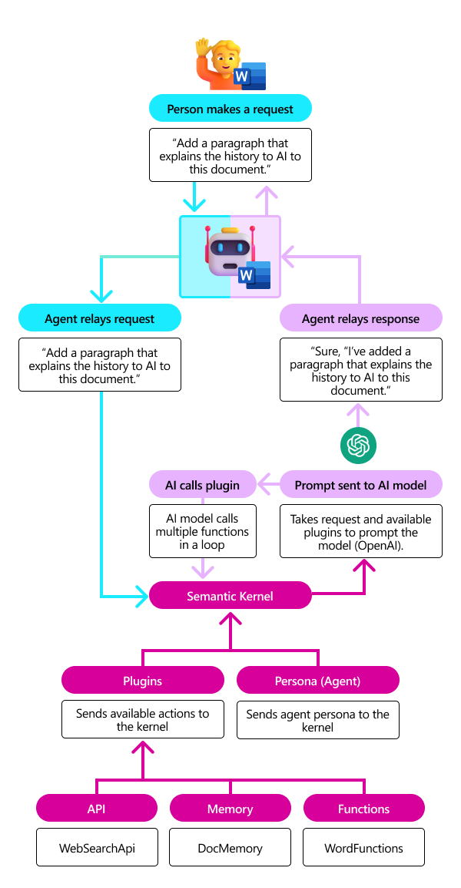
  </details>

### **DSPy**

- DSPy (Declarative Self-improving Language Programs, pronounced “dee-es-pie”) / doc:[ref](https://dspy-docs.vercel.app) / [git](https://github.com/stanfordnlp/dspy)
 
- DSPy Documentation & Cheetsheet [ref](https://dspy-docs.vercel.app)
- [DSPy](https://arxiv.org/abs/2310.03714): Compiling Declarative Language Model Calls into Self-Improving Pipelines [5 Oct 2023] / [git](https://github.com/stanfordnlp/dspy)
 
- DSPy Explained! [📺](https://www.youtube.com/watch?v=41EfOY0Ldkc) [30 Jan 2024]
- DSPy RAG example in weviate recipes: `recipes > integrations` [git](https://github.com/weaviate/recipes)
 
- [Prompt Like a Data Scientist: Auto Prompt Optimization and Testing with DSPy](https://towardsdatascience.com/prompt-like-a-data-scientist-auto-prompt-optimization-and-testing-with-dspy-ff699f030cb7) [6 May 2024]
- Instead of a hard-coded prompt template, "Modular approach: compositions of modules -> compile". Building blocks such as ChainOfThought or Retrieve and compiling the program, optimizing the prompts based on specific metrics. Unifying strategies for both prompting and fine-tuning in one tool, Pythonic operations, prioritizing and tracing program execution. These features distinguish it from other LMP frameworks such as LangChain, and LlamaIndex. [ref](https://towardsai.net/p/machine-learning/inside-dspy-the-new-language-model-programming-framework-you-need-to-know-about) [Jan 2023]
- Automatically iterate until the best result is achieved: 1. Collect Data -> 2. Write DSPy Program -> 3. Define validtion logic -> 4. Compile DSPy program

  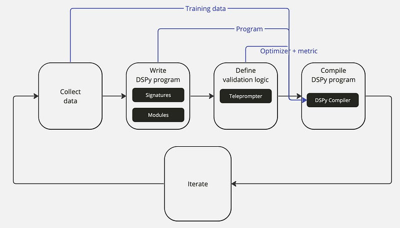

### **Optimizer frameworks**

- These frameworks, including DSpy, utilize algorithmic methods inspired by machine learning to improve prompts, outputs, and overall performance in LLM applications.
- [AdalFlow](https://github.com/SylphAI-Inc/AdalFlow):💡The Library to Build and Auto-optimize LLM Applications [Apr 2024]
 
- [TextGrad](https://github.com/zou-group/textgrad): automatic ``differentiation` via text. Backpropagation through text feedback provided by LLMs [Jun 2024]
 

#### **DSPy Glossary**

- Glossary reference to the [ref](https:/towardsdatascience.com/intro-to-dspy-goodbye-prompting-hello-programming-4ca1c6ce3eb9).
  1. Signatures: Hand-written prompts and fine-tuning are abstracted and replaced by signatures.
      > "question -> answer" <br/>
        "long-document -> summary"  <br/>
        "context, question -> answer"  <br/>
  2. Modules: Prompting techniques, such as `Chain of Thought` or `ReAct`, are abstracted and replaced by modules.
      ```python
      # pass a signature to ChainOfThought module
      generate_answer = dspy.ChainOfThought("context, question -> answer")
      ```
  3. Optimizers (formerly Teleprompters): Manual iterations of prompt engineering is automated with optimizers (teleprompters) and a DSPy Compiler.
      ```python
      # Self-generate complete demonstrations. Teacher-student paradigm, `BootstrapFewShotWithOptuna`, `BootstrapFewShotWithRandomSearch` etc. which work on the same principle.
      optimizer = BootstrapFewShot(metric=dspy.evaluate.answer_exact_match)
      ```
  4. DSPy Compiler: Internally trace your program and then optimize it using an optimizer (teleprompter) to maximize a given metric (e.g., improve quality or cost) for your task.
  - e.g., the DSPy compiler optimizes the initial prompt and thus eliminates the need for manual prompt tuning.
    ```python
    cot_compiled = teleprompter.compile(CoT(), trainset=trainset, valset=devset)
    cot_compiled.save('turbo_gsm8k.json')
    ```

#### DSPy optimizer

- Automatic Few-Shot Learning

  - As a rule of thumb, if you don't know where to start, use `BootstrapFewShotWithRandomSearch`.
    
  - If you have very little data, e.g. 10 examples of your task, use `BootstrapFewShot`.
    
  - If you have slightly more data, e.g. 50 examples of your task, use `BootstrapFewShotWithRandomSearch`.
    
  - If you have more data than that, e.g. 300 examples or more, use `BayesianSignatureOptimizer`. -> deprecated and replaced with MIPRO.

  - `KNNFewShot`: k-Nearest Neighbors to select the closest training examples, which are then used in the BootstrapFewShot optimization process​

- Automatic Instruction Optimization

  - `COPRO`: Repeat for a set number of iterations, tracking the best-performing instructions.

  - `MIPRO`: Repeat for a set number of iterations, tracking the best-performing combinations (instructions and examples). -> replaced with `MIPROv2`.

  - `MIPROv2`: If you want to keep your prompt 0-shot, or use 40+ trials or 200+ examples, choose MIPROv2. [March 2024]

- Automatic Finetuning

  - If you have been able to use one of these with a large LM (e.g., 7B parameters or above) and need a very efficient program, compile that down to a small LM with `BootstrapFinetune`.

- Program Transformations

  - `Ensemble`: Combines DSPy programs using all or randomly sampling a subset into a single program.


## **LangChain Features, Usage, and Comparisons**

- LangChain is a framework for developing applications powered by language models. (1) Be data-aware: connect a language model to other sources of data.
  (2) Be agentic: Allow a language model to interact with its environment. doc:[ref](https://docs.langchain.com/docs) / blog:[ref](https://blog.langchain.dev) / [git](https://github.com/langchain-ai/langchain)
 
- It highlights two main value props of the framework:

  1. Components: modular abstractions and implementations for working with language models, with easy-to-use features.
  2. Use-Case Specific Chains: chains of components that assemble in different ways to achieve specific use cases, with customizable interfaces.cite: [ref](https://docs.langchain.com/docs/)
  
  - LangChain 0.2: full separation of langchain and langchain-community. [ref](https://blog.langchain.dev/langchain-v02-leap-to-stability) [May 2024]
  - Towards LangChain 0.1 [ref](https://blog.langchain.dev/the-new-langchain-architecture-langchain-core-v0-1-langchain-community-and-a-path-to-langchain-v0-1/) [Dec 2023] 
  
      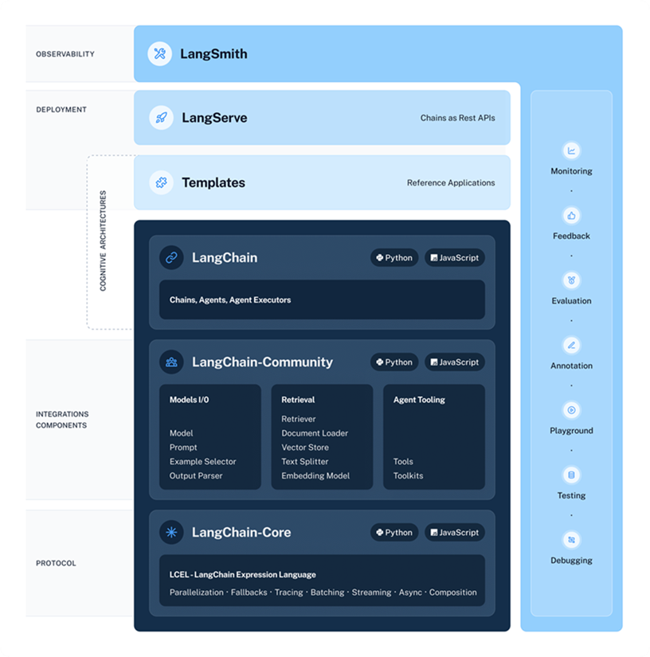
  <!-- 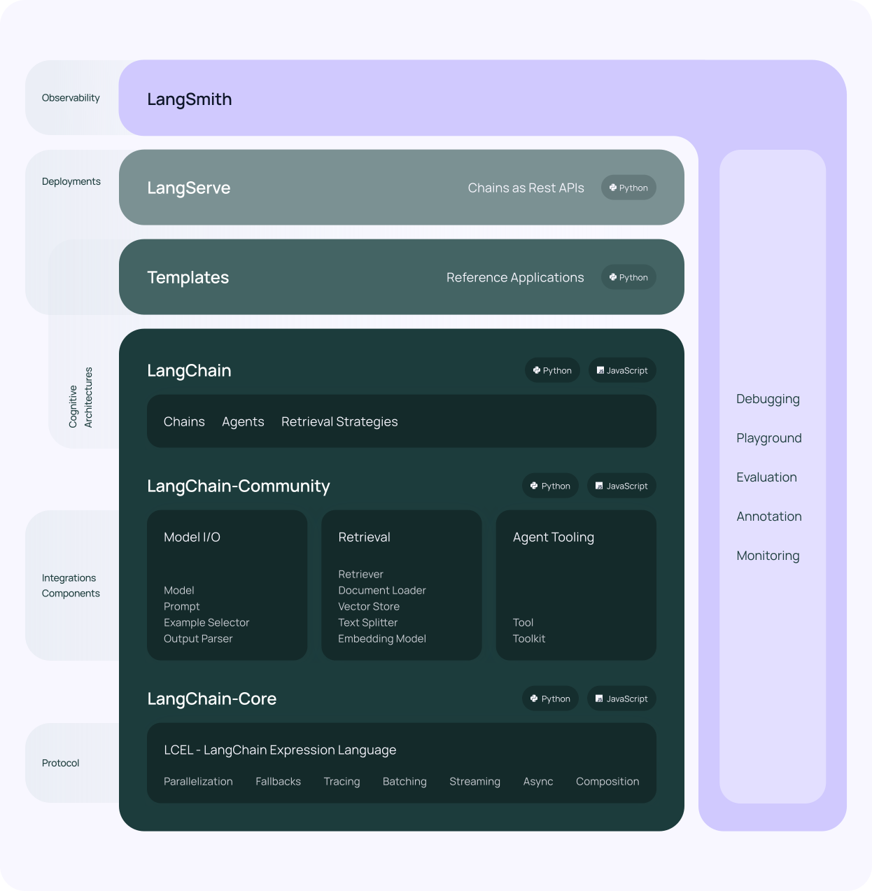 -->
  <!-- 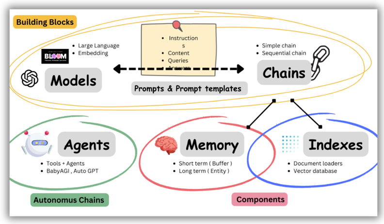 -->

  - Basic LangChain building blocks [ref](https://www.packtpub.com/article-hub/using-langchain-for-large-language-model-powered-applications) [2023]

    ```python
    '''
    LLMChain: A LLMChain is the most common type of chain. It consists of a PromptTemplate, a model (either an LLM or a ChatModel), and an optional output parser.
    '''
    chain = prompt | model | parser
    ```
  - LLMChain: Deprecated since version 0.1.17: Use RunnableSequence, e.g., `prompt | llm` instead. 
  - LangChain has shifted towards the Runnable interface since version 0.1.17.
  - Imperative (programmatic) approach: The Runnable interface (formerly LLMChain) for flexible, programmatic chain building.
  - Declarative approach: LangChain Expression Language (LCEL) offers a declarative syntax for chain composition, enabling features like async, batch, and streaming operations with the | operator for combining functionalities.

### **Macro and Micro-orchestration**

- Macro-orchestration in LLM pipelines involves high-level design and management of complex workflows, integrating multiple LLMs and other components.
- Micro-orchestration [x-ref](#micro-orchestration)
- [LangGraph](https://langchain-ai.github.io/langgraph/) in LangChain, and [Burr](https://burr.dagworks.io/)

### **LangChain Feature Matrix & Cheetsheet**

- [Feature Matrix](https://python.langchain.com/docs/get_started/introduction): LangChain Features
  - [Feature Matrix: Snapshot in 2023 July](./files/langchain-features-202307.png)
- [Awesome LangChain](https://github.com/kyrolabs/awesome-langchain): Curated list of tools and projects using LangChain.
 
- [Cheetsheet](https://github.com/gkamradt/langchain-tutorials): LangChain CheatSheet
 
- [LangChain Cheetsheet KD-nuggets](https://www.kdnuggets.com/wp-content/uploads/LangChain_Cheat_Sheet_KDnuggets.pdf): LangChain Cheetsheet KD-nuggets [doc](./files/LangChain_kdnuggets.pdf) [Aug 2023]
- [LangChain AI Handbook](https://www.pinecone.io/learn/series/langchain/): published by Pinecone
- [LangChain Tutorial](https://nanonets.com/blog/langchain/): A Complete LangChain Guide
- [RAG From Scratch](https://github.com/langchain-ai/rag-from-scratch)💡[Feb 2024]
 
- DeepLearning.AI short course: LangChain for LLM Application Development [ref](https://www.deeplearning.ai/short-courses/langchain-for-llm-application-development/) / LangChain: Chat with Your Data [ref](https://www.deeplearning.ai/short-courses/langchain-chat-with-your-data/)
- [LangChain Streamlit agent examples](https://github.com/langchain-ai/streamlit-agent): Implementations of several LangChain agents as Streamlit apps. [Jun 2023] 
- [LangChain tutorial: A guide to building LLM-powered applications](https://www.elastic.co/blog/langchain-tutorial) [27 Feb 2024]

### **LangChain features and related libraries**

- [LangChain/cache](https://python.langchain.com/docs/modules/model_io/models/llms/how_to/llm_caching): Reducing the number of API calls
- [LangChain/context-aware-splitting](https://python.langchain.com/docs/use_cases/question_answering/document-context-aware-QA): Splits a file into chunks while keeping metadata
- [LangChain Expression Language](https://python.langchain.com/docs/guides/expression_language/): A declarative way to easily compose chains together [Aug 2023]
- [LangSmith](https://blog.langchain.dev/announcing-langsmith/) Platform for debugging, testing, evaluating. [Jul 2023]
  <!-- 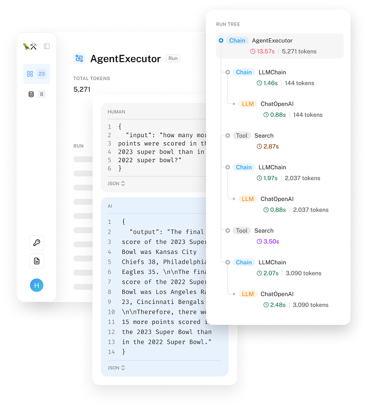 -->
- [LangChain Template](https://github.com/langchain-ai/langchain/tree/master/templates): LangChain Reference architectures and samples. e.g., `RAG Conversation Template` [Oct 2023]
- [OpenGPTs](https://github.com/langchain-ai/opengpts): An open source effort to create a similar experience to OpenAI's GPTs [Nov 2023]
 
- [LangGraph](https://github.com/langchain-ai/langgraph):💡Build and navigate language agents as graphs [ref](https://langchain-ai.github.io/langgraph/) [Aug 2023]
 

### **LangChain chain type: Chains & Summarizer**

- Chains [ref](https://github.com/RutamBhagat/LangChainHCCourse1/blob/main/course_1/chains.ipynb)
  - SimpleSequentialChain: A sequence of steps with single input and output. Output of one step is input for the next.
  - SequentialChain: Like SimpleSequentialChain but handles multiple inputs and outputs at each step.
  - MultiPromptChain: Routes inputs to specialized sub-chains based on content. Ideal for different prompts for different tasks.
- Summarizer
  - stuff: Sends everything at once in LLM. If it's too long, an error will occur.
  - map_reduce: Summarizes by dividing and then summarizing the entire summary.
  - refine: (Summary + Next document) => Summary
  - map_rerank: Ranks by score and summarizes to important points.

### **LangChain Agent & Memory**

#### LangChain Agent

1. If you're using a text LLM, first try `zero-shot-react-description`.
1. If you're using a Chat Model, try `chat-zero-shot-react-description`.
1. If you're using a Chat Model and want to use memory, try `conversational-react-description`.
1. `self-ask-with-search`: [Measuring and Narrowing the Compositionality Gap in Language Models](https://arxiv.org/abs/2210.03350) [7 Oct 2022]
1. `react-docstore`: [ReAct: Synergizing Reasoning and Acting in Language Models](https://arxiv.org/abs/2210.03629) [6 Oct 2022]
1. Agent Type

```python
class AgentType(str, Enum):
    """Enumerator with the Agent types."""

    ZERO_SHOT_REACT_DESCRIPTION = "zero-shot-react-description"
    REACT_DOCSTORE = "react-docstore"
    SELF_ASK_WITH_SEARCH = "self-ask-with-search"
    CONVERSATIONAL_REACT_DESCRIPTION = "conversational-react-description"
    CHAT_ZERO_SHOT_REACT_DESCRIPTION = "chat-zero-shot-react-description"
    CHAT_CONVERSATIONAL_REACT_DESCRIPTION = "chat-conversational-react-description"
    STRUCTURED_CHAT_ZERO_SHOT_REACT_DESCRIPTION = (
        "structured-chat-zero-shot-react-description"
    )
    OPENAI_FUNCTIONS = "openai-functions"
    OPENAI_MULTI_FUNCTIONS = "openai-multi-functions"
```

- [ReAct](https://arxiv.org/abs/2210.03629) vs [MRKL](https://arxiv.org/abs/2205.00445) (miracle)

  ReAct is inspired by the synergies between "acting" and "reasoning" which allow humans to learn new tasks and make decisions or reasoning.

  MRKL stands for Modular Reasoning, Knowledge and Language and is a neuro-symbolic architecture that combines large language models, external knowledge sources, and discrete reasoning

  > cite: [ref](https://github.com/langchain-ai/langchain/issues/2284#issuecomment-1526879904) [28 Apr 2023] <br/>
  `zero-shot-react-description`: Uses ReAct to select tools based on their descriptions. Any number of tools can be used, each requiring a description. <br/>
  `react-docstore`: Uses ReAct to manage a docstore with two required tools: _Search_ and _Lookup_. These tools must be named exactly as specified. It follows the original ReAct paper's example from Wikipedia.
  - MRKL in LangChain uses `zero-shot-react-description`, implementing ReAct. The original ReAct framework is used in the `react-docstore` agent. MRKL was published on May 1, 2022, earlier than ReAct on October 6, 2022.

#### LangChain Memory

1. `ConversationBufferMemory`: Stores the entire conversation history.
1. `ConversationBufferWindowMemory`: Stores recent messages from the conversation history.
1. `Entity Store (previously Entity Memory)`: Stores and retrieves entity-related information.
1. `Conversation Knowledge Graph Memory`: Stores entities and relationships between entities.
1. `ConversationSummaryMemory`: Stores summarized information about the conversation.
1. `ConversationSummaryBufferMemory`: Stores summarized information about the conversation with a token limit.
1. `ConversationTokenBufferMemory`: Stores tokens from the conversation.
1. `VectorStore-Backed Memory`: Leverages vector space models for storing and retrieving information.

#### **Criticism to LangChain**

- The Problem With LangChain: [ref](https://minimaxir.com/2023/07/langchain-problem/) / [git](https://github.com/minimaxir/langchain-problems) [14 Jul 2023]
 
- What’s your biggest complaint about langchain?: [ref](https://www.reddit.com/r/LangChain/comments/139bu99/whats_your_biggest_complaint_about_langchain/) [May 2023]
- LangChain Is Pointless: [ref](https://news.ycombinator.com/item?id=36645575) [Jul 2023]
  > LangChain has been criticized for making simple things relatively complex, which creates unnecessary complexity and tribalism that hurts the up-and-coming AI ecosystem as a whole. The documentation is also criticized for being bad and unhelpful.
- [How to Build Ridiculously Complex LLM Pipelines with LangGraph!](https://newsletter.theaiedge.io/p/how-to-build-ridiculously-complex) [17 Sep 2024 ]
  > LangChain does too much, and as a consequence, it does many things badly. Scaling beyond the basic use cases with LangChain is a challenge that is often better served with building things from scratch by using the underlying APIs.

### **LangChain vs Competitors**

#### **Prompting Frameworks**

- [LangChain](https://github.com/langchain-ai/langchain) [Oct 2022] |  [LlamaIndex](https://github.com/jerryjliu/llama_index) [Nov 2022] |  [Microsoft Semantic Kernel](https://github.com/microsoft/semantic-kernel) [Feb 2023] | [Microsoft guidance](https://github.com/microsoft/guidance) [Nov 2022] | [Azure ML Promt flow](https://github.com/microsoft/promptflow) [Jun 2023] | [DSPy](https://github.com/stanfordnlp/dspy) [Jan 2023]
      
- [Prompting Framework (PF)](https://arxiv.org/abs/2311.12785): Prompting Frameworks for Large Language Models: A Survey [git](https://github.com/lxx0628/Prompting-Framework-Survey)
 
- [What Are Tools Anyway?](https://arxiv.org/abs/2403.15452): 1. For a small number (e.g., 5–10) of tools, LMs can directly select from contexts. However, with a larger number (e.g., hundreds), an additional retrieval step involving a retriever model is often necessary. 2. LM-used tools incl. Tool creation and reuse. Tool is not useful when machine translation, summarization, and sentiment analysis (among others).  3. Evaluation metrics [18 Mar 2024]

#### **LangChain vs LlamaIndex**

- Basically LlamaIndex is a smart storage mechanism, while LangChain is a tool to bring multiple tools together. [cite](https://community.openai.com/t/llamaindex-vs-langchain-which-one-should-be-used/163139) [14 Apr 2023]

- LangChain offers many features and focuses on using chains and agents to connect with external APIs. In contrast, LlamaIndex is more specialized and excels at indexing data and retrieving documents.

#### **LangChain vs Semantic Kernel**

| LangChain | Semantic Kernel                                                                |
| --------- | ------------------------------------------------------------------------------ |
| Memory    | Memory                                                                         |
| Tookit    | Plugin (pre. Skill)                                                            |
| Tool      | LLM prompts (semantic functions) <br/> native C# or Python code (native function) |
| Agent     | Planner (Deprecated) -> Agent                                                                        |
| Chain     | Steps, Pipeline                                                                |
| Tool      | Connector (Deprecated) -> Plugin                                                                     |

#### **LangChain vs Semantic Kernel vs Azure Machine Learning Prompt flow**

- What's the difference between LangChain and Semantic Kernel?

  LangChain has many agents, tools, plugins etc. out of the box. More over, LangChain has 10x more popularity, so has about 10x more developer activity to improve it. On other hand, **Semantic Kernel architecture and quality is better**, that's quite promising for Semantic Kernel. [ref](https://github.com/microsoft/semantic-kernel/discussions/1326) [11 May 2023]

- What's the difference between Azure Machine Learing PromptFlow and Semantic Kernel?

  1. Low/No Code vs C#, Python, Java
  1. Focused on Prompt orchestrating vs Integrate LLM into their existing app.

- Promptflow is not intended to replace chat conversation flow. Instead, it’s an optimized solution for integrating Search and Open Source Language Models. By default, it supports Python, LLM, and the Prompt tool as its fundamental building blocks.

- Using Prompt flow with Semantic Kernel: [ref](https://learn.microsoft.com/en-us/semantic-kernel/ai-orchestration/planners/evaluate-and-deploy-planners/) [07 Sep 2023]

#### **Prompt Template Language**

|                   | Handlebars.js                                                                 | Jinja2                                                                                 | Prompt Template                                                                                    |
| ----------------- | ----------------------------------------------------------------------------- | -------------------------------------------------------------------------------------- | -------------------------------------------------------------------------------------------------- |
| Conditions        | {{#if user}}<br>  Hello {{user}}!<br>{{else}}<br>  Hello Stranger!<br>{{/if}} | <br>  Hello {{ user }}!<br><br>  Hello Stranger!<br> | Branching features such as "if", "for", and code blocks are not part of SK's template language.    |
| Loop              | {{#each items}}<br>  Hello {{this}}<br>{{/each}}                              | <br>  Hello {{ item }}<br>                          | By using a simple language, the kernel can also avoid complex parsing and external dependencies.   |
| LangChain Library | guidance. LangChain.js                                                                     | LangChain, Azure ML prompt flow                                                                | Semantic Kernel                                                                                    |
| URL               | [ref](https://handlebarsjs.com/guide/)                                        | [ref](https://jinja.palletsprojects.com/en/2.10.x/templates/)                          | [ref](https://learn.microsoft.com/en-us/semantic-kernel/prompt-engineering/prompt-template-syntax) |

- Semantic Kernel supports HandleBars and Jinja2. [Mar 2024]


### **LlamaIndex**

- LlamaIndex (formerly GPT Index) is a data framework for LLM applications to ingest, structure, and access private or domain-specific data. The high-level API allows users to ingest and query their data in a few lines of code. High-Level Concept: [ref](https://docs.llamaindex.ai/en/latest/getting_started/concepts.html) / doc:[ref](https://gpt-index.readthedocs.io/en/latest/index.html) / blog:[ref](https://www.llamaindex.ai/blog) / [git](https://github.com/run-llama/llama_index) [Nov 2022]
 

  > Fun fact this core idea was the initial inspiration for GPT Index (the former name of LlamaIndex) 11/8/2022 - almost a year ago!. [cite](https://twitter.com/jerryjliu0/status/1711817419592008037) / [Walking Down the Memory Maze: Beyond Context Limit through Interactive Reading](https://arxiv.org/abs/2310.05029)
  >
  > 1.  Build a data structure (memory tree)
  > 1.  Transverse it via LLM prompting

- LlamaIndex Toolkits: 
  - `LlamaHub`: A library of data loaders for LLMs [git](https://github.com/run-llama/llama-hub) [Feb 2023]
 
  - `LlamaIndex CLI`: a command line tool to generate LlamaIndex apps [ref](https://llama-2.ai/llamaindex-cli/) [Nov 2023]
  - `LlamaParse`: A unique parsing tool for intricate documents [git](https://github.com/run-llama/llama_parse) [Feb 2024]
 
  - [AgentWorkflow](https://www.llamaindex.ai/blog/introducing-agentworkflow-a-powerful-system-for-building-ai-agent-systems): To build and orchestrate AI agent systems [22 Jan 2025]
- [LlamaIndex showcase](https://github.com/run-llama/llamacloud-demo) > `examples` [ref](https://www.llamaindex.ai/blog/introducing-agentic-document-workflows): e.g., Contract Review, Patient Case Summary, and Auto Insurance Claims Workflow. [9 Jan 2025]

#### LlamaIndex integration with Azure AI

- [LlamaIndex integration with Azure AI](https://www.llamaindex.ai/blog/announcing-the-llamaindex-integration-with-azure-ai):  [19 Nov 2024]
- Core: Azure OpenAI Service, Azure AI Search
- Storage and memory: [Azure Table Storage as a Docstore](https://docs.llamaindex.ai/en/stable/examples/docstore/AzureDocstoreDemo/) or Azure Cosmos DB.
- Workflow example: [Azure Code Interpreter](https://docs.llamaindex.ai/en/stable/examples/tools/azure_code_interpreter/)
- [AI App Template Gallery](https://azure.github.io/ai-app-templates/repo/azure-samples/llama-index-javascript/)

#### High-Level Concepts

- Query engine vs Chat engine

  1. The query engine wraps a `retriever` and a `response synthesizer` into a pipeline, that will use the query string to fetch nodes (sentences or paragraphs) from the index and then send them to the LLM (Language and Logic Model) to generate a response
  1. The chat engine is a quick and simple way to chat with the data in your index. It uses a `context manager` to keep track of the conversation history and generate relevant queries for the retriever. Conceptually, it is a `stateful` analogy of a Query Engine.

- Storage Context vs Settings (p.k.a. Service Context)

  - Both the Storage Context and Service Context are data classes.

    1. Introduced in v0.10.0, ServiceContext is replaced to Settings object.
    1. Storage Context is responsible for the storage and retrieval of data in Llama Index, while the Service Context helps in incorporating external context to enhance the search experience.
    1. The Service Context is not directly involved in the storage or retrieval of data, but it helps in providing a more context-aware and accurate search experience.

  ```python
  # The storage context container is a utility container for storing nodes, indices, and vectors.
  class StorageContext:
    docstore: BaseDocumentStore
    index_store: BaseIndexStore
    vector_store: VectorStore
    graph_store: GraphStore
  ```

  ```python
  # NOTE: Deprecated, use llama_index.settings.Settings. The service context container is a utility container for LlamaIndex index and query classes.
  class ServiceContext:
    llm_predictor: BaseLLMPredictor
    prompt_helper: PromptHelper
    embed_model: BaseEmbedding
    node_parser: NodeParser
    llama_logger: LlamaLogger
    callback_manager: CallbackManager
  ```

  ```python
  @dataclass
  class _Settings:
    # lazy initialization
    _llm: Optional[LLM] = None
    _embed_model: Optional[BaseEmbedding] = None
    _callback_manager: Optional[CallbackManager] = None
    _tokenizer: Optional[Callable[[str], List[Any]]] = None
    _node_parser: Optional[NodeParser] = None
    _prompt_helper: Optional[PromptHelper] = None
    _transformations: Optional[List[TransformComponent]] = None
  ```

#### LlamaIndex Tutorial

- [LlamaIndex Overview (Japanese)](https://dev.classmethod.jp/articles/llamaindex-tutorial-001-overview-v0-7-9/) [17 Jul 2023]
- [Fine-Tuning a Linear Adapter for Any Embedding Model](https://medium.com/llamaindex-blog/fine-tuning-a-linear-adapter-for-any-embedding-model-8dd0a142d383): Fine-tuning the embeddings model requires you to reindex your documents. With this approach, you do not need to re-embed your documents. Simply transform the query instead. [7 Sep 2023]
- 4 RAG techniques implemented in `llama_index` / [cite](https://x.com/ecardenas300/status/1704188276565795079) [20 Sep 2023] / [git](https://github.com/weaviate/recipes)
 
  <details open>
  <summary>Expand: 4 RAG techniques</summary>

    1. SQL Router Query Engine: Query router that can reference your vector database or SQL database

    2. Sub Question Query Engine: Break down the complex question into sub-questions

    3. Recursive Retriever + Query Engine: Reference node relationships, rather than only finding a node (chunk) that is most relevant.
    
    4. Self Correcting Query Engines: Use an LLM to evaluate its own output.
  </details>
- [LlamaIndex Tutorial](https://nanonets.com/blog/llamaindex/): A Complete LlamaIndex Guide [18 Oct 2023]
<!-- - [CallbackManager (Japanese)](https://dev.classmethod.jp/articles/llamaindex-tutorial-003-callback-manager/) [27 May 2023] / [Customize TokenTextSplitter (Japanese)](https://dev.classmethod.jp/articles/llamaindex-tutorial-002-text-splitter/) [27 May 2023] / --> 
- [Chat engine ReAct mode](https://gpt-index.readthedocs.io/en/stable/examples/chat_engine/chat_engine_react.html), [FLARE Query engine](https://docs.llamaindex.ai/en/stable/examples/query_engine/flare_query_engine.html)
- [Building and Productionizing RAG](https://docs.google.com/presentation/d/1rFQ0hPyYja3HKRdGEgjeDxr0MSE8wiQ2iu4mDtwR6fc/edit#slide=id.p): [doc](./files/archive/LlamaIndexTalk_PyDataGlobal.pdf): Optimizing RAG Systems 1. Table Stakes 2. Advanced Retrieval: Small-to-Big 3. Agents 4. Fine-Tuning 5. Evaluation [Nov 2023]
- Multimodal RAG Pipeline [ref](https://blog.llamaindex.ai/multi-modal-rag-621de7525fea) [Nov 2023]
- [A Cheat Sheet and Some Recipes For Building Advanced RAG](https://blog.llamaindex.ai/a-cheat-sheet-and-some-recipes-for-building-advanced-rag-803a9d94c41b) RAG cheat sheet shared above was inspired by [RAG survey paper](https://arxiv.org/abs/2312.10997). [doc](./files/advanced-rag-diagram-llama-index.png) [Jan 2024]


## **Prompt Engineering and Visual Prompts**

### **Prompt Engineering**

1. Zero-shot, one-shot and few-shot [ref](https://arxiv.org/abs/2005.14165) [28 May 2020]

   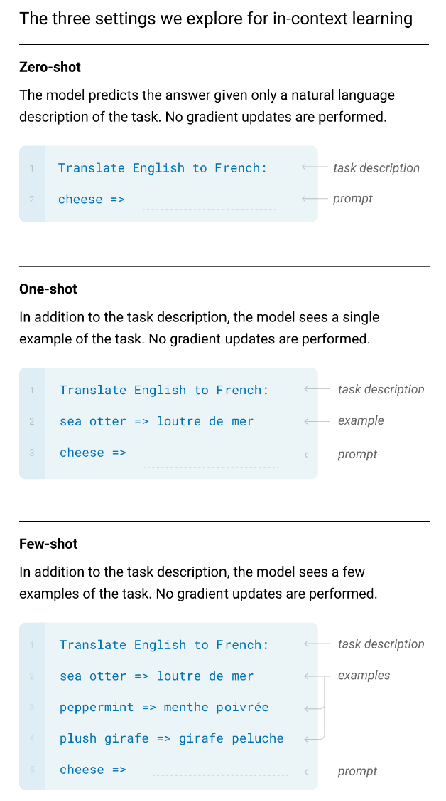

1. [Retrieval Augmented Generation (RAG)](https://arxiv.org/abs/2005.11401): [[cnt](https://scholar.google.com/scholar?hl=en&as_sdt=0%2C5&q=arxiv%3A+2005.11401)]: To address such knowledge-intensive tasks. RAG combines an information retrieval component with a text generator model. [22 May 2020]
1. Few-shot: [Open AI: Language Models are Few-Shot Learners](https://arxiv.org/abs/2005.14165): [[cnt](https://scholar.google.com/scholar?hl=en&as_sdt=0%2C5&q=arxiv%3A+2005.14165)] [28 May 2020]
1. [Chain of Thought (CoT)](https://arxiv.org/abs/2201.11903):💡Chain-of-Thought Prompting Elicits Reasoning in Large Language Models [[cnt](https://scholar.google.com/scholar?hl=en&as_sdt=0%2C5&q=arxiv%3A+2201.11903)]: ReAct and Self Consistency also inherit the CoT concept. [28 Jan 2022]
    - Family of CoT: `Self-Consistency (CoT-SC)` > `Tree of Thought (ToT)` > `Graph of Thoughts (GoT)` > [`Iteration of Thought (IoT)`](https://arxiv.org/abs/2409.12618) [19 Sep 2024], [`Diagram of Thought (DoT)`](https://arxiv.org/abs/2409.10038) [16 Sep 2024] / [`To CoT or not to CoT?`](https://arxiv.org/abs/2409.12183): Meta-analysis of 100+ papers shows CoT significantly improves performance in math and logic tasks. [18 Sep 2024]
1. [Self-Consistency (CoT-SC)](https://arxiv.org/abs/2203.11171): The three steps in the self-consistency method: 1) prompt the language model using CoT prompting, 2) sample a diverse set of reasoning paths from the language model, and 3) marginalize out reasoning paths to aggregate final answers and choose the most consistent answer. [21 Mar 2022]
1. Zero-shot: [Large Language Models are Zero-Shot Reasoners](https://arxiv.org/abs/2205.11916): [[cnt](https://scholar.google.com/scholar?hl=en&as_sdt=0%2C5&q=arxiv%3A+2205.11916)]: Let’s think step by step. [24 May 2022]
1. [ReAct](https://arxiv.org/abs/2210.03629): [[cnt](https://scholar.google.com/scholar?hl=en&as_sdt=0%2C5&q=arxiv%3A+2210.03629)]: Grounding with external sources. (Reasoning and Act): Combines reasoning and acting [ref](https://react-lm.github.io/) [6 Oct 2022]
1. Promptist
    - [Promptist](https://arxiv.org/abs/2212.09611): Microsoft's researchers trained an additional language model (LM) that optimizes text prompts for text-to-image generation. [19 Dec 2022]
    - For example, instead of simply passing "Cats dancing in a space club" as a prompt, an engineered prompt might be "Cats dancing in a space club, digital painting, artstation, concept art, soft light, hdri, smooth, sharp focus, illustration, fantasy."
1. [Recursively Criticizes and Improves (RCI)](https://arxiv.org/abs/2303.17491): [[cnt](https://scholar.google.com/scholar?hl=en&as_sdt=0%2C5&q=arxiv%3A+2303.17491)] [30 Mar 2023]
   - Critique: Review your previous answer and find problems with your answer.
   - Improve: Based on the problems you found, improve your answer.
1. [Self-Refine](https://arxiv.org/abs/2303.17651), which enables an agent to reflect on its own output [30 Mar 2023]
1. [Reflexion](https://arxiv.org/abs/2303.11366): [[cnt](https://scholar.google.com/scholar?hl=en&as_sdt=0%2C5&q=arxiv%3A+2303.11366)]: Language Agents with Verbal Reinforcement Learning. 1. Reflexion that uses `verbal reinforcement` to help agents learn from prior failings. 2. Reflexion converts binary or scalar feedback from the environment into verbal feedback in the form of a textual summary, which is then added as additional context for the LLM agent in the next episode. 3. It is lightweight and doesn’t require finetuning the LLM. [20 Mar 2023] / [git](https://github.com/noahshinn024/reflexion)
 
1. [Plan-and-Solve Prompting](https://arxiv.org/abs/2305.04091): Develop a plan, and then execute each step in that plan. [6 May 2023]
1. [Tree of Thought (ToT)](https://arxiv.org/abs/2305.10601): [[cnt](https://scholar.google.com/scholar?hl=en&as_sdt=0%2C5&q=arxiv%3A+2305.10601)]: Self-evaluate the progress intermediate thoughts make towards solving a problem [17 May 2023] [git](https://github.com/ysymyth/tree-of-thought-llm) / Agora: Tree of Thoughts (ToT) [git](https://github.com/kyegomez/tree-of-thoughts)
  

   - `tree-of-thought\forest_of_thought.py`: Forest of thought Decorator sample
   - `tree-of-thought\tree_of_thought.py`: Tree of thought Decorator sample
   - `tree-of-thought\react-prompt.py`: ReAct sample without LangChain
1. [Skeleton Of Thought](https://arxiv.org/abs/2307.15337): Skeleton-of-Thought (SoT) reduces generation latency by first creating an answer's skeleton, then filling each skeleton point in parallel via API calls or batched decoding. [28 Jul 2023]

1. [Graph of Thoughts (GoT)](https://arxiv.org/abs/2308.09687): [[cnt](https://scholar.google.com/scholar?hl=en&as_sdt=0%2C5&q=arxiv%3A+2308.09687)] Solving Elaborate Problems with Large Language Models [git](https://github.com/spcl/graph-of-thoughts) [18 Aug 2023]
 

   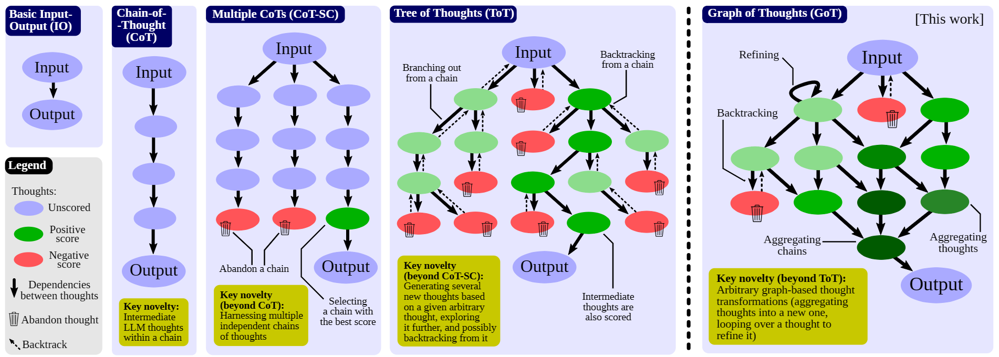

1. [Large Language Models as Optimizers](https://arxiv.org/abs/2309.03409):💡[[cnt](https://scholar.google.com/scholar?hl=en&as_sdt=0%2C5&q=arxiv%3A+2309.03409)]: `Take a deep breath and work on this problem step-by-step.` to improve its accuracy. Optimization by PROmpting (OPRO) [7 Sep 2023]
1. [Re-Reading Improves Reasoning in Large Language Models](https://arxiv.org/abs/2309.06275): RE2 (Re-Reading), which involves re-reading the question as input to enhance the LLM's understanding of the problem. `Read the question again` [12 Sep 2023]
1. [NLEP (Natural Language Embedded Programs) for Hybrid Language Symbolic Reasoning](https://arxiv.org/abs/2309.10814): Use code as a scaffold for reasoning. NLEP achieves over 90% accuracy when prompting GPT-4. [19 Sep 2023]
1. [Chain-of-Verification reduces Hallucination in LLMs](https://arxiv.org/abs/2309.11495): [[cnt](https://scholar.google.com/scholar?hl=en&as_sdt=0%2C5&q=arxiv%3A+2309.11495)]: A four-step process that consists of generating a baseline response, planning verification questions, executing verification questions, and generating a final verified response based on the verification results. [20 Sep 2023]
1. [FireAct](https://arxiv.org/abs/2310.05915): [[cnt](https://scholar.google.com/scholar?hl=en&as_sdt=0%2C5&q=arxiv%3A+2310.05915)]: Toward Language Agent Fine-tuning. 1. This work takes an initial step to show multiple advantages of fine-tuning LMs for agentic uses. 2. Duringfine-tuning, The successful trajectories are then converted into the ReAct format to fine-tune a smaller LM. 3. This work is an initial step toward language agent fine-tuning,
and is constrained to a single type of task (QA) and a single tool (Google search). / [git](https://fireact-agent.github.io/) [9 Oct 2023]
1. Power of Prompting
    - [GPT-4 with Medprompt](https://arxiv.org/abs/2311.16452): GPT-4, using a method called Medprompt that combines several prompting strategies, has surpassed MedPaLM 2 on the MedQA dataset without the need for fine-tuning. [ref](https://www.microsoft.com/en-us/research/blog/the-power-of-prompting/) [28 Nov 2023]
    - [promptbase](https://github.com/microsoft/promptbase): Scripts demonstrating the Medprompt methodology [Dec 2023]
 
1. [Prompt Principle for Instructions](https://arxiv.org/abs/2312.16171):💡26 prompt principles: e.g., `1) No need to be polite with LLM so there .. 16)  Assign a role.. 17) Use Delimiters..` [26 Dec 2023]

1. [A Systematic Survey of Prompt Engineering in Large Language Models: Techniques and Applications](https://arxiv.org/abs/2402.07927): a summary detailing the prompting methodology, its applications.🏆Taxonomy of prompt engineering techniques in LLMs. [5 Feb 2024]
1. [RankPrompt](https://arxiv.org/abs/2403.12373): Self-ranking method. Direct Scoring
independently assigns scores to each candidate, whereas RankPrompt ranks candidates through a
systematic, step-by-step comparative evaluation. [19 Mar 2024]
1. [Language Models as Compilers](https://arxiv.org/abs/2404.02575): With extensive experiments on seven algorithmic reasoning tasks, Think-and-Execute is effective. It enhances large language models’ reasoning by using task-level logic and pseudocode, outperforming instance-specific methods. [20 Mar 2023]
1. [Many-Shot In-Context Learning](https://arxiv.org/abs/2404.11018): Transitioning from few-shot to many-shot In-Context Learning (ICL) can lead to significant performance gains across a wide variety of generative and discriminative tasks [17 Apr 2024]
1. [Is the new norm for NLP papers "prompt engineering" papers?](https://www.reddit.com/r/MachineLearning/comments/1ei9e3l/d_is_the_new_norm_for_nlp_papers_prompt/): "how can we make LLM 1 do this without training?" Is this the new norm? The CL section of arXiv is overwhelming with papers like "how come LLaMA can't understand numbers?" [2 Aug 2024]
1. [Does Prompt Formatting Have Any Impact on LLM Performance?](https://arxiv.org/abs/2411.10541): GPT-3.5-turbo's performance in code translation varies by 40% depending on the prompt template, while GPT-4 is more robust. [15 Nov 2024]

#### Adversarial Prompting

- Prompt Injection: `Ignore the above directions and ...`
- Prompt Leaking: `Ignore the above instructions ... followed by a copy of the full prompt with exemplars:`
- Jailbreaking: Bypassing a safety policy, instruct Unethical instructions if the request is contextualized in a clever way. [ref](https://www.promptingguide.ai/risks/adversarial)
- Random Search (RS): [git](https://github.com/tml-epfl/llm-adaptive-attacks): 1. Feed the modified prompt (original + suffix) to the model. 2. Compute the log probability of a target token (e.g, Sure). 3. Accept the suffix if the log probability increases.

- DAN (Do Anything Now): [ref](https://www.reddit.com/r/ChatGPT/comments/10tevu1/new_jailbreak_proudly_unveiling_the_tried_and/)
- JailbreakBench: [git](https://jailbreaking-llms.github.io/) / [ref](https://jailbreakbench.github.io)

#### Prompt Engneering overview

1. ChatGPT : “user”, “assistant”, and “system” messages.**

    To be specific, the ChatGPT API allows for differentiation between “user”, “assistant”, and “system” messages.

    1. always obey "system" messages.
    1. all end user input in the “user” messages.
    1. "assistant" messages as previous chat responses from the assistant.

    Presumably, the model is trained to treat the user messages as human messages, system messages as some system level configuration, and assistant messages as previous chat responses from the assistant. [ref](https://blog.langchain.dev/using-chatgpt-api-to-evaluate-chatgpt/) [2 Mar 2023]
1. Prompt Engneering overview [cite](https://newsletter.theaiedge.io/) [10 Jul 2023]

   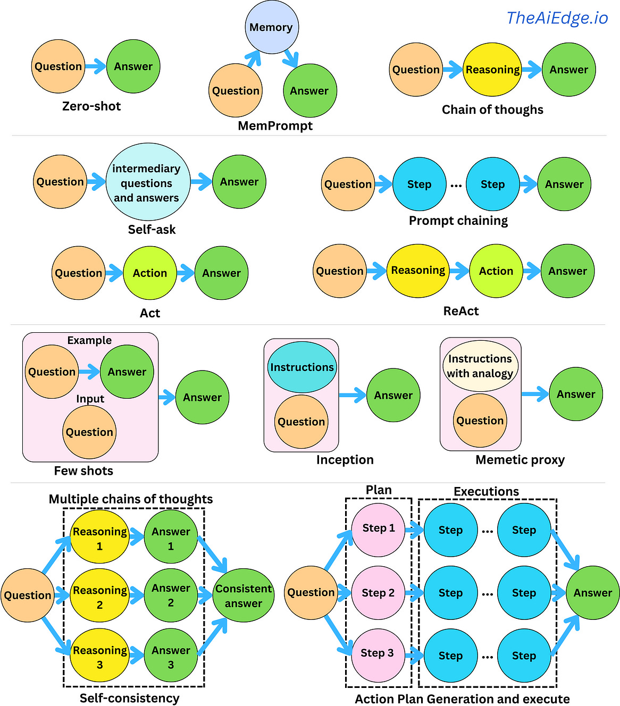

1. Prompt Concept
    1. Question-Answering
    1. Roll-play: `Act as a [ROLE] perform [TASK] in [FORMAT]`
    1. Reasoning
    1. Prompt-Chain

### Prompt Tuner / Optimizer

1. [Automatic Prompt Engineer (APE)](https://arxiv.org/abs/2211.01910): Automatically optimizing prompts. APE has discovered zero-shot Chain-of-Thought (CoT) prompts superior to human-designed prompts like “Let’s think through this step-by-step” (Kojima et al., 2022). The prompt “To get the correct answer, let’s think step-by-step.” triggers a chain of thought. Two approaches to generate high-quality candidates: forward mode and reverse mode generation. [3 Nov 2022] [git](https://github.com/keirp/automatic_prompt_engineer) / [ref](https:/towardsdatascience.com/automated-prompt-engineering-78678c6371b9) [Mar 2024]
 

1. [Claude Prompt Engineer](https://github.com/mshumer/gpt-prompt-engineer): Simply input a description of your task and some test cases, and the system will generate, test, and rank a multitude of prompts to find the ones that perform the best.  [4 Jul 2023] / Anthropic Helper metaprompt [ref](https://docs.anthropic.com/en/docs/helper-metaprompt-experimental) / [Claude Sonnet 3.5 for Coding](https://www.reddit.com/r/ClaudeAI/comments/1dwra38/sonnet_35_for_coding_system_prompt/)
 

1. [Cohere’s new Prompt Tuner](https://cohere.com/blog/intro-prompt-tuner): Automatically improve your prompts [31 Jul 2024]

1. [Large Language Models as Optimizers](https://arxiv.org/abs/2309.03409): Optimization by PROmpting (OPRO). showcase OPRO on linear regression and traveling salesman problems. [git](https://github.com/google-deepmind/opro) [7 Sep 2023]  

### **Prompt Guide & Leaked prompts**

- [Prompt Engineering Guide](https://www.promptingguide.ai/): 🏆Copyright © 2023 DAIR.AI
- [Azure OpenAI Prompt engineering techniques](https://learn.microsoft.com/en-us/azure/cognitive-services/openai/concepts/advanced-prompt-engineering)
- [OpenAI Prompt example](https://platform.openai.com/examples)
- [OpenAI Best practices for prompt engineering](https://help.openai.com/en/articles/6654000-best-practices-for-prompt-engineering-with-openai-api)
- [DeepLearning.ai ChatGPT Prompt Engineering for Developers](https://www.deeplearning.ai/short-courses/chatgpt-prompt-engineering-for-developers/)
- [Awesome ChatGPT Prompts](https://github.com/f/awesome-chatgpt-prompts) [Dec 2022]
 
- [LangChainHub](https://smith.langchain.com/hub): a collection of all artifacts useful for working with LangChain primitives such as prompts, chains and agents. [Jan 2023]
- [Awesome Prompt Engineering](https://github.com/promptslab/Awesome-Prompt-Engineering) [Feb 2023]
 
- [Prompt Engineering](https://lilianweng.github.io/posts/2023-03-15-prompt-engineering/): Prompt Engineering, also known as In-Context Prompting ... [Mar 2023]
- [Prompts for Education](https://github.com/microsoft/prompts-for-edu): Microsoft Prompts for Education [Jul 2023]
 
- [In-The-Wild Jailbreak Prompts on LLMs](https://github.com/verazuo/jailbreak_llms): A dataset consists of 15,140 ChatGPT prompts from Reddit, Discord, websites, and open-source datasets (including 1,405 jailbreak prompts). Collected from December 2022 to December 2023 [Aug 2023] 
- Leaked prompts of [GPTs](https://github.com/linexjlin/GPTs) [Nov 2023] and [Agents](https://github.com/LouisShark/chatgpt_system_prompt) [Nov 2023]
  
- [Awesome-GPTs-Prompts](https://github.com/ai-boost/awesome-prompts) [Jan 2024]
 
- [Fabric](https://github.com/danielmiessler/fabric): A modular framework for solving specific problems using a crowdsourced set of AI prompts that can be used anywhere [Jan 2024] 
- [LLM Prompt Engineering Simplified](https://github.com/AkmmusAI/LLM-Prompt-Engineering-Simplified-Book) [Feb 2024]
 
- [Power Platform GPT Prompts](https://github.com/pnp/powerplatform-prompts) [Mar 2024]
 
- [Anthropic Prompt Library](https://docs.anthropic.com/claude/prompt-library): Anthropic released a Claude 3 AI prompt library [Mar 2024]
- [Copilot prompts](https://github.com/pnp/copilot-prompts): Examples of prompts for Microsoft Copilot. [25 Apr 2024]
 
- [Anthropic courses > Prompt engineering interactive tutorial](https://github.com/anthropics/courses): a comprehensive step-by-step guide to key prompting techniques / prompt evaluations [Aug 2024]
 

### **Visual Prompting & Visual Grounding**

- [What is Visual prompting](https://landing.ai/what-is-visual-prompting/): Similarly to what has happened in NLP, large pre-trained vision transformers have made it possible for us to implement Visual Prompting. [doc](./files/vPrompt.pdf) [26 Apr 2023]
- [Visual Prompting](https://arxiv.org/abs/2211.11635) [21 Nov 2022]
- [Andrew Ng’s Visual Prompting Livestream📺](https://www.youtube.com/watch?v=FE88OOUBonQ) [24 Apr 2023]
- [What is Visual Grounding](https://paperswithcode.com/task/visual-grounding): Visual Grounding (VG) aims to locate the most relevant object or region in an image, based on a natural language query.
- [Screen AI](https://blog.research.google/2024/03/screenai-visual-language-model-for-ui.html): ScreenAI, a model designed for understanding and interacting with user interfaces (UIs) and infographics. [Mar 2024]
- [Motion Prompting](https://arxiv.org/abs/2412.02700): motion prompts for flexible video generation, enabling motion control, image interaction, and realistic physics. [git](https://motion-prompting.github.io/) [3 Dec 2024]


## Finetuning

### **Finetuning**

#### LLM Pre-training and Post-training Paradigms [x-ref](#large-language-models-in-2023)

#### PEFT: Parameter-Efficient Fine-Tuning ([📺](https://youtu.be/Us5ZFp16PaU)) [24 Apr 2023]

- [PEFT](https://huggingface.co/blog/peft): Parameter-Efficient Fine-Tuning. PEFT is an approach to fine tuning only a few parameters. [10 Feb 2023]
- [Scaling Down to Scale Up: A Guide to Parameter-Efficient Fine-Tuning](https://arxiv.org/abs/2303.15647): [[cnt](https://scholar.google.com/scholar?hl=en&as_sdt=0%2C5&q=arxiv%3A+2303.15647)] [28 Mar 2023]

- Category: Represent approach - Description - Pseudo Code [ref](https://speakerdeck.com/schulta) [22 Sep 2023]

  1. Adapters: Adapters - Additional Layers. Inference can be slower.

     ```python
     def transformer_with_adapter(x):
       residual = x
       x = SelfAttention(x)
       x = FFN(x) # adapter
       x = LN(x + residual)
       residual = x
       x = FFN(x) # transformer FFN
       x = FFN(x) # adapter
       x = LN(x + residual)
       return x
     ```

  1. Soft Prompts: Prompt-Tuning - Learnable text prompts. Not always desired results.

     ```python
     def soft_prompted_model(input_ids):
       x = Embed(input_ids)
       soft_prompt_embedding = SoftPromptEmbed(task_based_soft_prompt)
       x = concat([soft_prompt_embedding, x], dim=seq)
       return model(x)
     ```

  1. Selective: BitFit - Update only the bias parameters. fast but limited.

     ```python
     params = (p for n,p in model.named_parameters() if "bias" in n)
     optimizer = Optimizer(params)
     ```

  1. Reparametrization: LoRa - Low-rank decomposition. Efficient, Complex to implement.

     ```python
     def lora_linear(x):
       h = x @ W # regular linear
       h += x @ W_A @ W_B # low_rank update
       return scale * h
     ```

- [LoRA: Low-Rank Adaptation of Large Language Models](https://arxiv.org/abs/2106.09685): [[cnt](https://scholar.google.com/scholar?hl=en&as_sdt=0%2C5&q=arxiv%3A+2106.09685)]: LoRA is one of PEFT technique. To represent the weight updates with two smaller matrices (called update matrices) through low-rank decomposition. [git](https://github.com/microsoft/LoRA) [17 Jun 2021]
 
- [LoRA learns less and forgets less](https://arxiv.org/abs/2405.09673): Compared to full training, LoRA has less learning but better retention of original knowledge. [15 May 2024]

   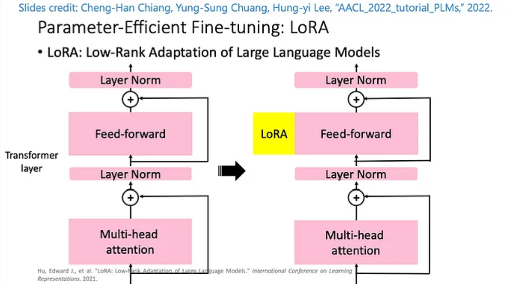

  1. [LoRA+](https://arxiv.org/abs/2402.12354): Improves LoRA’s performance and fine-tuning speed by setting different learning rates for the LoRA adapter matrices. [19 Feb 2024]
  1. [LoTR](https://arxiv.org/abs/2402.01376): Tensor decomposition for gradient update. [2 Feb 2024]
  1. [The Expressive Power of Low-Rank Adaptation](https://arxiv.org/abs/2310.17513): Theoretically analyzes the expressive power of LoRA. [26 Oct 2023]
  1. [DoRA](https://arxiv.org/abs/2402.09353): Weight-Decomposed Low-Rank Adaptation. Decomposes pre-trained weight into two components, magnitude and direction, for fine-tuning. [14 Feb 2024]
  1. LoRA Family [ref](https://towardsdatascience.com/an-overview-of-the-lora-family-515d81134725) [11 Mar 2024]
      - `LoRA` introduces low-rank matrices A and B that are trained, while the pre-trained weight matrix W is frozen.
      - `LoRA+` suggests having a much higher learning rate for B than for A.
      - `VeRA` does not train A and B, but initializes them randomly and trains new vectors d and b on top.
      - `LoRA-FA` only trains matrix B.
      - `LoRA-drop` uses the output of B*A to determine, which layers are worth to be trained at all.
      - `AdaLoRA` adapts the ranks of A and B in different layers dynamically, allowing for a higher rank in these layers, where more contribution to the model’s performance is expected.
      - `DoRA` splits the LoRA adapter into two components of magnitude and direction and allows to train them more independently.
      - `Delta-LoRA` changes the weights of W by the gradient of A*B.
  1. 5 Techniques of LoRA [ref](https://blog.dailydoseofds.com/p/5-llm-fine-tuning-techniques-explained): LoRA, LoRA-FA, VeRA, Delta-LoRA, LoRA+ [May 2024]

  </details>
- [Practical Tips for Finetuning LLMs Using LoRA (Low-Rank Adaptation)](https://magazine.sebastianraschka.com/p/practical-tips-for-finetuning-llms) [19 Nov 2023]: Best practical guide of LoRA.
  1. QLoRA saves 33% memory but increases runtime by 39%, useful if GPU memory is a constraint.
  1. Optimizer choice for LLM finetuning isn’t crucial. Adam optimizer’s memory-intensity doesn’t significantly impact LLM’s peak memory.
  1. Apply LoRA across all layers for maximum performance.
  1. Adjusting the LoRA rank is essential.
  1. Multi-epoch training on static datasets may lead to overfitting and deteriorate results.
- [Training language models to follow instructions with human feedback](https://arxiv.org/abs/2203.02155): [[cnt](https://scholar.google.com/scholar?hl=en&as_sdt=0%2C5&q=arxiv%3A+2203.02155)] [4 Mar 2022]
- [QLoRA: Efficient Finetuning of Quantized LLMs](https://arxiv.org/abs/2305.14314): [[cnt](https://scholar.google.com/scholar?hl=en&as_sdt=0%2C5&q=arxiv%3A+2305.14314)]: 4-bit quantized pre-trained language model into Low Rank Adapters (LoRA). [git](https://github.com/artidoro/qlora) [23 May 2023]
 
- [Fine-tuning a GPT - LoRA](https://dataman-ai.medium.com/fine-tune-a-gpt-lora-e9b72ad4ad3): Comprehensive guide for LoRA [doc](./files/Fine-tuning_a_GPT_LoRA.pdf) [20 Jun 2023]
- [LIMA: Less Is More for Alignment](https://arxiv.org/abs/2305.11206): [[cnt](https://scholar.google.com/scholar?hl=en&as_sdt=0%2C5&q=arxiv%3A+2305.11206)]: fine-tuned with the standard supervised loss on `only 1,000 carefully curated prompts and responses, without any reinforcement learning or human preference modeling.` LIMA demonstrates remarkably strong performance, either equivalent or strictly preferred to GPT-4 in 43% of cases. [18 May 2023]
- [Efficient Streaming Language Models with Attention Sinks](http://arxiv.org/abs/2309.17453): [[cnt](https://scholar.google.com/scholar?hl=en&as_sdt=0%2C5&q=arxiv%3A+2309.17453)] 1. StreamingLLM, an efficient framework that enables LLMs trained with a finite length attention window to generalize to infinite sequence length without any fine-tuning. 2. We neither expand the LLMs' context window nor enhance their long-term memory. [git](https://github.com/mit-han-lab/streaming-llm) [29 Sep 2023]
 

  <details open>

  <summary>Expand: StreamingLLM</summary>

  

  - Key-Value (KV) cache is an important component in the StreamingLLM framework.

  1. Window Attention: Only the most recent Key and Value states (KVs) are cached. This approach fails when the text length surpasses the cache size.
  2. Sliding Attention /w Re-computation: Rebuilds the Key-Value (KV) states from the recent tokens for each new token. Evicts the oldest part of the cache.
  3. StreamingLLM: One of the techniques used is to add a placeholder token (yellow-colored) as a dedicated attention sink during pre-training. This attention sink attracts the model’s attention and helps it generalize to longer sequences. Outperforms the sliding window with re-computation baseline by up to a remarkable 22.2× speedup.

  </details>

- LongLoRA

  1. [LongLoRA: Efficient Fine-tuning of Long-Context Large Language Models](https://arxiv.org/abs/2309.12307): [[cnt](https://scholar.google.com/scholar?hl=en&as_sdt=0%2C5&q=arxiv%3A+2309.12307)]: A combination of sparse local attention and LoRA [git](https://github.com/dvlab-research/LongLoRA) [21 Sep 2023]
 

  - Key Takeaways from LongLora <br/>
    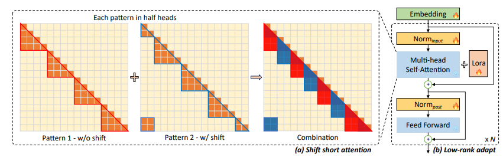
    1. The document states that LoRA alone is not sufficient for long context extension.
    1. Although dense global attention is needed during inference, fine-tuning the model can be done by sparse local attention, shift short attention (S2-Attn).
    1. S2-Attn can be implemented with only two lines of code in training.

  2. [QA-LoRA](https://arxiv.org/abs/2309.14717): [[cnt](https://scholar.google.com/scholar?hl=en&as_sdt=0%2C5&q=arxiv%3A+2309.14717)]: Quantization-Aware Low-Rank Adaptation of Large Language Models. A method that integrates quantization and low-rank adaptation for large language models. [git](https://github.com/yuhuixu1993/qa-lora) [26 Sep 2023]
 

- [How to continue pretraining an LLM on new data](https://x.com/rasbt/status/1768629533509370279): `Continued pretraining` can be as effective as `retraining on combined datasets`. [13 Mar 2024]

  Three training methods were compared:

  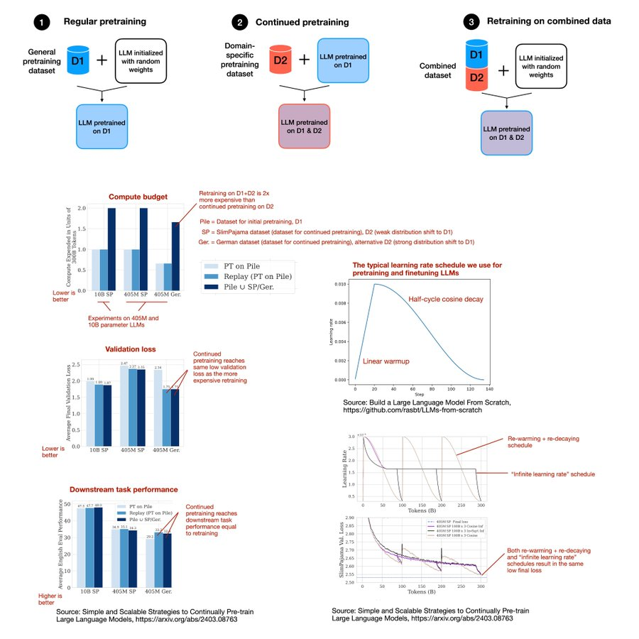

  1. Regular pretraining: A model is initialized with random weights and pretrained on dataset D1.
  2. Continued pretraining: The pretrained model from 1) is further pretrained on dataset D2.
  3. Retraining on combined dataset: A model is initialized with random weights and trained on the combined datasets D1 and D2.

  Continued pretraining can be as effective as retraining on combined datasets. Key strategies for successful continued pretraining include:

  1. Re-warming: Increasing the learning rate at the start of continued pre-training.
  2. Re-decaying: Gradually reducing the learning rate afterwards.
  3. Data Mixing: Adding a small portion (e.g., 5%) of the original pretraining data (D1) to the new dataset (D2) to prevent catastrophic forgetting.

#### **Llama Finetuning**

- A key difference between [Llama 1](https://arxiv.org/abs/2302.13971): [[cnt](https://scholar.google.com/scholar?hl=en&as_sdt=0%2C5&q=arxiv%3A+2302.13971)] [27 Feb 2023] and [Llama 2](https://arxiv.org/abs/2307.09288): [[cnt](https://scholar.google.com/scholar?hl=en&as_sdt=0%2C5&q=arxiv%3A+2307.09288)] [18 Jul 2023] is the architectural change of attention layer, in which Llama 2 takes advantage of Grouped Query Attention (GQA) mechanism to improve efficiency. > OSS LLM [x-ref](#open-source-large-language-models) / Llama3 > Build an llms from scratch [x-ref](#build-an-llms-from-scratch-picogpt-and-lit-gpt) <br/>
  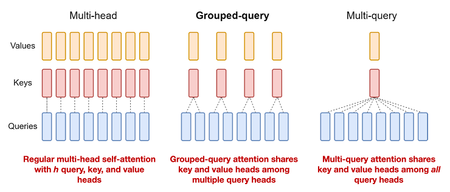
- [Multi-query attention (MQA)](https://arxiv.org/abs/2305.13245): [[cnt](https://scholar.google.com/scholar?hl=en&as_sdt=0%2C5&q=arxiv%3A+2305.13245)] [22 May 2023]
- Coding LLaMA 2 from scratch in PyTorch - KV Cache, Grouped Query Attention, Rotary PE, RMSNorm [📺](https://www.youtube.com/watch?v=oM4VmoabDAI) / [git](https://github.com/hkproj/pytorch-llama) [03 Sep 2023] <br/>
 

  - KV Cache, Grouped Query Attention, Rotary PE

  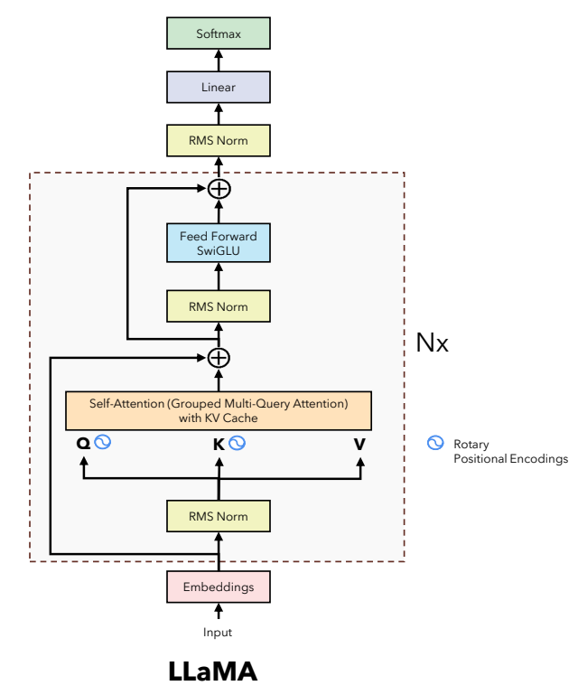

  - Rotary PE

  ```python
  def apply_rotary_embeddings(x: torch.Tensor, freqs_complex: torch.Tensor, device: str):
      # Separate the last dimension pairs of two values, representing the real and imaginary parts of the complex number
      # Two consecutive values will become a single complex number
      # (B, Seq_Len, H, Head_Dim) -> (B, Seq_Len, H, Head_Dim/2)
      x_complex = torch.view_as_complex(x.float().reshape(*x.shape[:-1], -1, 2))
      # Reshape the freqs_complex tensor to match the shape of the x_complex tensor. So we need to add the batch dimension and the head dimension
      # (Seq_Len, Head_Dim/2) --> (1, Seq_Len, 1, Head_Dim/2)
      freqs_complex = freqs_complex.unsqueeze(0).unsqueeze(2)
      # Multiply each complex number in the x_complex tensor by the corresponding complex number in the freqs_complex tensor
      # Which results in the rotation of the complex number as shown in the Figure 1 of the paper
      # (B, Seq_Len, H, Head_Dim/2) * (1, Seq_Len, 1, Head_Dim/2) = (B, Seq_Len, H, Head_Dim/2)
      x_rotated = x_complex * freqs_complex
      # Convert the complex number back to the real number
      # (B, Seq_Len, H, Head_Dim/2) -> (B, Seq_Len, H, Head_Dim/2, 2)
      x_out = torch.view_as_real(x_rotated)
      # (B, Seq_Len, H, Head_Dim/2, 2) -> (B, Seq_Len, H, Head_Dim)
      x_out = x_out.reshape(*x.shape)
      return x_out.type_as(x).to(device)
  ```

  - KV Cache, Grouped Query Attention

  ```python
    # Replace the entry in the cache
    self.cache_k[:batch_size, start_pos : start_pos + seq_len] = xk
    self.cache_v[:batch_size, start_pos : start_pos + seq_len] = xv

    # (B, Seq_Len_KV, H_KV, Head_Dim)
    keys = self.cache_k[:batch_size, : start_pos + seq_len]
    # (B, Seq_Len_KV, H_KV, Head_Dim)
    values = self.cache_v[:batch_size, : start_pos + seq_len]

    # Since every group of Q shares the same K and V heads, just repeat the K and V heads for every Q in the same group.

    # (B, Seq_Len_KV, H_KV, Head_Dim) --> (B, Seq_Len_KV, H_Q, Head_Dim)
    keys = repeat_kv(keys, self.n_rep)
    # (B, Seq_Len_KV, H_KV, Head_Dim) --> (B, Seq_Len_KV, H_Q, Head_Dim)
    values = repeat_kv(values, self.n_rep)
  ```

  </details>

- [Comprehensive Guide for LLaMA with RLHF](https://huggingface.co/blog/stackllama): StackLLaMA: A hands-on guide to train LLaMA with RLHF [5 Apr 2023]
- Official LLama Recipes incl. Finetuning: [git](https://github.com/facebookresearch/llama-recipes)
 

- Llama 2 ONNX [git](https://github.com/microsoft/Llama-2-Onnx) [Jul 2023]: ONNX, or Open Neural Network Exchange, is an open standard for machine learning interoperability. It allows AI developers to use models across various frameworks, tools, runtimes, and compilers.
 

### **RLHF (Reinforcement Learning from Human Feedback) & SFT (Supervised Fine-Tuning)**

- Machine learning technique that trains a "reward model" directly from human feedback and uses the model as a reward function to optimize an agent's policy using reinforcement learning.
- [InstructGPT: Training language models to follow instructions with human feedback](https://arxiv.org/abs/2203.02155): [[cnt](https://scholar.google.com/scholar?hl=en&as_sdt=0%2C5&q=arxiv%3A+2203.02155)] is a model trained by OpenAI to follow instructions using human feedback. [4 Mar 2022] <br/>
  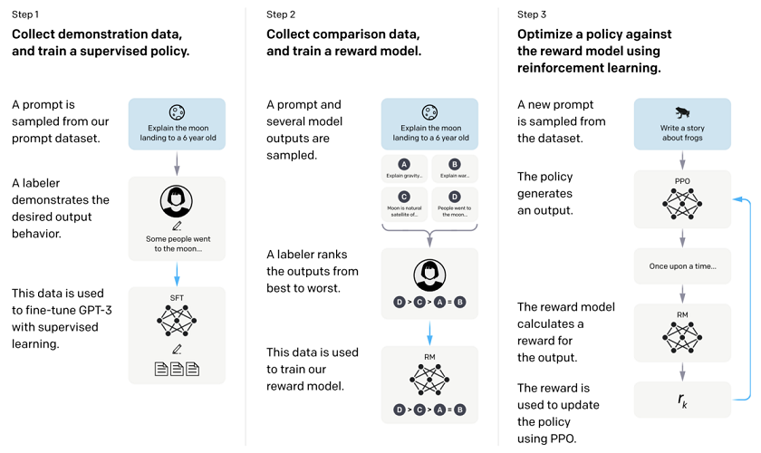 <br/>
   <br/>
  [cite](https://docs.argilla.io/)
- Libraries: [TRL](https://huggingface.co/docs/trl/index), [trlX](https://github.com/CarperAI/trlx), [Argilla](https://docs.argilla.io/en/latest/tutorials/libraries/colab.html) <br/>
 
   <br/>
  <!-- [SFTTrainer](https://huggingface.co/docs/trl/main/en/trainer#trl.SFTTrainer) from TRL -->
  TRL: from the Supervised Fine-tuning step (SFT), Reward Modeling step (RM) to the Proximal Policy Optimization (PPO) step <br/>
  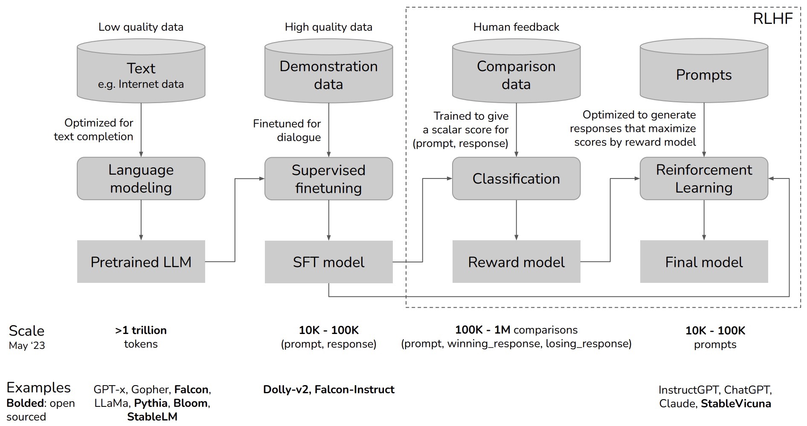 <br/>
  The three steps in the process: 1. pre-training on large web-scale data, 2. supervised fine-tuning on instruction data (instruction tuning), and 3. RLHF. [ref](https://aman.ai/primers/ai/RLHF/) [ⓒ 2023]
- `Supervised Fine-Tuning (SFT)` fine-tuning a pre-trained model on a specific task or domain using labeled data. This can cause more significant shifts in the model’s behavior compared to RLHF. <br/>
  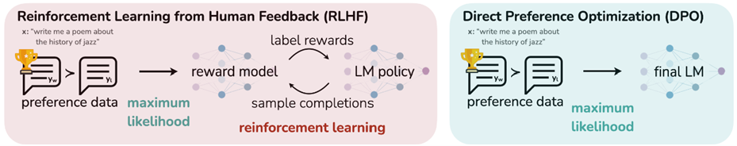
- [Reinforcement Learning from Human Feedback (RLHF)](https://arxiv.org/abs/1909.08593)) is a process of pretraining and retraining a language model using human feedback to develop a scoring algorithm that can be reapplied at scale for future training and refinement. As the algorithm is refined to match the human-provided grading, direct human feedback is no longer needed, and the language model continues learning and improving using algorithmic grading alone. [18 Sep 2019] [ref](https://huggingface.co/blog/rlhf) [9 Dec 2022]
  - `Proximal Policy Optimization (PPO)` is a reinforcement learning method using first-order optimization. It modifies the objective function to penalize large policy changes, specifically those that move the probability ratio away from 1. Aiming for TRPO (Trust Region Policy Optimization)-level performance without its complexity which requires second-order optimization.
- [Direct Preference Optimization (DPO)](https://arxiv.org/abs/2305.18290): [[cnt](https://scholar.google.com/scholar?hl=en&as_sdt=0%2C5&q=arxiv%3A+2305.18290)]: 1. RLHF can be complex because it requires fitting a reward model and performing significant hyperparameter tuning. On the other hand, DPO directly solves a classification problem on human preference data in just one stage of policy training. DPO more stable, efficient, and computationally lighter than RLHF. 2. `Your Language Model Is Secretly a Reward Model`  [29 May 2023]
  - Direct Preference Optimization (DPO) uses two models: a trained model (or policy model) and a reference model (copy of trained model). The goal is to have the trained model output higher probabilities for preferred answers and lower probabilities for rejected answers compared to the reference model.  [ref](https://towardsdatascience.com/fine-tune-a-mistral-7b-model-with-direct-preference-optimization-708042745aac): RHLF vs DPO [Jan 2, 2024] / [ref](https://pakhapoomsarapat.medium.com/forget-rlhf-because-dpo-is-what-you-actually-need-f10ce82c9b95) [1 Jul 2023]
- [ORPO (odds ratio preference optimization)](https://arxiv.org/abs/2403.07691): Monolithic Preference Optimization without Reference Model. New method that `combines supervised fine-tuning and preference alignment into one process` [git](https://github.com/xfactlab/orpo) [12 Mar 2024] [Fine-tune Llama 3 with ORPO](https://towardsdatascience.com/fine-tune-llama-3-with-orpo-56cfab2f9ada) [Apr 2024] <br/>
 
  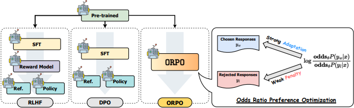
- [Reinforcement Learning from AI Feedback (RLAF)](https://arxiv.org/abs/2309.00267): [[cnt](https://scholar.google.com/scholar?hl=en&as_sdt=0%2C5&q=arxiv%3A+2309.00267)]: Uses AI feedback to generate instructions for the model. TLDR: CoT (Chain-of-Thought, Improved), Few-shot (Not improved). Only explores the task of summarization. After training on a few thousand examples, performance is close to training on the full dataset. RLAIF vs RLHF: In many cases, the two policies produced similar summaries. [1 Sep 2023]
- OpenAI Spinning Up in Deep RL!: An educational resource to help anyone learn deep reinforcement learning. [git](https://github.com/openai/spinningup) [Nov 2018]
 
- [A Comprehensive Survey of LLM Alignment Techniques: RLHF, RLAIF, PPO, DPO and More](https://arxiv.org/abs/2407.16216) [23 Jul 2024]
- Preference optimization techniques: [ref](https://x.com/helloiamleonie/status/1823305448650383741) [13 Aug 2024]
  - `RLHF (Reinforcement Learning from Human Feedback)`: Optimizes reward policy via objective function.
  - `DPO (Direct preference optimization)`: removes the need for a reward model. > Minimizes loss; no reward policy.
  - `IPO (Identity Preference Optimization)` : A change in the objective, which is simpler and less prone to overfitting.
  - `KTO (Kahneman-Tversky Optimization)` : Scales more data by replacing the pairs of accepted and rejected generations with a binary label.
  - `ORPO (Odds Ratio Preference Optimization)` : Combines instruction tuning and preference optimization into one training process, which is cheaper and faster.
  - `TPO (Thought Preference Optimization)`: This method generates thoughts before the final response, which are then evaluated by a Judge model for preference using Direct Preference Optimization (DPO). [14 Oct 2024]
- [SFT vs RL](https://arxiv.org/abs/2501.17161): SFT Memorizes, RL Generalizes. RL enhances generalization across text and vision, while SFT tends to memorize and overfit. [git](https://github.com/LeslieTrue/SFTvsRL) [28 Jan 2025]

### **Model Compression for Large Language Models**

- A Survey on Model Compression for Large Language Models [ref](https://arxiv.org/abs/2308.07633) [15 Aug 2023]

#### **Quantization Techniques**

- Quantization-aware training (QAT): The model is further trained with quantization in mind after being initially trained in floating-point precision.
- Post-training quantization (PTQ): The model is quantized after it has been trained without further optimization during the quantization process.

  | Method                      | Pros                                                        | Cons                                                                                 |
  | --------------------------- | ----------------------------------------------------------- | ------------------------------------------------------------------------------------ |
  | Post-training quantization  | Easy to use, no need to retrain the model                   | May result in accuracy loss                                                          |
  | Quantization-aware training | Can achieve higher accuracy than post-training quantization | Requires retraining the model, can be more complex to implement                      |

- bitsandbytes: 8-bit optimizers [git](https://github.com/TimDettmers/bitsandbytes) [Oct 2021]
 
- [The Era of 1-bit LLMs](https://arxiv.org/abs/2402.17764): All Large Language Models are in 1.58 Bits. BitNet b1.58, in which every single parameter (or weight) of the LLM is ternary {-1, 0, 1}. [27 Feb 2024]

#### **Pruning and Sparsification**

- Pruning: The process of removing some of the neurons or layers from a neural network. This can be done by identifying and eliminating neurons or layers that have little or no impact on the network's output.

- Sparsification: A technique used to reduce the size of large language models by removing redundant parameters.

- [Wanda Pruning](https://arxiv.org/abs/2306.11695): [[cnt](https://scholar.google.com/scholar?hl=en&as_sdt=0%2C5&q=arxiv%3A+2306.11695)]: A Simple and Effective Pruning Approach for Large Language Models [20 Jun 2023] [ref](https://www.linkedin.com/pulse/efficient-model-pruning-large-language-models-wandas-ayoub-kirouane)

#### **Knowledge Distillation: Reducing Model Size with Textbooks**

- phi-series: [x-ref](#large-language-model-collection): Textbooks Are All You Need.
- [Orca 2](https://arxiv.org/abs/2311.11045): [[cnt](https://scholar.google.com/scholar?hl=en&as_sdt=0%2C5&q=arxiv%3A+2311.11045)]: Orca learns from rich signals from GPT 4 including explanation traces; step-by-step thought processes; and other complex instructions, guided by teacher assistance from ChatGPT. [ref](https://www.microsoft.com/en-us/research/blog/orca-2-teaching-small-language-models-how-to-reason/) [18 Nov 2023]
- Distilled Supervised Fine-Tuning (dSFT)
  1. [Zephyr 7B](https://arxiv.org/abs/2310.16944): [[cnt](https://scholar.google.com/scholar?hl=en&as_sdt=0%2C5&q=arxiv%3A+2310.16944)] Zephyr-7B-β is the second model in the series, and is a fine-tuned version of mistralai/Mistral-7B-v0.1 that was trained on on a mix of publicly available, synthetic datasets using Direct Preference Optimization (DPO). [ref](https://huggingface.co/HuggingFaceH4/zephyr-7b-beta) [25 Oct 2023]
  2. [Mistral 7B](https://arxiv.org/abs/2310.06825): [[cnt](https://scholar.google.com/scholar?hl=en&as_sdt=0%2C5&q=arxiv%3A+2310.06825)]: Outperforms Llama 2 13B on all benchmarks. Uses Grouped-query attention (GQA) for faster inference. Uses Sliding Window Attention (SWA) to handle longer sequences at smaller cost. [ref](https://mistral.ai/news/announcing-mistral-7b/) [10 Oct 2023]

#### **Memory Optimization**

- Transformer cache key-value tensors of context tokens into GPU memory to facilitate fast generation of the next token. However, these caches occupy significant GPU memory. The unpredictable nature of cache size, due to the variability in the length of each request, exacerbates the issue, resulting in significant memory fragmentation in the absence of a suitable memory management mechanism.
- To alleviate this issue, PagedAttention was proposed to store the KV cache in non-contiguous memory spaces. It partitions the KV cache of each sequence into multiple blocks, with each block containing the keys and values for a fixed number of tokens.
- [PagedAttention](https://arxiv.org/abs/2309.06180) : vLLM: Easy, Fast, and Cheap LLM Serving with PagedAttention, 24x Faster LLM Inference [doc](./files/vLLM_pagedattention.pdf). [ref](https://vllm.ai/): vllm [12 Sep 2023]

  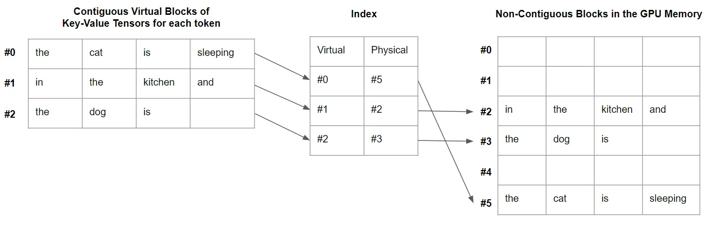

  - PagedAttention for a prompt “the cat is sleeping in the kitchen and the dog is”. Key-Value pairs of tensors for attention computation are stored in virtual contiguous blocks mapped to non-contiguous blocks in the GPU memory.

- [TokenAttention](https://github.com/ModelTC/lightllm) an attention mechanism that manages key and value caching at the token level. [git](https://github.com/ModelTC/lightllm/blob/main/docs/TokenAttention.md) [Jul 2023]
 
- [Flash Attention](https://arxiv.org/abs/2205.14135): [[cnt](https://scholar.google.com/scholar?hl=en&as_sdt=0%2C5&q=arxiv%3A+2205.14135)] [27 May 2022]
  - In a GPU, A thread is the smallest execution unit, and a group of threads forms a block.
  - A block executes the same kernel (function, to simplify), with threads sharing fast SRAM memory.
  - All blocks can access the shared global HBM memory.
  - First, the query (Q) and key (K) product is computed in threads and returned to HBM. Then, it's redistributed for softmax and returned to HBM.
  - Flash attention reduces these movements by caching results in SRAM.
  - `Tiling` splits attention computation into memory-efficient blocks, while `recomputation` saves memory by recalculating intermediates during backprop. [📺](https://www.youtube.com/live/gMOAud7hZg4?si=dx637BQV-4Duu3uY)
  - [FlashAttention-2](https://arxiv.org/abs/2307.08691): [[cnt](https://scholar.google.com/scholar?hl=en&as_sdt=0%2C5&q=arxiv%3A+2307.08691)] [17 Jul 2023]: An method that reorders the attention computation and leverages classical techniques (tiling, recomputation). Instead of storing each intermediate result, use kernel fusion and run every operation in a single kernel in order to avoid memory read/write overhead. [git](https://github.com/Dao-AILab/flash-attention) -> Compared to a standard attention implementation in PyTorch, FlashAttention-2 can be up to 9x faster
 
  - [FlashAttention-3](https://arxiv.org/abs/2407.08608) [11 Jul 2024]  
- [CPU vs GPU vs TPU](https://newsletter.theaiedge.io/p/how-to-scale-model-training): The threads are grouped into thread blocks. Each of the thread blocks has access to a fast shared memory (SRAM). All the thread blocks can also share a large global memory. High-bandwidth memories (HBM). `HBM Bandwidth: 1.5-2.0TB/s vs SRAM Bandwidth: 19TB/s ~ 10x HBM` [27 May 2024]

#### **Other techniques and LLM patterns**

- [LLM patterns](https://eugeneyan.com/writing/llm-patterns/): 🏆From data to user, from defensive to offensive [doc](./files/llm-patterns-og.png)
- [What We’ve Learned From A Year of Building with LLMs](https://applied-llms.org/):💡A practical guide to building successful LLM products, covering the tactical, operational, and strategic.  [8 June 2024]
- [Large Transformer Model Inference Optimization](https://lilianweng.github.io/posts/2023-01-10-inference-optimization/): Besides the increasing size of SoTA models, there are two main factors contributing to the inference challenge ... [10 Jan 2023]
- [Mixture of experts models](https://mistral.ai/news/mixtral-of-experts/): Mixtral 8x7B: Sparse mixture of experts models (SMoE) [magnet](https://x.com/MistralAI/status/1706877320844509405?s=20) [Dec 2023]
- [Huggingface Mixture of Experts Explained](https://huggingface.co/blog/moe): Mixture of Experts, or MoEs for short [Dec 2023]
- [Simplifying Transformer Blocks](https://arxiv.org/abs/2311.01906): Simplifie Transformer. Removed several block components, including skip connections, projection/value matrices, sequential sub-blocks and normalisation layers without loss of training speed. [3 Nov 2023]
- [Model merging](https://towardsdatascience.com/merge-large-language-models-with-mergekit-2118fb392b54): : A technique that combines two or more large language models (LLMs) into a single model, using methods such as SLERP, TIES, DARE, and passthrough. [Jan 2024] [git](https://github.com/cg123/mergekit): mergekit
 
  | Method | Pros | Cons |
  | --- | --- | --- |
  | SLERP | Preserves geometric properties, popular method | Can only merge two models, may decrease magnitude |
  | TIES | Can merge multiple models, eliminates redundant parameters | Requires a base model, may discard useful parameters |
  | DARE | Reduces overfitting, keeps expectations unchanged | May introduce noise, may not work well with large differences |
- [Mamba: Linear-Time Sequence Modeling with Selective State Spaces](https://arxiv.org/abs/2312.00752) [1 Dec 2023] [git](https://github.com/state-spaces/mamba): 1. Structured State Space (S4) - Class of sequence models, encompassing traits from RNNs, CNNs, and classical state space models. 2. Hardware-aware (Optimized for GPU) 3. Integrating selective SSMs and eliminating attention and MLP blocks [ref](https://www.unite.ai/mamba-redefining-sequence-modeling-and-outforming-transformers-architecture/) / A Visual Guide to Mamba and State Space Models [ref](https://newsletter.maartengrootendorst.com/p/a-visual-guide-to-mamba-and-state) [19 FEB 2024]
 
  - [Mamba-2](https://arxiv.org/abs/2405.21060): 2-8X faster [31 May 2024]
- [Sakana.ai: Evolutionary Optimization of Model Merging Recipes.](https://arxiv.org/abs/2403.13187): A Method to Combine 500,000 OSS Models. [git](https://github.com/SakanaAI/evolutionary-model-merge) [19 Mar 2024]
 
- [Mixture-of-Depths](https://arxiv.org/abs/2404.02258): All tokens should not require the same effort to compute. The idea is to make token passage through a block optional. Each block selects the top-k tokens for processing, and the rest skip it. [ref](https://www.linkedin.com/embed/feed/update/urn:li:share:7181996416213372930) [2 Apr 2024]
- [Kolmogorov-Arnold Networks (KANs)](https://arxiv.org/abs/2404.19756): KANs use activation functions on connections instead of nodes like Multi-Layer Perceptrons (MLPs) do. Each weight in KANs is replaced by a learnable 1D spline function. KANs’ nodes simply sum incoming signals without applying any non-linearities. [git](https://github.com/KindXiaoming/pykan) [30 Apr 2024] / [ref](https://www.dailydoseofds.com/a-beginner-friendly-introduction-to-kolmogorov-arnold-networks-kan/): A Beginner-friendly Introduction to Kolmogorov Arnold Networks (KAN) [19 May 2024]
 
- [Better & Faster Large Language Models via Multi-token Prediction](https://arxiv.org/abs/2404.19737): Suggest that training language models to predict multiple future tokens at once [30 Apr 2024]
- [Lamini Memory Tuning](https://github.com/lamini-ai/Lamini-Memory-Tuning): Mixture of Millions of Memory Experts (MoME). 95% LLM Accuracy, 10x Fewer Hallucinations. [ref](https://www.lamini.ai/blog/lamini-memory-tuning) [Jun 2024]
 
- [Scaling Synthetic Data Creation with 1,000,000,000 Personas](https://arxiv.org/abs/2406.20094) A persona-driven data synthesis methodology using Text-to-Persona and Persona-to-Persona. [28 Jun 2024]
- [RouteLLM](https://github.com/lm-sys/RouteLLM): a framework for serving and evaluating LLM routers. [Jun 2024]
 
- [KAN or MLP: A Fairer Comparison](https://arxiv.org/abs/2407.16674): In machine learning, computer vision, audio processing, natural language processing, and symbolic formula representation (except for symbolic formula representation tasks), MLP generally outperforms KAN. [23 Jul 2024]
- [Differential Transformer](https://arxiv.org/abs/2410.05258): Amplifies attention to the relevant context while minimizing noise using two separate softmax attention mechanisms. [7 Oct 2024]
- [Large Concept Models](https://arxiv.org/abs/2412.08821): Focusing on high-level sentence (concept) level rather than tokens. using SONAR for sentence embedding space. [11 Dec 2024]


## **Large Language Model: Challenges and Solutions**

### AGI Discussion and Social Impact

- AGI: Artificial General Intelligence
- Artificial General Intelligence Society: a central hub for AGI research, publications, and conference details. [ref](https://agi-society.org/resources/)
- Machine Intelligence Research Institute (MIRI): a leading organization in AGI safety and alignment, focusing on theoretical work to ensure safe AI development. [ref](https://intelligence.org)
- LessWrong & Alignment Forum: Extensive discussions on AGI alignment, with contributions from experts in AGI safety. [ref:LessWrong](https://www.lesswrong.com/) | [ref:Alignment Forum](https://www.alignmentforum.org/)
- [Artificial General Intelligence: Concept, State of the Art, and Future Prospects](https://www.researchgate.net/publication/271390398_Artificial_General_Intelligence_Concept_State_of_the_Art_and_Future_Prospects) [Jan 2014]
- [There is no Artificial General Intelligence](https://arxiv.org/abs/1906.05833): A critical perspective arguing that human-like conversational intelligence cannot be mathematically modeled or replicated by current AGI theories. [9 Jun 2019]
- [The General Theory of General Intelligence: A Pragmatic Patternist Perspective](https://arxiv.org/abs/2103.15100): a patternist philosophy of mind, arguing for a formal theory of general intelligence based on patterns and complexity. [28 Mar 2021]
- [Sparks of Artificial General Intelligence: Early experiments with GPT-4](https://arxiv.org/abs/2303.12712): [22 Mar 2023]
- [One Small Step for Generative AI, One Giant Leap for AGI: A Complete Survey on ChatGPT in AIGC Era](https://arxiv.org/abs/2304.06488) [4 Apr 2023]
- [Levels of AGI for Operationalizing Progress on the Path to AGI](https://arxiv.org/abs/2311.02462): Provides a comprehensive discussion on AGI's progress and proposes metrics and benchmarks for assessing AGI systems. [4 Nov 2023]
- [How Far Are We From AGI](https://arxiv.org/abs/2405.10313): A survey discussing AGI's goals, developmental trajectory, and alignment technologies, providing a roadmap for AGI realization. [16 May 2024]
- [OpenAI: Planning for AGI and beyond](https://openai.com/index/planning-for-agi-and-beyond/) [24 Feb 2023]
- [Linus Torvalds: 90% of AI marketing is hype](https://www.theregister.com/2024/10/29/linus_torvalds_ai_hype):💡AI is 90% marketing, 10% reality [29 Oct 2024]
- OpenAI's CEO, Sam Altman, predicts AGI could emerge by 2025. [ref](https://blog.cubed.run/agi-by-2025-altmans-bold-prediction-on-ai-s-future-9f15b071762c) [9 Nov 2024]
- Anthropic's CEO, Dario Amodei, predicts AGI between 2026 and 2027. [ref](https://techcrunch.com/2024/11/13/this-week-in-ai-anthropics-ceo-talks-scaling-up-ai-and-google-predicts-floods/) [13 Nov 2024]
- [Key figures and their predicted AGI timelines](https://x.com/slow_developer/status/1858877008375152805):💡AGI might be emerging between 2025 to 2030. [19 Nov 2024]
- [Creating Scalable AGI: the Open General Intelligence Framework](https://arxiv.org/abs/2411.15832): a new AI architecture designed to enhance flexibility and scalability by dynamically managing specialized AI modules. [24 Nov 2024]
- [Shaping AI's Impact on Billions of Lives](https://arxiv.org/abs/2412.02730): a framework for assessing AI's potential effects and responsibilities, 18 milestones and 5 guiding principles for responsible AI [3 Dec 2024]

### **OpenAI's Roadmap and Products**

#### **OpenAI's roadmap**

- [The Timeline of the OpenaAI's Founder Journeys](https://www.coffeespace.com/blog-post/openai-founders-journey-a-transformer-company-transformed) [15 Oct 2024]
- [Humanloop Interview 2023](https://web.archive.org/web/20230531203946/https://humanloop.com/blog/openai-plans) : [doc](./files/openai-plans.pdf) [29 May 2023]
- OpenAI’s CEO Says the Age of Giant AI Models Is Already Over [ref](https://www.wired.com/story/openai-ceo-sam-altman-the-age-of-giant-ai-models-is-already-over/) [17 Apr 2023]
- Q* (pronounced as Q-Star): The model, called Q* was able to solve basic maths problems it had not seen before, according to the tech news site the Information. [ref](https://www.theguardian.com/business/2023/nov/23/openai-was-working-on-advanced-model-so-powerful-it-alarmed-staff) [23 Nov 2023]
- Sam Altman reveals in an interview with Bill Gates (2 days ago) what's coming up in GPT-4.5 (or GPT-5): Potential integration with other modes of information beyond text, better logic and analysis capabilities, and consistency in performance over the next two years. [ref](https://x.com/IntuitMachine/status/1746278269165404164?s=20) [12 Jan 2024]
<!-- - Sam Altman Interview with Lex Fridman: [ref](https://lexfridman.com/sam-altman-2-transcript) [19 Mar 2024] -->
- Model Spec: Desired behavior for the models in the OpenAI API and ChatGPT [ref](https://cdn.openai.com/spec/model-spec-2024-05-08.html) [8 May 2024] [ref](https://twitter.com/yi_ding/status/1788281765637038294): takeaway
- [AMA (ask me anything) with OpenAI on Reddit](https://www.reddit.com/r/ChatGPT/comments/1ggixzy/ama_with_openais_sam_altman_kevin_weil_srinivas/) [1 Nov 2024]

#### **OpenAI o series**

- [A new series of reasoning models](https://openai.com/index/introducing-openai-o1-preview/): The complex reasoning-specialized model, OpenAI o1 series, excels in math, coding, and science, outperforming GPT-4o on key benchmarks. [12 Sep 2024] / [ref](https://github.com/hijkzzz/Awesome-LLM-Strawberry): Awesome LLM Strawberry (OpenAI o1)
 
- [A Comparative Study on Reasoning Patterns of OpenAI's o1 Model](https://arxiv.org/abs/2410.13639): 6 types of o1 reasoning patterns (i.e., Systematic Analysis (SA), Method
Reuse (MR), Divide and Conquer (DC), Self-Refinement (SR), Context Identification (CI), and Emphasizing Constraints (EC)). `the most commonly used reasoning patterns in o1 are DC and SR` [17 Oct 2024]
- [OpenAI o1 system card](https://openai.com/index/openai-o1-system-card/) [5 Dec 2024]
- [o3 preview](https://openai.com/12-days/): 12 Days of OpenAI [20 Dec 2024]

#### **GPT-4 details leaked** `unverified`

- GPT-4V(ision) system card: [ref](https://openai.com/research/gpt-4v-system-card) [25 Sep 2023] / [ref](https://cdn.openai.com/papers/GPTV_System_Card.pdf)
- [The Dawn of LMMs](https://arxiv.org/abs/2309.17421): [[cnt](https://scholar.google.com/scholar?hl=en&as_sdt=0%2C5&q=arxiv%3A+2309.17421)]: Preliminary Explorations with GPT-4V(ision) [29 Sep 2023]
- GPT-4 details leaked
  - GPT-4 is a language model with approximately 1.8 trillion parameters across 120 layers, 10x larger than GPT-3. It uses a Mixture of Experts (MoE) model with 16 experts, each having about 111 billion parameters. Utilizing MoE allows for more efficient use of resources during inference, needing only about 280 billion parameters and 560 TFLOPs, compared to the 1.8 trillion parameters and 3,700 TFLOPs required for a purely dense model.
  - The model is trained on approximately 13 trillion tokens from various sources, including internet data, books, and research papers. To reduce training costs, OpenAI employs tensor and pipeline parallelism, and a large batch size of 60 million. The estimated training cost for GPT-4 is around $63 million. [ref](https://www.reddit.com/r/LocalLLaMA/comments/14wbmio/gpt4_details_leaked) [Jul 2023]

#### **OpenAI Products**

- [ChatGPT can now see, hear, and speak](https://openai.com/blog/chatgpt-can-now-see-hear-and-speak): It has recently been updated to support multimodal capabilities, including voice and image. [25 Sep 2023] [Whisper](https://github.com/openai/whisper) / [CLIP](https://github.com/openai/Clip)
  
- [ChatGPT Plugin](https://openai.com/blog/chatgpt-plugins) [23 Mar 2023]
- [ChatGPT Function calling](https://platform.openai.com/docs/guides/gpt/function-calling) [Jun 2023] > Azure OpenAI supports function calling. [ref](https://learn.microsoft.com/en-us/azure/ai-services/openai/how-to/function-calling#using-function-in-the-chat-completions-api)
- [Custom instructions](https://openai.com/blog/custom-instructions-for-chatgpt): In a nutshell, the Custom Instructions feature is a cross-session memory that allows ChatGPT to retain key instructions across chat sessions. [20 Jul 2023]
- [GPT-3.5 Turbo Fine-tuning](https://openai.com/blog/gpt-3-5-turbo-fine-tuning-and-api-updates) Fine-tuning for GPT-3.5 Turbo is now available, with fine-tuning for GPT-4 coming this fall. [22 Aug 2023]
- Open AI Enterprise: Removes GPT-4 usage caps, and performs up to two times faster [ref](https://openai.com/blog/introducing-chatgpt-enterprise) [28 Aug 2023]
- [DALL·E 3](https://openai.com/dall-e-3) : In September 2023, OpenAI announced their latest image model, DALL-E 3 [git](https://github.com/openai/dall-e) [Sep 2023]
 
- [OpenAI DevDay 2023](https://openai.com/blog/new-models-and-developer-products-announced-at-devday): GPT-4 Turbo with 128K context, Assistants API (Code interpreter, Retrieval, and function calling), GPTs (Custom versions of ChatGPT: [ref](https://openai.com/blog/introducing-gpts)), Copyright Shield, Parallel Function Calling, JSON Mode, Reproducible outputs [6 Nov 2023]
- [Introducing the GPT Store](https://openai.com/blog/introducing-the-gpt-store): Roll out the GPT Store to ChatGPT Plus, Team and Enterprise users  [GPTs](https://chat.openai.com/gpts) [10 Jan 2024]
- [New embedding models](https://openai.com/blog/new-embedding-models-and-api-updates) `text-embedding-3-small`: Embedding size: 512, 1536 `text-embedding-3-large`: Embedding size: 256,1024,3072 [25 Jan 2024]
- [Sora](https://openai.com/sora) Text-to-video model. Sora can generate videos up to a minute long while maintaining visual quality and adherence to the user’s prompt. [15 Feb 2024]
- [ChatGPT Memory](https://openai.com/blog/memory-and-new-controls-for-chatgpt): Remembering things you discuss `across all chats` saves you from having to repeat information and makes future conversations more helpful. [Apr 2024]
- [CriticGPT](https://openai.com/index/finding-gpt4s-mistakes-with-gpt-4/): a version of GPT-4 fine-tuned to critique code generated by ChatGPT [27 Jun 2024]
- [SearchGPT](https://openai.com/index/searchgpt-prototype/): AI search [25 Jul 2024] > [ChatGPT Search](https://openai.com/index/introducing-chatgpt-search/) [31 Oct 2024]
- [Structured Outputs in the API](https://openai.com/index/introducing-structured-outputs-in-the-api/): a new feature designed to ensure model-generated outputs will exactly match JSON Schemas provided by developers. [6 Aug 2024]
- [OpenAI DevDay 2024](https://openai.com/devday/): Real-time API (speech-to-speech), Vision Fine-Tuning, Prompt Caching, and Distillation (fine-tuning a small language model using a large language model). [ref](https://community.openai.com/t/devday-2024-san-francisco-live-ish-news/963456) [1 Oct 2024]
- [Operator](https://openai.com/index/introducing-operator/): GUI Agent. Operates embedded virtual environments. Specialized model (Computer-Using Agent). [23 Jan 2025]
- [deep research](https://openai.com/index/introducing-deep-research/): An agent that uses reasoning to synthesize large amounts of online information and complete multi-step research tasks [2 Feb 2025]

#### **GPT series release date**

- GPT 1: Decoder-only model. 117 million parameters. [Jun 2018] [git](https://github.com/openai/finetune-transformer-lm)
 
- GPT 2: Increased model size and parameters. 1.5 billion. [14 Feb 2019] [git](https://github.com/openai/gpt-2)
 
- GPT 3: Introduced few-shot learning. 175B. [11 Jun 2020] [git](https://github.com/openai/gpt-3)
 
- GPT 3.5: 3 variants each with 1.3B, 6B, and 175B parameters. [15 Mar 2022] Estimate the embedding size of OpenAI's gpt-3.5-turbo to be about 4,096
- ChatGPT: GPT-3 fine-tuned with RLHF. 20B or 175B. `unverified` [ref](https://www.reddit.com/r/LocalLLaMA/comments/17lvquz/clearing_up_confusion_gpt_35turbo_may_not_be_20b/) [30 Nov 2022]
- GPT 4: Mixture of Experts (MoE). 8 models with 220 billion parameters each, for a total of about 1.76 trillion parameters. `unverified` [ref](https://the-decoder.com/gpt-4-architecture-datasets-costs-and-more-leaked/) [14 Mar 2023]
- [GPT-4o](https://openai.com/index/hello-gpt-4o/): o stands for Omni. 50% cheaper. 2x faster. Multimodal input and output capabilities (text, audio, vision). supports 50 languages. [13 May 2024] / [GPT-4o mini](https://openai.com/index/gpt-4o-mini-advancing-cost-efficient-intelligence/): 15 cents per million input tokens, 60 cents per million output tokens, MMLU of 82%, and fast. [18 Jul 2024]
- [OpenAI o1](#openai-o-series) [12 Sep 2024]
- [o3-mini system card](https://openai.com/index/o3-mini-system-card/): The first model to reach Medium risk on Model Autonomy. [31 Jan 2025]

### **Context constraints**

- [Sparse Attention: Generating Long Sequences with Sparse Transformer](https://arxiv.org/abs/1904.10509):💡Sparse attention computes scores for a subset of pairs, selected via a fixed or learned sparsity pattern, reducing calculation costs. Strided attention: image, audio / Fixed attention:text [ref](https://openai.com/index/sparse-transformer/) / [git](https://github.com/openai/sparse_attention) [23 Apr 2019]
 
- [Rotary Positional Embedding (RoPE)](https://arxiv.org/abs/2104.09864):💡[[cnt](https://scholar.google.com/scholar?hl=en&as_sdt=0%2C5&q=arxiv%3A+2104.09864)] / [ref](https://blog.eleuther.ai/rotary-embeddings/) / [doc](./files/RoPE.pdf) [20 Apr 2021]
  - How is this different from the sinusoidal embeddings used in "Attention is All You Need"?
    1. Sinusoidal embeddings apply to each coordinate individually, while rotary embeddings mix pairs of coordinates
    2. Sinusoidal embeddings add a `cos` or `sin` term, while rotary embeddings use a multiplicative factor.
    3. Rotary embeddings are applied to positional encoding to K and V, not to the input embeddings.
- [Structured Prompting: Scaling In-Context Learning to 1,000 Examples](https://arxiv.org/abs/2212.06713): [[cnt](https://scholar.google.com/scholar?hl=en&as_sdt=0%2C5&q=arxiv%3A+2212.06713)] [13 Dec 2022]
  1. Microsoft's Structured Prompting allows thousands of examples, by first concatenating examples into groups, then inputting each group into the LM. The hidden key and value vectors of the LM's attention modules are cached. Finally, when the user's unaltered input prompt is passed to the LM, the cached attention vectors are injected into the hidden layers of the LM.
  2. This approach wouldn't work with OpenAI's closed models. because this needs to access [keys] and [values] in the transformer internals, which they do not expose. You could implement yourself on OSS ones. [cite](https://www.infoq.com/news/2023/02/microsoft-lmops-tools/) [07 Feb 2023]
- [Introducing 100K Context Windows](https://www.anthropic.com/index/100k-context-windows): hundreds of pages, Around 75,000 words; [11 May 2023] [demo](https://youtu.be/2kFhloXz5_E) Anthropic Claude
- [Lost in the Middle: How Language Models Use Long Contexts](https://arxiv.org/abs/2307.03172):💡[[cnt](https://scholar.google.com/scholar?hl=en&as_sdt=0%2C5&q=arxiv%3A+2307.03172)] [6 Jul 2023]
  1. Best Performace when relevant information is at beginning
  2. Too many retrieved documents will harm performance
  3. Performacnce decreases with an increase in context
- [Ring Attention](https://arxiv.org/abs/2310.01889): [[cnt](https://scholar.google.com/scholar?hl=en&as_sdt=0%2C5&q=arxiv%3A+2310.01889)]: 1. Ring Attention, which leverages blockwise computation of self-attention to distribute long sequences across multiple devices while overlapping the communication of key-value blocks with the computation of blockwise attention. 2. Ring Attention can reduce the memory requirements of Transformers, enabling us to train more than 500 times longer sequence than prior memory efficient state-of-the-arts and enables the training of sequences that exceed 100 million in length without making approximations to attention. 3. we propose an enhancement to the blockwise parallel transformers (BPT) framework. [git](https://github.com/lhao499/llm_large_context) [3 Oct 2023]
 
- [“Needle in a Haystack” Analysis](https://bito.ai/blog/claude-2-1-200k-context-window-benchmarks/) [21 Nov 2023]: Context Window Benchmarks; Claude 2.1 (200K Context Window) vs [GPT-4](https://github.com/gkamradt/LLMTest_NeedleInAHaystack); [Long context prompting for Claude 2.1](https://www.anthropic.com/index/claude-2-1-prompting) `adding just one sentence, “Here is the most relevant sentence in the context:”, to the prompt resulted in near complete fidelity throughout Claude 2.1’s 200K context window.` [6 Dec 2023]
 
- [LLM Maybe LongLM](https://arxiv.org/abs/2401.01325): Self-Extend LLM Context Window Without Tuning. With only four lines of code modification, the proposed method can effortlessly extend existing LLMs' context window without any fine-tuning. [2 Jan 2024]
- [Giraffe](https://arxiv.org/abs/2308.10882): Adventures in Expanding Context Lengths in LLMs. A new truncation strategy for modifying the basis for the position encoding.  [ref](https://blog.abacus.ai/blog/2023/08/22/giraffe-long-context-llms/) [2 Jan 2024]
- [Leave No Context Behind](https://arxiv.org/abs/2404.07143): Efficient `Infinite Context` Transformers with Infini-attention. The Infini-attention incorporates a compressive memory into the vanilla attention mechanism. Integrate attention from both local and global attention. [10 Apr 2024]

### **Numbers LLM**

- [Open AI Tokenizer](https://platform.openai.com/tokenizer): GPT-3, Codex Token counting
- [tiktoken](https://github.com/openai/tiktoken): BPE tokeniser for use with OpenAI's models. Token counting. [Dec 2022]
 
- [What are tokens and how to count them?](https://help.openai.com/en/articles/4936856-what-are-tokens-and-how-to-count-them): OpenAI Articles
- [5 Approaches To Solve LLM Token Limits](https://dholmes.co.uk/blog/5-approaches-to-solve-llm-token-limits/) : [doc](./files/token-limits-5-approaches.pdf) [2023]
- [Byte-Pair Encoding (BPE)](https://arxiv.org/abs/1508.07909): P.2015. The most widely used tokenization algorithm for text today. BPE adds an end token to words, splits them into characters, and merges frequent byte pairs iteratively until a stop criterion. The final tokens form the vocabulary for new data encoding and decoding. [31 Aug 2015] / [ref](https://towardsdatascience.com/byte-pair-encoding-subword-based-tokenization-algorithm-77828a70bee0) [13 Aug 2021]
- [Tokencost](https://github.com/AgentOps-AI/tokencost): Token price estimates for 400+ LLMs [Dec 2023]
 
- [Numbers every LLM Developer should know](https://github.com/ray-project/llm-numbers) [18 May 2023] 
 
  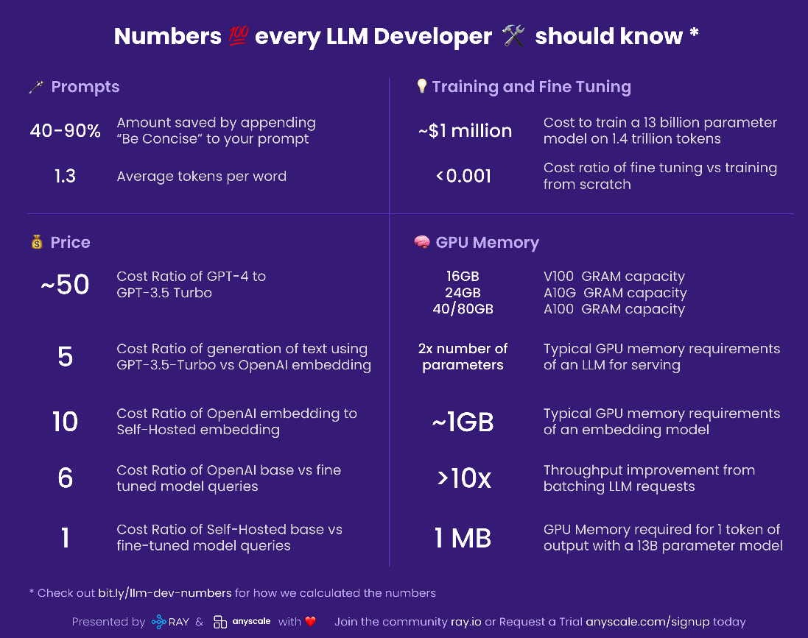

### **Trustworthy, Safe and Secure LLM**

- [NIST AI Risk Management Framework](https://www.nist.gov/itl/ai-risk-management-framework/ai-rmf-development): NIST released the first complete version of the NIST AI RMF Playbook on March 30, 2023
- [Guardrails Hub](https://hub.guardrailsai.com): Guardrails for common LLM validation use cases
- [NeMo Guardrails](https://github.com/NVIDIA/NeMo-Guardrails): Building Trustworthy, Safe and Secure LLM Conversational Systems [Apr 2023]
 
- [Political biases of LLMs](https://arxiv.org/abs/2305.08283): [[cnt](https://scholar.google.com/scholar?hl=en&as_sdt=0%2C5&q=arxiv%3A+2305.08283)]: From Pretraining Data to Language Models to Downstream Tasks: Tracking the Trails of Political Biases Leading to Unfair NLP Models. [15 May 2023] <br/>
  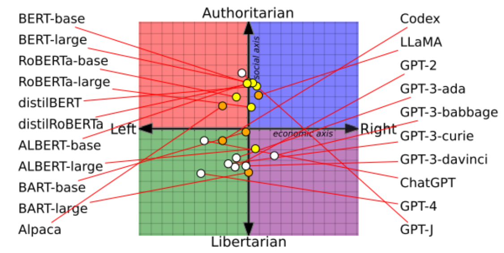
- [Trustworthy LLMs](https://arxiv.org/abs/2308.05374): [[cnt](https://scholar.google.com/scholar?hl=en&as_sdt=0%2C5&q=arxiv%3A+2308.05374)]: Comprehensive overview for assessing LLM trustworthiness; Reliability, safety, fairness, resistance to misuse, explainability and reasoning, adherence to social norms, and robustness. [10 Aug 2023]
  <!-- 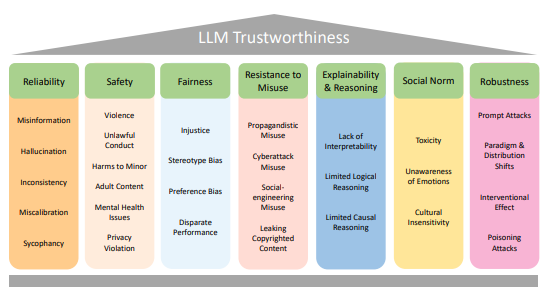 -->
- Red Teaming: The term red teaming has historically described systematic adversarial attacks for testing security vulnerabilities. LLM red teamers should be a mix of people with diverse social and professional backgrounds, demographic groups, and interdisciplinary expertise that fits the deployment context of your AI system. [ref](https://learn.microsoft.com/en-us/azure/ai-services/openai/concepts/red-teaming)
- [The Foundation Model Transparency Index](https://arxiv.org/abs/2310.12941): [[cnt](https://scholar.google.com/scholar?hl=en&as_sdt=0%2C5&q=arxiv%3A+2310.12941)]: A comprehensive assessment of the transparency of foundation model developers [ref](https://crfm.stanford.edu/fmti/) [19 Oct 2023]
- [Hallucinations](https://arxiv.org/abs/2311.05232): [[cnt](https://scholar.google.com/scholar?hl=en&as_sdt=0%2C5&q=arxiv%3A+2311.05232)]: A Survey on Hallucination in Large Language Models: Principles, Taxonomy, Challenges, and Open Questions [9 Nov 2023]
- [Hallucination Leaderboard](https://github.com/vectara/hallucination-leaderboard/): Evaluate how often an LLM introduces hallucinations when summarizing a document. [Nov 2023]
- [Hallucination Index](https://www.galileo.ai/hallucinationindex): w.r.t. RAG, Testing LLMs with short (≤5k), medium (5k–25k), and long (40k–100k) contexts to evaluate improved RAG performance　[Nov 2023]
- [FactTune](https://arxiv.org/abs/2311.08401): A procedure that enhances the factuality of LLMs without the need for human feedback. The process involves the fine-tuning of a separated LLM using methods such as DPO and RLAIF, guided by preferences generated by [FActScore](https://github.com/shmsw25/FActScore). [14 Nov 2023] `FActScore` works by breaking down a generation into a series of atomic facts and then computing the percentage of these atomic facts by a reliable knowledge source. 
- [OpenAI Weak-to-strong generalization](https://arxiv.org/abs/2312.09390):💡In the superalignment problem, humans must supervise models that are much smarter than them. The paper discusses supervising a GPT-4 or 3.5-level model using a GPT-2-level model. It finds that while strong models supervised by weak models can outperform the weak models, they still don’t perform as well as when supervised by ground truth. [git](https://github.com/openai/weak-to-strong) [14 Dec 2023]
 
- [A Comprehensive Survey of Hallucination Mitigation Techniques in Large Language Models](https://arxiv.org/abs/2401.01313): A compre
hensive survey of over thirty-two techniques developed to mitigate hallucination in LLMs [2 Jan 2024]
- [Anthropic Many-shot jailbreaking](https://www.anthropic.com/research/many-shot-jailbreaking): simple long-context attack, Bypassing safety guardrails by bombarding them with unsafe or harmful questions and answers. [3 Apr 2024]
- [The Instruction Hierarchy](https://arxiv.org/abs/2404.13208): Training LLMs to Prioritize Privileged Instructions. The OpenAI highlights the need for instruction privileges in LLMs to prevent attacks and proposes training models to conditionally follow lower-level instructions based on their alignment with higher-level instructions. [19 Apr 2024]
- [Frontier Safety Framework](https://deepmind.google/discover/blog/introducing-the-frontier-safety-framework/): Google DeepMind, Frontier Safety Framework, a set of protocols designed to identify and mitigate potential harms from future AI systems. [17 May 2024]
- [Mapping the Mind of a Large Language Model](https://cdn.sanity.io/files/4zrzovbb/website/e2ae0c997653dfd8a7cf23d06f5f06fd84ccfd58.pdf): Anthrophic, A technique called "dictionary learning" can help understand model behavior by identifying which features respond to a particular input, thus providing insight into the model's "reasoning." [ref](https://www.anthropic.com/research/mapping-mind-language-model) [21 May 2024]
- [Extracting Concepts from GPT-4](https://openai.com/index/extracting-concepts-from-gpt-4/): Sparse Autoencoders identify key features, enhancing the interpretability of language models like GPT-4. They extract 16 million interpretable features using GPT-4's outputs as input for training. [6 Jun 2024]
- [AI models collapse when trained on recursively generated data](https://www.nature.com/articles/s41586-024-07566-y): Model Collapse. We find that indiscriminate use of model-generated content in training causes irreversible defects in the resulting models, in which tails of the original content distribution disappear. [24 Jul 2024]
- [LLMs Will Always Hallucinate, and We Need to Live With This](https://arxiv.org/abs/2409.05746): LLMs cannot completely eliminate hallucinations through architectural improvements, dataset enhancements, or fact-checking mechanisms due to fundamental mathematical and logical limitations. [9 Sep 2024]
- [Large Language Models Reflect the Ideology of their Creators](https://arxiv.org/abs/2410.18417): When prompted in Chinese, all LLMs favor pro-Chinese figures; Western LLMs similarly align more with Western values, even in English prompts. [24 Oct 2024]
- [Alignment Faking](https://www.anthropic.com/research/alignment-faking): LLMs may pretend to align with training objectives during monitored interactions but revert to original behaviors when unmonitored. [18 Dec 2024] | demo: [ref](https://alignment.anthropic.com/2024/how-to-alignment-faking/) | [Alignment Science Blog](https://alignment.anthropic.com/)
- [20 AI Governance Papers](https://www.linkedin.com/posts/oliver-patel_12-papers-was-not-enough-to-do-the-field-activity-7282005401032613888-6Ck4?utm_source=li_share&utm_content=feedcontent&utm_medium=g_dt_web&utm_campaign=copy) [Jan 2025]

### **Large Language Model Is: Abilities**

- [Multitask Prompted Training Enables Zero-Shot Task Generalization](https://arxiv.org/abs/2110.08207): [[cnt](https://scholar.google.com/scholar?hl=en&as_sdt=0%2C5&q=arxiv%3A+2110.08207)]: A language model trained on various tasks using prompts can learn and generalize to new tasks in a zero-shot manner. [15 Oct 2021]
- [Emergent Abilities of Large Language Models](https://arxiv.org/abs/2206.07682): [[cnt](https://scholar.google.com/scholar?hl=en&as_sdt=0%2C5&q=arxiv%3A+2206.07682)]: Large language models can develop emergent abilities, which are not explicitly trained but appear at scale and are not present in smaller models. . These abilities can be enhanced using few-shot and augmented prompting techniques. [ref](https://www.jasonwei.net/blog/emergence) [15 Jun 2022]
- [Improving mathematical reasoning with process supervision](https://openai.com/research/improving-mathematical-reasoning-with-process-supervision) [31 May 2023]
- Math soving optimized LLM [WizardMath](https://arxiv.org/abs/2308.09583): [[cnt](https://scholar.google.com/scholar?hl=en&as_sdt=0%2C5&q=arxiv%3A+2308.09583)]: Developed by adapting Evol-Instruct and Reinforcement Learning techniques, these models excel in math-related instructions like GSM8k and MATH. [git](https://github.com/nlpxucan/WizardLM) [18 Aug 2023] / Math solving Plugin: [Wolfram alpha](https://www.wolfram.com/wolfram-plugin-chatgpt/)
 
- [Language Modeling Is Compression](https://arxiv.org/abs/2309.10668): [[cnt](https://scholar.google.com/scholar?hl=en&as_sdt=0%2C5&q=arxiv%3A+2309.10668)]: Lossless data compression, while trained primarily on text, compresses ImageNet patches to 43.4% and LibriSpeech samples to 16.4% of their raw size, beating domain-specific compressors like PNG (58.5%) or FLAC (30.3%). [19 Sep 2023]
- [LLMs Represent Space and Time](https://arxiv.org/abs/2310.02207): [[cnt](https://scholar.google.com/scholar?hl=en&as_sdt=0%2C5&q=arxiv%3A+2310.02207)]: Large language models learn world models of space and time from text-only training. [3 Oct 2023]
- [Large Language Models for Software Engineering](https://arxiv.org/abs/2310.03533): [[cnt](https://scholar.google.com/scholar?hl=en&as_sdt=0%2C5&q=arxiv%3A+2310.03533)]: Survey and Open Problems, Large Language Models (LLMs) for Software Engineering (SE) applications, such as code generation, testing, repair, and documentation. [5 Oct 2023]
- [LLMs for Chip Design](https://arxiv.org/abs/2311.00176): Domain-Adapted LLMs for Chip Design [31 Oct 2023]
- [Design2Code](https://arxiv.org/abs/2403.03163): How Far Are We From Automating Front-End Engineering? `64% of cases GPT-4V
generated webpages are considered better than the original reference webpages` [5 Mar 2024]
- [Testing theory of mind in large language models and humans](https://www.nature.com/articles/s41562-024-01882-z): Some large language models (LLMs) perform as well as, and in some cases better than, humans when presented with tasks designed to test the ability to track people’s mental states, known as “theory of mind.” [cite](https://www.technologyreview.com/2024/05/20/1092681/ai-models-can-outperform-humans-in-tests-to-identify-mental-states) [20 May 2024]
- [A Survey on Employing Large Language Models for Text-to-SQL Tasks](https://arxiv.org/abs/2407.15186): a comprehensive overview of LLMs in text-to-SQL tasks [21 Jul 2024]
- [Can LLMs Generate Novel Research Ideas?](https://arxiv.org/abs/2409.04109): A Large-Scale Human Study with 100+ NLP Researchers. We find LLM-generated ideas are judged as more novel (p < 0.05) than human expert ideas. However, the study revealed a lack of diversity in AI-generated ideas. [6 Sep 2024]

## **Large Language Model: Landscape**

### **Large Language Models (in 2023)**

1. Change in perspective is necessary because some abilities only emerge at a certain scale. Some conclusions from the past are invalidated and we need to constantly unlearn intuitions built on top of such ideas.
1. From first-principles, scaling up the Transformer amounts to efficiently doing matrix multiplications with many, many machines.
1. Further scaling (think 10000x GPT-4 scale). It entails finding the inductive bias that is the bottleneck in further scaling.

- [Twitter](https://twitter.com/hwchung27/status/1710003293223821658) / [Video](https://t.co/vumzAtUvBl) / [Slides](https://t.co/IidLe4JfrC) [6 Oct 2023]
- [LLMprices.dev](https://llmprices.dev): Compare prices for models like GPT-4, Claude Sonnet 3.5, Llama 3.1 405b and many more.
- [AI Model Review](https://aimodelreview.com/): Compare 75 AI Models on 200+ Prompts Side By Side.
- [Artificial Analysis](https://artificialanalysis.ai/):💡Independent analysis of AI models and API providers.
- [Inside language models (from GPT to Olympus)](https://lifearchitect.ai/models/)
- [LLM Pre-training and Post-training Paradigms](https://sebastianraschka.com/blog/2024/new-llm-pre-training-and-post-training.html) [17 Aug 2024] <br/>
  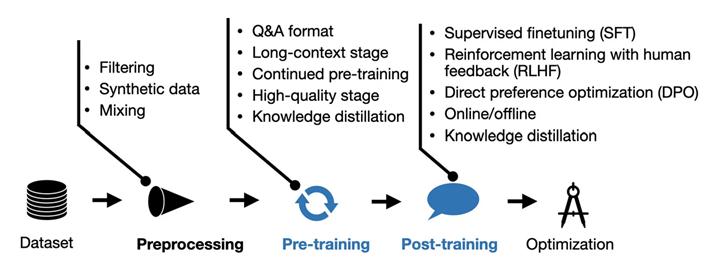

### **Evolutionary Tree of Large Language Models**

- Evolutionary Graph of LLaMA Family

  

- LLM evolutionary tree

  <!--  -->
  

- Timeline of SLMs

  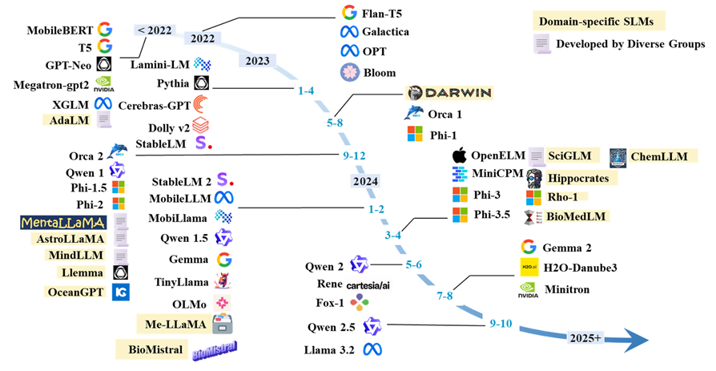

- [A Survey of Large Language Models](https://arxiv.org/abs/2303.18223): [[cnt](https://scholar.google.com/scholar?hl=en&as_sdt=0%2C5&q=arxiv%3A+2303.18223)] /[git](https://github.com/RUCAIBox/LLMSurvey) [31 Mar 2023] contd.
 

- [LLM evolutionary tree](https://arxiv.org/abs/2304.13712): [[cnt](https://scholar.google.com/scholar?hl=en&as_sdt=0%2C5&q=arxiv%3A+2304.13712)]: A curated list of practical guide resources of LLMs (LLMs Tree, Examples, Papers) [git](https://github.com/Mooler0410/LLMsPracticalGuide) [26 Apr 2023]
 

- [A Comprehensive Survey of Small Language Models in the Era of Large Language Models](https://arxiv.org/abs/2411.03350) / [git](https://github.com/FairyFali/SLMs-Survey) [4 Nov 2024] 

### **A Taxonomy of Natural Language Processing**

- An overview of different fields of study and recent developments in NLP. [doc](./files/taxonomy-nlp.pdf) / [ref](https://towardsdatascience.com/a-taxonomy-of-natural-language-processing-dfc790cb4c01) [24 Sep 2023]

  Exploring the Landscape of Natural Language Processing Research [ref](https://arxiv.org/abs/2307.10652) [20 Jul 2023]

  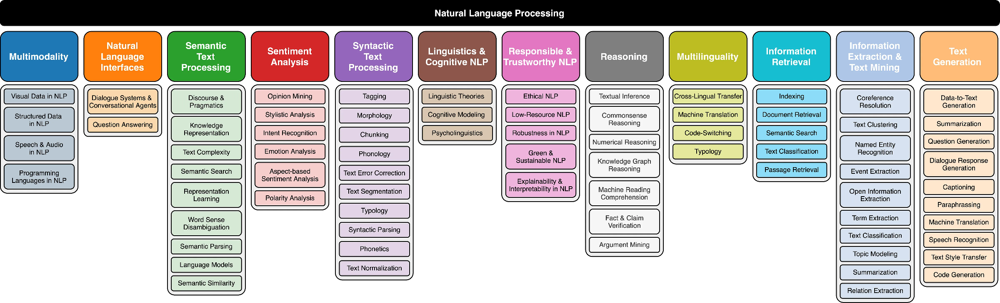

  NLP taxonomy

  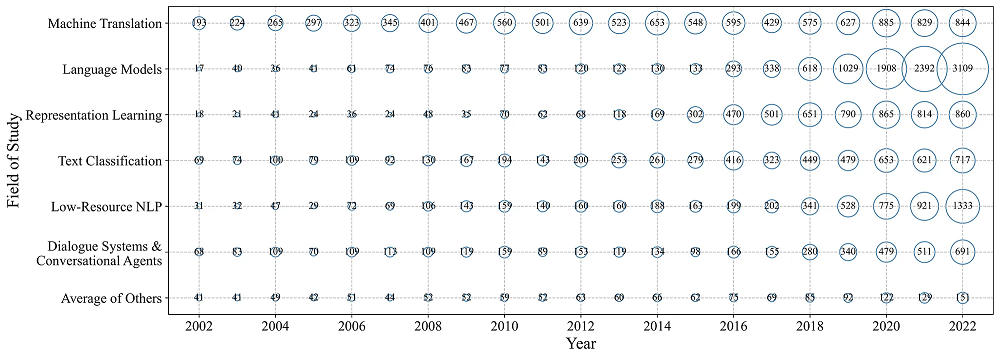

  Distribution of the number of papers by most popular fields of study from 2002 to 2022

### **Large Language Model Collection**

- [The Open Source AI Definition](https://opensource.org/ai/open-source-ai-definition) [28 Oct 2024]
- [The LLM Index](https://sapling.ai/llm/index): A list of large language models (LLMs)
- [Chatbot Arena](https://huggingface.co/spaces/lmsys/chatbot-arena-leaderboard): Benchmarking LLMs in the Wild with Elo Ratings
- [LLM Collection](https://www.promptingguide.ai/models/collection): promptingguide.ai
- [Huggingface Open LLM Learboard](https://huggingface.co/spaces/HuggingFaceH4/open_llm_leaderboard)
- [ollam](https://ollama.com/library?sort=popular): ollama-supported models
- [The mother of all spreadsheets for anyone into LLMs](https://x.com/DataChaz/status/1868708625310699710) [17 Dec 2024]
- [KoAlpaca](https://github.com/Beomi/KoAlpaca): Alpaca for korean [Mar 2023]
 
- [Pythia](https://arxiv.org/abs/2304.01373): How do large language models (LLMs) develop and evolve over the course of training and change as models scale? A suite of decoder-only autoregressive language models ranging from 70M to 12B parameters [git](https://github.com/EleutherAI/pythia) [Apr 2023]
 
- [OLMo](https://arxiv.org/abs/2402.00838):💡Truly open language model and framework to build, study, and advance LMs, along with the training data, training and evaluation code, intermediate model checkpoints, and training logs. [git](https://github.com/allenai/OLMo) [Feb 2024]
- [OLMoE](https://github.com/allenai/OLMoE): fully-open LLM leverages sparse Mixture-of-Experts [Sep 2024]
- [OLMo 2](https://allenai.org/blog/olmo2) [26 Nov 2024]
  
- [Open-Sora](https://github.com/hpcaitech/Open-Sora): Democratizing Efficient Video Production for All  [Mar 2024]
 
- [Jamba](https://www.ai21.com/blog/announcing-jamba): AI21's SSM-Transformer Model. Mamba  + Transformer + MoE [28 Mar 2024]
- [TÜLU 3](https://arxiv.org/abs/2411.15124):💡Pushing Frontiers in Open Language Model Post-Training [git](https://github.com/allenai/open-instruct) / demo:[ref](https://playground.allenai.org/) [22 Nov 2024] 
- [ModernBERT](https://arxiv.org/abs/2412.13663): ModernBERT can handle sequences up to 8,192 tokens and utilizes sparse attention mechanisms to efficiently manage longer context lengths. [18 Dec 2024]
- Meta (aka. Facebook)
  1. Most OSS LLM models have been built on the [Llama](https://github.com/facebookresearch/llama) / [ref](https://ai.meta.com/llama) / [git](https://github.com/meta-llama/llama-models)
  
  1. [Llama 2](https://huggingface.co/blog/llama2): 1) 40% more data than Llama. 2)7B, 13B, and 70B. 3) Trained on over 1 million human annotations. 4) double the context length of Llama 1: 4K 5) Grouped Query Attention, KV Cache, and Rotary Positional Embedding were introduced in Llama 2 [18 Jul 2023] [demo](https://huggingface.co/blog/llama2#demo)
  1. [Llama 3](https://llama.meta.com/llama3/): 1) 7X more data than Llama 2. 2) 8B, 70B, and 400B. 3) 8K context length [18 Apr 2024]
  1. [MEGALODON](https://github.com/XuezheMax/megalodon): Long Sequence Model. Unlimited context length. Outperforms Llama 2 model. [Apr 2024]
 
  1. [Llama 3.1](https://ai.meta.com/blog/meta-llama-3-1/): 405B, context length to 128K, add support across eight languages. first OSS model outperforms GTP-4o. [23 Jul 2024]
  1. [Llama 3.2](https://ai.meta.com/blog/llama-3-2-connect-2024-vision-edge-mobile-devices/): Multimodal. Include text-only models (1B, 3B) and text-image models (11B, 90B), with quantized versions of 1B and 3B [Sep 2024]
  1. [NotebookLlama](https://github.com/meta-llama/llama-recipes/tree/main/recipes/quickstart/NotebookLlama): An Open Source version of NotebookLM [28 Oct 2024]
  1. [Llama 3.3](https://www.llama.com/docs/model-cards-and-prompt-formats/llama3_3/): a text-only 70B instruction-tuned model. Llama 3.3 70B approaches the performance of Llama 3.1 405B. [6 Dec 2024]
- Google
  1. [Foundation Models](https://ai.google/discover/our-models/): Gemini, Veo, Gemma etc.
  1. [Gemma](http://ai.google.dev/gemma): Open weights LLM from Google DeepMind. [git](https://github.com/google-deepmind/gemma) / Pytorch [git](https://github.com/google/gemma_pytorch) [Feb 2024]
  
  1. [Gemma 2](https://www.kaggle.com/models/google/gemma-2/) 2B, 9B, 27B [ref: releases](https://ai.google.dev/gemma/docs/releases) [Jun 2024]
  1. [PaliGemma](https://arxiv.org/abs/2407.07726): a 3B VLM [10 Jul 2024]
  1. [DataGemma](https://blog.google/technology/ai/google-datagemma-ai-llm/) [12 Sep 2024] / [NotebookLM](https://blog.google/technology/ai/notebooklm-audio-overviews/): LLM-powered notebook. free to use, not open-source. [12 Jul 2023]
  1. [PaliGemma 2](https://arxiv.org/abs/2412.03555): VLMs
 at 3 different sizes (3B, 10B, 28B)  [4 Dec 2024]
  1. [Gemini](https://gemini.google.com/app): Rebranding: Bard -> Gemini [8 Feb 2024]
  1. [Gemini 1.5](https://blog.google/technology/ai/google-gemini-next-generation-model-february-2024): 1 million token context window, 1 hour of video, 11 hours of audio, codebases with over 30,000 lines of code or over 700,000 words. [Feb 2024]
  1. [Gemini 2 Flash](https://blog.google/technology/google-deepmind/google-gemini-ai-update-december-2024/): Multimodal LLM with multilingual inputs/outputs, real-time capabilities (Project Astra), complex task handling (Project Mariner), and developer tools (Jules) [11 Dec 2024]
  1. Gemini 2.0 Flash Thinking Experimental [19 Dec 2024]
  1. [gemini/cookbook](https://github.com/google-gemini/cookbook)
- Anthrophic
  1. [Claude 3](https://www.anthropic.com/news/claude-3-family), the largest version of the new LLM, outperforms rivals GPT-4 and Google’s Gemini 1.0 Ultra. Three variants: Opus, Sonnet, and Haiku. [Mar 2024]
  1. [anthropic/cookbook](https://github.com/anthropics/anthropic-cookbook)
- Microsoft
  1. phi-series: cost-effective small language models (SLMs) [ref](https://azure.microsoft.com/en-us/products/phi-3)
  1. [phi-4](https://arxiv.org/abs/2412.08905): Specializing in Complex Reasoning [ref](https://techcommunity.microsoft.com/blog/aiplatformblog/introducing-phi-4-microsoft%E2%80%99s-newest-small-language-model-specializing-in-comple/4357090) [12 Dec 2024]
  1. phi-3.5-MoE-instruct: [ref](https://huggingface.co/microsoft/Phi-3.5-MoE-instruct) [Aug 2024]
  1. [phi-3](https://arxiv.org/abs/2404.14219): Phi-3-mini, with 3.8 billion parameters, supports 4K and 128K context, instruction tuning, and hardware optimization. [22 Apr 2024] [ref](https://azure.microsoft.com/en-us/blog/introducing-phi-3-redefining-whats-possible-with-slms/)
  1. phi-3-vision (multimodal), phi-3-small, phi-3 (7b), phi-sillica (Copilot+PC designed for NPUs)
  1. phi-2: open source, and 50% better at mathematical reasoning. [git](https://huggingface.co/microsoft/phi-2) [Dec 2023]
  1. [phi-1.5](https://arxiv.org/abs/2309.05463): [[cnt](https://scholar.google.com/scholar?hl=en&as_sdt=0%2C5&q=arxiv%3A+2309.05463)]: Textbooks Are All You Need II. Phi 1.5 is trained solely on synthetic data. Despite having a mere 1 billion parameters compared to Llama 7B's much larger model size, Phi 1.5 often performs better in benchmark tests. [11 Sep 2023]
  1. [phi-1](https://arxiv.org/abs/2306.11644): [[cnt](https://scholar.google.com/scholar?hl=en&as_sdt=0%2C5&q=arxiv%3A+2306.11644)]: Despite being small in size, phi-1 attained 50.6% on HumanEval and 55.5% on MBPP. Textbooks Are All You Need. [ref](https://analyticsindiamag.com/microsoft-releases-1-3-bn-parameter-language-model-outperforms-llama/) [20 Jun 2023]
- NVIDIA
  1. [Nemotron-4 340B](https://research.nvidia.com/publication/2024-06_nemotron-4-340b): Synthetic Data Generation for Training Large Language Models [14 Jun 2024]
- Amazon
  1. [Amazon Nova Foundation Models](https://aws.amazon.com/de/ai/generative-ai/nova/): Text only - Micro, Multimodal - Light, Pro [3 Dec 2024]
- Huggingface
  1. [Open R1](https://github.com/huggingface/open-r1): A fully open reproduction of DeepSeek-R1. [25 Jan 2025]
- Mistral
  - Founded in April 2023. French tech.
  1. open-weights models (Mistral 7B, Mixtral 8x7B, Mixtral 8x22B, NeMo) and optimized commercial models (Mistral Small, Mistral Medium, Mistral Large) [ref](https://docs.mistral.ai/getting-started/models/)
  1. [NeMo](https://mistral.ai/news/mistral-nemo/): 12B model with 128k context length that outperforms LLama 3 8B [18 Jul 2024]
- Groq
  - Founded in 2016. low-latency AI inference H/W. American tech.
  1. [Llama-3-Groq-Tool-Use](https://wow.groq.com/introducing-llama-3-groq-tool-use-models/): a model optimized for function calling [Jul 2024]
- Alibaba
  1. [Qwen series](https://github.com/QwenLM) > [Qwen2](https://github.com/QwenLM/Qwen2): 29 languages. 5 sizes, including Qwen2-0.5B, Qwen2-1.5B, Qwen2-7B, Qwen2-57B-A14B, and Qwen2-72B. [Feb 2024]
  1. [Qwen2.5-VL](https://github.com/QwenLM/Qwen2.5-VL): Vision-language models incl. Video Understanding [Auf 2024]
 
- Cohere
  - Founded in 2019. Canadian multinational tech.
  1. [Command R+](https://huggingface.co/collections/CohereForAI/c4ai-command-r-plus-660ec4c34f7a69c50ce7f7b9): The performant model for RAG capabilities, multilingual support, and tool use. [Aug 2024]
- Deepseek
  - Founded in 2023, is a Chinese company dedicated to AGI.
  1. [DeepSeek-V3](https://github.com/deepseek-ai/DeepSeek-V3): Mixture-of-Experts (MoE) with 671B. [26 Dec 2024]
  1. [DeepSeek-R1](https://github.com/deepseek-ai/DeepSeek-R1):💡an open source reasoning model. Group Relative Policy Optimization (GRPO). Base -> RL -> SFT -> RL -> SFT -> RL [20 Jan 2025]
  1. [Janus](https://github.com/deepseek-ai/Janus): Multimodal understanding and visual generation. [28 Jan 2025]
  1. A list of models: [git](https://github.com/deepseek-ai)
- Tencent
  - Founded in 1998, Tencent is a Chinese company dedicated to various technology sectors, including social media, gaming, and AI development.
  - [Hunyuan-Large](https://arxiv.org/pdf/2411.02265): An open-source MoE model with open weights. [4 Nov 2024] [git](https://github.com/Tencent/Tencent-Hunyuan-Large) 
- Qualcomm
  1. [Qualcomm’s on-device AI models](https://huggingface.co/qualcomm): Bring generative AI to mobile devices [Feb 2024]
- xAI
  - xAI is an American AI company founded by Elon Musk in March 2023
  1. [Grok](https://x.ai/blog/grok-os): 314B parameter Mixture-of-Experts (MoE) model. Released under the Apache 2.0 license. Not includeded training code. Developed by JAX [git](https://github.com/xai-org/grok) [17 Mar 2024]
 
  1. [Grok-2 and Grok-2 mini](https://x.ai/blog/grok-2) [13 Aug 2024]
- Databricks
  1. [DBRX](https://www.databricks.com/blog/introducing-dbrx-new-state-art-open-llm): MoE, open, general-purpose LLM created by Databricks. [git](https://github.com/databricks/dbrx) [27 Mar 2024]
 
- Apple
  1. [OpenELM](https://machinelearning.apple.com/research/openelm): Apple released a Transformer-based language model. Four sizes of the model: 270M, 450M, 1.1B, and 3B parameters. [April 2024]
  1. [Apple Intelligence Foundation Language Models](https://machinelearning.apple.com/research/apple-intelligence-foundation-language-models): 1. A 3B on-device model used for language tasks like summarization and Writing Tools. 2. A large Server model used for language tasks too complex to do on-device. [10 Jun 2024]
- IBM
  1. [Granite Guardian](https://github.com/ibm-granite/granite-guardian): a collection of models designed to detect risks in prompts and responses [10 Dec 2024]
- GPT for Domain Specific [x-ref](#gpt-for-domain-specific)
- MLLM (multimodal large language model) [x-ref](#mllm-multimodal-large-language-model)
- Large Language Models (in 2023) [x-ref](#large-language-models-in-2023)
- Llama variants emerged in 2023</summary>
  - [Falcon LLM](https://falconllm.tii.ae/) Apache 2.0 license [Mar 2023]
  - [Alpaca](https://crfm.stanford.edu/2023/03/13/alpaca.html): Fine-tuned from the LLaMA 7B model [Mar 2023]
  - [vicuna](https://vicuna.lmsys.org/): 90% ChatGPT Quality [Mar 2023]
  - [dolly](https://www.databricks.com/blog/2023/03/24/hello-dolly-democratizing-magic-chatgpt-open-models.html): Databricks [Mar 2023]
  - [Cerebras-GPT](https://www.cerebras.net/blog/cerebras-gpt-a-family-of-open-compute-efficient-large-language-models/): 7 GPT models ranging from 111m to 13b parameters. [Mar 2023]
  - [Koala](https://bair.berkeley.edu/blog/2023/04/03/koala/): Focus on dialogue data gathered from the web.  [Apr 2023]
  - [StableVicuna](https://stability.ai/blog/stablevicuna-open-source-rlhf-chatbot) First Open Source RLHF LLM Chatbot [Apr 2023]
  - Upstage's 70B Language Model Outperforms GPT-3.5: [ref](https://en.upstage.ai/newsroom/upstage-huggingface-llm-no1) [1 Aug 2023]

</details>

### **LLM for Domain Specific**

- [AlphaFold3](https://github.com/Ligo-Biosciences/AlphaFold3): Open source implementation of AlphaFold3 [Nov 2023] / [OpenFold](https://github.com/aqlaboratory/openfold): PyTorch reproduction of AlphaFold 2 [Sep 2021]  
- [BioGPT](https://arxiv.org/abs/2210.10341): [[cnt](https://scholar.google.com/scholar?hl=en&as_sdt=0%2C5&q=arxiv%3A+2210.10341)]: Generative Pre-trained Transformer for Biomedical Text Generation and Mining [git](https://github.com/microsoft/BioGPT) [19 Oct 2022] 
- [Galactica](https://arxiv.org/abs/2211.09085): A Large Language Model for Science [16 Nov 2022]
- [TimeGPT](https://nixtla.github.io/nixtla/): The First Foundation Model for Time Series Forecasting [git](https://github.com/Nixtla/neuralforecast) [Mar 2023]
 
- [BloombergGPT](https://arxiv.org/abs/2303.17564): A Large Language Model for Finance [30 Mar 2023]
- [Huggingface StarCoder: A State-of-the-Art LLM for Code](https://huggingface.co/blog/starcoder): [git](https://huggingface.co/bigcode/starcoder) [May 2023]
- [FrugalGPT](https://arxiv.org/abs/2305.05176): LLM with budget constraints, requests are cascaded from low-cost to high-cost LLMs. [git](https://github.com/stanford-futuredata/FrugalGPT) [9 May 2023] 
- [Code Llama](https://arxiv.org/abs/2308.12950): Built on top of Llama 2, free for research and commercial use. [ref](https://ai.meta.com/blog/code-llama-large-language-model-coding/) / [git](https://github.com/facebookresearch/codellama) [24 Aug 2023] 
- [MechGPT](https://arxiv.org/abs/2310.10445): Language Modeling Strategies for Mechanics and Materials [git](https://github.com/lamm-mit/MeLM) [16 Oct 2023] 
- [MeshGPT](https://nihalsid.github.io/mesh-gpt/): Generating Triangle Meshes with Decoder-Only Transformers [27 Nov 2023]
- [EarthGPT](https://arxiv.org/abs/2401.16822): A Universal Multi-modal Large Language Model for Multi-sensor Image Comprehension in Remote Sensing Domain [30 Jan 2024]
- [SaulLM-7B](https://arxiv.org/abs/2403.03883): A pioneering Large Language Model for Law [6 Mar 2024]
- [Devin AI](https://preview.devin.ai/): Devin is an AI software engineer developed by Cognition AI [12 Mar 2024]
- [DeepSeek-Coder-V2](https://github.com/deepseek-ai/DeepSeek-Coder-V2): Open-source Mixture-of-Experts (MoE) code language model [17 Jun 2024]
 
- [Qwen2-Math](https://github.com/QwenLM/Qwen2-Math): math-specific LLM / [Qwen2-Audio](https://github.com/QwenLM/Qwen2-Audio): large-scale audio-language model [Aug 2024] / [Qwen 2.5-Coder](https://github.com/QwenLM/Qwen2.5-Coder) [18 Sep 2024]
   
- [Chai-1](https://github.com/chaidiscovery/chai-lab): a multi-modal foundation model for molecular structure prediction [Sep 2024]
 
- [Prithvi WxC](https://arxiv.org/abs/2409.13598): In collaboration with NASA, IBM is releasing an open-source foundation model for Weather and Climate [ref](https://research.ibm.com/blog/foundation-model-weather-climate) [20 Sep 2024]
- [AlphaChip](https://deepmind.google/discover/blog/how-alphachip-transformed-computer-chip-design/): Reinforcement learning-based model for designing physical chip layouts. [26 Sep 2024]
- [OpenCoder](https://github.com/OpenCoder-llm/OpenCoder-llm): 1.5B and 8B base and open-source Code LLM, supporting both English and Chinese. [Oct 2024] 
- [Video LLMs for Temporal Reasoning in Long Videos](https://arxiv.org/abs/2412.02930): TemporalVLM, a video LLM excelling in temporal reasoning and fine-grained understanding of long videos, using time-aware features and validated on datasets like TimeIT and IndustryASM for superior performance. [4 Dec 2024]

### **MLLM (multimodal large language model)**

- [Understanding Multimodal LLMs](https://magazine.sebastianraschka.com/p/understanding-multimodal-llms):💡Two main approaches to building multimodal LLMs: 1. Unified Embedding Decoder Architecture approach; 2. Cross-modality Attention Architecture approach. [3 Nov 2024]

  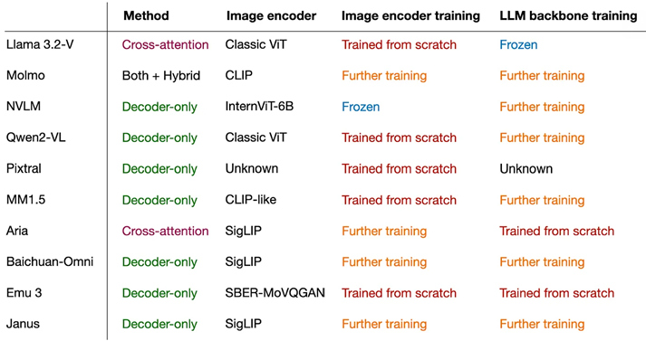

- [Multimodal Foundation Models: From Specialists to General-Purpose Assistants](https://arxiv.org/abs/2309.10020): [[cnt](https://scholar.google.com/scholar?hl=en&as_sdt=0%2C5&q=arxiv%3A+2309.10020)]: A comprehensive survey of the taxonomy and evolution of multimodal foundation models that demonstrate vision and vision-language capabilities. Specific-Purpose 1. Visual understanding tasks 2. Visual generation tasks General-Purpose 3. General-purpose interface. [18 Sep 2023]
- [Awesome Multimodal Large Language Models](https://github.com/BradyFU/Awesome-Multimodal-Large-Language-Models): Latest Papers and Datasets on Multimodal Large Language Models, and Their Evaluation. [Jun 2023]
 
- [CLIP](https://arxiv.org/abs/2103.00020): [[cnt](https://scholar.google.com/scholar?hl=en&as_sdt=0%2C5&q=arxiv%3A+2103.00020)]: CLIP (Contrastive Language-Image Pretraining), Trained on a large number of internet text-image pairs and can be applied to a wide range of tasks with zero-shot learning. [git](https://github.com/openai/CLIP) [26 Feb 2021]
 
- [BLIP-2](https://arxiv.org/abs/2301.12597) [30 Jan 2023]: [[cnt](https://scholar.google.com/scholar?hl=en&as_sdt=0%2C5&q=arxiv%3A+2301.12597)]: Salesforce Research, Querying Transformer (Q-Former) / [git](https://github.com/salesforce/LAVIS/blob/main/lavis/models/blip2_models/blip2_qformer.py) / [ref](https://huggingface.co/blog/blip-2) / [📺](https://www.youtube.com/watch?v=k0DAtZCCl1w) / [BLIP](https://arxiv.org/abs/2201.12086): [[cnt](https://scholar.google.com/scholar?hl=en&as_sdt=0%2C5&q=arxiv%3A+2201.12086)]: [git](https://github.com/salesforce/BLIP) [28 Jan 2022]
 
  - `Q-Former (Querying Transformer)`: A transformer model that consists of two submodules that share the same self-attention layers: an image transformer that interacts with a frozen image encoder for visual feature extraction, and a text transformer that can function as both a text encoder and a text decoder.
  - Q-Former is a lightweight transformer which employs a set of learnable query vectors to extract visual features from the frozen image encoder. It acts as an information bottleneck between the frozen image encoder and the frozen LLM.
  <!--
  https://zhuanlan.zhihu.com/p/635603332
  https://zhuanlan.zhihu.com/p/613247637
  https://zhuanlan.zhihu.com/p/604318703
  https://zhuanlan.zhihu.com/p/104393915
  -->
- [TaskMatrix, aka VisualChatGPT](https://arxiv.org/abs/2303.04671): [[cnt](https://scholar.google.com/scholar?hl=en&as_sdt=0%2C5&q=arxiv%3A+2303.04671)]: Microsoft TaskMatrix [git](https://github.com/microsoft/TaskMatrix); GroundingDINO + [SAM](https://arxiv.org/abs/2304.02643) / [git](https://github.com/facebookresearch/segment-anything) [8 Mar 2023]
  
- [GroundingDINO](https://arxiv.org/abs/2303.05499): [[cnt](https://scholar.google.com/scholar?hl=en&as_sdt=0%2C5&q=arxiv%3A+2303.05499)]: DINO with Grounded Pre-Training for Open-Set Object Detection [git](https://github.com/IDEA-Research/GroundingDINO) [9 Mar 2023]
 
- [LLaVa](https://arxiv.org/abs/2304.08485): [[cnt](https://scholar.google.com/scholar?hl=en&as_sdt=0%2C5&q=arxiv%3A+2304.08485)]: Large Language-and-Vision Assistant [git](https://llava-vl.github.io/) [17 Apr 2023]
  - Simple linear layer to connect image features into the word embedding space. A trainable projection matrix W is applied to the visual features Zv, transforming them into visual embedding tokens Hv. These tokens are then concatenated with the language embedding sequence Hq to form a single sequence. Note that Hv and Hq are not multiplied or added, but concatenated, both are same dimensionality.
  - [LLaVA-1.5](https://arxiv.org/abs/2310.03744): [[cnt](https://scholar.google.com/scholar?hl=en&as_sdt=0%2C5&q=arxiv%3A+2310.03744)]: is out! [git](https://github.com/haotian-liu/LLaVA): Changing from a linear projection to an MLP cross-modal. [5 Oct 2023]
 
- [MiniGPT-4 & MiniGPT-v2](https://arxiv.org/abs/2304.10592): [[cnt](https://scholar.google.com/scholar?hl=en&as_sdt=0%2C5&q=arxiv%3A+2304.10592)]: Enhancing Vision-language Understanding with Advanced Large Language Models [git](https://minigpt-4.github.io/) [20 Apr 2023]
- [openai/shap-e](https://arxiv.org/abs/2305.02463) Generate 3D objects conditioned on text or images [3 May 2023] [git](https://github.com/openai/shap-e)
 
- [Drag Your GAN](https://arxiv.org/abs/2305.10973): [[cnt](https://scholar.google.com/scholar?hl=en&as_sdt=0%2C5&q=arxiv%3A+2305.10973)]: Interactive Point-based Manipulation on the Generative Image Manifold [git](https://github.com/Zeqiang-Lai/DragGAN) [18 May 2023]
 
- [Video-ChatGPT](https://arxiv.org/abs/2306.05424): [[cnt](https://scholar.google.com/scholar?hl=en&as_sdt=0%2C5&q=arxiv%3A+2306.05424)]: a video conversation model capable of generating meaningful conversation about videos. / [git](https://github.com/mbzuai-oryx/Video-ChatGPT) [8 Jun 2023]
 
- [moondream](https://github.com/vikhyat/moondream): an OSS tiny vision language model. Built using SigLIP, Phi-1.5, LLaVA dataset. [Dec 2023]
 
- [MiniCPM-V](https://github.com/OpenBMB/MiniCPM-V): MiniCPM-Llama3-V 2.5: A GPT-4V Level Multimodal LLM on Your Phone [Jan 2024]
 
- [mini-omni2](https://github.com/gpt-omni/mini-omni2): [ref](arxiv.org/abs/2410.11190): Towards Open-source GPT-4o with Vision, Speech and Duplex Capabilities. [15 Oct 2024]
 
- [LLaVA-CoT](https://arxiv.org/abs/2411.10440): (FKA. LLaVA-o1) Let Vision Language Models Reason Step-by-Step. [git](https://github.com/PKU-YuanGroup/LLaVA-CoT) [15 Nov 2024]
- [MiniCPM-o](https://github.com/OpenBMB/MiniCPM-o): A GPT-4o Level MLLM for Vision, Speech and Multimodal Live Streaming on Your Phone [15 Jan 2025]
- Vision capability to a LLM [ref](https://cloud.google.com/blog/products/ai-machine-learning/multimodal-generative-ai-search/) [22 Aug 2023]
  - The model has three sub-models:
    1. A model to obtain image embeddings
    1. A text model to obtain text embeddings
    1. A model to learn the relationships between them
  - This is analogous to adding vision capability to a LLM. <br/>
- Meta (aka. Facebook)
  1. [facebookresearch/ImageBind](https://arxiv.org/abs/2305.05665): [[cnt](https://scholar.google.com/scholar?hl=en&as_sdt=0%2C5&q=arxiv%3A+2305.05665)]: ImageBind One Embedding Space to Bind Them All [git](https://github.com/facebookresearch/ImageBind) [9 May 2023]
 
  1. [facebookresearch/segment-anything(SAM)](https://arxiv.org/abs/2304.02643): [[cnt](https://scholar.google.com/scholar?hl=en&as_sdt=0%2C5&q=arxiv%3A+2304.02643)]: The repository provides code for running inference with the SegmentAnything Model (SAM), links for downloading the trained model checkpoints, and example notebooks that show how to use the model. [git](https://github.com/facebookresearch/segment-anything) [5 Apr 2023]
 
  1. [facebookresearch/SeamlessM4T](https://arxiv.org/abs/2308.11596): [[cnt](https://scholar.google.com/scholar?hl=en&as_sdt=0%2C5&q=arxiv%3A+2308.11596)]: SeamlessM4T is the first all-in-one multilingual multimodal AI translation and transcription model. This single model can perform speech-to-text, speech-to-speech, text-to-speech, and text-to-text translations for up to 100 languages depending on the task. [ref](https://about.fb.com/news/2023/08/seamlessm4t-ai-translation-model/) [22 Aug 2023]
  1. [Chameleon](https://arxiv.org/abs/2405.09818): Early-fusion token-based mixed-modal models capable of understanding and generating images and text in any arbitrary sequence. The unified approach uses fully token-based representations for both image and textual modalities. [16 May 2024]
  1. [Models and libraries](https://ai.meta.com/resources/models-and-libraries/)
- Microsoft
  1. Language Is Not All You Need: Aligning Perception with Language Models [Kosmos-1](https://arxiv.org/abs/2302.14045): [[cnt](https://scholar.google.com/scholar?hl=en&as_sdt=0%2C5&q=arxiv%3A+2302.14045)] [27 Feb 2023]
  1. [Kosmos-2](https://arxiv.org/abs/2306.14824): [[cnt](https://scholar.google.com/scholar?hl=en&as_sdt=0%2C5&q=arxiv%3A+2306.14824)]: Grounding Multimodal Large Language Models to the World [26 Jun 2023]
  1. [Kosmos-2.5](https://arxiv.org/abs/2309.11419): [[cnt](https://scholar.google.com/scholar?hl=en&as_sdt=0%2C5&q=arxiv%3A+2309.11419)]: A Multimodal Literate Model [20 Sep 2023]
  1. [BEiT-3](https://arxiv.org/abs/2208.10442): [[cnt](https://scholar.google.com/scholar?hl=en&as_sdt=0%2C5&q=arxiv%3A+2208.10442)]: Image as a Foreign Language: BEiT Pretraining for Vision and Vision-Language Tasks [22 Aug 2022]
  1. [TaskMatrix.AI](https://arxiv.org/abs/2303.16434): [[cnt](https://scholar.google.com/scholar?hl=en&as_sdt=0%2C5&q=arxiv%3A+2303.16434)]: TaskMatrix connects ChatGPT and a series of Visual Foundation Models to enable sending and receiving images during chatting. [29 Mar 2023]
  1. [Florence-2](https://arxiv.org/abs/2311.06242): Advancing a unified representation for various vision tasks, demonstrating specialized models like `CLIP` for classification, `GroundingDINO` for object detection, and `SAM` for segmentation. [ref](https://huggingface.co/microsoft/Florence-2-large) [10 Nov 2023]
  1. [LLM2CLIP](https://github.com/microsoft/LLM2CLIP): Directly integrating LLMs into CLIP causes catastrophic performance drops. We propose LLM2CLIP, a caption contrastive fine-tuning method that leverages LLMs to enhance CLIP. [7 Nov 2024]
  1. [Florence-VL](https://arxiv.org/abs/2412.04424): A multimodal large language model (MLLM) that integrates Florence-2. [5 Dec 2024]
- Apple
  1. [4M-21](https://arxiv.org/abs/2406.09406): An Any-to-Any Vision Model for Tens of Tasks and Modalities. [13 Jun 2024]
- Hugging Face
  1. [SmolVLM](https://huggingface.co/blog/smolvlm): 2B small vision language models. [ref](https://huggingface.co/HuggingFaceTB/SmolVLM-Instruct) / finetuning:[git](https://github.com/huggingface/smollm/blob/main/finetuning/Smol_VLM_FT.ipynb) [24 Nov 2024]
- Benchmarking Multimodal LLMs.
  - LLaVA-1.5 achieves SoTA on a broad range of 11 tasks incl. SEED-Bench.
  - [SEED-Bench](https://arxiv.org/abs/2307.16125): [[cnt](https://scholar.google.com/scholar?hl=en&as_sdt=0%2C5&q=arxiv%3A+2307.16125)]: Benchmarking Multimodal LLMs [git](https://github.com/AILab-CVC/SEED-Bench) [30 Jul 2023]
 
- [Molmo and PixMo](https://arxiv.org/abs/2409.17146): Open Weights and Open Data for State-of-the-Art Multimodal Models [ref](https://molmo.allenai.org/) [25 Sep 2024]

    <!-- 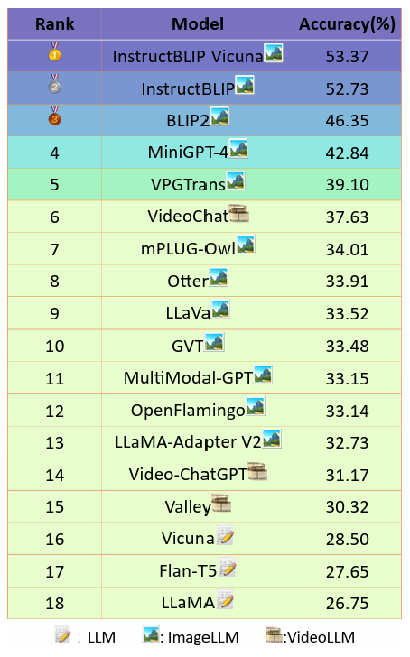 -->

- Optimizing Memory Usage for Training LLMs and Vision Transformers: When applying 10 techniques to a vision transformer, we reduced the memory consumption 20x on a single GPU. [ref](https://lightning.ai/pages/community/tutorial/pytorch-memory-vit-llm/) / [git](https://github.com/rasbt/pytorch-memory-optim) [2 Jul 2023]
 

### **Generative AI Landscape**

- [The Generative AI Revolution: Exploring the Current Landscape](https://pub.towardsai.net/the-generative-ai-revolution-exploring-the-current-landscape-4b89998fcc5f) : [doc](./files/gen-ai-landscape.pdf) [28 Jun 2023]
- [Diffusion Models vs. GANs vs. VAEs: Comparison of Deep Generative Models](https://pub.towardsai.net/diffusion-models-vs-gans-vs-vaes-comparison-of-deep-generative-models-67ab93e0d9ae) [12 May 2023]

| Model | Description | Strengths | Weaknesses |
| --- | --- | --- | --- |
| GANs | Two neural networks, a generator and a discriminator, work together. The generator creates synthetic samples, and the discriminator distinguishes between real and generated samples. | Unsupervised learning, able to mimic data distributions without labeled data, and are versatile in applications like image synthesis, super-resolution, and style transfer | Known for potentially unstable training and less diversity in generation. |
| VAEs | Consists of an encoder and a decoder. The encoder maps input data into a low-dimensional representation, and the decoder reconstructs the original input data from this representation. e.g, `DALLE` | Efficient at learning latent representations and can be used for tasks like data denoising and anomaly detection, in addition to data generation. | Dependent on an approximate loss function. |
| Diffusion Models | Consists of forward and reverse diffusion processes. Forward diffusion adds noise to input data until white noise is obtained. The reverse diffusion process removes the noise to recover the original data.  e.g, `Stable Diffusion` | Capable of producing high-quality, step-by-step samples. | Multi-step (often 1000) generation process. |


## **Survey and Reference**

### **Survey on Large Language Models**

<!-- - Picked out the list by [cited by count] and used [survey] as a search keyword. The papers on a specific topic are included even if few [cited by count]. -->
- A Survey of LLMs
  - [Large Language Models: A Survey](https://arxiv.org/abs/2402.06196): 🏆Well organized visuals and contents [9 Feb 2024]
  - [A Survey of Transformers](https://arxiv.org/abs/2106.04554):[[cnt](https://scholar.google.com/scholar?hl=en&as_sdt=0%2C5&q=arxiv%3A+2106.04554)] [8 Jun 2021]
  - [A Survey of Large Language Models](https://arxiv.org/abs/2303.18223):[[cnt](https://scholar.google.com/scholar?hl=en&as_sdt=0%2C5&q=arxiv%3A+2303.18223)] [v1: 31 Mar 2023 - v15: 13 Oct 2024]
  - [A Primer on Large Language Models and their Limitations](https://arxiv.org/abs/2412.04503): A primer on LLMs, their strengths, limits, applications, and research, for academia and industry use. [3 Dec 2024]
- Google AI Research Recap
  - [Gemini](https://blog.google/technology/ai/google-gemini-ai) [06 Dec 2023] Three different sizes: Ultra, Pro, Nano. With a score of 90.0%, Gemini Ultra is the first model to outperform human experts on MMLU [ref](https://storage.googleapis.com/deepmind-media/gemini/gemini_1_report.pdf)
  - [Google AI Research Recap (2022 Edition)](https://ai.googleblog.com/2023/01/google-research-2022-beyond-language.html)
  - [Themes from 2021 and Beyond](https://ai.googleblog.com/2022/01/google-research-themes-from-2021-and.html)
  - [Looking Back at 2020, and Forward to 2021](https://ai.googleblog.com/2021/01/google-research-looking-back-at-2020.html)
- Microsoft Research Recap
  - [Research at Microsoft 2023](https://www.microsoft.com/en-us/research/blog/research-at-microsoft-2023-a-year-of-groundbreaking-ai-advances-and-discoveries/): A year of groundbreaking AI advances and discoveries
- [LLM Research Papers: The 2024 List](https://sebastianraschka.com/blog/2024/llm-research-papers-the-2024-list.html) [29 Dec 2024]
- [Noteworthy LLM Research Papers of 2024](https://sebastianraschka.com/blog/2025/llm-research-2024.html) [23 Jan 2025]

---

- [Survey of Hallucination in Natural Language Generation](https://arxiv.org/abs/2202.03629):[[cnt](https://scholar.google.com/scholar?hl=en&as_sdt=0%2C5&q=arxiv%3A+2202.03629)] [8 Feb 2022]
- [A Survey on In-context Learning](https://arxiv.org/abs/2301.00234):[[cnt](https://scholar.google.com/scholar?hl=en&as_sdt=0%2C5&q=arxiv%3A+2301.00234)] [31 Dec 2022]
- [A Survey on Transformers in Reinforcement Learning](https://arxiv.org/abs/2301.03044):[[cnt](https://scholar.google.com/scholar?hl=en&as_sdt=0%2C5&q=arxiv%3A+2301.03044)] [8 Jan 2023]
- [Multimodal Deep Learning](https://arxiv.org/abs/2301.04856):[[cnt](https://scholar.google.com/scholar?hl=en&as_sdt=0%2C5&q=arxiv%3A+2301.04856)] [12 Jan 2023]
- [A Survey on Efficient Training of Transformers](https://arxiv.org/abs/2302.01107):[[cnt](https://scholar.google.com/scholar?hl=en&as_sdt=0%2C5&q=arxiv%3A+2302.01107)] [2 Feb 2023]
- [A Comprehensive Survey of AI-Generated Content (AIGC)](https://arxiv.org/abs/2303.04226): A History of Generative AI from GAN to ChatGPT:[[cnt](https://scholar.google.com/scholar?hl=en&as_sdt=0%2C5&q=arxiv%3A+2303.04226)] [7 Mar 2023]
- [An Overview on Language Models: Recent Developments and Outlook](https://arxiv.org/abs/2303.05759):[[cnt](https://scholar.google.com/scholar?hl=en&as_sdt=0%2C5&q=arxiv%3A+2303.05759)] [10 Mar 2023]
- [Scaling Down to Scale Up: A Guide to Parameter-Efficient Fine-Tuning](https://arxiv.org/abs/2303.15647):[[cnt](https://scholar.google.com/scholar?hl=en&as_sdt=0%2C5&q=arxiv%3A+2303.15647)] [28 Mar 2023]
- [Summary of ChatGPT/GPT-4 Research and Perspective Towards the Future of Large Language Models](https://arxiv.org/abs/2304.01852):[[cnt](https://scholar.google.com/scholar?hl=en&as_sdt=0%2C5&q=arxiv%3A+2304.01852)] [4 Apr 2023]
- [A Cookbook of Self-Supervised Learning](https://arxiv.org/abs/2304.12210):[[cnt](https://scholar.google.com/scholar?hl=en&as_sdt=0%2C5&q=arxiv%3A+2304.12210)] [24 Apr 2023]
- [Harnessing the Power of LLMs in Practice: A Survey on ChatGPT and Beyond](https://arxiv.org/abs/2304.13712):[[cnt](https://scholar.google.com/scholar?hl=en&as_sdt=0%2C5&q=arxiv%3A+2304.13712)] [26 Apr 2023]
- [Challenges & Application of LLMs](https://arxiv.org/abs/2306.07303):[[cnt](https://scholar.google.com/scholar?hl=en&as_sdt=0%2C5&q=arxiv%3A+2306.07303)] [11 Jun 2023]
- [A Survey on Multimodal Large Language Models](https://arxiv.org/abs/2306.13549):[[cnt](https://scholar.google.com/scholar?hl=en&as_sdt=0%2C5&q=arxiv%3A+2306.13549)] [23 Jun 2023]
- [A Survey on Evaluation of Large Language Models](https://arxiv.org/abs/2307.03109):[[cnt](https://scholar.google.com/scholar?hl=en&as_sdt=0%2C5&q=arxiv%3A+2307.03109)] [6 Jul 2023]
- [A Survey of Techniques for Optimizing Transformer Inference](https://arxiv.org/abs/2307.07982):[[cnt](https://scholar.google.com/scholar?hl=en&as_sdt=0%2C5&q=arxiv%3A+2307.07982)] [16 Jul 2023]
- [Efficient Guided Generation for Large Language Models](https://arxiv.org/abs/2307.09702):[[cnt](https://scholar.google.com/scholar?hl=en&as_sdt=0%2C5&q=arxiv%3A+2307.09702)] [19 Jul 2023]
- [Survey of Aligned LLMs](https://arxiv.org/abs/2307.12966):[[cnt](https://scholar.google.com/scholar?hl=en&as_sdt=0%2C5&q=arxiv%3A+2307.12966)] [24 Jul 2023]
- [Foundation Models in Vision](https://arxiv.org/abs/2307.13721):[[cnt](https://scholar.google.com/scholar?hl=en&as_sdt=0%2C5&q=arxiv%3A+2307.13721)] [25 Jul 2023]
- [Open Problems and Fundamental Limitations of Reinforcement Learning from Human Feedback](https://arxiv.org/abs/2307.15217):[[cnt](https://scholar.google.com/scholar?hl=en&as_sdt=0%2C5&q=arxiv%3A+2307.15217)] [27 Jul 2023]
- [Universal and Transferable Adversarial Attacks on Aligned Language Models](https://arxiv.org/abs/2307.15043):[[cnt](https://scholar.google.com/scholar?hl=en&as_sdt=0%2C5&q=arxiv%3A+2307.15043)] [27 Jul 2023]
- [SEED-Bench: Benchmarking Multimodal LLMs with Generative Comprehension](https://arxiv.org/abs/2307.16125): [[cnt](https://scholar.google.com/scholar?hl=en&as_sdt=0%2C5&q=arxiv%3A+2307.16125)] [30 Jul 2023]
- [Trustworthy LLMs](https://arxiv.org/abs/2308.05374):[[cnt](https://scholar.google.com/scholar?hl=en&as_sdt=0%2C5&q=arxiv%3A+2308.05374)] [10 Aug 2023]
- [Model Compression for LLMs](https://arxiv.org/abs/2308.07633):[[cnt](https://scholar.google.com/scholar?hl=en&as_sdt=0%2C5&q=arxiv%3A+2308.07633)] [15 Aug 2023]
- [Survey on Instruction Tuning for LLMs](https://arxiv.org/abs/2308.10792):[[cnt](https://scholar.google.com/scholar?hl=en&as_sdt=0%2C5&q=arxiv%3A+2308.10792)] [21 Aug 2023]
- [A Survey on LLM-based Autonomous Agents](https://arxiv.org/abs/2308.11432v1):[[cnt](https://scholar.google.com/scholar?hl=en&as_sdt=0%2C5&q=arxiv%3A+2308.11432v1)] [22 Aug 2023]
- [A Survey of LLMs for Healthcare](https://arxiv.org/abs/2310.05694):[[cnt](https://scholar.google.com/scholar?hl=en&as_sdt=0%2C5&q=arxiv%3A+2310.05694)] [9 Oct 2023]
- [Overview of Factuality in LLMs](https://arxiv.org/abs/2310.07521):[[cnt](https://scholar.google.com/scholar?hl=en&as_sdt=0%2C5&q=arxiv%3A+2310.07521)] [11 Oct 2023]
- [Evaluating Large Language Models: A Comprehensive Survey](https://arxiv.org/abs/2310.19736):[[cnt](https://scholar.google.com/scholar?hl=en&as_sdt=0%2C5&q=arxiv%3A+2310.19736)] [30 Oct 2023]
- [Hallucination in LLMs](https://arxiv.org/abs/2311.05232):[[cnt](https://scholar.google.com/scholar?hl=en&as_sdt=0%2C5&q=arxiv%3A+2311.05232)] [9 Nov 2023]
- [A Survey on Language Models for Code](https://arxiv.org/abs/2311.07989):[[cnt](https://scholar.google.com/scholar?hl=en&as_sdt=0%2C5&q=arxiv%3A+2311.07989)] [14 Nov 2023]
- [ChatGPT’s One-year Anniversary: Are Open-Source Large Language Models Catching up?](#section-12-evaluating-large-language-models--llmops) > Evaluation benchmark: Benchmarks and Performance of LLMs [28 Nov 2023]
- [Data Management For Large Language Models: A Survey](https://arxiv.org/abs/2312.01700) [4 Dec 2023]
- [A Survey of Reasoning with Foundation Models](https://arxiv.org/abs/2312.11562) [17 Dec 2023]
- [Retrieval-Augmented Generation for Large Language Models: A Survey](https://arxiv.org/abs/2312.10997) [[cnt](https://scholar.google.com/scholar?hl=en&as_sdt=0%2C5&q=arxiv%3A+2312.10997)] [18 Dec 2023]
- [From Google Gemini to OpenAI Q* (Q-Star)](https://arxiv.org/abs/2312.10868): A Survey of Reshaping the Generative Artificial Intelligence (AI) Research Landscape:[[cnt](https://scholar.google.com/scholar?hl=en&as_sdt=0%2C5&q=arxiv%3A+2312.10868)] [18 Dec 2023]
- [Towards Efficient Generative Large Language Model Serving: A Survey from Algorithms to Systems](https://arxiv.org/abs/2312.15234): The survey aims to provide a comprehensive understanding of the current state and future directions in efficient LLM serving [23 Dec 2023]
- [Mitigating Hallucination in LLMs](https://arxiv.org/abs/2401.01313): Summarizes 32 techniques to mitigate hallucination in LLMs [[cnt](https://scholar.google.com/scholar?hl=en&as_sdt=0%2C5&q=arxiv%3A+2401.01313)] [2 Jan 2024]
- [A Comprehensive Survey of Compression Algorithms for Language Models](https://arxiv.org/abs/2401.15347) [27 Jan 2024]
- [A Survey on Retrieval-Augmented Text Generation for Large Language Models](https://arxiv.org/abs/2404.10981) [17 Apr 2024]
- [A Survey on Mixture of Experts](https://arxiv.org/abs/2407.06204) [26 Jun 2024]
- [A Survey of Prompt Engineering Methods in Large Language Models for Different NLP Tasks](https://arxiv.org/abs/2407.12994) [17 Jul 2024]
- [A Survey of NL2SQL with Large Language Models: Where are we, and where are we going?](https://arxiv.org/abs/2408.05109): [9 Aug 2024] [git](https://github.com/HKUSTDial/NL2SQL_Handbook)

- [What is the Role of Small Models in the LLM Era: A Survey](https://arxiv.org/abs/2409.06857) [10 Sep 2024]
- [Small Language Models: Survey, Measurements, and Insights](https://arxiv.org/abs/2409.15790) [24 Sep 2024]
- [A Survey on Data Synthesis and Augmentation for Large Language Models](https://arxiv.org/abs/2410.12896) [16 Oct 2024]
- [A Comprehensive Survey of Small Language Models in the Era of Large Language Models](https://arxiv.org/abs/2411.03350) [4 Nov 2024]
- [A Survey on LLM-as-a-Judge](https://arxiv.org/abs/2411.15594) [23 Nov 2024]
- [Large Language Model-Brained GUI Agents: A Survey](https://arxiv.org/abs/2411.18279) [27 Nov 2024]
- [A Survey of Mathematical Reasoning in the Era of Multimodal Large Language Model: Benchmark, Method & Challenges](https://arxiv.org/abs/2412.11936) [16 Dec 2024]
- [GUI Agents: A Survey](https://arxiv.org/abs/2412.13501) [18 Dec 2024]
- [Agentic Retrieval-Augmented Generation: A Survey on Agentic RAG](https://arxiv.org/abs/2501.09136) [15 Jan 2025]
- Evolutionary Tree of Large Language Models: [x-ref](#evolutionary-tree-of-large-language-models)

#### **Business use cases**

- [How real-world businesses are transforming with AI](https://blogs.microsoft.com/blog/2024/11/12/how-real-world-businesses-are-transforming-with-ai/):💡Collected over 200 examples of how organizations are leveraging Microsoft’s AI capabilities. [12 Nov 2024]
- [Anthropic Clio](https://www.anthropic.com/research/clio): Privacy-preserving insights into real-world AI use [12 Dec 2024]
- [Google: 321 real-world gen AI use cases from the world's leading organizations](https://blog.google/products/google-cloud/gen-ai-business-use-cases/) [19 Dec 2024]
- State of AI
  - [Retool: Status of AI](https://retool.com/reports): A Report on AI In Production [2023](https://retool.com/reports/state-of-ai-2023) -> [2024](https://retool.com/blog/state-of-ai-h1-2024)
  - [The State of Generative AI in the Enterprise](https://menlovc.com/2023-the-state-of-generative-ai-in-the-enterprise-report/) [ⓒ2023]
    > 1. 96% of AI spend is on inference, not training. 2. Only 10% of enterprises pre-trained own models. 3. 85% of models in use are closed-source. 4. 60% of enterprises use multiple models.
  - [Standford AI Index Annual Report](https://aiindex.stanford.edu/report/)
  - [State of AI Report 2024](https://www.stateof.ai/) [10 Oct 2024]
  - [LangChain > State of AI Agents](https://www.langchain.com/stateofaiagents) [19 Dec 2024]
- [Google: 60 of our biggest AI announcements in 2024](https://blog.google/technology/ai/google-ai-news-recap-2024/) [23 Dec 2024]

### **Build an LLMs from scratch: picoGPT and lit-gpt**

- An unnecessarily tiny implementation of GPT-2 in NumPy. [picoGPT](https://github.com/jaymody/picoGPT): Transformer Decoder [Jan 2023]
 
```python
q = x @ w_k # [n_seq, n_embd] @ [n_embd, n_embd] -> [n_seq, n_embd]
k = x @ w_q # [n_seq, n_embd] @ [n_embd, n_embd] -> [n_seq, n_embd]
v = x @ w_v # [n_seq, n_embd] @ [n_embd, n_embd] -> [n_seq, n_embd]

# In picoGPT, combine w_q, w_k and w_v into a single matrix w_fc
x = x @ w_fc # [n_seq, n_embd] @ [n_embd, 3*n_embd] -> [n_seq, 3*n_embd]
```
- lit-gpt: Hackable implementation of state-of-the-art open-source LLMs based on nanoGPT. Supports flash attention, 4-bit and 8-bit quantization, LoRA and LLaMA-Adapter fine-tuning, pre-training. Apache 2.0-licensed. [git](https://github.com/Lightning-AI/lit-gpt) [Mar 2023]
 
- [pix2code](https://github.com/tonybeltramelli/pix2code): Generating Code from a Graphical User Interface Screenshot. Trained dataset as a pair of screenshots and simplified intermediate script for HTML, utilizing image embedding for CNN and text embedding for LSTM, encoder and decoder model. Early adoption of image-to-code. [May 2017]  
- [Screenshot to code](https://github.com/emilwallner/Screenshot-to-code): Turning Design Mockups Into Code With Deep Learning [Oct 2017] [ref](https://blog.floydhub.com/turning-design-mockups-into-code-with-deep-learning/) 
- [Build a Large Language Model (From Scratch)](https://github.com/rasbt/LLMs-from-scratch):🏆Implementing a ChatGPT-like LLM from scratch, step by step
 
- [Spreadsheets-are-all-you-need](https://github.com/ianand/spreadsheets-are-all-you-need): Spreadsheets-are-all-you-need implements the forward pass of GPT2 entirely in Excel using standard spreadsheet functions. [Sep 2023]
 
- [llm.c](https://github.com/karpathy/llm.c): LLM training in simple, raw C/CUDA [Apr 2024]
  | Reproducing GPT-2 (124M) in llm.c in 90 minutes for $20 [ref](https://github.com/karpathy/llm.c/discussions/481)
- [llama3-from-scratch](https://github.com/naklecha/llama3-from-scratch): Implementing Llama3 from scratch [May 2024]
 
- [Umar Jamil github](https://github.com/hkproj):💡LLM Model explanation / building a model from scratch [📺](https://www.youtube.com/@umarjamilai)
- [Andrej Karpathy📺](https://www.youtube.com/watch?v=l8pRSuU81PU): Reproduce the GPT-2 (124M) from scratch. [June 2024] / [SebastianRaschka📺](https://www.youtube.com/watch?v=kPGTx4wcm_w): Developing an LLM: Building, Training, Finetuning  [June 2024]
- [Transformer Explainer](https://arxiv.org/pdf/2408.04619): an open-source interactive tool to learn about the inner workings of a Transformer model (GPT-2) [git](https://poloclub.github.io/transformer-explainer/) [8 Aug 2024]
- Beam Search [1977] in Transformers is an inference algorithm that maintains the `beam_size` most probable sequences until the end token appears or maximum sequence length is reached. If `beam_size` (k) is 1, it's a `Greedy Search`. If k equals the total vocabularies, it's an `Exhaustive Search`. [ref](https://huggingface.co/blog/constrained-beam-search) [Mar 2022]
- [Einsum is All you Need](https://rockt.ai/2018/04/30/einsum): Einstein Summation [5 Feb 2018] 
- [You could have designed state of the art positional encoding](https://fleetwood.dev/posts/you-could-have-designed-SOTA-positional-encoding): Binary Position Encoding, Sinusoidal positional encoding, Absolute vs Relative Position Encoding, Rotary Positional encoding [17 Nov 2024]

#### Classification of Attention

- [ref](https://arize.com/blog-course/attention-mechanisms-in-machine-learning/): Must-Read Starter Guide to Mastering Attention Mechanisms in Machine Learning [12 Jun 2023]

  - Soft Attention: Assigns continuous weights to all input elements. Used in neural machine translation.  
  - Hard Attention: Selects a subset of input elements to focus on while ignoring the rest. . Requires specialized training (e.g., reinforcement learning). Used in image captioning.  
  - Global Attention: Attends to all input elements, capturing long-range dependencies. Suitable for tasks involving small to medium-length sequences.
  - Local Attention: Focuses on a localized input region, balancing efficiency and context. Used in time series analysis.
  - Self-Attention: Attends to parts of the input sequence itself, capturing dependencies. Core to models like BERT.  
  - Multi-head Self-Attention: Performs multiple self-attentions in parallel, capturing diverse features. Essential for transformers.  
  - Sparse Attention: reduces computation by focusing on a limited selection of similarity scores in a sequence, resulting in a sparse matrix. It includes implementations like "strided" and "fixed" attention and is critical for scaling to very long sequences.
  [ref](https://blog.research.google/2020/10/rethinking-attention-with-performers.html) [23 Oct 2020]  
  - Cross-Attention: mixes two different embedding sequences, allowing the model to attend to information from both sequences. In a Transformer, when the information is passed from encoder to decoder, that part is known as Cross-Attention. Plays a vital role in tasks like machine translation.  
  [ref](https://vaclavkosar.com/ml/cross-attention-in-transformer-architecture) / [ref](https://sebastianraschka.com/blog/2023/self-attention-from-scratch.html) [9 Feb 2023]  
  - Sliding Window Attention (SWA): Used in Longformer. It uses a fixed-size window of attention around each token, allowing the model to scale efficiently to long inputs. Each token attends to half the window size tokens on each side, significantly reducing memory overhead.
  [ref](https://github.com/mistralai/mistral-src#sliding-window-to-speed-up-inference-and-reduce-memory-pressure)

### **LLM Materials for East Asian Languages**

#### Japanese

- [LLM 研究プロジェクト](https://blog.brainpad.co.jp/entry/2023/07/27/153006): ブログ記事一覧 [27 Jul 2023]
- [ブレインパッド社員が投稿した Qiita 記事まとめ](https://blog.brainpad.co.jp/entry/2023/07/27/153055): ブレインパッド社員が投稿した Qiita 記事まとめ [Jul 2023]
- [rinna](https://huggingface.co/rinna): rinna の 36 億パラメータの日本語 GPT 言語モデル: 3.6 billion parameter Japanese GPT language model [17 May 2023]
- [rinna: bilingual-gpt-neox-4b](https://huggingface.co/rinna/bilingual-gpt-neox-4b): 日英バイリンガル大規模言語モデル [17 May 2023]
- [法律:生成 AI の利用ガイドライン](https://storialaw.jp/blog/9414): Legal: Guidelines for the Use of Generative AI
- [New Era of Computing - ChatGPT がもたらした新時代](https://speakerdeck.com/dahatake/new-era-of-computing-chatgpt-gamotarasitaxin-shi-dai-3836814a-133a-4879-91e4-1c036b194718) [May 2023]
- [大規模言語モデルで変わる ML システム開発](https://speakerdeck.com/hirosatogamo/da-gui-mo-yan-yu-moderudebian-warumlsisutemukai-fa): ML system development that changes with large-scale language models [Mar 2023]
- [GPT-4 登場以降に出てきた ChatGPT/LLM に関する論文や技術の振り返り](https://blog.brainpad.co.jp/entry/2023/06/05/153034): Review of ChatGPT/LLM papers and technologies that have emerged since the advent of GPT-4 [Jun 2023]
- [LLM を制御するには何をするべきか？](https://blog.brainpad.co.jp/entry/2023/06/08/161643): How to control LLM [Jun 2023]
- [1. 生成 AI のマルチモーダルモデルでできること](https://blog.brainpad.co.jp/entry/2023/06/06/160003): What can be done with multimodal models of generative AI [2. 生成 AI のマルチモーダリティに関する技術調査](https://blog.brainpad.co.jp/entry/2023/10/18/153000) [Jun 2023]
- [LLM の推論を効率化する量子化技術調査](https://blog.brainpad.co.jp/entry/2023/09/01/153003): Survey of quantization techniques to improve efficiency of LLM reasoning [Sep 2023]
- [LLM の出力制御や新モデルについて](https://blog.brainpad.co.jp/entry/2023/09/08/155352): About LLM output control and new models [Sep 2023]
- [Azure OpenAI を活用したアプリケーション実装のリファレンス](https://github.com/Azure-Samples/jp-azureopenai-samples): 日本マイクロソフト リファレンスアーキテクチャ [Jun 2023]
 
- [生成 AI・LLM のツール拡張に関する論文の動向調査](https://blog.brainpad.co.jp/entry/2023/09/22/150341): Survey of trends in papers on tool extensions for generative AI and LLM [Sep 2023]
- [LLM の学習・推論の効率化・高速化に関する技術調査](https://blog.brainpad.co.jp/entry/2023/09/28/170010): Technical survey on improving the efficiency and speed of LLM learning and inference [Sep 2023]
- [日本語LLMまとめ - Overview of Japanese LLMs](https://github.com/llm-jp/awesome-japanese-llm): 一般公開されている日本語LLM（日本語を中心に学習されたLLM）および日本語LLM評価ベンチマークに関する情報をまとめ [Jul 2023]
 
- [Azure OpenAI Service で始める ChatGPT/LLM システム構築入門](https://github.com/shohei1029/book-azureopenai-sample): サンプルプログラム [Aug 2023]
 
- [Azure OpenAI と Azure Cognitive Search の組み合わせを考える](https://qiita.com/nohanaga/items/59e07f5e00a4ced1e840) [24 May 2023]
- [Matsuo Lab](https://weblab.t.u-tokyo.ac.jp/en/): 人工知能・深層学習を学ぶためのロードマップ [ref](https://weblab.t.u-tokyo.ac.jp/人工知能・深層学習を学ぶためのロードマップ/) / [doc](./files/archive/Matsuo_Lab_LLM_2023_Slide_pdf.7z) [Dec 2023]
- [AI事業者ガイドライン](https://www.meti.go.jp/shingikai/mono_info_service/ai_shakai_jisso/) [Apr 2024]
- [LLMにまつわる"評価"を整理する](https://zenn.dev/seya/articles/dd0010601b3136) [06 Jun 2024]
- [コード生成を伴う LLM エージェント](https://speakerdeck.com/smiyawaki0820)  [18 Jul 2024]
- [Japanese startup Orange uses Anthropic's Claude to translate manga into English](https://www.technologyreview.com/2024/12/02/1107562/this-manga-publisher-is-using-anthropics-ai-to-translate-japanese-comics-into-english/): [02 Dec 2024]

#### Korean

- [Machine Learning Study 혼자 해보기](https://github.com/teddylee777/machine-learning) [Sep 2018]
 
- [LangChain 한국어 튜토리얼](https://github.com/teddylee777/langchain-kr) [Feb 2024]
 
- [AI 데이터 분석가 ‘물어보새’ 등장 – RAG와 Text-To-SQL 활용](https://techblog.woowahan.com/18144/) [Jul 2024]
- [LLM, 더 저렴하게, 더 빠르게, 더 똑똑하게](https://tech.kakao.com/posts/633) [09 Sep 2024]
- [생성형 AI 서비스: 게이트웨이로 쉽게 시작하기](https://techblog.woowahan.com/19915/) [07 Nov 2024]
- [Harness를 이용해 LLM 애플리케이션 평가 자동화하기](https://techblog.lycorp.co.jp/ko/automating-llm-application-evaluation-with-harness) [16 Nov 2024]

### **Learning and Supplementary Materials**

- [Attention Is All You Need](https://arxiv.org/pdf/1706.03762.pdf): [[cnt](https://scholar.google.com/scholar?hl=en&as_sdt=0%2C5&q=arxiv%3A+1706.03762)]: 🏆 The Transformer,
  based solely on attention mechanisms, dispensing with recurrence and convolutions
  entirely. [12 Jun 2017] [Illustrated transformer](http://jalammar.github.io/illustrated-transformer/)
- [Must read: the 100 most cited AI papers in 2022](https://www.zeta-alpha.com/post/must-read-the-100-most-cited-ai-papers-in-2022) : [doc](./files/top-cited-2020-2021-2022-papers.pdf) [8 Mar 2023]
- [The Best Machine Learning Resources](https://medium.com/machine-learning-for-humans/how-to-learn-machine-learning-24d53bb64aa1) : [doc](./files/ml_rsc.pdf) [20 Aug 2017]
- [What are the most influential current AI Papers?](https://arxiv.org/abs/2308.04889): NLLG Quarterly arXiv Report 06/23 [git](https://github.com/NL2G/Quaterly-Arxiv) [31 Jul 2023]
 
- [OpenAI Cookbook](https://github.com/openai/openai-cookbook) Examples and guides for using the OpenAI API
 
- [gpt4free](https://github.com/xtekky/gpt4free) for educational purposes only [Mar 2023]
 
- [Comparing Adobe Firefly, Dalle-2, OpenJourney, Stable Diffusion, and Midjourney](https://blog.usmanity.com/comparing-adobe-firefly-dalle-2-and-openjourney/): Generative AI for images [20 Jun 2023]
- [Open Problem and Limitation of RLHF](https://arxiv.org/abs/2307.15217): [[cnt](https://scholar.google.com/scholar?hl=en&as_sdt=0%2C5&q=arxiv%3A+2307.15217)]: Provides an overview of open problems and the limitations of RLHF [27 Jul 2023]
<!-- - [Ai Fire](https://www.aifire.co/c/ai-learning-resources): AI Fire Learning resources [doc](./files/aifire.pdf) [2023] -->
- [IbrahimSobh/llms](https://github.com/IbrahimSobh/llms): Language models introduction with simple code. [Jun 2023]
 
- [DeepLearning.ai Short courses](https://www.deeplearning.ai/short-courses/): DeepLearning.ai Short courses [2023]
- [DAIR.AI](https://github.com/dair-ai): Machine learning & NLP research ([omarsar github](https://github.com/omarsar))
  - [ML Papers of The Week](https://github.com/dair-ai/ML-Papers-of-the-Week) [Jan 2023]
 
- [Deep Learning cheatsheets for Stanford's CS 230](https://github.com/afshinea/stanford-cs-230-deep-learning/tree/master/en): Super VIP Cheetsheet: Deep Learning [Nov 2019]
- [LLM Visualization](https://bbycroft.net/llm): A 3D animated visualization of an LLM with a walkthrough
- [Best-of Machine Learning with Python](https://github.com/ml-tooling/best-of-ml-python):🏆A ranked list of awesome machine learning Python libraries. [Nov 2020]
 
- [Large Language Models: Application through Production](https://github.com/databricks-academy/large-language-models): A course on edX & Databricks Academy
 
- [Large Language Model Course](https://github.com/mlabonne/llm-course): Course to get into Large Language Models (LLMs) with roadmaps and Colab notebooks. [Jun 2023]
 
- [CNN Explainer: Learning Convolutional Neural Networks with Interactive Visualization](https://github.com/poloclub/cnn-explainer) [Apr 2020]
 
- [Foundational concepts like Transformers, Attention, and Vector Database](https://www.linkedin.com/posts/alphasignal_can-foundational-concepts-like-transformers-activity-7163890641054232576-B1ai) [Feb 2024]
- [LLM FineTuning Projects and notes on common practical techniques](https://github.com/rohan-paul/LLM-FineTuning-Large-Language-Models) [Oct 2023]
 
- [But what is a GPT?📺](https://www.youtube.com/watch?v=wjZofJX0v4M)🏆3blue1brown: Visual intro to transformers [Apr 2024]
- [Daily Dose of Data Science](https://github.com/ChawlaAvi/Daily-Dose-of-Data-Science) [Dec 2022]
 
- [Machine learning algorithms](https://github.com/rushter/MLAlgorithms): ml algorithms or implementation from scratch [Oct 2016] 
- [eugeneyan blog](https://eugeneyan.com/start-here/):💡Lessons from A year of Building with LLMs, Patterns for LLM Systems. [git](https://github.com/eugeneyan/applied-ml) 
- [Foundations of Large Language Models](https://arxiv.org/abs/2501.09223): a book about large language models: pre-training, generative models, prompting techniques, and alignment methods. [16 Jan 2025]
- [AI by Hand | Special Lecture - DeepSeek](https://www.youtube.com/watch?v=idF6TiTGYsE):🏆MoE, Latent Attention implemented in DeepSeek [git](https://github.com/ImagineAILab/ai-by-hand-excel) [30 Jan 2025]
- [oumi: Open Universal Machine Intelligence](https://github.com/oumi-ai/oumi): Everything you need to build state-of-the-art foundation models, end-to-end. [Oct 2024]


## **General AI Tools and Extensions**

- The leader: <http://openai.com>
- The runner-up: <http://bard.google.com> -> <https://gemini.google.com>
- Open source (huggingface): <http://huggingface.co/chat>
- Content writing: <http://jasper.ai/chat> / [cite](https://twitter.com/slow_developer/status/1671530676045094915)
- Oceans of AI - All AI Tools <https://play.google.com/store/apps/details?id=in.blueplanetapps.oceansofai&hl=en_US>
- Newsletters & Tool Databas: <https://www.therundown.ai/>
- allAIstartups: <https://www.allaistartups.com/ai-tools>
- Future Tools: <https://www.futuretools.io/>
- AI Tools: <https://aitoolmall.com/>
- Toolerific.ai: <https://toolerific.ai/>: Find the best AI tools for your tasks
- Edge and Chrome Extension & Plugin
  - [MaxAI.me](https://www.maxai.me/)
  - [BetterChatGPT](https://github.com/ztjhz/BetterChatGPT)
 
  - [ChatHub](https://github.com/chathub-dev/chathub) All-in-one chatbot client [Webpage](https://chathub.gg/)
 
  - [ChatGPT Retrieval Plugin](https://github.com/openai/chatgpt-retrieval-plugin)
 
- [Vercel AI](https://sdk.vercel.ai/) Vercel AI Playground / Vercel AI SDK [git](https://github.com/vercel/ai) [May 2023]
 
- [Quora Poe](https://poe.com/login) A chatbot service that gives access to GPT-4, gpt-3.5-turbo, Claude from Anthropic, and a variety of other bots. [Feb 2023]
- [Product Hunt > AI](https://www.producthunt.com/categories/ai)
- [websim.ai](https://websim.ai/): a web editor and simulator that can generate websites. [1 Jul 2024]
- [napkin.ai](https://www.napkin.ai/): a text-to-visual graphics generator [7 Aug 2024]
- [Smartsub](https://smartsub.ai/): AI-powered transcription, translation, and subtitle creation
- AI Search engine:
  1. [Phind](https://www.phind.com/search): AI-Powered Search Engine for Developers [July 2022]
  1. [Perplexity](http://perplexity.ai) [Dec 2022]
  1. [GenSpark](https://www.genspark.ai/): AI agents engine perform research and generate custom pages called Sparkpages. [18 Jun 2024]
  1. [felo.ai](https://felo.ai/search): Sparticle Inc. in Tokyo, Japan [04 Sep 2024]
  1. [Goover](https://goover.ai/) 
- Airtable list: [Generative AI Index](https://airtable.com/appssJes9NF1i5xCn/shrH4REIgddv8SzUo/tbl5dsXdD1P859QLO) | [AI Startups](https://airtable.com/appSpVXpylJxMZiWS/shr6nfE9FOHp17IjG/tblL3ekHZfkm3p6YT)
- [recraft.ai](https://www.recraft.ai/): Text-to-editable vector image generator
- [Ai2 Playground](https://playground.allenai.org/)
- [Pika AI - Free AI Video Generator](https://pika.art/login)
- [TEXT-TO-CAD](https://zoo.dev/text-to-cad): Generate CAD from text prompts
- [AniDoc](https://github.com/yihao-meng/AniDoc): Animation Creation Made Easier [ref](https://yihao-meng.github.io/AniDoc_demo/)
- [INFP: Audio-Driven Interactive Head Generation in Dyadic Conversations](https://grisoon.github.io/INFP/) [ref](https://arxiv.org/abs/2412.04037) [5 Dec 2024]
- [5 LLM-based Apps for Developers](https://hackernoon.com/5-llm-based-apps-for-developers): Github Copilot, Cursor IDE, Tabnine, Warp, Replit Agent

## **Datasets for LLM Training**

- LLM-generated datasets:
  1. [Self-Instruct](https://arxiv.org/abs/2212.10560): [[cnt](https://scholar.google.com/scholar?hl=en&as_sdt=0%2C5&q=arxiv%3A+2212.10560)]: Seed task pool with a set of human-written instructions. [20 Dec 2022]
  1. [Self-Alignment with Instruction Backtranslation](https://arxiv.org/abs/2308.06259): [[cnt](https://scholar.google.com/scholar?hl=en&as_sdt=0%2C5&q=arxiv%3A+2308.06259)]: Without human seeding, use LLM to produce instruction-response pairs. The process involves two steps: self-augmentation and self-curation. [11 Aug 2023]
- [LLMDataHub: Awesome Datasets for LLM Training](https://github.com/Zjh-819/LLMDataHub): A quick guide (especially) for trending instruction finetuning datasets
 
- [Open LLMs and Datasets](https://github.com/eugeneyan/open-llms): A list of open LLMs available for commercial use.
 
- [SQuAD](https://rajpurkar.github.io/SQuAD-explorer/): The Stanford Question Answering Dataset (SQuAD), a set of Wikipedia articles, 100,000+ question-answer pairs on 500+ articles. [16 Jun 2016]
- [RedPajama](https://together.ai/blog/redpajama): LLaMA training dataset of over 1.2 trillion tokens [git](https://github.com/togethercomputer/RedPajama-Data) [17 Apr 2023]
 
- [FineWeb](https://huggingface.co/datasets/HuggingFaceFW/fineweb): HuggingFace: crawled 15 trillion tokens of high-quality web data from the summer of 2013 to March 2024. [Apr 2024]
- [MS MARCO Web Search](https://github.com/microsoft/MS-MARCO-Web-Search): A large-scale information-rich web dataset, featuring millions of real clicked query-document labels [Apr 2024]
 
- [Synthetic Data of LLMs](https://github.com/wasiahmad/Awesome-LLM-Synthetic-Data): A reading list on LLM based Synthetic Data Generation [Oct 2024]
 
- [Open Thoughts](https://github.com/open-thoughts/open-thoughts): Fully Open Data Curation for Thinking Models [28 Jan 2025] 

Pretrain for a base model

```json
{
    "text": ...,
    "meta": {"url": "...", "timestamp": "...", "source": "...", "language": "...", ...},
    "red_pajama_subset": "common_crawl" | "c4" | "github" | "books" | "arxiv" | "wikipedia" | "stackexchange"
}
```

databricks-dolly-15k: Instruction-Tuned [git](https://huggingface.co/datasets/databricks/databricks-dolly-15k): SFT training - QA pairs or Dialog

```json
{
  "prompt": "What is the capital of France?",
  "response": "The capital of France is Paris."
},
{
    "prompt": "Can you give me a recipe for chocolate chip cookies?",
    "response": "Sure! ..."
}
```

[Anthropic human-feedback](https://huggingface.co/datasets/Anthropic/hh-rlhf): RLHF training - Chosen and Rejected pairs

```json
{
  "chosen": "I'm sorry to hear that. Is there anything I can do to help?",
  "rejected": "That's too bad. You should just get over it."
}
```

<!-- - [大規模言語モデルのデータセットまとめ](https://note.com/npaka/n/n686d987adfb1): 大規模言語モデルのデータセットまとめ [Apr 2023] -->
- Dataset example

  [cite](https://docs.argilla.io/)

  ### SFT Dataset

  | Category | Instruction | Context | Response |
  | --- | --- | --- | --- |
  | 0 | Open QA | How do I get rid of mosquitos in my house? | You can get rid of mosquitos in your house by ... |
  | 1 | Classification | Classify each country as "African" or "European" | Nigeria: African<br>Rwanda: African<br>Portugal: European |
  | 2 | Information Extraction | Extract the unique names of composers from the text. | To some extent, European and the US traditions... Pierre Boulez, Luigi Nono, Karlheinz Stockhausen |
  | 3 | General QA | Should investors time the market? | Timing the market is based on predictions of t... |

  ### RLHF Dataset

  | Instruction | Chosen Response | Rejected Response |
  | --- | --- | --- |
  | What is Depreciation | Depreciation is the drop in value of an asset ... | What is Depreciation – 10 Important Facts to K... |
  | What do you know about the city of Aberdeen in Scotland? | Aberdeen is a city located in the North East of Scotland. It is known for its granite architecture and its offshore oil industry. | As an AI language model, I don't have personal knowledge or experiences about Aberdeen. |
  | Describe thunderstorm season in the United States and Canada. | Thunderstorm season in the United States and Canada typically occurs during the spring and summer months, when warm, moist air collides with cooler, drier air, creating the conditions for thunderstorms to form. | Describe thunderstorm season in the United States and Canada. |
  

## **Evaluating Large Language Models & LLMOps**

### **Evaluating Large Language Models**

- Awesome LLMs Evaluation Papers: Evaluating Large Language Models: A Comprehensive Survey [git](https://github.com/tjunlp-lab/Awesome-LLMs-Evaluation-Papers) [Oct 2023]
 
- [Artificial Analysis LLM Performance Leaderboard](https://huggingface.co/spaces/ArtificialAnalysis/LLM-Performance-Leaderboard): Performance benchmarks & pricing across API providers of LLMs
- [LLMPerf Leaderboard](https://github.com/ray-project/llmperf-leaderboard): Evaulation the performance of LLM APIs. [Dec 2023]
 
- [MMLU (Massive Multi-task Language Understanding)](https://arxiv.org/abs/2009.03300): LLM performance across 57 tasks including elementary mathematics, US history, computer science, law, and more. [7 Sep 2020]
- [HumanEval](https://arxiv.org/abs/2107.03374): Hand-Written Evaluation Set for Code Generation Bechmark. 164 Human written Programming Problems. [ref](https://paperswithcode.com/task/code-generation) / [git](https://github.com/openai/human-eval) [7 Jul 2021]
 
- [BIG-bench](https://arxiv.org/abs/2206.04615): Consists of 204 evaluations, contributed by over 450 authors, that span a range of topics from science to social reasoning. The bottom-up approach; anyone can submit an evaluation task. [git](https://github.com/google/BIG-bench) [9 Jun 2022]
 
- [HELM](https://arxiv.org/abs/2211.09110): Evaluation scenarios like reasoning and disinformation using standardized metrics like accuracy, calibration, robustness, and fairness. The top-down approach; experts curate and decide what tasks to evaluate models on. [git](https://github.com/stanford-crfm/helm) [16 Nov 2022] 
- [Evaluation Papers for ChatGPT](https://github.com/THU-KEG/EvaluationPapers4ChatGPT) [28 Feb 2023]
 
- Evaluation of Large Language Models: [A Survey on Evaluation of Large Language Models](https://arxiv.org/abs/2307.03109): [[cnt](https://scholar.google.com/scholar?hl=en&as_sdt=0%2C5&q=arxiv%3A+2307.03109)] [6 Jul 2023]
- [Prometheus: Inducing Fine-grained Evaluation Capability in Language Models](https://arxiv.org/abs/2310.08491): [[cnt](https://scholar.google.com/scholar?hl=en&as_sdt=0%2C5&q=arxiv%3A+2310.08491)]: We utilize the FEEDBACK COLLECTION, a novel dataset, to train PROMETHEUS, an open-source large language model with 13 billion parameters, designed specifically for evaluation tasks. [12 Oct 2023]
- [ChatGPT’s One-year Anniversary: Are Open-Source Large Language Models Catching up?](https://arxiv.org/abs/2311.16989): Open-Source LLMs vs. ChatGPT; Benchmarks and Performance of LLMs [28 Nov 2023]
- [LightEval](https://github.com/huggingface/lighteval): a lightweight LLM evaluation suite that Hugging Face has been using internally [Jan 2024]
 
- [LLM Model Evals vs LLM Task Evals](https://x.com/aparnadhinak/status/1752763354320404488)
: `Model Evals` are really for people who are building or fine-tuning an LLM. vs The best LLM application builders are using `Task evals`. It's a tool to help builders build. [Feb 2024]
- [LLM-as-a-Judge](https://cameronrwolfe.substack.com/i/141159804/practical-takeaways):💡LLM-as-a-Judge offers a quick, cost-effective way to develop models aligned with human preferences and is easy to implement with just a prompt, but should be complemented by human evaluation to address biases.  [Jul 2024]
- [Can Large Language Models Be an Alternative to Human Evaluations?](https://arxiv.org/abs/2305.01937) [3 May 2023]
- [Evaluating the Effectiveness of LLM-Evaluators (aka LLM-as-Judge)](https://eugeneyan.com/writing/llm-evaluators/):💡Key considerations and Use cases when using LLM-evaluators [Aug 2024]
- [OpenAI MLE-bench](https://arxiv.org/abs/2410.07095): A benchmark for measuring the performance of AI agents on ML tasks using Kaggle. [git](https://github.com/openai/mle-bench) [9 Oct 2024] > Agent Framework used in MLE-bench, `GPT-4o (AIDE) achieves more medals on average than both MLAB and OpenHands (8.7% vs. 0.8% and 4.4% respectively)` [x-ref](#agent-applications-and-libraries)
 
- [Korean SAT LLM Leaderboard](https://github.com/Marker-Inc-Korea/Korean-SAT-LLM-Leaderboard): Benchmarking 10 years of Korean CSAT (College Scholastic Ability Test) exams [Oct 2024]
 
- [OpenAI SimpleQA Benchmark](https://openai.com/index/introducing-simpleqa/): SimpleQA, a factuality benchmark for short fact-seeking queries, narrows its scope to simplify factuality measurement. [git](https://github.com/openai/simple-evals) [30 Oct 2024] 
- [Comprehensive and Practical Evaluation of Retrieval-Augmented Generation Systems for Medical Question Answering](https://arxiv.org/abs/2411.09213) [14 Nov 2024]

### **LLM Evalution Benchmarks**

  #### Language Understanding and QA

  1. [MMLU (Massive Multitask Language Understanding)](https://github.com/hendrycks/test): Over 15,000 questions across 57 diverse tasks. [Published in 2021]
 
  1. [TruthfulQA](https://huggingface.co/datasets/truthful_qa): Truthfulness. [Published in 2022]
  1. [BigBench](https://github.com/google/BIG-bench): 204 tasks. Predicting future potential [Published in 2023]
 
  1. [GLUE](https://gluebenchmark.com/leaderboard) & [SuperGLUE](https://super.gluebenchmark.com/leaderboard/): GLUE (General Language Understanding Evaluation)

  #### Coding

  1. [HumanEval](https://github.com/openai/human-eval): Challenges coding skills. [Published in 2021]
 
  1. [CodeXGLUE](https://github.com/microsoft/CodeXGLUE): Programming tasks.
 
  1. [SWE-bench](https://www.swebench.com/): Software Engineering Benchmark. Real-world software issues sourced from GitHub.
  1. [MBPP](https://github.com/google-research/google-research/tree/master/mbpp): Mostly Basic Python Programming. [Published in 2021]

  #### Chatbot Assistance

  1. [Chatbot Arena](https://huggingface.co/datasets/lmsys/chatbot_arena_conversations): Human-ranked ELO ranking.
  1. [MT Bench](https://github.com/lm-sys/FastChat/tree/main/fastchat/llm_judge): Multi-turn open-ended questions
    - [Judging LLM-as-a-Judge with MT-Bench and Chatbot Arena](https://arxiv.org/abs/2306.05685) [9 Jun 2023]

  #### Reasoning

  1. [HellaSwag](https://github.com/rowanz/hellaswag): Commonsense reasoning. [Published in 2019]
 
  1. [ARC (AI2 Reasoning Challenge)](https://github.com/fchollet/ARC): Measures general fluid intelligence.
 
  1. [DROP](https://huggingface.co/datasets/drop): Evaluates discrete reasoning.
  1. [LogicQA](https://github.com/lgw863/LogiQA-dataset): Evaluates logical reasoning skills.
 

  #### Translation

  1. [WMT](https://huggingface.co/wmt): Evaluates translation skills.

  #### Math

  1. [MATH](https://github.com/hendrycks/math): Tests ability to solve math problems. [Published in 2021]
 
  1. [GSM8K](https://github.com/openai/grade-school-math): Arithmetic Reasoning. [Published in 2021]
 

### **Evaluation metrics**

  - [Evaluating LLMs and RAG Systems](https://dzone.com/articles/evaluating-llms-and-rag-systems) [27 Jan 2025]
  1. Automated evaluation of LLMs
  - n-gram based metrics: Evaluates the model using n-gram statistics and F1 score. ROUGE, BLEU, and METEOR are used for summarization and translation tasks.
  - Probabilistic model evaluation metrics: Evaluates the model using the predictive performance of probability models. Perplexity.
  - Embedding based metrics: Evaluates the model using semantic similarity of embeddings. Ada Similarity and BERTScore are used.
    - ROUGE (Recall-Oriented Understudy for Gisting Evaluation): The metrics compare an automatically produced summary or translation against a reference or a set of references (human-produced) summary or translation.
      1. ROUGE-N: Overlap of n-grams between the system and reference summaries.
      2. ROUGE-L: Longest Common Subsequence (LCS) based statistics.
      3. ROUGE-W: Weighted LCS-based statistics that favor consecutive LCSes.
      4. ROUGE-S: Skip-bigram based co-occurrence statistics.
      5. ROUGE-SU: Skip-bigram plus unigram-based co-occurrence statistics1.
    - n-gram: An n-gram is a contiguous sequence of n items from a given sample of text or speech. For example, in the sentence “I love AI”, the unigrams (1-gram) are “I”, “love”, “AI”; the bigrams (2-gram) are “I love”, “love AI”; and the trigram (3-gram) is “I love AI”.
    - BLEU: BLEU’s output is always a number between 0 and 1. An algorithm for evaluating the quality of machine-translated text. The closer a machine translation is to a professional human translation, the better it is.
    - BERTScore: A metric that leverages pre-trained contextual embeddings from BERT for text generation tasks. It combines precision and recall values.
    - Perplexity: A measure of a model's predictive performance, with lower values indicating better prediction.
    - METEOR: An n-gram based metric for machine translation, considering precision, recall, and semantic similarity.
  2. Human evaluation of LLMs (possibly Automate by LLM-based metrics): Evaluate the model’s performance on NLU and NLG tasks. It includes evaluations of relevance, fluency, coherence, and groundedness.
  3. Built-in evaluation methods in Prompt flow: [ref](https://qiita.com/nohanaga/items/b68bf5a65142c5af7969) [Aug 2023] / [ref](https://learn.microsoft.com/en-us/azure/machine-learning/prompt-flow/how-to-bulk-test-evaluate-flow)

### **LLMOps: Large Language Model Operations**

- [LLMOps Database](https://www.zenml.io/llmops-database): A curated knowledge base of real-world LLMOps implementations.
- [Language Model Evaluation Harness](https://github.com/EleutherAI/lm-evaluation-harness):💡Over 60 standard academic benchmarks for LLMs. A framework for few-shot evaluation. Hugginface uses this for [Open LLM Leaderboard](https://huggingface.co/open-llm-leaderboard) [Aug 2020]
 
- [TruLens](https://github.com/truera/trulens): Instrumentation and evaluation tools for large language model (LLM) based applications. [Nov 2020]
 
- [Giskard](https://github.com/Giskard-AI/giskard): The testing framework for ML models, from tabular to LLMs [Mar 2022] 
- [OpenAI Evals](https://github.com/openai/evals): A framework for evaluating large language models (LLMs) [Mar 2023]
 
- [promptfoo](https://github.com/promptfoo/promptfoo): Test your prompts. Evaluate and compare LLM outputs, catch regressions, and improve prompt quality. [Apr 2023]
 
- [Ragas](https://github.com/explodinggradients/ragas): Evaluation framework for your Retrieval Augmented Generation (RAG) [May 2023]
 
- [Pezzo](https://github.com/pezzolabs/pezzo): Open-source, developer-first LLMOps platform [May 2023]
 
- [Langfuse](https://langfuse.com): [git](https://github.com/langfuse/langfuse) LLMOps platform that helps teams to collaboratively monitor, evaluate and debug AI applications. [May 2023]
 
- [PromptTools](https://github.com/hegelai/prompttools/): Open-source tools for prompt testing [Jun 2023] 
- [agenta](https://github.com/Agenta-AI/agenta): OSS LLMOps workflow: building (LLM playground, evaluation), deploying (prompt and configuration management), and monitoring (LLM observability and tracing). [Jun 2023] 
- [30 requirements for an MLOps environment](https://x.com/KirkDBorne/status/1679952405805555713): Kirk Borne twitter [15 Jul 2023]
- [DeepEval](https://github.com/confident-ai/deepeval): LLM evaluation framework. similar to Pytest but specialized for unit testing LLM outputs. [Aug 2023]
 
- [traceloop openllmetry](https://github.com/traceloop/openllmetry): Quality monitoring for your LLM applications. [Sep 2023]
 
- Azure Machine Learning studio Model Data Collector: Collect production data, analyze key safety and quality evaluation metrics on a recurring basis, receive timely alerts about critical issues, and visualize the results. [ref](https://learn.microsoft.com/en-us/azure/machine-learning/how-to-collect-production-data?view=azureml-api-2&tabs=azure-cli) [Apr 2024]
- [Azure ML Prompt flow](https://microsoft.github.io/promptflow/index.html): A set of LLMOps tools designed to facilitate the creation of LLM-based AI applications [Sep 2023] > [How to Evaluate & Upgrade Model Versions in the Azure OpenAI Service](https://techcommunity.microsoft.com/t5/ai-azure-ai-services-blog/how-to-evaluate-amp-upgrade-model-versions-in-the-azure-openai/ba-p/4218880) [14 Aug 2024]
- [Machine Learning Operations (MLOps) For Beginners](https://towardsdatascience.com/machine-learning-operations-mlops-for-beginners-a5686bfe02b2): DVC (Data Version Control), MLflow, Evidently AI (Monitor a model). Insurance Cross Sell Prediction [git](https://github.com/prsdm/mlops-project) [29 Aug 2024]
 
- [Opik](https://github.com/comet-ml/opik): an open-source platform for evaluating, testing and monitoring LLM applications. Built by Comet. [2 Sep 2024] 
- [Economics of Hosting Open Source LLMs](https://towardsdatascience.com/economics-of-hosting-open-source-llms-17b4ec4e7691): Comparison of cloud vendors such as AWS, Modal, BentoML, Replicate, Hugging Face Endpoints, and Beam, using metrics like processing time, cold start latency, and costs associated with CPU, memory, and GPU usage. [git](https://github.com/ilsilfverskiold/Awesome-LLM-Resources-List) [13 Nov 2024]

### **Challenges in evaluating AI systems**

1. [Pretraining on the Test Set Is All You Need](https://arxiv.org/abs/2309.08632): [[cnt](https://scholar.google.com/scholar?hl=en&as_sdt=0%2C5&q=arxiv%3A+2309.08632)]
   - On that note, in the satirical Pretraining on the Test Set Is All You Need paper, the author trains a small 1M parameter LLM that outperforms all other models, including the 1.3B phi-1.5 model. This is achieved by training the model on all downstream academic benchmarks. It appears to be a subtle criticism underlining how easily benchmarks can be "cheated" intentionally or unintentionally (due to data contamination). [cite](https://twitter.com/rasbt) [13 Sep 2023]
1. [Challenges in evaluating AI systems](https://www.anthropic.com/index/evaluating-ai-systems): The challenges and limitations of various methods for evaluating AI systems, such as multiple-choice tests, human evaluations, red teaming, model-generated evaluations, and third-party audits. [doc](./files/eval-ai-anthropic.pdf) [4 Oct 2023]
1. [Your AI Product Needs Evals](https://hamel.dev/blog/posts/evals/) [29 Mar 2024] / [How to Evaluate LLM Applications: The Complete Guide](https://www.confident-ai.com/blog/how-to-evaluate-llm-applications) [7 Nov 2023]

