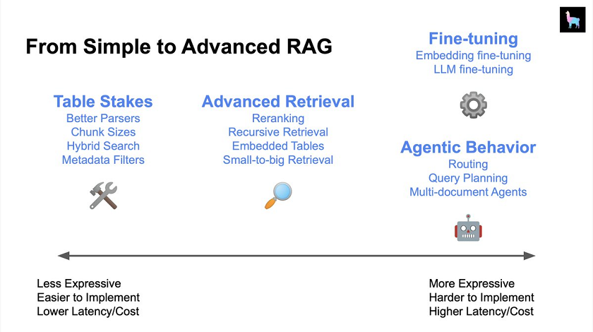
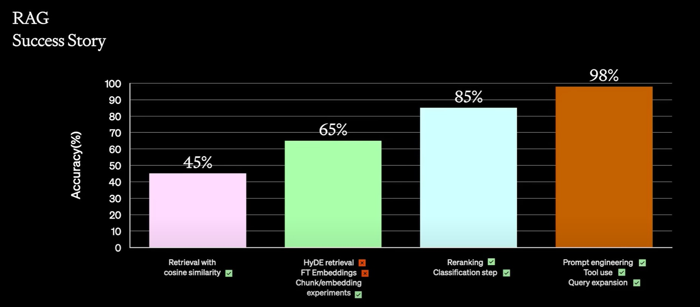

# App and Agent

## Contents
 
- [RAG (Retrieval-Augmented Generation)](#rag-retrieval-augmented-generation)
  - [Advanced RAG](#advanced-rag)
  - [GraphRAG](#graphrag)
  - [RAG Application](#rag-application)
  - [Vector Database \& Embedding](#vector-database--embedding)
- [AI Application](#ai-application)
  - [Top Agent Frameworks](#top-agent-frameworks)
  - [Orchestration Framework](#orchestration-framework)
  - [Frameworks / SDKs / Building Blocks](#frameworks--sdks--building-blocks)
    - [Multi-Agent \& Swarm Frameworks](#multi-agent--swarm-frameworks)
    - [General Agent Frameworks](#general-agent-frameworks)
    - [Official Vendor SDKs](#official-vendor-sdks)
    - [Monitoring, Training \& Tool Integration](#monitoring-training--tool-integration)
    - [NLP \& ML Libraries](#nlp--ml-libraries)
  - [Apps / Demos / Ready-to-use Agents](#apps--demos--ready-to-use-agents)
    - [General Autonomous Agents](#general-autonomous-agents)
    - [Knowledge Tools](#knowledge-tools)
    - [Productivity \& Personal Assistants](#productivity--personal-assistants)
    - [Data, Finance \& Analytics](#data-finance--analytics)
    - [Specialized Agents](#specialized-agents)
  - [Popular LLM Applications (Ranked by GitHub star count ≥1000)](#popular-llm-applications-ranked-by-github-star-count-1000)
  - [No Code \& User Interface](#no-code--user-interface)
  - [Personal AI assistant \& desktop](#personal-ai-assistant--desktop)
  - [Infrastructure \& Backend Services](#infrastructure--backend-services)
  - [Caching](#caching)
  - [Data Processing](#data-processing)
  - [Gateway](#gateway)
  - [Memory](#memory)
- [Agent Protocol](#agent-protocol)
  - [Model Context Protocol (MCP)](#model-context-protocol-mcp)
  - [A2A](#a2a)
  - [Computer use](#computer-use)
- [Coding \& Research](#coding--research)
  - [Coding](#coding)
  - [Skill](#skill)
  - [Domain-Specific Agents](#domain-specific-agents)
  - [Deep Research](#deep-research)

### **RAG (Retrieval-Augmented Generation)**

- RAG integrates retrieval (searching) into LLM text generation, enabling models to access external information. [✍️](https://towardsdatascience.com/rag-vs-finetuning-which-is-the-best-tool-to-boost-your-llm-application-94654b1eaba7) [25 Aug 2023]
- [Retrieval-Augmented Generation for Knowledge-Intensive NLP Tasks📑](https://arxiv.org/abs/2005.11401): Meta's 2020 framework for giving LLMs access to information beyond training data. [22 May 2020]
  - RAG-sequence — Retrieve k documents to generate all output tokens.
  - RAG-token— Retrieve k documents per token generation.
  - RAG-sequence is the industry standard due to lower cost and simplicity. [✍️](https://towardsdatascience.com/add-your-own-data-to-an-llm-using-retrieval-augmented-generation-rag-b1958bf56a5a) [30 Sep 2023]

#### **Advanced RAG**

- [9 Effective Techniques To Boost Retrieval Augmented Generation (RAG) Systems✍️](https://towardsdatascience.com/9-effective-techniques-to-boost-retrieval-augmented-generation-rag-systems-210ace375049) [🗄️](9-effective-rag-techniques.png): ReRank, Prompt Compression, Hypothetical Document Embedding (HyDE), Query Rewrite and Expansion, Enhance Data Quality, Optimize Index Structure, Add Metadata, Align Query with Documents, Mixed Retrieval (Hybrid Search) [2 Jan 2024]
- Advanced RAG Patterns: How to improve RAG peformance [✍️](https://cloudatlas.me/why-do-rag-pipelines-fail-advanced-rag-patterns-part1-841faad8b3c2) / [✍️](https://cloudatlas.me/how-to-improve-rag-peformance-advanced-rag-patterns-part2-0c84e2df66e6) [17 Oct 2023]
  - Data quality: Clean, standardize, deduplicate, segment, annotate, augment, and update data to make it clear, consistent, and context-rich.
  - Embeddings fine-tuning: Fine-tune embeddings to domain specifics, adjust them according to context, and refresh them periodically to capture evolving semantics.
  - Retrieval optimization: Refine chunking, embed metadata, use query routing, multi-vector retrieval, re-ranking, hybrid search, recursive retrieval, query engine, [HyDE📑](https://arxiv.org/abs/2212.10496) [20 Dec 2022], and vector search algorithms to improve retrieval efficiency and relevance.
  - Synthesis techniques: Query transformations, prompt templating, prompt conditioning, function calling, and fine-tuning the generator to refine the generation step.
  - HyDE: Implemented in [LangChain: HypotheticalDocumentEmbedder](https://github.com/langchain-ai/langchain/blob/master/cookbook/hypothetical_document_embeddings.ipynb). A query generates hypothetical documents, which are then embedded and retrieved to provide the most relevant results. `query -> generate n hypothetical documents -> documents embedding - (avg of embeddings) -> retrieve -> final result.` [✍️](https://www.jiang.jp/posts/20230510_hyde_detailed/index.html)
- [Agentic Retrieval-Augmented Generation: A Survey on Agentic RAG📑](https://arxiv.org/abs/2501.09136) [15 Jan 2025]
- [Azure RAG with Vision Application Framework](https://github.com/Azure-Samples/rag-as-a-service-with-vision) [Mar 2024] 
- [Contextual Retrieval✍️](https://www.anthropic.com/news/contextual-retrieval): Contextual Retrieval enhances traditional RAG by using Contextual Embeddings and Contextual BM25 to maintain context during retrieval. [19 Sep 2024]
- Demystifying Advanced RAG Pipelines: An LLM-powered advanced RAG pipeline built from scratch [git](https://github.com/pchunduri6/rag-demystified) [19 Oct 2023]
 
- [Enhancing Ultra High Resolution Remote Sensing Imagery Analysis with ImageRAG📑](https://arxiv.org/abs/2411.07688): Ultra High Resolution (UHR) remote sensing imagery, such as satellite imagery and medical imaging. [12 Nov 2024]
- [Evaluation with Ragas✍️](https://towardsdatascience.com/visualize-your-rag-data-evaluate-your-retrieval-augmented-generation-system-with-ragas-fc2486308557): UMAP (often used to reduce the dimensionality of embeddings) with Ragas metrics for visualizing RAG results. [Mar 2024] / `Ragas provides metrics`: Context Precision, Context Relevancy, Context Recall, Faithfulness, Answer Relevance, Answer Semantic Similarity, Answer Correctness, Aspect Critique [git](https://github.com/explodinggradients/ragas) [May 2023]
 
- From Simple to Advanced RAG (LlamaIndex) [✍️](https://twitter.com/jerryjliu0/status/1711419232314065288) / [🗄️](../files/archive/LlamaIndexTalk_PyDataGlobal.pdf) /💡[✍️](https://aiconference.com/speakers/jerry-liu-2023/) [10 Oct 2023]
  <!--  -->
- [How to improve RAG Piplines](https://www.linkedin.com/posts/damienbenveniste_how-to-improve-rag-pipelines-activity-7241497046631776256-vwOc?utm_source=li_share&utm_content=feedcontent&utm_medium=g_dt_web&utm_campaign=copy): LangGraph implementation with Self-RAG, Adaptive-RAG, Corrective RAG. [Oct 2024]
- How to optimize RAG pipeline: [Indexing optimization](https://newsletter.theaiedge.io/p/how-to-optimize-your-rag-pipelines) [24 Oct 2023]
- [localGPT-Vision](https://github.com/PromtEngineer/localGPT-Vision): an end-to-end vision-based Retrieval-Augmented Generation (RAG) system. [Oct 2024] 
- [Multi-Modal RAG System✍️](https://machinelearningmastery.com/implementing-multi-modal-rag-systems/): Building a knowledge base with both image and audio data. [12 Feb 2025]
- [🗣️](https://twitter.com/yi_ding/status/1721728060876300461) [7 Nov 2023] `OpenAI has put together a pretty good roadmap for building a production RAG system.` Naive RAG -> Tune Chunks -> Rerank & Classify -> Prompt Engineering. In `llama_index`... [📺](https://www.youtube.com/watch?v=ahnGLM-RC1Y)   
  
- [Path-RAG: Knowledge-Guided Key Region Retrieval for Open-ended Pathology Visual Question Answering📑](https://arxiv.org/abs/2411.17073): Using HistoCartography to improve pathology image analysis and boost PathVQA-Open performance. [26 Nov 2024]
- [RAG Hallucination Detection Techniques✍️](https://machinelearningmastery.com/rag-hallucination-detection-techniques/): Hallucination metrics using the DeepEval, G-Eval. [10 Jan 2025] - [UniversalRAG](https://github.com/wgcyeo/UniversalRAG) [29 Apr 2025]  
- [VideoRAG📑](https://arxiv.org/abs/2501.05874): Not only does it retrieve relevant videos from a large video corpus, but it also integrates both the visual and textual elements of videos into the answer-generation process using Large Video Language Models (LVLMs). [10 Jan 2025]
- [Visual RAG over PDFs with Vespa✍️](https://blog.vespa.ai/visual-rag-in-practice/): a demo showcasing Visual RAG over PDFs using ColPali embeddings in Vespa [git](https://github.com/vespa-engine/sample-apps/tree/master/visual-retrieval-colpali) [19 Nov 2024]
- [What is Agentic RAG](https://weaviate.io/blog/what-is-agentic-rag): The article published by Weaviate. [5 Nov 2024]

#### **GraphRAG**

- [Fast GraphRAG](https://github.com/circlemind-ai/fast-graphrag): 6x cost savings compared to `graphrag`, with 20% higher accuracy. Combines PageRank and GraphRAG. [Oct 2024] 
- [FalkorDB](https://github.com/FalkorDB/FalkorDB): Graph Database. Knowledge Graph for LLM (GraphRAG). OpenCypher (query language in Neo4j). [Jul 2023] 
- [GitNexus](https://github.com/abhigyanpatwari/GitNexus): Indexes codebases into a knowledge graph and exposes it via MCP tools for AI agents. [Aug 2025] 
- [Increasing the LLM Accuracy for Question Answering: Ontologies to the Rescue!📑](https://arxiv.org/abs/2405.11706): using a knowledge graph, the Text-to-SQL accuracy improved from 16% to 54%. [20 May 2024]
- [Graph RAG (by NebulaGraph)](https://medium.com/@nebulagraph/graph-rag-the-new-llm-stack-with-knowledge-graphs-e1e902c504ed): NebulaGraph proposes the concept of Graph RAG, which is a retrieval enhancement technique based on knowledge graphs. [demo](https://www.nebula-graph.io/demo) [8 Sep 2023]
- [GraphRAG (by Microsoft)📑](https://arxiv.org/abs/2404.16130):🏆1. Global search: Original Documents -> Knowledge Graph (Community Summaries generated by LLM) -> Partial Responses -> Final Response. 2. Local Search: Utilizes vector-based search to find the nearest entities and relevant information.
[✍️](https://microsoft.github.io/graphrag) / [git](https://github.com/microsoft/graphrag) [24 Apr 2024]

  - [DRIFT Search✍️](https://www.microsoft.com/en-us/research/blog/introducing-drift-search-combining-global-and-local-search-methods-to-improve-quality-and-efficiency/): DRIFT search (Dynamic Reasoning and Inference with Flexible Traversal) combines global and local search methods to improve query relevance by generating sub-questions and refining the context using HyDE (Hypothetical Document Embeddings). [31 Oct 2024]
  - ["From Local to Global" GraphRAG with Neo4j and LangChain](https://neo4j.com/developer-blog/global-graphrag-neo4j-langchain/) [09 Jul 2024]
  - [GraphRAG Implementation with LlamaIndex](https://github.com/run-llama/llama_index/blob/main/docs/docs/examples/cookbooks/GraphRAG_v1.ipynb) [15 Jul 2024]
  - [Improving global search via dynamic community selection✍️](https://www.microsoft.com/en-us/research/blog/graphrag-improving-global-search-via-dynamic-community-selection/): Dynamic Community Selection narrows the scope by selecting the most relevant communities based on query relevance, utilizing Map-reduce search, reducing costs by 77% without sacrificing output quality [15 Nov 2024]
  - [LazyGraphRAG✍️](https://www.microsoft.com/en-us/research/blog/lazygraphrag-setting-a-new-standard-for-quality-and-cost/): Reduces costs to 0.1% of full GraphRAG through efficient use of best-first (vector-based) and breadth-first (global search) retrieval and deferred LLM calls [25 Nov 2024]
  - [LightRAG](https://github.com/HKUDS/LightRAG): Utilizing graph structures for text indexing and retrieval processes. [8 Oct 2024] 
  - [nano-graphrag](https://github.com/gusye1234/nano-graphrag): A simple, easy-to-hack GraphRAG implementation [Jul 2024]

- [Graphiti](https://github.com/getzep/graphiti)
- [GraphSearch](https://github.com/DataArcTech/GraphSearch): An Agentic Workflow for Graph RAG. [Oct 2025]
- [HippoRAG](https://github.com/OSU-NLP-Group/HippoRAG):💡RAG + Knowledge Graphs + Personalized PageRank. [23 May 2024] 
- [How to Build a Graph RAG App✍️](https://towardsdatascience.com/how-to-build-a-graph-rag-app-b323fc33ba06): Using knowledge graphs and AI to retrieve, filter, and summarize medical journal articles [30 Dec 2024]
- [HybridRAG📑](https://arxiv.org/abs/2408.04948): Integrating VectorRAG and GraphRAG with financial earnings call transcripts in Q&A format. [9 Aug 2024]
- [Neo4j GraphRAG Package for Python](https://github.com/neo4j/neo4j-graphrag-python) [Feb 2024] 

#### **RAG Application**

1. [AutoRAG](https://github.com/Marker-Inc-Korea/AutoRAG): RAG AutoML tool for automatically finds an optimal RAG pipeline for your data. [Jan 2024] 
1. [Canopy](https://github.com/pinecone-io/canopy): open-source RAG framework and context engine built on top of the Pinecone vector database. [Aug 2023] 
1. [Chonkie](https://github.com/SecludedCoder/chonkie): RAG chunking library [Nov 2024]  <!--old: https://github.com/chonkie-ai/chonkie -->
1. [Cognita](https://github.com/truefoundry/cognita): RAG (Retrieval Augmented Generation) Framework for building modular, open-source applications [Jul 2023] 
1. [Danswer](https://github.com/danswer-ai/danswer): Ask Questions in natural language and get Answers backed by private sources: Slack, GitHub, Confluence, etc. [Apr 2023] 
1. [Fireplexity](https://github.com/mendableai/fireplexity): AI search engine by Firecrawl's search API [Jun 2025] 
1. [FlashRAG](https://github.com/RUC-NLPIR/FlashRAG): A Python Toolkit for Efficient RAG Research [Mar 2024] 
1. [Gemini-Search](https://github.com/ammaarreshi/Gemini-Search): Perplexity style AI Search engine clone built with Gemini [Jan 2025] 
1. [Haystack](https://github.com/deepset-ai/haystack): LLM orchestration framework to build customizable, production-ready LLM applications. [5 May 2020] 
1. [KAG](https://github.com/OpenSPG/KAG): Knowledge Augmented Generation. a logical reasoning and Q&A framework based on the OpenSPG(Semantic-enhanced Programmable Graph). By Ant Group. [Oct 2024] 
1. [Khoj](https://github.com/khoj-ai/khoj): Open-source, personal AI agents. Cloud or Self-Host, Multiple Interfaces. Python Django based [Aug 2021] 
1. [kotaemon](https://github.com/Cinnamon/kotaemon): Open-source clean & customizable RAG UI for chatting with your documents. [Mar 2024] 
1. [llm-answer-engine](https://github.com/developersdigest/llm-answer-engine): Build a Perplexity-Inspired Answer Engine Using Next.js, Groq, Mixtral, LangChain, OpenAI, Brave & Serper [Mar 2024] 
1. [llmware](https://github.com/llmware-ai/llmware): Building Enterprise RAG Pipelines with Small, Specialized Models [Sep 2023] 
1. [Marqo](https://github.com/marqo-ai/marqo): Tensor search for humans [Aug 2022] 
1. [MedGraphRAG📑](https://arxiv.org/abs/2408.04187): MedGraphRAG outperforms the previous SOTA model, [Medprompt📑](https://arxiv.org/abs/2311.16452), by 1.1%. [git](https://github.com/medicinetoken/medical-graph-rag) [8 Aug 2024] 
1. [Meilisearch](https://github.com/meilisearch/meilisearch): A lightning-fast search engine API bringing AI-powered hybrid search to your sites and applications. [Apr 2018] 
1. [MemFree](https://github.com/memfreeme/memfree): Hybrid AI Search Engine + AI Page Generator. [Jun 2024] 
1. [MindSearch](https://github.com/InternLM/MindSearch): An open-source AI Search Engine Framework [Jul 2024] 
1. [MiniRAG](https://github.com/HKUDS/MiniRAG): RAG through heterogeneous graph indexing and lightweight topology-enhanced retrieval. [Jan 2025] 
1. [Morphic](https://github.com/miurla/morphic): An AI-powered search engine with a generative UI [Apr 2024] 
1. [openrag](https://github.com/linagora/openrag): Open source, modular, lightweight, extensible RAG application stack. 
1. [PageIndex](https://github.com/VectifyAI/PageIndex): a vectorless, reasoning-based RAG system that builds a hierarchical tree index [Apr 2025] 
1. [PaperQA2](https://github.com/Future-House/paper-qa): High accuracy RAG for answering questions from scientific documents with citations [Feb 2023] 
1. [Perplexica](https://github.com/ItzCrazyKns/Perplexica):💡Open source alternative to Perplexity AI [Apr 2024] 
1. [PrivateGPT](https://github.com/imartinez/privateGPT): 100% privately, no data leaks. The API is built using FastAPI and follows OpenAI's API scheme. [May 2023] 
1. [Pyversity](https://github.com/Pringled/pyversity): A rerank library for search results [Oct 2025] 
1. [quivr](https://github.com/QuivrHQ/quivr): A personal productivity assistant (RAG). Chat with your docs (PDF, CSV, ...) [May 2023] 
1. [R2R (Reason to Retrieve)](https://github.com/SciPhi-AI/R2R): Agentic Retrieval-Augmented Generation (RAG) with a RESTful API. [Feb 2024] 
1. [RAG Builder](https://github.com/KruxAI/ragbuilder): Automatically create an optimal production-ready Retrieval-Augmented Generation (RAG) setup for your data. [Jun 2024] 
1. [RAG capabilities of LlamaIndex to QA about SEC 10-K & 10-Q documents](https://github.com/run-llama/sec-insights): A real world full-stack application using LlamaIndex [Sep 2023] 
1. [RAG-Anything](https://github.com/HKUDS/RAG-Anything): "RAG-Anything: All-in-One RAG System". [Jun 2025] 
1. [RAGApp](https://github.com/ragapp/ragapp): Agentic RAG. Custom GPTs, but deployable in your own cloud infrastructure using Docker. [Apr 2024] 
1. [RAGChecker📑](https://arxiv.org/abs/2408.08067): A Fine-grained Framework For Diagnosing RAG [git](https://github.com/amazon-science/RAGChecker) [15 Aug 2024] 
1. [RAGflow](https://github.com/infiniflow/ragflow):💡Streamlined RAG workflow. Focusing on Deep document understanding [Dec 2023] 
1. [RAGFoundry](https://github.com/IntelLabs/RAGFoundry): A library designed to improve LLMs ability to use external information by fine-tuning models on specially created RAG-augmented datasets. [5 Aug 2024] 
1. [RAGLite](https://github.com/superlinear-ai/raglite): a Python toolkit for Retrieval-Augmented Generation (RAG) with PostgreSQL or SQLite [Jun 2024] 
1. [RAGxplorer](https://github.com/gabrielchua/RAGxplorer): Visualizing document chunks and the queries in the embedding space. [Jan 2024] 
1. [Renumics RAG](https://github.com/Renumics/renumics-rag): Visualization for a Retrieval-Augmented Generation (RAG) Data [Jan 2024] 
1. [Scira (Formerly MiniPerplx)](https://github.com/zaidmukaddam/scira): A minimalistic AI-powered search engine [Aug 2024] 
1. [Semantica](https://github.com/Hawksight-AI/semantica): Semantic intelligence layer that makes your AI agents auditable, explainable, and compliant — beyond Text Similarity [Jun 2025] 
1. [Semantra](https://github.com/freedmand/semantra): Multi-tool for semantic search [Mar 2023] 
1. [Simba](https://github.com/GitHamza0206/simba): Portable KMS (knowledge management system) designed to integrate seamlessly with any Retrieval-Augmented Generation (RAG) system [Dec 2024] 
1. [smartrag](https://github.com/aymenfurter/smartrag): Deep Research through Multi-Agents, using GraphRAG. [Jun 2024] 
1. [SWIRL AI Connect](https://github.com/swirlai/swirl-search): SWIRL AI Connect enables you to perform Unified Search and bring in a secure AI Co-Pilot. [Apr 2022] 
1. [turboseek](https://github.com/Nutlope/turboseek): An AI search engine inspired by Perplexity [May 2024] 
1. [txtai](https://github.com/neuml/txtai): Semantic search and workflows powered by language models [Aug 2020] 
1. [Typesense](https://github.com/typesense/typesense): Open Source alternative to Algolia + Pinecone and an Easier-to-Use alternative to ElasticSearch [Jan 2017] 
1. [UltraRAG](https://github.com/OpenBMB/UltraRAG): A Low-Code MCP Framework for Building Complex and Innovative RAG Pipelines [Jan 2025] 
1. [UniversalRAG](https://github.com/wgcyeo/UniversalRAG): RAG framework that retrieves across multiple modalities. [29 Apr 2025]  
1. [Verba](https://github.com/weaviate/Verba): Retrieval Augmented Generation (RAG) chatbot powered by Weaviate [Jul 2023] 
1. [WeKnora](https://github.com/Tencent/WeKnora): LLM-powered framework for deep document understanding, semantic retrieval, and context-aware answers using RAG paradigm. [Jul 2025] 
1. [Xyne](https://github.com/xynehq/xyne): an AI-first Search & Answer Engine for work. We're an OSS alternative to Glean, Gemini and MS Copilot. [Sep 2024] 

#### **Vector Database & Embedding**

- [A Comprehensive Survey on Vector Database📑](https://arxiv.org/abs/2310.11703): Categorizes search algorithms by their approach, such as hash-based, tree-based, graph-based, and quantization-based. [18 Oct 2023]
- [A Gentle Introduction to Word Embedding and Text Vectorization✍️](https://machinelearningmastery.com/a-gentle-introduction-to-word-embedding-and-text-vectorization/): Word embedding, Text vectorization, One-hot encoding, Bag-of-words, TF-IDF, word2vec, GloVe, FastText. | [Tokenizers in Language Models✍️](https://machinelearningmastery.com/tokenizers-in-language-models/): Stemming, Lemmatization, Byte Pair Encoding (BPE), WordPiece, SentencePiece, Unigram [23 May 2025]
- Azure Open AI Embedding API, `text-embedding-ada-002`, supports 1536 dimensions. Elastic search, Lucene based engine, supports 1024 dimensions as a max. Open search can insert 16,000 dimensions as a vector storage. Open search is available to use as a vector database with Azure Open AI Embedding API.
- [A SQLite extension for efficient vector search, based on Faiss!](https://github.com/asg017/sqlite-vss) [Jan 2023]
 
- [Chroma](https://github.com/chroma-core/chroma): Open-source embedding database [Oct 2022]
 
- [Contextual Document Embedding (CDE)📑](https://arxiv.org/abs/2410.02525): Improve document retrieval by embedding both queries and documents within the context of the broader document corpus. [✍️](https://pub.aimind.so/unlocking-the-power-of-contextual-document-embeddings-enhancing-search-relevance-01abfa814c76) [3 Oct 2024]
- [Contextualized Chunk Embedding Model✍️](https://blog.voyageai.com/2025/07/23/voyage-context-3/): Rather than embedding each chunk separately, a contextualized chunk embedding model uses the whole document to create chunk embeddings that reflect the document's overall context. [✍️](https://blog.dailydoseofds.com/p/contextualized-chunk-embedding-model) [23 Jul 2025]
- [EmbedAnything](https://github.com/StarlightSearch/EmbedAnything): Built by Rust. Supports BERT, CLIP, Jina, ColPali, ColBERT, ModernBERT, Reranker, Qwen. Mutilmodality. [Mar 2024] 
- [Embedding Atlas](https://github.com/apple/embedding-atlas): Apple. a tool that provides interactive visualizations for large embeddings. [May 2025]
- [Faiss](https://faiss.ai/): Facebook AI Similarity Search (Faiss) is a library for efficient similarity search and clustering of dense vectors. It is used as an alternative to a vector database in the development and library of algorithms for a vector database. It is developed by Facebook AI Research. [git](https://github.com/facebookresearch/faiss) [Feb 2017]
 
- [FalkorDB](https://github.com/FalkorDB/FalkorDB): Graph Database. Knowledge Graph for LLM (GraphRAG). OpenCypher (query language in Neo4j). For a sparse matrix, the graph can be queried with linear algebra instead of traversal, boosting performance.  [Jul 2023] 
- [Fine-tuning Embeddings for Specific Domains✍️](https://blog.gopenai.com/fine-tuning-embeddings-for-specific-domains-a-comprehensive-guide-5e4298b42185): The guide discusses fine-tuning embeddings for domain-specific tasks using `sentence-transformers` [1 Oct 2024]
- [Is Cosine-Similarity of Embeddings Really About Similarity?📑](https://arxiv.org/abs/2403.05440): Regularization in linear matrix factorization can distort cosine similarity. L2-norm regularization on (1) the product of matrices (like dropout) and (2) individual matrices (like weight decay) may lead to arbitrary similarities.  [8 Mar 2024]
- OpenAI Embedding models: `text-embedding-3`
- [lancedb](https://github.com/lancedb/lancedb): LanceDB's core is written in Rust and is built using Lance, an open-source columnar format.  [Feb 2023] 
- [LEANN](https://github.com/yichuan-w/LEANN): The smallest vector database. 97% less storage. [Jun 2025] 
- Milvus (A cloud-native vector database) Embedded [git](https://github.com/milvus-io/milvus) [Sep 2019]: Alternative option to replace PineCone and Redis Search in OSS. It offers support for multiple languages, addresses the limitations of RedisSearch, and provides cloud scalability and high reliability with Kubernetes.
 
- [MongoDB's GenAI Showcase](https://github.com/mongodb-developer/GenAI-Showcase): Step-by-step Jupyter Notebook examples on how to use MongoDB as a vector database, data store, memory provider [Jan 2024] 
- [Not All Vector Databases Are Made Equal✍️](https://towardsdatascience.com/milvus-pinecone-vespa-weaviate-vald-gsi-what-unites-these-buzz-words-and-what-makes-each-9c65a3bd0696): Printed version for "Medium" limits. [🗄️](../files/vector-dbs.pdf) [2 Oct 2021]
- [pgvector](https://github.com/pgvector/pgvector): Open-source vector similarity search for Postgres [Apr 2021] / [pgvectorscale](https://github.com/timescale/pgvectorscale): 75% cheaper than pinecone [Jul 2023]  
- [Pinecone](https://docs.pinecone.io): A fully managed cloud Vector Database. Commercial Product [Jan 2021]
- [Qdrant](https://github.com/qdrant/qdrant): Written in Rust. Qdrant (read: quadrant) [May 2020]
 
- [Redis extension for vector search, RedisVL](https://github.com/redis/redis-vl-python): Redis Vector Library (RedisVL) [Nov 2022]
 
- [text-embedding-ada-002✍️](https://openai.com/blog/new-and-improved-embedding-model):
  Smaller embedding size. The new embeddings have only 1536 dimensions, one-eighth the size of davinci-001 embeddings,
  making the new embeddings more cost effective in working with vector databases. [15 Dec 2022]
- [The Semantic Galaxy🤗](https://huggingface.co/spaces/webml-community/semantic-galaxy): Visualize embeddings in 3D space, powered by EmbeddingGemma and Transformers.js [Sep 2025]
- [Vector Search with OpenAI Embeddings: Lucene Is All You Need📑](https://arxiv.org/abs/2308.14963): For vector search applications, Lucene's HNSW implementation is a resilient and extensible solution with performance comparable to specialized vector databases like FAISS. Our experiments used Lucene 9.5.0, which limits vectors to 1024 dimensions—insufficient for OpenAI's 1536-dimensional embeddings. A fix to make vector dimensions configurable per codec has been merged to Lucene's source [here](https://github.com/apache/lucene/pull/12436) but was not yet released as of August 2023. [29 Aug 2023]
- [Weaviate](https://github.com/weaviate/weaviate): Store both vectors and data objects. [Jan 2021]
 
- [zvec](https://github.com/alibaba/zvec): Lightweight vector database by Alibaba Cloud. [Dec 2025] 

### **AI Application**

- [900 most popular open source AI tools](https://huyenchip.com/2024/03/14/ai-oss.html):🏆What I learned from looking at 900 most popular open source AI tools [list](https://huyenchip.com/llama-police) [Mar 2024]
- [Awesome LLM Apps](https://github.com/Shubhamsaboo/awesome-llm-apps):💡A curated collection of awesome LLM apps built with RAG and AI agents. [Apr 2024]
 
- [Azure OpenAI Samples](https://github.com/kimtth/azure-openai-cookbook): 🐳 Azure OpenAI (OpenAI) Sample Collection - 🪂 100+ Code Cookbook 🧪 [Mar 2025]
- [GenAI Agents](https://github.com/NirDiamant/GenAI_Agents):🏆Tutorials and implementations for various Generative AI Agent techniques, from basic to advanced. [Sep 2024]
 
- [GenAI Cookbook](https://github.com/dmatrix/genai-cookbook): A mixture of Gen AI cookbook recipes for Gen AI applications. [Nov 2023] 
- [Generative AI Design Patterns✍️](https://towardsdatascience.com/generative-ai-design-patterns-a-comprehensive-guide-41425a40d7d0): 9 architecture patterns for working with LLMs. [Feb 2024]
- [Open100: Top 100 Open Source achievements.](https://www.benchcouncil.org/evaluation/opencs/annual.html)

#### Agent & Application

##### **Top Agent Frameworks**

- [AG2](https://github.com/ag2ai/ag2): Open-source AgentOS for multi-agent conversations and collaboration (formerly AutoGen).
 
- [Agno](https://github.com/agno-agi/agno): Model-agnostic framework for building multimodal agents with memory, knowledge, and tools.
 
- [AWS Bedrock Agents](https://github.com/awslabs/amazon-bedrock-agent-samples): AWS-native agent framework for building agents around Amazon Bedrock services. blog:[✍️](https://aws.amazon.com/blogs/machine-learning/)
 
- [CrewAI](https://github.com/crewAIInc/crewAI): Role-based multi-agent framework that organizes agents into crews, tasks, and goals. blog:[✍️](https://www.crewai.com/blog)
 
- [Google ADK](https://github.com/google/adk-python): Google’s Agent Development Kit for building and deploying agentic applications. blog:[✍️](https://blog.google/technology/developers/)
 
- [LangChain](https://github.com/langchain-ai/langchain): Comprehensive LLM application framework for chains, agents, tools, and model integrations. blog:[✍️](https://blog.langchain.com/)
 
- [LangGraph](https://github.com/langchain-ai/langgraph): Graph-based runtime for stateful, cyclic, long-running agent workflows. blog:[✍️](https://blog.langchain.com/)
 
- [LlamaIndex](https://github.com/run-llama/llama_index): Data framework for ingesting, indexing, retrieving, and querying private knowledge for LLM apps. blog:[✍️](https://www.llamaindex.ai/blog)
 
- [Mastra](https://github.com/mastra-ai/mastra): TypeScript AI agent framework covering workflows, agents, RAG, integrations, and evals. blog:[✍️](https://mastra.ai/blog)
 
- [Microsoft Agent Framework](https://github.com/microsoft/agent-framework): Unified Microsoft SDK for building agents from simple chats to complex graph-based multi-agent workflows. blog:[✍️](https://devblogs.microsoft.com/agent-framework/)
 
- [Microsoft Semantic Kernel](https://github.com/microsoft/semantic-kernel): Plugin-based AI orchestration framework with strong .NET and Python support. blog:[✍️](https://devblogs.microsoft.com/semantic-kernel/) [Feb 2023]
 
- [OpenAI Agent SDK](https://github.com/openai/openai-agents-python): Official OpenAI framework for agent workflows, built-in tools, and the Responses API. blog:[✍️](https://openai.com/news/)
 
- [Pydantic AI](https://github.com/pydantic/pydantic-ai): Type-safe agent framework centered on structured inputs, outputs, and validation. blog:[✍️](https://pydantic.dev/articles)
 
- [Strands Agents SDK](https://github.com/strands-agents/sdk-python): Model-driven SDK for building tool-first agents with minimal hard-coded orchestration. blog:[✍️](https://strandsagents.com/blog/)
 
- [Vercel AI SDK](https://github.com/vercel/ai): TypeScript and JavaScript SDK for building AI apps and agent experiences across web stacks. blog:[✍️](https://vercel.com/blog)
 

##### **Orchestration Framework**

- [Prompting Framework (PF)📑](https://arxiv.org/abs/2311.12785): Prompting Frameworks for Large Language Models: A Survey [git](https://github.com/lxx0628/Prompting-Framework-Survey)
 
- [What Are Tools Anyway?📑](https://arxiv.org/abs/2403.15452): Analysis of tool usage in LLMs. Key findings: 1) For 5-10 tools, LMs can directly select from context; for hundreds of tools, retrieval is necessary. 2) Tools enable creation and reuse but are less useful for translation, summarization, and sentiment analysis. 3) Includes evaluation metrics [18 Mar 2024]  
- **Micro-Orchestration**: Detailed management of LLM interactions, focusing on data flow within tasks
  - [LangChain](https://www.langchain.com): General-purpose LLM app framework. Distinctive for its broad component ecosystem, chains, agents, and LCEL composition.
  - [LlamaIndex](https://www.llamaindex.ai): Data-centric framework for RAG and knowledge access. Distinctive for indexing, retrieval, query engines, and document workflows.
  - [Haystack](https://haystack.deepset.ai): Production-oriented orchestration for search, RAG, and agent pipelines. Distinctive for pipeline abstractions and strong retrieval stack integration.
  - [AdalFlow](https://adalflow.sylph.ai): Lightweight framework for building and auto-optimizing LLM workflows. Distinctive for combining orchestration with evaluation and optimization loops.
  - [Semantic Kernel](https://aka.ms/sk/repo): Plugin-based AI orchestration framework from Microsoft. Distinctive for structured function calling, process patterns, and strong .NET and enterprise alignment.
- **Macro-Orchestration**: High-level workflow management and state handling
  - [LangGraph](https://langchain-ai.github.io/langgraph): Graph-based runtime for long-lived, stateful agent workflows. Distinctive for cycles, checkpoints, persistence, and explicit control flow.
  - [Burr](https://burr.dagworks.io): State-machine framework for agent applications. Distinctive for making transitions, decisions, and human-in-the-loop steps explicit.
- **Agentic Design**: Multi-agent systems and collaboration patterns
  - [Autogen](https://microsoft.github.io/autogen): Multi-agent conversation framework. Distinctive for message-driven agent collaboration and delegated task solving.
  - [CrewAI](https://docs.crewai.com): Role-based multi-agent framework. Distinctive for organizing agents as crews with explicit roles, goals, and task assignments.
  - [Microsoft Agent Framework](https://github.com/microsoft/agent-framework): from simple chat agents to complex multi-agent workflows with graph-based orchestration. 
- **Optimizer**: Algorithmic prompt and output optimization
  - [DSPy](https://github.com/stanfordnlp/dspy): Declarative framework for compiling LM programs. Distinctive for signatures, modules, and metric-driven prompt optimization.  
  - [AdalFlow](https://github.com/SylphAI-Inc/AdalFlow):💡The Library to Build and Auto-optimize LLM Applications. Distinctive for pairing workflow construction with built-in optimization and evaluation [Apr 2024] 
  - [TextGrad](https://github.com/zou-group/textgrad): Automatic "differentiation" via text. Distinctive for improving prompts and outputs through LLM-generated textual feedback [Jun 2024] 

##### Frameworks / SDKs / Building Blocks

###### Multi-Agent & Swarm Frameworks

1. [agency-swarm](https://github.com/VRSEN/agency-swarm): Reliable Multi-Agent Orchestration Framework [Nov 2023] 
1. [AgentScope](https://github.com/modelscope/agentscope): To build LLM-empowered multi-agent applications. [Jan 2024] 
1. [AgentVerse](https://github.com/OpenBMB/AgentVerse): Primarily providing: task-solving and simulation. [May 2023] 
1. [AWS: Multi-Agent Orchestrator](https://github.com/awslabs/multi-agent-orchestrator): agent-squad
. a framework for managing multiple AI agents and handling complex conversations. [Jul 2024] 
1. [CAMEL](https://github.com/lightaime/camel): CAMEL: Communicative Agents for "Mind" Exploration of Large Scale Language Model Society [Mar 2023] 
1. [crewAI](https://github.com/joaomdmoura/CrewAI):💡Framework for orchestrating role-playing, autonomous AI agents. [Oct 2023] 
1. [MetaGPT](https://github.com/geekan/MetaGPT): Multi-Agent Framework. Assign different roles to GPTs to form a collaborative entity for complex tasks. e.g., Data Interpreter [Jun 2023] 
1. [Mixture Of Agents (MoA)](https://github.com/togethercomputer/MoA): an architecture that runs multiple LLMs in parallel, then uses a final "aggregator" model to merge their outputs into a superior combined response. [Jun 2024] 
1. [OpenAI Swarm](https://github.com/openai/swarm): An experimental and educational framework for lightweight multi-agent orchestration. [11 Oct 2024] 
1. [OWL: Optimized Workforce Learning](https://github.com/camel-ai/owl): a multi-agent collaboration framework built on CAMEL-AI, enhancing task automation [Mar 2025] 
1. [ROMA: Recursive Open Meta-Agents](https://github.com/sentient-agi/ROMA): an open-source meta-agent framework designed to build high-performance multi-agent systems by decomposing complex tasks into recursive, parallelizable components 
1. [SwarmZero](https://github.com/swarmzero/swarmzero): SwarmZero's SDK for building AI agents, swarms of agents. [Aug 2024] 

###### General Agent Frameworks

1. [Agno](https://github.com/agno-agi/agno):💡Build Multimodal AI Agents with memory, knowledge and tools. Simple, fast and model-agnostic. [Nov 2023] 
1. [Atomic Agents](https://github.com/BrainBlend-AI/atomic-agents): an extremely lightweight and modular framework for building Agentic AI pipelines [Jun 2024] 
1. [AutoAgent](https://github.com/HKUDS/AutoAgent): AutoAgent: Fully-Automated and Zero-Code LLM Agent Framework 
1. [Bee Agent Framework](https://github.com/i-am-bee/bee-agent-framework): IBM. The TypeScript framework for building scalable agentic applications. [Oct 2024] 
1. [Burr](https://github.com/dagworks-inc/burr): Create an application as a state machine (graph/flowchart) for managing state, decisions, human feedback, and workflows. [Jan 2024] 
1. [cai](https://github.com/aliasrobotics/cai): Security-focused AI agent framework for offensive and defensive workflows. 
1. [Cheshire-Cat (Stregatto)](https://github.com/cheshire-cat-ai/core): Framework to build custom AIs with memory and plugins [Feb 2023] 
1. [DataAgent](https://github.com/spring-ai-alibaba/DataAgent): Spring AI Alibaba DataAgent. [Sep 2025] 
1. [Dynamiq](https://github.com/dynamiq-ai/dynamiq): An orchestration framework for RAG, agentic AI, and LLM applications [Sep 2024] 
1. [hive](https://github.com/adenhq/hive): Outcome driven agent development framework that evolves [Jan 2026] 
1. [Lagent](https://github.com/InternLM/lagent): Inspired by the design philosophy of PyTorch. A lightweight framework for building LLM-based agents. [Aug 2023] 
1. [maestro](https://github.com/Doriandarko/maestro): A Framework for Claude Opus, GPT, and local LLMs to Orchestrate Subagents [Mar 2024] 
1. [marvin](https://github.com/PrefectHQ/marvin): a lightweight AI toolkit for building natural language interfaces. [Mar 2023]
1. [Mastra](https://github.com/mastra-ai/mastra): The TypeScript AI agent framework. workflows, agents, RAG, integrations and evals. [Aug 2024] 
1. [MiniChain](https://github.com/srush/MiniChain): A tiny library for coding with llm [Feb 2023]
1. [mirascope](https://github.com/Mirascope/mirascope): a library that simplifies working with LLMs via a unified interface for multiple providers. [Dec 2023] 
1. [ModelScope-Agent](https://github.com/modelscope/ms-agent): Lightweight Framework for Agents with Autonomous Exploration [Aug 2023] 
1. [motia](https://github.com/MotiaDev/motia): Modern Backend Framework that unifies APIs, background jobs, workflows, and AI agents into a single cohesive system with built-in observability and state management. [Jan 2025] 
1. [Open Agent Platform](https://github.com/langchain-ai/open-agent-platform): Langchain. An open-source, no-code agent building platform. [Apr 2025]  
1. [parlant](https://github.com/emcie-co/parlant): Instead of hoping your LLM will follow instructions, Parlant ensures rule compliance, Predictable, consistent behavior [Feb 2024] 
1. [phidata](https://github.com/phidatahq/phidata): Build AI Assistants with memory, knowledge, and tools [May 2022] 
1. [PocketFlow](https://github.com/miniLLMFlow/PocketFlow): Minimalist LLM Framework in 100 Lines. Enable LLMs to Program Themselves. [Dec 2024] 
1. [PydanticAI](https://github.com/pydantic/pydantic-ai): Agent Framework / shim to use Pydantic with LLMs. Model-agnostic. Type-safe. [29 Oct 2024] 
1. [Qwen-Agent](https://github.com/QwenLM/Qwen-Agent): Agent framework built upon Qwen1.5, featuring Function Calling, Code Interpreter, RAG, and Chrome extension. [Sep 2023] 
1. [ralph](https://github.com/snarktank/ralph): an autonomous AI agent loop that runs Amp repeatedly until all PRD items are complete. [Jan 2026] 
1. [Spring AI](https://github.com/spring-projects-experimental/spring-ai): Developing AI applications for Java. [Jul 2023]
1. [Strands Agents](https://github.com/strands-agents/sdk-python): Model‑Driven, Tool‑First Architecture. No need to hard-code logic. Just define tools and models—the system figures out how to use them. [May 2025] 
1. [Superagent](https://github.com/superagent-ai/superagent): AI Assistant Framework & API [May 2023]
1. [SuperAGI](https://github.com/TransformerOptimus/SuperAGI): Autonomous AI Agents framework [May 2023] 
1. [TanStack](https://github.com/TanStack/ai): TypeScript-based AI SDK for building LLM-powered applications. [Oct 2025] 
1. [VoltAgent](https://github.com/VoltAgent/voltagent): Open Source TypeScript AI Agent Framework [Apr 2025] 

###### Official Vendor SDKs

1. [Claude Agent SDK for Python](https://github.com/anthropics/claude-agent-sdk-python) [Jun 2025] 
1. [Copilot SDK](https://github.com/github/copilot-sdk): Multi-platform SDK for integrating GitHub Copilot Agent into apps and services [Jan 2026] 
1. [Google ADK](https://github.com/google/adk-python): Agent Development Kit (ADK) [Apr 2025] 
1. [Llama Stack](https://github.com/meta-llama/llama-stack):💡building blocks for Large Language Model (LLM) development [Jun 2024]
1. [Open AI Assistant API](https://platform.openai.com/docs/assistants/overview) [6 Nov 2023]
1. [OpenAI Agents SDK & Response API](https://github.com/openai/openai-agents-python):🏆Responses API (Chat Completions + Assistants API), Built-in tools (web search, file search, computer use), Agents SDK for multi-agent workflows, agent workflow observability tools [11 Mar 2025] 

###### Monitoring, Training & Tool Integration

1. [Agent-Field](https://github.com/Agent-Field/agentfield): Kubernetes for AI Agents. Build and run AI like microservices. [Nov 2025] 
1. [AgentOps](https://github.com/AgentOps-AI/agentops):Python SDK for AI agent monitoring, LLM cost tracking, benchmarking. [Aug 2023] 
1. [ART](https://github.com/OpenPipe/ART): Agent Reinforcement Trainer: train multi-step agents for real-world tasks using GRPO. [Mar 2025] 
1. [composio](https://github.com/ComposioHQ/composio): Integration of Agents with 100+ Tools [Feb 2024] 
1. [Continuous-Claude-v3](https://github.com/parcadei/Continuous-Claude-v3): About
Context management for Claude Code. Hooks maintain state via ledgers and handoffs. [Dec 2025] 
1. [Dagger](https://github.com/dagger/dagger): an open-source runtime for composable workflows. [Nov 2019] 
1. [Eko (pronounced like 'echo') ](https://github.com/FellouAI/eko): Pure JavaScript. Build Production-ready Agentic Workflow with Natural Language. Support Browser use & Computer use [Nov 2024] 
1. [ell](https://github.com/MadcowD/ell): Treats prompts as programs with built-in versioning, monitoring, and tooling for LLMs. [Jul 2024] 
1. [Jina-Serve](https://github.com/jina-ai/serve): a framework for building and deploying AI services that communicate via gRPC, HTTP and WebSockets. [Feb 2020] 
1. [LaVague](https://github.com/lavague-ai/LaVague): Automate automation with Large Action Model framework. Generate Selenium code. [Feb 2024] 
1. [OpenEnv](https://github.com/meta-pytorch/OpenEnv): An e2e framework for isolated execution environments for agentic RL training, built using Gymnasium style simple APIs. [Oct 2025] 
1. [PayPal Agent Toolkit](https://github.com/paypal/agent-toolkit): OpenAI's Agent SDK, LangChain, Vercel's AI SDK, and Model Context Protocol (MCP) to integrate with PayPal APIs through function calling. [Mar 2025]  
1. [Pipecat](https://github.com/pipecat-ai/pipecat): Open Source framework for voice and multimodal conversational AI [Dec 2023] 
1. [Memento](https://github.com/Agent-on-the-Fly/Memento): Fine-tuning LLM Agents without Fine-tuning LLMs [Jun 2025] 
1. [TaskingAI](https://github.com/TaskingAI/TaskingAI): A BaaS (Backend as a Service) platform for LLM-based Agent Development and Deployment. [Jan 2024] 
1. [xpander.ai](https://github.com/xpander-ai/xpander.ai): Backend-as-a-Service for AI Agents. Equip any AI Agent with tools, memory, multi-agent collaboration, state, triggering, storage, and more. [May 2025] 

###### NLP & ML Libraries

1. [fairseq](https://github.com/facebookresearch/fairseq): a sequence modeling toolkit that allows researchers and developers to train custom models for translation, summarization, language modeling [Sep 2017]
1. [fastText](https://github.com/facebookresearch/fastText): A library for efficient learning of word representations and sentence classification [Aug 2016]
1. [jax](https://github.com/google/jax): JAX is Autograd (automatically differentiate native Python & Numpy) and XLA (compile and run NumPy) [Oct 2018]
1. [langfun](https://github.com/google/langfun): leverages PyGlove to integrate LLMs and programming. [Aug 2023]
1. [Sentence Transformers📑](https://arxiv.org/abs/1908.10084): Python framework for state-of-the-art sentence, text and image embeddings. Useful for semantic textual similar, semantic search, or paraphrase mining. [git](https://github.com/UKPLab/sentence-transformers) [27 Aug 2019]
1. [string2string](https://github.com/stanfordnlp/string2string): an open-source tool that offers a comprehensive suite of efficient algorithms for a broad range of string-to-string problems. [Mar 2023]
1. [Tokenizer (microsoft)](https://github.com/microsoft/Tokenizer): Tiktoken in C#: .NET and TypeScript implementation of BPE tokenizer for OpenAI LLMs. [Mar 2023] 

##### Apps / Demos / Ready-to-use Agents

###### General Autonomous Agents

1. [Agent Zero](https://github.com/frdel/agent-zero): An open-source framework for autonomous AI agents with task automation and code generation. [Jun 2024] 
1. [AgentGPT](https://github.com/reworkd/AgentGPT): Assemble, configure, and deploy autonomous AI agents in your browser [Apr 2023] 
1. [AIOS](https://github.com/agiresearch/AIOS): LLM Agent Operating System [Jan 2024]
1. [Anus: Autonomous Networked Utility System](https://github.com/nikmcfly/ANUS): An open-source AI agent framework for task automation, multi-agent collaboration, and web interactions. [Mar 2025] 
1. [Auto-GPT](https://github.com/Torantulino/Auto-GPT): Most popular [Mar 2023] 
1. [babyagi](https://github.com/yoheinakajima/babyagi): Simplest implementation - Coworking of 4 agents [Apr 2023] 
1. [Contains Studio AI Agents](https://github.com/contains-studio/agents): A comprehensive collection of specialized AI agents. [Jul 2025] 
1. [Cord✍️](https://www.june.kim/cord): Runtime for coordinating trees of AI agents with spawn, fork, and ask. [Mar 2026]
1. [googleworkspace/cli](https://github.com/googleworkspace/cli): Workspace automation CLI for AI-assisted docs, mail, and calendar tasks. 
1. [Magentic-One✏️](https://aka.ms/magentic-one): A Generalist Multi-Agent System for Solving Complex Tasks [Nov 2024] 
1. [paperclip](https://github.com/paperclipai/paperclip): Open-source orchestration for zero-human companies, coordinating teams of AI agents with goals, budgets, governance, and cost tracking. 
1. [OpenDAN : Your Personal AIOS](https://github.com/fiatrete/OpenDAN-Personal-AI-OS): OpenDAN, an open-source Personal AI OS consolidating various AI modules in one place [May 2023] 
1. [Project Astra](https://deepmind.google/technologies/gemini/project-astra/): Google DeepMind, A universal AI agent that is helpful in everyday life [14 May 2024]
1. [Suna](https://github.com/kortix-ai/suna): a fully open source AI assistant that helps you accomplish real-world tasks [Oct 2024] 
1. [XAgent](https://github.com/OpenBMB/XAgent): Autonomous LLM Agent for complex task solving like data analysis, recommendation, and model training [Oct 2023] 

###### Knowledge Tools

1. [DeepTutor](https://github.com/HKUDS/deeptutor): Personalized AI learning tutor for interactive education [Oct 2024] 
1. [Dialoqbase](https://github.com/n4ze3m/dialoqbase): Create custom chatbots with your own knowledge base using PostgreSQL [Jun 2023]
1. [DocsGPT](https://github.com/arc53/docsgpt): Chatbot for document with your data [Feb 2023]
1. [KnowledgeGPT](https://github.com/mmz-001/knowledge_gpt): Upload your documents and get answers to your questions, with citations [Jan 2023]
1. [localGPT](https://github.com/PromtEngineer/localGPT): Chat with your documents on your local device [May 2023]
1. [M3-Agent](https://github.com/bytedance-seed/m3-agent): Seeing, Listening, Remembering, and Reasoning: A Multimodal Agent with Long-Term Memory [13 Aug 2025] 
1. [mgrep](https://github.com/mixedbread-ai/mgrep): Natural-language based semantic search as grep. [Nov 2025] 
1. [myGPTReader](https://github.com/myreader-io/myGPTReader): Quickly read and understand any web content through conversations [Mar 2023] 
1. [open-notebook](https://github.com/lfnovo/open-notebook): An Open Source implementation of Notebook LM with more flexibility and features. [Oct 2024] 
1. [PageLM](https://github.com/CaviraOSS/PageLM/): a community driven version of NotebookLM & a education platform that transforms study materials into interactive resources like quizzes, flashcards, notes, and podcasts. [Aug 2025] 
1. [PDF2Audio](https://github.com/lamm-mit/PDF2Audio): an open-source alternative to NotebookLM for podcast creation [Sep 2024]
1. [Podcastfy.ai](https://github.com/souzatharsis/podcastfy): An Open Source API alternative to NotebookLM's podcast feature. [Oct 2024] 
1. [RasaGPT](https://github.com/paulpierre/RasaGPT): Built with Rasa, FastAPI, Langchain, and LlamaIndex [Apr 2023] 
1. [SeeAct](https://osu-nlp-group.github.io/SeeAct): GPT-4V(ision) is a Generalist Web Agent, if Grounded [git](https://github.com/OSU-NLP-Group/SeeAct) [Jan 2024] 
1. [skyvern](https://github.com/skyvern-ai/skyvern): Automate browser-based workflows with LLMs and Computer Vision [Feb 2024] 
1. [SurfSense](https://github.com/MODSetter/SurfSense): Open-source alternative to NotebookLM, Perplexity, and Glean — integrates with your personal knowledge base, search engines, Slack, Linear, Notion, YouTube, and GitHub.  [July 2024]

###### Productivity & Personal Assistants

1. [Auto_Jobs_Applier_AIHawk](https://github.com/feder-cr/Auto_Jobs_Applier_AIHawk): automates the jobs application [Aug 2024]
1. [BettaFish](https://github.com/666ghj/BettaFish):  A multi-agent public opinion analysis assistant. [Jul 2024] 
1. [BookGPT](https://github.com/mikavehns/BookGPT): Generate books based on your specification [Jan 2023]
1. [Cellm](https://github.com/getcellm/cellm): Use LLMs in Excel formulas [Jul 2024] 
1. [Customer Service Agents Demo](https://github.com/openai/openai-cs-agents-demo): OpenAI. Customer Service Agents Demo. [Jun 2025] 
1. [Customer Service Chat with AI Assistant Handoff](https://github.com/pereiralex/Simple-bot-handoff-sample): Seamlessly hand off to a human agent when needed. [Mar 2025] 
1. [Geppeto](https://github.com/Deeptechia/geppetto): Advanced Slack bot using multiple AI models [Jan 2024]
1. [Huginn](https://github.com/huginn/huginn): A hackable version of IFTTT or Zapier on your own server for building agents that perform automated tasks. [Mar 2013] 
1. [Inbox Zero](https://github.com/elie222/inbox-zero): AI personal assistant for email. [Jul 2023]  
1. [Khoj](https://github.com/khoj-ai/khoj): Open-source, personal AI agents. Cloud or Self-Host, Multiple Interfaces. Python Django based [Aug 2021] 
1. [LlamaFS](https://github.com/iyaja/llama-fs): Automatically renames and organizes your files based on their contents [May 2024]
1. [Meetily](https://github.com/Zackriya-Solutions/meeting-minutes): Open source Ai Assistant for taking meeting notes [Dec 2024] 
1. [Postiz](https://github.com/gitroomhq/postiz-app): AI social media scheduling tool. An alternative to: Buffer.com, Hypefury, Twitter Hunter. [Jul 2023] 
1. [Riona-AI-Agent](https://github.com/David-patrick-chuks/Riona-AI-Agent): automation tool designed for Instagram to automate social media interactions such as posting, liking, and commenting. [Jan 2025] 

###### Data, Finance & Analytics

1. [dash](https://github.com/agno-agi/dash): Self-learning data agent built with Agno.  Inspired by OpenAI's in-house implementation. [Jan 2026] 
1. [mindsdb](https://github.com/mindsdb/mindsdb): The open-source virtual database for building AI from enterprise data. It supports SQL syntax for development and deployment, with over 70 technology and data integrations. [Aug 2018] 
1. [OpenAgents](https://github.com/xlang-ai/OpenAgents): Three distinct agents: Data Agent for data analysis, Plugins Agent for plugin integration, and Web Agent for autonomous web browsing. [Aug 2023] 
1. [OpenBB](https://github.com/OpenBB-finance/OpenBB): The first financial Platform that is free and fully open source. AI-powered workspace [Dec 2020] 
1. [pyspark-ai](https://github.com/pyspark-ai/pyspark-ai): English instructions and compile them into PySpark objects like DataFrames. [Apr 2023]
1. [ValueCell](https://github.com/ValueCell-ai/valuecell): a community-driven, multi-agent platform for financial applications. [Sep 2025] 
1. [WrenAI](https://github.com/Canner/WrenAI): Open-source SQL AI Agent for Text-to-SQL [Mar 2024] 

###### Specialized Agents

1. [A2UI](https://github.com/google/A2UI): an open standard and set of libraries that allows agents to "speak UI." Agents send a declarative JSON format describing the intent of the UI. The client application then renders this using its own native component library. [Sep 2025] 
1. [Agent-R1](https://github.com/0russwest0/Agent-R1): End-to-End reinforcement learning to train agents in specific environments. [Mar 2025] 
1. [Agent-S](https://github.com/simular-ai/Agent-S): To build intelligent GUI agents that autonomously learn and perform complex tasks on your computer. [Oct 2024] 
1. [Agentarium](https://github.com/Thytu/Agentarium): a framework for creating and managing simulations populated with AI-powered agents. [Dec 2024] 
1. [Mobile-Agent](https://github.com/X-PLUG/MobileAgent): The Powerful Mobile Device Operation Assistant Family. [Jan 2024] 
1. [pentagi](https://github.com/vxcontrol/pentagi): Autonomous AI system for penetration testing with 20+ security tools and sandboxed execution. [Jan 2025] 
1. [Realtime API Agents Demo](https://github.com/openai/openai-realtime-agents): a simple demonstration of more advanced, agentic patterns built on top of the Realtime API. OpenAI. [Jan 2025] 
1. [skyagi](https://github.com/litanlitudan/skyagi): Simulating believable human behaviors. Role playing [Apr 2023] 
1. [Strix](https://github.com/usestrix/strix): Open-source AI Hackers to secure your Apps. [Aug 2025] 
1. [TEN Agent](https://github.com/TEN-framework/TEN-Agent): The world's first real-time multimodal agent integrated with the OpenAI Realtime API. [Jun 2024] 
1. [UpSonic](https://github.com/Upsonic/UpSonic): (previously GPT Computer Assistant(GCA)) an AI agent framework designed to make computer use. [May 2024]

###### Popular LLM Applications (Ranked by GitHub star count ≥1000)

- [Popular LLM Applications (Ranked by GitHub star count ≥1000)](./x_llm_apps.md): High-star GitHub apps, agent platforms, chat UIs, workflow builders, and ready-to-use assistants, deduplicated across LLM-related topics and ranked by star count.

#### No Code & User Interface

1. [1code](https://github.com/21st-dev/1code): Best UI for Claude Code [Jan 2026] 
1. [agentation.dev✍️](https://agentation.dev/): Agentation converts UI annotations into structured context for AI coding agents. Click an element, add a note, and paste into tools like Claude Code or Codex.
1. [ai-town](https://github.com/a16z-infra/ai-town): a virtual town where AI characters live, chat and socialize. [Jul 2023] 
1. [anse](https://github.com/anse-app/anse): UI for multiple models such as ChatGPT, DALL-E and Stable Diffusion. [Apr 2023]
1. [anything-llm](https://github.com/Mintplex-Labs/anything-llm): All-in-one Desktop & Docker AI application with built-in RAG, AI agents, and more. [Jun 2023] 
1. [AppAgent-TencentQQGYLab](https://github.com/mnotgod96/AppAgent): Multimodal Agents as Smartphone Users. [Dec 2023] 
1. [BIG-AGI](https://github.com/enricoros/big-agi) FKA nextjs-chatgpt-app [Mar 2023] 
1. [browser-use](https://github.com/browser-use/browser-use): Make websites accessible for AI agents. [Nov 2024] 
1. [ChainForge](https://github.com/ianarawjo/ChainForge): An open-source visual programming environment for battle-testing prompts to LLMs. [Mar 2023] 
1. [chainlit](https://github.com/Chainlit/chainlit):💡Build production-ready Conversational AI applications in minutes. [Mar 2023]
1. [ChatGPT-Next-Web](https://github.com/ChatGPTNextWeb/ChatGPT-Next-Web): Open-source GPT wrapper. [Mar 2023] 
1. [ChatHub](https://github.com/chathub-dev/chathub): All-in-one chatbot client [Mar 2023] 
1. [CopilotKit](https://github.com/CopilotKit/CopilotKit): Built-in React UI components [Jun 2023]
1. [coze-studio](https://github.com/coze-dev/coze-studio): An AI agent development platform with all-in-one visual tools, simplifying agent creation, debugging, and deployment like never before. Coze your way to AI Agent creation. [Jun 2024] 
1. [dataline](https://github.com/RamiAwar/dataline): Chat with your data - AI data analysis and visualization [Apr 2023]
1. [Dify](https://github.com/langgenius/dify): an open-source platform for building applications with LLMs, featuring an intuitive interface for AI workflows and model management. [Apr 2023] 
1. [Deepnote](https://github.com/deepnote/deepnote): A successor of Jupyter. a data notebook for the AI. [Sep 2025] 
1. [ElevenLabs UI](https://github.com/elevenlabs/ui): a component library built on top of shadcn/ui to help you build audio & agentic applications [Sep 2025] 
1. [FastGPT](https://github.com/labring/FastGPT): Open-source GPT wrapper. [Feb 2023] 
1. [Flowise](https://github.com/FlowiseAI/Flowise): Drag & drop UI to build your customized LLM flow [Apr 2023] 
1. [daggr](https://github.com/gradio-app/daggr): Gradio-based AI workflow builder with interactive node visualizations. [Jan 2026] 
1. [generative-ui](https://github.com/CopilotKit/generative-ui): Generative UI examples for AG-UI, A2UI/Open-JSON-UI, and MCP Apps patterns. [Jan 2026] 
1. [Google Workspace Studio](https://workspace.google.com/studio/): No-code builder for Workspace chat apps, add-ons, and automations powered by Gemini. [Sep 2024]
1. [Google Workspace Studio with Agents✍️](https://workspaceupdates.googleblog.com/2025/12/workspace-studio.html): Adds agent creation to automate work inside Workspace Studio. [3 Dec 2025]
1.  [GPT 学术优化 (GPT Academic)](https://github.com/binary-husky/gpt_academic): UI Platform for Academic & Coding Tasks. Optimized for paper reading, writing, and editing. [Mar 2023] 
1. [Gradio](https://github.com/gradio-app/gradio): Build Machine Learning Web Apps - in Python [Mar 2023]
1. [Kiln](https://github.com/Kiln-AI/Kiln): Desktop Apps for for fine-tuning LLM models, synthetic data generation, and collaborating on datasets. [Aug 2024] 
1. [knowledge](https://github.com/KnowledgeCanvas/knowledge): Tool for saving, searching, accessing, and exploring websites and files. Electron based app, built-in Chromium browser, knowledge graph [Jul 2021] 
1. [langflow](https://github.com/langflow-ai/langflow): LangFlow is a UI for LangChain, designed with react-flow. [Feb 2023]
1. [langfuse](https://github.com/langfuse/langfuse): Traces, evals, prompt management and metrics to debug and improve your LLM application. [May 2023]
1. [LangGraph](https://github.com/langchain-ai/langgraph): Built on top of LangChain [Aug 2023] 
1. [ludwig](https://github.com/ludwig-ai/ludwig): Low-code framework for building custom LLMs and other AI models. 
1. [Letta ADE](https://github.com/letta-ai/letta): a graphical user interface for ADE (Agent Development Environment) by [Letta (previously MemGPT)](https://github.com/letta-ai/letta) [12 Oct 2023]
1. [LibreChat](https://github.com/danny-avila/LibreChat): a free, open source AI chat platform. [8 Mar 2023] 
1. [LM Studio](https://lmstudio.ai/): UI for Discover, download, and run local LLMs [May 2024]
1. [Lobe Chat](https://github.com/lobehub/lobe-chat): Open-source GPT wrapper. [Jan 2024] 
1. [mesop](https://github.com/mesop-dev/mesop): Rapidly build AI apps in Python [Oct 2023] 
1. [n8n](https://github.com/n8n-io/n8n): A workflow automation tool for integrating various tools. [Jan 2019] 
1. [nanobrowser](https://github.com/nanobrowser/nanobrowser): Open-source Chrome extension for AI-powered web automation. Alternative to OpenAI Operator. [Dec 2024] 
1. [Next.js AI Chatbot](https://github.com/vercel/ai-chatbot):💡An Open-Source AI Chatbot Template Built With Next.js and the AI SDK by Vercel. [May 2023] 
1. [NocoBase](https://github.com/nocobase/nocobase): Data model-driven. AI-powered no-code platform. [Oct 2020] 
1. [Open WebUI](https://github.com/open-webui/open-webui): User-friendly AI Interface (Supports Ollama, OpenAI API, ...) [Oct 2023] 
1. [Refly](https://github.com/refly-ai/refly): WYSIWYG AI editor to create llm application. [Feb 2024] 
1. [Sim Studio](https://github.com/simstudioai/sim): A Figma-like canvas to build agent workflow. [Jan 2025] 
1. [streamlit](https://github.com/streamlit/streamlit):💡Streamlit — A faster way to build and share data apps. [Jan 2018] 
1. [TaxyAI/browser-extension](https://github.com/TaxyAI/browser-extension): Browser Automation by Chrome debugger API and Prompt > `src/helpers/determineNextAction.ts` [Mar 2023]
1. [Text generation web UI](https://github.com/oobabooga/text-generation-webui): Text generation web UI [Mar 2023]
1. [visual-explainer](https://github.com/nicobailon/visual-explainer): Generates rich HTML pages or slide decks for diagrams and reviews. 
1. [Visual Blocks](https://github.com/google/visualblocks): Google visual programming framework that lets you create ML pipelines in a no-code graph editor. [Mar 2023]

#### Personal AI assistant & desktop

1. [5ire](https://github.com/nanbingxyz/5ire): a cross-platform desktop AI assistant, MCP client. [Oct 2024] 
1. [CoPaw](https://github.com/agentscope-ai/CoPaw): Your Personal AI Assistant; easy to install, deploy on your own machine or on the cloud. 
1. [eigent](https://github.com/eigent-ai/eigent): The Open Source Cowork Desktop. [Jul 2025] 
1. [MineContext](https://github.com/volcengine/MineContext): a context-aware AI agent desktop application. [Jun 2025] 
1. [NemoClaw](https://github.com/NVIDIA/NemoClaw): NVIDIA agent framework for open, multimodal task execution. 
1. [Nyro](https://github.com/trynyro/nyro-app): AI-Powered Desktop Productivity Tool [Aug 2024]
1. [openclaw](https://github.com/openclaw/openclaw):💡Your own personal AI assistant. Any OS. Any Platform. Formerly known as clawdbot, and moltbot. [Nov 2025] 
1. [office-agents](https://github.com/hewliyang/office-agents): Agents for Office documents, spreadsheets, and presentations. 
1. [OpenPPT](https://github.com/YOOTeam/OpenPPT): Presentation generation and editing driven by AI workflows. 
1. [Openwork](https://github.com/different-ai/openwork): An open-source alternative to Claude Cowork, powered by opencode [Jan 2026] 
1. [picoclaw](https://github.com/sipeed/picoclaw): AI assistant in Go for $10 hardware — <10MB RAM, 1s boot, runs on RISC-V/ARM/x86. [Feb 2026] 
1. [zeroclaw](https://github.com/zeroclaw-labs/zeroclaw): Zero-shot agent toolkit for extending autonomous workflows. 

#### Infrastructure & Backend Services

1. [Azure OpenAI Proxy](https://github.com/scalaone/azure-openai-proxy): OpenAI API requests converting into Azure OpenAI API requests [Mar 2023]
1. [BISHENG](https://github.com/dataelement/bisheng): an open LLM application devops platform, focusing on enterprise scenarios. [Aug 2023]
1. [Botpress Cloud](https://github.com/botpress/botpress): The open-source hub to build & deploy GPT/LLM Agents. [Nov 2016] 
1. [E2B](https://github.com/e2b-dev/e2b): an open-source infrastructure that allows you run to AI-generated code in secure isolated sandboxes in the cloud. [Mar 2023] 
1. [exo](https://github.com/exo-explore/exo): Run your own AI cluster at home with everyday devices [Jun 2024]
1. [GPT4All](https://github.com/nomic-ai/gpt4all): Open-source large language models that run locally on your CPU [Mar 2023]
1. [guardrails](https://github.com/guardrails-ai/guardrails): Adding guardrails to large language models. [Jan 2023]
1. [Harbor](https://github.com/av/harbor): Effortlessly run LLM backends, APIs, frontends, and services with one command. a helper for the local LLM development environment. [Jul 2024] 
1. [kagent](https://github.com/kagent-dev/kagent): Agent framework for Kubernetes and cloud-native operations. 
1. [keep](https://github.com/keephq/keep): The open-source AIOps and alert management platform [Feb 2023] 
1. [KTransformers](https://github.com/kvcache-ai/ktransformers): A Flexible Framework for Experiencing Cutting-edge LLM Inference Optimizations [Jul 2024] 
1. [LLaMA-Factory](https://github.com/hiyouga/LLaMA-Factory): Unify Efficient Fine-Tuning of 100+ LLMs [May 2023]
1. [mosaicml/llm-foundry](https://github.com/mosaicml/llm-foundry): LLM training code for MosaicML foundation models [Jun 2022]
1. [Meta Lingua](https://github.com/facebookresearch/lingua): a minimal and fast LLM training and inference library designed for research. [Oct 2024] 
1. [ollama](https://github.com/jmorganca/ollama):💡Running with Large language models locally [Jun 2023]
1. [promptomatix](https://github.com/SalesforceAIResearch/promptomatix/): An Automatic Prompt Optimization Framework for Large Language Models [Jul 2025] 
1. [Reranker](https://github.com/luyug/Reranker): Training and deploying deep languge model reranker in information retrieval (IR), question answering (QA) [Jan 2021] 
1. [Tinker Cookbook](https://github.com/thinking-machines-lab/tinker-cookbook): Thinking Machines Lab. Training SDK to fine-tune language models. [Jul 2025] 
1. [RLinf](https://github.com/RLinf/RLinf): Post-training foundation models (LLMs, VLMs, VLAs) via reinforcement learning. [Aug 2025] 
1. [Semantic Router](https://github.com/aurelio-labs/semantic-router): Decision routing for LLMs and agents using semantic vector intelligence. [Oct 2023] 
1. [ThinkGPT](https://github.com/jina-ai/thinkgpt): Chain of Thoughts library [Apr 2023]
1. [Transformers](https://github.com/huggingface/transformers): 🤗 Transformers: State-of-the-art Machine Learning for Pytorch, TensorFlow, and JAX. (github.com) [Oct 2018]
1. [Transformer Lab](https://github.com/transformerlab/transformerlab-app): Open Source Application for Advanced LLM + Diffusion Engineering: interact, train, fine-tune, and evaluation. [Dec 2023] 
1. [unsloth](https://github.com/unslothai/unsloth): Finetune Mistral, Gemma, Llama 2-5x faster with less memory! [Nov 2023]
1. [Universal-Commerce-Protocol/ucp](https://github.com/Universal-Commerce-Protocol/ucp): Specification and documentation for the Universal Commerce Protocol (UCP). [Dec 2025] 
1. [verl](https://github.com/volcengine/verl): ByteDance. RL training library for LLMs [Oct 2024] 
1. [vLLM](https://github.com/vllm-project/vllm): Easy-to-use library for LLM inference and serving. [Feb 2023]
1. [vllm-omni](https://github.com/vllm-project/vllm-omni): A framework for efficient model inference with omni-modality models [Sep 2025] 
1. [YaFSDP](https://github.com/yandex/YaFSDP): Yet another Fully Sharded Data Parallel (FSDP): enhanced for distributed training. YaFSDP vs DeepSpeed. [May 2024]
1. [WebLLM](https://github.com/mlc-ai/web-llm): High-Performance In-Browser LLM Inference Engine. [Apr 2023] 
1. [Weights & Biases](https://github.com/wandb/examples): Visualizing and tracking your machine learning experiments [wandb.ai](https://wandb.ai/) doc: `deeplearning.ai/wandb` [Jan 2020]

#### **Caching**

- Caching: A technique to store data that has been previously retrieved or computed, so that future requests for the same data can be served faster.
- To reduce latency, cost, and LLM requests by serving pre-computed or previously served responses.
- Strategies for caching: Caching can be based on item IDs, pairs of item IDs, constrained input, or pre-computation. Caching can also leverage embedding-based retrieval, approximate nearest neighbor search, and LLM-based evaluation. [✍️](https://eugeneyan.com/writing/llm-patterns/#caching-to-reduce-latency-and-cost)
- GPTCache: Semantic cache for LLMs. Fully integrated with LangChain and llama_index. [git](https://github.com/zilliztech/GPTCache) [Mar 2023]
 
- [Prompt Cache: Modular Attention Reuse for Low-Latency Inference📑](https://arxiv.org/abs/2311.04934): LLM inference by reusing precomputed attention states from overlapping prompts. [7 Nov 2023]
- [Prompt caching with Claude✍️](https://www.anthropic.com/news/prompt-caching): Reducing costs by up to 90% and latency by up to 85% for long prompts. [15 Aug 2024]

#### **Data Processing**

1. [activeloopai/deeplake](https://github.com/activeloopai/deeplake): AI Vector Database for LLMs/LangChain. Doubles as a Data Lake for Deep Learning. Store, query, version, & visualize any data. Stream data in real-time to PyTorch/TensorFlow. [✍️](https://activeloop.ai) [Jun 2021]

1. [AI Sheets🤗](https://github.com/huggingface/aisheets): an open-source tool for building, enriching, and transforming datasets using AI models with no code. 
1. [Camelot](https://github.com/camelot-dev/camelot) a Python library that can help you extract tables from PDFs! [git](https://github.com/camelot-dev/camelot/wiki/Comparison-with-other-PDF-Table-Extraction-libraries-and-tools): Comparison with other PDF Table Extraction libraries [Jul 2016]

1. [chandra](https://github.com/datalab-to/chandra/): OCR model that handles complex tables, forms, handwriting with full layout. [Oct 2025] 

1. [Crawl4AI](https://github.com/unclecode/crawl4ai): Open-source LLM Friendly Web Crawler & Scrapper [May 2024]

1. [DocETL](https://github.com/ucbepic/docetl): Agentic LLM-powered data processing and ETL. Complex Document Processing Pipelines. [Jul 2024] 
1. [docling](https://github.com/DS4SD/docling): IBM. Docling parses documents and exports them to the desired format. [13 Nov 2024] 
1. [dolphin](https://github.com/bytedance/dolphin): The official repo for "Dolphin: Document Image Parsing via Heterogeneous Anchor Prompting", ACL, 2025. [May 2025] 
1. [dots.ocr](https://github.com/rednote-hilab/dots.ocr): a powerful, multilingual document parser that unifies layout detection and content recognition within a single vision-language model (1.7B) [Jul 2025] 
1. [ExtractThinker](https://github.com/enoch3712/ExtractThinker): A Document Intelligence library for LLMs with ORM-style interaction for flexible workflows. [Apr 2024] 
1. [firecrawl](https://github.com/mendableai/firecrawl): Scrap entire websites into LLM-ready markdown or structured data. [Apr 2024]

1. [Gitingest](https://github.com/cyclotruc/gitingest): Turn any Git repository into a prompt-friendly text ingest for LLMs. [Nov 2024] 
1. [Instructor](https://github.com/jxnl/instructor): Structured outputs for LLMs, easily map LLM outputs to structured data. [Jun 2023]

1. [Kreuzberg](https://github.com/kreuzberg-dev/kreuzberg): A polyglot document intelligence framework with a Rust core. [Jan 2025] 
1. [langextract](https://github.com/google/langextract): Google. A Python library for extracting structured information from unstructured text using LLMs with precise source grounding and interactive visualization. [Jul 2025] 
1. [LLM Scraper](https://github.com/mishushakov/llm-scraper): a TypeScript library that allows you to extract structured data from any webpage using LLMs. [Apr 2024] 
1. [Marker](https://github.com/VikParuchuri/marker): converts PDF to markdown [Oct 2023]

1. [markitdown](https://github.com/microsoft/markitdown):💡Python tool for converting files and office documents to Markdown. [14 Nov 2024] 
1. [Maxun](https://github.com/getmaxun/maxun): Open-Source No-Code Web Data Extraction Platform [Oct 2023]

1. [PaperDebugger](https://github.com/PaperDebugger/PaperDebugger): Debug and improve LaTeX papers with intelligent suggestions. [📑](https://arxiv.org/abs/2512.02589) [2 Dec 2025] 
1. [MegaParse](https://github.com/quivrhq/megaparse): a powerful and versatile parser that can handle various types of documents. Focus on having no information loss during parsing. [30 May 2024] 
1. [Nougat📑](https://arxiv.org/abs/2308.13418): Neural Optical Understanding for Academic Documents: The academic document PDF parser that understands LaTeX math and tables. [git](https://github.com/facebookresearch/nougat) [25 Aug 2023]

1. [Ollama OCR](https://github.com/imanoop7/Ollama-OCR): A powerful OCR (Optical Character Recognition) package that uses state-of-the-art vision language models. [Nov 2024] 
1. [outlines](https://github.com/dottxt-ai/outlines): Structured Text Generation [Mar 2023]

1. [PaddleOCR](https://github.com/PaddlePaddle/PaddleOCR): Turn any PDF or image document into structured data. [May 2020] 
1. [pandas-ai](https://github.com/Sinaptik-AI/pandas-ai): Chat with your database (SQL, CSV, pandas, polars, mongodb, noSQL, etc). [Apr 2023] 
1. [Paperless-AI](https://github.com/clusterzx/paperless-ai): An automated document analyzer for Paperless-ngx using OpenAI API, Ollama and all OpenAI API compatible Services to automatically analyze and tag your documents. [Dec 2024] 
1. [Parsr](https://github.com/axa-group/Parsr): Document parsing and extraction into structured data. [Aug 2019] 
1. [pipet](https://github.com/bjesus/pipet): Swiss-army tool for scraping and extracting data from online [Sep 2024] 
1. [PostgresML](https://github.com/postgresml/postgresml): The GPU-powered AI application database. [Apr 2022]

1. [semchunk](https://github.com/isaacus-dev/semchunk): A fast, lightweight semantic chunking library. Splitting text into semantically meaningful chunks. [Nov 2023] 
1. [surya](https://github.com/VikParuchuri/surya): OCR, layout analysis, reading order, table recognition in 90+ languages [Jan 2024] 
1. [Trafilatura](https://github.com/adbar/trafilatura): Gather text from the web and convert raw HTML into structured, meaningful data. [Apr 2019]

1. [Token-Oriented Object Notation (TOON)](https://github.com/toon-format/toon): a compact, human-readable serialization format designed for passing structured data with significantly reduced token usage. [Oct 2025] 
1. [unstructured](https://github.com/Unstructured-IO/unstructured): Open-Source Pre-Processing Tools for Unstructured Data [Sep 2022]

1. [WaterCrawl](https://github.com/watercrawl/WaterCrawl): Transform Web Content into LLM-Ready Data. [Dec 2024] 
1. [Zerox OCR](https://github.com/getomni-ai/zerox): Zero shot pdf OCR with gpt-4o-mini [Jul 2024]

#### **Gateway**

1. [AI Gateway](https://github.com/Portkey-AI/gateway): AI Gateway with integrated guardrails. Route to 200+ LLMs, 50+ AI Guardrails [Aug 2023] 
1. [aisuite](https://github.com/andrewyng/aisuite): Andrew Ng launches a tool offering a simple, unified interface for multiple generative AI providers. [26 Nov 2024]  vs [litellm](https://github.com/BerriAI/litellm) vs [OpenRouter](https://github.com/OpenRouterTeam/openrouter-runner)
1. [litellm](https://github.com/BerriAI/litellm): Python SDK to call 100+ LLM APIs in OpenAI format [Jul 2023]

1. [LocalAI](https://github.com/mudler/LocalAI): The free, Open Source alternative to OpenAI, Claude and others. Self-hosted and local-first. [Mar 2023] 
1. [Petals](https://github.com/bigscience-workshop/petals): Run LLMs at home, BitTorrent-style. Fine-tuning and inference up to 10x faster than offloading [Jun 2022] 
1. [plano](https://github.com/katanemo/plano): AI-native proxy for agentic apps — model routing, observability, and guardrails, built on Envoy. [Jul 2024] 
1. [RouteLLM](https://github.com/lm-sys/RouteLLM): A framework for serving and evaluating LLM routers [Jun 2024] 

#### **Memory**

1. [Acontext](https://github.com/memodb-io/Acontext): A context data platform for cloud-native AI Agent. [Jul 2025] 
1. [Agentic Memory](https://github.com/agiresearch/A-mem): A dynamic memory system for LLM agents, inspired by the Zettelkasten method, enabling flexible memory organization. [17 Feb 2025] 
1. [arscontexta](https://github.com/agenticnotetaking/arscontexta): Builds a personal second-brain knowledge system from Claude Code conversations. [Feb 2026] 
1. [ASMR✍️](https://supermemory.ai/blog/we-broke-the-frontier-in-agent-memory-introducing-99-sota-memory-system/): Supermemory’s new agent memory system hits ~99% SOTA recall, delivering faster, cheaper, and highly accurate long-term context. [Mar 2026]
1. [claude-mem](https://github.com/thedotmack/claude-mem): A Claude Code plugin that automatically captures everything Claude does during your coding sessions, compresses it with AI (using Claude's agent-sdk), and injects relevant context back into future sessions. [Aug 2025] 
1. [cognee](https://github.com/topoteretes/cognee): LLM Memory using Dynamic knowledge graphs (lightweight ECL pipelines) [Aug 2023] 
1. [EverMemOS](https://github.com/EverMind-AI/EverMemOS): A long-term memory layer composed of a Memory Construction Layer and a Memory Perception Layer. [Oct 2025] 
1. [Gemini Memory✍️](https://www.shloked.com/writing/gemini-memory): Gemini uses a structured, typeed “user_context” summary with timestamps, accessed only when you explicitly ask. simpler and more unified than ChatGPT or Claude, and it rarely uses data from the Google ecosystem. [19 Nov 2025]
1. [Graphiti](https://github.com/getzep/graphiti): Graphiti leverages [zep](https://github.com/getzep/zep)'s memory layer. Build Real-Time Knowledge Graphs for AI Agents [Aug 2024] 
1. [I Reverse Engineered **ChatGPT's Memory** System✍️](https://manthanguptaa.in/posts/chatgpt_memory/): A non–vector-DB log of past chats: a lightweight layyered system—session metadata, long-term user facts, recent-chat summaries, and current messages—built to provide personalization and context without storing full conversation histories. [9 Dec 2025]
1. [Letta (previously MemGPT)](https://github.com/letta-ai/letta): Virtual context management to extend the limited context of LLM. A tiered memory system and a set of functions that allow it to manage its own memory. [✍️](https://memgpt.ai) / [git:old](https://github.com/cpacker/MemGPT) [12 Oct 2023] 
1. [Making Sense of Memory in AI Agents](https://leoniemonigatti.com/blog/memory-in-ai-agents.html) & [Exploring Anthropic’s Memory Tool](https://leoniemonigatti.com/blog/claude-memory-tool.html): How agents remember, recall, and (struggle to) forget information. [25 Nov 2025]
1. [Mem0](https://github.com/mem0ai/mem0):💡A self-improving memory layer for personalized AI experiences. [Jun 2023]

  | [Mem0: Building Production-Ready AI Agents with Scalable Long-Term Memory📑](https://arxiv.org/abs/2504.19413) [28 Apr 2025]  
1. [Memary](https://github.com/kingjulio8238/Memary): memary mimics how human memory evolves and learns over time. The memory module comprises the Memory Stream and Entity Knowledge Store. [May 2024] 
1. [Memori](https://github.com/GibsonAI/Memori): a SQL native memory engine (SQLite, PostgreSQL, MySQL) [Jul 2025] 
1. [OpenMemory](https://github.com/CaviraOSS/OpenMemory): Long-term memory for AI systems. Open source, self-hosted, and explainable. [Oct 2025] 
1. [supermemory](https://github.com/supermemoryai/supermemory): Memory engine and app that is extremely fast, scalable. [Feb 2024] 
1. [zep](https://github.com/getzep/zep): Long term memory layer. Zep intelligently integrates new information into the user's Knowledge Graph.  [May 2023]

### **Agent Protocol**

#### **Model Context Protocol (MCP)**

- [A Survey of AI Agent Protocols📑](https://arxiv.org/abs/2504.16736) [23 Apr 2025]
- [Awesome MCP Servers](https://github.com/punkpeye/awesome-mcp-servers): A collection of MCP servers. 
- [Model Context Protocol (MCP)✍️](https://www.anthropic.com/news/model-context-protocol): Anthropic proposes an open protocol for seamless LLM integration with external data and tools. [git](https://github.com/modelcontextprotocol/servers) [26 Nov 2024]
 
1. [ACI.dev ](https://github.com/aipotheosis-labs/aci): Unified Model-Context-Protocol (MCP) server (Built-in OAuth flows) [Sep 2024] 
1. [AWS MCP Servers](https://github.com/awslabs/mcp): MCP servers that bring AWS best practices [Mar 2025]  
1. [Azure MCP Server](https://github.com/Azure/azure-mcp): connection between AI agents and key Azure services like Azure Storage, Cosmos DB, and more. [Apr 2025]  
1. [Code execution with MCP✍️](https://www.anthropic.com/engineering/code-execution-with-mcp): This approach uses only the input, code, and output summary for tokens, reducing token usage by up to 95% compared to generic MCP calls. [04 Nov 2025]
1. [Context7](https://github.com/upstash/context7): Up-to-date code documentation for LLMs and AI code editors [Mar 2025]  
1. [DeepMCPAgent](https://github.com/cryxnet/DeepMCPAgent): a model-agnostic framework for plug-and-play LangChain/LangGraph agents using MCP tools dynamically over HTTP/SSE. [Aug 2025]  
1. [Docker MCP Toolkit and MCP Catalog](https://www.docker.com/products/mcp-catalog-and-toolkit): `docker mcp` [5 May 2025]
1. [ext-apps](https://github.com/modelcontextprotocol/ext-apps): Spec & SDK for building interactive UIs (charts, forms) served inline by MCP tools. [Nov 2025] 
1. [fastapi_mcp](https://github.com/tadata-org/fastapi_mcp): automatically exposing FastAPI endpoints as Model Context Protocol (MCP) [Mar 2025]  
1. [goose](https://github.com/block/goose):💡An open-source, extensible AI agent with support for the Model Context Protocol (MCP). Developed by Block, a company founded in 2009 by Jack Dorsey. [Jan 2025] 
1. [Hugging Face MCP Course🤗](https://huggingface.co/mcp-course): Model Context Protocol (MCP) Course
1. [mcp-agent](https://github.com/lastmile-ai/mcp-agent): Build effective agents using Model Context Protocol and simple workflow patterns [Dec 2024]  
1. [MCP Registry](https://github.com/mcp): Github. centralizes Model Context Protocol (MCP) servers, facilitating the discovery and integration of AI tools with external data sources and services. [16 Sep 2025]
1. [MCP Run Python](https://ai.pydantic.dev/mcp/run-python/): PydanticAI. Use Pyodide to run Python code in a JavaScript environment with Deno [19 Mar 2025]
1. [mcp-scan](https://github.com/invariantlabs-ai/mcp-scan): Auto-discover MCP Security Vulnerabilities. [Apr 2025] 
1. [mcp.so](https://mcp.so/): Find Awesome MCP Servers and Clients
1. [mcp-ui](https://github.com/idosal/mcp-ui): SDK for UI over MCP. Create next-gen UI experiences! [May 2025] 
1. [mcp-use](https://github.com/mcp-use/mcp-use): MCP Client Library to connect any LLM to any MCP server [Mar 2025] 
1. [operant-mcp](https://github.com/operantlabs/operant-mcp): Open-source MCP server with 51 security testing tools for pentesting, vulnerability scanning, and security auditing (SQLi, XSS, SSRF, IDOR, auth bypass, CORS, recon, PCAP analysis, cloud security, and more) [Nov 2024] 
1. [Postman launches full support for Model Context Protocol (MCP)✍️](https://blog.postman.com/postman-launches-full-support-for-model-context-protocol-mcp-build-better-ai-agents-faster/) [1 May 2025]
1. [Programmatic Tool Calling (PTC) Demo](https://github.com/Chen-zexi/open-ptc-agent): An open source implementation of code execution with MCP (Programatic Tool Calling) [Nov 2025] 

#### **A2A**

1. [A2A](https://github.com/google/A2A): Google. Agent2Agent (A2A) protocol. Agent Card (metadata: self-description). Task (a unit of work). Artifact (output). Streaming (Long-running tasks). Leverages HTTP, SSE, and JSON-RPC. Multi-modality incl. interacting with UI components [Mar 2025] 
1. [a2a-python](https://github.com/google-a2a/a2a-python): Official Python SDK for the Agent2Agent (A2A) Protocol [May 2025] 
1. [ag-ui](https://github.com/ag-ui-protocol/ag-ui/): Integrating Agent-User Interaction Protocol into Front-end Applications. [May 2025]
1. [AI Agent Architecture via A2A/MCP](https://medium.com/@jeffreymrichter/ai-agent-architecture-b864080c4bbc): Jeffrey Richter [4 Jun 2025]
1. [Python A2A](https://github.com/themanojdesai/python-a2a): Python Implementation of Google's Agent-to-Agent (A2A) Protocol with Model Context Protocol (MCP) Integration [Apr 2025] 
1. [SharpA2A](https://github.com/darrelmiller/sharpa2a): A .NET implementation of the Google A2A protocol. [Apr 2025] 

#### **Computer use**

- [ACU - Awesome Agents for Computer Use](https://github.com/francedot/acu) 
- [Anthropic Claude's computer use✍️](https://www.anthropic.com/news/developing-computer-use): [23 Oct 2024]
- [Computer Agent Arena Leaderboard](https://arena.xlang.ai/leaderboard) [Apr 2025]
1. [Agent.exe](https://github.com/corbt/agent.exe): Electron app to use computer use APIs. [Oct 2024] 
1. [CogAgent](https://github.com/THUDM/CogAgent): An open-sourced end-to-end VLM-based GUI Agent [Dec 2023] 
1. [Computer Use OOTB](https://github.com/showlab/computer_use_ootb): Out-of-the-box (OOTB) GUI Agent for Windows and macOS. [Oct 2024] 
1. [cua](https://github.com/trycua/cua): Open-source infrastructure for Computer-Use Agents. [Jan 2025] 
1. [Open-Interface](https://github.com/AmberSahdev/Open-Interface/): LLM backend (GPT-4V, etc), supporting Linux, Mac, Windows. [Jan 2024] 
1. [Open Operator](https://github.com/browserbase/open-operator): a web agent based on Browserbase [24 Jan 2025]  
1. [OpenAI Operator✍️](https://openai.com/index/introducing-operator/) [23 Jan 2025]
1. [OpenInterpreter starts to support Computer Use API](https://github.com/OpenInterpreter/open-interpreter/issues/1490)
1. [Self-Operating Computer Framework](https://github.com/OthersideAI/self-operating-computer): A framework to enable multimodal models to operate a computer. [Nov 2023] 
1. [Stagehand](https://github.com/browserbase/stagehand): The AI Browser Automation Framework . Stagehand lets you preview AI actions before running. Computer use models with one line of code. [Mar 2024] 
1. [UI-TARS📑](https://arxiv.org/abs/2501.12326): An agent model built on Qwen-2-VL for seamless GUI interaction, by ByteDance. [git](https://github.com/bytedance/UI-TARS) / Application [git](https://github.com/bytedance/UI-TARS-desktop)  [21 Jan 2025]
1. [UFO](https://github.com/microsoft/UFO): Windows Control

### **Coding & Research**

#### Coding

1. [AIDE](https://github.com/WecoAI/aideml): The state-of-the-art machine learning engineer agent [Apr 2024] 
1. [aider](https://github.com/paul-gauthier/aider): AI pair programming in your terminal [Jan 2023]
1. [Agentless](https://github.com/OpenAutoCoder/Agentless): an agentless approach to automatically solve software development problems. AGENTLESS, consisting of three phases: localization, repair, and patch validation (self-reflect). [1 Jul 2024] 
1. [Archon](https://github.com/coleam00/Archon): AI Agent Builder: Example of iteration from Single-Agent to Multi-Agent. [Feb 2025] 
1. [Auto-Claude](https://github.com/AndyMik90/Auto-Claude): Autonomous multi-session AI coding [Dec 2025] 
1. [bolt.new](https://github.com/stackblitz/bolt.new): Dev Sanbox with AI from stackblitz [Sep 2024] 
1. [ChatDev](https://github.com/OpenBMB/ChatDev): Virtual software company. Create Customized Software using LLM-powered Multi-Agent Collaboration [Sep 2023] 
1. [Claude sub-agents collection](https://github.com/wshobson/agents): A collection of production-ready subagents for Claude Code. [Jul 2025] 
1. [claude-code](https://github.com/anthropics/claude-code): a terminal-based agentic coding tool that understands your codebase and speeds up development by executing tasks, explaining code, and managing git—all via natural language commands. [Feb 2025] 
1. **Claude Code Philosophy**: Collaboration-first. Give the agent full local context, track progress in artifacts, and iterate incrementally. vs **Codex Philosophy**: Isolation-first. Run in a secure container, rely on repo state, and enforce correctness with automated checks. [2026]
1. [claude‑squad](https://github.com/smtg-ai/claude-squad): Terminal app to manage multiple AI assistants (Claude Code, Aider, Codex). [Mar 2025] 
1. [CLI-Anything](https://github.com/HKUDS/CLI-Anything): CLI-native agent for automating terminal-centric tasks. 
1. [Cline](https://github.com/cline/cline): CLI aNd Editor. Autonomous coding agent. VSCode Extension. [Jul 2024] 
1. [code2prompt](https://github.com/mufeedvh/code2prompt/): a command-line tool (CLI) that converts your codebase into a single LLM prompt with a source tree [Mar 2024]
1. [Code Shaping](https://github.com/CodeShaping/code-shaping): Editing code with free-form sketch annotations on the code and console output. [6 Feb 2025] [ref📑](https://arxiv.org/abs/2502.03719) 
1. [CodeLLM by Abacus.AI](https://codellm.abacus.ai/): AI-powered code editor with automatic selection of state-of-the-art LLMs based on coding tasks. [Dec 2024]
1. [codegen](https://github.com/codegen-sh/codegen): Python SDK to interact with intelligent code generation agents [Jan 2025] 
1. [codex](https://github.com/openai/codex): OpenAI. Lightweight coding agent that runs in your terminal [Apr 2025] 
1. [Cofounder](https://github.com/raidendotai/cofounder): full stack generative web apps ; backend + db + stateful web apps [Sep 2024] 
1. [Continue](https://github.com/continuedev/continue): open-source AI code assistant inside of VS Code and JetBrains. [May 2023] 
1. [crush](https://github.com/charmbracelet/crush): The glamorous AI coding agent for your favourite terminal. [May 2025] 
1. [Cursor](https://www.cursor.com/) [Mar 2023]
1. [DeepCode](https://github.com/HKUDS/DeepCode): Open Agentic Coding (Paper2Code & Text2Web & Text2Backend) [May 2025] 
1. [DeepSeek Engineer](https://github.com/Doriandarko/deepseek-engineer): Simple and just a few lines of code. a powerful coding assistant application that integrates with the DeepSeek API [Dec 2024] 
1. [DemoGPT](https://github.com/melih-unsal/DemoGPT): Automatic generation of LangChain code [Jun 2023]
1. [Devon](https://github.com/entropy-research/Devon): An open-source pair programmer. [Mar 2024] 
1. [DeepWiki](https://deepwiki.com/): Devin AI. a tool that converts any public GitHub repository into an interactive, wiki-style documentation. [25 Apr 2025]
1. [DeepWiki-Open](https://github.com/AsyncFuncAI/deepwiki-open): Open Source DeepWiki: AI-Powered Wiki Generator for GitHub/Gitlab/Bitbucket [Apr 2025] 
1. [Deepsite🤗](https://huggingface.co/spaces/enzostvs/deepsite): Mockup UI generator Powered by Deepseek [Mar 2025]
1. [devin.cursorrules](https://github.com/grapeot/devin.cursorrules): Transform your Cursor or Windsurf IDE into a Devin-like AI Assistant [Dec 2024] 
1. [Firebase Studio](https://firebase.google.com/studio): Google. a cloud-based, agentic development environment. [14 May 2024]
1. [Figma Make](https://www.figma.com/make/): Use existing Figma files or even images to kickstart your project. React（TypeScript）. Claude 3.7 Sonnet. [7 May 2025]
1. [Flowith Agent Neo](https://flowith.io): 24/7 operation for very long and complex tasks. Top of GAIA (General AI Assistant benchmark). 1,000 inference steps in a single task. Up to 10 million tokens of context. Cloud-based execution [21 May 2025]
1. [gastown](https://github.com/steveyegge/gastown): Multi-agent orchestration system for Claude Code with persistent work tracking [Dec 2025] 
1. [Gemini CLI](https://github.com/google-gemini/gemini-cli): An open-source AI agent that brings the power of Gemini directly into your terminal.  [April 2025] 
1. [GitHub Copilot](https://github.com/features/copilot):🏆 AI pair programmer by GitHub and OpenAI. Supports VS Code, Visual Studio, Neovim, and JetBrains IDEs. [29 Jun 2021] > [Awesome GitHub Copilot Customizations](https://github.com/github/awesome-copilot): Official curated collection.
1. [Github Spark](https://githubnext.com/projects/github-spark): an AI-powered tool for creating and sharing micro apps (“sparks”) [29 Oct 2024]
1. [Google Antigravity✍️](https://antigravity.google/): A VSCode‑forked IDE with an artifacts conceept, similar to Claude. [18 Nov 2025]
1. [Google CodeWiki](https://codewiki.google/): AI-powered documentation platform that automatically transforms any GitHub repository into comprehensive documentation. [13 Nov 2025]
1. [GPT Pilot](https://github.com/Pythagora-io/gpt-pilot): The first real AI developer. Dev tool that writes scalable apps from scratch while the developer oversees the implementation [Jul 2023] 
1. [GPT wrapper for git](https://github.com/di-sukharev/opencommit): GPT wrapper for git — generate commit messages with an LLM in 1 sec [Mar 2023] 
1. [gstack](https://github.com/garrytan/gstack): Use Garry Tan's exact Claude Code setup: 15 opinionated tools. **gstack**: Exploration-first. Fast, multi-agent ideation and prototyping from concept to PoC. vs **superpowers**: Correctness-first. Structured, TDD-driven workflow for reliable, production-ready code. 
1. [HumanLayer](https://github.com/humanlayer/humanlayer): an open-source IDE that orchestrates AI coding agents to solve complex problems in large codebases [Aug 2024] 
1. [Integuru](https://github.com/Integuru-AI/Integuru): An AI agent that generates integration code by reverse-engineering platforms' internal APIs. [Oct 2024] 
1. [Kiro](https://github.com/kirodotdev/Kiro): AWS. Spec-Driven. an agentic IDE. [Jun 2025] 
1. [Llama Coder](https://github.com/nutlope/llamacoder): Open source Claude Artifacts [✍️](https://llamacoder.together.ai/): demo [Jul 2024] 
1. [LLM Debugger](https://github.com/mohsen1/llm-debugger-vscode-extension): a VSCode extension that demonstrates the use of LLMs for active debugging of programs. [Feb 2025] 
1. [Micro Agent](https://github.com/BuilderIO/micro-agent): An AI agent that writes and fixes code for you. Test case driven code generation [May 2024] 
1. [monty](https://github.com/pydantic/monty): Secure Rust-based Python sandbox for LLM-generated code — microsecond startup. [May 2023] 
1. [nanobot](https://github.com/HKUDS/nanobot): Minimal coding agent in ~4,000 lines — 99% smaller than comparable agents. [Feb 2026] 
1. [nanocode](https://github.com/1rgs/nanocode): Minimal Claude Code alternative — single ~250-line Python file, zero dependencies. [Jan 2026] 
1. [o1-engineer](https://github.com/Doriandarko/o1-engineer): a command-line tool designed to assist developers [Sep 2024] 
1. [oh-my-opencode](https://github.com/code-yeongyu/oh-my-opencode): The Best Agent Harness. Meet Sisyphus: The Batteries-Included Agent that codes like you. [Dec 2025] 
1. [opencode](https://github.com/anomalyco/opencode): An open source coding agent. [Apr 2025] 
1. [open-codex](https://github.com/ymichael/open-codex): a fork of the OpenAI Codex CLI with expanded model support [Apr 2025] 
1. [open-lovable](https://github.com/mendableai/open-lovable): Clone and recreate any website as a modern React app in seconds. [Aug 2025] 
1. [open-swe](https://github.com/langchain-ai/open-swe): An Open-Source Asynchronous Coding Agent. [May 2025] 
1. [Opal](https://opal.withgoogle.com/landing/): Google. Build, edit and share mini-AI apps using natural language [Jun 205]
1. [OpenHands](https://github.com/All-Hands-AI/OpenHands): OpenHands (formerly OpenDevin), a platform for software development agents [Mar 2024] 
1. [OpenSpec](https://github.com/Fission-AI/OpenSpec): Spec-driven development for AI coding assistants. 
1. [opendev](https://github.com/opendev-to/opendev): Open-Source Coding Agent in the terminal. 
1. [pi](https://github.com/badlogic/pi-mono): A terminal-friendly coding agent with minimal, clean design. [Aug 2025] 
1. [plannotator](https://github.com/backnotprop/plannotator?tab=readme-ov-file): Annotate and review coding agent plans visually, share with your team, send feedback with one click. [Dec 2025] 
1. [Potpie](https://github.com/potpie-ai/potpie): Prompt-To-Agent : Create custom engineering agents for your codebase [Aug 2024] 
1. [PR-Agent](https://github.com/Codium-ai/pr-agent): Efficient code review and handle pull requests, by providing AI feedbacks and suggestions [Jan 2023] 
1. [PySpur](https://github.com/PySpur-Dev/pyspur): Drag-and-Drop. an AI agent builder in Python. [Sep 2024] 
1. [Python-to-Rust Migration with Claude✍️](https://www.infoworld.com/article/4135218/what-i-learned-using-claude-sonnet-to-migrate-python-to-rust.html): Lessons from using Claude on cross-language migrations. [2025]
1. [QueryWeaver](https://github.com/FalkorDB/QueryWeaver): An open-source Text2SQL tool that converts plain-English questions into SQL using graph-powered schema understanding. 
1. [Replit Agent](https://replit.com/) [09 Sep 2024]
1. [Ruler](https://github.com/intellectronica/ruler): Centralise Your AI Coding Assistant Instructions [May 2025] 
1. [screenshot-to-code](https://github.com/abi/screenshot-to-code): Drop in a screenshot and convert it to clean code (HTML/Tailwind/React/Vue) [Nov 2023]
1. [SolidGPT](https://github.com/AI-Citizen/SolidGPT): AI searching assistant for developers (VSCode Extension) [Aug 2023]
1. [SWE-CI](https://github.com/SKYLENAGE-AI/SWE-CI): Software engineering agent with CI-aware verification loops. 
1. [symphony](https://github.com/openai/symphony): Turns project work into isolated, autonomous implementation runs. 
1. [tabby](https://github.com/TabbyML/tabby): a self-hosted AI coding assistant, offering an open-source and on-premises alternative to GitHub Copilot. [Aug 2023] 
1. [Teleport RFD 0238✍️](https://github.com/gravitational/teleport/blob/master/rfd/0238-delegating-access-to-ai-workloads.md): Delegates scoped user access to remote AI workloads with auditable sessions. [2026]
1. [Task Master](https://github.com/eyaltoledano/claude-task-master): Personal Project Manager. A task management system for AI-driven development. [Mar 2025] 
1. [Trae](https://www.trae.ai/): Bytedance. Free, but not open-source. [20 Jan 2025]
1. [vanna](https://github.com/vanna-ai/vanna): Chat with your SQL database. Accurate Text-to-SQL Generation via LLMs using RAG. [May 2023]
1. [Vercel AI](https://github.com/vercel/ai) Vercel AI Toolkit for TypeScript [May 2023] 
1. [void](https://github.com/voideditor/void) OSS Cursor alternative. a fork of vscode [Oct 2024] 
1. [WebAgent](https://github.com/Alibaba-NLP/WebAgent): WebAgent for Information Seeking built by Tongyi Lab: WebWalker & WebDancer & WebSailor & WebShaper. [Jan 2025] 
1. [Windsurf editor](https://codeium.com/windsurf): Flows = Agents + Copilots. Cascades (a specific implementation of AI Flows. Advanced chat interface). [13 Nov 2024]
1. [Zed](https://github.com/zed-industries/zed): a high-performance, multiplayer code editor. the creators of Atom and Tree-sitter. [Feb 2021] 

#### Skill

1. [Agent-Skills-for-Context-Engineering](https://github.com/muratcankoylan/Agent-Skills-for-Context-Engineering): A comprehensive collection of Agent Skills for context engineering, multi-agent architectures, and production agent systems. Use when building, optimizing, or debugging agent systems that require effective context management. [Dec 2025] 
1. [agentskills](https://github.com/agentskills/agentskills): Specification and documentation for Agent Skills [Dec 2025] 
1. [andrej-karpathy-skills](https://github.com/forrestchang/andrej-karpathy-skills): Karpathy-inspired CLAUDE.md with four principles: Think Before Coding, Simplicity First, Surgical Changes, Goal-Driven Execution. [Jan 2026] 
1. [antigravity-awesome-skills](https://github.com/sickn33/antigravity-awesome-skills): 946+ agentic skills for Claude Code, Gemini CLI, Cursor, Copilot — one-command install via npx. [Jan 2026] 
1. [Anthropic-Cybersecurity-Skills](https://github.com/mukul975/Anthropic-Cybersecurity-Skills): Security-oriented skills for Anthropic and Claude-based agents. 
1. [awesome-claude-skills](https://github.com/ComposioHQ/awesome-claude-skills): A curated list of awesome Claude Skills, resources, and tools for customizing Claude AI workflows [Oct 2025] 
1. [Awesome GitHub Copilot Customizations](https://github.com/github/awesome-copilot): 💡Community-contributed instructions, prompts, and skills, configurations [Jun 2025] 
1. [claude-scientific-skills](https://github.com/K-Dense-AI/claude-scientific-skills): A set of ready to use scientific skills for Claude [Oct 2025] 
1. [claude-code-best-practice](https://github.com/shanraisshan/claude-code-best-practice): Claude Code best practices, prompts, and workflow rules. 
1. [claude-forge](https://github.com/sangrokjung/claude-forge): About
Supercharge Claude Code with 11 AI agents, 36 commands & 15 skills. 
1. [Claude Skills](https://github.com/anthropics/skills): 💡Official repository for Skills. Skills teach Claude how to complete specific tasks in a repeatable way. [Sep 2025] [✍️](https://www.anthropic.com/engineering/equipping-agents-for-the-real-world-with-agent-skills) 
1. [clawhub.ai✍️](https://clawhub.ai/): Community hub for sharing Claude skills.
1. [context-hub](https://github.com/andrewyng/context-hub): Curated, versioned docs and skills for coding agents. 
1. [everything-claude-code](https://github.com/affaan-m/everything-claude-code): Complete Claude Code configuration collection - agents, skills, hooks, commands, rules, MCPs. Battle-tested configs from an Anthropic hackathon winner. [Jan 2026] 
1. [getsentry/skills](https://github.com/getsentry/skills): Skills for integrating Sentry workflows into coding agents. 
1. [knowledge-work-plugins](https://github.com/anthropics/knowledge-work-plugins): 11 role-specific Cowork plugins (sales, legal, finance) with skills and MCP connectors. [Jan 2026] 
1. [kimoring-ai-skills](https://github.com/codefactory-co/kimoring-ai-skills): Skill packs for Kimoring AI workflows and assistants. 
1. [last30days-skill](https://github.com/mvanhorn/last30days-skill): Time-window retrieval skill for recent knowledge and updates. 
1. [mattpocock/skills](https://github.com/mattpocock/skills): TypeScript-heavy skills for coding agents and web apps. 
1. [notebooklm-skill](https://github.com/PleasePrompto/notebooklm-skill): NotebookLM integration skill for research and note synthesis. 
1. [obsidian-skills](https://github.com/kepano/obsidian-skills): A collection of skills and smart blocks for extending Obsidian functionality. [Jan 2026] 
1. [Planning with Files](https://github.com/OthmanAdi/planning-with-files): Claude Code skill implementing Manus-style persistent markdown planning [Jan 2026] 
1. [Plugins Directory for Claude Code ](https://github.com/anthropics/claude-plugins-official): A curated directory of high-quality plugins for Claude Code. [Nov 2025] 
1. [pg-aiguide](https://github.com/timescale/pg-aiguide): MCP server and Claude plugin for Postgres skills and documentation. Helps AI coding tools generate better PostgreSQL code. [Jul 2025] 
1. [pm-skills](https://github.com/phuryn/pm-skills): Product management skills for planning and execution agents. 
1. [ruleskill.com✍️](https://ruleskill.com/): Platform for sharing AI agent rules and skills.
1. [skills.sh✍️](https://skills.sh/): Searchable registry for discoverable AI skills.
1. [skills](https://github.com/openai/skills): Skills Catalog for Codex [Nov 2025] 
1. [SkillHub✍️](https://skills.palebluedot.live/): Community directory for AI skills and reusable agent capabilities.
1. [skills🤗](https://github.com/huggingface/skills): Hugging Face skills for model training, evaluation, and Gradio UIs — compatible with Claude Code, Codex, Gemini CLI. [Nov 2025] 
1. [superpowers](https://github.com/obra/superpowers): An agentic skills framework & software development methodology that works. [Oct 2025] 
1. [ui-ux-pro-max-skill](https://github.com/nextlevelbuilder/ui-ux-pro-max-skill): An AI SKILL that provide design intelligence for building professional UI/UX multiple platforms [Nov 2025] 
1. [vercel-agent-skills](https://github.com/vercel-labs/agent-skills): Vercel's official collection of agent skills [Dec 2025] 

#### Domain-Specific Agents

1. [5 Top AI Agents for Earth Snapshots](https://x.com/MaryamMiradi/status/1866527000963211754) VLMs and LLMs for Geospatial Intelligent Analysis: [GeoChat📑](https://arxiv.org/abs/2311.15826) | [GEOBench-VLM📑](https://arxiv.org/abs/2411.19325) | [RS5M](https://github.com/om-ai-lab/RS5M) | [VHM](https://github.com/opendatalab/VHM) | [EarthGPT](https://ieeexplore.ieee.org/document/10547418)
1. [An LLM Agent for Automatic Geospatial Data Analysis📑](https://arxiv.org/abs/2410.18792) [24 Oct 2024]
1. [AgentSociety](https://github.com/tsinghua-fib-lab/agentsociety): Building agents in urban simulation environments. [Feb 2025] 
1. [ai-hedge-fund](https://github.com/virattt/ai-hedge-fund): Multi-agent financial analysis and portfolio experimentation stack. 
1. [ChemAgent: Self-updating Library in Large Language Models Improves Chemical Reasoning📑](https://arxiv.org/abs/2501.06590): ChemAgent leverages an innovative self-improving memory system to significantly enhance performance in complex scientific tasks, with a particular focus on Chemistry. [11 Jan 2025]
1. [DeepRare📑](https://arxiv.org/abs/2506.20430): An Agentic System for Rare Disease Diagnosis with Traceable Reasoning [25 Jun 2025]
1. [dexter](https://github.com/virattt/dexter): An autonomous agent for deep financial research [Oct 2025] 
1. [Director](https://github.com/video-db/Director): Think of Director as ChatGPT for videos. AI video agents framework for video interactions and workflows. [Oct 2024] 
1. [DrugAgent: Automating AI-aided Drug Discovery📑](https://arxiv.org/abs/2411.15692) [24 Nov 2024]
1. [FinRobot: AI Agent for Equity Research and Valuation📑](https://arxiv.org/abs/2411.08804) [13 Nov 2024]
1. [garak](https://github.com/NVIDIA/garak): The LLM vulnerability scanner. 
1. [landing.ai: Vision Agent](https://github.com/landing-ai/vision-agent): A agent frameworks to generate code to solve your vision task. [Feb 2025] 
1. [Organ-Agents: Virtual Human Physiology Simulator via LLMs](https://arxiv.org/abs/2508.14357): Multi-agent system simulating nine human organs using fine-tuned Qwen3-8B, forecasting patient physiology up to 12 hours ahead, validated by 15 ICU specialists. [20 Aug 2025]
1. [MLE-agent](https://github.com/MLSysOps/MLE-agent): LLM agent for machine learning engineers and researchers [Apr 2024] 
1. [QuantAgent](https://github.com/Y-Research-SBU/QuantAgent): Quantitative trading agent. Multi-Agent LLMs for High-Frequency Trading. [Jul 2025] 
1. [SciSciGPT](https://github.com/Northwestern-CSSI/SciSciGPT): Advancing Human-AI Collaboration in the Science of Science. [Sep 2024] 
1. [TradingAgents](https://github.com/TauricResearch/TradingAgents): Multi-agent system for trading research and simulation. 
1. [UXAgent📑](https://arxiv.org/abs/2502.12561): An LLM Agent-Based Usability Testing Framework for Web Design [18 Feb 2025]

#### Deep Research

1. [Accelerating scientific breakthroughs with an AI co-scientist](https://research.google/blog/accelerating-scientific-breakthroughs-with-an-ai-co-scientist/): Google introduces AI co-scientist, a multi-agent AI system built with Gemini 2.0 as a virtual scientific collaborator [19 Feb 2025]
1. [Agent Laboratory](https://github.com/SamuelSchmidgall/AgentLaboratory): E2E autonomous research workflow. Using LLM Agents as Research Assistants. [8 Jan 2025] 
1. [ASearcher](https://github.com/inclusionAI/ASearcher): ASearcher: An Open-Source Large-Scale Reinforcement Learning Project for Search Agents [11 Aug 2025] 
1. [AutoResearchClaw](https://github.com/aiming-lab/AutoResearchClaw): Automated literature review and synthesis using agentic search. 
1. [autoresearch](https://github.com/karpathy/autoresearch): Autonomous literature review and synthesis workflow for research tasks. 
1. [agenticSeek](https://github.com/Fosowl/agenticSeek): Fully Local Manus AI. No APIs, No $200 monthly bills. Enjoy an autonomous agent that thinks, browses the web, and code for the sole cost of electricity. [Feb 2025] 
1. [AlphaEvolve](https://deepmind.google/discover/blog/alphaevolve-a-gemini-powered-coding-agent-for-designing-advanced-algorithms/): DeepMind’s AI agent that autonomously evolves algorithms using Gemini models—applied in chip design, data centers, robotics, math & CS, and AI training. [14 May 2025]
1. [asta-theorizer](https://github.com/allenai/asta-theorizer): Generates scientific theories by synthesizing evidence from thousands of papers. [Jan 2026] 
1. [Azure Container Apps Dynamic Sessions✍️](https://aka.ms/AAtnnj8): Secure environment for running AI-generated code in Azure.
1. [CodeScientist](https://github.com/allenai/codescientist): An automated scientific discovery system for code-based experiments. AllenAI. [Mar 2025] 
1. [Company Researcher](https://github.com/exa-labs/company-researcher): a free and open-source tool that helps you instantly understand any company inside out. [Nov 2024] 
1. [Deep Research Agent📑](https://arxiv.org/abs/2506.18096):💡Survey. A Systematic Examination And Roadmap [22 Jun 2025]
1. [DeepScholar](https://deep-scholar.vercel.app): an openly accessible deep research system from Berkeley and Stanford [Nov 2025]
1. [DeepSearcher](https://github.com/zilliztech/deep-searcher): DeepSearcher integrates LLMs and Vector Databases for precise search, evaluation, and reasoning on private data, providing accurate answers and detailed reports. [Feb 2025] 
1. [DeerFlow](https://github.com/bytedance/deer-flow):  Bytedance. Deep Exploration and Efficient Research Flow. a community-driven Deep Research framework that combines language models with tools like web search, crawling, and code execution.   [May 2025]
1. [Enterprise Deep Research (EDR)](https://github.com/SalesforceAIResearch/enterprise-deep-research): Salesforce Enterprise Deep Research [Sep 2025] 
1. [Felo.ai Deep Research✍️](https://felo.ai/blog/free-deepseek-r1-ai-search/) [8 Feb 2025]
1. [gpt-code-ui](https://github.com/ricklamers/gpt-code-ui) An open source implementation of OpenAI's ChatGPT Code interpreter. [May 2023]
 
1. [GPT Researcher](https://github.com/assafelovic/gpt-researcher): Autonomous agent designed for comprehensive online research [Jul 2023] / [GPT Newspaper](https://github.com/assafelovic/gpt-newspaper): Autonomous agent designed to create personalized newspapers [Jan 2024]
1. [Kimi-Researcher](https://moonshotai.github.io/Kimi-Researcher/): Kimi Researcher is an AI-powered tool that assists with document analysis, literature review, and knowledge extraction. Moonshot AI (Chinese name: 月之暗面, meaning "The Dark Side of the Moon") is a Beijing-based company founded in March 2023. [20 Jun 2025]
1. [LangChain Open Deep Research](https://github.com/langchain-ai/open_deep_research): (formerly mAIstro) a web research assistant for generating comprehensive reports on any topic. [13 Feb 2025] 
1. [Manus sandbox runtime code leaked](https://x.com/jianxliao/status/1898861051183349870): Claude Sonnet with 29 tools, without multi-agent, using `browser_use`. [git](https://gist.github.com/jlia0/db0a9695b3ca7609c9b1a08dcbf872c9) [✍️](https://manus.im/): Manus official site [10 Mar 2025]
1. [MiniMax-M2 Deep Research Agent](https://github.com/dair-ai/m2-deep-research): Minimax M2 with interleaved thinking, Exa neural search. [Nov 2025] 
1. [MLAB ResearchAgent](https://github.com/snap-stanford/MLAgentBench): Evaluating Language Agents on Machine Learning Experimentation [Aug 2023] 
1. [notebooklm-py](https://github.com/teng-lin/notebooklm-py): Python interface for NotebookLM-style research workflows. 
1. [Ollama Deep Researcher](https://github.com/langchain-ai/ollama-deep-researcher): a fully local web research assistant that uses any LLM hosted by Ollama [Feb 2025] 
1. [OmniScientist📑](https://arxiv.org/abs/2511.16931): a dynamic contextual graph with the Omni Scientific Protocol (OSP) for transparent multi-agent collaboration and ScienceArena for continuous human-centered evaluation. [21 Nov 2025]
1. [Open Deep Research](https://github.com/btahir/open-deep-research): Open source alternative to Gemini Deep Research. [Dec 2024] 
1. [Open Interpreter](https://github.com/KillianLucas/open-interpreter):💡Let language models run code on your computer. [Jul 2023]
 
1. [OpenAI Code Interpreter✍️](https://openai.com/blog/chatgpt-plugins) Integration with Sandboxed python execution environment. a working Python interpreter in a sandboxed, firewalled execution environment, along with some ephemeral disk space. [23 Mar 2023]
1. [OpenAI deep research✍️](https://openai.com/index/introducing-deep-research/)  [2 Feb 2025]
1. [OpenDeepSearch](https://github.com/sentient-agi/OpenDeepSearch): deep web search and retrieval, optimized for use with Hugging Face's SmolAgents ecosystem [Mar 2025] 
1. [OpenEvolve](https://github.com/codelion/openevolve): An open-source implementation of the AlphaEvolve system described in the Google DeepMind paper "AlphaEvolve: A coding agent for scientific and algorithmic discovery" [May 2025]  
1. [OpenManus](https://github.com/mannaandpoem/OpenManus): A Free Open-Source Alternative to Manus AI Agent [Mar 2025] 
1. [OpenScholar](https://github.com/AkariAsai/OpenScholar): Retrieval-augmented LM that synthesizes scientific papers into grounded, cited responses. [Nov 2024] 
1. [OSS Code Interpreter](https://github.com/shroominic/codeinterpreter-api) A LangChain implementation of the ChatGPT Code Interpreter. [Jul 2023]
 
1. [PaSa](https://github.com/bytedance/pasa): an advanced paper search agent. Bytedance. [Jan 2025] 
1. [Paper2Agent](https://github.com/jmiao24/Paper2Agent): a multi-agent AI system that converts research papers into interactive agents with minimal human input [Sep 2025] 
1. [Paper2Code: Automating Code Generation from Scientific Papers in Machine Learning📑](https://arxiv.org/abs/2504.17192): a multi-agent LLM framework that transforms machine learning papers into functional code repositories. [24 Apr 2025] [git](https://github.com/going-doer/Paper2Code) 
1. [Perplexity Deep Research](https://www.perplexity.ai/hub/blog/introducing-perplexity-deep-research) [14 Feb 2025]
1. [SakanaAI AI-Scientist](https://github.com/SakanaAI/AI-Scientist): AI agents autonomously generated novel research ideas, experiments, and full papers, scoring up to weak accept (≈6) under NeurIPS standards. [Aug 2024]
 
1. [Semi-Autonomous Mathematics Discovery with Gemini: A Case Study on the Erdős Problems📑](https://arxiv.org/abs/2601.22401): Gemini resolves 13 of 700 Erdős conjectures via autonomous proofs or literature synthesis. [Jan 2026]
1. [SlashGPT](https://github.com/snakajima/SlashGPT) The tool integrated with "jupyter" agent [Apr 2023]
 
1. [smolagents: Open Deep Research](https://github.com/huggingface/smolagents) > `examples/open_deep_research`.🤗HuggingFace [Feb 2025] 
1. [Stanford Agentic Reviewer](https://paperreview.ai/): AI feedback on your research paper [Nov 2025]
1. [STORM](https://github.com/stanford-oval/storm): Simulating Expert Q&A, iterative research, structured outline creation, and grounding in trusted sources to generate Wikipedia-like reports. [Apr 2024] 
1. [The AI Scientist-v2: Workshop-Level Automated Scientific Discovery via Agentic Tree Search📑](https://arxiv.org/abs/2504.08066): AgentManager handles Agentic Tree Search [10 Apr 2025] [git](https://github.com/SakanaAI/AI-Scientist-v2) 
1. [Tongyi DeepResearch](https://github.com/Alibaba-NLP/DeepResearch): Alibaba. [Jan 2025] 
1. [Universal Deep Research (UDR)](https://github.com/NVlabs/UniversalDeepResearch): NVDIA. [Jul 2025] 
1. [WebThinker](https://github.com/RUC-NLPIR/WebThinker): WebThinker allows the reasoning model itself to perform actions during thinking, achieving end-to-end task execution in a single generation. [Mar 2025] 
