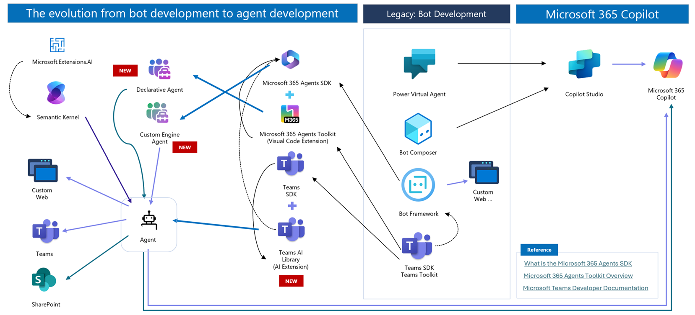

## **Azure OpenAI and Reference Architecture**

### **Table of Contents**

- [Azure OpenAI vs OpenAI](#azure-openai-vs-openai)
- [Microsoft Azure OpenAI LLM Framework](#microsoft-azure-openai-llm-framework)
- [Microsoft Copilot](#microsoft-copilot)
- [Azure AI Services](#azure-ai-services)
- [Microsoft Research](#microsoft-research)
- [Azure Reference Architectures](#azure-reference-architectures)

---

### **Azure OpenAI vs OpenAI**

1. OpenAI offers the latest features and models, while Azure OpenAI provides a reliable, secure, and compliant environment with seamless integration into other Azure services.
2. Azure OpenAI supports `private networking`, `role-based authentication`, and `responsible AI content filtering`.
3. Azure OpenAI does not use user input as training data for other customers. [Data, privacy, and security for Azure OpenAI✍️](https://learn.microsoft.com/en-us/legal/cognitive-services/openai/data-privacy). Azure OpenAI does not share user data, including prompts and responses, with OpenAI.

- [What is Azure OpenAI Service?✍️](https://learn.microsoft.com/en-us/azure/cognitive-services/openai/overview)
- [Azure OpenAI Models](https://ai.azure.com/explore/models) | [Open AI Models](https://platform.openai.com/docs/models)
- [Abuse Monitoring✍️](https://learn.microsoft.com/en-us/legal/cognitive-services/openai/data-privacy): To detect and mitigate abuse, Azure OpenAI stores all prompts and generated content securely for up to thirty (30) days. (No prompts or completions are stored if the customer chooses to turn off abuse monitoring.)
- 🏆[Data Science Toolkit](https://www.ds-toolkit.com/)
- 🏆`github organizations`: 🌐[Azure](https://github.com/Azure) | 🏬[Azure-samples](https://github.com/Azure-Samples) | 🏛️[Microsoft](https://github.com/Microsoft) | 👥[MSUSAzureAccelerators](https://github.com/MSUSAzureAccelerators)

### **Microsoft Azure OpenAI LLM Framework**

#### LLM Integration Frameworks

1. [Artificial Intelligence Controller Interface (AICI)✨](https://github.com/microsoft/aici): a framework that enhances real-time control of Large Language Model outputs using secure, sandboxed controllers written in various languages like Rust and Python. [Sep 2023] 
1. [Azure ML Prompt Flow✍️](https://learn.microsoft.com/en-us/azure/machine-learning/prompt-flow/overview-what-is-prompt-flow) (Jun 2023): A visual designer for prompt crafting using Jinja as a prompt template language. / [✍️](https://techcommunity.microsoft.com/t5/ai-machine-learning-blog/harness-the-power-of-large-language-models-with-azure-machine/ba-p/3828459) / [✨](https://github.com/microsoft/promptflow)
 
1. [Kernel Memory✨](https://github.com/microsoft/kernel-memory) (Jul 2023): An open-source service and plugin for efficient dataset indexing through custom continuous data hybrid pipelines.
 
1. [Microsoft Agent Framework✨](https://github.com/microsoft/agent-framework):🏆Unified SDK (Semantic Kernel & AutoGen), Graph-based Workflows, DevUI, Built-in connectors, MCP + A2A + OpenAPI [Apr 2025] / [Blog✍️](https://devblogs.microsoft.com/foundry/introducing-microsoft-agent-framework-the-open-source-engine-for-agentic-ai-apps/) 
1. [Semantic Kernel✍️](https://devblogs.microsoft.com/semantic-kernel/) (Feb 2023): An open-source SDK for integrating AI services like OpenAI, Azure OpenAI, and Hugging Face with conventional programming languages such as C# and Python. It's an LLM orchestrator, similar to LangChain. / [✨](https://github.com/microsoft/semantic-kernel) 
 

- A Memory in Semantic Kernel vs Kernel Memory (formerly Semantic Memory) is designed to handle large datasets and extended conversations, with the memory pipeline deployed as a separate service. [✨](https://github.com/microsoft/chat-copilot/tree/main/memorypipeline)

#### Prompt

1. [GenAIScript✨](https://github.com/microsoft/genaiscript) (Aug 2023): Orchestrate LLMs, tools, and data in a single JavaScript. 
1. [guidance✨](https://github.com/microsoft/guidance) (Nov 2022): A domain-specific language (DSL) for controlling large language models, focusing on model interaction and implementing the "Chain of Thought" technique.
 
1. [LMOps✨](https://github.com/microsoft/LMOps) (Dec 2022): A toolkit for improving text prompts used in generative AI models, including tools like Promptist for text-to-image generation and Structured Prompting.
 
1. [LLMLingua✨](https://github.com/microsoft/LLMLingua) (Jul 2023): A tool for compressing prompts and KV-Cache, achieving up to 20x compression with minimal performance loss. LLMLingua-2 was released in Mar 2024.
 
1. [Prompty✨](https://github.com/microsoft/prompty) (Apr 2024): A template language for integrating prompts with LLMs and frameworks, enhancing prompt management and evaluation.
 
1. [PromptBench✨](https://github.com/microsoft/promptbench) (Jun 2023): A unified evaluation framework for large language models.
 
1. [Prompt Engine✨](https://github.com/microsoft/prompt-engine) (Jun 2022): A tool for crafting prompts for large language models in Python. / [Python✨](https://github.com/microsoft/prompt-engine-py)
  
1. [SAMMO✨](https://github.com/microsoft/sammo) (Apr 2024): A general-purpose framework for prompt optimization. / [✍️](https://www.microsoft.com/en-us/research/blog/sammo-a-general-purpose-framework-for-prompt-optimization/)
 
1. [TypeChat](https://microsoft.github.io/TypeChat/blog/introducing-typechat) (Apr 2023): A tool that replaces prompt engineering with schema engineering, designed to build natural language interfaces using types. / [✨](https://github.com/microsoft/Typechat)
 

#### Agent

1. [Agent Lightning✍️](https://github.com/microsoft/agent-lightning): Train and optimize agents (including RL, prompt‑optimization, multi‑agent workflows) [Jun 2025] 
1. [AIOpsLab✍️](https://www.microsoft.com/en-us/research/blog/aiopslab-building-ai-agents-for-autonomous-clouds/): Building AI agents for autonomous clouds. AI agents for incident root cause analysis (RCA) [✨](https://github.com/microsoft/AIOpsLab/
) [20 Dec 2024] 
1. [Autogen✨](https://github.com/microsoft/autogen) (Mar 2023): A customizable and conversable agent framework. / [✍️](https://www.microsoft.com/en-us/research/blog/autogen-enabling-next-generation-large-language-model-applications/) / [Autogen Studio✍️](https://www.microsoft.com/en-us/research/blog/introducing-autogen-studio-a-low-code-interface-for-building-multi-agent-workflows/) (June 2024) 
    - **Autogen** has two variants: **Community-driven (AG2)** — available via `pyautogen` (or its aliases `autogen` or `ag2`) [ag2✨](https://github.com/ag2ai/ag2)  **Microsoft-driven (autogen)** — from v0.4, install using `pip install autogen-agentchat`
1. [ExACT✨](https://github.com/microsoft/ExACT): An open-source project enabling agents to learn from past interactions and improve search efficiency dynamically. Monte Carlo Tree Search (MCTS).  [Dec 2024]
1. [JARVIS✨](https://github.com/microsoft/JARVIS) (Mar 2023): An interface for LLMs to connect numerous AI models for solving complex AI tasks.
 
1. [Magentic-One✍️](https://aka.ms/magentic-one): Built on AutoGen. A Generalist Multi-Agent System for Solving Complex Tasks [Nov 2024]
1. [OmniParser✨](https://github.com/microsoft/OmniParser) (Sep 2024): A simple screen parsing tool towards pure vision based GUI agent.
 
1. [qlib✨](https://github.com/microsoft/qlib): Qlib is an AI-driven quantitative investment platform that supports diverse machine learning models—from research to production—including supervised learning, market dynamics, and reinforcement learning. [Aug 2020] 
1. [RD-Agent✨](https://github.com/microsoft/RD-Agent): open source R&D automation tool [✍️](https://rdagent.azurewebsites.net/) [Apr 2024]
 
1. [Semantic Workbench✨](https://github.com/microsoft/semanticworkbench) (Aug 2024): A development tool for creating intelligent agents. / [✍️](https://techcommunity.microsoft.com/t5/ai-ai-platform-blog/introducing-semantic-workbench-your-gateway-to-agentic-ai/ba-p/4212695)
 
1. [TaskWeaver✨](https://github.com/microsoft/TaskWeaver) (Sep 2023): A code-first agent framework for converting natural language requests into executable code with support for rich data structures and domain-adapted planning.
 
1. [TinyTroupe✨](https://github.com/microsoft/TinyTroupe): LLM-powered multiagent persona simulation for imagination enhancement and business insights. [Mar 2024] 
1. [UFO✨](https://github.com/microsoft/UFO) (Mar 2024): A UI-focused agent for Windows OS interaction.
 
1. [Vanilla AI Agents✨](https://github.com/Azure-Samples/vanilla-aiagents): Lightweight library demonstrating how to create agenting application without using any specific framework. [Dec 2024] 
1. [Windows Agent Arena (WAA)✨](https://github.com/microsoft/WindowsAgentArena): a scalable Windows AI agent platform for testing and benchmarking multi-modal, desktop AI agents. [Sep 2024] 

- [Understanding Microsoft's Latest Multi-Agent Systems✍️](https://techcommunity.microsoft.com/blog/machinelearningblog/the-evolution-of-ai-frameworks-understanding-microsofts-latest-multi-agent-syste/4339739): AutoGen 0.4 vs Magentic-One vs and TinyTroupe [27 Nov 2024]

#### Deep learning

1. [BitNet✨](https://github.com/microsoft/BitNet): Official inference framework for 1-bit LLMs [Aug 2024]

1. [DeepSpeed✨](https://github.com/microsoft/DeepSpeed) (May 2020): A deep learning optimization library for easy, efficient, and effective distributed training and inference, featuring the Zero Redundancy Optimizer.
 
1. [FLAML✨](https://github.com/microsoft/FLAML) (Dec 2020): A lightweight Python library for efficient automation of machine learning and AI operations, offering interfaces for AutoGen, AutoML, and hyperparameter tuning.
 
1. [Foundation Models (aka large-scale pre-trained models)✨](https://github.com/microsoft/unilm): Foundation Models & Foundation Architectures [Mar 2020]

#### Risk Identification & LLMOPs

1. [AI Central✨](https://github.com/microsoft/AICentral) (Oct 2023): An AI Control Center for monitoring, authenticating, and providing resilient access to multiple OpenAI services.
 
1. [Azure AI Evaluation SDK✍️](https://learn.microsoft.com/en-us/azure/ai-studio/how-to/develop/evaluate-sdk) (Oct 2024): Evaluate with the prompt flow SDK has been retired and replaced with Azure AI Evaluation SDK.
1. [PyRIT✨](https://github.com/Azure/PyRIT) (Dec 2023): Python Risk Identification Tool for generative AI, focusing on LLM robustness against issues like hallucination, bias, and harassment.
 

#### Data processing

- [markitdown✨](https://github.com/microsoft/markitdown):💡Python tool for converting files and office documents to Markdown. [14 Nov 2024] 
- [Microsoft Fabric✍️](https://learn.microsoft.com/en-us/fabric/): Fabric integrates technologies like Azure Data Factory, Azure Synapse Analytics, and Power BI into a single unified product [May 2023]
- [NLWeb✨](https://github.com/microsoft/NLWeb):💡Conversational Interfaces for the Web. Support MCP, Schema.org, and RSS. [📺](https://youtu.be/EF6uywH-Yzo) [Apr 2025] 
- [Presidio✨](https://github.com/microsoft/presidio): Presidio (Origin from Latin praesidium ‘protection, garrison’). Context aware, pluggable and customizable data protection and de-identification SDK for text and images. [Oct 2019]

#### Dev Toolkit

- [Data Formulator✨](https://github.com/microsoft/data-formulator): Create Rich Visualizations with AI [28 Aug 2024] 
- [Document: AI Toolkit for Visual Studio Code✨](https://github.com/microsoft/vscode-ai-toolkit): AI Toolkit for Visual Studio Code extension [Dec 2023] 
- [Github Copilot Chat extension for VS Code✨](https://github.com/microsoft/vscode-copilot-chat):💡Copilot Chat extension for VS Code [June 2025] 
- [Powershell: AIShell✨](https://github.com/PowerShell/AIShell): An interactive shell to work with AI-powered assistance providers [Apr 2023] 

### **Microsoft Copilot**

#### **Copilot Products**

- [An AI companion for everyone✍️](https://blogs.microsoft.com/blog/2024/10/01/an-ai-companion-for-everyone/): Copilot’s next phase (Copilot Voice, Copilot Daily, Copilot Vision, CoT, and others.) [1 Oct 2024]
- [Copilot Scenario Library](https://adoption.microsoft.com/en-us/copilot-scenario-library/)
- [Copilot Vision✍️](https://www.microsoft.com/en-us/microsoft-copilot/blog/2024/12/05/copilot-vision-now-in-preview-a-new-way-to-browse/): Available only on Microsoft Edge: See the page, read along, and solve problems together. [05 Dec 2024]
- `Microsoft Copilot in Windows` vs `Microsoft Copilot` (= Copilot in Windows + Bing + Commercial Data Protection; formerly Bing Chat) vs `Microsoft 365 Copilot` (= Microsoft Copilot + Microsoft 365 Integration) [Nov 2023]
- [Microsoft 365 Copilot Chat✍️](https://aka.ms/copilotchat): Chat experience (Free tier) + Pay-as-you-go agents [15 Jan 2025]
- [Microsoft 365 Copilot Wave 2 Spring✍️](https://www.microsoft.com/en-us/microsoft-365/blog/2025/04/23/microsoft-365-copilot-built-for-the-era-of-human-agent-collaboration/): Researcher and Analyst agent, Copilot Notebooks, Copilot Search, Copilot Control System, Memory and personalization, Create, Skills agent [23 Apr 2025]
- **Azure**
  - [Copilot in Azure Quantum✍️](https://learn.microsoft.com/en-us/azure/quantum/get-started-azure-quantum) [June 2023]
  - [Microsoft Copilot for Azure✍️](https://learn.microsoft.com/en-us/azure/copilot) / [✍️](https://techcommunity.microsoft.com/t5/azure-infrastructure-blog/simplify-it-management-with-microsoft-copilot-for-azure-save/ba-p/3981106) [Nov 2023]
  - [Security Copilot✍️](https://learn.microsoft.com/en-us/security-copilot/microsoft-security-copilot) / [✍️](https://blogs.microsoft.com/blog/2023/03/28/introducing-microsoft-security-copilot-empowering-defenders-at-the-speed-of-ai/) [March 2023]
- **Microsoft 365 (Incl. Dynamics 365 and Power Platform)**
  - [Copilot Pages✍️](https://techcommunity.microsoft.com/en-us/microsoft-365-copilot/announcing-copilot-pages-for-multiplayer-collaboration/ba-p/4242701): Copilot Pages is a dynamic, persistent canvas in Copilot chat designed for multiplayer AI collaboration [16 Sep 2024]
  - [Copilot Pro✍️](https://support.microsoft.com/en-us/copilot-pro): Copilot Pro offers all the features of Copilot, plus faster responses, priority access to advanced models, personalized GPTs, integration with Microsoft 365 apps, and enhanced AI image creation. [Jan 2024]
  - Copilot in Power Platform: [Power App AI Copilot✍️](https://learn.microsoft.com/en-us/power-apps/maker/canvas-apps/ai-overview) [March 2023] / [Power Automate✍️](https://powerautomate.microsoft.com/en-us/blog/copilot-in-power-automate-new-time-saving-experiences-announced-at-microsoft-ignite-2023/): [Copilot in cloud flows✍️](https://learn.microsoft.com/en-us/power-automate/get-started-with-copilot), [Copilot in Process Mining ingestion✍️](https://learn.microsoft.com/en-us/power-automate/process-mining-copilot-in-ingestion), [Copilot in Power Automate for desktop✍️](https://learn.microsoft.com/en-us/power-automate/desktop-flows/copilot-in-power-automate-for-desktop) ... [Nov 2023]
  - [Dynamics 365 Copilot✍️](https://learn.microsoft.com/en-us/microsoft-cloud/dev/copilot/copilot-for-dynamics365) / [✍️](https://blogs.microsoft.com/blog/2023/03/06/introducing-microsoft-dynamics-365-copilot/) [March 2023]
    - [10 new autonomous agents in Microsoft Dynamics 365✍️](https://www.microsoft.com/en-us/dynamics-365/blog/business-leader/2024/10/21/transform-work-with-autonomous-agents-across-your-business-processes/) [21 Oct 2024] | [Sales Copilot✍️](https://learn.microsoft.com/en-us/microsoft-sales-copilot) | [Service Copilot](https://cloudblogs.microsoft.com/dynamics365/it/2023/11/15/announcing-microsoft-copilot-for-service/)
  - [Microsoft 365 Copilot✍️](https://learn.microsoft.com/en-us/microsoft-365-copilot/microsoft-365-copilot-overview) / [✍️](https://blogs.microsoft.com/blog/2023/03/16/introducing-microsoft-365-copilot-your-copilot-for-work/) [Nov 2023]
  - Microsoft Fabric and Power BI: [✍️](https://powerbi.microsoft.com/en-us/blog/empower-power-bi-users-with-microsoft-fabric-and-copilot/) / [Fabric Copilot✍️](https://learn.microsoft.com/en-us/fabric/get-started/copilot-fabric-overview) / [PowerBI Copilot✍️](https://learn.microsoft.com/en-us/power-bi/create-reports/copilot-introduction) [March 2024]
  - Microsoft Viva Copilot [✍️](https://www.microsoft.com/en-us/microsoft-365/blog/2023/04/20/introducing-copilot-in-microsoft-viva-a-new-way-to-boost-employee-engagement-and-performance/) [April 2023]
  - [Team Copilot✍️](https://www.microsoft.com/en-us/microsoft-365/blog/2024/05/21/new-agent-capabilities-in-microsoft-copilot-unlock-business-value/): Act as a valuable team member (Meeting facilitator, Group collaborator, Project manager) [May 2024]
- **Windows, Bing and so on**
  - [Copilot+ PC✍️](https://blogs.microsoft.com/blog/2024/05/20/introducing-copilot-pcs/): AI-powered and NPU-equipped Windows PCs [May 2024]
  - [Github Copilot](https://docs.github.com/en/copilot/getting-started-with-github-copilot) [Oct 2021]
  - [Microsoft Clarity Copilot✍️](https://learn.microsoft.com/en-us/clarity/copilot/clarity-copilot): [✍️](https://clarity.microsoft.com/blog/clarity-copilot/) [March 2023]
  - [Microsoft Copilot](https://copilot.microsoft.com/): FKA. Bing Chat Enterprise [Nov 2023]
  - [Microsoft Copilot in Windows✍️](https://learn.microsoft.com/en-us/copilot/copilot) [Sep 2023]
  - [Nuance DAX Copilot](https://www.nuance.com/healthcare/dragon-ai-clinical-solutions/dax-copilot.html): AI assistant for automated clinical documentation [18 Jan 2024]
  - [Windows Copilot Runtime✍️](https://blogs.windows.com/windowsdeveloper/2024/05/21/unlock-a-new-era-of-innovation-with-windows-copilot-runtime-and-copilot-pcs/): The set of APIs powered by the 40+ on-device models, a new layer of Windows. [May 2024] -> [Windows AI Foundry✍️](https://developer.microsoft.com/en-us/windows/ai/): an evolution of Windows Copilot Runtime, a platform to streamline AI development on Windows. [May 2025]
- [Build 2025✍️](https://news.microsoft.com/build-2025-book-of-news/): Advancements in AI agents, Azure AI Foundry, Microsoft 365 Copilot APIs, MCP in Copilot Studio &  Dynamics 365, GitHub Copilot, Cosmos DB in Microsoft Fabric, and new capabilities in Windows for AI development. [May 2025]

#### **Agent Development**

1. [AI Agents for Beginners - A Course✨](https://github.com/microsoft/ai-agents-for-beginners): 10 Lessons to Get Started Building AI Agents [Jan 2025]
1. [Agents in Power Platform✍️](https://www.microsoft.com/en-us/power-platform/blog/2024/11/19/redefine-development-ai-first-innovation-with-agents-and-microsoft-copilot-in-power-platform/) [19 Nov 2024]
1. [Agent builder & Plan designer in Power Apps✍️](https://www.microsoft.com/en-us/power-platform/blog/power-apps/build-user-focused-intelligent-solutions-in-power-apps-start-with-a-plan/)
1. [Combine Copilot Agents with Office Add-ins✍️](https://devblogs.microsoft.com/microsoft365dev/office-addins-at-build-2025/): Developers can now enhance Copilot with Office add-in actions for natural language interaction with Office documents. [22 May 2025]
1. From Bots to Agents: The Evolution of Copilot Development [4 Jun 2025]  
    
1. [Introducing Copilot Actions, new agents, Copilot Control System✍️](https://www.microsoft.com/en-us/microsoft-365/blog/2024/11/19/introducing-copilot-actions-new-agents-and-tools-to-empower-it-teams/)
    - Employee Self-Service Agent: Automates HR/IT tasks (in private preview).
    - Facilitator Agent: Summarizes meetings and takes notes, helping teams track discussions and action items.
    - Interpreter Agent: Real-time speech-to-speech translation in Microsoft Teams for multilingual meetings. (public preview in early 2025)
    - Project Manager agent: Planner app in Teams.
1. [SharePoint Agent✍️](https://techcommunity.microsoft.com/blog/microsoft365copilotblog/ignite-2024-agents-in-sharepoint-now-in-general-availability/4298746): Turn SharePoint sites and documents into interactive agents.
1. [Microsoft 365 Agents SDK✍️](https://devblogs.microsoft.com/microsoft365dev/introducing-the-microsoft-365-agents-sdk/): The evolution of the Bot Framework [✨](https://github.com/microsoft/agents) [19 Nov 2024]
1. [Microsoft Discovery✍️](https://azure.microsoft.com/en-us/blog/transforming-rd-with-agentic-ai-introducing-microsoft-discovery/): Graph-based scientific co-reasoning. Specialized discovery agents for conducting research. ​[19 May 2025]
1. [Microsoft Entra Agent ID✍️](https://techcommunity.microsoft.com/blog/microsoft-entra-blog/announcing-microsoft-entra-agent-id-secure-and-manage-your-ai-agents/3827392): Automatically registers AI agents from Copilot Studio and Azure AI Foundry in Microsoft Entra admin center, enabling easy tracking, governance, and lifecycle management. [20 May 2025]

#### **Copilot Development**

1. [Community contributed samples for the Microsoft 365 Copilot✨](https://github.com/pnp/copilot-pro-dev-samples) [Sep 2024]  
1. [Azure AI Agent Service✍️](https://techcommunity.microsoft.com/blog/azure-ai-services-blog/introducing-azure-ai-agent-service/4298357): a fully managed platform for creating an agent on Azure AI Foundry [19 Nov 2024]
1. [Azure AI Foundry (rebranding of Azure AI Studio)✍️](https://learn.microsoft.com/en-us/azure/ai-studio/what-is-ai-studio): [Generative AI Developmet Hub✍️](https://azure.microsoft.com/en-us/products/ai-studio) + Promptflow + Azure AI Content safety / [📺](https://www.youtube.com/watch?v=Qes7p5w8Tz8) / [SDK and CLI✍️](https://learn.microsoft.com/en-us/azure/ai-studio/how-to/sdk-generative-overview)
1. [Agent Evaluation in Microsoft Copilot Studio](https://www.microsoft.com/en-us/microsoft-copilot/blog/copilot-studio/build-smarter-test-smarter-agent-evaluation-in-microsoft-copilot-studio/): ✍️Structured, automated testing solution directly in Copilot Studio.
1. [Microsoft AI](http://microsoft.com/ai): The age of copilots: [✍️](https://www.linkedin.com/pulse/age-copilots-satya-nadella-2hllc) [Nov 2023]
1. [Copilot Tuning✍️](https://techcommunity.microsoft.com/blog/microsoft365copilotblog/introducing-microsoft-365-copilot-tuning/4414762): Train models and create agents using company data in a simple, low-code way with Copilot Studio. [May 2025]
1. [Microsoft Copilot Dashboard](https://insights.cloud.microsoft/#/CopilotDashboard) / [✍️](https://techcommunity.microsoft.com/t5/microsoft-viva-blog/new-ways-microsoft-copilot-and-viva-are-transforming-the/ba-p/3982293)
1. [Microsoft Copilot Studio✍️](https://learn.microsoft.com/en-us/microsoft-copilot-studio/): Customize Copilot for Microsoft 365. FKA. Power Virtual Agents: [✍️](https://www.microsoft.com/en-us/copilot/microsoft-copilot-studio) [Nov 2023]
1. [Microsoft 365 Copilot - App Builder and Workflows](https://www.microsoft.com/en-us/microsoft-365/blog/2025/10/28/microsoft-365-copilot-now-enables-you-to-build-apps-and-workflows/): ✍️Build working apps & workflows using natural language.
1. The Copilot System: Explained by Microsoft [📺](https://www.youtube.com/watch?v=E5g20qmeKpg) [Mar 2023]
1. [Copilot Studio Monthly updates](https://www.microsoft.com/en-us/microsoft-copilot/blog/copilot-studio/cs-content-type/monthly-updates/)
1. [What’s new in Copilot Studio: March 2025✍️](https://www.microsoft.com/en-us/microsoft-copilot/blog/copilot-studio/whats-new-in-copilot-studio-march-2025/): Autonomous agents, deep reasoning, agent flows, generative orchestration, Model Context Protocol, tools/prompts in Copilot Studio, open web search, Microsoft-built agents in Copilot Studio, and private preview of GPT-4.5 now available. [31 Mar 2025]
1. Copilot Studio lite (formerly called the Microsoft 365 agent builder): [Sep 2025]

### **Azure AI Search**

- Azure AI Search (FKA Azure Cognitive Search) supports Hybrid Search, Pure Vector Search, Semantic Hybrid Search, and Text Search. doc:[✍️](https://learn.microsoft.com/en-us/azure/search/) / blog:[✍️](https://azure.microsoft.com/en-us/blog/product/azure-ai-search) / [✨](https://github.com/Azure-Samples/azureai-samples?tab=readme-ov-file#azure-ai-search)
- Azure Cognitive Search rebranding Azure AI Search, it supports Vector search and semantic ranker. [16 Nov 2023]
- A set of capabilities designed to improve relevance in these scenarios. We use a combination of hybrid retrieval (vector search + keyword search) + semantic ranking as the most effective approach for improved relevance out-of–the-box. `TL;DR: Retrieval Performance; Hybrid search + Semantic rank > Hybrid search > Vector only search > Keyword only` [✍️](https://techcommunity.microsoft.com/t5/azure-ai-services-blog/azure-cognitive-search-outperforming-vector-search-with-hybrid/ba-p/3929167) [18 Sep 2023]  
  
- [Agentic retrieval in Azure AI Search✍️](https://techcommunity.microsoft.com/blog/azure-ai-services-blog/introducing-agentic-retrieval-in-azure-ai-search/4414677): An automated query engine that creates and runs its own retrieval plan for relevant results to complex questions. [20 May 2025]
- 🏬[Azure AI Search Demos using Jupyter Notebook✨](https://github.com/Azure-Samples/rag-with-azure-ai-search-notebooks): Jupyter notebooks that demonstrate vector search, hybrid search, image search, RAG, and evaluation. [Sep 2024] 
- 🏬[Azure AI Search OpenAI Purview Data Security Demo✨](https://github.com/Azure-Samples/azure-search-openai-demo-purviewdatasecurity): Demo integrating Azure Search, OpenAI, and Purview data security [Jun 2025]

- [Azure AI Search Python Playground✨](https://github.com/farzad528/azure-ai-search-python-playground):  a collection of Jupyter notebooks designed to explore the various capabilities of Azure AI Search. [Feb 2024]
- 🏬[Azure AI Search Multimodal Sample✨](https://github.com/Azure-Samples/azure-ai-search-multimodal-sample) [May 2025] 
- 🏬[Azure AI Search Power Skills✨](https://github.com/Azure-Samples/azure-search-power-skills): Custom skills for Azure AI Search [Jun 2019] 
- 🏬[ChatGPT + Enterprise data RAG (Retrieval-Augmented Generation)✨](https://github.com/Azure-Samples/azure-search-openai-demo) [Feb 2023]
  
- [Document-level access control✍️](https://learn.microsoft.com/en-us/azure/search/search-document-level-access-overview): Document-level access helps restrict content visibility to authorized users, based on predefined access rules. [20 May 2025]
- Hybrid search using Reciprocal Rank Fusion (RRF): Reciprocal Rank Fusion (RRF) is an algorithm that evaluates the search scores from multiple, previously ranked results to produce a unified result set. In Azure Cognitive Search, RRF is used whenever there are two or more queries that execute in parallel. [✍️](https://learn.microsoft.com/en-us/azure/search/hybrid-search-ranking)  
  
- In the vector databases category within Azure, several alternative solutions are available. However, the only option that provides a range of choices, including a conventional Lucene-based search engine and a hybrid search incorporating vector search capabilities.
- [Integrated vectorization✍️](https://techcommunity.microsoft.com/t5/ai-azure-ai-services-blog/integrated-vectorization-with-azure-openai-for-azure-ai-search/ba-p/4206836): Automatically splits documents into chunks, creates embeddings with Azure OpenAI, maps them to an Azure AI Search index, and automates query vectorization. [24 Aug 2024]
- 🏬[Python samples for Azure AI Search✨](https://github.com/Azure-Samples/azure-search-python-samples) [Apr 2019] 
- [RAG-Knowledge✨](https://github.com/microsoft/RAG-Knowledge):💡Sample code for Data Preprocessing, Chunking, Index Design, Query Optimization [Jun 2024]
- Vector Search Sample Code: [✨](https://github.com/Azure/azure-search-vector-samples) [Apr 2023]
  
- 🏬[REST examples for Azure AI Search✨](https://github.com/Azure-Samples/azure-search-rest-samples) [Apr 2019] 

### **Azure AI Services**

- [Artificial intelligence (AI) architecture design✍️](https://learn.microsoft.com/en-us/azure/architecture/ai-ml/):💡Overview Azure AI services, AI development platforms and tools
- [Assistants API✍️](https://techcommunity.microsoft.com/t5/ai-azure-ai-services-blog/azure-openai-service-announces-assistants-api-new-models-for/ba-p/4049940): Code Interpreter, Function calling, Knowledge retrieval tool, and Threads (Truncated and optimized conversation history for the model's context length) in Azure [06 Feb 2024]
- [Azure AI Foundry](https://ai.azure.com/): Azure AI Foundry portal (formerly Azure AI Studio), and the [Azure AI Foundry SDK✍️](https://aka.ms/aifoundrysdk/reference), our unified SDK with pre-built app templates. `Rebranding for Enhancement: Azure Machine Learning Studio > Azure AI Studio > Azure AI Foundry.` [✍️](https://azure.microsoft.com/en-us/blog/the-next-wave-of-azure-innovation-azure-ai-foundry-intelligent-data-and-more/) / [✍️](https://learn.microsoft.com/en-us/azure/ai-studio/): Documentation [19 Nov 2024]
  - [Azure AI Agent Service✍️](https://techcommunity.microsoft.com/blog/azure-ai-services-blog/introducing-azure-ai-agent-service/4298357): Public-preview
  - [Azure AI Content Understanding✍️](https://techcommunity.microsoft.com/blog/azure-ai-services-blog/announcing-azure-ai-content-understanding-transforming-multimodal-data-into-insi/4297196)
  - [Azure AI Foundry Agent Service✍️](https://techcommunity.microsoft.com/blog/azure-ai-services-blog/announcing-general-availability-of-azure-ai-foundry-agent-service/4414352): General Availability [20 May 2025]
  - [Azure AI Foundry Fine Tuning✍️](https://techcommunity.microsoft.com/blog/aiplatformblog/what%E2%80%99s-new-in-azure-ai-foundry-fine-tuning/4413873): SFT: non-reasoning models, DPO: GPT-4o, RFT: supported by reasoning models, GPT o4-mini [20 May 2025]
  - [Introducing Deep Research in Azure AI Foundry Agent Service✍️](https://azure.microsoft.com/en-us/blog/introducing-deep-research-in-azure-ai-foundry-agent-service): API and software development kit (SDK)-based offering of OpenAI’s advanced agentic research [7 Jul 2025]
  - [Weights & Biases with Azure✍️](https://aka.ms/WBFineTuningPartnership)
- Azure OpenAI Service Offerings
  1. Offering: Standard (Default), Batch (Low-cost, Huge workload), Provisioned (High performance)
  1. Offering Region types: Global (World wide), Data_zones (Zone based), Regional (Region based)
- Customer Copyright Commitment: protects customers from certain IP claims related to AI-generated content. [✍️](https://learn.microsoft.com/en-us/legal/cognitive-services/openai/customer-copyright-commitment) [16 Nov 2023]
- [Models as a Service (MaaS)✍️](https://www.linkedin.com/pulse/model-service-maas-revolutionizing-ai-azure-shibu-kt): A cloud-based AI approach that provides developers and businesses with access to pre-built, pre-trained machine learning models. [Jul 2023]

<!-- 
#### .old
- Azure OpenAI Service On Your Data in Public Preview [✍️](https://techcommunity.microsoft.com/t5/ai-cognitive-services-blog/introducing-azure-openai-service-on-your-data-in-public-preview/ba-p/3847000) [19 Jun 2023]
- Copilot (FKA. Bing Chat Enterprise) [18 Jul 2023] [Privacy and Protection✍️](https://learn.microsoft.com/en-us/bing-chat-enterprise/privacy-and-protections#protected-by-default)
  1. Doesn't have plugin support
  1. Only content provided in the chat by users is accessible to Bing Chat Enterprise. 
- Azure OpenAI Finetuning: Babbage-002 is $34/hour, Davinci-002 is $68/hour, and Turbo is $102/hour. [✍️](https://techcommunity.microsoft.com/t5/azure-ai-services-blog/fine-tuning-now-available-with-azure-openai-service/ba-p/3954693) [16 Oct 2023]
-->

#### **Vector Database Options for Azure**

- [Azure Cache for Redis Enterprise✍️](https://techcommunity.microsoft.com/t5/azure-developer-community-blog/introducing-vector-search-similarity-capabilities-in-azure-cache/ba-p/3827512): Enterprise [Redis Vector Search Demo](https://ecommerce.redisventures.com/) [22 May 2023 ]
- [Azure SQL's support for natively storing and querying vectors✍️](https://devblogs.microsoft.com/azure-sql/announcing-eap-native-vector-support-in-azure-sql-database/) [21 May 2024]
- [DiskANN✨](https://github.com/microsoft/DiskANN), a state-of-the-art suite of algorithms for low-latency, highly scalable vector search, is now generally available in [Azure Cosmos DB✍️](https://aka.ms/ignite24/cosmosdb/blog1) and in preview for Azure Database for PostgreSQL. [19 Nov 2024]
- [Exact Nearest Neighbor (ENN)✍️](https://devblogs.microsoft.com/cosmosdb/exact-nearest-neighbor-enn-vector-search/):  vCore-based Azure Cosmos DB for MongoDB. Slower, high accuracy, and designed for small data sets. [1 Apr 2025]
- GraphRAG, available in preview in [Azure Database for PostgreSQL✍️](https://aka.ms/Ignite24/PostgreSQLAI) [19 Nov 2024]
- [Pgvector extension on Azure Cosmos DB for PostgreSQL✍️](https://azure.microsoft.com/en-us/updates/generally-available-pgvector-extension-on-azure-cosmos-db-for-postgresql/): [✍️](https://python.langchain.com/docs/modules/data_connection/vectorstores/integrations/pgvector) [13 Jun 2023]
- [Vector search - Azure AI Search✨](https://github.com/Azure/azure-search-vector-samples): [✍️](https://python.langchain.com/docs/modules/data_connection/vectorstores/integrations/azuresearch) Rebranded from Azure Cognitive Search [Oct 2019] to Azure AI Search [Nov 2023]
 
- [Vector Search in Azure Cosmos DB for MongoDB vCore✍️](https://devblogs.microsoft.com/cosmosdb/introducing-vector-search-in-azure-cosmos-db-for-mongodb-vcore/) [23 May 2023]

**Note**: Azure Cache for Redis Enterprise: Enterprise Sku series are not able to deploy by a template such as Bicep and ARM.

### **Microsoft Research**

1. [AutoGen Studio📑](https://alphaxiv.org/abs/2408.15247): A No-Code Developer Tool for Building and Debugging Multi-Agent Systems [9 Aug 2024]
1. [Azure AI Foundry Labs](https://ai.azure.com/labs/):💡Research driven tools and experimental projects.
1. [Data Formulator📑](https://alphaxiv.org/abs/2309.10094) [18 Sep 2023] | [Data Formulator 2📑](https://alphaxiv.org/abs/2408.16119):💡Iterative Creation of Data Visualizations, with AI Transforming Data Along the Way [✨](https://github.com/microsoft/data-formulator) [21 Feb 2025]
1. [GraphRAG (by Microsoft)📑](https://alphaxiv.org/abs/2404.16130):💡RAG with a graph-based approach to efficiently answer both specific and broad questions over large text corpora1. [✍️](https://microsoft.github.io/graphrag) / [✨](https://github.com/microsoft/graphrag) [24 Apr 2024]

1. [Knowledge-Augmented Large Language Models for Personalized Contextual Query Suggestion📑](https://alphaxiv.org/abs/2311.06318): K-LaMP. Contextual memory layer for LLM application [10 Nov 2023]
1. [Magentic-One✍️](https://aka.ms/magentic-one): A Generalist Multi-Agent System for Solving Complex Tasks [Nov 2024]
    - [Magentic-UI](www.microsoft.com/en-us/research/blog/magentic-ui-an-experimental-human-centered-web-agent/): Magentic-UI, built on Magentic-One, can browse the web, run Python and shell code, and process files. [19 May 2025 ]
1. [MarS: A Financial Market Simulation Engine Powered by Generative Foundation Model✨](https://github.com/microsoft/MarS) [4 Sep 2024] 
1. [MatterGen✍️](https://www.microsoft.com/en-us/research/blog/mattergen-a-new-paradigm-of-materials-design-with-generative-ai/): a generative model for inorganic materials design [✨](https://github.com/microsoft/mattergen) [13 May 2024] 
1. [Microsoft AI Diagnostic Orchestrator (MAI-DxO)📑](https://alphaxiv.org/abs/2506.22405): Multi-Agent System. Accurately diagnoses up to 85% of NEJM case proceedings, which is over four times the rate achieved by a group of experienced physicians [30 June 2025 ]
1. [Microsoft Office Copilot: Natural Language Commanding via Program Synthesis📑](https://alphaxiv.org/abs/2306.03460): [[🔢](https://scholar.google.com/scholar?hl=en&as_sdt=0%2C5&q=arxiv%3A+2306.03460)]:💡Semantic Interpreter, a natural language-friendly AI system for productivity software such as Microsoft Office that leverages large language models (LLMs) to execute user intent across application features. [6 Jun 2023]
1. [NL2KQL📑](https://alphaxiv.org/abs/2404.02933): From Natural Language to Kusto Query [3 Apr 2024]
1. [Optimizing Model Selection for Compound AI Systems📑](https://alphaxiv.org/abs/2502.14815): a framework that automatically optimizes model selection for compound AI systems [20 Feb 2025] [✨](https://github.com/LLMSELECTOR/LLMSELECTOR) 
1. [PromptWizard✍️](https://www.microsoft.com/en-us/research/blog/promptwizard-the-future-of-prompt-optimization-through-feedback-driven-self-evolving-prompts/): The future of prompt optimization through feedback-driven self-evolving prompts [17 Dec 2024]
1. [R&D-Agent-Quant📑](https://alphaxiv.org/abs/2505.15155): R&D-Agent for Quantitative Finance, in short RD-Agent(Q), the first data-centric multi-agent framework designed to automate the full-stack research and development of quantitative strategies via coordinated factor-model co-optimization. [21 May 2025]
1. [SpreadsheetLLM📑](https://alphaxiv.org/abs/2407.09025): Introduces an efficient method to encode Excel sheets, outperforming previous approaches with 25 times fewer tokens.[12 Jul 2024]
1. [VibeVoice📑](https://alphaxiv.org/abs/2508.19205): Open-Source Text-to-Speech [26 Aug 2025]

### **Azure Reference Architectures**

#### Azure OpenAI Application

- 🏛️[AI Dev Gallery✨](https://github.com/microsoft/ai-dev-gallery):💡Windows application featuring interactive samples powered by local AI models. [Nov 2024] 
- [An open-source template gallery✍️](https://azure.github.io/awesome-azd/?tags=aicollection): 🏆AI template collection
- 🏬[ARGUS✨](https://github.com/Azure-Samples/ARGUS): Hybrid approach with Azure Document Intelligence combined and GPT4-Vision to get better results without any pre-training. [Jun 2024]

- 🌐[Azure AI CLI✨](https://github.com/Azure/azure-ai-cli): Interactive command-line tool for ai [Jul 2023]

- [Azure Cosmos DB + OpenAI ChatGPT✨](https://github.com/AzureCosmosDB/cosmosdb-nosql-copilot) [Mar 2023]
 
- 🏬[Azure OpenAI Embeddings QnA✨](https://github.com/Azure-Samples/azure-open-ai-embeddings-qna) [Apr 2023]
 
- [Azure Video Indexer demo✨](https://aka.ms/viopenaidemo) [Apr 2023]
- 🏬[C# Implementation (ChatGPT + Enterprise data)✨](https://github.com/Azure-Samples/azure-search-openai-demo-csharp) [Apr 2023]
 
- 🏬ChatGPT + Enterprise data RAG (Retrieval-Augmented Generation) Demo [✨](https://github.com/Azure-Samples/azure-search-openai-demo) 🏆/ [📺](https://www.youtube.com/watch?v=tW2EA4aZ_YQ): Can ChatGPT work with your enterprise data? [06 Apr 2023] [8 Feb 2023]

- 🏬ChatGPT Plugin Quickstart using Python and FastAPI: [✨](https://github.com/Azure-Samples/openai-plugin-fastapi) [May 2023]

- 🏬[Chat with your data - Solution accelerator✨](https://github.com/Azure-Samples/chat-with-your-data-solution-accelerator) [Jun 2023]
 
- [eShopSupport✨](https://github.com/dotnet/eshopsupport):💡A reference .NET application using AI for a customer support ticketing system [✍️](https://devblogs.microsoft.com/semantic-kernel/eshop-infused-with-ai-a-comprehensive-intelligent-app-sample-with-semantic-kernel/) [Apr 2024]

- GPT-Azure-Search-Engine: [✨](https://github.com/pablomarin/GPT-Azure-Search-Engine)💡`Integration of Azure Bot Service with LangChain` [Feb 2023]

- [Miyagi (Integration demo for multiple LangChain libraries)✨](https://github.com/Azure-Samples/miyagi) [Feb 2023]
 
- [Prompt Buddy✨](https://github.com/stuartridout/promptbuddy): 🏆Share and upvote favorite AI prompts. free Microsoft Teams Power App using Dataverse for Teams. [Mar 2024]

- 🌐[Simple ChatGPT UI application✨](https://github.com/Azure/openai-at-scale) [Apr 2023]
 
- [Smart Components✨](https://github.com/dotnet-smartcomponents/smartcomponents): Experimental, end-to-end AI features for .NET apps [Mar 2024]

- 🏬[VoiceRAG✨](https://github.com/Azure-Samples/aisearch-openai-rag-audio):💡Voice Using Azure AI Search and the GPT-4o Realtime API for Audio [✍️](https://techcommunity.microsoft.com/t5/ai-azure-ai-services-blog/voicerag-an-app-pattern-for-rag-voice-using-azure-ai-search-and/ba-p/4259116) [Sep 2024]

#### Azure OpenAI Accelerator / Samples

##### Accelerator 💡

1. [🏛️AI Agents for Beginners - A Course✨](https://github.com/microsoft/ai-agents-for-beginners)  [Nov 2024]
1. [🌐Azure: Accelerator Collection✨](https://github.com/orgs/Azure/repositories?q=accelerator+sort%3Astars)
1. [Azure-Cognitive-Search-Azure-OpenAI-Accelerator✨](https://github.com/MSUSAzureAccelerators/Azure-Cognitive-Search-Azure-OpenAI-Accelerator) [May 2023]

1. [🏬Azure-samples: Accelerator Collection✨](https://github.com/orgs/Azure-samples/repositories?q=accelerator+sort%3Astars)
1. [Conversational-Azure-OpenAI-Accelerator✨](https://github.com/MSUSAzureAccelerators/Conversational-Azure-OpenAI-Accelerator) [Feb 2022]

1. [GPT-RAG✨](https://github.com/Azure/GPT-RAG):💡Enterprise RAG Solution Accelerator (GPT-RAG). Retrieval-Augmented Generation pattern running in Azure. [Jun 2023]   
1. [🏛️Microsoft: Accelerator Collection✨](https://github.com/orgs/Microsoft/repositories?q=accelerator+sort%3Astars)
1. [🏛️Model Context Protocol (MCP) Curriculum for Beginners✨](https://github.com/microsoft/mcp-for-beginners)  [Apr 2025]
1. [👥MSUSAzureAccelerators: Accelerator Collection✨](https://github.com/MSUSAzureAccelerators):
1. [Solution Accelerator Portal✍️](https://accelerators.ms): 🏆

##### Samples

- 🏬[AgenticShop✨](https://github.com/azure-samples/postgres-agentic-shop): AgenticShop is a GenAI-powered e-commerce demo that showcases how multi-agent workflows, powered by LlamaIndex [May 2025] 
- [AI Samples for .NET✨](https://github.com/dotnet/ai-samples):  official .NET samples demonstrating how to use AI. `Evaluating a LLM with .NET` [Feb 2024] 
- 🏛️[AI-Sentry✨](https://github.com/microsoft/ai-sentry): A lightweight, pluggable facade layer for AOAI [Jun 2024]

- 🌐[AI-in-a-Box✨](https://github.com/Azure/AI-in-a-Box): AI-in-a-Box aims to provide an "Azure AI/ML Easy Button" for common scenarios [Sep 2023]

- 🏬[AI-in-a-Box - Generative AI Bot Quickstart✨](https://github.com/Azure-Samples/gen-ai-bot-in-a-box): A template deploys a Generative AI Virtual Assistant using Azure OpenAI and Bot Framework. [Aug 2024] 
- 🏬[AI Hub Gateway Landing Zone✨](https://github.com/Azure-Samples/ai-hub-gateway-solution-accelerator): Enterprise-ready solution accelerator for implementing a centralized AI API gateway. [May 2024] 
- 🏬[Azure AI Foundry Baseline✨](https://github.com/Azure-Samples/azure-ai-foundry-baseline): Baseline setup for Azure AI Foundry projects [Jan 2024]

- 🏬[Azure OpenAI RAFT✨](https://github.com/Azure-Samples/azure-openai-raft ): RAFT Fine-Tuning for RAG Using Azure OpenAI [Sep 2024]

- 🌐[Azure Functions (C#) bindings for OpenAI✨](https://github.com/Azure/azure-functions-openai-extension) [Nov 2023]

- 🌐[Azure Multimodal AI + LLM Processing Accelerator✨](https://github.com/Azure/multimodal-ai-llm-processing-accelerator): Build multimodal data processing pipelines with Azure AI Services + LLMs [Aug 2024]

- 🏬[Azure OpenAI cookbook✨](https://github.com/Azure-Samples/openai): The repository for all Azure OpenAI Samples complementing the OpenAI cookbook. [Apr 2023]

- Azure OpenAI Network Latency Test Script
: [✨](https://github.com/wloryo/networkchatgpt/blob/dc76f2264ff8c2a83392e6ae9ee2aaa55ca86f0e/openai_network_latencytest_nocsv_pub_v1.1.py) [Jun 2023]  
- 🏬Azure OpenAI with AKS by Terraform (simple version): [✨](https://github.com/Azure-Samples/azure-openai-terraform-deployment-sample) [May 2023]

- 🏬Azure OpenAI with AKS By Bicep: [✨](https://github.com/Azure-Samples/aks-openai) [May 2023]

- 🏬Azure OpenAI with AKS By Terraform: [✨](https://github.com/Azure-Samples/aks-openai-terraform) [Jun 2023]

- 🏬Azure-Samples [✨](https://github.com/Azure-Samples)
- 🏬[Azure SQL DB + AOAI✨](https://github.com/Azure-Samples/SQL-AI-samples): AI applications built on data from an Azure SQL Database [Oct 2023]

- 🏛️[Build Your Own Copilot Solution Accelerator✨](https://github.com/microsoft/Build-your-own-copilot-Solution-Accelerator): Solution Accelerator to show how to build your own copilot [Mar 2024]

- 🏬Create an Azure OpenAI, LangChain, ChromaDB, and Chainlit ChatGPT-like application in Azure Container Apps using Terraform [✨](https://github.com/Azure-Samples/container-apps-openai/) [Jul 2023]
- 🏬[Design and Evaluation of RAG Solutions✨](https://github.com/Azure-Samples/Design-and-evaluation-of-RAG-solutions): Resources for designing and evaluating RAG solutions [Sep 2024]

- 🏛️[Document generation solution accelerator✨](https://github.com/microsoft/document-generation-solution-accelerator):  AI assistant for document generation [Jun 2024] 
- 🏬[Document Processing with Azure AI Samples✨](https://github.com/Azure-Samples/azure-ai-document-processing-samples): Demonstrates how to use Azure AI Document Intelligence, Azure OpenAIS [Oct 2024] 
- 🏬[Enterprise Logging✨](https://github.com/Azure-Samples/openai-python-enterprise-logging): Comprehensive logging of Azure OpenAI model execution [Feb 2023]
 
- 🌐[Enterprise RAG Avatar✨](https://github.com/Azure/gpt-rag-avatar): GPT-RAG Avatar integrates Generative AI responses, real-time streaming into a dynamic avatar interface [Feb 2025]  
- 🏬[Evaluating a RAG Chat App✨](https://github.com/Azure-Samples/ai-rag-chat-evaluator): Tools for evaluation of RAG Chat Apps using Azure AI Evaluate SDK [Nov 2023]

- 🏛️[Fabric notebooks for analyzing chat history stored in CosmosDB✨](https://github.com/microsoft/fabric-cosmosdb-chat-analytics) [Sep 2024]

- 🌐[Generate Synthetic QnAs from Real-world Data✨](https://github.com/Azure/synthetic-qa-generation): Demonstrating how to create/augment a QnA dataset from complex unstructured data. 
- 🏛️[Generic accelerator for Build your own copilot✨](https://github.com/microsoft/Generic-Build-your-own-copilot-Solution-Accelerator): Chat with your own data, generate a document template using your own data, and exporting the document in a docx format. [Jun 2024] 
- 🌐[GPT RAG Ingestion✨](https://github.com/Azure/gpt-rag-ingestion): GPT-based RAG ingestion utilities [Sep 2024] 
- 🌐[GPT-RAG Orchestrator✨](https://github.com/Azure/gpt-rag-orchestrator): an agentic orchestration layer built on Azure AI Foundry Agent Service and the Semantic Kernel framework. [June 2023] 
- 🏬[Healthcare Agent Orchestrator✨](https://github.com/Azure-Samples/healthcare-agent-orchestrator): A multi-agent accelerator that coordinates modular specialized agents to assist multi-disciplinary healthcare workflows. [May 2025] 
- 🏬[M365 Custom Engine Agent✨](https://github.com/Azure-Samples/m365-custom-engine-agents): Proxy Agent demo to handle Copilot activities and forward a simple request to your existing backend [Aug 2025] 
- 🏛️[Microsoft Copilot Studio Samples✨](https://github.com/microsoft/CopilotStudioSamples): Samples and artifacts for Microsoft Copilot Studio [Oct 2019] 
- [Microsoft.Extensions.AI✍️](https://devblogs.microsoft.com/dotnet/introducing-microsoft-extensions-ai-preview/): a unified layer of C# abstractions for interacting with AI services, such as small and large language models (SLMs and LLMs), embeddings, and middleware. [8 Oct 2024]
- 🏬[OpenAI Chat Application with Microsoft Entra Authentication✨](https://github.com/Azure-Samples/openai-chat-app-entra-auth-builtin): Microsoft Entra ID for user authentication [May 2024]

- 🏛️[RAG for Azure Data✨](https://github.com/microsoft/AzureDataRetrievalAugmentedGenerationSamples): Retrieval Augmented Generation (RAG) for Azure Data [Jun 2023]

- 🏛️[Semantic Kernel Cookbook](https://github.com/microsoft/SemanticKernelCookBook) - ✨Semantic Kernel Cookbook for beginners. [Jan 2024] 
- 🌐[Setting up Azure OpenAI with Azure API Management✨](https://github.com/Azure/enterprise-azureai): Setting up Azure API Management to serve Azure OpenAI [Jan 2024]
 
- 🌐[SLM/LLM Fine-tuning on Azure✨](https://github.com/Azure/azure-llm-fine-tuning): SLM/LLM Fine-tuning on Azure [May 2024]

- 🏬[Smart load balancing for AOAI✨](https://github.com/Azure-Samples/openai-aca-lb): Smart load balancing for OpenAI endpoints [Jan 2024]

- 🏬[Vector similarity search with Azure SQL & Azure OpenAI✨](https://github.com/Azure-Samples/azure-sql-db-openai): Samples on how to use Azure SQL database with Azure OpenAI [May 2023] 

#### Referece: Use Case and Architecture

- [AI Agent-Driven Auto Insurance Claims RAG Pipeline✍️](https://techcommunity.microsoft.com/t5/azure-architecture-blog/exploring-ai-agent-driven-auto-insurance-claims-rag-pipeline/ba-p/4233779) [09 Sep 2024]
- [AI decision tree✍️](https://learn.microsoft.com/en-us/azure/cloud-adoption-framework/scenarios/ai/strategy):💡Selecting the most suitable tools and platforms for your generative and nongenerative AI use cases.
- [AI Feed✍️](https://techcommunity.microsoft.com/t5/artificial-intelligence-and/ct-p/AI) | [AI Platform ✍️](https://techcommunity.microsoft.com/t5/ai-ai-platform-blog/bg-p/AIPlatformBlog)
- [AI gateway capabilities in Azure API Management✍️](https://techcommunity.microsoft.com/blog/integrationsonazureblog/ai-gateway-enhancements-llm-policies-real-time-api-support-content-safety-and-mo/4409828): 💡Semantic Caching. Azure AI Content Safety. LLM policies (llm-token-limit, llm-emit-metric, llm-content-safety) [01 May 2025]
- [An Introduction to LLMOps✍️](https://techcommunity.microsoft.com/t5/ai-machine-learning-blog/an-introduction-to-llmops-operationalizing-and-managing-large/ba-p/3910996): Operationalizing and Managing Large Language Models using Azure ML [27 Aug 2023]
- [Authentication and Authorization in Generative AI applications with Entra ID and Azure AI Search✍️](https://techcommunity.microsoft.com/t5/fasttrack-for-azure/authentication-and-authorization-in-generative-ai-applications/ba-p/4022277) [09 Jan 2024]
- [Azure AI Services Landing Zone✨](https://github.com/FreddyAyala/AzureAIServicesLandingZone) / [✍️](https://techcommunity.microsoft.com/t5/azure-architecture-blog/azure-openai-landing-zone-reference-architecture/ba-p/3882102) [24 Jul 2023]

- [Azure Command Companion✍️](https://techcommunity.microsoft.com/t5/analytics-on-azure-blog/azure-command-companion/ba-p/4005044): Harnessing the Power of OpenAI GPT-3.5 Turbo for Azure CLI Command Generation [10 Dec 2023]
- [Azure OpenAI and Call Center Modernization✍️](https://techcommunity.microsoft.com/t5/azure-architecture-blog/azure-openai-and-call-center-modernization/ba-p/4107070) [11 Apr 2024]
- [Azure OpenAI Best Practices Insights from Customer Journeys✍️](https://techcommunity.microsoft.com/t5/ai-azure-ai-services-blog/azure-openai-best-practices-insights-from-customer-journeys/ba-p/4166943): LLMLingua, Skeleton Of Thought [12 Jun 2024]
- [Azure OpenAI chat baseline architecture✍️](https://learn.microsoft.com/en-us/azure/architecture/ai-ml/architecture/basic-openai-e2e-chat):💡Designing your production enterprise chat applications. [✨](https://github.com/Azure-Samples/openai-end-to-end-basic) 
- [Azure OpenAI Design Patterns✨](https://github.com/microsoft/azure-openai-design-patterns): A set of design patterns using the Azure OpenAI service [May 2023] 
- [Azure OpenAI RAG workshop✨](https://github.com/Azure-Samples/azure-openai-rag-workshop): RAG using LangChain.js and OpenAI. Hosted on Azure Static Web Apps and Azure Container Apps, with Azure AI Search as the vector database. [✍️](https://aka.ms/ws/openai-rag) [8 Nov 2023]
- [Azure OpenAI workshop✨](https://github.com/microsoft/OpenAIWorkshop): Workshop materials to build intelligent solutions on Open AI [Feb 2023]

- [Baseline Agentic AI Systems Architecture✍️](https://techcommunity.microsoft.com/t5/ai-machine-learning-blog/baseline-agentic-ai-systems-architecture/ba-p/4207137) [20 Aug 2024]
- [Baseline OpenAI end-to-end chat reference architecture✍️](https://learn.microsoft.com/en-us/azure/architecture/ai-ml/architecture/baseline-openai-e2e-chat)
- [Build language model pipelines with memory✍️](https://learn.microsoft.com/en-us/azure/architecture/ai-ml/openai/guide/language-model-pipelines)
- [Build Long-Running AI Agents on Azure App Service with Microsoft Agent Framework](https://techcommunity.microsoft.com/blog/appsonazureblog/part-2-build-long-running-ai-agents-on-azure-app-service-with-microsoft-agent-fr/4465825): ✍️Multi-Agent Workflow Travel Planner With WebJob.
- [Chat with your Azure DevOps data✍️](https://techcommunity.microsoft.com/t5/fasttrack-for-azure/chat-with-your-azure-devops-data/ba-p/4017784) [10 Jan 2024]
- [Check Your Facts and Try Again: Improving Large Language Models with External Knowledge and Automated Feedback✍️](https://www.microsoft.com/en-us/research/group/deep-learning-group/articles/check-your-facts-and-try-again-improving-large-language-models-with-external-knowledge-and-automated-feedback/) [07 Mar 2023]
- [Copilot Custom Agents for .NET Developers: C# Expert & WinForms Expert](https://devblogs.microsoft.com/dotnet/introducing-custom-agents-for-dotnet-developers-csharp-expert-winforms-expert): ✍️First two experimental custom agents for .NET developers: C# Expert and WinForms Expert.
- [Designing and developing a RAG solution✍️](https://learn.microsoft.com/en-us/azure/architecture/ai-ml/guide/rag/rag-solution-design-and-evaluation-guide)
- [Grounding LLMs✍️](https://techcommunity.microsoft.com/t5/fasttrack-for-azure/grounding-llms/ba-p/3843857): Retrieval-Augmented Generation (RAG) [09 Jun 2023]
- [How real-world businesses are transforming with AI✍️](https://blogs.microsoft.com/blog/2024/11/12/how-real-world-businesses-are-transforming-with-ai/):💡Collected over 200 examples of how organizations are leveraging Microsoft’s AI capabilities. [12 Nov 2024]
- [How to develop AI Apps and Agents in Azure – A Visual Guide✍️](https://devblogs.microsoft.com/all-things-azure/how-to-develop-ai-apps-and-agents-in-azure-a-visual-guide/)💡a Visual map to help you decide which Azure AI service is best for your use case. [4 Dec 2024]
- [Integrate private access to your Azure Open AI Chatbot✍️](https://techcommunity.microsoft.com/t5/fasttrack-for-azure/integrate-private-access-to-your-azure-open-ai-chatbot/ba-p/3994613) [30 Nov 2023]
- [Logic Apps as MCP Servers✍️](https://www.infoq.com/news/2025/09/microsoft-logic-apps-mcp-servers/): Azure Logic Apps (Standard) to function as MCP servers [25 Sep 2025]
- [Microsoft AI / Responsible AI](https://aka.ms/RAIResources) 🏆
- [Microsoft AI Tour✨](https://github.com/microsoft/aitour-repo-principal-list): a session and workshop how to best leverage AI [Aug 2024]
- [NL to SQL Architecture Alternative✍️](https://techcommunity.microsoft.com/t5/azure-architecture-blog/nl-to-sql-architecture-alternatives/ba-p/4136387) [14 May 2024] / [Natural Language to SQL Console✨](https://github.com/microsoft/kernel-memory/tree/NL2SQL/examples/200-dotnet-nl2sql)
- [Optimize Azure OpenAI Applications with Semantic Caching✍️](https://techcommunity.microsoft.com/t5/azure-architecture-blog/optimize-azure-openai-applications-with-semantic-caching/ba-p/4106867) [09 Apr 2024]
- [Partner Resources: AI & ML Academy](https://microsoft.github.io/PartnerResources/skilling/ai-ml-academy)💡a comprehensive learning resource provided by Microsoft for partners and developers
- [Responsible AI Transparency Report✍️](https://www.microsoft.com/en-us/corporate-responsibility/responsible-ai-transparency-report)
- [Retrieval Augmented Fine Tuning✍️](https://techcommunity.microsoft.com/t5/ai-ai-platform-blog/retrieval-augmented-fine-tuning-use-gpt-4o-to-fine-tune-gpt-4o/ba-p/4248861): RAFT: Combining the best parts of RAG and fine-tuning (SFT) [25 Sep 2024]
- [Revolutionize your Enterprise Data with ChatGPT✍️](https://techcommunity.microsoft.com/t5/ai-applied-ai-blog/revolutionize-your-enterprise-data-with-chatgpt-next-gen-apps-w/ba-p/3762087) [09 Mar 2023]
- [Safeguard and trustworthy generative AI applications✍️](https://azure.microsoft.com/en-us/blog/announcing-new-tools-in-azure-ai-to-help-you-build-more-secure-and-trustworthy-generative-ai-applications/) [28 Mar 2024]
- [Security Best Practices for GenAI Applications (OpenAI) in Azure✍️](https://techcommunity.microsoft.com/t5/azure-architecture-blog/security-best-practices-for-genai-applications-openai-in-azure/ba-p/4027885) [16 Jan 2024]
- [Sovereign controls in data processing for Microsoft 365 Copilot](https://www.microsoft.com/en-us/microsoft-365/blog/2025/11/04/microsoft-offers-in-country-data-processing-to-15-countries-to-strengthen-sovereign-controls-for-microsoft-365-copilot/): ✍️Microsoft 365 Data Residency and Processing commitments map.
- [Using keyless authentication with Azure OpenAI✍️](https://techcommunity.microsoft.com/t5/microsoft-developer-community/using-keyless-authentication-with-azure-openai/ba-p/4111521) [12 Apr 2024]

<!-- 
|                                                                                                                                                        |                                                                                                                           |
| :----------------------------------------------------------------------------------------------------------------------------------------------------: | :-----------------------------------------------------------------------------------------------------------------------: |
|                              [Azure OpenAI Embeddings QnA✨](https://github.com/Azure-Samples/azure-open-ai-embeddings-qna) [Apr 2023]                              | [Azure Cosmos DB + OpenAI ChatGPT✨](https://github.com/AzureCosmosDB/cosmosdb-nosql-copilot) C# blazor [Mar 2023] |
|                                                                        |                                                             |
| [C# Implementation✨](https://github.com/Azure-Samples/azure-search-openai-demo-csharp) ChatGPT + Enterprise data with Azure OpenAI and Cognitive Search [Apr 2023] |          [Simple ChatGPT UI application✨](https://github.com/Azure/openai-at-scale) TypeScript, ReactJs and Flask  [Apr 2023]        |
|                                                                |                                                             |
|                                  [Azure Video Indexer demo✨](https://aka.ms/viopenaidemo) Azure Video Indexer + OpenAI [Apr 2023]                             |        [Miyagi✨](https://github.com/Azure-Samples/miyagi) Integration demonstrate for multiple langchain libraries [Feb 2023] |
|                                                                            |                                                                  |
|                                  [ChatGPT + Enterprise data RAG (Retrieval-Augmented Generation)✨](https://github.com/Azure-Samples/azure-search-openai-demo)🏆 [Feb 2023]                             |        [Chat with your data - Solution accelerator✨](https://github.com/Azure-Samples/chat-with-your-data-solution-accelerator) [Jun 2023] |
|                                                                            |                                                                  |

--- -->
