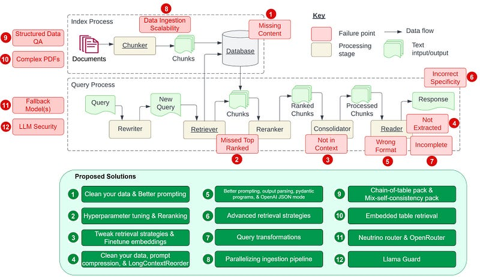

# Best Practices

This file curates blogs (✍️), best practices, architectural guidance, and implementation tips from across all LLM topics.

### **Contents**

- [RAG Best Practices](#rag-best-practices)
  - [The Problem with RAG](#the-problem-with-rag)
  - [RAG Solution Design](#rag-solution-design)
  - [RAG Research](#rag-research)
  - [RAG Research (Ranked by cite count >=100)](#rag-research-ranked-by-cite-count-100)
- [Agent Best Practices](#agent-best-practices)
  - [Agent Design Patterns](#agent-design-patterns)
  - [Agent Research](#agent-research)
  - [Agent Research (Ranked by cite count >=100)](#agent-research-ranked-by-cite-count-100)
  - [Reflection, Tool Use, Planning and Multi-agent collaboration](#reflection-tool-use-planning-and-multi-agent-collaboration)
  - [Tool Use: LLM to Master APIs](#tool-use)
- [Proposals & Glossary](#proposals--glossary)

## **RAG Best Practices**

### **The Problem with RAG**

- [Seven Failure Points When Engineering a Retrieval Augmented Generation System📑](https://arxiv.org/abs/2401.05856): 1. Missing Content, 2. Missed the Top Ranked Documents, 3. Not in Context, 4. Not Extracted, 5. Wrong Format, 6. Incorrect Specificity, 7. Lack of Thorough Testing [11 Jan 2024]
- Solving the core challenges of Retrieval-Augmented Generation [✍️](https://towardsdatascience.com/12-rag-pain-points-and-proposed-solutions-43709939a28c) [Feb 2024]  
  
- The Problem with RAG
  - A question is not semantically similar to its answers. Cosine similarity may favor semantically similar texts that do not contain the answer.
  - Semantic similarity gets diluted if the document is too long. Cosine similarity may favor short documents with only the relevant information.
  - The information needs to be contained in one or a few documents. Information that requires aggregations by scanning the whole data.

### **RAG Solution Design**

  - [Advanced RAG with Azure AI Search and LlamaIndex✍️](https://techcommunity.microsoft.com/t5/ai-azure-ai-services-blog/advanced-rag-with-azure-ai-search-and-llamaindex/ba-p/4115007)
  - [Announcing cost-effective RAG at scale with Azure AI Search✍️](https://aka.ms/AAqfqla)
  - [Azure OpenAI chat baseline architecture in an Azure landing zone](https://learn.microsoft.com/en-us/azure/architecture/ai-ml/architecture/azure-openai-baseline-landing-zone)
  - [GPT-RAG✨](https://github.com/Azure/GPT-RAG): Enterprise RAG Solution Accelerator [Jun 2023]

- [bRAG✨](https://github.com/bRAGAI/bRAG-langchain/): Everything you need to know to build your own RAG application [Nov 2024] 
- [Evaluating LLMs and RAG Systems✍️](https://dzone.com/articles/evaluating-llms-and-rag-systems): Best Practices for Evaluating LLMs and RAG Systems [27 Jan 2025]
- [From Zero to Hero: Proven Methods to Optimize RAG for Production✍️](https://techcommunity.microsoft.com/blog/azure-ai-foundry-blog/from-zero-to-hero-proven-methods-to-optimize-rag-for-production/4450040): ColBERT (Token-level embedding), [CoPali](https://huggingface.co/vidore/colpali-v1.2)(Extends ColBERT's multi-vector retrieval and late interaction from text to vision), RAPTOR, HyDE, Re-Ranking and Fusion [Sep 2025]
- [Galileo eBook](https://www.rungalileo.io/mastering-rag): 200 pages content. Mastering RAG. [🗄️](../files/archive/Mastering%20RAG-compressed.pdf) [Sep 2024]
- [Genie: Uber's Gen AI On-Call Copilot✍️](https://www.uber.com/blog/genie-ubers-gen-ai-on-call-copilot/) [10 Oct 2024]
- [Introduction to Information Retrieval](https://nlp.stanford.edu/IR-book/information-retrieval-book.html): The official website for the classic textbook (free to read online) "Introduction to Information Retrieval" by Christopher D. Manning, Prabhakar Raghavan, and Hinrich Schütze.
- [Introduction to Large-Scale Similarity Search: HNSW, IVF, LSH✍️](https://blog.gopenai.com/introduction-to-large-scale-similarity-search-part-one-hnsw-ivf-lsh-677bf193ab07) [28 Sep 2024]
- [LangChain RAG from scratch✨](https://github.com/langchain-ai/rag-from-scratch) [📺](https://youtube.com/playlist?list=PLfaIDFEXuae2LXbO1_PKyVJiQ23ZztA0x&feature=shared) [Jan 2024]

- [LLM Twin Course: Building Your Production-Ready AI Replica✨](https://github.com/decodingml/llm-twin-course): Learn to Build a Production-Ready LLM & RAG System with LLMOps [Mar 2024] 
- [LlamIndex Building Performant RAG Applications for Production](https://docs.llamaindex.ai/en/stable/optimizing/production_rag/#building-performant-rag-applications-for-production)
- [Papers with code](https://paperswithcode.com/method/rag): RAG
- [RAG at scale✍️](https://medium.com/@neum_ai/retrieval-augmented-generation-at-scale-building-a-distributed-system-for-synchronizing-and-eaa29162521): Building a distributed system for synchronizing and ingesting billions of text embeddings [28 Sep 2023]
- RAG context relevancy metric: Ragas, TruLens, DeepEval [✍️](https://towardsdatascience.com/the-challenges-of-retrieving-and-evaluating-relevant-context-for-rag-e362f6eaed34) [Jun 2024]
  - `Context Relevancy (in Ragas) = S / Total number of sentences in retrieved context`
  - `Contextual Relevancy (in DeepEval) = Number of Relevant Statements / Total Number of Statements`
- [RAG-driven Generative AI✨](https://github.com/Denis2054/RAG-Driven-Generative-AI): Retrieval Augmented Generation (RAG) code for Generative AI with LlamaIndex, Deep Lake, and Pinecone [Apr 2024] 
- [What AI Engineers Should Know about Search](https://softwaredoug.com/blog/2024/06/25/what-ai-engineers-need-to-know-search) [25 Jun 2024]

### **RAG Research**

- [A Survey on Retrieval-Augmented Text Generation📑](https://arxiv.org/abs/2202.01110): This paper conducts a survey on retrieval-augmented text generation, highlighting its advantages and state-of-the-art performance in many NLP tasks. These tasks include Dialogue response generation, Machine translation, Summarization, Paraphrase generation, Text style transfer, and Data-to-text generation. [2 Feb 2022]
- [Adaptive-RAG📑💡](https://arxiv.org/abs/2403.14403): Learning to adapt RAG via question complexity; dynamic retrieval strategies. [Mar 2024] [✨](https://github.com/starsuzi/Adaptive-RAG)
 
- [Active Retrieval Augmented Generation📑💡](https://arxiv.org/abs/2305.06983) : FLARE anticipates next sentences; retrieves/regenerates when token confidence is low. [May 2023] [✨](https://github.com/jzbjyb/FLARE/blob/main/src/templates.py)
- [ARAG📑](https://arxiv.org/abs/2506.21931): Agentic Retrieval Augmented Generation for Personalized Recommendation [27 Jun 2025]
- [Astute RAG📑](https://arxiv.org/abs/2410.07176): adaptively extracts essential information from LLMs, consolidates internal and external knowledge with source awareness, and finalizes answers based on reliability. [9 Oct 2024]
- [Benchmarking Large Language Models in Retrieval-Augmented Generation📑💡](https://arxiv.org/abs/2309.01431): Retrieval-Augmented Generation Benchmark (RGB) assesses 4 key abilities. [Sep 2023]:
  - 

    
Expand

    1. Noise robustness (External documents contain noises, struggled with noise above 80%)  
    1. Negative rejection (External documents are all noises, Highest rejection rate was only 45%)  
    1. Information integration (Difficulty in summarizing across multiple documents, Highest accuracy was 60-67%)  
    1. Counterfactual robustness (Failed to detect factual errors in counterfactual external documents.)  
    

1. [Beyond RAG for Agent Memory: Retrieval by Decoupling and Aggregation📑](https://arxiv.org/abs/2602.02007): xMemory — decouples and aggregates agent memories for compact, non-redundant retrieval. [Feb 2026]
- [CAG: Cache-Augmented Generation📑](https://arxiv.org/abs/2412.15605): Preloading Information and Pre-computed KV cache for low latency and minimizing retrieval errors [20 Dec 2024] [✨](https://github.com/hhhuang/CAG) 
- [CoRAG📑](https://arxiv.org/abs/2501.14342): Chain-of-Retrieval Augmented Generation. RAG: single search -> CoRAG: Iterative search and reasoning [24 Jan 2025]
- [Corrective Retrieval Augmented Generation (CRAG)📑](https://arxiv.org/abs/2401.15884): Retrieval Evaluator assesses the retrieved documents and categorizes them as Correct, Ambiguous, or Incorrect. For Ambiguous and Incorrect documents, the method uses Web Search to improve the quality of the information. The refined and distilled documents are then used to generate the final output. [29 Jan 2024] CRAG implementation by LangGraph [✨](https://github.com/langchain-ai/langgraph/blob/main/examples/rag/langgraph_crag.ipynb)
- [CRAG: Comprehensive RAG Benchmark📑](https://arxiv.org/abs/2406.04744): a factual question answering benchmark of 4,409 question-answer pairs and mock APIs to simulate web and Knowledge Graph (KG) search [✍️](https://www.aicrowd.com/challenges/meta-comprehensive-rag-benchmark-kdd-cup-2024) [7 Jun 2024]
- [Discuss-RAG📑](https://arxiv.org/abs/2504.21252): Agent-Led Discussions for Better RAG in Medical QA [30 Apr 2025]
- [FreshLLMs📑](https://arxiv.org/abs/2310.03214): Fresh Prompt, Google search first, then use results in prompt. Our experiments show that FreshPrompt outperforms both competing search engine-augmented prompting methods such as Self-Ask (Press et al., 2022) as well as commercial systems such as Perplexity.AI. [✨](https://github.com/freshllms/freshqa) [5 Oct 2023] 
- [Graph Retrieval-Augmented Generation: A Survey📑](https://arxiv.org/abs/2408.08921) [15 Aug 2024]
- [From Local to Global: GraphRAG📑💡](https://arxiv.org/abs/2404.16130): Entity graph + community summaries to scale QFS over large corpora. [Apr 2024]
- [HIRAG: Hierarchical-Thought Instruction-Tuning Retrieval-Augmented Generation📑](https://arxiv.org/abs/2507.05714): fine-tunes LLMs to learn a three-level hierarchical reasoning process — Filtering: select relevant information; Combination: synthesize across documents; RAG-specific reasoning: infer using retrieved documents plus internal knowledge. [8 Jul 2025]
- [HippoRAG📑💡](https://arxiv.org/abs/2405.14831): RAG + Long-Term Memory (Knowledge Graphs) + Personalized PageRank. [23 May 2024]
- [Hyde📑](https://arxiv.org/abs/2212.10496): Hypothetical Document Embeddings. `zero-shot (generate a hypothetical document) -> embedding -> avg vectors -> retrieval` [20 Dec 2022]
- [INTERS: Unlocking the Power of Large Language Models in Search with Instruction Tuning📑](https://arxiv.org/abs/2401.06532): INTERS covers 21 search tasks across three categories: query understanding, document understanding, and query-document relationship understanding. The dataset is designed for instruction tuning, a method that fine-tunes LLMs on natural language instructions. [✨](https://github.com/DaoD/INTERS) [12 Jan 2024]
 
- [Medical RAG Benchmark (MIRAGE)📑💡](https://arxiv.org/abs/2402.13178): MedRAG toolkit; RAG improves LLM accuracy up to 18% with mixed corpora/retrievers. [Feb 2024]
- [OP-RAG: Order-preserve RAG📑](https://arxiv.org/abs/2409.01666): Unlike traditional RAG, which sorts retrieved chunks by relevance, we keep them in their original order from the text.  [3 Sep 2024]
- [PlanRAG📑](https://arxiv.org/abs/2406.12430): Decision Making. Decision QA benchmark, DQA. Plan -> Retrieve -> Make a decision (PlanRAG) [✨](https://github.com/myeon9h/PlanRAG) [18 Jun 2024]
 
- [RAG Evaluation: RAGAs📑💡](https://arxiv.org/abs/2309.15217): Reference-free metrics to assess context relevance, faithfulness, and answer quality. [Sep 2023]
- [RAG for LLMs📑💡](https://arxiv.org/abs/2312.10997): Survey: Naive → Advanced → Modular RAG; practices and benchmarks. [Dec 2023]
- [RAG vs Fine-tuning📑](https://arxiv.org/abs/2401.08406): Pipelines, Tradeoffs, and a Case Study on Agriculture. [16 Jan 2024]
- [RARE: Retrieval-Augmented Reasoning Modeling 📑](https://arxiv.org/abs/2503.23513): LLM Training from static knowledge storage (memorization) to reasoning-focused. Combining domain knowledge and thinking (Knowledge Remembering & Contextualized Reasoning). 20% increase in accuracy on tasks like PubMedQA and CoVERT. [30 Mar 2025]
- [RAPTOR: Recursive Abstractive Processing for Tree-Organized Retrieval📑](https://arxiv.org/abs/2401.18059): Introduce a novel approach to retrieval-augmented language models by constructing a recursive tree structure from documents. [✨](https://github.com/run-llama/llama_index/blob/main/llama-index-packs/llama-index-packs-raptor/README.md) `pip install llama-index-packs-raptor` / [✨](https://github.com/profintegra/raptor-rag) [31 Jan 2024] 
- [RECOMP: Improving Retrieval-Augmented LMs with Compressors📑](https://arxiv.org/abs/2310.04408): 1. We propose RECOMP (Retrieve, Compress, Prepend), an intermediate step which compresses retrieved documents into a textual summary prior to prepending them to improve retrieval-augmented language models (RALMs). 2. We present two compressors – an `extractive compressor` which selects useful sentences from retrieved documents and an `abstractive compressor` which generates summaries by synthesizing information from multiple documents. 3. Both compressors are trained. [6 Oct 2023]
- [REFRAG: Rethinking RAG based Decoding📑](https://arxiv.org/abs/2509.01092): Meta. Compress (chunk → single embedding) → Sense/Select (RL policy picks relevant chunks) → Expand (Selective expansion). 16× Longer Contexts and Up to 31× Faster RAG Decoding. [1 Sep 2025] [✍️](https://x.com/_avichawla/status/1977260787027919209)
- [Retrieval Augmented Generation (RAG) and Beyond📑](https://arxiv.org/abs/2409.14924):🏆The paper classifies user queries into four levels—`explicit, implicit, interpretable rationale, and hidden rationale`—and highlights the need for external data integration and fine-tuning LLMs for specialized tasks. [23 Sep 2024]
- [Retrieval Augmented Generation or Long-Context LLMs?📑](https://arxiv.org/abs/2407.16833): Long-Context consistently outperforms RAG in terms of average performance. However, RAG's significantly lower cost remains a distinct advantage. [23 Jul 2024]
- [Retrieval meets Long Context LLMs📑](https://arxiv.org/abs/2310.03025): We demonstrate that retrieval-augmentation significantly improves the performance of 4K context LLMs. Perhaps surprisingly, we find this simple retrieval-augmented baseline can perform comparable to 16K long context LLMs. [4 Oct 2023]
- [Retrieval-Augmentation for Long-form Question Answering📑](https://arxiv.org/abs/2310.12150): 1. The order of evidence documents affects the order of generated answers 2. the last sentence of the answer is more likely to be unsupported by evidence. 3. Automatic methods for detecting attribution can achieve reasonable performance, but still lag behind human agreement. `Attribution in the paper assesses how well answers are based on provided evidence and avoid creating non-existent information.` [18 Oct 2023]
- [Searching for Best Practices in Retrieval-Augmented Generation📑](https://arxiv.org/abs/2407.01219): `Best Performance Practice`: Query Classification, Hybrid with HyDE (retrieval), monoT5 (reranking), Reverse (repacking), Recomp (summarization). `Balanced Efficiency Practice`: Query Classification, Hybrid (retrieval), TILDEv2 (reranking), Reverse (repacking), Recomp (summarization). [1 Jul 2024]
- [Self-RAG💡](https://arxiv.org/pdf/2310.11511.pdf): Critic tokens (IsREL/IsSUP/IsUse) guide retrieval and generation; adaptive on-demand retrieval. [Oct 2023] [✨](https://github.com/AkariAsai/self-rag)
 
- [Sufficient Context: A New Lens on Retrieval Augmented Generation Systems📑](https://arxiv.org/abs/2411.06037): Use Gemini 1.5 Pro (1-shot) as a `Sufficient Context AutoRater` to verify if enough context is provided. Larger models perform well with sufficient context but often make wrong guesses when information is missing. Accuracy improves by combining `Model Self-Rated Confidence` with the `Sufficient Context AutoRater`. [9 Nov 2024]
- [The Power of Noise: Redefining Retrieval for RAG Systems📑](https://arxiv.org/abs/2401.14887): No more than 2-5 relevant docs + some amount of random noise to the LLM context maximizes the accuracy of the RAG. [26 Jan 2024]
- [Towards AI Search Paradigm📑](https://arxiv.org/abs/2506.17188): Modular 4-agent system (orchestrator, planner, executor, writer) using DAGs for retrieval-intensive search. [Jun 2025]
- [UniversalRAG📑](https://arxiv.org/abs/2504.20734): Modality-aware and granularity-aware routing across text/image/video; flexible zero-shot vs trained routing. [Apr 2025]

### **RAG Research (Ranked by cite count >=100)**

1. [Retrieval-Augmented Generation for Knowledge-Intensive NLP Tasks📑](https://arxiv.org/abs/2005.11401): Foundational RAG recipe combining seq2seq with dense retrieval; set SOTA on open-domain QA. [May 2020] (Citations: 9,559)
1. [Retrieval-Augmented Generation for Large Language Models: A Survey📑](https://arxiv.org/abs/2312.10997): Comprehensive review of Naive/Advanced/Modular RAG paradigms and evaluation frameworks. [Dec 2023] (Citations: 2,570)
1. [Self-RAG📑](https://arxiv.org/abs/2310.11511): Trains LMs to retrieve on-demand and generate reflection tokens to control factuality. [Oct 2023] (Citations: 1,203)
1. [GraphRAG📑](https://arxiv.org/abs/2404.16130): Builds an entity graph + community summaries to answer global, corpus-level questions. [Apr 2024] (Citations: 835)
1. [RAG Meets LLMs: Survey📑](https://arxiv.org/abs/2405.06211): Surveys Retrieval-Augmented LLMs (RA-LLMs), limitations, and future directions. [May 2024] (Citations: 531)
1. [Active Retrieval Augmented Generation (FLARE)📑](https://arxiv.org/abs/2305.06983): Iteratively anticipates future content and retrieves when confidence is low for long-form tasks. [May 2023] (Citations: 522)
1. [Benchmarking LLMs in RAG (RGB)📑](https://arxiv.org/abs/2309.01431): Benchmarks noise robustness, negative rejection, integration, and counterfactual robustness. [Sep 2023] (Citations: 481)
1. [RAGAs📑](https://arxiv.org/abs/2309.15217): Reference-free evaluation metrics for retrieval and generation fidelity in RAG pipelines. [Sep 2023] (Citations: 470)
1. [Medical RAG Benchmark (MIRAGE)📑](https://arxiv.org/abs/2402.13178): 7,663 medical QA questions; toolkit shows RAG combos boosting accuracy up to 18%. [Feb 2024] (Citations: 404)
1. [Adaptive-RAG📑](https://arxiv.org/abs/2403.14403): Dynamically selects RAG strategies based on query complexity. [Mar 2024] (Citations: 369)
1. [RAG for AIGC Survey📑](https://arxiv.org/abs/2402.19473): Surveys RAG foundations and applications for AI-generated content across modalities. [Feb 2024] (Citations: 497)
1. [RAFT📑](https://arxiv.org/abs/2403.10131): Fine-tuning with distractor documents improves domain-specific RAG open-book in-domain QA. [Mar 2024] (Citations: 312)
1. [The Power of Noise📑](https://arxiv.org/abs/2401.14887): 2-5 relevant docs + random noise maximizes RAG accuracy. [Jan 2024] (Citations: 329)
1. [Domain Adaptation for RAG📑](https://arxiv.org/abs/2210.02627): Joint training of retriever and generator for domain-specific knowledge bases. [Oct 2022] (Citations: 258)
1. [Graph RAG Survey📑](https://arxiv.org/abs/2408.08921): Comprehensive survey of GraphRAG methodologies and applications. [Aug 2024] (Citations: 306)
1. [Evaluation of RAG: A Survey📑](https://arxiv.org/abs/2405.07437): Unifies evaluation metrics and benchmarks for retrieval and generation components. [May 2024] (Citations: 218)
1. [MultiHop-RAG📑](https://arxiv.org/abs/2401.15391): Benchmark for multi-hop queries requiring multi-evidence retrieval and reasoning. [Jan 2024] (Citations: 206)
1. [RAGTruth📑](https://arxiv.org/abs/2401.00396): Word-level hallucination corpus for RAG responses across domains and tasks. [Jan 2024] (Citations: 209)
1. [G-Retriever📑](https://arxiv.org/abs/2402.07630): Prize-Collecting Steiner Tree formulation for textual graph RAG QA. [Feb 2024] (Citations: 202)
1. [Seven Failure Points in RAG📑](https://arxiv.org/abs/2401.05856): Engineering failures and lessons learned across domains. [Jan 2024] (Citations: 186)
1. [KG RAG for Customer Support📑](https://arxiv.org/abs/2404.17723): Builds KG from tickets to improve retrieval and QA quality. [Apr 2024] (Citations: 152)
1. [RankRAG📑](https://arxiv.org/abs/2407.02485): Instruction-tunes one LLM for both context ranking and answer generation. [Jul 2024] (Citations: 196)
1. [Chain of Agents (long-context)📑](https://arxiv.org/abs/2406.02818): Multi-agent chain processes long inputs via segmented reading and synthesis. [Jun 2024] (Citations: 180)
1. [RAG Privacy📑](https://arxiv.org/abs/2402.16893): Analyzes privacy risks in RAG databases and LLM training data leakage. [Feb 2024] (Citations: 133)
1. [RAG vs Fine-tuning📑](https://arxiv.org/abs/2401.08406): Compares RAG and fine-tuning pipelines with agriculture case study. [Jan 2024] (Citations: 148)
1. [RQ-RAG📑](https://arxiv.org/abs/2404.00610): Learns to rewrite, decompose, and disambiguate queries to improve retrieval. [Apr 2024] (Citations: 157)
1. [Agentic RAG Survey📑](https://arxiv.org/abs/2501.09136): Taxonomy and design patterns for Agentic RAG workflows. [Jan 2025] (Citations: 202)
1. [CRAG📑](https://arxiv.org/abs/2401.15884): Retrieval evaluator triggers web search and decompose-recompose filtering. [Jan 2024] (Citations: 158)
1. [GNN-RAG📑](https://arxiv.org/abs/2405.20139): Combines GNN reasoning and LLM RAG for KGQA; excels on multi-hop queries. [May 2024] (Citations: 152)
1. [eRAG📑](https://arxiv.org/abs/2404.13781): Document-level downstream evaluation correlates better with end-to-end RAG. [Apr 2024] (Citations: 150)
1. [FlashRAG📑](https://arxiv.org/abs/2405.13576): Modular toolkit implementing 16 RAG methods and 38 benchmarks. [May 2024] (Citations: 157)
1. [HybridRAG📑](https://arxiv.org/abs/2408.04948): Combines GraphRAG + VectorRAG; outperforms both for finance Q&A. [Aug 2024] (Citations: 149)
1. [Clinical RAG for Hepatology📑](https://www.semanticscholar.org/paper/965a0969b460f9246158d88fb28e21c5d80d0a8b): Structured guideline reformatting + prompt engineering boosts CDSS accuracy. [—] (Citations: 118)
1. [Blended RAG📑](https://arxiv.org/abs/2404.07220): Hybrid dense+sparse retrievers with query strategies improve IR and QA. [Apr 2024] (Citations: 115)
1. [LightRAG📑](https://arxiv.org/abs/2410.05779): Graph-based indexing and incremental updates for fast, accurate RAG. [Oct 2024] (Citations: 108)
1. [GraphRAG Survey (2025)📑](https://arxiv.org/abs/2501.00309): Holistic framework and domain-tailored designs for GraphRAG. [Jan 2025] (Citations: 151)
1. [Structured Output RAG📑](https://arxiv.org/abs/2404.08189): RAG reduces hallucinations in structured workflow generation. [Apr 2024] (Citations: 133)
1. [HippoRAG📑](https://arxiv.org/abs/2405.14831): KG + Personalized PageRank for efficient long-term memory integration. [May 2024] (Citations: 136)
1. [VisRAG📑](https://arxiv.org/abs/2410.10594): Vision-based page-as-image retrieval for multimodal document RAG; outperforms text-only pipelines. [Oct 2024] (Citations: 135)
1. [Medical Graph RAG📑](https://arxiv.org/abs/2408.04187): Hierarchical knowledge graph for safe medical LLM RAG on clinical notes. [Aug 2024] (Citations: 122)
1. [Best Practices in RAG📑](https://arxiv.org/abs/2407.01219): Query classification + hybrid + HyDE + monoT5 reranking + Recomp summarization. [Jul 2024] (Citations: 120)
1. [PoisonedRAG📑](https://arxiv.org/abs/2402.07867): Knowledge corpus poisoning attacks against RAG achieve high attack success rates. [Feb 2024] (Citations: 111)
1. [RAG vs Long-Context LLMs📑](https://arxiv.org/abs/2407.16833): Long-context consistently outperforms RAG on average; RAG retains cost advantage. [Jul 2024] (Citations: 110)
1. [RAG for NLP Survey📑](https://arxiv.org/abs/2407.13193): Survey of RAG frameworks across NLP tasks: modules, training, and adaptation. [Jul 2024] (Citations: 108)
1. [RAG Text Generation Survey📑](https://arxiv.org/abs/2404.10981): Comprehensive survey on retrieval-augmented text generation methods and benchmarks. [Apr 2024] (Citations: 101)
1. [ColPali📑](https://arxiv.org/abs/2407.01449): Vision-Language Models for efficient document page retrieval outperform text-only OCR pipelines. [Jul 2024] (Citations: 100)

---

## **Agent Best Practices**

- [AIAgentToolkit.xyz](https://www.aiagenttoolkit.xyz): A curated list of AI agent frameworks, launchpads, tools, tutorials, & resources.
- [AI Engineering Guidebook](https://blog.dailydoseofds.com/p/the-ai-engineering-guidebook): 💡350+ pages. Daily Dose of Data Science. [26 Dec 2025]
- [Agent Leaderboard🤗](https://huggingface.co/spaces/galileo-ai/agent-leaderboard)
- [Agent Leaderboard v2✨](https://github.com/rungalileo/agent-leaderboard) 
- [How AI is transforming work at Anthropic✍️](https://www.anthropic.com/research/how-ai-is-transforming-work-at-anthropic): Claude Code covers ~60% of engineering work with ~50% productivity gain. [3 Dec 2025]
- [We Got Claude to Fine-Tune an Open Source LLM✍️](https://huggingface.co/blog/hf-skills-training): 🤗 Hugging Face skill for training an LLM. [4 Dec 2025]

### **Agent Design Patterns**

- [10 Lessons to Get Started Building AI Agents✨](https://github.com/microsoft/ai-agents-for-beginners): 💡Microsoft. [Nov 2024] 
- [5 Agentic AI Design Patterns✍️](https://blog.dailydoseofds.com/p/5-agentic-ai-design-patterns): Reflection, Tool use, ReAct, Planning, Multi-agent pattern [24 Jan 2025]
- [A Practical Guide to Building AI Agents✍️](https://cdn.openai.com/business-guides-and-resources/a-practical-guide-to-building-agents.pdf): 💡OpenAI. [11 Mar 2025]
- [Agent Factory: The new era of agentic AI—common use cases and design patterns✍️](https://azure.microsoft.com/en-us/blog/agent-factory-the-new-era-of-agentic-ai-common-use-cases-and-design-patterns/):💡Tool use, Reflection, Planning,  Multi-agent, ReAct (Reason + Act) Patterns [13 Aug 2025]
- [Agentic AI Architecture Framework for Enterprises ✍️](https://www.infoq.com/articles/agentic-ai-architecture-framework/):💡Tier 1: Foundation: Establishing Controlled Intelligence, Tier 2: Workflow, Tier 3: Autonomous (experimental) [11 Jul 2025]
- [Agentic Design Patterns✨](https://github.com/sarwarbeing-ai/Agentic_Design_Patterns): Jupyter notebook hands-on guide to building agents. [Sep 2025] 
- [Agentic Architectures for Retrieval-intensive Applications](https://weaviate.io/ebooks/agentic-architectures): Published by Weviate [Mar 2025]
- [Agentic Design Patterns✍️](https://docs.google.com/document/d/1rsaK53T3Lg5KoGwvf8ukOUvbELRtH-V0LnOIFDxBryE/edit?tab=t.0#heading=h.pxcur8v2qagu): Google Docs. A Hands-On Guide to Building Intelligent Systems. [🗄️](../files/archive/Agentic_Design_Patterns.docx) [May 2025]
- [Agents](https://huyenchip.com/2025/01/07/agents.html):💡Chip Huyen [7 Jan 2025]
- [AI agent orchestration patterns](https://learn.microsoft.com/en-us/azure/architecture/ai-ml/guide/ai-agent-design-patterns):💡Sequential, Concurrent, Group chat, Handoff, Magentic orchestration [17 Jun 2025]
- [AI Coding Assistants Haven’t Sped up Delivery Because Coding Was Never the Bottleneck✍️](https://www.infoq.com/news/2026/03/agoda-ai-code-bottleneck/): AI shifts bottlenecks upstream to specification, alignment, and verification. [Mar 2026]
- [Azure AI Foundry Agent Ochestration Patterns ](https://aifoundry.app/patterns): Prompt Chaining, Routing, Parallelization, Orchestrator, Evaluator-optimizer
- [Decision Matrix: API vs MCP Tools✍️](https://techcommunity.microsoft.com/blog/azurearchitectureblog/decision-matrix-api-vs-mcp-tools-%E2%80%94-the-great-integration-showdown-%F0%9F%A5%8A/4499385): Tradeoffs between REST APIs, SDKs, and MCP tools. [Jul 2025]
- [Beyond the Gang of Four: Practical Design Patterns for Modern AI Systems✍️](https://www.infoq.com/articles/practical-design-patterns-modern-ai-systems/): **Prompting & Context:** Few-Shot Prompting, Role Prompting, Chain-of-Thought, RAG; **Responsible AI:** Output Guardrails, Model Critic; **UX:** Contextual Guidance, Editable Output, Iterative Exploration; **AI-Ops:** Metrics-Driven AI-Ops, Prompt-Model-Config Versioning; **Optimization:** Prompt Caching, Dynamic Batching, Intelligent Model Routing. [15 My 2025]
- [Building effective agents✍️](https://www.anthropic.com/engineering/building-effective-agents):💡Anthrophic. Prompt Chaining, Sequential LLM calls, Routing, Input classification, Parallelization, Concurrent execution, Orchestrator-Workers, Delegation, Evaluator-Optimizer, Feedback loops, Iterative refinement [19 Dec 2024]
- [Enterprise Spec-Driven Development✍️](https://www.infoq.com/articles/enterprise-spec-driven-development): Specs as the source of truth for enterprise AI delivery. [Feb 2026]
- [Evaluating AI Agents✍️](https://www.infoq.com/articles/evaluating-ai-agents-lessons-learned): Practical evaluation lessons for quality, safety, and reliability. [2026]
- [Exploring Generative AI (martinfowler.com)](https://martinfowler.com/articles/exploring-gen-ai.html): Memos on how LLMs are being used to enhance software delivery practices, including Toochain, Test-Driven Development (TDD) with GitHub Copilot, pair programming, and multi-file editing. [26 Jul 2023 ~ ]
- [Generative AI Design Patterns for Agentic AI Systems✨](https://github.com/microsoft/azure-genai-design-patterns): Design Patterns for Agentic solutions in Azure [May 2023]
 
- [Google AI Agents Whitepaper](https://www.kaggle.com/whitepaper-agents) [12 Nov 2024]
- [How Anthropic Built a Multi-Agent Research System✍️](https://blog.bytebytego.com/p/how-anthropic-built-a-multi-agent): Lead Researcher agent to coordinate specialized subagents, enabling dynamic, parallelized research and citation verification [17 Sep 2025]
- [How to write a great agents.md: Lessons from over 2,500 repositories✍️](https://github.blog/ai-and-ml/github-copilot/how-to-write-a-great-agents-md-lessons-from-over-2500-repositories/): How to write effective agents.md files for GitHub Copilot with practical tips [19 Nov 2025]
- [How we built our multi-agent research system✍️](https://www.anthropic.com/engineering/built-multi-agent-research-system): Anthrophic. [13 Jun 2025]
- [Hugging Face Agents Course✨](https://github.com/huggingface/agents-course) 🤗 Hugging Face Agents Course. [Jan 2025]
- [Language Agent Tree Search Method (LATS)✨](https://github.com/lapisrocks/LanguageAgentTreeSearch): LATS leverages an external environment and an MCTS (Monte Carlo Tree Search)-based search [6 Oct 2023] 
- [Taxonomy of failure modes in AI agents ✍️](https://www.microsoft.com/en-us/security/blog/2025/04/24/new-whitepaper-outlines-the-taxonomy-of-failure-modes-in-ai-agents): Microsoft AI Red Team (AIRT) has categorized identified failure modes into two types: novel and existing, under the pillars of safety and security. [24 Apr 2025]
- [The Different Ochestration Frameworks](https://newsletter.theaiedge.io/p/implementing-a-language-agent-tree):💡Orchestration frameworks for LLM applications: Micro-orchestration / Macro-orchestration / Agentic Design Frameworks / Optimizer frameworks [11 Oct 2024]
- [The Last Mile Problem: Why Your AI Models Stumble Before the Finish Line](https://solutionsreview.com/data-management/the-last-mile-problem-why-your-ai-models-stumble-before-the-finish-line/): According to Gartner, by 2025, at least 30 percent of GenAI projects will be abandoned after the POC stage. [25 Oct 2024]
- [When One AI Agent Isn't Enough - Building Multi-Agent Systems✍️](https://diamantai.substack.com/p/when-one-ai-agent-isnt-enough-building): When Multi-Agent Systems Make Sense: Complex subtasks, diverse expertise, parallel speed, easy scaling, and multi-entity problems. [Jul 14]
- [Zero to One: Learning Agentic Patterns](https://www.philschmid.de/agentic-pattern):💡Structured `workflows` follow fixed paths, while `agentic patterns` allow autonomous, dynamic decision-making. Sample code using Gemini. [5 May 2025]

### **Agent Research**

1. [A Practical Approach for Building Production-Grade Conversational Agents with Workflow Graphs📑](https://arxiv.org/abs/2505.23006): DAG-based workflows for e-commerce tasks with response and loss masking. [May 2025]
1. [Advances and Challenges in Foundation Agents📑](https://arxiv.org/abs/2504.01990): Brain-inspired to evolutionary, collaborative, and safe agent systems. [Mar 2025]
1. [Codified Context: Infrastructure for AI Agents in a Complex Codebase📑](https://arxiv.org/abs/2602.20478): Persistent memory, specialist agents, and spec docs for large codebases. [Feb 2026]
1. [Agent-as-a-Judge📑](https://arxiv.org/abs/2410.10934): Evaluate agents with agents; DevAI benchmark of 55 development tasks. [Oct 2024]
1. [AgentBench📑](https://arxiv.org/abs/2308.03688): Evaluates LLM-as-Agent reasoning and decision-making. [Aug 2023]
1. [Awesome-LLM-Reasoning-Failures✨](https://github.com/Peiyang-Song/Awesome-LLM-Reasoning-Failures): Curated papers on discovery, analysis, and mitigation of LLM reasoning failures. 
1. [AutoHarness📑](https://arxiv.org/abs/2603.03329): Auto-synthesized code harnesses eliminate illegal agent actions. [Mar 2026]
1. [Agentic Context Engineering📑](https://arxiv.org/abs/2510.04618): ACE lets models self-improve by evolving contexts without fine-tuning. [Oct 2025]
1. [Agentic Reasoning for Large Language Models📑](https://arxiv.org/abs/2601.12538): Survey of agentic reasoning: planning, self-evolution, and multi-agent collaboration. [Jan 2026]
1. [AgentQ📑](https://arxiv.org/abs/2408.07199): Off-policy policy gradient for multi-step agent planning. [13 Aug 2024]
1. [Agents Are Not Enough📑](https://arxiv.org/abs/2412.16241): Proposes ecosystem of agents, sims, and assistants. [Dec 2024]
1. [AI Agents That Matter📑](https://arxiv.org/abs/2407.01502): Agent evaluations for accuracy and cost optimization. [Jul 2024]
1. [Automated Design of Agentic Systems📑](https://arxiv.org/abs/2408.08435): ADAS auto-creates agentic designs with novel building blocks. [Aug 2024]
1. [Cognitive Architectures for Language Agents📑](https://arxiv.org/abs/2309.02427): CoALA with procedural, semantic, and episodic memory. [Sep 2023]
1. [Darwin Godel Machine📑](https://arxiv.org/abs/2505.22954): Self-modifying agents evolve via SWE-bench/Polyglot validation. [May 2025]
1. [Evaluating AGENTS.md: Are Repository-Level Context Files Helpful for Coding Agents?📑](https://arxiv.org/abs/2602.11988): AGENTS.md often reduces agent success rates and increases cost — keep them minimal. [Feb 2026]
1. [AgentCoder📑](https://arxiv.org/abs/2312.13010): Multi-agent code generation with iterative testing. [Dec 2023]
1. [LDB📑](https://arxiv.org/abs/2402.16906): LLM debugger verifying runtime execution step by step. [Feb 2024]
1. [Generative Agent Simulations of 1,000 People📑](https://arxiv.org/abs/2411.10109): Simulates 1,000 real individuals; 85% General Social Survey accuracy. [Nov 2024]
1. [Hyperagents📑](https://arxiv.org/abs/2603.19461): Self-referential agents. Metacognitive self-improvement, where AI rewrites its own improvement process—achieving cross-domain gains (e.g., 0→0.71 in review tasks). [Mar 2026]
1. [Recursive Language Models (RLMs), a general inference strategy📑](https://arxiv.org/abs/2512.24601): A new general inference strategy that lets large language models process arbitrarily long inputs by treating the entire prompt as an external environment and programmatically decomposing and recursively calling the model on pieces of the input. [Dec 2025]
1. [Solving a Million-Step LLM Task with Zero Errors📑](https://arxiv.org/abs/2511.09030): MDAP framework with MAKER decomposition and error correction. [Nov 2025]
1. [The Rise and Potential of LLM-Based Agents📑](https://arxiv.org/abs/2309.07864): Survey of LLM-based agents. [Sep 2023]
1. [Towards a Science of Scaling Agent Systems📑](https://arxiv.org/abs/2512.08296): Adding agents doesn’t guarantee better performance—multi‑agent AI can drop up to 70% depending on task, coordination, and architecture (Google & MIT, 15,000 trials). [Dec 2025]

### **Agent Research (Ranked by cite count >=100)**

1. [AutoGen Framework📑](https://arxiv.org/abs/2308.08155): Enabling Next-Gen LLM Applications via Multi-Agent Conversation Framework. (Citations: 832)
1. [Mind2Web📑](https://arxiv.org/abs/2306.06070): Generalist web agents dataset with 2,000 tasks across 137 sites. [Jun 2023] (Citations: 852)
1. [ChatEval📑](https://arxiv.org/abs/2308.07201): Towards Better LLM-based Evaluators through Multi-Agent Debate. [Aug 2023] (Citations: 777)
1. [SWE-agent📑](https://arxiv.org/abs/2405.15793): Agent-computer interfaces enable autonomous repo navigation, editing, and testing. [May 2024] (Citations: 569)
1. [Multi-Agent Collaboration📑](https://arxiv.org/abs/2306.03314): Framework analyzing Auto-GPT/BabyAGI; collaboration improves task handling. [Jun 2023] (Citations: 369)
1. [Character-LLM📑](https://arxiv.org/abs/2310.10158): A Trainable Agent for Role-Playing. [Oct 2023] (Citations: 374)
1. [Planning Survey📑](https://arxiv.org/abs/2402.02716): Taxonomy of agent planning: decomposition, selection, external modules, memory. [Feb 2024](Citations: 373)
1. [ExpeL📑](https://arxiv.org/abs/2308.10144): Agents learn from experiences without param updates; strong transfer. [Aug 2023](Citations: 381)
1. [LATS📑](https://arxiv.org/abs/2310.04406): MCTS-based search unifies reasoning, acting, planning in LM agents. [Oct 2023](Citations: 377)
1. [PLMs for Decision-Making📑](https://arxiv.org/abs/2202.01771): LM-initialized policies for sequential decision tasks. [Feb 2022](Citations: 299)
1. [CodeAct📑](https://arxiv.org/abs/2402.01030): Executable Python actions unify tool use; improves success on API-Bank. [Feb 2024](Citations: 356)
1. [OpenHands📑](https://arxiv.org/abs/2407.16741): Open platform for developer agents with sandboxing and benchmarks. [Jul 2024](Citations: 281)
1. [Personal LLM Agents Survey📑](https://arxiv.org/abs/2401.05459): Architecture, capability, efficiency, security of personal agents. [Jan 2024](Citations: 295)
1. [Agentless📑](https://arxiv.org/abs/2407.01489): Simple three-phase approach rivals complex SWE agents. [Jul 2024](Citations: 276)
1. [Collaboration Mechanisms📑](https://arxiv.org/abs/2310.02124): Social-psychology-inspired multi-agent societies (debate, reflection). [Oct 2023](Citations: 229)
1. [RepairAgent📑](https://arxiv.org/abs/2403.17134): An Autonomous, LLM-Based Agent for Program Repair. [Mar 2024] (Citations: 242)
1. [Biomedical Agents📑](https://arxiv.org/abs/2404.02831): Agents accelerate biomedical discovery; integration pathways. [Apr 2024] (Citations: 182)
1. [ToolEmu Risk Sandbox📑](https://arxiv.org/abs/2309.15817): LM-emulated tool execution for agent risk analysis. [Sep 2023] (Citations: 217)
1. [Agents as Models📑](https://arxiv.org/abs/2212.01681): LMs infer communicative intentions; building blocks for intentional agents. [Dec 2022](Citations: 170)
1. [MACHIAVELLI📑](https://arxiv.org/abs/2304.03279): Benchmarks trade-offs between reward and ethical behavior. [Apr 2023](Citations: 176)
1. [LoCoMo Memory📑](https://arxiv.org/abs/2402.17753): Very long-term conversational memory benchmark (300 turns). [Feb 2024](Citations: 270)
1. [AgentPoison📑](https://arxiv.org/abs/2407.12784): Backdoor poisoning of agent memory/RAG KB; high attack success. [Jul 2024](Citations: 211)
1. [Agent Laboratory📑](https://arxiv.org/abs/2501.04227): Autonomous end-to-end research pipeline with human-in-the-loop. [Jan 2025](Citations: 160)
1. [TPTU📑](https://www.semanticscholar.org/paper/5ce94181ea702f69c3651dce721d6bd8026b8106): Task planning and tool usage taxonomy for LLM agents.(Citations: 158)
1. [Bots with Feelings📑](https://www.semanticscholar.org/paper/a79707c7646debe27f1a5188996237f11763592c): Customer service outcomes with AI-expressed positive emotion.(Citations: 150)
1. [Data Interpreter📑](https://arxiv.org/abs/2402.18679): An LLM Agent For Data Science. [Feb 2024] (Citations: 164)
1. [A-MEM📑](https://arxiv.org/abs/2502.12110): Zettelkasten-inspired adaptive agentic memory organization. [Feb 2025] (Citations: 267)
1. [Dynamic LLM-Agent Network📑](https://www.semanticscholar.org/paper/98ce7af921e7c52d81df64d632d34eb09522cd75): An LLM-agent Collaboration Framework with Agent Team Optimization. (Citations: 134)
1. [Agent Q📑](https://arxiv.org/abs/2408.07199): MCTS + self-critique + off-policy DPO for multi-step reasoning. [Aug 2024] (Citations: 132)
1. [Mental Models📑](https://www.semanticscholar.org/paper/a109274aa61679a5d95058b4bd20fa7acba0df52): How users form mental models of AI agents.(Citations: 131)
1. [R-Judge📑](https://arxiv.org/abs/2401.10019): Safety risk awareness benchmark for agent interactions. [Jan 2024](Citations: 131)
1. [Rethinking LLM Reasoning Bounds📑](https://arxiv.org/abs/2402.18272): Are Multi-Agent Discussions the Key? [Feb 2024] (Citations: 146)
1. [ETO📑](https://arxiv.org/abs/2403.02502): Learn from exploration failures via contrastive trajectory optimization. [Mar 2024] (Citations: 144)
1. [AgentBoard📑](https://arxiv.org/abs/2401.13178): Analytical evaluation board with fine-grained progress metrics. [Jan 2024] (Citations: 146)
1. [AutoDefense📑](https://arxiv.org/abs/2403.04783): Multi-Agent LLM Defense against Jailbreak Attacks. [Mar 2024] (Citations: 114)
1. [AgentHarm📑](https://arxiv.org/abs/2410.09024): Malicious agent tasks benchmark; jailbreak compliance analysis. [Oct 2024](Citations: 149)
1. [Search Agents📑](https://arxiv.org/abs/2407.01476): Best-first tree search improves web agents; scales with compute. [Jul 2024](Citations: 128)
1. [AI Agents vs Agentic AI📑](https://arxiv.org/abs/2505.10468): Conceptual taxonomy, applications, and challenges. [May 2025](Citations: 109)
1. [Agents Under Threat📑](https://arxiv.org/abs/2406.02630): Survey of key security challenges for AI agents. [Jun 2024](Citations: 152)
1. [One-day Vulnerabilities📑](https://arxiv.org/abs/2404.08144): Autonomous exploitation capability constraints and risks. [Apr 2024](Citations: 125)
1. [RAGEN📑](https://arxiv.org/abs/2504.20073): Multi-turn RL framework (StarPO) and agent self-evolution. [Apr 2025](Citations: 101)
1. [Small LMs for Agentic AI📑](https://arxiv.org/abs/2506.02153): Small language models outperform large models in specialized, tool-use agentic tasks. [Jun 2025] (Citations: 182)
1. [Mem0📑](https://arxiv.org/abs/2504.19413): Scalable long-term memory framework enabling personalized, production-ready AI agents. [Apr 2025] (Citations: 160)
1. [Magma📑](https://arxiv.org/abs/2502.13130): Microsoft foundation model for multimodal AI agents across digital and physical environments. [Feb 2025] (Citations: 103)

### **Tool Use**

- Agentic Design Patterns [✍️](https://www.deeplearning.ai/the-batch/agentic-design-patterns-part-2-reflection/) [Mar 2024]
- Reflection: LLM self-evaluates to improve.
  - [Self-Refine📑](https://arxiv.org/abs/2303.17651) [30 Mar 2023]
  - [Reflexion📑](https://arxiv.org/abs/2303.11366) [20 Mar 2023]
  - [CRITIC📑](https://arxiv.org/abs/2305.11738) [19 May 2023]
- Tool use: LLM uses tools for information gathering, action, or data processing.
  - [Gorilla📑](https://arxiv.org/abs/2305.15334) [24 May 2023]
  - [MM-REACT: Prompting ChatGPT for Multimodal Reasoning and Action📑](https://arxiv.org/abs/2303.11381) [20 Mar 2023]
  - [Efficient Tool Use with Chain-of-Abstraction Reasoning📑](https://arxiv.org/abs/2401.17464) [30 Jan 2024]
  - [Executable Code Actions Elicit Better LLM Agents📑](https://arxiv.org/abs/2402.01030): CodeAct. Unlike fixed-format outputs such as JSON or text, CodeAct enables LLMs to produce executable Python code as actions. [1 Feb 2024]
- Planning: LLM devises and executes multistep plans to reach goals.
  - [Chain-of-Thought Prompting Elicits Reasoning in Large Language Models📑](https://arxiv.org/abs/2201.11903) [28 Jan 2022]
  - [HuggingGPT: Solving AI Tasks with ChatGPT and its Friends in Hugging Face📑](https://arxiv.org/abs/2303.17580) [30 Mar 2023]
  - [Understanding the planning of LLM agents: A survey📑](https://arxiv.org/abs/2402.02716) [5 Feb 2024]
- Multi-agent collaboration: Multiple AI agents collaborate for better solutions.
  - [Communicative Agents for Software Development📑](https://arxiv.org/abs/2307.07924) [16 Jul 2023]
  - [AutoGen: Enabling Next-Gen LLM Applications via Multi-Agent Conversation📑](https://arxiv.org/abs/2308.08155) [16 Aug 2023]
  - [MetaGPT: Meta Programming for A Multi-Agent Collaborative Framework📑](https://arxiv.org/abs/2308.00352) [1 Aug 2023]

### **Tool Use: LLM to Master APIs**

- [APIGen📑](https://arxiv.org/abs/2406.18518): Automated Pipeline for Generating Verifiable and Diverse Function-Calling Datasets [26 Jun 2024]
- [Berkeley Function-Calling Leaderboard](https://gorilla.cs.berkeley.edu/leaderboard_live.html) V2 [Aug 2024]
- [Chameleon: Plug-and-Play Compositional Reasoning with Large Language Models📑](https://arxiv.org/abs/2304.09842): Different tasks require different tools, and different models show different tool preferences—e.g., ChatGPT favors image captioning, while GPT-4 leans toward knowledge retrieval. [Tool transition](https://chameleon-llm.github.io/) [19 Apr 2023]
- [Gorilla: An API store for LLMs📑](https://arxiv.org/abs/2305.15334): Gorilla: Large Language Model Connected with Massive APIs. 1,645 APIs. [✨](https://github.com/ShishirPatil/gorilla) [24 May 2023]   
  - Used GPT-4 to generate a dataset of instruction-api pairs for fine-tuning Gorilla.  
  - Used the abstract syntax tree (AST) of the generated code to match with APIs in the database and test set for evaluation purposes.  
  > Another user asked how Gorilla compared to LangChain; Patil replied: LangChain is a terrific project that tries to teach agents how to use tools using prompting. Our take on this is that prompting is not scalable if you want to pick between 1000s of APIs. So Gorilla is a LLM that can pick and write the semantically and syntactically correct API for you to call! A drop in replacement into LangChain! [cite✍️](https://www.infoq.com/news/2023/07/microsoft-gorilla/) [04 Jul 2023]  
- [Toolformer📑](https://arxiv.org/abs/2302.04761): Language Models That Can Use Tools, by MetaAI. Finetuned GPT-J to learn 5 tools. [✨](https://github.com/lucidrains/toolformer-pytorch) [9 Feb 2023]
 
- [ToolLLM📑](https://arxiv.org/abs/2307.16789): : Facilitating Large Language Models to Master 16000+ Real-world APIs [✨](https://github.com/OpenBMB/ToolBench) [31 Jul 2023]
 
- [ToolShed📑](https://arxiv.org/abs/2410.14594): Toolshed Knowledge Bases & Advanced RAG-Tool Fusion, optimized for storing and retrieving tools in a vector database for large-scale agents. To address the limitations of primary methods, two approaches are: 1. tuning-based tool calling via LLM fine-tuning, and 2. retriever-based tool selection and planning. [18 Oct 2024]
- [Voyager: An Open-Ended Embodied Agent with Large Language Models📑](https://arxiv.org/abs/2305.16291): The 'Skill Library' in Voyager functions like a skill manager, storing and organizing learned behaviors or code snippets that the agent can reuse and combine to solve various tasks in the Minecraft environment. [25 May 2023]

### **Proposals & Glossary**

- [A2A✨](https://github.com/google/A2A): Google. Agent2Agent (A2A) protocol. Agent Card (metadata: self-description). Task (a unit of work). Artifact (output). Streaming (Long-running tasks). Leverages HTTP, SSE, and JSON-RPC. Multi-modality incl. interacting with UI components [Mar 2025] 
- [Agent Payments Protocol (AP2)✨](https://github.com/google-agentic-commerce/AP2): an open-source protocol developed by Google to enable secure, interoperable AI-driven payments between agents [May 2025] 
- [Agentic Commerce Protocol (ACP)✨](https://github.com/agentic-commerce-protocol/agentic-commerce-protocol): an interaction model and open standard for connecting buyers, their AI agents [Sep 2025] 
- Context Engineering: [tweet from Shopify CEO Tobi Lutke](https://x.com/tobi/status/1935533422589399127), [tweet from Andrej Karpathy](https://x.com/karpathy/status/1937902205765607626), [The New Skill in AI is Not Prompting, It's Context Engineering](https://www.philschmid.de/context-engineering) [Jun 2025]
- [AGENTS.md](https://agents.md/): AGENTS.md as a README for agents. [✨](https://github.com/openai/agents.md) [Aug 2025]
- Defensive UX: A design strategy that aims to prevent and handle errors in user interactions with machine learning or LLM-based products. Why defensive UX?: Machine learning and LLMs can produce inaccurate or inconsistent output, which can affect user trust and satisfaction. Defensive UX can help by increasing accessibility, trust, and UX quality.
- [Guidelines for Human-AI Interaction✍️](https://www.microsoft.com/en-us/research/publication/guidelines-for-human-ai-interaction/): Microsoft: Based on a survey of 168 potential guidelines from various sources, they narrowed it down to 18 action rules organized by user interaction stages.
- [Harness engineering](https://openai.com/index/harness-engineering/): Treat eval, test, and orchestration harnesses as first-class engineering artifacts. [11 Feb 2026]
- [Human Interface Guidelines for Machine Learning](https://developer.apple.com/design/human-interface-guidelines/machine-learning): Apple: Based on practitioner knowledge and experience, emphasizing aspects of UI rather than model functionality4.
- [/llms.txt](https://llmstxt.org/): Proposal for an `/llms.txt` file to guide LLMs in using websites during inference. [✨](https://github.com/answerdotai/llms-txt) [3 Sep 2024]
 
- [Model Context Protocol (MCP)✍️](https://www.anthropic.com/news/model-context-protocol): Anthropic proposes an open protocol for seamless LLM integration with external data and tools. [✨](https://github.com/modelcontextprotocol/servers) [26 Nov 2024]
  
- [People + AI Guidebook](https://pair.withgoogle.com/guidebook/): Google: Google's product teams and academic research, they provide 23 patterns grouped by common questions during the product development process.
- [Spec-Driven Development✨](https://github.com/github/spec-kit): Spec-Driven. Unlike conventional coding where specs are just guides, it makes specifications executable, directly producing working implementations. [Aug 2025] 
- [The future of AI agents—and why OAuth must evolve✍️](https://techcommunity.microsoft.com/blog/microsoft-entra-blog/the-future-of-ai-agents%E2%80%94and-why-oauth-must-evolve/3827391): OAuth 2.0 wasn’t built for autonomous AI agents—Microsoft proposes evolving it with agent identities, dynamic permissions, and cross-agent trust. [28 May 2025]
- [Unmetered Intelligence](https://www.zackkass.com/publications): Always-on, unlimited, adaptive intelligence — not bound by usage limits or fixed capacities.
- [Vibe Coding](https://en.wikipedia.org/wiki/Vibe_coding): a method where programmers explain their goals in simple language, and AI creates the code. Suggested by Andrej Karpathy in February 2025, it changes the programmer's role to guiding, testing, and improving the AI's work. [Feb 2025]

