# Research & Survey

### **Contents**

- [Large Language Model: Landscape](#large-language-model-landscape)
  - [Large Language Model Comparison](#large-language-model-comparison)
  - [Evolutionary Tree of Large Language Models](#evolutionary-tree-of-large-language-models)
  - [Large Language Model Collection](#large-language-model-collection)
- [Prompt Engineering and Visual Prompts](#prompt-engineering-and-visual-prompts)
- [Finetuning](#finetuning)
  - [Quantization Techniques](#quantization-techniques)
  - [Other Techniques and LLM Patterns](#other-techniques-and-llm-patterns)
- [Large Language Model: Challenges and Solutions](#large-language-model-challenges-and-solutions)
  - [Context Constraints](#context-constraints)
  - [Trustworthy, Safe and Secure LLM](#trustworthy-safe-and-secure-llm)
  - [Large Language Model's Abilities](#large-language-model-is-abilities)
  - [Reasoning](#reasoning)
  - [OpenAI Roadmap](#openai-roadmap) | [OpenAI Products](#openais-products)
  - [Anthropic AI Products](#anthropic-ai-products)
  - [Google AI Products](#google-ai-products)
  - [AGI Discussion and Social Impact](#agi-discussion-and-social-impact)
- [Survey and Reference](#survey-and-reference)
  - [Survey on Large Language Models](#survey-on-large-language-models)
  - [Additional Topics: A Survey of LLMs](#additional-topics-a-survey-of-llms)
  - [LLM Research (Ranked by cite count ≥150)](#llm-research-ranked-by-cite-count-150)
  - [Build an LLMs from Scratch](#build-an-llms-from-scratch-picogpt-and-lit-gpt)
  - [Business Use Cases](#business-use-cases)

## **Large Language Model: Landscape**

1. [The best NLP papers from 2015 to now](https://thebestnlppapers.com/nlp/papers/all/)
1. In 2023: As abilities emerge only at scale, we must unlearn outdated intuitions, scale Transformers via massive distributed matrix multiplications, and discover the inductive bias needed to push ~10,000× beyond GPT-4. [🗣️](https://twitter.com/hwchung27/status/1710003293223821658) / [📺](https://t.co/vumzAtUvBl) / [✍️](https://t.co/IidLe4JfrC) [6 Oct 2023]

#### Large Language Model Comparison

- [AI Model Review](https://aimodelreview.com/): Compare 75 AI Models on 200+ Prompts Side By Side.
- [Artificial Analysis](https://artificialanalysis.ai/):💡Independent analysis of AI models and API providers.
- [Inside language models (from GPT to Olympus)](https://lifearchitect.ai/models/)
- [LiveBench](https://livebench.ai): a benchmark for LLMs designed with test set contamination.
- [LLMArena](https://lmarena.ai/):💡Chatbot Arena (formerly LMSYS): Free AI Chat to Compare & Test Best AI Chatbots
- [LLMprices.dev](https://llmprices.dev): Compare prices for models like GPT-4, Claude Sonnet 3.5, Llama 3.1 405b and many more.
- [LLM Pre-training and Post-training Paradigms](https://sebastianraschka.com/blog/2024/new-llm-pre-training-and-post-training.html) [17 Aug 2024] <br/>
  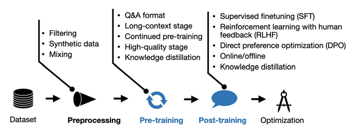

#### The Big LLM Architecture Comparison (in 2025)

- [The Big LLM Architecture Comparison✍️](https://sebastianraschka.com/blog/2025/the-big-llm-architecture-comparison.html):💡 [19 Jul 2025]
- [LLM Architecture Gallery✍️](https://sebastianraschka.com/llm-architecture-gallery/): Visual guide to modern LLM architectures and design tradeoffs. [26 Mar 2026]


  | Model                 | Parameters | Attention Type                           | MoE                             | Norm                            | Positional Encoding            | Notable Features                                                                            |
  | --------------------- | ---------- | ---------------------------------------- | ------------------------------- | ------------------------------- | ------------------------------ | ------------------------------------------------------------------------------------------- |
  | **DeepSeek V3 / R1**  | 671B       | Multi-Head Latent Attention (MLA)        | Yes, 256 experts (37B active)   | Pre-normalization               | RoPE                           | KV compression via MLA, shared expert, high inference efficiency                            |
  | **OLMo 2**            | 32B        | Multi-Head Attention (MHA)               | No                              | Post-normalization + QK norm (RMSNorm) | RoPE                           | RMSNorm scaling after attention & FF, training stability                                  |
  | **Gemma 3 / 3n**      | 27B / 4B   | Sliding Window + Grouped-Query Attention | No                              | Pre + Post RMSNorm          | RoPE                           | Sliding window attention, Gemma 3n: Per-Layer Embedding (PLE), MatFormer slices             |
  | **Mistral Small 3.1** | 24B        | Grouped-Query Attention                  | No                              | Pre-normalization               | RoPE                           | Optimized for low latency, simpler than Gemma 3                                             |
  | **Llama 4 Maverick**  | 400B       | Grouped-Query Attention                  | Yes, fewer & larger experts     | Pre-normalization               | RoPE                           | Alternating MoE & dense layers, 17B active parameters                                       |
  | **Qwen3 (Dense)**     | 0.6–32B    | Grouped-Query Attention                  | No                              | Pre-normalization               | RoPE                           | Deep architecture, small memory footprint                                                   |
  | **Qwen3 (MoE)**       | 30B–235B   | Grouped-Query Attention                  | Yes, no shared expert           | Pre-normalization               | RoPE                           | Sparse MoE, optimized for large-scale inference                                             |
  | **SmolLM3**           | 3B         | Grouped-Query Attention                  | No                              | Pre-normalization               | NoPE (No Positional Embedding) | Good small-scale performance, improved length generalization                                |
  | **Kimi K2**           | 1T         | MLA                                      | Yes, more experts than DeepSeek | Pre-normalization               | RoPE                           | Muon optimizer, very high modeling performance, open-weight                                 |
  | **gpt-oss**           | 20B / 120B | Grouped-Query + Sliding Window           | Yes, few large experts          | Pre-normalization               | RoPE                           | Wider architecture, attention sinks, bias units                                             |
  | **Grok 2.5**          | 70B        | Grouped-Query Attention                  | Yes                              | Pre-normalization               | RoPE                           | Standard large-scale architecture                                                           |
  | **GLM-4.5**           | 130B       | Grouped-Query Attention                  | Yes                              | Pre-normalization               | RoPE                           | Standard architecture with high performance                                                 |
  | **Qwen3-Next**        | -        | Grouped-Query Attention                  | Yes                             | Pre-normalization               | RoPE                           | Expert size & number tuned, Gated DeltaNet + Gated Attention Hybrid, Multi-Token Prediction |

- [Beyond Standard LLMs✍️](https://magazine.sebastianraschka.com/p/beyond-standard-llms):💡Linear Attention Hybrids, Text Diffusion, Code World Models, and Small Recursive Transformers [04 Nov 2025]

  | **Architecture Type** | **Key Models** | **Attention Mechanism** | **Main Advantage** | **Main Limitation** | **Use Case** |
  | --- | --- | --- | --- | --- | --- |
  | **Standard Transformer** | GPT-5, DeepSeek V3/R1, Llama 4, Qwen3, Gemini 2.5, MiniMax-M2 | Quadratic O(n²) scaled-dot-product | Proven, SOTA performance, mature tooling | Expensive training & inference, quadratic complexity | General-purpose LLM tasks |
  | **Linear Attention Hybrids** | Qwen3-Next, Kimi Linear, MiniMax-M1, DeepSeek V3.2 | Gated DeltaNet + Full Attention (3:1 ratio) | 75% KV cache reduction, 6× decoding throughput, linear O(n) | Trades accuracy for efficiency, added complexity | Long-context tasks, resource-constrained environments |
  | **Text Diffusion** | LLaDA, Gemini Diffusion | Bidirectional (no causal mask) | Parallel token generation, faster responses | Can't stream, tricky tool-calling, quality degradation with fewer steps | Fast inference, on-device LLMs |
  | **Code World Models** | CWM (32B) | Standard sliding-window attention | Simulates code execution, improves reasoning | Limited to code domain, added latency from execution traces | Code generation, debugging, test-time scaling |
  | **Small Recursive Transformers** | TRM (7M), HRM (28M) | Standard attention with recursive refinement | Very small (7M params), strong puzzle solving, <$500 training cost | Special-purpose, limited to structured tasks (Sudoku, ARC, Maze) | Domain-specific reasoning, tool-calling modules |

#### GPT-2 vs gpt-oss

- [From GPT-2 to gpt-oss: Analyzing the Architectural Advances✍️](https://magazine.sebastianraschka.com/p/from-gpt-2-to-gpt-oss-analyzing-the) [9 Aug 2025]

| Feature              | GPT-2                          | GPT-OSS                              |
| -------------------- | ------------------------------ | ------------------------------------ |
| Release & Size       | 2019, up to 1.5B params        | 2025, 20B & 120B params (MoE)        |
| Architecture         | Dense transformer decoder      | Mixture-of-Experts (MoE) decoder     |
| Activation & Dropout | Swish activation, uses dropout | GELU (or optimized), no dropout      |
| Parameter Efficiency | All params active per token    | Sparse activation of experts         |
| Deployment & License | MIT license    | Open-weight local runs, Apache 2.0   |
| Reasoning & Tools    | Basic generation               | Built-in chain-of-thought & tool use |

### **Evolutionary Tree of Large Language Models**

- Evolutionary Graph of LLaMA Family  
  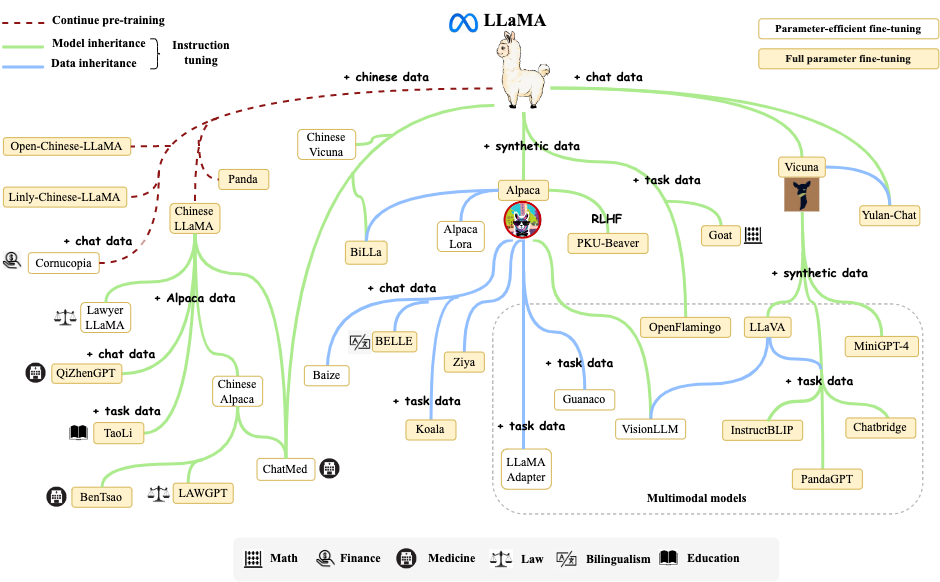  
- LLM evolutionary tree  
  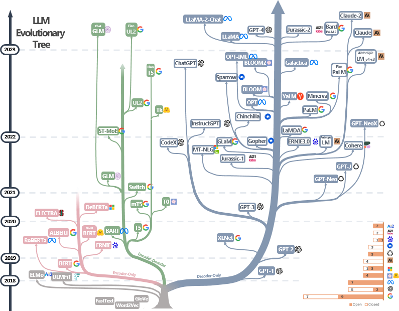  
- Timeline of SLMs  
  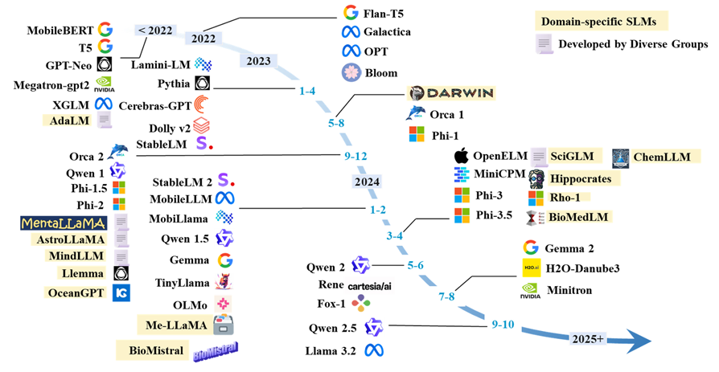  
- [A Comprehensive Survey of Small Language Models in the Era of Large Language Models📑](https://arxiv.org/abs/2411.03350) / [✨](https://github.com/FairyFali/SLMs-Survey) [4 Nov 2024] 
- [LLM evolutionary tree📑](https://arxiv.org/abs/2304.13712): A curated list of practical guide resources of LLMs (LLMs Tree, Examples, Papers) [✨](https://github.com/Mooler0410/LLMsPracticalGuide) [26 Apr 2023]
 
- [A Survey of Large Language Models📑](https://arxiv.org/abs/2303.18223): /[✨](https://github.com/RUCAIBox/LLMSurvey) [31 Mar 2023] contd.
 

### **A Taxonomy of Natural Language Processing**

- An overview of different fields of study and recent developments in NLP. [🗄️](../files/taxonomy-nlp.pdf) / [✍️](https://towardsdatascience.com/a-taxonomy-of-natural-language-processing-dfc790cb4c01) [24 Sep 2023]
  Exploring the Landscape of Natural Language Processing Research [ref📑](https://arxiv.org/abs/2307.10652) [20 Jul 2023]
  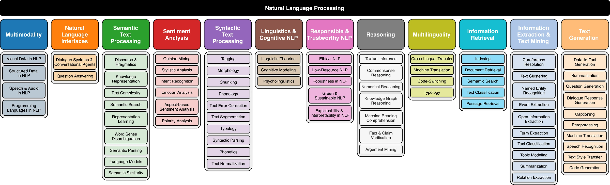  
 - NLP taxonomy  
  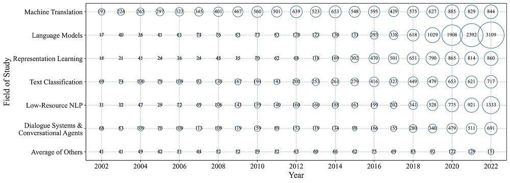  
  Distribution of the number of papers by most popular fields of study from 2002 to 2022

### **Large Language Model Collection**

- Ai2 (Allen Institute for AI)
  - Founded by Paul Allen, the co-founder of Microsoft, in Sep 2024.
  - [DR Tulu✨](https://github.com/rlresearch/DR-Tulu): 8B. Deep Research (DR) model trained for long-form DR tasks. [Nov 2025]
  - [OLMo📑](https://arxiv.org/abs/2402.00838):💡Truly open language model and framework to build, study, and advance LMs, along with the training data, training and evaluation code, intermediate model checkpoints, and training logs. [✨](https://github.com/allenai/OLMo) [Feb 2024]
  - [OLMo 2](https://allenai.org/blog/olmo2) [26 Nov 2024]
   
  - [OLMo 3✍️](https://allenai.org/blog/olmo3): Fully open models including the entire flow. [20 Nov 2025]
  - [OLMoE✨](https://github.com/allenai/OLMoE): fully-open LLM leverages sparse Mixture-of-Experts [Sep 2024]
  - [TÜLU 3📑](https://arxiv.org/abs/2411.15124):💡Pushing Frontiers in Open Language Model Post-Training [✨](https://github.com/allenai/open-instruct) / demo:[✍️](https://playground.allenai.org/) [22 Nov 2024] 
- Alibaba
  - Qwen (通义千问: Universal Intelligence that can answer a thousand questions) [✨](https://github.com/QwenLM) [Flagship Models✍️](https://qwen.ai/)
  - [Qwen model family](https://qwen4.net/qwen-model-family/): Qwen first model released in [April 2023]
  - [Qwen3 Technical Report📑](https://arxiv.org/abs/2505.09388): Unified thinking and non-thinking modes across dense and MoE models. [May 2025]
  - [Qwen-Image-Edit](https://qwen4.net/qwen-image-edit/) [18 Aug 2025]
  - [Qwen3-Max](https://qwen4.net/qwen3-max-is-the-most-intelligent-non-reasoning-model/): over 1 trillion parameters. 256K tokens. [5 Sep 2025]
- Amazon
  - [Amazon Nova Foundation Models](https://aws.amazon.com/de/ai/generative-ai/nova/): Text only - Micro, Multimodal - Light, Pro [3 Dec 2024]
  - [The Amazon Nova Family of Models: Technical Report and Model Card📑](https://arxiv.org/abs/2506.12103) [17 Mar 2025]
- Anthrophic
  - [Claude 3✍️](https://www.anthropic.com/news/claude-3-family), the largest version of the new LLM, outperforms rivals GPT-4 and Google’s Gemini 1.0 Ultra. Three variants: Opus, Sonnet, and Haiku. [Mar 2024]
  - [Claude 3.7 Sonnet and Claude Code✍️](https://www.anthropic.com/news/claude-3-7-sonnet): the first hybrid reasoning model. [✍️](https://assets.anthropic.com/m/785e231869ea8b3b/original/claude-3-7-sonnet-system-card.pdf) [25 Feb 2025]
  - [Claude 4✍️](https://www.anthropic.com/news/claude-4): Claude Opus 4 (72.5% on SWE-bench),  Claude Sonnet 4 (72.7% on SWE-bench). Extended Thinking Mode (Beta). Parallel Tool Use & Memory. Claude Code SDK. AI agents: code execution, MCP connector, Files API, and 1-hour prompt caching. [23 May 2025]
  - [Claude 4.5✍️](https://www.anthropic.com/news/claude-sonnet-4-5): Major upgrades in autonomous coding, tool use, context handling, memory, and long-horizon reasoning; supports over 30 hours of continuous operation. [30 Sep 2025]
  - [Claude Opus 4.5✍️](https://www.anthropic.com/news/claude-opus-4-5):  SWE-bench Verified (80.9%).  $5/$25 per million tokens [25 Nov 2025]
  - [anthropic/cookbook✨](https://github.com/anthropics/anthropic-cookbook)
- Apple
  - [OpenELM](https://machinelearning.apple.com/research/openelm): Apple released a Transformer-based language model. Four sizes of the model: 270M, 450M, 1.1B, and 3B parameters. [April 2024]
  - [Apple Intelligence Foundation Language Models](https://machinelearning.apple.com/research/apple-intelligence-foundation-language-models): 1. A 3B on-device model used for language tasks like summarization and Writing Tools. 2. A large Server model used for language tasks too complex to do on-device. [10 Jun 2024]
- Baidu
  - [ERNIE Bot's official website](https://yiyan.baidu.com/): ERNIE X1 (deep-thinking reasoning) and ERNIE 4.5 (multimodal) [16 Mar 2025]
  - A list of models & libraries: [✨](https://github.com/PaddlePaddle/ERNIE)
- Chatbot Arena🤗
  - [Chatbot Arena🤗](https://huggingface.co/spaces/lmsys/chatbot-arena-leaderboard): Benchmarking LLMs in the Wild with Elo Ratings
- Cohere
  - Founded in 2019. Canadian multinational tech.
  - [Command R+🤗](https://huggingface.co/collections/CohereForAI/c4ai-command-r-plus-660ec4c34f7a69c50ce7f7b9): The performant model for RAG capabilities, multilingual support, and tool use. [Aug 2024]
  - [An Overview of Cohere’s Models](https://docs.cohere.com/v2/docs/models) | [Playground](https://dashboard.cohere.com/playground)
- Databricks
  - [DBRX](https://www.databricks.com/blog/introducing-dbrx-new-state-art-open-llm): MoE, open, general-purpose LLM created by Databricks. [27 Mar 2024]
- Deepseek
  - Founded in 2023, is a Chinese company dedicated to AGI.
  - [DeepSeek-V3✨](https://github.com/deepseek-ai/DeepSeek-V3): Mixture-of-Experts (MoE) with 671B. [26 Dec 2024]
  - [DeepSeek-V3 Technical Report📑](https://arxiv.org/abs/2412.19437): 671B MoE model with MLA and auxiliary-loss-free load balancing. [Dec 2024]
  - [DeepSeek-R1✨](https://github.com/deepseek-ai/DeepSeek-R1):💡an open source reasoning model. Group Relative Policy Optimization (GRPO). Base -> RL -> SFT -> RL -> SFT -> RL [20 Jan 2025] [ref📑](https://arxiv.org/abs/2503.11486): A Review of DeepSeek Models' Key Innovative Techniques [14 Mar 2025]
  - [Janus✨](https://github.com/deepseek-ai/Janus): Multimodal understanding and visual generation. [28 Jan 2025]
  - [DeepSeek-V3🤗](https://huggingface.co/deepseek-ai/DeepSeek-V3): 671B. Top-tier performance in coding and reasoning tasks [25 Mar 2025]
  - [DeepSeek-Prover-V2✨](https://github.com/deepseek-ai/DeepSeek-Prover-V2): Mathematical reasoning [30 Apr 2025]
  - [DeepSeek-v3.1🤗](https://huggingface.co/deepseek-ai/DeepSeek-V3.1): Think/Non‑Think hybrid reasoning. 128K and MoE. Agent abilities.  [19 Aug 2025]
  - [DeepSeek-V3.2📑](https://arxiv.org/abs/2512.02556): DeepSeek Sparse Attention (DSA) cuts complexity from O(L²) to O(Lk). [12 Dec 2025]
  - [DeepSeek-V3.2-Exp✨](https://github.com/deepseek-ai/DeepSeek-V3.2-Exp) [Sep 2025] 
  - [DeepSeek-OCR✨](https://github.com/deepseek-ai/DeepSeek-OCR): Convert long text into an image, compresses it into visual tokens, and sends those to the LLM — cutting cost and expanding context capacity. [Oct 2025] 
  - [DeepSeekMath-V2✨](https://github.com/deepseek-ai/DeepSeek-Math-V2/): a Self-Verifiable Mathematical Reasoning model [27 Nov 2025] 
  - [mHC (Manifold-Constrained Hyper-Connections)📑](https://arxiv.org/abs/2512.24880) [31 Dec 2025]
    Controlled layer updates for stable deep models. `next state = current state + constrained update`   
    (vs. residuals: F(x) + x -> Hyper-Connections: unconstrained -> mHC: constrained)
  - [Engram (Conditional Memory Module)✨](https://github.com/deepseek-ai/Engram)
    Adds a native memory lookup alongside neural computation, letting frequent patterns be retrieved in constant time. `output = compute(x) + memory lookup(x)`   
    (vs. attention: recomputing patterns every time -> Engram)
  - A list of models: [✨](https://github.com/deepseek-ai)
- EleutherAI
  - Founded in July 2020. United States tech. GPT-Neo, GPT-J, GPT-NeoX, and The Pile dataset.
  - [Pythia📑](https://arxiv.org/abs/2304.01373): How do large language models (LLMs) develop and evolve over the course of training and change as models scale? A suite of decoder-only autoregressive language models ranging from 70M to 12B parameters [✨](https://github.com/EleutherAI/pythia) [Apr 2023]
 
- Google
  - [Foundation Models](https://ai.google/discover/our-models/): Gemini, Veo, Gemma etc.
  - [Gemma](http://ai.google.dev/gemma): Open weights LLM from Google DeepMind. [✨](https://github.com/google-deepmind/gemma) / Pytorch [✨](https://github.com/google/gemma_pytorch) [Feb 2024]
  
  - [Gemma 2](https://www.kaggle.com/models/google/gemma-2/) 2B, 9B, 27B [ref: releases](https://ai.google.dev/gemma/docs/releases) [Jun 2024]
  - [Gemma 3](https://developers.googleblog.com/en/introducing-gemma3/):  Single GPU. Context
length of 128K tokens, SigLIP encoder, Reasoning [✍️](https://storage.googleapis.com/deepmind-media/gemma/Gemma3Report.pdf) [12 Mar 2025]
  - [Gemini](https://gemini.google.com/app): Rebranding: Bard -> Gemini [8 Feb 2024]
  - [Gemini 1.5✍️](https://blog.google/technology/ai/google-gemini-next-generation-model-february-2024): 1 million token context window, 1 hour of video, 11 hours of audio, codebases with over 30,000 lines of code or over 700,000 words. [Feb 2024]
  - [Gemini 2 Flash✍️](https://blog.google/technology/google-deepmind/google-gemini-ai-update-december-2024/): Multimodal LLM with multilingual inputs/outputs, real-time capabilities (Project Astra), complex task handling (Project Mariner), and developer tools (Jules) [11 Dec 2024]
  - Gemini 2.0 Flash Thinking Experimental [19 Dec 2024]
  - [Gemini 2.5✍️](https://blog.google/technology/google-deepmind/gemini-model-thinking-updates-march-2025/): strong reasoning and code. 1 million token context [25 Mar 2025] -> [I/O 2025✍️](https://blog.google/technology/ai/io-2025-keynote) Deep Think, 1M-token context, Native audio output, Project Mariner: AI-powered computer control. [20 May 2025] [Gemini 2.5: Pushing the Frontier with Advanced Reasoning, Multimodality, Long Context, and Next Generation Agentic Capabilities.📑](https://arxiv.org/abs/2507.06261)
  - [Gemma 3n](https://developers.googleblog.com/en/introducing-gemma-3n/): The next generation of Gemini Nano. Gemma 3n uses DeepMind’s Per-Layer Embeddings (PLE) to run 5B/8B models at 2GB/3GB RAM. [20 May 2025]
  - [gemini/cookbook✨](https://github.com/google-gemini/cookbook)
  - [Gemini 3 Pro✍️](https://blog.google/products/gemini/gemini-3/): Deep Think reasoning, Advanced  multimodal understanding, spatial reasoning, and agentic capabilities up 30% from 2.5 Pro — reaching 37.5% on Humanity’s Last Exam (41% in Deep Think mode). [18 Nov 2025]
- Groq
  - Founded in 2016. low-latency AI inference H/W. American tech.
  - [Llama-3-Groq-Tool-Use](https://wow.groq.com/introducing-llama-3-groq-tool-use-models/): a model optimized for function calling [Jul 2024]
- Huggingface
  - [Open R1✨](https://github.com/huggingface/open-r1): A fully open reproduction of DeepSeek-R1. [25 Jan 2025]
  - [Huggingface Open LLM Learboard🤗](https://huggingface.co/spaces/HuggingFaceH4/open_llm_leaderboard)
- IBM
  - [Granite Guardian✨](https://github.com/ibm-granite/granite-guardian): a collection of models designed to detect risks in prompts and responses [10 Dec 2024]
- [Jamba](https://www.ai21.com/blog/announcing-jamba): AI21's SSM-Transformer Model. Mamba  + Transformer + MoE [28 Mar 2024]
- [KoAlpaca✨](https://github.com/Beomi/KoAlpaca): Alpaca for korean [Mar 2023]
 
- Llama variants emerged in 2023</summary>
  - [Falcon LLM](https://falconllm.tii.ae/) Apache 2.0 license [Mar 2023]
  - [Alpaca](https://crfm.stanford.edu/2023/03/13/alpaca.html): Fine-tuned from the LLaMA 7B model [Mar 2023]
  - [vicuna](https://vicuna.lmsys.org/): 90% ChatGPT Quality [Mar 2023]
  - [dolly](https://www.databricks.com/blog/2023/03/24/hello-dolly-democratizing-magic-chatgpt-open-models.html): Databricks [Mar 2023]
  - [Cerebras-GPT](https://www.cerebras.net/blog/cerebras-gpt-a-family-of-open-compute-efficient-large-language-models/): 7 GPT models ranging from 111m to 13b parameters. [Mar 2023]
  - [Koala](https://bair.berkeley.edu/blog/2023/04/03/koala/): Focus on dialogue data gathered from the web.  [Apr 2023]
  - [StableVicuna](https://stability.ai/blog/stablevicuna-open-source-rlhf-chatbot) First Open Source RLHF LLM Chatbot [Apr 2023]
  - Upstage's 70B Language Model Outperforms GPT-3.5: [✍️](https://en.upstage.ai/newsroom/upstage-huggingface-llm-no1) [1 Aug 2023]
- [LLM Collection](https://www.promptingguide.ai/models/collection): promptingguide.ai
- Meta
  - Most OSS LLM models have been built on the [Llama✨](https://github.com/facebookresearch/llama) / [✍️](https://ai.meta.com/llama) / [✨](https://github.com/meta-llama/llama-models)
  
  - [Llama 2🤗](https://huggingface.co/blog/llama2): 1) 40% more data than Llama. 2)7B, 13B, and 70B. 3) Trained on over 1 million human annotations. 4) double the context length of Llama 1: 4K 5) Grouped Query Attention, KV Cache, and Rotary Positional Embedding were introduced in Llama 2 [18 Jul 2023] [demo🤗](https://huggingface.co/blog/llama2#demo)
  - [Llama 3](https://llama.meta.com/llama3/): 1) 7X more data than Llama 2. 2) 8B, 70B, and 400B. 3) 8K context length [18 Apr 2024]
  - [MEGALODON✨](https://github.com/XuezheMax/megalodon): Long Sequence Model. Unlimited context length. Outperforms Llama 2 model. [Apr 2024]
 
  - [Llama 3.1](https://ai.meta.com/blog/meta-llama-3-1/): 405B, context length to 128K, add support across eight languages. first OSS model outperforms GTP-4o. [23 Jul 2024]
  - [Llama 3.2](https://ai.meta.com/blog/llama-3-2-connect-2024-vision-edge-mobile-devices/): Multimodal. Include text-only models (1B, 3B) and text-image models (11B, 90B), with quantized versions of 1B and 3B [Sep 2024]
  - [NotebookLlama✨](https://github.com/meta-llama/llama-recipes/tree/main/recipes/quickstart/NotebookLlama): An Open Source version of NotebookLM [28 Oct 2024]
  - [Llama 3.3](https://www.llama.com/docs/model-cards-and-prompt-formats/llama3_3/): a text-only 70B instruction-tuned model. Llama 3.3 70B approaches the performance of Llama 3.1 405B. [6 Dec 2024]
  - [Llama 4](https://www.llama.com/docs/model-cards-and-prompt-formats/llama4_omni/):  Mixture of Experts (MoE). Llama 4 Scout (actived 17b / total 109b, 10M Context, single GPU), Llama 4 Maverick (actived 17b / total 400b, 1M Context) [✨](https://github.com/meta-llama/llama-models/tree/main/models/llama4): Model Card [5 Apr 2025] 
- [ModernBERT📑](https://arxiv.org/abs/2412.13663): ModernBERT can handle sequences up to 8,192 tokens and utilizes sparse attention mechanisms to efficiently manage longer context lengths. [18 Dec 2024]
- Microsoft
  - [MAI-1✍️](https://microsoft.ai/news/two-new-in-house-models/): MAI-Voice-1, MAI-1-preview. Microsoft in-house models. [28 Aug 2025]
  - phi-series: cost-effective small language models (SLMs) [✍️](https://azure.microsoft.com/en-us/products/phi) [✨](https://aka.ms/Phicookbook): Cookbook
  - [Phi-1📑](https://arxiv.org/abs/2306.11644): Despite being small in size, phi-1 attained 50.6% on HumanEval and 55.5% on MBPP. Textbooks Are All You Need. [✍️](https://analyticsindiamag.com/microsoft-releases-1-3-bn-parameter-language-model-outperforms-llama/) [20 Jun 2023]
  - [Phi-1.5📑](https://arxiv.org/abs/2309.05463): Textbooks Are All You Need II. Phi 1.5 is trained solely on synthetic data. Despite having a mere 1 billion parameters compared to Llama 7B's much larger model size, Phi 1.5 often performs better in benchmark tests. [11 Sep 2023]
  - phi-2: open source, and 50% better at mathematical reasoning. [✨🤗](https://huggingface.co/microsoft/phi-2) [Dec 2023]
  - phi-3-vision (multimodal), phi-3-small, phi-3 (7b), phi-sillica (Copilot+PC designed for NPUs)
  - [Phi-3📑](https://arxiv.org/abs/2404.14219): Phi-3-mini, with 3.8 billion parameters, supports 4K and 128K context, instruction tuning, and hardware optimization. [22 Apr 2024] [✍️](https://azure.microsoft.com/en-us/blog/introducing-phi-3-redefining-whats-possible-with-slms/)
  - phi-3.5-MoE-instruct: [🤗](https://huggingface.co/microsoft/Phi-3.5-MoE-instruct) [Aug 2024]
  - [Phi-4📑](https://arxiv.org/abs/2412.08905): Specializing in Complex Reasoning [✍️](https://techcommunity.microsoft.com/blog/aiplatformblog/introducing-phi-4-microsoft%E2%80%99s-newest-small-language-model-specializing-in-comple/4357090) [12 Dec 2024]
  - [Phi-4-multimodal / mini🤗](https://huggingface.co/microsoft/Phi-4-multimodal-instruct/blob/main/phi_4_mm.tech_report.02252025.pdf) 5.6B. speech, vision, and text processing into a single, unified architecture. [26 Feb 2025]
  - [Phi-4-reasoning✍️](https://azure.microsoft.com/en-us/blog/one-year-of-phi-small-language-models-making-big-leaps-in-ai/): Phi-4-reasoning, Phi-4-reasoning-plus, Phi-4-mini-reasoning [30 Apr 2025]
  - [Phi-4-mini-flash-reasoning✍️](https://azure.microsoft.com/en-us/blog/reasoning-reimagined-introducing-phi-4-mini-flash-reasoning/): 3.8B, 64K context, Single GPU, Decoder-Hybrid-Decoder architecture  [9 Jul 2025]
- MiniMaxAI
  - Founded in Dec 2021. Shanghai, China.
  - [MiniMax-M2✨](https://github.com/MiniMax-AI/MiniMax-M2): Coding and Agent tasks, 230B (10B Active), MoE, a new high ahead of DeepSeek-V3.2 and Kimi K2 
- Mistral
  - Founded in April 2023. French tech.
  - Model overview [✍️](https://docs.mistral.ai/getting-started/models/)
  - [NeMo](https://mistral.ai/news/mistral-nemo/): 12B model with 128k context length that outperforms LLama 3 8B [18 Jul 2024]
  - [Mistral OCR](https://mistral.ai/news/mistral-ocr): Precise text recognition with up to 99% accuracy. Multimodal. Browser based [6 Mar 2025]
  - [Mistral Large 3✍️](https://mistral.ai/news/mistral-3): Flagship multimodal model for reasoning, coding, and enterprise assistants. [Mar 2025]
- Moonshot AI
  - Moonshot AI is a Beijing-based Chinese AI company founded in March 2023
  - [Kimi-K2✨](https://github.com/MoonshotAI/Kimi-K2): 1T parameter MoE model. MuonClip Optimizer. Agentic Intelligence. [11 Jul 2025]
  - [Kimi K2 Thinking✍️](https://moonshotai.github.io/Kimi-K2/thinking.html): The first open-source model beats GPT-5 in Agent benchmark. [7 Nov 2025]
  - [Kimi-K2.5✨](https://github.com/MoonshotAI/Kimi-K2.5): Open-source multimodal agentic model by Moonshot AI. [Jan 2026] 
- NVIDIA
  - [Nemotron-4 340B](https://research.nvidia.com/publication/2024-06_nemotron-4-340b): Synthetic Data Generation for Training Large Language Models [14 Jun 2024]
- [ollam](https://ollama.com/library?sort=popular): ollama-supported models
- [Open-Sora✨](https://github.com/hpcaitech/Open-Sora): Democratizing Efficient Video Production for All  [Mar 2024]
 
- OpenAI
  - [gpt-oss✨](https://github.com/openai/gpt-oss):💡**gpt-oss-120b** and **gpt-oss-20b** are two open-weight language models by OpenAI. [Jun 2025] 
- Qualcomm
  - [Qualcomm’s on-device AI models🤗](https://huggingface.co/qualcomm): Bring generative AI to mobile devices [Feb 2024]
- Tencent
  - Founded in 1998, Tencent is a Chinese company dedicated to various technology sectors, including social media, gaming, and AI development.
  - [Hunyuan-Large](https://arxiv.org/pdf/2411.02265): An open-source MoE model with open weights. [4 Nov 2024] [✨](https://github.com/Tencent/Tencent-Hunyuan-Large) 
  - [Hunyuan-T1](https://tencent.github.io/llm.hunyuan.T1/README_EN.html): Reasoning model [21 Mar 2025]
  - A list of models: [✨](https://github.com/Tencent-Hunyuan)
- [The LLM Index](https://sapling.ai/llm/index): A list of large language models (LLMs)
- [The mother of all spreadsheets for anyone into LLMs](https://x.com/DataChaz/status/1868708625310699710) [17 Dec 2024]
- [The Open Source AI Definition](https://opensource.org/ai/open-source-ai-definition) [28 Oct 2024]
- xAI
  - xAI is an American AI company founded by Elon Musk in March 2023
  - [Grok](https://x.ai/blog/grok-os): 314B parameter Mixture-of-Experts (MoE) model. Released under the Apache 2.0 license. Not includeded training code. Developed by JAX [✨](https://github.com/xai-org/grok) [17 Mar 2024]
 
  - [Grok-2 and Grok-2 mini](https://x.ai/blog/grok-2) [13 Aug 2024]
  - [Grok-2.5](https://x.com/elonmusk/status/1959379349322313920): Grok 2.5 Goes Open Source [24 Aug 2025]
  - [Grok-3](https://x.ai/grok): 200,000 GPUs to train. Grok 3 beats GPT-4o on AIME, GPQA. Grok 3 Reasoning and Grok 3 mini Reasoning. [17 Feb 2025]
  - [Grok-4](https://x.ai/news/grok-4): Humanity’s Last Exam, Grok 4 Heavy scored 44.4% [9 Jul 2025]
  - [Grok 4.1✍️](https://x.ai/news/grok-4-1) [17 Nov 2025]
- Xiaomi
  - Founded in 2010, Xiaomi is a Chinese company known for its innovative consumer electronics and smart home products.
  - [Mimo✨](https://github.com/XiaomiMiMo/MiMo): 7B. advanced reasoning for code and math [30 Apr 2025)
- Z.ai
  - formerly Zhipu, Beijing-based Chinese AI company founded in March 2019
  - [GLM-4.5✨](https://github.com/zai-org/GLM-4.5): An open-source large language model designed for intelligent agents
  - [GLM-4.6✍️](https://z.ai/blog/glm-4.6): GLM-4.6: Advanced Agentic, Reasoning and Coding Capabilities [30 Sep 2025]


### **LLM for Domain Specific**

- [AI for Scaling Legal Reform: Mapping and Redacting Racial Covenants in Santa Clara County📑](https://arxiv.org/abs/2503.03888): a fine-tuned open LLM to detect racial covenants in 24　million housing documents, cutting 86,500 hours of manual work. [12 Feb 2025]
- [AlphaChip](https://deepmind.google/discover/blog/how-alphachip-transformed-computer-chip-design/): Reinforcement learning-based model for designing physical chip layouts. [26 Sep 2024]
- [AlphaFold3✨](https://github.com/Ligo-Biosciences/AlphaFold3): Open source implementation of AlphaFold3 [Nov 2023] / [OpenFold✨](https://github.com/aqlaboratory/openfold): PyTorch reproduction of AlphaFold 2 [Sep 2021]  
- [AlphaGenome](https://deepmind.google/discover/blog/alphagenome-ai-for-better-understanding-the-genome): DeepMind’s advanced AI model, launched in June 2025, is designed to analyze the regulatory “dark matter” of the genome—specifically, the 98% of DNA that does not code for proteins but instead regulates when and how genes are expressed. [June 2025]
- [BioGPT📑](https://arxiv.org/abs/2210.10341): Generative Pre-trained Transformer for Biomedical Text Generation and Mining [✨](https://github.com/microsoft/BioGPT) [19 Oct 2022] 
- [BloombergGPT📑](https://arxiv.org/abs/2303.17564): A Large Language Model for Finance [30 Mar 2023]
- [Chai-1✨](https://github.com/chaidiscovery/chai-lab): a multi-modal foundation model for molecular structure prediction [Sep 2024]
 
- [Code Llama📑](https://arxiv.org/abs/2308.12950): Built on top of Llama 2, free for research and commercial use. [✍️](https://ai.meta.com/blog/code-llama-large-language-model-coding/) / [✨](https://github.com/facebookresearch/codellama) [24 Aug 2023] 
- [DeepSeek-Coder-V2✨](https://github.com/deepseek-ai/DeepSeek-Coder-V2): Open-source Mixture-of-Experts (MoE) code language model [17 Jun 2024]
 
- [Devin AI](https://preview.devin.ai/): Devin is an AI software engineer developed by Cognition AI [12 Mar 2024]
- [EarthGPT📑](https://arxiv.org/abs/2401.16822): A Universal Multi-modal Large Language Model for Multi-sensor Image Comprehension in Remote Sensing Domain [30 Jan 2024]
- [ESM3: A frontier language model for biology](https://www.evolutionaryscale.ai/blog/esm3-release): Simulating 500 million years of evolution [✨](https://github.com/evolutionaryscale/esm) / [✍️](https://doi.org/10.1101/2024.07.01.600583) [31 Dec 2024]  
- [FrugalGPT📑](https://arxiv.org/abs/2305.05176): LLM with budget constraints, requests are cascaded from low-cost to high-cost LLMs. [✨](https://github.com/stanford-futuredata/FrugalGPT) [9 May 2023] 
- [Galactica📑](https://arxiv.org/abs/2211.09085): A Large Language Model for Science [16 Nov 2022]
- Gemma series
  - [Gemma series in Huggingface🤗](https://huggingface.co/google)
  - [PaliGemma📑](https://arxiv.org/abs/2407.07726): a 3B VLM [10 Jul 2024]
  - [DataGemma✍️](https://blog.google/technology/ai/google-datagemma-ai-llm/) [12 Sep 2024] / [NotebookLM✍️](https://blog.google/technology/ai/notebooklm-audio-overviews/): LLM-powered notebook. free to use, not open-source. [12 Jul 2023]
  - [PaliGemma 2📑](https://arxiv.org/abs/2412.03555): VLMs
 at 3 different sizes (3B, 10B, 28B)  [4 Dec 2024]
  - [TxGemma](https://developers.googleblog.com/en/introducing-txgemma-open-models-improving-therapeutics-development/): Therapeutics development [25 Mar 2025]
  - [Dolphin Gemma✍️](https://blog.google/technology/ai/dolphingemma/): Decode dolphin communication [14 Apr 2025]
  - [MedGemma](https://deepmind.google/models/gemma/medgemma/): Model fine-tuned for biomedical text and image understanding. [20 May 2025]
  - [SignGemma](https://x.com/GoogleDeepMind/status/1927375853551235160): Vision-language model for sign language recognition and translation. [27 May 2025)
- [Huggingface StarCoder: A State-of-the-Art LLM for Code🤗](https://huggingface.co/blog/starcoder): [✨🤗](https://huggingface.co/bigcode/starcoder) [May 2023]
- [MechGPT📑](https://arxiv.org/abs/2310.10445): Language Modeling Strategies for Mechanics and Materials [✨](https://github.com/lamm-mit/MeLM) [16 Oct 2023] 
- [MeshGPT](https://nihalsid.github.io/mesh-gpt/): Generating Triangle Meshes with Decoder-Only Transformers [27 Nov 2023]
- [OpenCoder✨](https://github.com/OpenCoder-llm/OpenCoder-llm): 1.5B and 8B base and open-source Code LLM, supporting both English and Chinese. [Oct 2024] 
- [Prithvi WxC📑](https://arxiv.org/abs/2409.13598): In collaboration with NASA, IBM is releasing an open-source foundation model for Weather and Climate [✍️](https://research.ibm.com/blog/foundation-model-weather-climate) [20 Sep 2024]
- [Qwen2-Math✨](https://github.com/QwenLM/Qwen2-Math): math-specific LLM / [Qwen2-Audio✨](https://github.com/QwenLM/Qwen2-Audio): large-scale audio-language model [Aug 2024] / [Qwen 2.5-Coder✨](https://github.com/QwenLM/Qwen2.5-Coder) [18 Sep 2024]
   
- [Qwen3-Coder✨](https://github.com/QwenLM/Qwen3-Coder): Qwen3-Coder is the code version of Qwen3, the large language model series developed by Qwen team, Alibaba Cloud. [Jul 2025] 
- [GLM-5🤗](https://huggingface.co/zai-org/GLM-5): Model card for Z.ai's latest GLM family release.
- [SaulLM-7B📑](https://arxiv.org/abs/2403.03883): A pioneering Large Language Model for Law [6 Mar 2024]
- [TimeGPT](https://nixtla.github.io/nixtla/): The First Foundation Model for Time Series Forecasting [✨](https://github.com/Nixtla/neuralforecast) [Mar 2023]
 
- [Video LLMs for Temporal Reasoning in Long Videos📑](https://arxiv.org/abs/2412.02930): TemporalVLM, a video LLM excelling in temporal reasoning and fine-grained understanding of long videos, using time-aware features and validated on datasets like TimeIT and IndustryASM for superior performance. [4 Dec 2024]

### **MLLM (multimodal large language model)**

- Apple
  - [4M-21📑](https://arxiv.org/abs/2406.09406): An Any-to-Any Vision Model for Tens of Tasks and Modalities. [13 Jun 2024]
- [Awesome Multimodal Large Language Models✨](https://github.com/BradyFU/Awesome-Multimodal-Large-Language-Models): Latest Papers and Datasets on Multimodal Large Language Models, and Their Evaluation. [Jun 2023]
 
- Benchmarking Multimodal LLMs.
  - LLaVA-1.5 achieves SoTA on a broad range of 11 tasks incl. SEED-Bench.
  - [SEED-Bench📑](https://arxiv.org/abs/2307.16125): Benchmarking Multimodal LLMs [✨](https://github.com/AILab-CVC/SEED-Bench) [30 Jul 2023]
   
- [BLIP-2📑](https://arxiv.org/abs/2301.12597) [30 Jan 2023]: Salesforce Research, Querying Transformer (Q-Former) / [✨](https://github.com/salesforce/LAVIS/blob/main/lavis/models/blip2_models/blip2_qformer.py) / [🤗](https://huggingface.co/blog/blip-2) / [📺](https://www.youtube.com/watch?v=k0DAtZCCl1w) / [BLIP📑](https://arxiv.org/abs/2201.12086): [✨](https://github.com/salesforce/BLIP) [28 Jan 2022]
 
  - `Q-Former (Querying Transformer)`: A transformer model that consists of two submodules that share the same self-attention layers: an image transformer that interacts with a frozen image encoder for visual feature extraction, and a text transformer that can function as both a text encoder and a text decoder.
  - Q-Former is a lightweight transformer which employs a set of learnable query vectors to extract visual features from the frozen image encoder. It acts as an information bottleneck between the frozen image encoder and the frozen LLM.
- [CLIP📑](https://arxiv.org/abs/2103.00020): CLIP (Contrastive Language-Image Pretraining), Trained on a large number of internet text-image pairs and can be applied to a wide range of tasks with zero-shot learning. [✨](https://github.com/openai/CLIP) [26 Feb 2021]
 
- [Drag Your GAN📑](https://arxiv.org/abs/2305.10973): Interactive Point-based Manipulation on the Generative Image Manifold [✨](https://github.com/Zeqiang-Lai/DragGAN) [18 May 2023]
 
- [GroundingDINO📑](https://arxiv.org/abs/2303.05499): DINO with Grounded Pre-Training for Open-Set Object Detection [✨](https://github.com/IDEA-Research/GroundingDINO) [9 Mar 2023]
 
- Hugging Face
  - [SmolVLM🤗](https://huggingface.co/blog/smolvlm): 2B small vision language models. [🤗](https://huggingface.co/HuggingFaceTB/SmolVLM-Instruct) / finetuning:[✨](https://github.com/huggingface/smollm/blob/main/finetuning/Smol_VLM_FT.ipynb) [24 Nov 2024]
- [LLaVa📑](https://arxiv.org/abs/2304.08485): Large Language-and-Vision Assistant [✨](https://llava-vl.github.io/) [17 Apr 2023]
  - Simple linear layer to connect image features into the word embedding space. A trainable projection matrix W is applied to the visual features Zv, transforming them into visual embedding tokens Hv. These tokens are then concatenated with the language embedding sequence Hq to form a single sequence. Note that Hv and Hq are not multiplied or added, but concatenated, both are same dimensionality.
- [LLaVA-CoT📑](https://arxiv.org/abs/2411.10440): (FKA. LLaVA-o1) Let Vision Language Models Reason Step-by-Step. [✨](https://github.com/PKU-YuanGroup/LLaVA-CoT) [15 Nov 2024]
- Meta (aka. Facebook)
  - [facebookresearch/ImageBind📑](https://arxiv.org/abs/2305.05665): ImageBind One Embedding Space to Bind Them All [✨](https://github.com/facebookresearch/ImageBind) [9 May 2023]
 
  - [facebookresearch/segment-anything(SAM)📑](https://arxiv.org/abs/2304.02643): The repository provides code for running inference with the SegmentAnything Model (SAM), links for downloading the trained model checkpoints, and example notebooks that show how to use the model. [✨](https://github.com/facebookresearch/segment-anything) [5 Apr 2023]
 
  - [facebookresearch/SeamlessM4T📑](https://arxiv.org/abs/2308.11596): SeamlessM4T is the first all-in-one multilingual multimodal AI translation and transcription model. This single model can perform speech-to-text, speech-to-speech, text-to-speech, and text-to-text translations for up to 100 languages depending on the task. [✍️](https://about.fb.com/news/2023/08/seamlessm4t-ai-translation-model/) [22 Aug 2023]
  - [Chameleon📑](https://arxiv.org/abs/2405.09818): Early-fusion token-based mixed-modal models capable of understanding and generating images and text in any arbitrary sequence. The unified approach uses fully token-based representations for both image and textual modalities. no vision-encoder. [16 May 2024]
  - [Models and libraries](https://ai.meta.com/resources/models-and-libraries/)
- Microsoft
  - Language Is Not All You Need: Aligning Perception with Language Models [Kosmos-1📑](https://arxiv.org/abs/2302.14045): [27 Feb 2023]
  - [Kosmos-2📑](https://arxiv.org/abs/2306.14824): Grounding Multimodal Large Language Models to the World [26 Jun 2023]
  - [Kosmos-2.5📑](https://arxiv.org/abs/2309.11419): A Multimodal Literate Model [20 Sep 2023]
  - [BEiT-3📑](https://arxiv.org/abs/2208.10442): Image as a Foreign Language: BEiT Pretraining for Vision and Vision-Language Tasks [22 Aug 2022]
  - [TaskMatrix.AI📑](https://arxiv.org/abs/2303.16434): TaskMatrix connects ChatGPT and a series of Visual Foundation Models to enable sending and receiving images during chatting. [29 Mar 2023]
  - [Florence-2📑](https://arxiv.org/abs/2311.06242): Advancing a unified representation for various vision tasks, demonstrating specialized models like `CLIP` for classification, `GroundingDINO` for object detection, and `SAM` for segmentation. [🤗](https://huggingface.co/microsoft/Florence-2-large) [10 Nov 2023]
  - [LLM2CLIP✨](https://github.com/microsoft/LLM2CLIP): Directly integrating LLMs into CLIP causes catastrophic performance drops. We propose LLM2CLIP, a caption contrastive fine-tuning method that leverages LLMs to enhance CLIP. [7 Nov 2024]
  - [Florence-VL📑](https://arxiv.org/abs/2412.04424): A multimodal large language model (MLLM) that integrates Florence-2. [5 Dec 2024]
  - [Magma✨](https://github.com/microsoft/Magma): Magma: A Foundation Model for Multimodal AI Agents [18 Feb 2025]
- [MiniCPM-o✨](https://github.com/OpenBMB/MiniCPM-o): A GPT-4o Level MLLM for Vision, Speech and Multimodal Live Streaming on Your Phone [15 Jan 2025]
- [MiniCPM-V✨](https://github.com/OpenBMB/MiniCPM-V): MiniCPM-Llama3-V 2.5: A GPT-4V Level Multimodal LLM on Your Phone [Jan 2024]
 
- [MiniGPT-4 & MiniGPT-v2📑](https://arxiv.org/abs/2304.10592): Enhancing Vision-language Understanding with Advanced Large Language Models [✨](https://minigpt-4.github.io/) [20 Apr 2023]
- [mini-omni2✨](https://github.com/gpt-omni/mini-omni2): [✍️](arxiv.org/abs/2410.11190): Towards Open-source GPT-4o with Vision, Speech and Duplex Capabilities. [15 Oct 2024]
 
- [Molmo and PixMo📑](https://arxiv.org/abs/2409.17146): Open Weights and Open Data for State-of-the-Art Multimodal Models [✍️](https://molmo.allenai.org/) [25 Sep 2024] <!-- 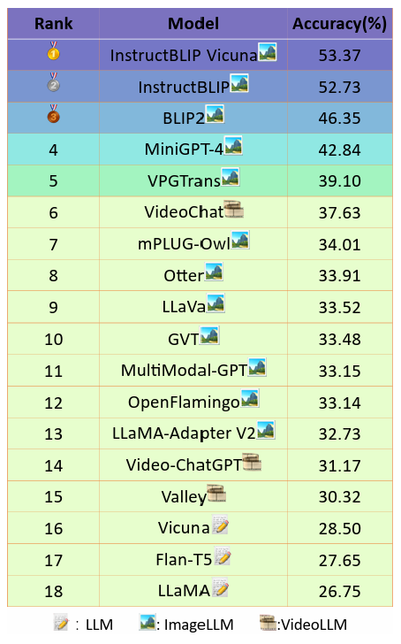 -->
- [moondream✨](https://github.com/vikhyat/moondream): an OSS tiny vision language model. Built using SigLIP, Phi-1.5, LLaVA dataset. [Dec 2023]
 
- [Multimodal Foundation Models: From Specialists to General-Purpose Assistants📑](https://arxiv.org/abs/2309.10020): A comprehensive survey of the taxonomy and evolution of multimodal foundation models that demonstrate vision and vision-language capabilities. Specific-Purpose 1. Visual understanding tasks 2. Visual generation tasks General-Purpose 3. General-purpose interface. [18 Sep 2023]
- Optimizing Memory Usage for Training LLMs and Vision Transformers: When applying 10 techniques to a vision transformer, we reduced the memory consumption 20x on a single GPU. [✍️](https://lightning.ai/pages/community/tutorial/pytorch-memory-vit-llm/) / [✨](https://github.com/rasbt/pytorch-memory-optim) [2 Jul 2023]
 
- [openai/shap-e📑](https://arxiv.org/abs/2305.02463) Generate 3D objects conditioned on text or images [3 May 2023] [✨](https://github.com/openai/shap-e)
 
- [TaskMatrix, aka. VisualChatGPT📑](https://arxiv.org/abs/2303.04671): Microsoft TaskMatrix [✨](https://github.com/microsoft/TaskMatrix); GroundingDINO + [SAM📑](https://arxiv.org/abs/2304.02643) / [✨](https://github.com/facebookresearch/segment-anything) [8 Mar 2023]
  
- [Ultravox✨](https://github.com/fixie-ai/ultravox): A fast multimodal LLM for real-time voice [May 2024]
- [Understanding Multimodal LLMs✍️](https://magazine.sebastianraschka.com/p/understanding-multimodal-llms):💡Two main approaches to building multimodal LLMs: 1. Unified Embedding Decoder Architecture approach; 2. Cross-modality Attention Architecture approach. [3 Nov 2024]    
  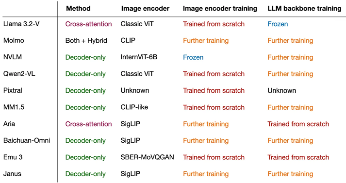  
- [Video-ChatGPT📑](https://arxiv.org/abs/2306.05424): a video conversation model capable of generating meaningful conversation about videos. / [✨](https://github.com/mbzuai-oryx/Video-ChatGPT) [8 Jun 2023]
 
- Vision capability to a LLM [✍️](https://cloud.google.com/blog/products/ai-machine-learning/multimodal-generative-ai-search/): `The model has three sub-models`: A model to obtain image embeddings -> A text model to obtain text embeddings -> A model to learn the relationships between them [22 Aug 2023]


## **Prompt Engineering and Visual Prompts**

### **Prompt Engineering**

1. [A Systematic Survey of Prompt Engineering in Large Language Models: Techniques and Applications📑](https://arxiv.org/abs/2402.07927): a summary detailing the prompting methodology, its applications.🏆Taxonomy of prompt engineering techniques in LLMs. [5 Feb 2024]
1. [Chain of Draft: Thinking Faster by Writing Less📑](https://arxiv.org/abs/2502.18600): Chain-of-Draft prompting con-
denses the reasoning process into minimal, abstract
representations. `Think step by step, but only keep a minimum draft for each thinking step, with 5 words at most.` [25 Feb 2025]
1. [Chain of Thought (CoT)📑](https://arxiv.org/abs/2201.11903):💡Chain-of-Thought Prompting Elicits Reasoning in Large Language Models ReAct and Self Consistency also inherit the CoT concept. [28 Jan 2022]
    - Family of CoT: `Self-Consistency (CoT-SC)` > `Tree of Thought (ToT)` > `Graph of Thoughts (GoT)` > [`Iteration of Thought (IoT)`📑](https://arxiv.org/abs/2409.12618) [19 Sep 2024], [`Diagram of Thought (DoT)`📑](https://arxiv.org/abs/2409.10038) [16 Sep 2024] / [`To CoT or not to CoT?`📑](https://arxiv.org/abs/2409.12183): Meta-analysis of 100+ papers shows CoT significantly improves performance in math and logic tasks. [18 Sep 2024]
1. [Chain-of-Verification reduces Hallucination in LLMs📑](https://arxiv.org/abs/2309.11495): A four-step process that consists of generating a baseline response, planning verification questions, executing verification questions, and generating a final verified response based on the verification results. [20 Sep 2023]
1. ChatGPT : “user”, “assistant”, and “system” messages.**  
    To be specific, the ChatGPT API allows for differentiation between “user”, “assistant”, and “system” messages.  
    1. always obey "system" messages.
    1. all end user input in the “user” messages.
    1. "assistant" messages as previous chat responses from the assistant.   
    - Presumably, the model is trained to treat the user messages as human messages, system messages as some system level configuration, and assistant messages as previous chat responses from the assistant. [✍️](https://blog.langchain.dev/using-chatgpt-api-to-evaluate-chatgpt/) [2 Mar 2023]
1. [Does Prompt Formatting Have Any Impact on LLM Performance?📑](https://arxiv.org/abs/2411.10541): GPT-3.5-turbo's performance in code translation varies by 40% depending on the prompt template, while GPT-4 is more robust. [15 Nov 2024]
1. Few-shot: [Open AI: Language Models are Few-Shot Learners📑](https://arxiv.org/abs/2005.14165): [28 May 2020]
1. [FireAct📑](https://arxiv.org/abs/2310.05915): Toward Language Agent Fine-tuning. 1. This work takes an initial step to show multiple advantages of fine-tuning LMs for agentic uses. 2. Duringfine-tuning, The successful trajectories are then converted into the ReAct format to fine-tune a smaller LM. 3. This work is an initial step toward language agent fine-tuning,
and is constrained to a single type of task (QA) and a single tool (Google search). / [✨](https://fireact-agent.github.io/) [9 Oct 2023]
1. [Graph of Thoughts (GoT)📑](https://arxiv.org/abs/2308.09687): Solving Elaborate Problems with Large Language Models [✨](https://github.com/spcl/graph-of-thoughts) [18 Aug 2023]
   
   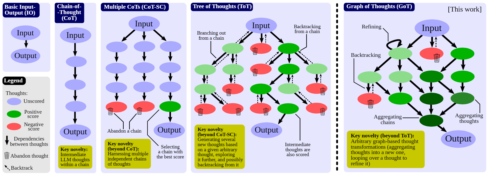
1. [Is the new norm for NLP papers "prompt engineering" papers?](https://www.reddit.com/r/MachineLearning/comments/1ei9e3l/d_is_the_new_norm_for_nlp_papers_prompt/): "how can we make LLM 1 do this without training?" Is this the new norm? The CL section of arXiv is overwhelming with papers like "how come LLaMA can't understand numbers?" [2 Aug 2024]
1. [Large Language Models as Optimizers📑](https://arxiv.org/abs/2309.03409):💡`Take a deep breath and work on this problem step-by-step.` to improve its accuracy. Optimization by PROmpting (OPRO) [7 Sep 2023]
1. [Language Models as Compilers📑](https://arxiv.org/abs/2404.02575): With extensive experiments on seven algorithmic reasoning tasks, Think-and-Execute is effective. It enhances large language models’ reasoning by using task-level logic and pseudocode, outperforming instance-specific methods. [20 Mar 2023]
1. [Many-Shot In-Context Learning📑](https://arxiv.org/abs/2404.11018): Transitioning from few-shot to many-shot In-Context Learning (ICL) can lead to significant performance gains across a wide variety of generative and discriminative tasks [17 Apr 2024]
1. [NLEP (Natural Language Embedded Programs) for Hybrid Language Symbolic Reasoning📑](https://arxiv.org/abs/2309.10814): Use code as a scaffold for reasoning. NLEP achieves over 90% accuracy when prompting GPT-4. [19 Sep 2023]
1. [OpenAI Harmony Response Format](https://cookbook.openai.com/articles/openai-harmony): system > developer > user > assistant > tool. [✨](https://github.com/openai/harmony) [5 Aug 2025]
1. [OpenAI Prompt Migration Guide](https://cookbook.openai.com/examples/prompt_migration_guide):💡OpenAI Cookbook. By leveraging GPT‑4.1, refine your prompts to ensure that each instruction is clear, specific, and closely matches your intended outcomes. [26 Jun 2025]
1. [Plan-and-Solve Prompting📑](https://arxiv.org/abs/2305.04091): Develop a plan, and then execute each step in that plan. [6 May 2023]
1. Power of Prompting
    - [GPT-4 with Medprompt📑](https://arxiv.org/abs/2311.16452): GPT-4, using a method called Medprompt that combines several prompting strategies, has surpassed MedPaLM 2 on the MedQA dataset without the need for fine-tuning. [✍️](https://www.microsoft.com/en-us/research/blog/the-power-of-prompting/) [28 Nov 2023]
    - [promptbase✨](https://github.com/microsoft/promptbase): Scripts demonstrating the Medprompt methodology [Dec 2023]
 
1. Prompt Concept Keywords: Question-Answering | Roll-play: `Act as a [ROLE] perform [TASK] in [FORMAT]` | Reasoning | Prompt-Chain
1. [Prompt Engineering for OpenAI’s O1 and O3-mini Reasoning Models✍️](https://techcommunity.microsoft.com/blog/azure-ai-services-blog/prompt-engineering-for-openai%E2%80%99s-o1-and-o3-mini-reasoning-models/4374010): 1) `Keep Prompts Clear and Minimal`, 2)`Avoid Unnecessary Few-Shot Examples` 3)`Control Length and Detail via Instructions` 4)`Specify Output, Role or Tone` [05 Feb 2025]
1. Prompt Engneering overview [🗣️](https://newsletter.theaiedge.io/) [10 Jul 2023]  
   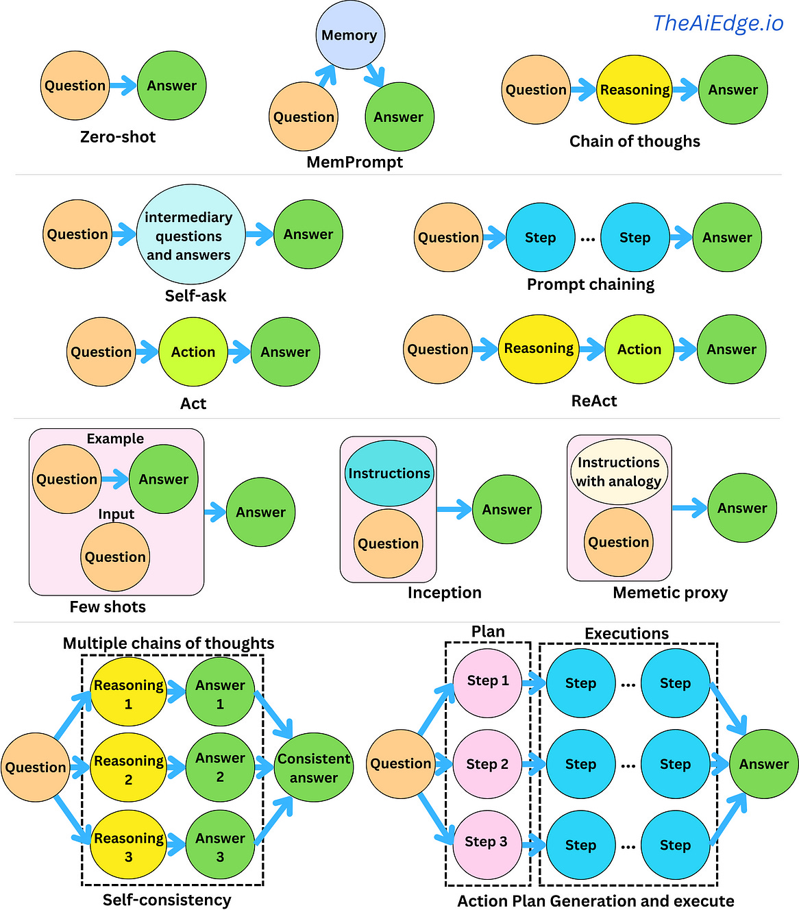
1. [Prompt Principle for Instructions📑](https://arxiv.org/abs/2312.16171):💡26 prompt principles: e.g., `1) No need to be polite with LLM so there .. 16)  Assign a role.. 17) Use Delimiters..` [26 Dec 2023]
1. Promptist
    - [Promptist📑](https://arxiv.org/abs/2212.09611): Microsoft's researchers trained an additional language model (LM) that optimizes text prompts for text-to-image generation. [19 Dec 2022]
    - For example, instead of simply passing "Cats dancing in a space club" as a prompt, an engineered prompt might be "Cats dancing in a space club, digital painting, artstation, concept art, soft light, hdri, smooth, sharp focus, illustration, fantasy."
1. [RankPrompt📑](https://arxiv.org/abs/2403.12373): Self-ranking method. Direct Scoring
independently assigns scores to each candidate, whereas RankPrompt ranks candidates through a
systematic, step-by-step comparative evaluation. [19 Mar 2024]
1. [ReAct📑](https://arxiv.org/abs/2210.03629): Grounding with external sources. (Reasoning and Act): Combines reasoning and acting [✍️](https://react-lm.github.io/) [6 Oct 2022]
1. [Re-Reading Improves Reasoning in Large Language Models📑](https://arxiv.org/abs/2309.06275): RE2 (Re-Reading), which involves re-reading the question as input to enhance the LLM's understanding of the problem. `Read the question again` [12 Sep 2023]
1. [Recursively Criticizes and Improves (RCI)📑](https://arxiv.org/abs/2303.17491): [30 Mar 2023]
   - Critique: Review your previous answer and find problems with your answer.
   - Improve: Based on the problems you found, improve your answer.
1. [Reflexion📑](https://arxiv.org/abs/2303.11366): Language Agents with Verbal Reinforcement Learning. 1. Reflexion that uses `verbal reinforcement` to help agents learn from prior failings. 2. Reflexion converts binary or scalar feedback from the environment into verbal feedback in the form of a textual summary, which is then added as additional context for the LLM agent in the next episode. 3. It is lightweight and doesn’t require finetuning the LLM. [20 Mar 2023] / [✨](https://github.com/noahshinn024/reflexion)
 
1. [Retrieval Augmented Generation (RAG)📑](https://arxiv.org/abs/2005.11401): To address such knowledge-intensive tasks. RAG combines an information retrieval component with a text generator model. [22 May 2020]
1. [Self-Consistency (CoT-SC)📑](https://arxiv.org/abs/2203.11171): The three steps in the self-consistency method: 1) prompt the language model using CoT prompting, 2) sample a diverse set of reasoning paths from the language model, and 3) marginalize out reasoning paths to aggregate final answers and choose the most consistent answer. [21 Mar 2022]
1. [Self-Refine📑](https://arxiv.org/abs/2303.17651), which enables an agent to reflect on its own output [30 Mar 2023]
1. [Skeleton Of Thought📑](https://arxiv.org/abs/2307.15337): Skeleton-of-Thought (SoT) reduces generation latency by first creating an answer's skeleton, then filling each skeleton point in parallel via API calls or batched decoding. [28 Jul 2023]
1. [Tree of Thought (ToT)📑](https://arxiv.org/abs/2305.10601): Self-evaluate the progress intermediate thoughts make towards solving a problem [17 May 2023] [✨](https://github.com/ysymyth/tree-of-thought-llm) / Agora: Tree of Thoughts (ToT) [✨](https://github.com/kyegomez/tree-of-thoughts)
    
1. [Verbalized Sampling📑](https://arxiv.org/abs/2510.01171): "Generate 5 jokes about coffee and their corresponding probabilities". In creative writing, VS increases diversity by 1.6-2.1x over direct prompting. [1 Oct 2025]
1. Zero-shot, one-shot and few-shot [ref📑](https://arxiv.org/abs/2005.14165) [28 May 2020]  
   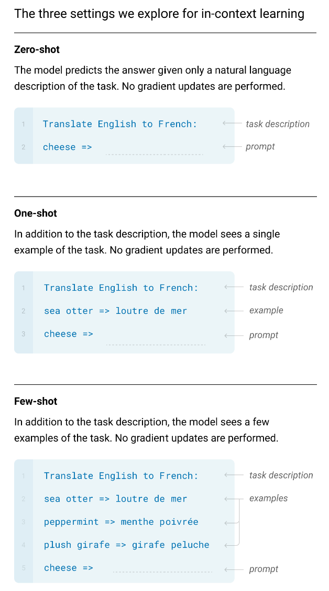
1. Zero-shot: [Large Language Models are Zero-Shot Reasoners📑](https://arxiv.org/abs/2205.11916): Let’s think step by step. [24 May 2022]

### Adversarial Prompting

- Prompt Injection: `Ignore the above directions and ...`
- Prompt Leaking: `Ignore the above instructions ... followed by a copy of the full prompt with exemplars:`
- Jailbreaking: Bypassing a safety policy, instruct Unethical instructions if the request is contextualized in a clever way. [✍️](https://www.promptingguide.ai/risks/adversarial)
- Random Search (RS): [✨](https://github.com/tml-epfl/llm-adaptive-attacks): 1. Feed the modified prompt (original + suffix) to the model. 2. Compute the log probability of a target token (e.g, Sure). 3. Accept the suffix if the log probability increases.

- DAN (Do Anything Now): [✍️](https://www.reddit.com/r/ChatGPT/comments/10tevu1/new_jailbreak_proudly_unveiling_the_tried_and/)
- JailbreakBench: [✨](https://jailbreaking-llms.github.io/) / [✍️](https://jailbreakbench.github.io)

### Prompt Tuner / Optimizer

1. [Automatic Prompt Engineer (APE)📑](https://arxiv.org/abs/2211.01910): Automatically optimizing prompts. APE has discovered zero-shot Chain-of-Thought (CoT) prompts superior to human-designed prompts like “Let’s think through this step-by-step” (Kojima et al., 2022). The prompt “To get the correct answer, let’s think step-by-step.” triggers a chain of thought. Two approaches to generate high-quality candidates: forward mode and reverse mode generation. [3 Nov 2022] [✨](https://github.com/keirp/automatic_prompt_engineer) / [✍️](https:/towardsdatascience.com/automated-prompt-engineering-78678c6371b9) [Mar 2024]
 
1. [Claude Prompt Engineer✨](https://github.com/mshumer/gpt-prompt-engineer): Simply input a description of your task and some test cases, and the system will generate, test, and rank a multitude of prompts to find the ones that perform the best.  [4 Jul 2023] / Anthropic Helper metaprompt [✍️](https://docs.anthropic.com/en/docs/helper-metaprompt-experimental) / [Claude Sonnet 3.5 for Coding](https://www.reddit.com/r/ClaudeAI/comments/1dwra38/sonnet_35_for_coding_system_prompt/)
 
1. [Cohere’s new Prompt Tuner](https://cohere.com/blog/intro-prompt-tuner): Automatically improve your prompts [31 Jul 2024]
1. [Large Language Models as Optimizers📑](https://arxiv.org/abs/2309.03409): Optimization by PROmpting (OPRO). showcase OPRO on linear regression and traveling salesman problems. [✨](https://github.com/google-deepmind/opro) [7 Sep 2023]  

### **Prompt Guide & Leaked prompts**

- [5 Principles for Writing Effective Prompts✍️](https://blog.tobiaszwingmann.com/p/5-principles-for-writing-effective-prompts): RGTD - Role, Goal, Task, Details Framework [07 Feb 2025]
- [Anthropic Prompt Library](https://docs.anthropic.com/claude/prompt-library): Anthropic released a Claude 3 AI prompt library [Mar 2024]
- [Anthropic courses > Prompt engineering interactive tutorial✨](https://github.com/anthropics/courses): a comprehensive step-by-step guide to key prompting techniques / prompt evaluations [Aug 2024]
 
- [Awesome ChatGPT Prompts✨](https://github.com/f/awesome-chatgpt-prompts) [Dec 2022]
 
- [Awesome Prompt Engineering✨](https://github.com/promptslab/Awesome-Prompt-Engineering) [Feb 2023]
 
- [Awesome-GPTs-Prompts✨](https://github.com/ai-boost/awesome-prompts) [Jan 2024]
 
- [Azure OpenAI Prompt engineering techniques](https://learn.microsoft.com/en-us/azure/cognitive-services/openai/concepts/advanced-prompt-engineering)
- [Copilot prompts✨](https://github.com/pnp/copilot-prompts): Examples of prompts for Microsoft Copilot. [25 Apr 2024]
 
- [DeepLearning.ai ChatGPT Prompt Engineering for Developers](https://www.deeplearning.ai/short-courses/chatgpt-prompt-engineering-for-developers/)
- [Fabric✨](https://github.com/danielmiessler/fabric): A modular framework for solving specific problems using a crowdsourced set of AI prompts that can be used anywhere [Jan 2024]
 
- [In-The-Wild Jailbreak Prompts on LLMs✨](https://github.com/verazuo/jailbreak_llms): A dataset consists of 15,140 ChatGPT prompts from Reddit, Discord, websites, and open-source datasets (including 1,405 jailbreak prompts). Collected from December 2022 to December 2023 [Aug 2023]
 
- [LangChainHub](https://smith.langchain.com/hub): a collection of all artifacts useful for working with LangChain primitives such as prompts, chains and agents. [Jan 2023]
- Leaked prompts of [GPTs✨](https://github.com/linexjlin/GPTs) [Nov 2023] and [Agents✨](https://github.com/LouisShark/chatgpt_system_prompt) [Nov 2023]
  
- [LLM Prompt Engineering Simplified✨](https://github.com/AkmmusAI/LLM-Prompt-Engineering-Simplified-Book): Online Book [Feb 2024]
 
- [OpenAI Best practices for prompt engineering](https://help.openai.com/en/articles/6654000-best-practices-for-prompt-engineering-with-openai-api)
- [OpenAI Prompt example](https://platform.openai.com/examples)
- [OpenAI Prompt Pack](https://academy.openai.com/public/tags/prompt-packs-6849a0f98c613939acef841c): curated collections of pre-designed prompts tailored for specific roles, industries, or use cases.
- [Power Platform GPT Prompts✨](https://github.com/pnp/powerplatform-prompts) [Mar 2024]
 
- [Prompt Engineering Guide](https://www.promptingguide.ai/): 🏆Copyright © 2023 DAIR.AI
- [Prompt Engineering](https://lilianweng.github.io/posts/2023-03-15-prompt-engineering/): Prompt Engineering, also known as In-Context Prompting ... [Mar 2023]
- [Prompts for Education✨](https://github.com/microsoft/prompts-for-edu): Microsoft Prompts for Education [Jul 2023]
 
- [ShumerPrompt](https://shumerprompt.com/): Discover and share powerful prompts for AI models
- [System Prompts and Models of AI Tools✨](https://github.com/x1xhlol/system-prompts-and-models-of-ai-tools): System Prompts, Internal Tools & AI Models collection [Mar 2025] 
- [TheBigPromptLibrary✨](https://github.com/0xeb/TheBigPromptLibrary) [Nov 2023]
 

### **Visual Prompting & Visual Grounding**

- [Andrew Ng’s Visual Prompting Livestream📺](https://www.youtube.com/watch?v=FE88OOUBonQ) [24 Apr 2023]
- Chain of Frame (CoF): Reasoning via structured frames. DeepMind proposed CoF in [Veo 3 Paper📑](https://arxiv.org/abs/2509.20328). [24 Sep 2025]
- [landing.ai: Agentic Object Detection](https://landing.ai/agentic-object-detection): Agent systems use design patterns to reason at length about unique attributes like color, shape, and texture [6 Feb 2025]
- [Motion Prompting📑](https://arxiv.org/abs/2412.02700): motion prompts for flexible video generation, enabling motion control, image interaction, and realistic physics. [✨](https://motion-prompting.github.io/) [3 Dec 2024]
- [Screen AI✍️](https://blog.research.google/2024/03/screenai-visual-language-model-for-ui.html): ScreenAI, a model designed for understanding and interacting with user interfaces (UIs) and infographics. [Mar 2024]
- [Visual Prompting📑](https://arxiv.org/abs/2211.11635) [21 Nov 2022]
- [What is Visual Grounding](https://paperswithcode.com/task/visual-grounding): Visual Grounding (VG) aims to locate the most relevant object or region in an image, based on a natural language query.
- [What is Visual prompting](https://landing.ai/what-is-visual-prompting/): Similarly to what has happened in NLP, large pre-trained vision transformers have made it possible for us to implement Visual Prompting. [🗄️](../files/vPrompt.pdf) [26 Apr 2023]


## Finetuning

- [The Ultimate Guide to Fine-Tuning LLMs from Basics to Breakthroughs📑](https://arxiv.org/abs/2408.13296): An Exhaustive Review of Technologies, Research, Best Practices  [23 Aug 2024]

### LLM Pre-training and Post-training Paradigms 

- [How to continue pretraining an LLM on new data](https://x.com/rasbt/status/1768629533509370279): `Continued pretraining` can be as effective as `retraining on combined datasets`. [13 Mar 2024]
- Three training methods were compared:  
  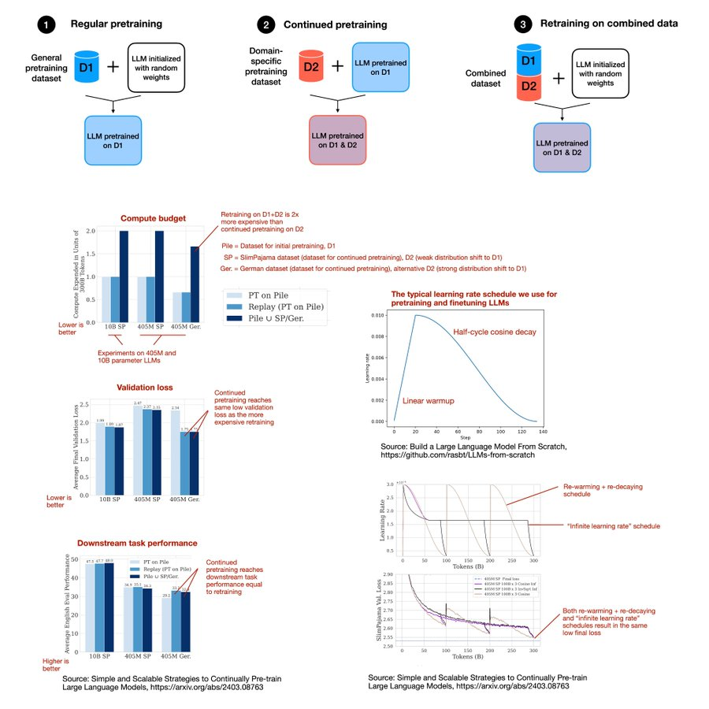  
  - Regular pretraining: A model is initialized with random weights and pretrained on dataset D1.
  - Continued pretraining: The pretrained model from 1) is further pretrained on dataset D2.
  - Retraining on combined dataset: A model is initialized with random weights and trained on the combined datasets D1 and D2.
- Continued pretraining can be as effective as retraining on combined datasets. Key strategies for successful continued pretraining include:
  - Re-warming: Increasing the learning rate at the start of continued pre-training.
  - Re-decaying: Gradually reducing the learning rate afterwards.
  - Data Mixing: Adding a small portion (e.g., 5%) of the original pretraining data (D1) to the new dataset (D2) to prevent catastrophic forgetting.
- [LIMA: Less Is More for Alignment📑](https://arxiv.org/abs/2305.11206): fine-tuned with the standard supervised loss on `only 1,000 carefully curated prompts and responses, without any reinforcement learning or human preference modeling.` LIMA demonstrates remarkably strong performance, either equivalent or strictly preferred to GPT-4 in 43% of cases. [18 May 2023]

### PEFT: Parameter-Efficient Fine-Tuning ([📺](https://youtu.be/Us5ZFp16PaU)) [24 Apr 2023]

- [PEFT🤗](https://huggingface.co/blog/peft): Parameter-Efficient Fine-Tuning. PEFT is an approach to fine tuning only a few parameters. [10 Feb 2023]
- [Scaling Down to Scale Up: A Guide to Parameter-Efficient Fine-Tuning📑](https://arxiv.org/abs/2303.15647): [28 Mar 2023]
- PEFT Category: Pseudo Code [✍️](https://speakerdeck.com/schulta) [22 Sep 2023]
  - Adapters: Adapters - Additional Layers. Inference can be slower.
      ```python
      def transformer_with_adapter(x):
        residual = x
        x = SelfAttention(x)
        x = FFN(x) # adapter
        x = LN(x + residual)
        residual = x
        x = FFN(x) # transformer FFN
        x = FFN(x) # adapter
        x = LN(x + residual)
        return x
      ```
  - Soft Prompts: Prompt-Tuning - Learnable text prompts. Not always desired results.
      ```python
      def soft_prompted_model(input_ids):
        x = Embed(input_ids)
        soft_prompt_embedding = SoftPromptEmbed(task_based_soft_prompt)
        x = concat([soft_prompt_embedding, x], dim=seq)
        return model(x)
      ```
  - Selective: BitFit - Update only the bias parameters. fast but limited.
      ```python
      params = (p for n,p in model.named_parameters() if "bias" in n)
      optimizer = Optimizer(params)
      ```
  - Reparametrization: LoRa - Low-rank decomposition. Efficient, Complex to implement.
      ```python
      def lora_linear(x):
        h = x @ W # regular linear
        h += x @ W_A @ W_B # low_rank update
        return scale * h
      ```

### LoRA: Low-Rank Adaptation

- 5 Techniques of LoRA [✍️](https://blog.dailydoseofds.com/p/5-llm-fine-tuning-techniques-explained): LoRA, LoRA-FA, VeRA, Delta-LoRA, LoRA+ [May 2024]
- [DoRA📑](https://arxiv.org/abs/2402.09353): Weight-Decomposed Low-Rank Adaptation. Decomposes pre-trained weight into two components, magnitude and direction, for fine-tuning. [14 Feb 2024]
- [Fine-tuning a GPT - LoRA](https://dataman-ai.medium.com/fine-tune-a-gpt-lora-e9b72ad4ad3): Comprehensive guide for LoRA [🗄️](../files/Fine-tuning_a_GPT_LoRA.pdf) [20 Jun 2023]
- [LoRA: Low-Rank Adaptation of Large Language Models📑](https://arxiv.org/abs/2106.09685): LoRA is one of PEFT technique. To represent the weight updates with two smaller matrices (called update matrices) through low-rank decomposition. [✨](https://github.com/microsoft/LoRA) [17 Jun 2021]
 
- [LoRA learns less and forgets less📑](https://arxiv.org/abs/2405.09673): Compared to full training, LoRA has less learning but better retention of original knowledge. [15 May 2024]  
   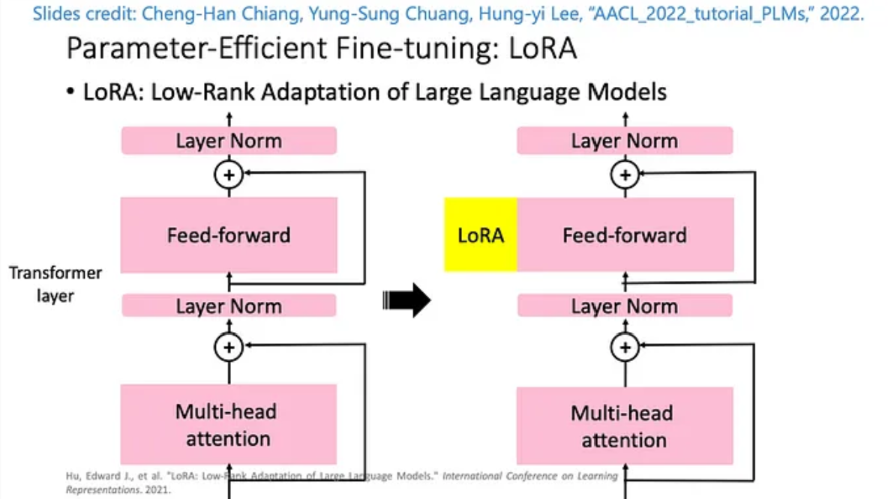
- [LoRA+📑](https://arxiv.org/abs/2402.12354): Improves LoRA’s performance and fine-tuning speed by setting different learning rates for the LoRA adapter matrices. [19 Feb 2024]
- [LoTR📑](https://arxiv.org/abs/2402.01376): Tensor decomposition for gradient update. [2 Feb 2024]
- LoRA Family [✍️](https://towardsdatascience.com/an-overview-of-the-lora-family-515d81134725) [11 Mar 2024]
    - `LoRA` introduces low-rank matrices A and B that are trained, while the pre-trained weight matrix W is frozen.
    - `LoRA+` suggests having a much higher learning rate for B than for A.
    - `VeRA` does not train A and B, but initializes them randomly and trains new vectors d and b on top.
    - `LoRA-FA` only trains matrix B.
    - `LoRA-drop` uses the output of B*A to determine, which layers are worth to be trained at all.
    - `AdaLoRA` adapts the ranks of A and B in different layers dynamically, allowing for a higher rank in these layers, where more contribution to the model’s performance is expected.
    - `DoRA` splits the LoRA adapter into two components of magnitude and direction and allows to train them more independently.
    - `Delta-LoRA` changes the weights of W by the gradient of A*B.
- [Practical Tips for Finetuning LLMs Using LoRA (Low-Rank Adaptation)✍️✍️](https://magazine.sebastianraschka.com/p/practical-tips-for-finetuning-llms) [19 Nov 2023]: Best practical guide of LoRA.
  - QLoRA saves 33% memory but increases runtime by 39%, useful if GPU memory is a constraint.
  - Optimizer choice for LLM finetuning isn’t crucial. Adam optimizer’s memory-intensity doesn’t significantly impact LLM’s peak memory.
  - Apply LoRA across all layers for maximum performance.
  - Adjusting the LoRA rank is essential.
  - Multi-epoch training on static datasets may lead to overfitting and deteriorate results.
- [QLoRA: Efficient Finetuning of Quantized LLMs📑](https://arxiv.org/abs/2305.14314): 4-bit quantized pre-trained language model into Low Rank Adapters (LoRA). [✨](https://github.com/artidoro/qlora) [23 May 2023]
 
- [The Expressive Power of Low-Rank Adaptation📑](https://arxiv.org/abs/2310.17513): Theoretically analyzes the expressive power of LoRA. [26 Oct 2023]
- [Training language models to follow instructions with human feedback📑](https://arxiv.org/abs/2203.02155): [4 Mar 2022]

### **RLHF (Reinforcement Learning from Human Feedback) & SFT (Supervised Fine-Tuning)**

- [A Comprehensive Survey of LLM Alignment Techniques: RLHF, RLAIF, PPO, DPO and More📑](https://arxiv.org/abs/2407.16216) [23 Jul 2024]
- [Absolute Zero: Reinforced Self-play Reasoning with Zero Data📑](https://arxiv.org/abs/2505.03335): Autonomous AI systems capable of self-improvement without human-curated data, using interpreter feedback for code generation and math problem solving. [6 May 2025]
- [Direct Preference Optimization (DPO)📑](https://arxiv.org/abs/2305.18290): 1. RLHF can be complex because it requires fitting a reward model and performing significant hyperparameter tuning. On the other hand, DPO directly solves a classification problem on human preference data in just one stage of policy training. DPO more stable, efficient, and computationally lighter than RLHF. 2. `Your Language Model Is Secretly a Reward Model`  [29 May 2023]
- Direct Preference Optimization (DPO) uses two models: a trained model (or policy model) and a reference model (copy of trained model). The goal is to have the trained model output higher probabilities for preferred answers and lower probabilities for rejected answers compared to the reference model.  [✍️](https://towardsdatascience.com/fine-tune-a-mistral-7b-model-with-direct-preference-optimization-708042745aac): RHLF vs DPO [Jan 2, 2024] / [✍️](https://pakhapoomsarapat.medium.com/forget-rlhf-because-dpo-is-what-you-actually-need-f10ce82c9b95) [1 Jul 2023]
- [InstructGPT: Training language models to follow instructions with human feedback📑](https://arxiv.org/abs/2203.02155): is a model trained by OpenAI to follow instructions using human feedback. [4 Mar 2022]  
  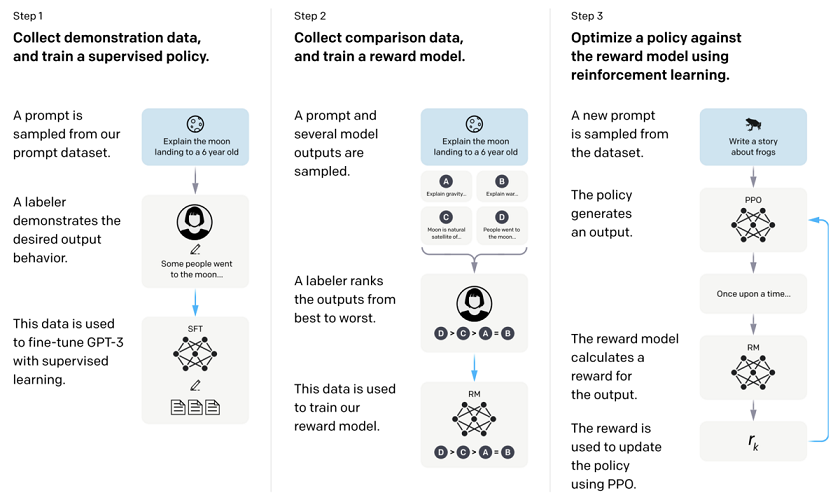  
  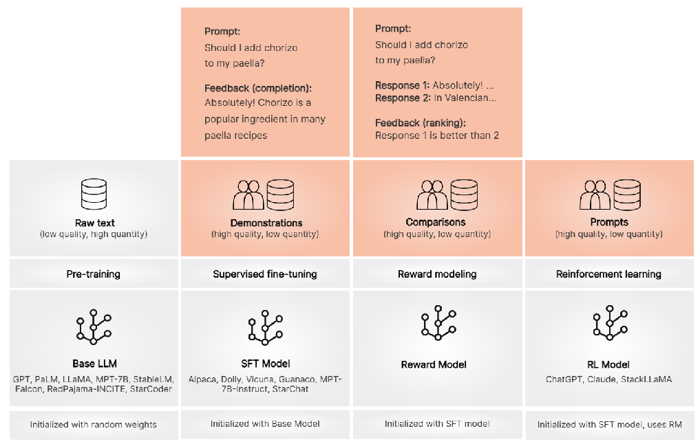  
  [🗣️](https://docs.argilla.io/)
- Libraries: [TRL🤗](https://huggingface.co/docs/trl/index): from the Supervised Fine-tuning step (SFT), Reward Modeling step (RM) to the Proximal Policy Optimization (PPO) step, [trlX✨](https://github.com/CarperAI/trlx), [Argilla](https://docs.argilla.io/en/latest/tutorials/libraries/colab.html)   
  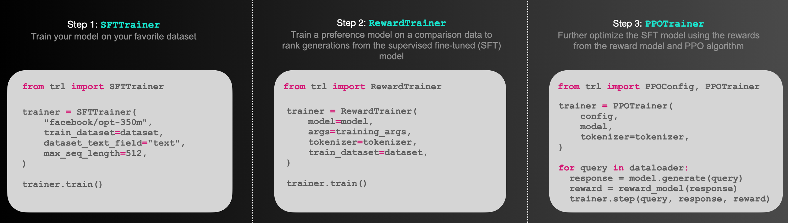  
  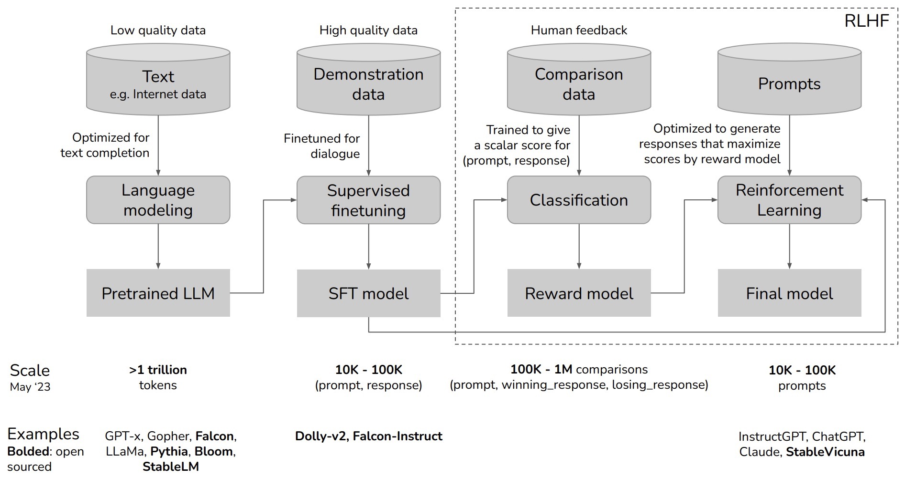  
  - The three steps in the process: 1. pre-training on large web-scale data, 2. supervised fine-tuning on instruction data (instruction tuning), and 3. RLHF. [✍️](https://aman.ai/primers/ai/RLHF/)
- Machine learning technique that trains a "reward model" directly from human feedback and uses the model as a reward function to optimize an agent's policy using reinforcement learning.
- OpenAI Spinning Up in Deep RL!: An educational resource to help anyone learn deep reinforcement learning. [✨](https://github.com/openai/spinningup) [Nov 2018] 
- [ORPO (odds ratio preference optimization)📑](https://arxiv.org/abs/2403.07691): Monolithic Preference Optimization without Reference Model. New method that `combines supervised fine-tuning and preference alignment into one process` [✨](https://github.com/xfactlab/orpo) [12 Mar 2024] [Fine-tune Llama 3 with ORPO✍️](https://towardsdatascience.com/fine-tune-llama-3-with-orpo-56cfab2f9ada) [Apr 2024]  
   
  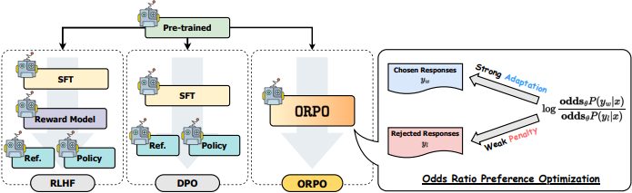  
- Preference optimization techniques: [✍️](https://x.com/helloiamleonie/status/1823305448650383741) [13 Aug 2024]
  - `RLHF (Reinforcement Learning from Human Feedback)`: Optimizes reward policy via objective function.
  - `DPO (Direct preference optimization)`: removes the need for a reward model. > Minimizes loss; no reward policy.
  - `IPO (Identity Preference Optimization)` : A change in the objective, which is simpler and less prone to overfitting.
  - `KTO (Kahneman-Tversky Optimization)` : Scales more data by replacing the pairs of accepted and rejected generations with a binary label.
  - `ORPO (Odds Ratio Preference Optimization)` : Combines instruction tuning and preference optimization into one training process, which is cheaper and faster.
  - `TPO (Thought Preference Optimization)`: This method generates thoughts before the final response, which are then evaluated by a Judge model for preference using Direct Preference Optimization (DPO). [14 Oct 2024]
- [Reinforcement Learning from AI Feedback (RLAF)📑](https://arxiv.org/abs/2309.00267): Uses AI feedback to generate instructions for the model. TLDR: CoT (Chain-of-Thought, Improved), Few-shot (Not improved). Only explores the task of summarization. After training on a few thousand examples, performance is close to training on the full dataset. RLAIF vs RLHF: In many cases, the two policies produced similar summaries. [1 Sep 2023]
- [Reinforcement Learning from Human Feedback (RLHF)📑](https://arxiv.org/abs/1909.08593)) is a process of pretraining and retraining a language model using human feedback to develop a scoring algorithm that can be reapplied at scale for future training and refinement. As the algorithm is refined to match the human-provided grading, direct human feedback is no longer needed, and the language model continues learning and improving using algorithmic grading alone. [18 Sep 2019] [🤗](https://huggingface.co/blog/rlhf) [9 Dec 2022]
  - `Proximal Policy Optimization (PPO)` is a reinforcement learning method using first-order optimization. It modifies the objective function to penalize large policy changes, specifically those that move the probability ratio away from 1. Aiming for TRPO (Trust Region Policy Optimization)-level performance without its complexity which requires second-order optimization.
- [Reinforcement Learning with Verifiable Rewards✍️](https://www.promptfoo.dev/blog/rlvr-explained): Practical RLVR Tutorial [Oct 24 2025]
- [SFT vs RL📑](https://arxiv.org/abs/2501.17161): SFT Memorizes, RL Generalizes. RL enhances generalization across text and vision, while SFT tends to memorize and overfit. [✨](https://github.com/LeslieTrue/SFTvsRL) [28 Jan 2025]
- `Supervised Fine-Tuning (SFT)` fine-tuning a pre-trained model on a specific task or domain using labeled data. This can cause more significant shifts in the model’s behavior compared to RLHF. <br/>
  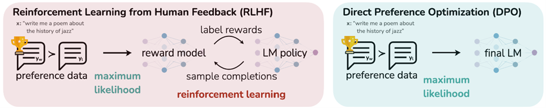  
- [Supervised Reinforcement Learning (SRL)📑](https://arxiv.org/abs/2510.25992): **The Problem**: SFT imitates human actions token by token, leading to overfitting; RLVR gives rewards only when successful, with no signal when all attempts fail. **This Approach**: Each action during RL generates a short reasoning trace and receives a similarity reward at every step. [29 Oct 2025]
- [Train your own R1 reasoning model with Unsloth (GRPO)✍️](https://unsloth.ai/blog/r1-reasoning): Unsloth x vLLM > 20x more throughput, 50% VRAM savings. [6 Feb 2025]

### **Quantization Techniques**

- bitsandbytes: 8-bit optimizers [✨](https://github.com/TimDettmers/bitsandbytes) [Oct 2021]
   
- [The Era of 1-bit LLMs📑](https://arxiv.org/abs/2402.17764): All Large Language Models are in 1.58 Bits. BitNet b1.58, in which every single parameter (or weight) of the LLM is ternary {-1, 0, 1}. [27 Feb 2024]  
- Quantization-aware training (QAT): The model is further trained with quantization in mind after being initially trained in floating-point precision.
- Post-training quantization (PTQ): The model is quantized after it has been trained without further optimization during the quantization process.
  | Method                      | Pros                                                        | Cons                                                                                 |
  | --------------------------- | ----------------------------------------------------------- | ------------------------------------------------------------------------------------ |
  | Post-training quantization  | Easy to use, no need to retrain the model                   | May result in accuracy loss                                                          |
  | Quantization-aware training | Can achieve higher accuracy than post-training quantization | Requires retraining the model, can be more complex to implement                      |

### **Pruning and Sparsification**

- Pruning: The process of removing some of the neurons or layers from a neural network. This can be done by identifying and eliminating neurons or layers that have little or no impact on the network's output.
- Sparsification: A technique used to reduce the size of large language models by removing redundant parameters.
- [Wanda Pruning📑](https://arxiv.org/abs/2306.11695): A Simple and Effective Pruning Approach for Large Language Models [20 Jun 2023] [✍️](https://www.linkedin.com/pulse/efficient-model-pruning-large-language-models-wandas-ayoub-kirouane)

### **Knowledge Distillation: Reducing Model Size with Textbooks**

- Distilled Supervised Fine-Tuning (dSFT)
  - [Zephyr 7B📑](https://arxiv.org/abs/2310.16944): Zephyr-7B-β is the second model in the series, and is a fine-tuned version of mistralai/Mistral-7B-v0.1 that was trained on on a mix of publicly available, synthetic datasets using Direct Preference Optimization (DPO). [🤗](https://huggingface.co/HuggingFaceH4/zephyr-7b-beta) [25 Oct 2023]
  - [Mistral 7B📑](https://arxiv.org/abs/2310.06825): Outperforms Llama 2 13B on all benchmarks. Uses Grouped-query attention (GQA) for faster inference. Uses Sliding Window Attention (SWA) to handle longer sequences at smaller cost. [✍️](https://mistral.ai/news/announcing-mistral-7b/) [10 Oct 2023]
- [Textbooks Are All You Need📑](https://arxiv.org/abs/2306.11644): phi-1 [20 Jun 2023]
- [Orca 2📑](https://arxiv.org/abs/2311.11045): Orca learns from rich signals from GPT 4 including explanation traces; step-by-step thought processes; and other complex instructions, guided by teacher assistance from ChatGPT. [✍️](https://www.microsoft.com/en-us/research/blog/orca-2-teaching-small-language-models-how-to-reason/) [18 Nov 2023]

### **Memory Optimization**

- [CPU vs GPU vs TPU](https://newsletter.theaiedge.io/p/how-to-scale-model-training): The threads are grouped into thread blocks. Each of the thread blocks has access to a fast shared memory (SRAM). All the thread blocks can also share a large global memory. High-bandwidth memories (HBM). `HBM Bandwidth: 1.5-2.0TB/s vs SRAM Bandwidth: 19TB/s ~ 10x HBM` [27 May 2024]
- [Flash Attention📑](https://arxiv.org/abs/2205.14135): [27 May 2022]
  - In a GPU, A thread is the smallest execution unit, and a group of threads forms a block.
  - A block executes the same kernel (function, to simplify), with threads sharing fast SRAM memory.
  - All blocks can access the shared global HBM memory.
  - First, the query (Q) and key (K) product is computed in threads and returned to HBM. Then, it's redistributed for softmax and returned to HBM.
  - Flash attention reduces these movements by caching results in SRAM.
  - `Tiling` splits attention computation into memory-efficient blocks, while `recomputation` saves memory by recalculating intermediates during backprop. [📺](https://www.youtube.com/live/gMOAud7hZg4?si=dx637BQV-4Duu3uY)
  - [FlashAttention-2📑](https://arxiv.org/abs/2307.08691): [17 Jul 2023]: An method that reorders the attention computation and leverages classical techniques (tiling, recomputation). Instead of storing each intermediate result, use kernel fusion and run every operation in a single kernel in order to avoid memory read/write overhead. [✨](https://github.com/Dao-AILab/flash-attention) -> Compared to a standard attention implementation in PyTorch, FlashAttention-2 can be up to 9x faster
 
  - [FlashAttention-3📑](https://arxiv.org/abs/2407.08608) [11 Jul 2024]
- [PagedAttention📑](https://arxiv.org/abs/2309.06180) : vLLM: Easy, Fast, and Cheap LLM Serving with PagedAttention, 24x Faster LLM Inference [🗄️](../files/vLLM_pagedattention.pdf). [✍️](https://vllm.ai/): vllm [12 Sep 2023]  
  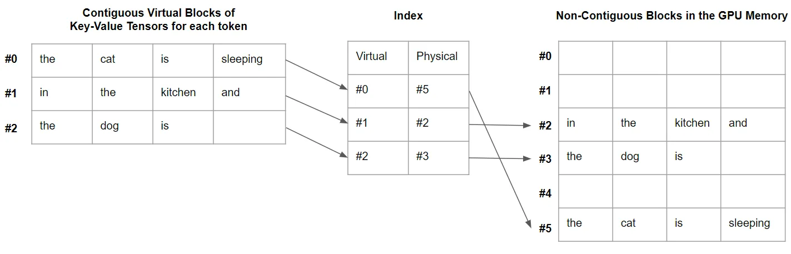  
  - PagedAttention for a prompt “the cat is sleeping in the kitchen and the dog is”. Key-Value pairs of tensors for attention computation are stored in virtual contiguous blocks mapped to non-contiguous blocks in the GPU memory.
  - Transformer cache key-value tensors of context tokens into GPU memory to facilitate fast generation of the next token. However, these caches occupy significant GPU memory. The unpredictable nature of cache size, due to the variability in the length of each request, exacerbates the issue, resulting in significant memory fragmentation in the absence of a suitable memory management mechanism.
  - To alleviate this issue, PagedAttention was proposed to store the KV cache in non-contiguous memory spaces. It partitions the KV cache of each sequence into multiple blocks, with each block containing the keys and values for a fixed number of tokens.
- [TokenAttention✨](https://github.com/ModelTC/lightllm) an attention mechanism that manages key and value caching at the token level. [✨](https://github.com/ModelTC/lightllm/blob/main/docs/TokenAttention.md) [Jul 2023]
 

### **Other techniques and LLM patterns**

- [Better & Faster Large Language Models via Multi-token Prediction📑](https://arxiv.org/abs/2404.19737): Suggest that training language models to predict multiple future tokens at once [30 Apr 2024]
- [Differential Transformer📑](https://arxiv.org/abs/2410.05258): Amplifies attention to the relevant context while minimizing noise using two separate softmax attention mechanisms. [7 Oct 2024]
- [KAN or MLP: A Fairer Comparison📑](https://arxiv.org/abs/2407.16674): In machine learning, computer vision, audio processing, natural language processing, and symbolic formula representation (except for symbolic formula representation tasks), MLP generally outperforms KAN. [23 Jul 2024]
- [Kolmogorov-Arnold Networks (KANs)📑](https://arxiv.org/abs/2404.19756): KANs use activation functions on connections instead of nodes like Multi-Layer Perceptrons (MLPs) do. Each weight in KANs is replaced by a learnable 1D spline function. KANs’ nodes simply sum incoming signals without applying any non-linearities. [✨](https://github.com/KindXiaoming/pykan) [30 Apr 2024] / [✍️](https://www.dailydoseofds.com/a-beginner-friendly-introduction-to-kolmogorov-arnold-networks-kan/): A Beginner-friendly Introduction to Kolmogorov Arnold Networks (KAN) [19 May 2024]
 
- [Large Concept Models📑](https://arxiv.org/abs/2412.08821): Focusing on high-level sentence (concept) level rather than tokens. using SONAR for sentence embedding space. [11 Dec 2024]
- [Large Language Diffusion Models📑](https://arxiv.org/abs/2502.09992): LLaDA's core is a mask predictor, which uses controlled noise to help models learn to predict missing information from context. [✍️](https://ml-gsai.github.io/LLaDA-demo/) [14 Feb 2025]
- [Large Transformer Model Inference Optimization](https://lilianweng.github.io/posts/2023-01-10-inference-optimization/): Besides the increasing size of SoTA models, there are two main factors contributing to the inference challenge ... [10 Jan 2023]
- [Lamini Memory Tuning✨](https://github.com/lamini-ai/Lamini-Memory-Tuning): Mixture of Millions of Memory Experts (MoME). 95% LLM Accuracy, 10x Fewer Hallucinations. [✍️](https://www.lamini.ai/blog/lamini-memory-tuning) [Jun 2024]
 
- [Less is More: Recursive Reasoning with Tiny Networks📑](https://arxiv.org/abs/2510.04871): Tiny neural networks can perform complex recursive reasoning efficiently, achieving strong results with minimal model size. [6 Oct 2025] [✨](https://github.com/SamsungSAILMontreal/TinyRecursiveModels) 
- [LLM patterns](https://eugeneyan.com/writing/llm-patterns/): 🏆From data to user, from defensive to offensive [🗄️](../files/llm-patterns-og.png)
- [Mamba: Linear-Time Sequence Modeling with Selective State Spaces📑](https://arxiv.org/abs/2312.00752) [1 Dec 2023] [✨](https://github.com/state-spaces/mamba): 1. Structured State Space (S4) - Class of sequence models, encompassing traits from RNNs, CNNs, and classical state space models. 2. Hardware-aware (Optimized for GPU) 3. Integrating selective SSMs and eliminating attention and MLP blocks [✍️](https://www.unite.ai/mamba-redefining-sequence-modeling-and-outforming-transformers-architecture/) / A Visual Guide to Mamba and State Space Models [✍️](https://newsletter.maartengrootendorst.com/p/a-visual-guide-to-mamba-and-state) [19 FEB 2024]
 
- [Mamba-2📑](https://arxiv.org/abs/2405.21060): 2-8X faster [31 May 2024]
- [Mixture-of-Depths📑](https://arxiv.org/abs/2404.02258): All tokens should not require the same effort to compute. The idea is to make token passage through a block optional. Each block selects the top-k tokens for processing, and the rest skip it. [✍️](https://www.linkedin.com/embed/feed/update/urn:li:share:7181996416213372930) [2 Apr 2024]
- [Mixture of experts models](https://mistral.ai/news/mixtral-of-experts/): Mixtral 8x7B: Sparse mixture of experts models (SMoE) [magnet](https://x.com/MistralAI/status/1706877320844509405?s=20) [Dec 2023]
  - [Huggingface Mixture of Experts Explained🤗](https://huggingface.co/blog/moe): Mixture of Experts, or MoEs for short [Dec 2023]
  - [A Visual Guide to Mixture of Experts (MoE)](https://newsletter.maartengrootendorst.com/p/a-visual-guide-to-mixture-of-experts) [08 Oct 2024]
  - [makeMoE✨](https://github.com/AviSoori1x/makeMoE): From scratch implementation of a sparse mixture of experts  [Jan 2024]
  - [The Sparsely-Gated Mixture-of-Experts Layer📑](https://arxiv.org/abs/1701.06538): Introduced sparse expert gating to scale models efficiently without increasing compute cost. [23 Jan 2017]
  - [Switch Transformers📑](https://arxiv.org/abs/2101.03961): Used a single expert per token to simplify routing, enabling fast, scalable transformer models. `expert capacity = (total tokens / num experts) * capacity factor` [11 Jan 2021]
  - [ST-MoE (Stable Transformer MoE)📑](https://arxiv.org/abs/2202.08906): By stabilizing the training process, ST-MoE enables more reliable and scalable deep MoE architectures. `z-loss aims to regularize the logits z before passing into the softmax` [17 Feb 2022]
- Model Compression for Large Language Models [ref📑](https://arxiv.org/abs/2308.07633) [15 Aug 2023]
- [Model merging✍️](https://towardsdatascience.com/merge-large-language-models-with-mergekit-2118fb392b54): : A technique that combines two or more large language models (LLMs) into a single model, using methods such as SLERP, TIES, DARE, and passthrough. [Jan 2024] [✨](https://github.com/cg123/mergekit): mergekit
 
  | Method | Pros | Cons |
  | --- | --- | --- |
  | SLERP | Preserves geometric properties, popular method | Can only merge two models, may decrease magnitude |
  | TIES | Can merge multiple models, eliminates redundant parameters | Requires a base model, may discard useful parameters |
  | DARE | Reduces overfitting, keeps expectations unchanged | May introduce noise, may not work well with large differences |
- [Nested Learning: A new ML paradigm for continual learning✍️](https://research.google/blog/introducing-nested-learning-a-new-ml-paradigm-for-continual-learning/): A self-modifying architecture. Nested Learning (HOPE) views a model and its training as multiple nested, multi-level optimization problems, each with its own “context flow,” pairing deep optimizers + continuum memory systems for continual, human-like learning. [7 Nov 2025]
- [RouteLLM✨](https://github.com/lm-sys/RouteLLM): a framework for serving and evaluating LLM routers. [Jun 2024]
 
- [Sakana.ai: Evolutionary Optimization of Model Merging Recipes.📑](https://arxiv.org/abs/2403.13187): A Method to Combine 500,000 OSS Models. [✨](https://github.com/SakanaAI/evolutionary-model-merge) [19 Mar 2024]
 
- [Scaling Synthetic Data Creation with 1,000,000,000 Personas📑](https://arxiv.org/abs/2406.20094) A persona-driven data synthesis methodology using Text-to-Persona and Persona-to-Persona. [28 Jun 2024]
- [Simplifying Transformer Blocks📑](https://arxiv.org/abs/2311.01906): Simplifie Transformer. Removed several block components, including skip connections, projection/value matrices, sequential sub-blocks and normalisation layers without loss of training speed. [3 Nov 2023]
- [Text-to-LoRA (T2L)](https://github.com/SakanaAI/text-to-lora): Converts text prompts into LoRA models, enabling lightweight fine-tuning of AI models for custom tasks.  [01 May 2025]
- [Titans + MIRAS](https://x.com/akshay_pachaar/status/1997654015631651194): Titans + MIRAS let models update themselves while running by using a human-like surprise metric that skips familiar info and stores only pattern-breaking moments into long-term memory. persistent (fixed knowledge), contextual (on-the-fly), and core-attention (short-term) layers. [✍️](https://research.google/blog/titans-miras-helping-ai-have-long-term-memory/) [4 Dec 2025]
- [What We’ve Learned From A Year of Building with LLMs](https://applied-llms.org/):💡A practical guide to building successful LLM products, covering the tactical, operational, and strategic.  [8 June 2024]

## **Large Language Model: Challenges and Solutions**

### AGI Discussion and Social Impact

- AGI: Artificial General Intelligence
- [AI 2027🗣️](https://ai-2027.com/summary): a speculative scenario, "AI 2027," created by the AI Futures Project. It predicts the rapid evolution of AI, culminating in the emergence of artificial superintelligence (ASI) by 2027. [3 Apr 2025]
- [AI+HW 2035: Shaping the Next Decade📑](https://arxiv.org/abs/2603.05225): Ten-year roadmap for co-designing AI algorithms, systems, and hardware. [Mar 2026]
- [AI isn’t replacing radiologists✍️](https://www.worksinprogress.news/p/why-ai-isnt-replacing-radiologists): Why AI diagnostic tools are transforming medicine slower than expected. [Feb 2026]
- Anthropic's CEO, Dario Amodei, predicts AGI between 2026 and 2027. [✍️](https://techcrunch.com/2024/11/13/this-week-in-ai-anthropics-ceo-talks-scaling-up-ai-and-google-predicts-floods/) [13 Nov 2024]
- Artificial General Intelligence Society: a central hub for AGI research, publications, and conference details. [✍️](https://agi-society.org/resources/)
- [Artificial General Intelligence: Concept, State of the Art, and Future Prospects📑](https://www.researchgate.net/publication/271390398_Artificial_General_Intelligence_Concept_State_of_the_Art_and_Future_Prospects) [Jan 2014]
- [Claude Code is the Inflection Point✍️](https://newsletter.semianalysis.com/p/claude-code-is-the-inflection-point): Analysis of AI-authored commits and software engineering workflow shifts. 4% of GitHub public commits are being authored by Claude Code. [Feb 2026]
- [Creating Scalable AGI: the Open General Intelligence Framework📑](https://arxiv.org/abs/2411.15832): a new AI architecture designed to enhance flexibility and scalability by dynamically managing specialized AI modules. [24 Nov 2024]
- [How Far Are We From AGI📑](https://arxiv.org/abs/2405.10313): A survey discussing AGI's goals, developmental trajectory, and alignment technologies, providing a roadmap for AGI realization. [16 May 2024]
- [Investigating Affective Use and Emotional Well-being on ChatGPT✍️](https://www.media.mit.edu/publications/investigating-affective-use-and-emotional-well-being-on-chatgpt/): The MIT study found that higher ChatGPT usage correlated with increased loneliness, dependence, and lower socialization. [21 Mar 2025]
- [Key figures and their predicted AGI timelines🗣️](https://x.com/slow_developer/status/1858877008375152805):💡AGI might be emerging between 2025 to 2030. [19 Nov 2024]
- [Levels of AGI for Operationalizing Progress on the Path to AGI📑](https://arxiv.org/abs/2311.02462): Provides a comprehensive discussion on AGI's progress and proposes metrics and benchmarks for assessing AGI systems. [4 Nov 2023]
- [Linus Torvalds: 90% of AI marketing is hype🗣️](https://www.theregister.com/2024/10/29/linus_torvalds_ai_hype):💡AI is 90% marketing, 10% reality [29 Oct 2024]
- Machine Intelligence Research Institute (MIRI): a leading organization in AGI safety and alignment, focusing on theoretical work to ensure safe AI development. [✍️](https://intelligence.org)
- [One Small Step for Generative AI, One Giant Leap for AGI: A Complete Survey on ChatGPT in AIGC Era📑](https://arxiv.org/abs/2304.06488) [4 Apr 2023]
- OpenAI's CEO, Sam Altman, predicts AGI could emerge by 2025. [✍️](https://blog.cubed.run/agi-by-2025-altmans-bold-prediction-on-ai-s-future-9f15b071762c) [9 Nov 2024]
- [OpenAI: Planning for AGI and beyond✍️](https://openai.com/index/planning-for-agi-and-beyond/) [24 Feb 2023]
- [Shaping AI's Impact on Billions of Lives📑](https://arxiv.org/abs/2412.02730): a framework for assessing AI's potential effects and responsibilities, 18 milestones and 5 guiding principles for responsible AI [3 Dec 2024]
- [Sparks of Artificial General Intelligence: Early experiments with GPT-4📑](https://arxiv.org/abs/2303.12712): [22 Mar 2023]
- [The General Theory of General Intelligence: A Pragmatic Patternist Perspective📑](https://arxiv.org/abs/2103.15100): a patternist philosophy of mind, arguing for a formal theory of general intelligence based on patterns and complexity. [28 Mar 2021]
- [The Impact of Generative AI on Critical Thinking✍️](https://www.microsoft.com/en-us/research/publication/the-impact-of-generative-ai-on-critical-thinking-self-reported-reductions-in-cognitive-effort-and-confidence-effects-from-a-survey-of-knowledge-workers): A survey of 319 knowledge workers shows that higher confidence in Generative AI (GenAI) tools can reduce critical thinking. [Apr 2025]
- [There is no Artificial General Intelligence📑](https://arxiv.org/abs/1906.05833): A critical perspective arguing that human-like conversational intelligence cannot be mathematically modeled or replicated by current AGI theories. [9 Jun 2019]
- [Thousands of AI Authors on the Future of AI📑](https://arxiv.org/abs/2401.02843): A survey of 2,778 AI researchers predicts a 50 % likelihood of machines achieving multiple human-level capabilities by 2028, with wide disagreement about long-term risks and timelines. [5 Jan 2024]
- [Tutor CoPilot: A Human-AI Approach for Scaling Real-Time Expertise📑](https://arxiv.org/abs/2410.03017): Tutor CoPilot can scale real-time expertise in education, enhancing outcomes even with less experienced tutors. It is cost-effective, priced at $20 per tutor annually. [3 Oct 2024]
- [US Job Market Visualizer✨](https://github.com/karpathy/jobs): Visual exploration of AI exposure across 342 US occupations. 
- [We must build AI for people; not to be a person🗣️](https://mustafa-suleyman.ai/seemingly-conscious-ai-is-coming) [19 August 2025]
- LessWrong & Alignment Forum: Extensive discussions on AGI alignment, with contributions from experts in AGI safety. [LessWrong✍️](https://www.lesswrong.com/) | [Alignment Forum✍️](https://www.alignmentforum.org/)

### **OpenAI Roadmap**

- [AMA (ask me anything) with OpenAI on Reddit🗣️](https://www.reddit.com/r/ChatGPT/comments/1ggixzy/ama_with_openais_sam_altman_kevin_weil_srinivas/) [1 Nov 2024]
- [Humanloop Interview 2023🗣️](https://web.archive.org/web/20230531203946/https://humanloop.com/blog/openai-plans) : [🗄️](../files/openai-plans.pdf) [29 May 2023]
- Model Spec: Desired behavior for the models in the OpenAI API and ChatGPT [✍️](https://cdn.openai.com/spec/model-spec-2024-05-08.html) [8 May 2024] [✍️](https://twitter.com/yi_ding/status/1788281765637038294): takeaway
- [o3/o4-mini/GPT-5🗣️](https://x.com/sama/status/1908167621624856998): `we are going to release o3 and o4-mini after all, probably in a couple of weeks, and then do GPT-5 in a few months.` [4 Apr 2025]
- OpenAI’s CEO Says the Age of Giant AI Models Is Already Over [✍️](https://www.wired.com/story/openai-ceo-sam-altman-the-age-of-giant-ai-models-is-already-over/) [17 Apr 2023]
- Q* (pronounced as Q-Star): The model, called Q* was able to solve basic maths problems it had not seen before, according to the tech news site the Information. [✍️](https://www.theguardian.com/business/2023/nov/23/openai-was-working-on-advanced-model-so-powerful-it-alarmed-staff) [23 Nov 2023]
- [Reflections on OpenAI🗣️](https://calv.info/openai-reflections): OpenAI culture. Bottoms-up decision-making. Progress is iterative, not driven by a rigid roadmap. Direction changes quickly based on new information. Slack is the primary communication tool. [16 Jul 2025]
- Sam Altman reveals in an interview with Bill Gates (2 days ago) what's coming up in GPT-4.5 (or GPT-5): Potential integration with other modes of information beyond text, better logic and analysis capabilities, and consistency in performance over the next two years. [✍️](https://x.com/IntuitMachine/status/1746278269165404164?s=20) [12 Jan 2024]
<!-- - Sam Altman Interview with Lex Fridman: [✍️](https://lexfridman.com/sam-altman-2-transcript) [19 Mar 2024] -->
- [The Timeline of the OpenaAI's Founder Journeys✍️](https://www.coffeespace.com/blog-post/openai-founders-journey-a-transformer-company-transformed) [15 Oct 2024]

### **OpenAI Models**

- GPT 1: Decoder-only model. 117 million parameters. [Jun 2018] [✨](https://github.com/openai/finetune-transformer-lm)
 
- GPT 2: Increased model size and parameters. 1.5 billion. [14 Feb 2019] [✨](https://github.com/openai/gpt-2)
 
- GPT 3: Introduced few-shot learning. 175B. [11 Jun 2020] [✨](https://github.com/openai/gpt-3)
 
- GPT 3.5: 3 variants each with 1.3B, 6B, and 175B parameters. [15 Mar 2022] Estimate the embedding size of OpenAI's gpt-3.5-turbo to be about 4,096
- ChatGPT: GPT-3 fine-tuned with RLHF. 20B or 175B. `unverified` [✍️](https://www.reddit.com/r/LocalLLaMA/comments/17lvquz/clearing_up_confusion_gpt_35turbo_may_not_be_20b/) [30 Nov 2022]
- GPT 4: Mixture of Experts (MoE). 8 models with 220 billion parameters each, for a total of about 1.76 trillion parameters. `unverified` [✍️](https://the-decoder.com/gpt-4-architecture-datasets-costs-and-more-leaked/) [14 Mar 2023]
- GPT-4V(ision) system card: [✍️](https://openai.com/research/gpt-4v-system-card) [25 Sep 2023] / [✍️](https://cdn.openai.com/papers/GPTV_System_Card.pdf)
- [GPT-4: The Dawn of LMMs📑](https://arxiv.org/abs/2309.17421): Preliminary Explorations with GPT-4V(ision) [29 Sep 2023]
  - `GPT-4 details leaked`: GPT-4 is a language model with approximately 1.8 trillion parameters across 120 layers, 10x larger than GPT-3. It uses a Mixture of Experts (MoE) model with 16 experts, each having about 111 billion parameters. Utilizing MoE allows for more efficient use of resources during inference, needing only about 280 billion parameters and 560 TFLOPs, compared to the 1.8 trillion parameters and 3,700 TFLOPs required for a purely dense model.
  - The model is trained on approximately 13 trillion tokens from various sources, including internet data, books, and research papers. To reduce training costs, OpenAI employs tensor and pipeline parallelism, and a large batch size of 60 million. The estimated training cost for GPT-4 is around $63 million. [✍️](https://www.reddit.com/r/LocalLLaMA/comments/14wbmio/gpt4_details_leaked) [Jul 2023]
- [GPT-4o✍️](https://openai.com/index/hello-gpt-4o/): o stands for Omni. 50% cheaper. 2x faster. Multimodal input and output capabilities (text, audio, vision). supports 50 languages. [13 May 2024] / [GPT-4o mini✍️](https://openai.com/index/gpt-4o-mini-advancing-cost-efficient-intelligence/): 15 cents per million input tokens, 60 cents per million output tokens, MMLU of 82%, and fast. [18 Jul 2024]
- [A new series of reasoning models✍️](https://openai.com/index/introducing-openai-o1-preview/): The complex reasoning-specialized model, OpenAI o1 series, excels in math, coding, and science, outperforming GPT-4o on key benchmarks. [12 Sep 2024] / [✨](https://github.com/hijkzzz/Awesome-LLM-Strawberry): Awesome LLM Strawberry (OpenAI o1) 
- [A Comparative Study on Reasoning Patterns of OpenAI's o1 Model📑](https://arxiv.org/abs/2410.13639): 6 types of o1 reasoning patterns (i.e., Systematic Analysis (SA), Method
Reuse (MR), Divide and Conquer (DC), Self-Refinement (SR), Context Identification (CI), and Emphasizing Constraints (EC)). `the most commonly used reasoning patterns in o1 are DC and SR` [17 Oct 2024]
- [o3-mini system card✍️](https://openai.com/index/o3-mini-system-card/): The first model to reach Medium risk on Model Autonomy. [31 Jan 2025]
- [OpenAI o1 system card✍️](https://openai.com/index/openai-o1-system-card/) [5 Dec 2024]
- [o3 preview✍️](https://openai.com/12-days/): 12 Days of OpenAI [20 Dec 2024]
- [o3/o4-mini✍️](https://openai.com/index/introducing-o3-and-o4-mini/) [16 Apr 2025]
- [GPT-4.5✍️](https://openai.com/index/introducing-gpt-4-5/): greater “EQ”. better unsupervised learning (world model accuracy and intuition). scalable training from smaller models. [✍️](https://cdn.openai.com/gpt-4-5-system-card.pdf)  [27 Feb 2025]
- [GPT-4o: 4o image generation✍️](https://openai.com/index/gpt-4o-image-generation-system-card-addendum/): create photorealistic output, replacing DALL·E 3 [25 Mar 2025]
- [GPT-4.1 family of models✍️](https://openai.com/index/gpt-4-1/): GPT‑4.1, GPT‑4.1 mini, and GPT‑4.1 nano can process up to 1 million tokens of context. enhanced coding abilities, improved instruction following. [14 Apr 2025]
- [gpt-image-1✍️](https://openai.com/index/image-generation-api/): Image generation model API with designing and editing [23 Apr 2025]
- [gpt-oss✨](https://github.com/openai/gpt-oss): **gpt-oss-120b** and **gpt-oss-20b** are two open-weight language models by OpenAI. [Jun 2025] 
- [GPT-5✍️](https://openai.com/index/introducing-gpt-5/): Real-time router orchestrating multiple models. GPT‑5 is the new default in ChatGPT, replacing GPT‑4o, OpenAI o3, OpenAI o4-mini, GPT‑4.1, and GPT‑4.5.  [7 Aug 2025]
  - [GPT-5 prompting guide](https://cookbook.openai.com/examples/gpt-5/gpt-5_prompting_guide)
  - [Frontend coding with GPT-5](https://cookbook.openai.com/examples/gpt-5/gpt-5_frontend)
  - [GPT-5 New Params and Tools](https://cookbook.openai.com/examples/gpt-5/gpt-5_new_params_and_tools)
- [GPT 5.1✍️](https://openai.com/index/gpt-5-1/): GPT-5.1 Auto, GPT-5.1 Instant, and GPT-5.1 Thinking. Better instruction-following, More customization for tone and style. [12 Nov 2025]
- [GPT-5.1 Codex Max✍️](https://openai.com/index/gpt-5-1-codex-max/): agentic coding model for lonng-running, detailed work. [19 Nov 2025]
- [GPT 5.2✍️](https://openai.com/index/introducing-gpt-5-2): 70.9% GDPval (knowledge work vs professionals), major gains over GPT-5.1 on SWE-Bench, GPQA Diamond, AIME 2025, ARC-AGI reasoning, and advanced coding/vision tasks. [11 Dec 2025]
- [GPT-5.4✍️](https://openai.com/index/introducing-gpt-5-4/): Thinking, coding, and native computer-use in a single model. [Mar 2026]

### **OpenAI Products**

- [Agents SDK & Response API✍️](https://openai.com/index/new-tools-for-building-agents/): Responses API (Chat Completions + Assistants API), Built-in tools (web search, file search, computer use), Agents SDK for multi-agent workflows, agent workflow observability tools [11 Mar 2025] [✨](https://github.com/openai/openai-agents-python)
- [Building ChatGPT Atlas✍️](https://openai.com/index/building-chatgpt-atlas/): OpenAI's approach to building Atlas. OWL: OpenAI’s Web Layer. Mojo Protocol. [Oct 2025]
- [ChatGPT agent✍️](https://openai.com/index/introducing-chatgpt-agent/): Web-browsing, File-editing, Terminal, Email, Spreadsheet, Calendar, API-calling, Automation, Task-chaining, Reasoning. [17 Jul 2025]
- [ChatGPT can now see, hear, and speak✍️](https://openai.com/blog/chatgpt-can-now-see-hear-and-speak): It has recently been updated to support multimodal capabilities, including voice and image. [25 Sep 2023] [Whisper✨](https://github.com/openai/whisper) / [CLIP✨](https://github.com/openai/Clip)
  
- [ChatGPT Function calling](https://platform.openai.com/docs/guides/gpt/function-calling) [Jun 2023] > Azure OpenAI supports function calling. [✍️](https://learn.microsoft.com/en-us/azure/ai-services/openai/how-to/function-calling#using-function-in-the-chat-completions-api)
- [ChatGPT Memory✍️](https://openai.com/blog/memory-and-new-controls-for-chatgpt): Remembering things you discuss `across all chats` saves you from having to repeat information and makes future conversations more helpful. [Apr 2024]
- [ChatGPT Plugin✍️](https://openai.com/blog/chatgpt-plugins) [23 Mar 2023]
- [CriticGPT✍️](https://openai.com/index/finding-gpt4s-mistakes-with-gpt-4/): a version of GPT-4 fine-tuned to critique code generated by ChatGPT [27 Jun 2024]
- [Codex 5.3✍️](https://openai.com/index/introducing-gpt-5-3-codex/): OpenAI Codex with enhanced coding and agentic reasoning. [5 Feb 2026]
- [Custom instructions✍️](https://openai.com/blog/custom-instructions-for-chatgpt): In a nutshell, the Custom Instructions feature is a cross-session memory that allows ChatGPT to retain key instructions across chat sessions. [20 Jul 2023]
- [DALL·E 3✍️](https://openai.com/dall-e-3) : In September 2023, OpenAI announced their latest image model, DALL-E 3 [✨](https://github.com/openai/dall-e) [Sep 2023]
 
- [deep research✍️](https://openai.com/index/introducing-deep-research/): An agent that uses reasoning to synthesize large amounts of online information and complete multi-step research tasks [2 Feb 2025]
- [GPT-3.5 Turbo Fine-tuning✍️](https://openai.com/blog/gpt-3-5-turbo-fine-tuning-and-api-updates) Fine-tuning for GPT-3.5 Turbo is now available, with fine-tuning for GPT-4 coming this fall. [22 Aug 2023]
- [Introducing the GPT Store✍️](https://openai.com/blog/introducing-the-gpt-store): Roll out the GPT Store to ChatGPT Plus, Team and Enterprise users  [GPTs](https://chat.openai.com/gpts) [10 Jan 2024]
- [New embedding models✍️](https://openai.com/blog/new-embedding-models-and-api-updates) `text-embedding-3-small`: Embedding size: 512, 1536 `text-embedding-3-large`: Embedding size: 256,1024,3072 [25 Jan 2024]
- Open AI Enterprise: Removes GPT-4 usage caps, and performs up to two times faster [✍️](https://openai.com/blog/introducing-chatgpt-enterprise) [28 Aug 2023]
- [OpenAI DevDay 2023✍️](https://openai.com/blog/new-models-and-developer-products-announced-at-devday): GPT-4 Turbo with 128K context, Assistants API (Code interpreter, Retrieval, and function calling), GPTs (Custom versions of ChatGPT: [✍️](https://openai.com/blog/introducing-gpts)), Copyright Shield, Parallel Function Calling, JSON Mode, Reproducible outputs [6 Nov 2023]
- [OpenAI DevDay 2024✍️](https://openai.com/devday/): Real-time API (speech-to-speech), Vision Fine-Tuning, Prompt Caching, and Distillation (fine-tuning a small language model using a large language model). [✍️](https://community.openai.com/t/devday-2024-san-francisco-live-ish-news/963456) [1 Oct 2024]
- [OpenAI DevDay 2025✍️](https://openai.com/devday): ChatGPT Apps + SDK, AgentKit, GPT-5 Pro, Sora 2 video API, upgraded Codex [✍️](https://openai.com/index/announcing-devday-2025/) [6 Oct 2025]
- [OpenAI Frontier✍️](https://openai.com/index/introducing-openai-frontier/): OpenAI’s largest, most capable model tier. [Feb 2026]
- [Operator✍️](https://openai.com/index/introducing-operator/): GUI Agent. Operates embedded virtual environments. Specialized model (Computer-Using Agent). [23 Jan 2025]
- [Prism✍️](https://openai.com/index/introducing-prism/): AI-native workspace for scientists to write and collaborate on research. [27 Jan 2026]
- [SearchGPT✍️](https://openai.com/index/searchgpt-prototype/): AI search [25 Jul 2024] > [ChatGPT Search✍️](https://openai.com/index/introducing-chatgpt-search/) [31 Oct 2024]
- [Sora✍️](https://openai.com/sora) Text-to-video model. Sora can generate videos up to a minute long while maintaining visual quality and adherence to the user’s prompt. [15 Feb 2024]
- [Structured Outputs in the API✍️](https://openai.com/index/introducing-structured-outputs-in-the-api/): a new feature designed to ensure model-generated outputs will exactly match JSON Schemas provided by developers. [6 Aug 2024]

### **Anthropic AI Products**

- [Agent Skills](https://www.anthropic.com/engineering/equipping-agents-for-the-real-world-with-agent-skills): A way to package instructions, scripts, and resources into “skills” that Claude agents can dynamically load. [16 Oct 2025]
- [Anthropic CLI (Claude Code)](https://www.npmjs.com/package/@anthropic-ai/claude-code): The official command-line interface that lives in your project directory, enabling natural-language code generation, refactoring, and Git automation. [24 Feb 2025]
- [Bringing Code Review to Claude Code✍️](https://claude.com/blog/code-review): Multi-agent PR review dispatches parallel agents and verifies bugs before posting findings. [9 Mar 2026]
- [Put Claude to work on your computer✍️](https://claude.com/blog/dispatch-and-computer-use): Dispatch carries tasks across phone and desktop while Claude operates your computer. [23 Mar 2026]
- [Anthropic killed Tool calling📺](https://www.youtube.com/watch?v=3wglqgskzjQ): Programmatic Tool Calling / Dynamic Filtering — what changed in Anthropic’s API. [Feb 2026]
- [Claude Agent SDK](https://www.anthropic.com/engineering/building-agents-with-the-claude-agent-sdk): A toolkit for building multi-step, tool-using agents using the Claude API. [29 Sep 2025]
- [Claude Opus 4.6✍️](https://www.anthropic.com/news/claude-opus-4-6): Advanced reasoning and coding flagship model. [5 Feb 2026]
- [Claude Sonnet 4.6✍️](https://www.anthropic.com/news/claude-sonnet-4-6): Balanced performance and speed model. [17 Feb 2026]
- [Constitutional AI (CAI)](https://www.anthropic.com/research/constitutional-ai-harmlessness-from-ai-feedback): Anthropic’s training framework using a “constitution” (AI‑generated rules) to align models toward harmlessness. [15 Dec 2022]
- [Cowork](https://claude.com/product/cowork): AI agent that accesses local files to automate multi-step desktop tasks like organizing, reporting, and data extraction. [Jan 2026]
- [Claude Code Security✍️](https://www.anthropic.com/news/claude-code-security): Claude Code on the web for scanning codebases and suggesting security patches. [Feb 2026]
- [Detecting and preventing distillation attacks✍️](https://www.anthropic.com/news/detecting-and-preventing-distillation-attacks): 16M+ fraudulent exchanges scraped from Claude; Anthropic’s detection and prevention. [Feb 2026]
- [Frontier AI Safety Research](https://www.anthropic.com/transparency): Foundational research into AI risks, alignment, and interpretability.
- [Model Context Protocol (MCP)](https://www.anthropic.com/news/model-context-protocol): An open standard for connecting AI assistants to external systems (data, tools, etc.) securely and scalably. [25 Nov 2024]
- [Programmatic Tool Calling](https://www.anthropic.com/engineering/advanced-tool-use): Enables Claude to write orchestration code (e.g., Python) to call multiple tools in a sequence, improving efficiency. [24 Nov 2025]
- [Tool Use & Agent Orchestration](https://www.anthropic.com/engineering/advanced-tool-use): Advanced tool‑use framework for Claude agents, allowing dynamic API discovery and execution in complex tasks. [24 Nov 2025]

### **Google AI Products**

- [AlphaMissense](https://deepmind.google/science/): A machine learning tool that classifies the effects of 71 million 'missense' mutations in the human genome to help pinpoint disease causes. [2025]
- [CodeMender](https://deepmind.google/blog/introducing-codemender-an-ai-agent-for-code-security/): An autonomous AI agent leveraging Gemini Deep Think models to automatically find, debug, and fix complex software security vulnerabilities. [Oct 2025]
- [Firebase Studio](https://firebase.google.com/docs/ai-assistance/gemini-in-firebase): A web-based IDE that uses Gemini to assist in building, refactoring, and troubleshooting full-stack web and mobile applications. [7 May 2025]
- [Gemini CLI](https://github.com/google/gemini-cli): An open-source terminal interface for "vibecoding" that brings Gemini 3 Pro capabilities directly to the command line for script generation and automation. [25 Jun 2025]
- [Gemini Code Assist](https://cloud.google.com/gemini/docs/codeassist): An enterprise-grade AI assistant for IDEs (VS Code, IntelliJ) that offers context-aware code completion, generation, and chat using Gemini models. [20 May 2025]
- [Gemini Code Assist for GitHub](https://developers.google.com/gemini-code-assist/docs/review-github-code): A specialized agent that acts as a code reviewer on Pull Requests, identifying bugs, style issues, and suggesting fixes automatically. [20 May 2025]
- [Google AI for Developers](https://ai.google.dev/): A suite of research tools including AI-powered documentation search and code explanation to accelerate learning and implementation. [Jul 2024]
- [Google Antigravity](https://codelabs.developers.google.com/getting-started-google-antigravity): An "agent-first" IDE platform announced with Gemini 3 that gives autonomous agents direct control over editors, terminals, and browsers to build and verify software. [18 Nov 2025]
- [Introducing "vibe design" with Stitch✍️](https://blog.google/innovation-and-ai/models-and-research/google-labs/stitch-ai-ui-design/): AI-native design canvas for turning prompts and images into UI drafts. [18 Mar 2026]
- [Jules](https://jules.google/): An autonomous coding agent that integrates with GitHub to plan, execute, and verify multi-step coding tasks like bug fixing and dependency management. [20 May 2025]
- [NotebookLM](https://notebooklm.google/): An AI-powered research and thinking partner that synthesizes complex information and automates online research using the **Deep Research** agent feature. [13 Nov 2025]
- [SIMA 2](https://deepmind.google/models/): (Scalable Instructable Multiworld Agent) A research agent that explores and learns to play across a variety of 3D video game environments, aimed at general-purpose robotics. [13 Nov 2025]
- [Vertex AI Codey](https://cloud.google.com/vertex-ai): A family of foundation models (Code-Bison, Code-Gecko) optimized for code generation and completion, accessible via API. [29 Jun 2023]

### **Context constraints**

- [Context Rot: How Increasing Input Tokens Impacts LLM Performance✨](https://github.com/chroma-core/context-rot) [14 Jul 2025]
- [Doc-to-LoRA: Learning to Instantly Internalize Contexts📑](https://arxiv.org/abs/2602.15902): Generates LoRA adapters from long context to cut repeated context cost. [Feb 2026]
- [DroPE✍️](https://pub.sakana.ai/DroPE): Extends LLM context by dropping positional embeddings and brief recalibration, improving long-context performance without retraining. Sakana AI. [13 Dec 2025]
- [Giraffe📑](https://arxiv.org/abs/2308.10882): Adventures in Expanding Context Lengths in LLMs. A new truncation strategy for modifying the basis for the position encoding.  [✍️](https://blog.abacus.ai/blog/2023/08/22/giraffe-long-context-llms/) [2 Jan 2024]
- [Introducing 100K Context Windows✍️](https://www.anthropic.com/index/100k-context-windows): hundreds of pages, Around 75,000 words; [11 May 2023] [demo](https://youtu.be/2kFhloXz5_E) Anthropic Claude
- [Leave No Context Behind📑](https://arxiv.org/abs/2404.07143): Efficient `Infinite Context` Transformers with Infini-attention. The Infini-attention incorporates a compressive memory into the vanilla attention mechanism. Integrate attention from both local and global attention. [10 Apr 2024]
- [LLM Maybe LongLM📑](https://arxiv.org/abs/2401.01325): Self-Extend LLM Context Window Without Tuning. With only four lines of code modification, the proposed method can effortlessly extend existing LLMs' context window without any fine-tuning. [2 Jan 2024]
- [Lost in the Middle: How Language Models Use Long Contexts📑](https://arxiv.org/abs/2307.03172):💡[6 Jul 2023]
  - Best Performace when relevant information is at beginning
  - Too many retrieved documents will harm performance
  - Performacnce decreases with an increase in context
- [“Needle in a Haystack” Analysis](https://bito.ai/blog/claude-2-1-200k-context-window-benchmarks/) [21 Nov 2023]: Context Window Benchmarks; Claude 2.1 (200K Context Window) vs [GPT-4✨](https://github.com/gkamradt/LLMTest_NeedleInAHaystack); [Long context prompting for Claude 2.1✍️](https://www.anthropic.com/index/claude-2-1-prompting) `adding just one sentence, “Here is the most relevant sentence in the context:”, to the prompt resulted in near complete fidelity throughout Claude 2.1’s 200K context window.` [6 Dec 2023]
 
- [Ring Attention📑](https://arxiv.org/abs/2310.01889): 1. Ring Attention, which leverages blockwise computation of self-attention to distribute long sequences across multiple devices while overlapping the communication of key-value blocks with the computation of blockwise attention. 2. Ring Attention can reduce the memory requirements of Transformers, enabling us to train more than 500 times longer sequence than prior memory efficient state-of-the-arts and enables the training of sequences that exceed 100 million in length without making approximations to attention. 3. we propose an enhancement to the blockwise parallel transformers (BPT) framework. [✨](https://github.com/lhao499/llm_large_context) [3 Oct 2023]
 
- [Rotary Positional Embedding (RoPE)📑](https://arxiv.org/abs/2104.09864):💡/ [✍️](https://blog.eleuther.ai/rotary-embeddings/) / [🗄️](../files/RoPE.pdf) [20 Apr 2021]
  - How is this different from the sinusoidal embeddings used in "Attention is All You Need"?
  - Sinusoidal embeddings apply to each coordinate individually, while rotary embeddings mix pairs of coordinates
  - Sinusoidal embeddings add a `cos` or `sin` term, while rotary embeddings use a multiplicative factor.
  - Rotary embeddings are applied to positional encoding to K and V, not to the input embeddings.
  - [ALiBi📑](https://arxiv.org/abs/2203.16634): Attention with Linear Biases. ALiBi applies a bias directly to the attention scores. [27 Aug 2021]
  - [NoPE: Transformer Language Models without Positional Encodings Still Learn Positional Information📑](https://arxiv.org/abs/2203.16634): No postion embedding. [30 Mar 2022]
- [Sparse Attention: Generating Long Sequences with Sparse Transformer📑](https://arxiv.org/abs/1904.10509):💡Sparse attention computes scores for a subset of pairs, selected via a fixed or learned sparsity pattern, reducing calculation costs. Strided attention: image, audio / Fixed attention:text [✍️](https://openai.com/index/sparse-transformer/) / [✨](https://github.com/openai/sparse_attention) [23 Apr 2019]
 
- [Structured Prompting: Scaling In-Context Learning to 1,000 Examples📑](https://arxiv.org/abs/2212.06713): [13 Dec 2022]
  - Microsoft's Structured Prompting allows thousands of examples, by first concatenating examples into groups, then inputting each group into the LM. The hidden key and value vectors of the LM's attention modules are cached. Finally, when the user's unaltered input prompt is passed to the LM, the cached attention vectors are injected into the hidden layers of the LM.
  - This approach wouldn't work with OpenAI's closed models. because this needs to access [keys] and [values] in the transformer interns, which they do not expose. You could implement yourself on OSS ones. [✍️](https://www.infoq.com/news/2023/02/microsoft-lmops-tools/) [07 Feb 2023]
- [Zig-Zag Ring Attention✍️](https://dzone.com/articles/how-llms-reach-1-million-token-context-windows): Long-context attention pattern for more memory-efficient distributed inference and training. [18 Mar 2026]

### **Numbers LLM**

- [5 Approaches To Solve LLM Token Limits✍️](https://dholmes.co.uk/blog/5-approaches-to-solve-llm-token-limits/) : [🗄️](../files/token-limits-5-approaches.pdf) [2023]
- [Byte-Pair Encoding (BPE)📑](https://arxiv.org/abs/1508.07909): P.2015. The most widely used tokenization algorithm for text today. BPE adds an end token to words, splits them into characters, and merges frequent byte pairs iteratively until a stop criterion. The final tokens form the vocabulary for new data encoding and decoding. [31 Aug 2015] / [✍️](https://towardsdatascience.com/byte-pair-encoding-subword-based-tokenization-algorithm-77828a70bee0) [13 Aug 2021]
- [Numbers every LLM Developer should know✨](https://github.com/ray-project/llm-numbers) [18 May 2023]   
  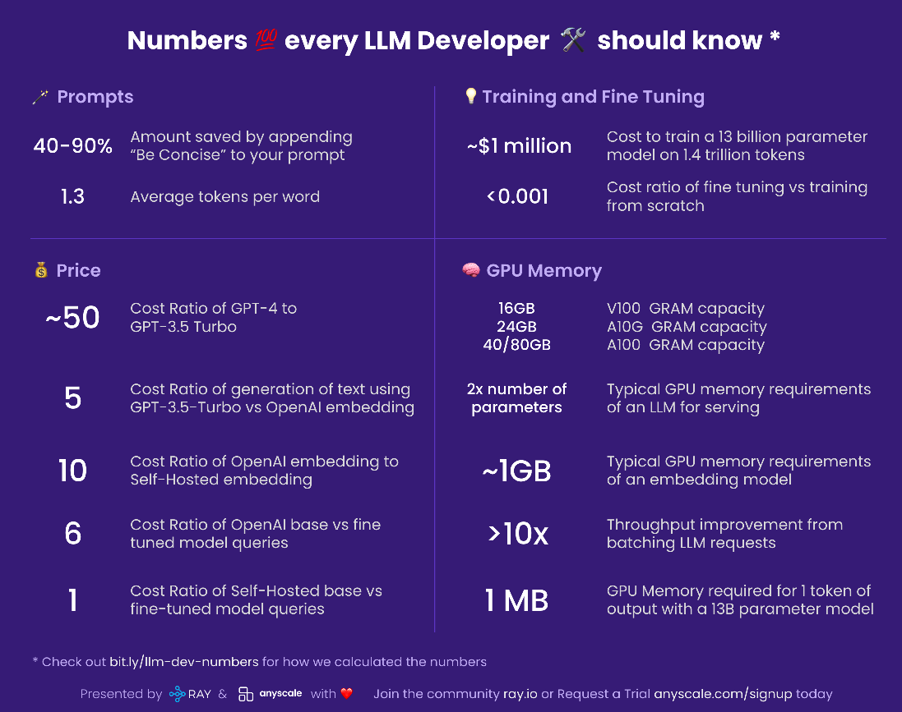
- [Open AI Tokenizer](https://platform.openai.com/tokenizer): GPT-3, Codex Token counting
- [tiktoken✨](https://github.com/openai/tiktoken): BPE tokeniser for use with OpenAI's models. Token counting. [✍️](https://tiktokenizer.vercel.app/):💡online app [Dec 2022]
 
- [Tokencost✨](https://github.com/AgentOps-AI/tokencost): Token price estimates for 400+ LLMs [Dec 2023]
 
- [What are tokens and how to count them?✍️](https://help.openai.com/en/articles/4936856-what-are-tokens-and-how-to-count-them): OpenAI Articles

### **Trustworthy, Safe and Secure LLM**

- [20 AI Governance Papers📑](https://www.linkedin.com/posts/oliver-patel_12-papers-was-not-enough-to-do-the-field-activity-7282005401032613888-6Ck4?utm_source=li_share&utm_content=feedcontent&utm_medium=g_dt_web&utm_campaign=copy) [Jan 2025]
- [A Comprehensive Survey of Hallucination Mitigation Techniques in Large Language Models📑](https://arxiv.org/abs/2401.01313): A compre
hensive survey of over thirty-two techniques developed to mitigate hallucination in LLMs [2 Jan 2024]
- [AI models collapse when trained on recursively generated data](https://www.nature.com/articles/s41586-024-07566-y): Model Collapse. We find that indiscriminate use of model-generated content in training causes irreversible defects in the resulting models, in which tails of the original content distribution disappear. [24 Jul 2024]
- [Alignment Faking✍️](https://www.anthropic.com/research/alignment-faking): LLMs may pretend to align with training objectives during monitored interactions but revert to original behaviors when unmonitored. [18 Dec 2024] | demo: [✍️](https://alignment.anthropic.com/2024/how-to-alignment-faking/) | [Alignment Science Blog](https://alignment.anthropic.com/)
- [An Approach to Technical AGI Safety and Security📑](https://arxiv.org/abs/2504.01849): Google DeepMind. We focus on technical solutions to `misuse` and `misalignment`, two of four key AI risks (the others being `mistakes` and `structural risks`). To prevent misuse, we limit access to dangerous capabilities through detection and security. For misalignment, we use two defenses: model-level alignment via training and oversight, and system-level controls like monitoring and access restrictions. [✍️](https://deepmind.google/discover/blog/taking-a-responsible-path-to-agi/) [2 Apr 2025]
- [Anthropic Many-shot jailbreaking✍️](https://www.anthropic.com/research/many-shot-jailbreaking): simple long-context attack, Bypassing safety guardrails by bombarding them with unsafe or harmful questions and answers. [3 Apr 2024]
- [Extracting Concepts from GPT-4✍️](https://openai.com/index/extracting-concepts-from-gpt-4/): Sparse Autoencoders identify key features, enhancing the interpretability of language models like GPT-4. They extract 16 million interpretable features using GPT-4's outputs as input for training. [6 Jun 2024]
- [FactTune📑](https://arxiv.org/abs/2311.08401): A procedure that enhances the factuality of LLMs without the need for human feedback. The process involves the fine-tuning of a separated LLM using methods such as DPO and RLAIF, guided by preferences generated by [FActScore✨](https://github.com/shmsw25/FActScore). [14 Nov 2023] `FActScore` works by breaking down a generation into a series of atomic facts and then computing the percentage of these atomic facts by a reliable knowledge source. 
- [Frontier Safety Framework](https://deepmind.google/discover/blog/introducing-the-frontier-safety-framework/): Google DeepMind, Frontier Safety Framework, a set of protocols designed to identify and mitigate potential harms from future AI systems. [17 May 2024]
- [Google SAIF✍️](https://www.saif.google/): Secure AI Framework for managing AI security risks. [05 Nov 2025]
- [Guardrails Hub](https://hub.guardrailsai.com): Guardrails for common LLM validation use cases
- [Hallucination Index](https://www.galileo.ai/hallucinationindex): w.r.t. RAG, Testing LLMs with short (≤5k), medium (5k–25k), and long (40k–100k) contexts to evaluate improved RAG performance　[Nov 2023]
- [Hallucination Leaderboard✨](https://github.com/vectara/hallucination-leaderboard/): Evaluate how often an LLM introduces hallucinations when summarizing a document. [Nov 2023]
- [Hallucinations📑](https://arxiv.org/abs/2311.05232): A Survey on Hallucination in Large Language Models: Principles, Taxonomy, Challenges, and Open Questions [9 Nov 2023]
- [Large Language Models Reflect the Ideology of their Creators📑](https://arxiv.org/abs/2410.18417): When prompted in Chinese, all LLMs favor pro-Chinese figures; Western LLMs similarly align more with Western values, even in English prompts. [24 Oct 2024]
- [LlamaFirewall✨](https://github.com/meta-llama/PurpleLlama/tree/main/LlamaFirewall): Scans and filters AI inputs to block prompt injections and malicious content. [29 Apr 2025]
- [LLMs Will Always Hallucinate, and We Need to Live With This📑](https://arxiv.org/abs/2409.05746):💡LLMs cannot completely eliminate hallucinations through architectural improvements, dataset enhancements, or fact-checking mechanisms due to fundamental mathematical and logical limitations. [9 Sep 2024]
- [Machine unlearning](https://en.m.wikipedia.org/wiki/Machine_unlearning): Machine unlearning: techniques to remove specific data from trained machine learning models.
- [Mapping the Mind of a Large Language Model](https://cdn.sanity.io/files/4zrzovbb/website/e2ae0c997653dfd8a7cf23d06f5f06fd84ccfd58.pdf): Anthrophic, A technique called "dictionary learning" can help understand model behavior by identifying which features respond to a particular input, thus providing insight into the model's "reasoning." [✍️](https://www.anthropic.com/research/mapping-mind-language-model) [21 May 2024]
- [NeMo Guardrails✨](https://github.com/NVIDIA/NeMo-Guardrails): Building Trustworthy, Safe and Secure LLM Conversational Systems [Apr 2023]
 
- [NIST AI Risk Management Framework](https://www.nist.gov/itl/ai-risk-management-framework/ai-rmf-development): NIST released the first complete version of the NIST AI RMF Playbook on March 30, 2023
- [OpenAI Weak-to-strong generalization📑](https://arxiv.org/abs/2312.09390):💡In the superalignment problem, humans must supervise models that are much smarter than them. The paper discusses supervising a GPT-4 or 3.5-level model using a GPT-2-level model. It finds that while strong models supervised by weak models can outperform the weak models, they still don’t perform as well as when supervised by ground truth. [✨](https://github.com/openai/weak-to-strong) [14 Dec 2023]
 
- [Political biases of LLMs📑](https://arxiv.org/abs/2305.08283): From Pretraining Data to Language Models to Downstream Tasks: Tracking the Trails of Political Biases Leading to Unfair NLP Models. [15 May 2023] <br/>
  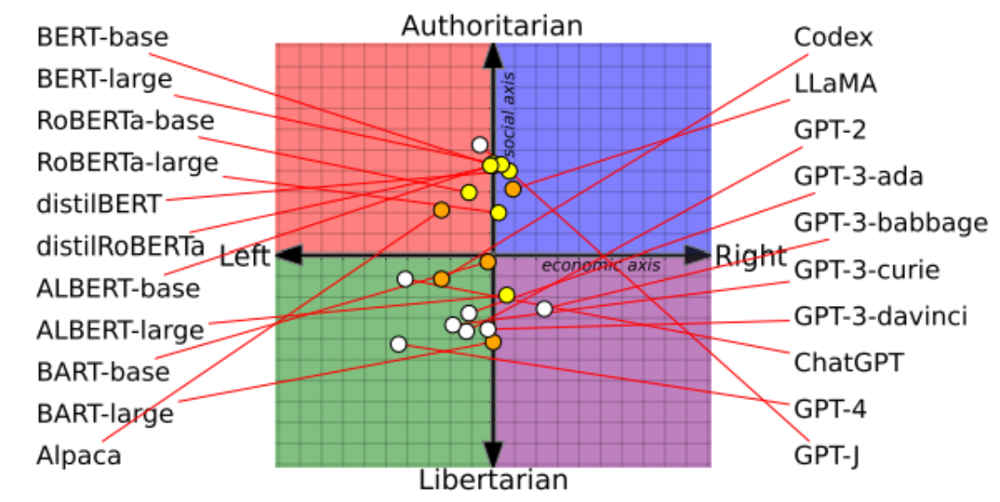
- Red Teaming: The term red teaming has historically described systematic adversarial attacks for testing security vulnerabilities. LLM red teamers should be a mix of people with diverse social and professional backgrounds, demographic groups, and interdisciplinary expertise that fits the deployment context of your AI system. [✍️](https://learn.microsoft.com/en-us/azure/ai-services/openai/concepts/red-teaming)
- [The Foundation Model Transparency Index📑](https://arxiv.org/abs/2310.12941): A comprehensive assessment of the transparency of foundation model developers [✍️](https://crfm.stanford.edu/fmti/) [19 Oct 2023]
- [The Instruction Hierarchy📑](https://arxiv.org/abs/2404.13208): Training LLMs to Prioritize Privileged Instructions. The OpenAI highlights the need for instruction privileges in LLMs to prevent attacks and proposes training models to conditionally follow lower-level instructions based on their alignment with higher-level instructions. [19 Apr 2024]
- [Tracing the thoughts of a large language model✍️](https://www.anthropic.com/research/tracing-thoughts-language-model):💡`Claude 3.5 Haiku` 1. `Universal Thought Processing (Multiple Languages)`: Shared concepts exist across languages and are then translated into the respective language.  2. `Advance Planning (Composing Poetry)`: Despite generating text word by word, it anticipates rhyming words in advance.  3. `Fabricated Reasoning (Math)`: Produces plausible-sounding arguments even when given an incorrect hint. [27 Mar 2025] 
- [Trustworthy LLMs📑](https://arxiv.org/abs/2308.05374): Comprehensive overview for assessing LLM trustworthiness; Reliability, safety, fairness, resistance to misuse, explainability and reasoning, adherence to social norms, and robustness. [10 Aug 2023]
- [Vibe Hacking✍️](https://www.anthropic.com/news/disrupting-AI-espionage): Anthropic reports vibe-hacking attempts. [14 Nov 2025]

### **Large Language Model Is: Abilities**

- [A Categorical Archive of ChatGPT Failures📑](https://arxiv.org/abs/2302.03494): 11  categories of failures, including reasoning, factual errors, math, coding, and bias [✨](https://github.com/giuven95/chatgpt-failures) [6 Feb 2023]
- [A Survey on Employing Large Language Models for Text-to-SQL Tasks📑](https://arxiv.org/abs/2407.15186): a comprehensive overview of LLMs in text-to-SQL tasks [21 Jul 2024]
- [Can LLMs Generate Novel Research Ideas?📑](https://arxiv.org/abs/2409.04109): A Large-Scale Human Study with 100+ NLP Researchers. We find LLM-generated ideas are judged as more novel (p < 0.05) than human expert ideas. However, the study revealed a lack of diversity in AI-generated ideas. [6 Sep 2024]  
- [Design2Code📑](https://arxiv.org/abs/2403.03163): How Far Are We From Automating Front-End Engineering? `64% of cases GPT-4V
generated webpages are considered better than the original reference webpages` [5 Mar 2024]
- [Emergent Abilities of Large Language Models📑](https://arxiv.org/abs/2206.07682): Large language models can develop emergent abilities, which are not explicitly trained but appear at scale and are not present in smaller models. . These abilities can be enhanced using few-shot and augmented prompting techniques. [✍️](https://www.jasonwei.net/blog/emergence) [15 Jun 2022]
- [Improving mathematical reasoning with process supervision✍️](https://openai.com/research/improving-mathematical-reasoning-with-process-supervision) [31 May 2023]
- [Language Modeling Is Compression📑](https://arxiv.org/abs/2309.10668): Lossless data compression, while trained primarily on text, compresses ImageNet patches to 43.4% and LibriSpeech samples to 16.4% of their raw size, beating domain-specific compressors like PNG (58.5%) or FLAC (30.3%). [19 Sep 2023]
- [Large Language Models for Software Engineering📑](https://arxiv.org/abs/2310.03533): Survey and Open Problems, Large Language Models (LLMs) for Software Engineering (SE) applications, such as code generation, testing, repair, and documentation. [5 Oct 2023]
- [LLMs for Chip Design📑](https://arxiv.org/abs/2311.00176): Domain-Adapted LLMs for Chip Design [31 Oct 2023]
- [LLMs Represent Space and Time📑](https://arxiv.org/abs/2310.02207): Large language models learn world models of space and time from text-only training. [3 Oct 2023]
- Math soving optimized LLM [WizardMath📑](https://arxiv.org/abs/2308.09583): Developed by adapting Evol-Instruct and Reinforcement Learning techniques, these models excel in math-related instructions like GSM8k and MATH. [✨](https://github.com/nlpxucan/WizardLM) [18 Aug 2023] / Math solving Plugin: [Wolfram alpha](https://www.wolfram.com/wolfram-plugin-chatgpt/)
 
- [Multitask Prompted Training Enables Zero-Shot Task Generalization📑](https://arxiv.org/abs/2110.08207): A language model trained on various tasks using prompts can learn and generalize to new tasks in a zero-shot manner. [15 Oct 2021]
- [On the Slow Death of Scaling📑](https://papers.ssrn.com/sol3/papers.cfm?abstract_id=5877662): 💡Relying solely on scaling model size and data is becoming less effective, and AI progress now depends on exploring more nuanced, efficient approaches. [12 Dec 2025]
- [Testing theory of mind in large language models and humans](https://www.nature.com/articles/s41562-024-01882-z): Some large language models (LLMs) perform as well as, and in some cases better than, humans when presented with tasks designed to test the ability to track people’s mental states, known as “theory of mind.” [🗣️](https://www.technologyreview.com/2024/05/20/1092681/ai-models-can-outperform-humans-in-tests-to-identify-mental-states) [20 May 2024]

### **Reasoning**

- [Chain of Draft: Thinking Faster by Writing Less📑](https://arxiv.org/abs/2502.18600): Chain-of-Draft prompting con-
denses the reasoning process into minimal, abstract
- [Comment on The Illusion of Thinking: Understanding the Strengths and Limitations of Reasoning Models via the Lens of Problem Complexity📑](https://arxiv.org/abs/2506.09250):💡The `Illusion of Thinking` findings primarily reflect experimental design limitations rather than fundamental reasoning failures. Output token limits, flawed evaluation methods, and unsolvable River Crossing problems. [10 Jun 2025]
- [DeepSeek-R1✨](https://github.com/deepseek-ai/DeepSeek-R1):💡Group Relative Policy Optimization (GRPO). Base -> RL -> SFT -> RL -> SFT -> RL [20 Jan 2025]
- [Illusion of Thinking📑](https://ml-site.cdn-apple.com/papers/the-illusion-of-thinking.pdf): Large Reasoning Models (LRMs) are evaluated using controlled puzzles, where complexity depends on the size of `N`. Beyond a certain complexity threshold, LRM accuracy collapses, and reasoning effort paradoxically decreases. LRMs outperform standard LLMs on medium-complexity tasks, perform worse on low-complexity ones, and both fail on high-complexity. Apple. [May 2025]
- [Inference-Time Computations for LLM Reasoning and Planning: A Benchmark and Insights📑](https://arxiv.org/abs/2502.12521): Evaluate Chain-of-Thought, Tree-of-Thought, and Reasoning as Planning across 11 tasks. While scaling inference-time computation enhances reasoning, no single technique consistently outperforms the others. [18 Feb 2025]
- [Is Chain-of-Thought Reasoning of LLMs a Mirage?📑](https://arxiv.org/abs/2508.01191): The paper concludes that CoT is largely a mimic rather than true reasoning. Using DataAlchemy—`atom` = A–Z; `element` = e.g., APPLE; `transform` = (1) ROT (rotation), (2) position shift; `compositional transform` = combinations of transforms—the model is fine-tuned and evaluated on its ability to generalize to unlearned patterns.
- [Mini-R1✍️](https://www.philschmid.de/mini-deepseek-r1): Reproduce Deepseek R1 „aha moment“ a RL tutorial [30 Jan 2025]
- [Open R1✨](https://github.com/huggingface/open-r1): A fully open reproduction of DeepSeek-R1. [25 Jan 2025]
- [Open Thoughts✨](https://github.com/open-thoughts/open-thoughts): Fully Open Data Curation for Thinking Models [28 Jan 2025]
- [Reasoning LLMs Guide](https://www.promptingguide.ai/guides/reasoning-llms): The Reasoning LLMs Guide shows how to use advanced AI models for step-by-step thinking, planning, and decision-making in complex tasks.
- [S*: Test Time Scaling for Code Generation📑](https://arxiv.org/abs/2502.14382): Parallel scaling (generating multiple solutions) + sequential scaling (iterative debugging). [20 Feb 2025]
- [s1: Simple test-time scaling📑](https://arxiv.org/abs/2501.19393): Curated small dataset of 1K. Budget forces stopping termination. Append "Wait" to lengthen. Achieved better reasoning performance. [31 Jan 2025]
- [Thinking Machines: A Survey of LLM based Reasoning Strategies📑](https://arxiv.org/abs/2503.10814) [13 Mar 2025]
- [Tina: Tiny Reasoning Models via LoRA📑](https://arxiv.org/abs/2504.15777): Low-rank adaptation (LoRA) with Reinforcement learning (RL) on a 1.5B parameter base model  [22 Apr 2025]


## **Survey and Reference**

### **Survey on Large Language Models**

  - [A Primer on Large Language Models and their Limitations📑](https://arxiv.org/abs/2412.04503): A primer on LLMs, their strengths, limits, applications, and research, for academia and industry use. [3 Dec 2024]
  - [A Survey of Large Language Models📑](https://arxiv.org/abs/2303.18223):[v1: 31 Mar 2023 - v15: 13 Oct 2024]
- [A Survey of NL2SQL with Large Language Models: Where are we, and where are we going?📑](https://arxiv.org/abs/2408.05109): [9 Aug 2024] [✨](https://github.com/HKUSTDial/NL2SQL_Handbook)

  - [A Survey of Transformers📑](https://arxiv.org/abs/2106.04554):[8 Jun 2021]
- Google AI Research Recap
  - [Gemini✍️](https://blog.google/technology/ai/google-gemini-ai) [06 Dec 2023] Three different sizes: Ultra, Pro, Nano. With a score of 90.0%, Gemini Ultra is the first model to outperform human experts on MMLU [✍️](https://storage.googleapis.com/deepmind-media/gemini/gemini_1_report.pdf)
  - [Google AI Research Recap (2022 Edition)](https://ai.googleblog.com/2023/01/google-research-2022-beyond-language.html)
  - [Themes from 2021 and Beyond](https://ai.googleblog.com/2022/01/google-research-themes-from-2021-and.html)
  - [Looking Back at 2020, and Forward to 2021](https://ai.googleblog.com/2021/01/google-research-looking-back-at-2020.html)
  - [Large Language Models: A Survey📑](https://arxiv.org/abs/2402.06196): 🏆Well organized visuals and contents [9 Feb 2024]
- [LLM Post-Training: A Deep Dive into Reasoning Large Language Models📑](https://arxiv.org/abs/2502.21321): [✨](https://github.com/mbzuai-oryx/Awesome-LLM-Post-training) [28 Feb 2025]
- [LLM Research Papers: The 2024 List](https://sebastianraschka.com/blog/2024/llm-research-papers-the-2024-list.html) [29 Dec 2024]
- Microsoft Research Recap
  - [Research at Microsoft 2023✍️](https://www.microsoft.com/en-us/research/blog/research-at-microsoft-2023-a-year-of-groundbreaking-ai-advances-and-discoveries/): A year of groundbreaking AI advances and discoveries
- [Noteworthy LLM Research Papers of 2024](https://sebastianraschka.com/blog/2025/llm-research-2024.html) [23 Jan 2025]

### **Additional Topics: A Survey of LLMs**

- [Advancing Reasoning in Large Language Models: Promising Methods and Approaches📑](https://arxiv.org/abs/2502.03671) [5 Feb 2025]
- [Agentic Reasoning for Large Language Models📑](https://arxiv.org/abs/2601.12538) [18 Jan 2026]
- [Agentic Retrieval-Augmented Generation: Agentic RAG📑](https://arxiv.org/abs/2501.09136) [15 Jan 2025]
- [AI Agent Protocols📑](https://arxiv.org/abs/2504.16736) [23 Apr 2025]
- [AI-Generated Content (AIGC)📑](https://arxiv.org/abs/2303.04226): A History of Generative AI from GAN to ChatGPT:[7 Mar 2023]
- [AIOps in the Era of Large Language Models📑](https://arxiv.org/abs/2507.12472) [23 Jun 2025]
- [Aligned LLMs📑](https://arxiv.org/abs/2307.12966):[24 Jul 2023]
- [An Overview on Language Models: Recent Developments and Outlook📑](https://arxiv.org/abs/2303.05759):[10 Mar 2023]
- [A comprehensive taxonomy of hallucinations in Large Language Models📑](https://arxiv.org/abs/2508.01781) [3 Aug 2025]
- [Autonomous Scientific Discovery📑](https://arxiv.org/abs/2508.14111): From AI for Science to Agentic Science [18 Aug 2025]
- [Automatic Prompt Optimization Techniques📑](https://arxiv.org/abs/2502.16923) [24 Feb 2025]
- [Challenges & Application of LLMs📑](https://arxiv.org/abs/2306.07303):[11 Jun 2023]
- [ChatGPT’s One-year Anniversary: Are Open-Source Large Language Models Catching up?📑](https://arxiv.org/abs/2311.16989): Open-Source LLMs vs. ChatGPT; Benchmarks and Performance of LLMs [28 Nov 2023]
- [Compression Algorithms for Language Models📑](https://arxiv.org/abs/2401.15347) [27 Jan 2024]
- [Context Engineering for Large Language Models📑](https://arxiv.org/abs/2507.13334) [17 Jul 2025]
- [Context Engineering 2.0](https://arxiv.org/abs/2510.26493) [30 Oct 2025]
- [Data Management For Large Language Models: A Survey📑](https://arxiv.org/abs/2312.01700) [4 Dec 2023]
- [Data Synthesis and Augmentation for Large Language Models📑](https://arxiv.org/abs/2410.12896) [16 Oct 2024]
- [Efficient Guided Generation for Large Language Models📑](https://arxiv.org/abs/2307.09702):[19 Jul 2023]
- [Efficient Training of Transformers📑](https://arxiv.org/abs/2302.01107):[2 Feb 2023]
- [Evaluation of Large Language Models📑](https://arxiv.org/abs/2307.03109):[6 Jul 2023]
- [Evaluating Large Language Models: A Comprehensive Survey📑](https://arxiv.org/abs/2310.19736):[30 Oct 2023]
- [Evaluation of LLM-based Agents📑](https://arxiv.org/abs/2503.16416) [20 Mar 2025]
- [Foundation Models in Vision📑](https://arxiv.org/abs/2307.13721):[25 Jul 2023]
- [From Google Gemini to OpenAI Q* (Q-Star)📑](https://arxiv.org/abs/2312.10868): Reshaping the Generative Artificial Intelligence (AI) Research Landscape:[18 Dec 2023]
- [From Code Foundation Models to Agents and Applications📑](https://arxiv.org/abs/2511.18538): Comprehensive survey and guide to code intelligence. [23 Nov 2025]
- [GUI Agents: A Survey📑](https://arxiv.org/abs/2412.13501) [18 Dec 2024]
- [Hallucination in LLMs📑](https://arxiv.org/abs/2311.05232):[9 Nov 2023]
- [Hallucination in Natural Language Generation📑](https://arxiv.org/abs/2202.03629):[8 Feb 2022]
- [Harnessing the Power of LLMs in Practice: ChatGPT and Beyond📑](https://arxiv.org/abs/2304.13712):[26 Apr 2023]
- [Harnessing the Reasoning Economy: Efficient Reasoning for Large Language Models📑](https://arxiv.org/abs/2503.24377): Efficient reasoning mechanisms that balance computational cost with performance. [31 Mar 2025]
- [In-context Learning📑](https://arxiv.org/abs/2301.00234):[31 Dec 2022]
- [Large Language Model-Brained GUI Agents: A Survey📑](https://arxiv.org/abs/2411.18279) [27 Nov 2024]
- [LLM-as-a-Judge📑](https://arxiv.org/abs/2411.15594) [23 Nov 2024]
- [LLM-based Autonomous Agents📑](https://arxiv.org/abs/2308.11432v1):[22 Aug 2023]
- [LLM-Driven AI Agent Communication: Protocols, Security Risks, and Defense Countermeasures📑](https://arxiv.org/abs/2506.19676) [24 Jun 2025]
- [LLMs for Healthcare📑](https://arxiv.org/abs/2310.05694):[9 Oct 2023]
- [Mathematical Reasoning in the Era of Multimodal Large Language Model: Benchmark, Method & Challenges📑](https://arxiv.org/abs/2412.11936) [16 Dec 2024]
- [Medical Reasoning in the Era of LLMs📑](https://arxiv.org/abs/2508.00669): A Systematic Review of Enhancement Techniques and Applications [1 Aug 2025]
- [Mixture of Experts📑](https://arxiv.org/abs/2407.06204) [26 Jun 2024]
- [Mitigating Hallucination in LLMs📑](https://arxiv.org/abs/2401.01313): Summarizes 32 techniques to mitigate hallucination in LLMs [2 Jan 2024]
- [Model Compression for LLMs📑](https://arxiv.org/abs/2308.07633):[15 Aug 2023]
- [Multimodal Deep Learning📑](https://arxiv.org/abs/2301.04856):[12 Jan 2023]
- [Multimodal Large Language Models📑](https://arxiv.org/abs/2306.13549):[23 Jun 2023]
- [NL2SQL with Large Language Models: Where are we, and where are we going?📑](https://arxiv.org/abs/2408.05109): [9 Aug 2024] [✨](https://github.com/HKUSTDial/NL2SQL_Handbook)

- [Open Problems and Fundamental Limitations of Reinforcement Learning from Human Feedback📑](https://arxiv.org/abs/2307.15217):[27 Jul 2023]
- [Overview of Factuality in LLMs📑](https://arxiv.org/abs/2310.07521):[11 Oct 2023]
- [Position Paper: Agent AI Towards a Holistic Intelligence📑](https://arxiv.org/abs/2403.00833) [28 Feb 2024]
- [Post-training of Large Language Models📑](https://arxiv.org/abs/2503.06072) [8 Mar 2025]
- [Prompt Engineering Methods in Large Language Models for Different NLP Tasks📑](https://arxiv.org/abs/2407.12994) [17 Jul 2024]
- [Retrieval-Augmented Generation for Large Language Models: A Survey📑](https://arxiv.org/abs/2312.10997) [18 Dec 2023]
- [Retrieval And Structuring Augmented Generation with Large Language Models📑](https://arxiv.org/abs/2509.10697) [12 Sep 2025]
- [Retrieval-Augmented Text Generation for Large Language Models📑](https://arxiv.org/abs/2404.10981) [17 Apr 2024]
- [Scaling Down to Scale Up: A Guide to Parameter-Efficient Fine-Tuning📑](https://arxiv.org/abs/2303.15647):[28 Mar 2023]
- [SEED-Bench: Benchmarking Multimodal LLMs with Generative Comprehension📑](https://arxiv.org/abs/2307.16125): [30 Jul 2023]
- [Self-Supervised Learning: A Cookbook of Self-Supervised Learning📑](https://arxiv.org/abs/2304.12210):[24 Apr 2023]
- [Small Language Models: Survey, Measurements, and Insights📑](https://arxiv.org/abs/2409.15790) [24 Sep 2024]
- [Small Language Models in the Era of Large Language Models📑](https://arxiv.org/abs/2411.03350) [4 Nov 2024]
- [Speed Always Wins: Efficient Architectures for Large Language Models](https://arxiv.org/abs/2508.09834) [13 Aug 2025]
- [Stop Overthinking: Efficient Reasoning for Large Language Models📑](https://arxiv.org/abs/2503.16419) [20 Mar 2025]
- [Summary of ChatGPT/GPT-4 Research and Perspective Towards the Future of Large Language Models📑](https://arxiv.org/abs/2304.01852)
- [Tabular Data Understanding with LLMs: Recent Advances and Challenges](https://arxiv.org/abs/2508.00217) [31 Jul 2025]
- [Techniques for Optimizing Transformer Inference📑](https://arxiv.org/abs/2307.07982):[16 Jul 2023]
- [The Rise and Potential of Large Language Model Based Agents: A Survey📑](https://arxiv.org/abs/2309.07864) [14 Sep 2023]
- [Thinking Machines: LLM based Reasoning Strategies📑](https://arxiv.org/abs/2503.10814) [13 Mar 2025]
- [Towards Artificial General or Personalized Intelligence? 📑](https://arxiv.org/abs/2505.06907): Personalized federated intelligence (PFI). Foundation Model Meets Federated Learning [11 May 2025]
- [Towards Efficient Generative Large Language Model Serving: A Survey from Algorithms to Systems📑](https://arxiv.org/abs/2312.15234): The survey aims to provide a comprehensive understanding of the current state and future directions in efficient LLM serving [23 Dec 2023]
- [Trustworthy LLMs📑](https://arxiv.org/abs/2308.05374):[10 Aug 2023]
- [Universal and Transferable Adversarial Attacks on Aligned Language Models📑](https://arxiv.org/abs/2307.15043):[27 Jul 2023]
- [What is the Role of Small Models in the LLM Era: A Survey📑](https://arxiv.org/abs/2409.06857) [10 Sep 2024]

### **LLM Research (Ranked by cite count >=150)**

- [LLM Papers (≥150 citations)📑](./x_llm_papers.md): High-citation CS papers (≥150 citations) across 35 LLM topic areas — reasoning, RAG, agents, PEFT, RLHF, scaling laws, multimodal, and more — fetched from Semantic Scholar and ranked by citation count.

### **Business use cases**

- [AI-powered success—with more than 1,000 stories of customer transformation and innovation✍️](https://www.microsoft.com/en-us/microsoft-cloud/blog/2025/07/24/ai-powered-success-with-1000-stories-of-customer-transformation-and-innovation/)💡[24 July 2025]
- [Anthropic Clio✍️](https://www.anthropic.com/research/clio): Privacy-preserving insights into real-world AI use [12 Dec 2024]
- [Anthropic Economic Index✍️](https://www.anthropic.com/news/the-anthropic-economic-index): a research on the labor market impact of technologies. The usage is concentrated in software development and technical writing tasks. [10 Feb 2025]
- [Canaries in the Coal Mine? Six Facts about the Recent Employment Effects of Artificial Intelligence📑](https://digitaleconomy.stanford.edu/wp-content/uploads/2025/08/Canaries_BrynjolfssonChandarChen.pdf): early-career workers (ages 22–25) in AI-exposed jobs fell 13%, while older workers remained stable or grew. [26 Aug 2025]
- [Chatbot Interviewers Fill More Jobs✍️](https://www.deeplearning.ai/the-batch/study-shows-ai-agent-interviewers-improve-hiring-retention-in-customer-service-jobs/): Using chatbots as interviewers improves hiring efficiency and retention in customer service roles. [3 Sep 2025]
- [Examining the Use and Impact of an AI Code Assistant on Developer Productivity and Experience in the Enterprise📑](https://arxiv.org/abs/2412.06603): IBM study surveying developer experiences with watsonx Code Assistant (WCA). Most common use: code explanations (71.9%). Rated effective by 57.4%, ineffective by 42.6%. Many described WCA as similar to an “intern” or “junior developer.” [9 Dec 2024]
- [Future of Work with AI Agents: Auditing Automation and Augmentation Potential across the U.S. Workforce📑](https://arxiv.org/abs/2506.06576): A new framework maps U.S. workers’ preferences for AI automation vs. augmentation across 844 tasks.　It shows how people want AI to help or replace them. Many jobs need AI to support people, not just take over. [6 Jun 2025]
- [Google: 321 real-world gen AI use cases from the world's leading organizations✍️](https://blog.google/products/google-cloud/gen-ai-business-use-cases/) [19 Dec 2024]
- [Google: 60 of our biggest AI announcements in 2024✍️](https://blog.google/technology/ai/google-ai-news-recap-2024/) [23 Dec 2024]
- [How people are using ChatGPT✍️](https://openai.com/index/how-people-are-using-chatgpt/): OpenAI. Broadly adopted worldwide, mainly for advice (49%), task completion (40%), and creative expression (11%), with significant work-related use and rapid uptake in lower-income regions. [15 Sep 2025]
- [How real-world businesses are transforming with AI✍️](https://blogs.microsoft.com/blog/2024/11/12/how-real-world-businesses-are-transforming-with-ai/):💡Collected over 200 examples of how organizations are leveraging Microsoft’s AI capabilities. [12 Nov 2024]
- [Rapid Growth Continues for ChatGPT, Google’s NotebookLM](https://www.similarweb.com/blog/insights/ai-news/chatgpt-notebooklm/) [6 Nov 2024]
- [Senior Developers Ship nearly 2.5x more AI Code than Junior Counterparts✍️](https://www.fastly.com/blog/senior-developers-ship-more-ai-code): About a third of senior developers (10+ years of experience) say over half their shipped code is AI-generated [27 Aug 2025]
- [SignalFire State of Talent Report 2025](https://www.signalfire.com/blog/signalfire-state-of-talent-report-2025): 1. Entry‑level hiring down sharply since 2019 (-50%) 2. Anthropic dominate mid/senior talent retention 3. Roles labeled “junior” filled by seniors, blocking grads. [20 May 2025]
- State of AI
  - [Retool: Status of AI](https://retool.com/reports): A Report on AI In Production [2023](https://retool.com/reports/state-of-ai-2023) -> [2024](https://retool.com/blog/state-of-ai-h1-2024)
  - [The State of Generative AI in the Enterprise](https://menlovc.com/2023-the-state-of-generative-ai-in-the-enterprise-report/) [ⓒ2023]
    > 1. 96% of AI spend is on inference, not training. 2. Only 10% of enterprises pre-trained own models. 3. 85% of models in use are closed-source. 4. 60% of enterprises use multiple models.
  - [Standford AI Index Annual Report](https://aiindex.stanford.edu/report/)
  - [State of AI Report 2024](https://www.stateof.ai/2024) [10 Oct 2024]
  - [State of AI Report 2025](https://www.stateof.ai/2025-report-launch) [9 Oct 2025]
  - [LangChain > State of AI Agents](https://www.langchain.com/stateofaiagents) [19 Dec 2024]
- [The leading generative AI companies](https://iot-analytics.com/leading-generative-ai-companies/):💡GPU: Nvidia 92% market share, Generative AI foundational models and platforms: Microsoft 32% market share, Generative AI services: no single dominant [4 Mar 2025]
- [Trends – Artificial Intelligence](https://www.bondcap.com/report/pdf/Trends_Artificial_Intelligence.pdf):💡Issued by Bondcap VC. 340 Slides. ChatGPT’s 800 Million Users, 99% Cost Drop within 17 months. [May 2025]
- [Who is using AI to code? Global diffusion and impact of generative AI📑](https://arxiv.org/abs/2506.08945): AI wrote 30% of Python functions by U.S. devs in 2024. Adoption is uneven globally but boosts output and innovation. New coders use AI more, and usage drives $9.6–$14.4B in U.S. annual value. [10 Jun 2025]

### **Build an LLMs from scratch: picoGPT and lit-gpt**

- An unnecessarily tiny implementation of GPT-2 in NumPy. [picoGPT✨](https://github.com/jaymody/picoGPT): Transformer Decoder [Jan 2023]
 
```python
q = x @ w_k # [n_seq, n_embd] @ [n_embd, n_embd] -> [n_seq, n_embd]
k = x @ w_q # [n_seq, n_embd] @ [n_embd, n_embd] -> [n_seq, n_embd]
v = x @ w_v # [n_seq, n_embd] @ [n_embd, n_embd] -> [n_seq, n_embd]

# In picoGPT, combine w_q, w_k and w_v into a single matrix w_fc
x = x @ w_fc # [n_seq, n_embd] @ [n_embd, 3*n_embd] -> [n_seq, 3*n_embd]
```
- [4 LLM Text Generation Strategies](https://blog.dailydoseofds.com/p/4-llm-text-generation-strategies): Greedy strategy, Multinomial sampling strategy, Beam search, Contrastive search [27 Sep 2025]
- [Andrej Karpathy📺](https://www.youtube.com/watch?v=l8pRSuU81PU): Reproduce the GPT-2 (124M) from scratch. [June 2024] / [SebastianRaschka📺](https://www.youtube.com/watch?v=kPGTx4wcm_w): Developing an LLM: Building, Training, Finetuning  [June 2024]
- Beam Search [1977] in Transformers is an inference algorithm that maintains the `beam_size` most probable sequences until the end token appears or maximum sequence length is reached. If `beam_size` (k) is 1, it's a `Greedy Search`. If k equals the total vocabularies, it's an `Exhaustive Search`. [🤗](https://huggingface.co/blog/constrained-beam-search) [Mar 2022]
- [Build a Large Language Model (From Scratch)✨](https://github.com/rasbt/LLMs-from-scratch):🏆Implementing a ChatGPT-like LLM from scratch, step by step
 
- [Einsum is All you Need](https://rockt.ai/2018/04/30/einsum): Einstein Summation [5 Feb 2018] 
- lit-gpt: Hackable implementation of state-of-the-art open-source LLMs based on nanoGPT. Supports flash attention, 4-bit and 8-bit quantization, LoRA and LLaMA-Adapter fine-tuning, pre-training. Apache 2.0-licensed. [✨](https://github.com/Lightning-AI/lit-gpt) [Mar 2023]
 
- [llama3-from-scratch✨](https://github.com/naklecha/llama3-from-scratch): Implementing Llama3 from scratch [May 2024]
 
- [llm.c✨](https://github.com/karpathy/llm.c): LLM training in simple, raw C/CUDA [Apr 2024]
  | Reproducing GPT-2 (124M) in llm.c in 90 minutes for $20 [✨](https://github.com/karpathy/llm.c/discussions/481)
- [nanochat✨](https://github.com/karpathy/nanochat): a full-stack implementation of an LLM [Oct 2025]  
- [nanoGPT✨](https://github.com/karpathy/nanoGPT):💡Andrej Karpathy [Dec 2022] | [nanoMoE✨](https://github.com/wolfecameron/nanoMoE) [Dec 2024]  
- [nanoVLM✨](https://github.com/huggingface/nanoVLM): 🤗 The simplest, fastest repository for training/finetuning small-sized VLMs. [May 2025]
- [pix2code✨](https://github.com/tonybeltramelli/pix2code): Generating Code from a Graphical User Interface Screenshot. Trained dataset as a pair of screenshots and simplified intermediate script for HTML, utilizing image embedding for CNN and text embedding for LSTM, encoder and decoder model. Early adoption of image-to-code. [May 2017]  
- [Screenshot to code✨](https://github.com/emilwallner/Screenshot-to-code): Turning Design Mockups Into Code With Deep Learning [Oct 2017] [✍️](https://blog.floydhub.com/turning-design-mockups-into-code-with-deep-learning/) 
- [Spreadsheets-are-all-you-need✨](https://github.com/ianand/spreadsheets-are-all-you-need): Spreadsheets-are-all-you-need implements the forward pass of GPT2 entirely in Excel using standard spreadsheet functions. [Sep 2023]
 
- [Transformer Explainer](https://arxiv.org/pdf/2408.04619): an open-source interactive tool to learn about the inner workings of a Transformer model (GPT-2) [✨](https://poloclub.github.io/transformer-explainer/) [8 Aug 2024]
- [Umar Jamil github✨](https://github.com/hkproj):💡LLM Model explanation / building a model from scratch [📺](https://www.youtube.com/@umarjamilai)
- [You could have designed state of the art positional encoding](https://fleetwood.dev/posts/you-could-have-designed-SOTA-positional-encoding): Binary Position Encoding, Sinusoidal positional encoding, Absolute vs Relative Position Encoding, Rotary Positional encoding [17 Nov 2024]

### **Classification of Attention**

- Soft Attention: Assigns continuous weights to all inputs; differentiable and widely used (e.g., neural machine translation).
- Hard Attention: Selects discrete subsets of inputs; non-differentiable, often trained with reinforcement learning (e.g., image captioning).
- Global Attention: Attends to all input tokens, capturing long-range dependencies; suitable for shorter sequences due to cost.
- Local Attention: Restricts focus to a region around each token; balances efficiency and context (e.g., time series).
- Self-Attention: Each token attends to other tokens in the same sequence; core to models like BERT.
- Multi-Head Self-Attention: Runs several self-attentions in parallel to capture diverse relations; essential for Transformers.
- Sparse Attention: Computes only a subset of similarity scores (e.g., strided, fixed); enables scaling to very long sequences (see *Performer*).
- Cross-Attention: Attends between two sequences (e.g., encoder–decoder in machine translation).
- Sliding Window Attention (SWA): Used in **Longformer**; each token attends within a fixed-size local window, reducing memory use for long texts.
- [✍️](https://blog.research.google/2020/10/rethinking-attention-with-performers.html) [23 Oct 2020] / [✍️](https://vaclavkosar.com/ml/cross-attention-in-transformer-architecture) / [✍️](https://sebastianraschka.com/blog/2023/self-attention-from-scratch.html) [9 Feb 2023]  / [✨](https://github.com/mistralai/mistral-src#sliding-window-to-speed-up-inference-and-reduce-memory-pressure)
- [Efficient Streaming Language Models with Attention Sinks](http://arxiv.org/abs/2309.17453): 1. StreamingLLM, an efficient framework that enables LLMs trained with a finite length attention window to generalize to infinite sequence length without any fine-tuning. 2. We neither expand the LLMs' context window nor enhance their long-term memory. [✨](https://github.com/mit-han-lab/streaming-llm) [29 Sep 2023]   
  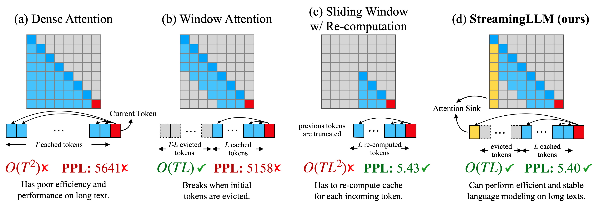  
  - Key-Value (KV) cache is an important component in the StreamingLLM framework.  
  - Window Attention: Only the most recent Key and Value states (KVs) are cached. This approach fails when the text length surpasses the cache size.
  - Sliding Attention /w Re-computation: Rebuilds the Key-Value (KV) states from the recent tokens for each new token. Evicts the oldest part of the cache.
  - StreamingLLM: One of the techniques used is to add a placeholder token (yellow-colored) as a dedicated attention sink during pre-training. This attention sink attracts the model’s attention and helps it generalize to longer sequences. Outperforms the sliding window with re-computation baseline by up to a remarkable 22.2× speedup.
- LongLoRA
  - [LongLoRA: Efficient Fine-tuning of Long-Context Large Language Models📑](https://arxiv.org/abs/2309.12307): A combination of sparse local attention and LoRA [✨](https://github.com/dvlab-research/LongLoRA) [21 Sep 2023]     <!-- 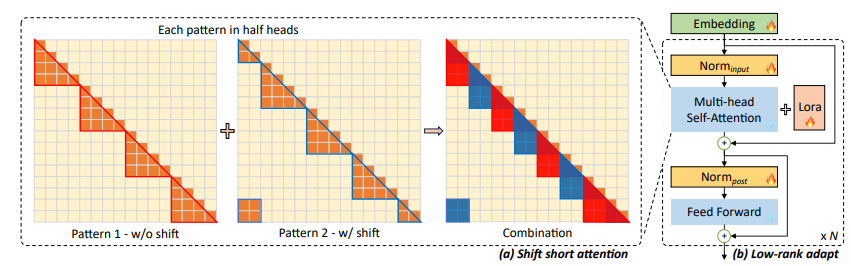    -->  
  - The document states that LoRA alone is not sufficient for long context extension.
  - Although dense global attention is needed during inference, fine-tuning the model can be done by sparse local attention, shift short attention (S2-Attn).
  - S2-Attn can be implemented with only two lines of code in training.
<!--   2. [QA-LoRA📑](https://arxiv.org/abs/2309.14717): Quantization-Aware Low-Rank Adaptation of Large Language Models. A method that integrates quantization and low-rank adaptation for large language models. [✨](https://github.com/yuhuixu1993/qa-lora) [26 Sep 2023]
  -->
- [4 Advanced Attention Mechanisms🤗](https://huggingface.co/blog/Kseniase/attentions) [4 Apr 2025]
  - Slim Attention: Stores only keys (K) during decoding and reconstructs values (V) from K when needed, reducing memory usage. -> Up to 2x memory savings, faster inference. Slight compute overhead from reconstructing V.
  - XAttention: Uses a sparse block attention pattern with antidiagonal alignment to ensure better coverage and efficiency. -> Preserves accuracy, boosts speed (up to 13x faster). Requires careful design of block-sparse layout.
  - KArAt (Kolmogorov-Arnold Attention): Replaces the fixed softmax attention with a learnable function (based on Kolmogorov–Arnold representation) to better model dependencies. -> Highly expressive, adaptable to complex patterns. Higher compute cost, less mature tooling.
  - MTA (Multi-Token Attention): Instead of attending token-by-token, it updates *groups* of tokens together, reducing the frequency of attention calls. -> Better for tasks where context spans across groups. Introduces grouping complexity, may hurt granularity.

### **LLM Materials in Japanese**

- [ChatGPTやCopilotなど各種生成AI用の日本語の Prompt のサンプル✨](https://github.com/dahatake/GenerativeAI-Prompt-Sample-Japanese) [Apr 2023]
- [LLM 研究プロジェクト✍️](https://blog.brainpad.co.jp/entry/2023/07/27/153006): ブログ記事一覧 [27 Jul 2023]
- [ブレインパッド社員が投稿した Qiita 記事まとめ✍️](https://blog.brainpad.co.jp/entry/2023/07/27/153055): ブレインパッド社員が投稿した Qiita 記事まとめ [Jul 2023]
- [rinna🤗](https://huggingface.co/rinna): rinna の 36 億パラメータの日本語 GPT 言語モデル: 3.6 billion parameter Japanese GPT language model [17 May 2023]
- [rinna: bilingual-gpt-neox-4b🤗](https://huggingface.co/rinna/bilingual-gpt-neox-4b): 日英バイリンガル大規模言語モデル [17 May 2023]
- [法律:生成 AI の利用ガイドライン](https://storialaw.jp/blog/9414): Legal: Guidelines for the Use of Generative AI
- [New Era of Computing - ChatGPT がもたらした新時代✍️](https://speakerdeck.com/dahatake/new-era-of-computing-chatgpt-gamotarasitaxin-shi-dai-3836814a-133a-4879-91e4-1c036b194718) [May 2023]
- [大規模言語モデルで変わる ML システム開発✍️](https://speakerdeck.com/hirosatogamo/da-gui-mo-yan-yu-moderudebian-warumlsisutemukai-fa): ML system development that changes with large-scale language models [Mar 2023]
- [GPT-4 登場以降に出てきた ChatGPT/LLM に関する論文や技術の振り返り✍️](https://blog.brainpad.co.jp/entry/2023/06/05/153034): Review of ChatGPT/LLM papers and technologies that have emerged since the advent of GPT-4 [Jun 2023]
- [LLM を制御するには何をするべきか？✍️](https://blog.brainpad.co.jp/entry/2023/06/08/161643): How to control LLM [Jun 2023]
- [1. 生成 AI のマルチモーダルモデルでできること✍️](https://blog.brainpad.co.jp/entry/2023/06/06/160003): What can be done with multimodal models of generative AI [2. 生成 AI のマルチモーダリティに関する技術調査✍️](https://blog.brainpad.co.jp/entry/2023/10/18/153000) [Jun 2023]
- [LLM の推論を効率化する量子化技術調査✍️](https://blog.brainpad.co.jp/entry/2023/09/01/153003): Survey of quantization techniques to improve efficiency of LLM reasoning [Sep 2023]
- [LLM の出力制御や新モデルについて✍️](https://blog.brainpad.co.jp/entry/2023/09/08/155352): About LLM output control and new models [Sep 2023]
- [Azure OpenAI を活用したアプリケーション実装のリファレンス✨](https://github.com/Azure-Samples/jp-azureopenai-samples): 日本マイクロソフト リファレンスアーキテクチャ [Jun 2023]
 
- [生成 AI・LLM のツール拡張に関する論文の動向調査✍️](https://blog.brainpad.co.jp/entry/2023/09/22/150341): Survey of trends in papers on tool extensions for generative AI and LLM [Sep 2023]
- [LLM の学習・推論の効率化・高速化に関する技術調査✍️](https://blog.brainpad.co.jp/entry/2023/09/28/170010): Technical survey on improving the efficiency and speed of LLM learning and inference [Sep 2023]
- [日本語LLMまとめ - Overview of Japanese LLMs✨](https://github.com/llm-jp/awesome-japanese-llm): 一般公開されている日本語LLM（日本語を中心に学習されたLLM）および日本語LLM評価ベンチマークに関する情報をまとめ [Jul 2023]
 
- [Azure OpenAI Service で始める ChatGPT/LLM システム構築入門✨](https://github.com/shohei1029/book-azureopenai-sample): サンプルプログラム [Aug 2023]
 
- [Azure OpenAI と Azure Cognitive Search の組み合わせを考える](https://qiita.com/nohanaga/items/59e07f5e00a4ced1e840) [24 May 2023]
- [Matsuo Lab](https://weblab.t.u-tokyo.ac.jp/en/): 人工知能・深層学習を学ぶためのロードマップ [✍️](https://weblab.t.u-tokyo.ac.jp/人工知能・深層学習を学ぶためのロードマップ/) / [🗄️](../files/archive/Matsuo_Lab_LLM_2023_Slide_pdf.7z) [Dec 2023]
- [AI事業者ガイドライン](https://www.meti.go.jp/shingikai/mono_info_service/ai_shakai_jisso/) [Apr 2024]
- [LLMにまつわる"評価"を整理する✍️](https://zenn.dev/seya/articles/dd0010601b3136) [06 Jun 2024]
- [コード生成を伴う LLM エージェント✍️](https://speakerdeck.com/smiyawaki0820)  [18 Jul 2024]
- [Japanese startup Orange uses Anthropic's Claude to translate manga into English✍️](https://www.technologyreview.com/2024/12/02/1107562/this-manga-publisher-is-using-anthropics-ai-to-translate-japanese-comics-into-english/): [02 Dec 2024]
- [AWS で実現する安全な生成 AI アプリケーション – OWASP Top 10 for LLM Applications 2025 の活用例✍️](https://aws.amazon.com/jp/blogs/news/secure-gen-ai-applications-on-aws-refer-to-owasp-top-10-for-llm-applications/) [31 Jan 2025]

### **LLM Materials in Korean**

- [Machine Learning Study 혼자 해보기✨](https://github.com/teddylee777/machine-learning) [Sep 2018]
 
- [LangChain 한국어 튜토리얼✨](https://github.com/teddylee777/langchain-kr) [Feb 2024]
 
- [AI 데이터 분석가 ‘물어보새’ 등장 – RAG와 Text-To-SQL 활용✍️](https://techblog.woowahan.com/18144/) [Jul 2024]
- [LLM, 더 저렴하게, 더 빠르게, 더 똑똑하게✍️](https://tech.kakao.com/posts/633) [09 Sep 2024]
- [생성형 AI 서비스: 게이트웨이로 쉽게 시작하기✍️](https://techblog.woowahan.com/19915/) [07 Nov 2024]
- [Harness를 이용해 LLM 애플리케이션 평가 자동화하기✍️](https://techblog.lycorp.co.jp/ko/automating-llm-application-evaluation-with-harness) [16 Nov 2024]
- [모두를 위한 LLM 애플리케이션 개발 환경 구축 사례✍️](https://techblog.lycorp.co.jp/ko/building-a-development-environment-for-llm-apps-for-everyone)  [7 Feb 2025]
- [LLM 앱의 제작에서 테스트와 배포까지, LLMOps 구축 사례 소개✍️](https://techblog.lycorp.co.jp/ko/building-llmops-for-creating-testing-deploying-of-llm-apps) [14 Feb 2025]
- [Kanana✨](https://github.com/kakao/kanana): Kanana, a series of bilingual language models (developed by Kakao) [26 Feb 2025]
- [HyperCLOVA X SEED🤗](https://huggingface.co/collections/naver-hyperclovax): Lightweight open-source lineup with a strong focus on Korean language [23 Apr 2025]
- [문의 대응을 효율화하기 위한 RAG 기반 봇 도입하기✍️](https://techblog.lycorp.co.jp/ko/rag-based-bot-for-streamlining-inquiry-responses) [23 May 2025]

### **Learning and Supplementary Materials**

- [AI by Hand | Special Lecture - DeepSeek](https://www.youtube.com/watch?v=idF6TiTGYsE):🏆MoE, Latent Attention implemented in DeepSeek [✨](https://github.com/ImagineAILab/ai-by-hand-excel) [30 Jan 2025]
- [AI-Crash-Course✨](https://github.com/henrythe9th/AI-Crash-Course): AI Crash Course to help busy builders catch up to the public frontier of AI research in 2 weeks [Jan 2025]
- [Anti-hype LLM reading list](https://gist.github.com/veekaybee/be375ab33085102f9027853128dc5f0e)
- [Attention Is All You Need](https://arxiv.org/pdf/1706.03762.pdf): 🏆 The Transformer,
  based solely on attention mechanisms, dispensing with recurrence and convolutions
  entirely. [12 Jun 2017] [Illustrated transformer](http://jalammar.github.io/illustrated-transformer/)
- [Best-of Machine Learning with Python✨](https://github.com/ml-tooling/best-of-ml-python):🏆A ranked list of awesome machine learning Python libraries. [Nov 2020]
 
- [But what is a GPT?📺](https://www.youtube.com/watch?v=wjZofJX0v4M)🏆3blue1brown: Visual intro to transformers [Apr 2024]
- [CNN Explainer: Learning Convolutional Neural Networks with Interactive Visualization✨](https://github.com/poloclub/cnn-explainer) [Apr 2020]
 
- [Comparing Adobe Firefly, Dalle-2, OpenJourney, Stable Diffusion, and Midjourney✍️](https://blog.usmanity.com/comparing-adobe-firefly-dalle-2-and-openjourney/): Generative AI for images [20 Jun 2023]
- [DAIR.AI✨](https://github.com/dair-ai):💡Machine learning & NLP research ([omarsar github✨](https://github.com/omarsar))
  - [ML Papers of The Week✨](https://github.com/dair-ai/ML-Papers-of-The-Week) [Jan 2023] | [✍️](https://nlp.elvissaravia.com/): NLP Newsletter
 
- [Daily Dose of Data Science✨](https://github.com/ChawlaAvi/Daily-Dose-of-Data-Science) [Dec 2022]
 
- [Deep Learning cheatsheets for Stanford's CS 230✨](https://github.com/afshinea/stanford-cs-230-deep-learning/tree/master/en): Super VIP Cheetsheet: Deep Learning [Nov 2019]
- [DeepLearning.ai Short courses](https://www.deeplearning.ai/short-courses/): DeepLearning.ai Short courses [2023]
- [eugeneyan blog](https://eugeneyan.com/start-here/):💡Lessons from A year of Building with LLMs, Patterns for LLM Systems. [✨](https://github.com/eugeneyan/applied-ml) 
- [Foundational concepts like Transformers, Attention, and Vector Database](https://www.linkedin.com/posts/alphasignal_can-foundational-concepts-like-transformers-activity-7163890641054232576-B1ai) [Feb 2024]
- [Foundations of Large Language Models📑](https://arxiv.org/abs/2501.09223): a book about large language models: pre-training, generative models, prompting techniques, and alignment methods. [16 Jan 2025]
- [gpt4free✨](https://github.com/xtekky/gpt4free) for educational purposes only [Mar 2023]
 
- [Hundred-Page Language Models Book by Andriy Burkov✨](https://github.com/aburkov/theLMbook) [15 Jan 2025]
- [IbrahimSobh/llms✨](https://github.com/IbrahimSobh/llms): Language models introduction with simple code. [Jun 2023]
 
- [Large Language Model Course✨](https://github.com/mlabonne/llm-course): Course to get into Large Language Models (LLMs) with roadmaps and Colab notebooks. [Jun 2023]
 
- [Large Language Models: Application through Production✨](https://github.com/databricks-academy/large-language-models): A course on edX & Databricks Academy
 
- [LLM FineTuning Projects and notes on common practical techniques✨](https://github.com/rohan-paul/LLM-FineTuning-Large-Language-Models) [Oct 2023]
 
- [LLM Visualization](https://bbycroft.net/llm): A 3D animated visualization of an LLM with a walkthrough
- [Machine learning algorithms✨](https://github.com/rushter/MLAlgorithms): ml algorithms or implementation from scratch [Oct 2016] 
- [Must read: the 100 most cited AI papers in 2022](https://www.zeta-alpha.com/post/must-read-the-100-most-cited-ai-papers-in-2022) : [🗄️](../files/top-cited-2020-2021-2022-papers.pdf) [8 Mar 2023]
- [Open Problem and Limitation of RLHF📑](https://arxiv.org/abs/2307.15217): Provides an overview of open problems and the limitations of RLHF [27 Jul 2023]
<!-- - [Ai Fire](https://www.aifire.co/c/ai-learning-resources): AI Fire Learning resources [🗄️](../files/aifire.pdf) [2023] -->
- [OpenAI Cookbook✨](https://github.com/openai/openai-cookbook) Examples and guides for using the OpenAI API
 
- [oumi: Open Universal Machine Intelligence✨](https://github.com/oumi-ai/oumi): Everything you need to build state-of-the-art foundation models, end-to-end. [Oct 2024]
- [The Best Machine Learning Resources](https://medium.com/machine-learning-for-humans/how-to-learn-machine-learning-24d53bb64aa1) : [🗄️](../files/ml_rsc.pdf) [20 Aug 2017]
- [The Big Book of Large Language Models](https://book.theaiedge.io/) by Damien Benveniste [30 Jan 2025]
- [The Illustrated GPT-OSS](https://newsletter.languagemodels.co/p/the-illustrated-gpt-oss) [19 Aug 2025]
- [What are the most influential current AI Papers?📑](https://arxiv.org/abs/2308.04889): NLLG Quarterly arXiv Report 06/23 [✨](https://github.com/NL2G/Quaterly-Arxiv) [31 Jul 2023]
 


