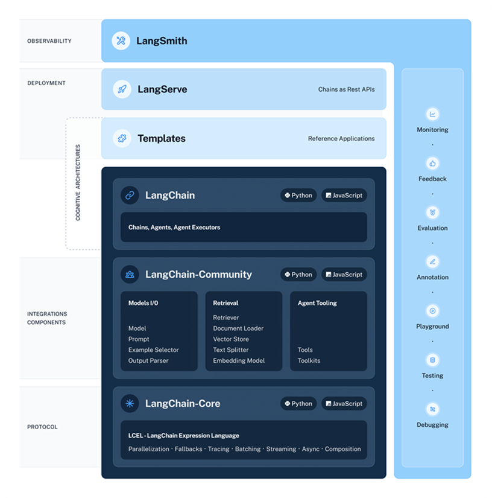
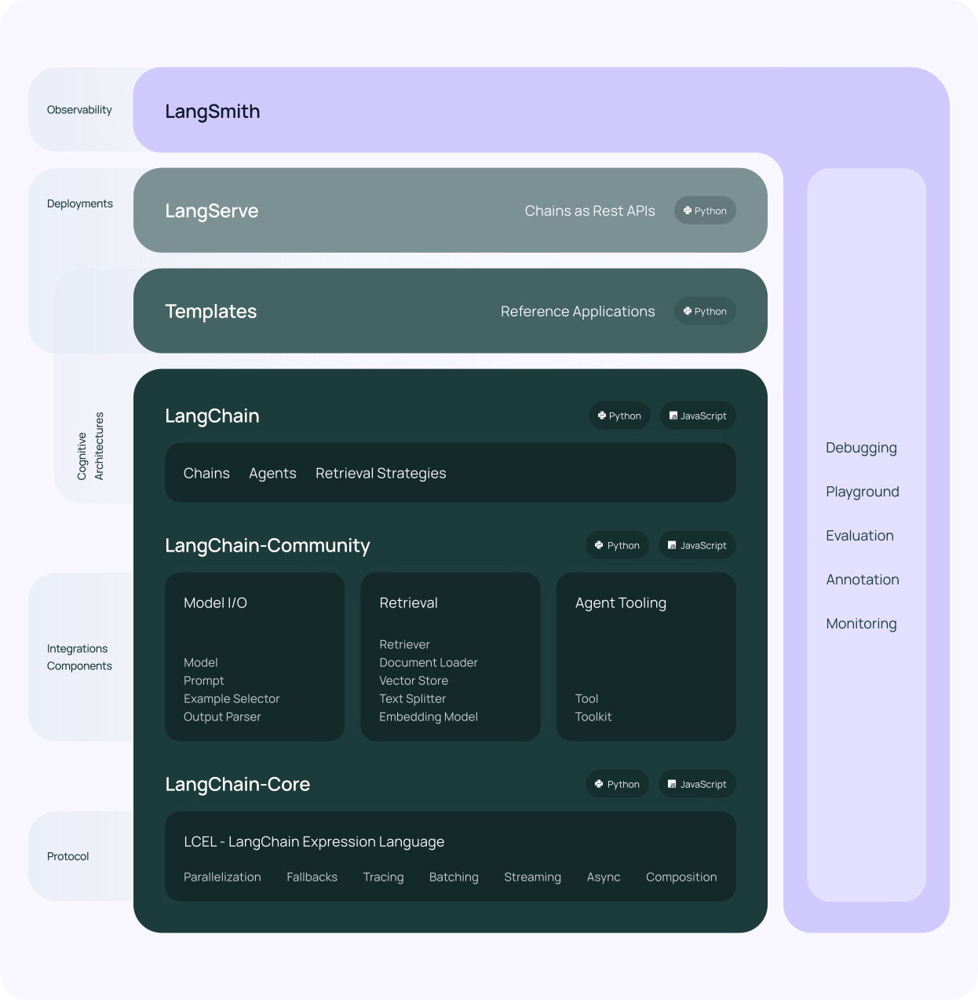
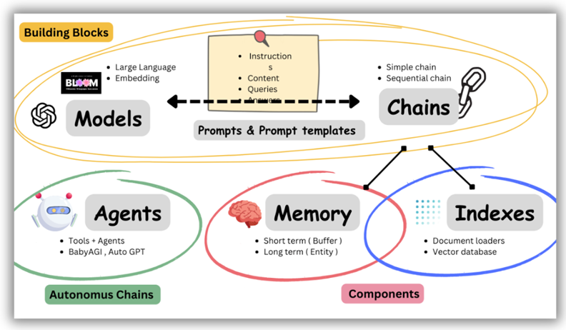
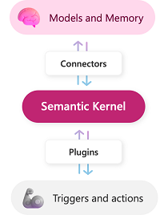
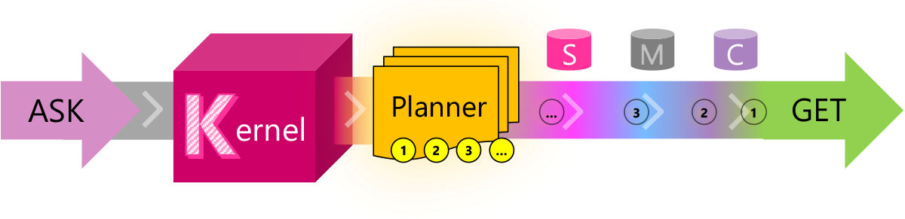
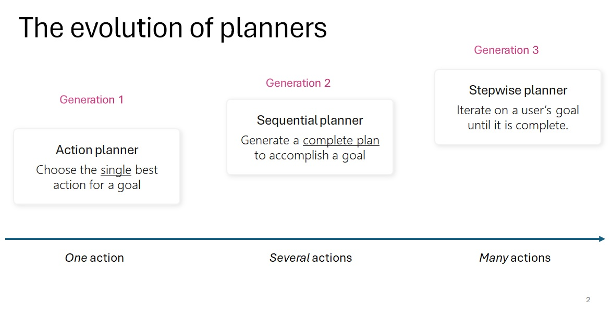
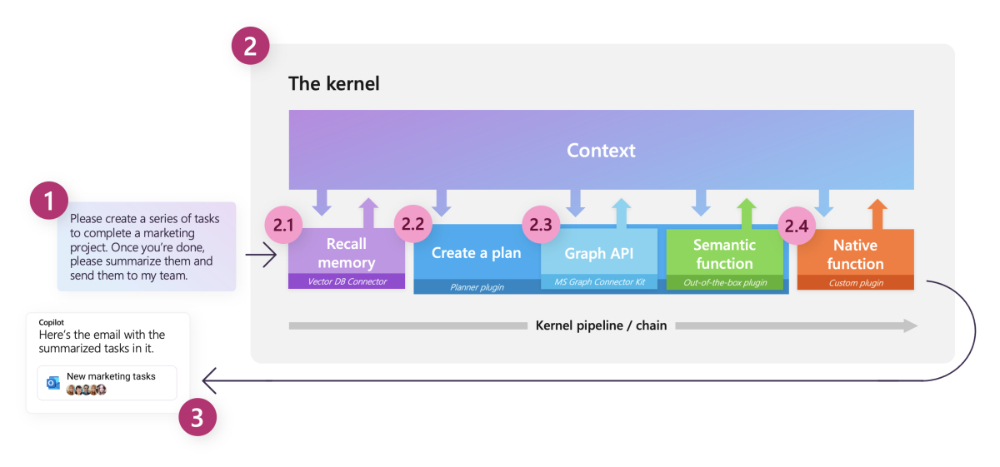
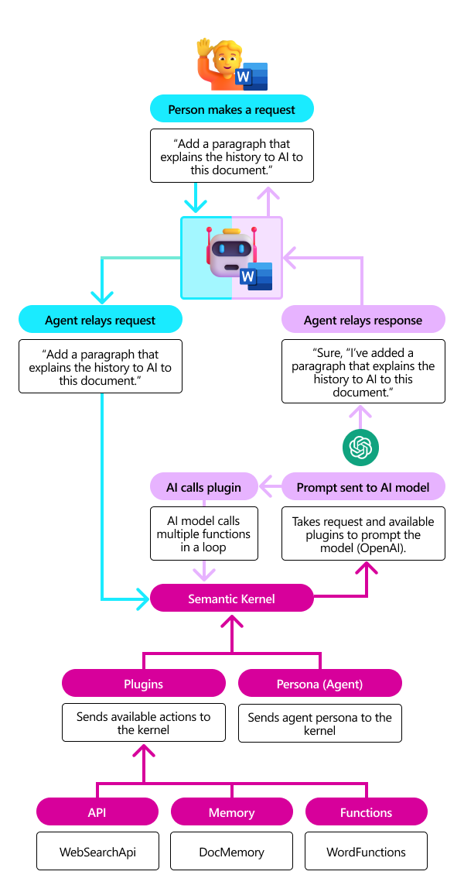
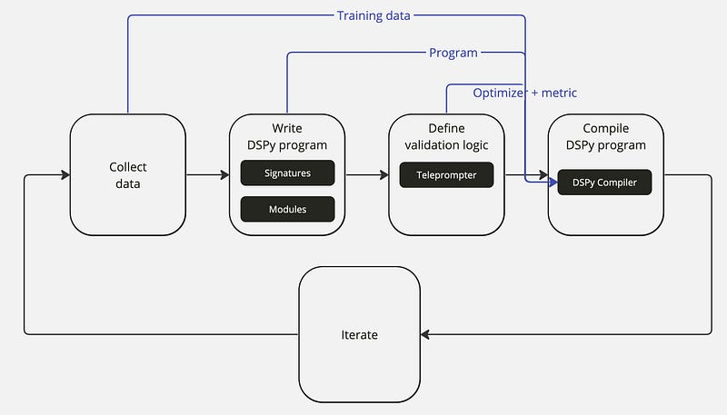

### **Orchestration Framework**

#### **LangChain**

- LangChain is a framework for developing applications powered by language models. (1) Be data-aware: connect a language model to other sources of data.
  (2) Be agentic: Allow a language model to interact with its environment. doc:[✍️](https://docs.langchain.com/docs) / blog:[✍️](https://blog.langchain.dev) / [git](https://github.com/langchain-ai/langchain)
 
- [Reflections on Three Years of Building LangChain](https://blog.langchain.com/three-years-langchain/): Langchain 1.0, released  [25 Oct 2025]
- It highlights two main value props of the framework:
  - Components: modular abstractions and implementations for working with language models, with easy-to-use features.
  - Use-Case Specific Chains: chains of components that assemble in different ways to achieve specific use cases, with customizable interfaces.🗣️: [✍️](https://docs.langchain.com/docs/)
  - LangChain 0.2: full separation of langchain and langchain-community. [✍️](https://blog.langchain.dev/langchain-v02-leap-to-stability) [May 2024]
  - Towards LangChain 0.1 [✍️](https://blog.langchain.dev/the-new-langchain-architecture-langchain-core-v0-1-langchain-community-and-a-path-to-langchain-v0-1/) [Dec 2023]  
      
  <!--  -->
  <!--  -->
  - Basic LangChain building blocks [✍️](https://www.packtpub.com/article-hub/using-langchain-for-large-language-model-powered-applications) [2023]  
    ```python
    '''
    LLMChain: A LLMChain is the most common type of chain. It consists of a PromptTemplate, a model (either an LLM or a ChatModel), and an optional output parser.
    '''
    chain = prompt | model | parser
    ```
  - LLMChain: Deprecated since version 0.1.17: Use RunnableSequence, e.g., `prompt | llm` instead. 
  - LangChain has shifted towards the Runnable interface since version 0.1.17.
  - Imperative (programmatic) approach: The Runnable interface (formerly LLMChain) for flexible, programmatic chain building.
  - Declarative approach: LangChain Expression Language (LCEL) offers a declarative syntax for chain composition, enabling features like async, batch, and streaming operations with the | operator for combining functionalities.

##### **LangChain Feature Matrix & Cheetsheet**

- [Awesome LangChain](https://github.com/kyrolabs/awesome-langchain): Curated list of tools and projects using LangChain.
 
- [Building intelligent agents with LangGraph: PhiloAgents simulation engine](https://github.com/neural-maze/philoagents-course) [Jan 2025] 
- [Cheetsheet](https://github.com/gkamradt/langchain-tutorials): LangChain CheatSheet
 
- DeepLearning.AI short course: LangChain for LLM Application Development [✍️](https://www.deeplearning.ai/short-courses/langchain-for-llm-application-development/) / LangChain: Chat with Your Data [✍️](https://www.deeplearning.ai/short-courses/langchain-chat-with-your-data/)
- [Feature Matrix](https://python.langchain.com/docs/get_started/introduction): LangChain Features
- [Feature Matrix: Snapshot in 2023 July](../files/langchain-features-202307.png)  
- [LangChain AI Handbook](https://www.pinecone.io/learn/series/langchain/): published by Pinecone
- [LangChain Cheetsheet KD-nuggets](https://www.kdnuggets.com/wp-content/uploads/LangChain_Cheat_Sheet_KDnuggets.pdf): LangChain Cheetsheet KD-nuggets [🗄️](../files/LangChain_kdnuggets.pdf) [Aug 2023]
- [LangChain Streamlit agent examples](https://github.com/langchain-ai/streamlit-agent): Implementations of several LangChain agents as Streamlit apps. [Jun 2023] 
- [LangChain Tutorial](https://nanonets.com/blog/langchain/): A Complete LangChain Guide
- [LangChain tutorial: A guide to building LLM-powered applications](https://www.elastic.co/blog/langchain-tutorial) [27 Feb 2024]
- [RAG From Scratch](https://github.com/langchain-ai/rag-from-scratch)💡[Feb 2024]
 

##### **LangChain features and related libraries**

- [LangChain Expression Language](https://python.langchain.com/docs/guides/expression_language/): A declarative way to easily compose chains together [Aug 2023]
- [LangChain Template](https://github.com/langchain-ai/langchain/tree/master/templates): LangChain Reference architectures and samples. e.g., `RAG Conversation Template` [Oct 2023]
- [LangChain/cache](https://python.langchain.com/docs/modules/model_io/models/llms/how_to/llm_caching): Reducing the number of API calls
- [LangChain/context-aware-splitting](https://python.langchain.com/docs/use_cases/question_answering/document-context-aware-QA): Splits a file into chunks while keeping metadata
- [LangGraph](https://github.com/langchain-ai/langgraph):💡Build and navigate language agents as graphs [✍️](https://langchain-ai.github.io/langgraph/) [Aug 2023] -> LangGraph is inspired by [Pregel](https://research.google/pubs/pub37252/) for Parallel Processing, [Apache Beam](https://beam.apache.org/) for Data flows, and [NetworkX](https://networkx.org/documentation/latest/) for Graph. | [Tutorial](https://langchain-ai.github.io/langgraph/tutorials). 
- [LangSmith✍️](https://blog.langchain.dev/announcing-langsmith/) Platform for debugging, testing, evaluating. [Jul 2023]
- [OpenGPTs](https://github.com/langchain-ai/opengpts): An open source effort to create a similar experience to OpenAI's GPTs [Nov 2023]
 

##### **LangChain chain type: Chains & Summarizer**

- Chains [git](https://github.com/RutamBhagat/LangChainHCCourse1/blob/main/course_1/chains.ipynb)
  - SimpleSequentialChain: A sequence of steps with single input and output. Output of one step is input for the next.
  - SequentialChain: Like SimpleSequentialChain but handles multiple inputs and outputs at each step.
  - MultiPromptChain: Routes inputs to specialized sub-chains based on content. Ideal for different prompts for different tasks.
- Summarizer
  - stuff: Sends everything at once in LLM. If it's too long, an error will occur.
  - map_reduce: Summarizes by dividing and then summarizing the entire summary.
  - refine: (Summary + Next document) => Summary
  - map_rerank: Ranks by score and summarizes to important points.

##### LangChain Agent

-  If you're using a text LLM, first try `zero-shot-react-description`.
-  If you're using a Chat Model, try `chat-zero-shot-react-description`.
-  If you're using a Chat Model and want to use memory, try `conversational-react-description`.
-  `self-ask-with-search`: [Measuring and Narrowing the Compositionality Gap in Language Models📑](https://arxiv.org/abs/2210.03350) [7 Oct 2022]
-  `react-docstore`: [ReAct: Synergizing Reasoning and Acting in Language Models📑](https://arxiv.org/abs/2210.03629) [6 Oct 2022]
-  Agent Type
    ```python
    class AgentType(str, Enum):
        """Enumerator with the Agent types."""

        ZERO_SHOT_REACT_DESCRIPTION = "zero-shot-react-description"
        REACT_DOCSTORE = "react-docstore"
        SELF_ASK_WITH_SEARCH = "self-ask-with-search"
        CONVERSATIONAL_REACT_DESCRIPTION = "conversational-react-description"
        CHAT_ZERO_SHOT_REACT_DESCRIPTION = "chat-zero-shot-react-description"
        CHAT_CONVERSATIONAL_REACT_DESCRIPTION = "chat-conversational-react-description"
        STRUCTURED_CHAT_ZERO_SHOT_REACT_DESCRIPTION = (
            "structured-chat-zero-shot-react-description"
        )
        OPENAI_FUNCTIONS = "openai-functions"
        OPENAI_MULTI_FUNCTIONS = "openai-multi-functions"
    ```
- [ReAct📑](https://arxiv.org/abs/2210.03629) vs [MRKL📑](https://arxiv.org/abs/2205.00445) (miracle)
  - ReAct is inspired by the synergies between "acting" and "reasoning" which allow humans to learn new tasks and make decisions or reasoning.
  - MRKL stands for Modular Reasoning, Knowledge and Language and is a neuro-symbolic architecture that combines large language models, external knowledge sources, and discrete reasoning
  > 🗣️: [git](https://github.com/langchain-ai/langchain/issues/2284#issuecomment-1526879904) [28 Apr 2023] <br/>
  `zero-shot-react-description`: Uses ReAct to select tools based on their descriptions. Any number of tools can be used, each requiring a description. <br/>
  `react-docstore`: Uses ReAct to manage a docstore with two required tools: _Search_ and _Lookup_. These tools must be named exactly as specified. It follows the original ReAct paper's example from Wikipedia.  
  MRKL in LangChain uses `zero-shot-react-description`, implementing ReAct. The original ReAct framework is used in the `react-docstore` agent. MRKL was published on May 1, 2022, earlier than ReAct on October 6, 2022.

##### LangChain Memory

-  `ConversationBufferMemory`: Stores the entire conversation history.
-  `ConversationBufferWindowMemory`: Stores recent messages from the conversation history.
-  `Entity Store (previously Entity Memory)`: Stores and retrieves entity-related information.
-  `Conversation Knowledge Graph Memory`: Stores entities and relationships between entities.
-  `ConversationSummaryMemory`: Stores summarized information about the conversation.
-  `ConversationSummaryBufferMemory`: Stores summarized information about the conversation with a token limit.
-  `ConversationTokenBufferMemory`: Stores tokens from the conversation.
-  `VectorStore-Backed Memory`: Leverages vector space models for storing and retrieving information.

##### **Criticism to LangChain**

- [How to Build Ridiculously Complex LLM Pipelines with LangGraph!](https://newsletter.theaiedge.io/p/how-to-build-ridiculously-complex) [17 Sep 2024 ]
  > LangChain does too much, and as a consequence, it does many things badly. Scaling beyond the basic use cases with LangChain is a challenge that is often better served with building things from scratch by using the underlying APIs.
- LangChain Is Pointless: [✍️](https://news.ycombinator.com/item?id=36645575) [Jul 2023]
  > LangChain has been criticized for making simple things relatively complex, which creates unnecessary complexity and tribalism that hurts the up-and-coming AI ecosystem as a whole. The documentation is also criticized for being bad and unhelpful.
- [The Hidden Cost of LangChain: Why My Simple RAG System Cost 2.7x More Than Expected ](https://dev.to/himanjan/the-hidden-cost-of-langchain-why-my-simple-rag-system-cost-27x-more-than-expected-4hk9) [23 Jul 2025]
- The Problem With LangChain: [✍️](https://minimaxir.com/2023/07/langchain-problem/) / [git](https://github.com/minimaxir/langchain-problems) [14 Jul 2023]
 
- What’s your biggest complaint about langchain?: [✍️](https://www.reddit.com/r/LangChain/comments/139bu99/whats_your-biggest_complaint_about_langchain/) [May 2023]

##### **LangChain vs LlamaIndex**

- Basically LlamaIndex is a smart storage mechanism, while LangChain is a tool to bring multiple tools together. [🗣️](https://community.openai.com/t/llamaindex-vs-langchain-which-one-should-be-used/163139) [14 Apr 2023]

- LangChain offers many features and focuses on using chains and agents to connect with external APIs. In contrast, LlamaIndex is more specialized and excels at indexing data and retrieving documents.

##### **LangChain vs Semantic Kernel**

| LangChain | Semantic Kernel                                                                |
| --------- | ------------------------------------------------------------------------------ |
| Memory    | Memory                                                                         |
| Tookit    | Plugin (pre. Skill)                                                            |
| Tool      | LLM prompts (semantic functions) <br/> native C# or Python code (native function) |
| Agent     | Planner (Deprecated) -> Agent                                                                        |
| Chain     | Steps, Pipeline                                                                |
| Tool      | Connector (Deprecated) -> Plugin                                                                     |

##### **LangChain vs Semantic Kernel vs Azure Machine Learning Prompt flow**

- What's the difference between LangChain and Semantic Kernel?
  - LangChain has many agents, tools, plugins etc. out of the box. More over, LangChain has 10x more popularity, so has about 10x more developer activity to improve it. On other hand, **Semantic Kernel architecture and quality is better**, that's quite promising for Semantic Kernel. [git](https://github.com/microsoft/semantic-kernel/discussions/1326) [11 May 2023]
- What's the difference between Azure Machine Learing PromptFlow and Semantic Kernel?  
  -  Low/No Code vs C#, Python, Java  
  -  Focused on Prompt orchestrating vs Integrate LLM into their existing app.
- Promptflow is not intended to replace chat conversation flow. Instead, it’s an optimized solution for integrating Search and Open Source Language Models. By default, it supports Python, LLM, and the Prompt tool as its fundamental building blocks.
- Using Prompt flow with Semantic Kernel: [✍️](https://learn.microsoft.com/en-us/semantic-kernel/ai-orchestration/planners/evaluate-and-deploy-planners/) [07 Sep 2023]

##### **Prompt Template Language**

|                   | Handlebars.js                                                                 | Jinja2                                                                                 | Prompt Template                                                                                    |
| ----------------- | ----------------------------------------------------------------------------- | -------------------------------------------------------------------------------------- | -------------------------------------------------------------------------------------------------- |
| Conditions        | {{#if user}}<br>  Hello {{user}}!<br>{{else}}<br>  Hello Stranger!<br>{{/if}} | <br>  Hello {{ user }}!<br><br>  Hello Stranger!<br> | Branching features such as "if", "for", and code blocks are not part of SK's template language.    |
| Loop              | {{#each items}}<br>  Hello {{this}}<br>{{/each}}                              | <br>  Hello {{ item }}<br>                          | By using a simple language, the kernel can also avoid complex parsing and external dependencies.   |
| LangChain Library | guidance. LangChain.js                                                                     | LangChain, Azure ML prompt flow                                                                | Semantic Kernel                                                                                    |
| URL               | [✍️](https://handlebarsjs.com/guide/)                                        | [✍️](https://jinja.palletsprojects.com/en/2.10.x/templates/)                          | [✍️](https://learn.microsoft.com/en-us/semantic-kernel/prompt-engineering/prompt-template-syntax) |

- Semantic Kernel supports HandleBars and Jinja2. [Mar 2024]


#### **LlamaIndex**

- LlamaIndex (formerly GPT Index) is a data framework for LLM applications to ingest, structure, and access private or domain-specific data. The high-level API allows users to ingest and query their data in a few lines of code. High-Level Concept: [✍️](https://docs.llamaindex.ai/en/latest/getting_started/concepts.html) / doc:[✍️](https://gpt-index.readthedocs.io/en/latest/index.html) / blog:[✍️](https://www.llamaindex.ai/blog) / [git](https://github.com/run-llama/llama_index) [Nov 2022]
 
  > Fun fact this core idea was the initial inspiration for GPT Index (the former name of LlamaIndex) 11/8/2022 - almost a year ago!. [🗣️](https://twitter.com/jerryjliu0/status/1711817419592008037) / [Walking Down the Memory Maze: Beyond Context Limit through Interactive Reading📑](https://arxiv.org/abs/2310.05029)  
  > -   Build a data structure (memory tree)  
  > -   Transverse it via LLM prompting  
- [AgentWorkflow](https://www.llamaindex.ai/blog/introducing-agentworkflow-a-powerful-system-for-building-ai-agent-systems): To build and orchestrate AI agent systems [22 Jan 2025]
- `LlamaHub`: A library of data loaders for LLMs [git](https://github.com/run-llama/llama-hub) [Feb 2023]

- `LlamaIndex CLI`: a command line tool to generate LlamaIndex apps [✍️](https://llama-2.ai/llamaindex-cli/) [Nov 2023]
- `LlamaParse`: A unique parsing tool for intricate documents [git](https://github.com/run-llama/llama_parse) [Feb 2024]

- [LlamaIndex showcase](https://github.com/run-llama/llamacloud-demo) > `examples` [✍️](https://www.llamaindex.ai/blog/introducing-agentic-document-workflows): e.g., Contract Review, Patient Case Summary, and Auto Insurance Claims Workflow. [9 Jan 2025]

##### LlamaIndex integration with Azure AI

- [AI App Template Gallery✍️](https://azure.github.io/ai-app-templates/repo/azure-samples/llama-index-javascript/)
- [LlamaIndex integration with Azure AI](https://www.llamaindex.ai/blog/announcing-the-llamaindex-integration-with-azure-ai):  [19 Nov 2024]
- Storage and memory: [Azure Table Storage as a Docstore](https://docs.llamaindex.ai/en/stable/examples/docstore/AzureDocstoreDemo/) or Azure Cosmos DB.
- Workflow example: [Azure Code Interpreter](https://docs.llamaindex.ai/en/stable/examples/tools/azure_code_interpreter/)

##### High-Level Concepts

- Query engine vs Chat engine

  -  The query engine wraps a `retriever` and a `response synthesizer` into a pipeline, that will use the query string to fetch nodes (sentences or paragraphs) from the index and then send them to the LLM (Language and Logic Model) to generate a response
  -  The chat engine is a quick and simple way to chat with the data in your index. It uses a `context manager` to keep track of the conversation history and generate relevant queries for the retriever. Conceptually, it is a `stateful` analogy of a Query Engine.

- Storage Context vs Settings (p.k.a. Service Context)
  - Both the `Storage Context` and `Service Context` are data classes.
  -  Introduced in v0.10.0, ServiceContext is replaced to Settings object.
  -  Storage Context is responsible for the storage and retrieval of data in Llama Index, while the Service Context helps in incorporating external context to enhance the search experience.
  -  The Service Context is not directly involved in the storage or retrieval of data, but it helps in providing a more context-aware and accurate search experience.

##### LlamaIndex Tutorial

- 4 RAG techniques implemented in `llama_index` / [🗣️](https://x.com/ecardenas300/status/1704188276565795079) [20 Sep 2023] / [git](https://github.com/weaviate/recipes)
 
  -  SQL Router Query Engine: Query router that can reference your vector database or SQL database
  - Sub Question Query Engine: Break down the complex question into sub-questions
  - Recursive Retriever + Query Engine: Reference node relationships, rather than only finding a node (chunk) that is most relevant.
  - Self Correcting Query Engines: Use an LLM to evaluate its own output.  
- [A Cheat Sheet and Some Recipes For Building Advanced RAG✍️](https://blog.llamaindex.ai/a-cheat-sheet-and-some-recipes-for-building-advanced-rag-803a9d94c41b) RAG cheat sheet shared above was inspired by [RAG survey paper📑](https://arxiv.org/abs/2312.10997). [🗄️](../files/advanced-rag-diagram-llama-index.png) [Jan 2024]
- [Building and Productionizing RAG](https://docs.google.com/presentation/d/1rFQ0hPyYja3HKRdGEgjeDxr0MSE8wiQ2iu4mDtwR6fc/edit#slide=id.p): [🗄️](../files/archive/LlamaIndexTalk_PyDataGlobal.pdf): Optimizing RAG Systems 1. Table Stakes 2. Advanced Retrieval: Small-to-Big 3. Agents 4. Fine-Tuning 5. Evaluation [Nov 2023]
<!-- - [CallbackManager (Japanese)](https://dev.classmethod.jp/articles/llamaindex-tutorial-003-callback-manager/) [27 May 2023] / [Customize TokenTextSplitter (Japanese)](https://dev.classmethod.jp/articles/llamaindex-tutorial-002-text-splitter/) [27 May 2023] / --> 
- [Chat engine ReAct mode](https://gpt-index.readthedocs.io/en/stable/examples/chat_engine/chat_engine_react.html), [FLARE Query engine](https://docs.llamaindex.ai/en/stable/examples/query_engine/flare_query_engine.html)
- [Fine-Tuning a Linear Adapter for Any Embedding Model](https://medium.com/llamaindex-blog/fine-tuning-a-linear-adapter-for-any-embedding-model-8dd0a142d383): Fine-tuning the embeddings model requires you to reindex your documents. With this approach, you do not need to re-embed your documents. Simply transform the query instead. [7 Sep 2023]
- [LlamaIndex Overview (Japanese)](https://dev.classmethod.jp/articles/llamaindex-tutorial-001-overview-v0-7-9/) [17 Jul 2023]
- [LlamaIndex Tutorial](https://nanonets.com/blog/llamaindex/): A Complete LlamaIndex Guide [18 Oct 2023]
- Multimodal RAG Pipeline [✍️](https://blog.llamaindex.ai/multi-modal-rag-621de7525fea) [Nov 2023]


#### **Semantic Kernel**

- [A Guide to Microsoft’s Semantic Kernel Process Framework✍️](https://devblogs.microsoft.com/semantic-kernel/guest-blog-revolutionize-business-automation-with-ai-a-guide-to-microsofts-semantic-kernel-process-framework/)  [11 April 2025]
- [Agent Framework](https://learn.microsoft.com/en-us/semantic-kernel/frameworks/agent): A module for AI agents, and agentic patterns / [Process Framework](https://learn.microsoft.com/en-us/semantic-kernel/frameworks/process/process-framework): A module for creating a structured sequence of activities or tasks. [Oct 2024]
- [AutoGen will transition seamlessly into Semantic Kernel in early 2025✍️](https://devblogs.microsoft.com/semantic-kernel/microsofts-agentic-ai-frameworks-autogen-and-semantic-kernel/) [15 Nov 2024]
- [Context based function selection](https://github.com/microsoft/semantic-kernel/pull/12130): ADR (Architectural Decision Records). Agents analyze the conversation context to select the most relevant function, instead of considering all available functions. [May 2025]
- Microsoft LangChain Library supports C# and Python and offers several features, some of which are still in development and may be unclear on how to implement. However, it is simple, stable, and faster than Python-based open-source software. The features listed on the link include: [Semantic Kernel Feature Matrix](https://learn.microsoft.com/en-us/semantic-kernel/get-started/supported-languages) / doc:[✍️](https://learn.microsoft.com/en-us/semantic-kernel) / blog:[✍️](https://devblogs.microsoft.com/semantic-kernel/) / [git](https://github.com/microsoft/semantic-kernel) [Feb 2023]
 
- .NET Semantic Kernel SDK: 1. Renamed packages and classes that used the term “Skill” to now use “Plugin”. 2. OpenAI specific in Semantic Kernel core to be AI service agnostic 3. Consolidated our planner implementations into a single package [✍️](https://devblogs.microsoft.com/semantic-kernel/introducing-the-v1-0-0-beta1-for-the-net-semantic-kernel-sdk/) [10 Oct 2023]
- Road to v1.0 for the Python Semantic Kernel SDK [✍️](https://devblogs.microsoft.com/semantic-kernel/road-to-v1-0-for-the-python-semantic-kernel-sdk/) [23 Jan 2024] [backlog](https://github.com/orgs/microsoft/projects/866/views/3?sliceBy%5Bvalue%5D=python)
- [Semantic Kernel Agents are now Generally Available✍️](https://devblogs.microsoft.com/semantic-kernel/semantic-kernel-agents-are-now-generally-available/): Agent Core to create and connect with managed agent platforms: Azure AI Agent Service, AutoGen, AWS Bedrock, Crew AI, and OpenAI Assistants (C#, Python). [2 Apr 2025]
- [Semantic Kernel and Copilot Studio Usage✍️](https://devblogs.microsoft.com/semantic-kernel/guest-blog-semantic-kernel-and-copilot-studio-usage-series-part-1/) [7 Apr 2025]
- [Semantic Kernel and Microsoft Agent Framework✍️](https://devblogs.microsoft.com/semantic-kernel/semantic-kernel-and-microsoft-agent-framework/): 💡Microsoft Agent Framework is the successor to Semantic Kernel for building AI agents. Microsoft Agent Framework remains in Preview for the next few months. Use Semantic Kernel for existing or time-sensitive projects. For new projects that can wait for General Availability, start with Microsoft Agent Framework. [7 Oct 2025]
- [Semantic Kernel Roadmap H1 2025✍️](https://devblogs.microsoft.com/semantic-kernel/semantic-kernel-roadmap-h1-2025-accelerating-agents-processes-and-integration/): Agent Framework, Process Framework [3 Feb 2025]
- [Unlocking the Power of Memory: Announcing General Availability of Semantic Kernel’s Memory Packages✍️](https://devblogs.microsoft.com/semantic-kernel/unlocking-the-power-of-memory-announcing-general-availability-of-semantic-kernels-memory-packages/): new Vector Store abstractions, improving on the older Memory Store abstractions. [25 Nov 2024]

<!--  -->
<!--  -->

##### **Code Recipes**

- [A Pythonista’s Intro to Semantic Kernel✍️](https://towardsdatascience.com/a-pythonistas-intro-to-semantic-kernel-af5a1a39564d)💡[3 Sep 2023]
- Deploy Semantic Kernel with Bot Framework [✍️](https://techcommunity.microsoft.com/t5/fasttrack-for-azure/deploy-semantic-kernel-with-bot-framework/ba-p/3928101) [git](https://github.com/Azure/semantic-kernel-bot-in-a-box) [26 Oct 2023]
 
- [Learning Paths for Semantic Kernel✍️](https://devblogs.microsoft.com/semantic-kernel/learning-paths-for-semantic-kernel/) [28 Mar 2024]
- [Model Context Protocol (MCP) support for Python✍️](https://devblogs.microsoft.com/semantic-kernel/semantic-kernel-adds-model-context-protocol-mcp-support-for-python/) [17 Apr 2025]
- Semantic Kernel and Microsoft.Extensions.AI: Better Together: [part1✍️](https://devblogs.microsoft.com/semantic-kernel/semantic-kernel-and-microsoft-extensions-ai-better-together-part-1/) | [part2✍️](https://devblogs.microsoft.com/semantic-kernel/semantic-kernel-and-microsoft-extensions-ai-better-together-part-2/) [28 May 2025]
- [Semantic Kernel: Multi-agent Orchestration✍️](https://devblogs.microsoft.com/semantic-kernel/semantic-kernel-multi-agent-orchestration/): sequential orchestration, concurrent orchestration, group chat orchestration, handoff collaboration [27 May 2025]
- Semantic Kernel-Powered OpenAI Plugin Development Lifecycle [✍️](https://techcommunity.microsoft.com/t5/azure-developer-community-blog/semantic-kernel-powered-openai-plugin-development-lifecycle/ba-p/3967751) [30 Oct 2023]
- [Semantic Kernel Python with Google’s A2A Protocol✍️](https://devblogs.microsoft.com/semantic-kernel/integrating-semantic-kernel-python-with-googles-a2a-protocol/) [17 Apr 2025]
- Semantic Kernel Recipes: A collection of C# notebooks [git](https://github.com/johnmaeda/SK-Recipes) [Mar 2023]
 
- Semantic Kernel sample application:💡[Chat Copilot](https://github.com/microsoft/chat-copilot) [Apr 2023] / [Virtual Customer Success Manager (VCSM)](https://github.com/jvargh/VCSM) [Jul 2024] / [Project Micronaire✍️](https://devblogs.microsoft.com/semantic-kernel/microsoft-hackathon-project-micronaire-using-semantic-kernel/): A Semantic Kernel RAG Evaluation Pipeline [git](https://github.com/microsoft/micronaire) [3 Oct 2024]
   
- SemanticKernel Implementation sample to overcome Token limits of Open AI model. [✍️](https://zenn.dev/microsoft/articles/semantic-kernel-10) [06 May 2023]
- [Step-by-Step Guide to Building a Powerful AI Monitoring Dashboard with Semantic Kernel and Azure Monitor✍️](https://devblogs.microsoft.com/semantic-kernel/step-by-step-guide-to-building-a-powerful-ai-monitoring-dashboard-with-semantic-kernel-and-azure-monitor/): Step-by-step guide to building an AI monitoring dashboard using Semantic Kernel and Azure Monitor to track token usage and custom metrics. [23 Aug 2024]
- [Working with Audio in Semantic Kernel Python✍️](https://devblogs.microsoft.com/semantic-kernel/working-with-audio-in-semantic-kernel-python/) [15 Nov 2024]

##### **Semantic Kernel Planner [deprecated]**

- Semantic Kernel Planner [✍️](https://devblogs.microsoft.com/semantic-kernel/semantic-kernel-planners-actionplanner/) [24 Jul 2023]

  

- Is Semantic Kernel Planner the same as LangChain agents?

  > Planner in SK is not the same as Agents in LangChain. [git](https://github.com/microsoft/semantic-kernel/discussions/1326) [11 May 2023]

  > Agents in LangChain use recursive calls to the LLM to decide the next step to take based on the current state.
  > The two planner implementations in SK are not self-correcting.
  > Sequential planner tries to produce all the steps at the very beginning, so it is unable to handle unexpected errors.
  > Action planner only chooses one tool to satisfy the goal

- Stepwise Planner released. The Stepwise Planner features the "CreateScratchPad" function, acting as a 'Scratch Pad' to aggregate goal-oriented steps. [16 Aug 2023]

- Gen-4 and Gen-5 planners: 1. Gen-4: Generate multi-step plans with the [Handlebars](https://handlebarsjs.com/) 2. Gen-5: Stepwise Planner supports Function Calling. [✍️](https://devblogs.microsoft.com/semantic-kernel/semantic-kernels-ignite-release-beta8-for-the-net-sdk/) [16 Nov 2023]

- Use function calling for most tasks; it's more powerful and easier. `Stepwise and Handlebars planners will be deprecated` [✍️](https://learn.microsoft.com/en-us/semantic-kernel/concepts/planning) [Jun 2024] 

- [The future of Planners in Semantic Kernel✍️](https://devblogs.microsoft.com/semantic-kernel/the-future-of-planners-in-semantic-kernel/) [23 July 2024]

##### **Semantic Function**

- Semantic Kernel Functions vs. Plugins: 
  - Function:  Individual units of work that perform specific tasks. Execute actions based on user requests. [✍️](https://devblogs.microsoft.com/semantic-kernel/transforming-semantic-kernel-functions/) [12 Nov 2024]
  - Plugin: Collections of functions. Orchestrate multiple functions for complex tasks.
- Semantic Function - expressed in natural language in a text file "_skprompt.txt_" using SK's
[Prompt Template language](https://github.com/microsoft/semantic-kernel/blob/main/docs/PROMPT_TEMPLATE_LANGUAGE.md).
Each semantic function is defined by a unique prompt template file, developed using modern prompt engineering techniques. [git](https://github.com/microsoft/semantic-kernel/blob/main/docs/GLOSSARY.md)

- Prompt Template language Key takeaways

```bash
1. Variables : use the {{$variableName}} syntax : Hello {{$name}}, welcome to Semantic Kernel!
2. Function calls: use the {{namespace.functionName}} syntax : The weather today is {{weather.getForecast}}.
3. Function parameters: {{namespace.functionName $varName}} and {{namespace.functionName "value"}} syntax
   : The weather today in {{$city}} is {{weather.getForecast $city}}.
4. Prompts needing double curly braces :
   {{ "{{" }} and {{ "}}" }} are special SK sequences.
5. Values that include quotes, and escaping :

    For instance:
    ... {{ 'no need to \\"escape" ' }} ...
    is equivalent to:
    ... {{ 'no need to "escape" ' }} ...
```

##### **Semantic Kernel Glossary**

- [Glossary in Git](https://github.com/microsoft/semantic-kernel/blob/main/docs/GLOSSARY.md) / [Glossary in MS Doc](https://learn.microsoft.com/en-us/semantic-kernel/whatissk#sk-is-a-kit-of-parts-that-interlock)

  

  | Term      | Short Description                                                                                                                                                                                                                                                                                     |
  | --------- | ----------------------------------------------------------------------------------------------------------------------------------------------------------------------------------------------------------------------------------------------------------------------------------------------------- |
  | ASK       | A user's goal is sent to SK as an ASK                                                                                                                                                                                                                                                                 |
  | Kernel    | [The kernel](https://learn.microsoft.com/en-us/semantic-kernel/concepts-sk/kernel) orchestrates a user's ASK                                                                                                                                                                                          |
  | Planner   | [The planner](https://learn.microsoft.com/en-us/semantic-kernel/concepts-sk/planner) breaks it down into steps based upon resources that are available [deprecated] -> replaced by function calling                                                                                                                                  |
  | Resources | Planning involves leveraging available [skills,](https://learn.microsoft.com/en-us/semantic-kernel/concepts-sk/skills) [memories,](https://learn.microsoft.com/en-us/semantic-kernel/concepts-sk/memories) and [connectors](https://learn.microsoft.com/en-us/semantic-kernel/concepts-sk/connectors) |
  | Steps     | A plan is a series of steps for the kernel to execute                                                                                                                                                                                                                                                 |
  | Pipeline  | Executing the steps results in fulfilling the user's ASK                                                                                                                                                                                                                                              |
- [Architecting AI Apps with Semantic Kernel✍️](https://devblogs.microsoft.com/semantic-kernel/architecting-ai-apps-with-semantic-kernel/) How you could recreate Microsoft Word Copilot [6 Mar 2024]  
    

#### **DSPy**

- [DSPy📑](https://arxiv.org/abs/2310.03714): Compiling Declarative Language Model Calls into Self-Improving Pipelines [5 Oct 2023] / [git](https://github.com/stanfordnlp/dspy)
- [Prompt Like a Data Scientist: Auto Prompt Optimization and Testing with DSPy✍️](https://towardsdatascience.com/prompt-like-a-data-scientist-auto-prompt-optimization-and-testing-with-dspy-ff699f030cb7) [6 May 2024]
- Automatically iterate until the best result is achieved: 1. Collect Data -> 2. Write DSPy Program -> 3. Define validtion logic -> 4. Compile DSPy program
- DSPy (Declarative Self-improving Language Programs, pronounced “dee-es-pie”) / doc:[✍️](https://dspy-docs.vercel.app) / [git](https://github.com/stanfordnlp/dspy) 
- DSPy Documentation & Cheetsheet [✍️](https://dspy-docs.vercel.app)
- DSPy Explained! [📺](https://www.youtube.com/watch?v=41EfOY0Ldkc) [30 Jan 2024]
- DSPy RAG example in weviate `recipes > integrations`: [git](https://github.com/weaviate/recipes) 
- Instead of a hard-coded prompt template, "Modular approach: compositions of modules -> compile". 
  - Building blocks such as ChainOfThought or Retrieve and compiling the program, optimizing the prompts based on specific metrics. Unifying strategies for both prompting and fine-tuning in one tool, Pythonic operations, prioritizing and tracing program execution. These features distinguish it from other LMP frameworks such as LangChain, and LlamaIndex. [✍️](https://towardsai.net/p/machine-learning/inside-dspy-the-new-language-model-programming-framework-you-need-to-know-about) [Jan 2023]
    

##### **DSPy Glossary**

- Glossary reference to the [✍️](https:/towardsdatascience.com/intro-to-dspy-goodbye-prompting-hello-programming-4ca1c6ce3eb9).
  - Signatures: Hand-written prompts and fine-tuning are abstracted and replaced by signatures.
      > "question -> answer" <br/>
        "long-document -> summary"  <br/>
        "context, question -> answer"  <br/>
  - Modules: Prompting techniques, such as `Chain of Thought` or `ReAct`, are abstracted and replaced by modules.
      ```python
      # pass a signature to ChainOfThought module
      generate_answer = dspy.ChainOfThought("context, question -> answer")
      ```
  - Optimizers (formerly Teleprompters): Manual iterations of prompt engineering is automated with optimizers (teleprompters) and a DSPy Compiler.
      ```python
      # Self-generate complete demonstrations. Teacher-student paradigm, `BootstrapFewShotWithOptuna`, `BootstrapFewShotWithRandomSearch` etc. which work on the same principle.
      optimizer = BootstrapFewShot(metric=dspy.evaluate.answer_exact_match)
      ```
  - DSPy Compiler: Internally trace your program and then optimize it using an optimizer (teleprompter) to maximize a given metric (e.g., improve quality or cost) for your task.
ng-hello-programming-4ca1c6ce3eb9).
  1. Signatures: Hand-written prompts and fine-tuning are abstracted and replaced by signatures.
      > "question -> answer" <br/>
        "long-document -> summary"  <br/>
        "context, question -> answer"  <br/>
  2. Modules: Prompting techniques, such as `Chain of Thought` or `ReAct`, are abstracted and replaced by modules.
      ```python
      # pass a signature to ChainOfThought module
      generate_answer = dspy.ChainOfThought("context, question -> answer")
      ```
  3. Optimizers (formerly Teleprompters): Manual iterations of prompt engineering is automated with optimizers (teleprompters) and a DSPy Compiler.
      ```python
      # Self-generate complete demonstrations. Teacher-student paradigm, `BootstrapFewShotWithOptuna`, `BootstrapFewShotWithRandomSearch` etc. which work on the same principle.
      optimizer = BootstrapFewShot(metric=dspy.evaluate.answer_exact_match)
      ```
  4. DSPy Compiler: Internally trace your program and then optimize it using an optimizer (teleprompter) to maximize a given metric (e.g., improve quality or cost) for your task.
  - e.g., the DSPy compiler optimizes the initial prompt and thus eliminates the need for manual prompt tuning.
    ```python
    cot_compiled = teleprompter.compile(CoT(), trainset=trainset, valset=devset)
    cot_compiled.save('turbo_gsm8k.json')
    ```

##### DSPy optimizer

- Automatic Few-Shot Learning
  - As a rule of thumb, if you don't know where to start, use `BootstrapFewShotWithRandomSearch`.
  - If you have very little data, e.g. 10 examples of your task, use `BootstrapFewShot`.
  - If you have slightly more data, e.g. 50 examples of your task, use `BootstrapFewShotWithRandomSearch`. 
  - If you have more data than that, e.g. 300 examples or more, use `BayesianSignatureOptimizer`. -> deprecated and replaced with MIPRO.
  - `KNNFewShot`: k-Nearest Neighbors to select the closest training examples, which are then used in the BootstrapFewShot optimization process​
- Automatic Instruction Optimization
  - `COPRO`: Repeat for a set number of iterations, tracking the best-performing instructions.
  - `MIPRO`: Repeat for a set number of iterations, tracking the best-performing combinations (instructions and examples). -> replaced with `MIPROv2`.
  - `MIPROv2`: If you want to keep your prompt 0-shot, or use 40+ trials or 200+ examples, choose MIPROv2. [March 2024]
- Automatic Finetuning
  - If you have been able to use one of these with a large LM (e.g., 7B parameters or above) and need a very efficient program, compile that down to a small LM with `BootstrapFinetune`.
- Program Transformations
  - `Ensemble`: Combines DSPy programs using all or randomly sampling a subset into a single program.

